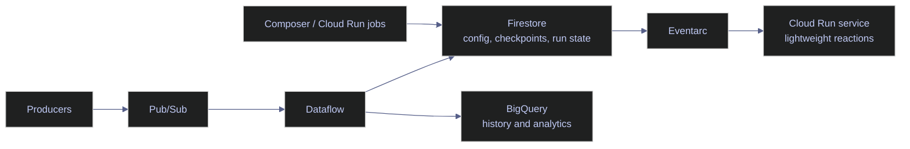

# Real-Time NoSQL Pipelines

> [!quote] Idempotency over wishful thinking
>
> In distributed data systems, at-least-once delivery is normal, so the platform has to make reprocessing safe.
>
> Source: *Data Engineering Design Patterns.pdf*

> [!abstract]- Summary
>
> Covers Firestore-centered real-time pipeline architecture on Google Cloud, defining when Firestore should own current operational state, how it pairs with Eventarc, Pub/Sub, Dataflow, BigQuery, and Composer-style orchestration, and how to keep replay, duplicate delivery, and cost under control.
>
> **Firestore's pipeline role**
> - Places Firestore on the hot operational path as the store for checkpoints, config, run state, idempotency records, leases, and other current control-plane truth
> - Separates state from transport and analytics by pushing replayable messages to Pub/Sub, throughput and transformation to Dataflow, and long-retention history to BigQuery or Cloud Storage
> - Explains why Firestore is a poor fit for full event logs, queue semantics, broad scans, or warehouse-style history even when it is central to the architecture
>
> **Integration patterns and delivery semantics**
> - Compares Firestore + Eventarc + Cloud Run, Firestore + Pub/Sub, Firestore + Pub/Sub + Dataflow, Firestore + BigQuery, and Firestore + Composer / Airflow patterns
> - Covers at-least-once delivery, stable idempotency keys, replay manifests, checkpoints, deduplication windows, and region alignment between Firestore, Eventarc, and Cloud Run
> - Explains cost and scaling boundaries such as per-document reads, index fanout, hotspotting from sequential keys, and why summary documents are cheaper than scanning full run-history collections
>
> **Operational commands and platform readiness**
> - Uses `gcloud services list --enabled` and `gcloud firestore databases describe --database='main'` to verify service prerequisites and confirm the live Firestore location `europe-west1`
> - Shows how to enable missing APIs, create Eventarc triggers with `--event-filters` and `--event-filters-path-pattern`, inspect trigger configuration, and track long-running admin work by captured operation name instead of default-database discovery
> - Includes export and `bulk-delete` workflows for offloading or clearing bounded operational collections such as `pipeline_runs`, `replay_manifests`, and `run_debug_payloads`
>
> **Data engineering patterns**
> - Demonstrates orchestration metadata, backfill tracking, idempotency documents, deduplication state, hot and cold storage splits, and incident recovery markers stored in Firestore while heavier history and transport move elsewhere
> - Captures the current project posture: `firestore.googleapis.com`, `pubsub.googleapis.com`, and `bigquery.googleapis.com` are enabled, while `eventarc.googleapis.com`, `run.googleapis.com`, and `dataflow.googleapis.com` still need project-level enablement
>
> **Operations and safety**
> - Warnings: Eventarc delivery is not exactly-once, trigger and destination regions must align with Firestore location, API enablement is project-wide, `gcloud firestore operations list` is unreliable in this named-database project, and bulk delete is destructive but does not catch later writes
> - Recommendations table: compact current-state documents, stable idempotency keys, TTL on ephemeral collections, BigQuery or Cloud Storage offload, explicit replay workflows, and `schema_version` plus `owner` fields
> - Troubleshooting: 6 failure modes covering missing APIs, duplicate processing, rising Firestore cost, stale state, replay or backfill collisions, and trigger region mismatch

> [!note]- Glossary
>
> **Control-plane store**
> - A store that holds current operational truth such as config, checkpoints, run state, and deduplication decisions rather than the full historical event stream.
> - It is Firestore's intended role in this note because those records need narrow reads, cheap updates, and simple operator visibility.
>
> > [!info] State, not history
> >
> > If the main question is "what is the current answer?" Firestore fits well. If the main question is "scan everything that ever happened," the design has crossed into log or warehouse territory.
>
> ---
>
> **At-least-once delivery**
> - A delivery model where the platform may send the same event more than once to avoid silently losing it.
> - It is the baseline assumption for Eventarc, retries, and downstream handlers in the pipeline patterns shown here.
>
> > [!warning] Duplicates are normal
> >
> > Reliability comes from making repeated processing safe, not from assuming the platform will never retry the same event.
>
> ---
>
> **Eventarc**
> - Google Cloud's event-routing service for CloudEvents, including direct Firestore document events.
> - It is how document mutations can trigger downstream services without polling Firestore for changes.
>
> > [!info] Routes, not queues
> >
> > Eventarc decides where events go. It does not replace Pub/Sub-style buffering, replay, or backpressure control.
>
> ---
>
> **Eventarc trigger**
> - A routing rule that binds event type, database, document path pattern, location, service account, and destination service into one deployable object.
> - It determines which Firestore mutations actually invoke the downstream handler.
>
> > [!warning] Filters define blast radius
> >
> > A loose document path pattern or wrong database filter can trigger on more documents than intended and turn a narrow automation into a broad side effect.
>
> ---
>
> **Pub/Sub**
> - Google Cloud's managed messaging service for asynchronous transport, retention, fan-out, and decoupled delivery.
> - It is the transport layer that should carry events when buffering, replay, or many consumers matter more than current-state reads.
>
> > [!info] Transport with retention
> >
> > Pub/Sub is where messages move between systems. Firestore should store the result or current status, not the queue itself.
>
> ---
>
> **Dataflow**
> - Google Cloud's managed Apache Beam execution service for streaming and batch transformations.
> - It is the throughput engine used when pipelines need windowing, enrichment, or dual writes to hot and cold stores.
>
> > [!info] Dataflow handles throughput
> >
> > Dataflow absorbs volume and transformation complexity so Firestore can stay small and focused on operational state.
>
> ---
>
> **BigQuery offload**
> - Moving detailed operational history or analytical views out of Firestore into BigQuery.
> - It keeps Firestore on the hot operational path while broad scans and trend analysis move to the warehouse.
>
> > [!warning] Do not scan Firestore
> >
> > Firestore charges by document read and is a poor fit for analytical access patterns that BigQuery handles far more efficiently.
>
> ---
>
> **Idempotency key**
> - A stable identifier that represents the business unit of duplicate work, such as one order, one ingestion record, or one replay segment.
> - It lets handlers detect retries and avoid applying the same side effect more than once.
>
> > [!danger] Key shape decides safety
> >
> > If the key tracks a retry attempt instead of the real business action, duplicate protection fails even though the system appears to have idempotency logic.
>
> ---
>
> **Replay**
> - Reprocessing a known range of prior events or records after a bug fix, data repair, or incident.
> - It is a core recovery workflow in this note because event-driven systems need a deliberate path back through historical work.
>
> > [!warning] Source of truth matters
> >
> > Firestore is usually not the replay source itself. Pub/Sub retention, exports, backups, or PITR normally provide the historical source material.
>
> ---
>
> **Replay manifest**
> - A Firestore document that records the replay scope, operator, status, and progress for a controlled reprocessing job.
> - It keeps replay state explicit so backfills and incident recovery can be inspected and coordinated safely.
>
> > [!info] Make replay explicit
> >
> > When replay boundaries live only in scripts or chat messages, it becomes hard to prove what was reprocessed and what still needs attention.
>
> ---
>
> **Watermark / checkpoint**
> - The latest position a pipeline has safely processed, often expressed as an event time, offset, cursor, or document marker.
> - It is one of the cleanest Firestore use cases because one compact document can represent current progress for a pipeline or partition.
>
> > [!warning] One current record
> >
> > Checkpoints work best when they answer one narrow question. If the document starts accumulating full history, it has become the wrong data structure.
>
> ---
>
> **Deduplication window**
> - The period during which repeated idempotency keys are treated as duplicates instead of new work.
> - It controls how long deduplication records must stay in Firestore before TTL can remove them.
>
> > [!warning] Window size trades off
> >
> > A short window misses late duplicates. A long window grows state, cost, and index pressure. The right value depends on actual retry and replay behavior.
>
> ---
>
> **Orchestration metadata**
> - Operational documents that track run status, config, backfill ownership, cutover state, or coordination markers across jobs and operators.
> - It is the shared truth layer that lets Composer, Cloud Run jobs, and humans reason about the same workflow state.
>
> > [!info] Shared operator truth
> >
> > Keeping this metadata in one small store is often simpler than reconstructing current state from logs spread across many services.
>
> ---
>
> **Lease / coordination lock**
> - A short-lived record that claims temporary ownership of a resource, usually with an owner, expiry, and heartbeat field.
> - It prevents backfills, schedulers, or workers from acting on the same unit of work without coordination.
>
> > [!warning] Heartbeat and expiry required
> >
> > A lease without expiry becomes a dead lock after crashes. A lease without ownership metadata is difficult to debug during an incident.
>
> ---
>
> **Dead-letter collection**
> - A Firestore collection that stores failed operational records for later investigation instead of immediate success.
> - It can help with lightweight operator triage when failure volume is small and the focus is state inspection rather than queue semantics.
>
> > [!warning] Not a queue DLQ
> >
> > For high-throughput failure handling, a Pub/Sub dead-letter topic is usually the safer pattern. Firestore dead-letter collections are better for bounded operational review.
>
> ---
>
> **Hot path**
> - The low-latency serving or control path that needs current answers while work is still in flight.
> - It is where Firestore fits best, because small documents and narrow reads make current state cheap to retrieve.
>
> > [!info] Keep documents small
> >
> > Once the hot path depends on broad scans or large payload documents, latency and cost rise together.
>
> ---
>
> **Cold path**
> - The analytical or archival path that owns longer-term history, broad scans, and heavier computation.
> - It is where BigQuery and Cloud Storage should take over from Firestore in the architectures shown here.
>
> > [!info] History belongs here
> >
> > A healthy design moves old or detailed data outward instead of asking Firestore to be both the control plane and the warehouse.
>
> ---
>
> **Named database / `main`**
> - A Firestore database whose ID is not `'(default)'`, such as the `main` database used by the live project in this note.
> - It changes trigger filters, admin commands, and the error modes of tooling that assumes the default database exists.
>
> > [!warning] Default database mismatch
> >
> > In this project, `gcloud firestore operations list` fails because the command assumes `'(default)'`. Database-aware workflows need the real named target.
>
> ---
>
> **TTL / `expires_at`**
> - A retention policy that expires documents based on one timestamp field per collection group, commonly a field such as `expires_at`.
> - It keeps deduplication records, run metadata, and other ephemeral operational collections bounded over time.
>
> > [!warning] Cleanup is asynchronous
> >
> > TTL is for lifecycle management, not urgent deletion. Expired documents can remain visible for a period before Firestore removes them.
>
> ---
>
> **Managed export**
> - A Firestore admin operation that writes selected collection groups to a Cloud Storage prefix for archive, migration, or downstream loading.
> - It is the preferred offload path before aggressive cleanup or before historical analysis moves into BigQuery.
>
> > [!info] Narrow collection scope
> >
> > Export cost is tied to document reads, so exporting only the necessary collection groups keeps both spend and later restore scope under control.
>
> ---
>
> **Bulk delete**
> - A managed Firestore operation that removes documents from named collection groups without writing custom deletion code.
> - It is the exceptional cleanup mechanism for large bounded collections when TTL is too slow or insufficient.
>
> > [!danger] Later writes survive
> >
> > Documents added or modified after the delete operation starts are not part of that operation. Cleanup plans still need verification and sometimes a second pass.
>
> ---
>
> **Operation name / `OPERATION_NAME`**
> - The identifier returned by long-running Firestore admin commands such as export, import, restore, or bulk delete.
> - It is the handle needed to inspect progress later when operation-list discovery is unreliable.
>
> > [!warning] Persist returned handle
> >
> > Capture the operation name in the change record or incident ticket at the moment the command starts. Rediscovery later is often harder than expected.

> [!example] Pipeline Role Fit
>
> > [!success] Appropriate
> >
> > - Use Firestore in a real-time pipeline when it stores current control-plane state such as checkpoints, replay manifests, deduplication records, run status, or lease ownership.
> > - Use it when document changes should trigger lightweight downstream reactions and the payload of interest is small, current, and operational rather than historical.
> > - Use it when Pub/Sub, Dataflow, or BigQuery already own transport, throughput, and long-term analysis, and Firestore only needs to expose the latest state.
>
> > [!failure] Inappropriate
> >
> > - Do not treat Firestore as the main event bus, replay source, or durable queue; those responsibilities belong in Pub/Sub, Cloud Storage, or other transport layers.
> > - Do not assume the architecture becomes exactly-once because Firestore is involved; retries, duplicate delivery, and idempotency design still have to be handled explicitly.
> > - Do not keep broad historical collections in Firestore just because they began as operational state; offload aged or analytical data before read cost and index pressure accumulate.

## Mental Model / Architecture Model

Firestore belongs in the hot operational path. Pub/Sub and Dataflow carry or transform events. BigQuery holds analytical history. Eventarc reacts to document mutations when the state store itself becomes the trigger.



The intent is deliberate:

- Firestore holds current truth.
- Pub/Sub holds transport pressure.
- Dataflow handles throughput and transformation.
- BigQuery holds analysis and long retention.
- Eventarc reacts to state changes without polling.

## Core Concepts

These concepts explain when Firestore earns a place in a real pipeline and when it should step aside.

### Firestore | pipeline role | what Firestore should own

Firestore is strongest when it stores the current operational answer to a narrow question.

| Pipeline responsibility | Firestore fit | Why |
|---|---|---|
| Current pipeline run state | Strong fit | One document can represent one run, one task, or one entity's latest state |
| Pipeline checkpoint or watermark | Strong fit | Small writes, frequent reads, simple recovery logic |
| Config registry or feature flags | Strong fit | Operators update one document and services reread it cheaply |
| Idempotency register | Strong fit for bounded windows | Small keyed documents with TTL are straightforward |
| Full event log | Weak fit | Event history belongs in Pub/Sub, Cloud Storage, or BigQuery |
| Warehouse-style history analytics | Weak fit | Firestore read pricing and query model are the wrong fit |

The recurring rule is that Firestore should own state, not transport and not large-scale history.

### Firestore | integration patterns | picking the right companion service

The service pair matters more than whether Firestore is present at all.

| Pattern | Use it when | Firestore responsibility | Companion responsibility |
|---|---|---|---|
| **Firestore + Eventarc + Cloud Run** | A document change should trigger lightweight downstream work | Holds the current state that emits the event | Eventarc routes; Cloud Run performs the reaction |
| **Firestore + Pub/Sub** | Producers and consumers must be decoupled and transport needs buffering or replay | Holds current config, dedup state, or job status | Pub/Sub carries messages and fan-out |
| **Firestore + Pub/Sub + Dataflow** | Throughput is too high for Firestore to be the transport layer and you need windowing or dual writes | Holds serving summaries, checkpoints, or control-plane state | Dataflow transforms and writes hot and cold outputs |
| **Firestore + BigQuery** | You need fast current state plus cheap analytical history | Holds hot operational truth | BigQuery stores detailed or long-term history |
| **Firestore + Composer / Airflow** | Orchestration needs globally visible job state, config, or backfill markers | Holds orchestration metadata and run coordination | Composer schedules and executes the workflows |

### Firestore | delivery semantics | duplicates, ordering, and replay

Real-time and event-driven systems fail when teams pretend delivery is cleaner than it really is.

| Concern | Firestore alone | Better boundary |
|---|---|---|
| Exactly-once processing | Not guaranteed | Make writes idempotent and store dedup keys |
| Ordered event history | Weak | Use Pub/Sub or a stream transport with retention semantics |
| Broad replay | Weak | Use Pub/Sub retention, exports, backups, or PITR |
| Low-latency current state | Strong | Keep one current document per entity or workflow |

Operationally, this means:

- Assume Eventarc and retrying services can cause duplicate deliveries.
- Use a stable idempotency key and write-side checks that are safe to repeat.
- Keep replay manifests and checkpoints explicit.
- Treat Firestore as the record of current progress, not the replay source of truth.

### Firestore | cost and scaling | keeping the hot path cheap

Firestore's cost model rewards narrow reads and bounded history. It punishes broad scans and unnecessary index fanout.

| Cost or scaling driver | Pipeline mistake | Better pattern |
|---|---|---|
| Document reads billed per document | Scanning a whole run-history collection for dashboards | Write one summary document per pipeline and read that |
| Index fanout | Indexing every timestamp and large array in a high-write collection | Exempt non-query fields and keep document shapes compact |
| Hotspotting | Sequential document IDs or lexicographically narrow writes | Scatter IDs and shard high-rate counters or state |
| Listener misuse | Long-lived backend listeners where an event transport would be clearer | Use Eventarc or Pub/Sub for server-side event flow |

## Operational Commands And Workflows

The commands below focus on platform readiness and integration boundaries, not SDK code. They use the live project `bq-wh-nb` and the live Firestore database `main` where read-only verification was possible.

### PowerShell / Linux | gcloud | verify live pipeline prerequisites

Event-driven Firestore patterns fail most often because required services were never enabled or the trigger location does not match the database location.

#### List enabled APIs relevant to Firestore-driven pipelines

**When to run:** Before designing or deploying Firestore-triggered or Firestore-fed pipeline components.
**Trigger:** You need to know whether the project can currently support Eventarc, Cloud Run, Pub/Sub, Dataflow, and BigQuery integration patterns.
**Context:** `gcloud` CLI, read-only.
**Purpose:** Surface the service APIs that are already enabled so you can distinguish platform readiness from application errors.

| Field | Source column | Type | Meaning |
|---|---|---|---|
| `name` | `name.basename()` | string | Enabled service API relevant to the pipeline pattern |

*List the enabled service APIs that matter most for Firestore-driven pipelines in the active project.*

```bash
gcloud services list --enabled \
  --filter="name:(firestore.googleapis.com OR eventarc.googleapis.com OR run.googleapis.com OR pubsub.googleapis.com OR dataflow.googleapis.com OR bigquery.googleapis.com)" \
  --format="table(name.basename())"
```

| NAME |
|---|
| `bigquery.googleapis.com` |
| `firestore.googleapis.com` |
| `pubsub.googleapis.com` |

From this live output, the current project is ready for Firestore, Pub/Sub, and BigQuery patterns, but Eventarc, Cloud Run, and Dataflow are not enabled yet.

#### Confirm the Firestore database location before creating triggers

**When to run:** Before creating Eventarc triggers, Cloud Run services, or cross-service wiring that depends on regional placement.
**Trigger:** You are about to create an Eventarc trigger or reason about latency between Firestore and compute.
**Context:** `gcloud` CLI, read-only.
**Purpose:** Confirm the Firestore database location so downstream services can be co-located correctly.

*Print the location of the live `main` Firestore database.*

```bash
gcloud firestore databases describe \
  --database='main' \
  --format="value(locationId)"
```

```text
europe-west1
```

For Firestore direct events, the trigger location and destination region should be chosen with this database location in mind.

#### Enable the missing APIs for Eventarc and Dataflow patterns

**When to run:** After verifying the project is missing Eventarc, Cloud Run, or Dataflow and before attempting to create triggers or launch streaming jobs.
**Trigger:** The service list shows the platform is not provisioned for the desired integration pattern.
**Context:** `gcloud` CLI, state-changing. Requires permission to enable services in the project.
**Purpose:** Provision the project-level APIs needed for Eventarc-triggered reactions and Dataflow-based processing.

> [!warning] API enablement is a project-wide mutation
>
> Before running this command, verify:
>
> - The active project is correct.
> - You intend to support Eventarc, Cloud Run, and Dataflow in this project.
> - Billing and IAM are already aligned for those services.

> [!success] Enable only what the pattern actually needs
>
> If the pattern is just Firestore plus BigQuery export, you may not need Eventarc or Dataflow at all. Keep the project surface area intentional.

*Enable the APIs still missing for Firestore-triggered Cloud Run workflows and Dataflow processing.*

```bash
gcloud services enable \
  eventarc.googleapis.com \
  run.googleapis.com \
  dataflow.googleapis.com
```

After running the command, repeat the enabled-services inspection and confirm the missing APIs now appear.

| Flag | Syntax | Description |
|---|---|---|
| `--enabled` | `gcloud services list --enabled` | Restricts service listing to enabled APIs |
| `--filter` | `--filter="name:(...)"` | Narrows output to the APIs relevant to the pipeline pattern |
| `--format` | `--format="table(name.basename())"` | Produces readable, script-safe output |
| `--database` | `--database='main'` | Targets the named Firestore database |

### PowerShell / Linux | gcloud | create and inspect Eventarc-triggered Firestore workflows

Use this pattern when a document write itself is the event boundary and the downstream work is lightweight enough that Firestore should remain the control-plane source of truth.

#### Create a Firestore document-written trigger for Cloud Run

**When to run:** After enabling Eventarc and Cloud Run and after the destination service already exists.
**Trigger:** A write to a specific Firestore path such as `pipeline_runs/{runId}` should start a serverless reaction.
**Context:** `gcloud` CLI, state-changing. Requires Eventarc admin permissions and a service account that can invoke the destination service.
**Purpose:** Route Firestore document mutations into a Cloud Run service without a polling loop.

> [!warning] Location and identity must line up
>
> Before running the trigger creation command, verify:
>
> - The Firestore database location is `europe-west1`.
> - The Cloud Run service exists in `europe-west1`.
> - The service account has permission to invoke the Cloud Run service.
> - The Firestore document path pattern matches only the documents you intend to react to.

> [!success] Keep Eventarc handlers idempotent
>
> Direct document events are not a guarantee of exactly-once processing. The Cloud Run handler should be able to repeat the same work safely when retries occur.

*Create a trigger that routes writes to `pipeline_runs/{runId}` in database `main` into a Cloud Run service named `pipeline-run-handler`.*

```bash
gcloud eventarc triggers create firestore-pipeline-runs-written \
  --location='europe-west1' \
  --destination-run-service='pipeline-run-handler' \
  --destination-run-region='europe-west1' \
  --event-filters="type=google.cloud.firestore.document.v1.written" \
  --event-filters="database=main" \
  --event-filters-path-pattern="document=pipeline_runs/{runId}" \
  --event-data-content-type='application/protobuf' \
  --service-account='eventarc-firestore@bq-wh-nb.iam.gserviceaccount.com'
```

After creating the trigger, use `gcloud eventarc triggers list --location='europe-west1'` to confirm it exists and `gcloud eventarc triggers describe firestore-pipeline-runs-written --location='europe-west1'` to inspect the bound filters.

#### Track long-running Firestore admin operations safely

**When to run:** During exports, imports, restores, or bulk deletes that have been started asynchronously.
**Trigger:** You need to verify progress or keep the operation name for later review.
**Context:** `gcloud` CLI. The initiating command returns or logs the operation name. In the current live project, `gcloud firestore operations list` errors because the project uses the named database `main` instead of `'(default)'`.
**Purpose:** Keep long-running admin work observable without assuming project defaults that are wrong for this environment.

> [!warning] Do not rely on `operations list` in this project
>
> The live project uses the named database `main`, and `gcloud firestore operations list` currently errors because it assumes `'(default)'`.
>
> Capture the operation name from the command that started the export, import, restore, or bulk delete.

> [!success] Keep the operation name with the incident or change record
>
> When you run an asynchronous Firestore admin command, persist the returned operation name in your ticket, runbook, or deployment log so it can be checked later without rediscovery.

*Describe one Firestore admin operation by operation name returned from the initiating command.*

```bash
gcloud firestore operations describe OPERATION_NAME
```

| Flag | Syntax | Description |
|---|---|---|
| `--location` | `--location='europe-west1'` | Chooses the Eventarc trigger location |
| `--destination-run-service` | `--destination-run-service='pipeline-run-handler'` | Names the Cloud Run service to invoke |
| `--destination-run-region` | `--destination-run-region='europe-west1'` | Chooses the Cloud Run region |
| `--event-filters` | `--event-filters="database=main"` | Adds exact-match event attributes such as event type or database |
| `--event-filters-path-pattern` | `--event-filters-path-pattern="document=pipeline_runs/{runId}"` | Binds the trigger to a document path pattern |
| `--event-data-content-type` | `--event-data-content-type='application/protobuf'` | Sets the Firestore direct-event payload encoding |
| `--service-account` | `--service-account='eventarc-firestore@bq-wh-nb.iam.gserviceaccount.com'` | Specifies the identity Eventarc uses to invoke the destination |

### PowerShell / Linux | gcloud | offload history and analytical workloads

The clean Firestore pattern is to keep current operational truth in Firestore and move detail history elsewhere.

#### Export operational history for BigQuery or offline processing

**When to run:** Before historical analysis, before deleting old records, or when building a warehouse view of operational metadata.
**Trigger:** Firestore is holding data that is still useful, but no longer belongs on the low-latency hot path.
**Context:** `gcloud` CLI, state-changing. Requires a real Cloud Storage bucket, billing, and appropriate permissions.
**Purpose:** Snapshot operational history into a portable format that can be loaded into BigQuery or archived in Cloud Storage.

> [!warning] Export is billed and should be scoped
>
> Firestore export incurs one read operation per exported document. Export only the collection groups you actually need.

> [!success] Export before aggressive cleanup
>
> If you plan to delete old run history, backfill manifests, or deduplication records, export them first so historical analysis and forensics do not disappear with the cleanup.

*Export `pipeline_runs` from the live `main` database to a verified Cloud Storage prefix.*

```bash
gcloud firestore export 'gs://YOUR_EXISTING_BUCKET/firestore/main/pipeline-runs-2026-04-13' \
  --database='main' \
  --collection-ids='pipeline_runs'
```

Firestore documentation explicitly notes that managed Firestore exports can be loaded into BigQuery. Keep the export narrow and let BigQuery own the analytical use case.

#### Run a managed bulk delete for bounded operational collections

**When to run:** When TTL is insufficient for urgency, or when you need a controlled cleanup of one or more operational collection groups.
**Trigger:** A collection group such as `replay_manifests` or `run_debug_payloads` must be cleared in bulk.
**Context:** `gcloud` CLI, state-changing. Requires billing and Firestore bulk admin permission.
**Purpose:** Delete large operational data sets without writing custom deletion code.

> [!danger] Bulk delete is destructive and not retroactive to later writes
>
> Firestore's managed bulk delete service deletes documents that match when the operation starts. Documents added or modified after the operation begins are not part of that delete set.

> [!success] Use bulk delete for exceptional cleanup, not as your normal lifecycle policy
>
> For steady-state operations, prefer TTL on bounded collections and export-plus-archive for long retention. Reserve bulk delete for controlled cleanup events.

*Bulk delete two explicitly named collection groups from the `main` database.*

```bash
gcloud firestore bulk-delete \
  --database='main' \
  --collection-ids='replay_manifests','run_debug_payloads'
```

Track the operation using the operation name returned by the initiating command. In this named-database project, do not rely on `gcloud firestore operations list` as the discovery step.

| Flag | Syntax | Description |
|---|---|---|
| `--database` | `--database='main'` | Targets the named Firestore database |
| `--collection-ids` | `--collection-ids='pipeline_runs'` | Restricts export or bulk delete to selected collection groups |

## Warnings, Limitations, And Anti-Patterns

These are the ways teams accidentally turn Firestore from a clean state service into a confused pseudo-stream or pseudo-warehouse.

### Firestore | anti-patterns | common pipeline design mistakes

| Anti-pattern | Why it breaks down | Better pattern |
|---|---|---|
| Using Firestore as the event bus | No native replay, backpressure, or queue semantics | Use Pub/Sub for transport and Firestore for state |
| Treating Eventarc delivery as exactly-once | Retries and duplicates happen | Make handlers idempotent and store dedup keys |
| Streaming large analytical history out of Firestore for dashboards | Costs rise with document reads and scans | Materialize summaries in Firestore and move history to BigQuery |
| Long-lived backend listeners for server orchestration | Harder to reason about lifecycle and cost than explicit events | Use Eventarc or Pub/Sub for server-side reactions |
| Keeping ephemeral collections forever | Firestore becomes a graveyard of old operational metadata | Add TTL, export history, and keep retention bounded |
| Writing every event as a large document with sequential IDs | Hotspots, index fanout, and rising write latency | Use scattered IDs, smaller documents, and companion services for heavy history |

### Firestore | platform boundary | what Firestore should not pretend to be

> [!warning] Firestore is not the entire pipeline
>
> Firestore is excellent at current state and lightweight operational metadata.
> It is not:
>
> - A replayable message broker
> - A warehouse for broad scans
> - A durable log of every event forever
> - A substitute for BigQuery, Pub/Sub, or Dataflow

> [!success] Keep responsibilities clean
>
> A maintainable design usually looks like this:
>
> - Pub/Sub for transport
> - Dataflow for throughput and transformation
> - Firestore for current control-plane truth
> - BigQuery for analytical and historical views

## Recommendations And Best Practices

These defaults keep Firestore useful in pipelines instead of letting it absorb responsibilities it should not own.

### Firestore | production defaults | high-signal operating guidance

| Recommendation | Why it matters |
|---|---|
| Keep one compact current-state document per pipeline, entity, or workflow boundary | This makes reads cheap and the control plane easy to reason about |
| Add a stable idempotency key to every event-driven write path | Retries and duplicate delivery become safe instead of dangerous |
| Put `expires_at` on ephemeral operational collections | TTL keeps transient metadata bounded |
| Store detailed history outside Firestore | BigQuery or Cloud Storage handle analytical retention far better |
| Use Firestore for summary documents, not for every raw event | This reduces read cost and index pressure |
| Keep region choice explicit and co-locate compute when possible | Trigger and write latency depend on location alignment |
| Make replay workflows explicit with manifests and checkpoints | Incident recovery is easier when replay state is first-class |
| Use `schema_version` and `owner` fields on operational documents | These fields reduce ambiguity during migrations and incidents |

## Data Engineering Scenarios

The scenarios below are the practical patterns that fit Firestore well in real pipelines.

### Firestore | orchestration metadata | Composer, Cloud Run jobs, and control loops

When multiple schedulers, jobs, or operators need the same current operational truth, Firestore is a clean coordination store.

| Use case | Document pattern | Notes |
|---|---|---|
| Current DAG or job status | `pipeline_runs/{run_id}` | Good for operator dashboards and current failure triage |
| Shared runtime config | `config/{pipeline_name}` | Read at job start and optionally cache with a short TTL in memory |
| Backfill coordination | `backfills/{backfill_id}` | Track state, owner, time range, and current phase |
| Lease or coordination lock | `leases/{resource_id}` | Add owner, expiry, and last heartbeat fields |

*Example orchestration metadata document for a backfill run.*

```json
{
  "schema_version": 1,
  "pipeline": "daily-stocks-ingest",
  "backfill_id": "bf-2026-04-q2",
  "status": "running",
  "range_start": "2026-04-01T00:00:00Z",
  "range_end": "2026-04-07T23:59:59Z",
  "owner": "composer/dag-data-platform-backfill",
  "updated_at": "2026-04-13T12:00:00Z",
  "expires_at": "2026-05-13T12:00:00Z"
}
```

### Firestore | idempotency and deduplication | safe repeat processing

This is where Firestore often earns its keep in event-driven systems: one compact document per deduplication decision.

| Pattern | Firestore role | What to watch |
|---|---|---|
| Idempotency key register | Stores one record per processed business key | Add TTL so the set stays bounded |
| Replay manifest | Stores the replay window, operator, and status | Separate replay state from the main checkpoint |
| Deduplication token | Stores the key and processing result | Make sure the key represents the business duplicate boundary |

*Example idempotency document for an event-driven ingestion path.*

```json
{
  "schema_version": 1,
  "idempotency_key": "orders:2026-04-13T11:30:00Z:order-88123",
  "status": "applied",
  "applied_at": "2026-04-13T11:30:07Z",
  "producer": "pubsub/topic/orders",
  "consumer": "cloud-run/order-normalizer",
  "expires_at": "2026-04-20T11:30:07Z"
}
```

### Firestore | hot and cold split | keeping the right data in the right store

This pattern avoids the common mistake of keeping every operational detail in Firestore forever.

| Layer | Best store | What belongs there |
|---|---|---|
| Hot operational state | Firestore | Current config, checkpoint, run status, dedup keys |
| Transport and fan-out | Pub/Sub | Messages and delivery buffering |
| Stream or batch transformation | Dataflow | Windowing, enrichment, dual writes, high-throughput transforms |
| Historical analytics | BigQuery | Trend analysis, audits, cost analysis, long-term run history |
| Large artifacts or raw payloads | Cloud Storage | Export files, payload archives, replay bundles |

### Firestore | incident recovery | replay, restore, and rollback markers

Incidents are easier when recovery state is explicit instead of implied in logs or in someone's memory.

| Recovery concern | Firestore role | Companion control |
|---|---|---|
| Track what was replayed | Store a replay manifest document | Use Pub/Sub retention, export, backup, or PITR as the replay source |
| Track whether the recovered state is validated | Store a restore-validation document | Use a new restored database and application checks before cutover |
| Coordinate rollback or cutover | Store cutover state and owner | Pair with runbooks and deployment approvals |

## Troubleshooting And Common Failures

Most operational failures are one of five things: prerequisites missing, location mismatch, duplicate delivery, state drift, or cost drift.

### Firestore | pipeline failure modes | symptoms, confirmation, and action

| Symptom | Likely cause | How to confirm | Action |
|---|---|---|---|
| Eventarc trigger never fires | Eventarc or Cloud Run API not enabled, or trigger path mismatch | Re-run the enabled-service check and inspect trigger filters | Enable missing APIs and fix the document path pattern |
| Duplicate downstream processing | At-least-once delivery plus non-idempotent handler | Inspect dedup or side-effect records | Add or fix the idempotency key path |
| Firestore costs rise unexpectedly | Broad scans, large run-history collections, or excessive indexing | Review collection size, query shapes, and index config | Move history to BigQuery, add TTL, exempt non-query fields |
| Pipeline state looks stale | Jobs are not updating current-state documents consistently | Compare pipeline logs and the summary documents | Make state updates explicit and durable at key workflow boundaries |
| Backfill collides with live processing | Shared state has no explicit lease or replay boundary | Inspect backfill manifest, checkpoint, and lease documents | Add leases, replay manifests, and ownership fields |
| Trigger creation fails by region | Trigger or Cloud Run service is not aligned to Firestore location | Re-check `gcloud firestore databases describe --database='main'` | Align trigger location and service region to `europe-west1` |

## Decision Matrix Or When-To-Use Guidance

Use this matrix to choose the right Firestore-centered pattern.

| Need | Recommended pattern | Why |
|---|---|---|
| React to a document change with lightweight work | Firestore + Eventarc + Cloud Run | The state change itself is the event boundary |
| Buffer and fan out many events | Pub/Sub + Firestore state | Pub/Sub handles transport while Firestore stores current state |
| High-throughput streaming with hot and cold outputs | Pub/Sub + Dataflow + Firestore + BigQuery | Each service owns the layer it is best at |
| Current orchestration metadata across jobs and operators | Firestore + Composer / Cloud Run jobs | Firestore is a simple shared control-plane store |
| Historical analysis of run data | Firestore export or dual-write to BigQuery | BigQuery is the analytical destination |

## Quick Reference

The table below summarizes the live project readiness discovered from read-only inspection on 2026-04-13.

| Item | Current value | Operational implication |
|---|---|---|
| Active project | `bq-wh-nb` | All default `gcloud` commands target this project unless overridden |
| Firestore database | `main` | Trigger and admin commands must target a named database |
| Firestore location | `europe-west1` | Eventarc and Cloud Run placement should align with this region |
| Enabled relevant APIs | `firestore.googleapis.com`, `pubsub.googleapis.com`, `bigquery.googleapis.com` | Firestore, Pub/Sub, and BigQuery patterns are currently platform-ready |
| Missing relevant APIs | `eventarc.googleapis.com`, `run.googleapis.com`, `dataflow.googleapis.com` | Eventarc and Dataflow patterns need project-level provisioning first |

The shortest safe integration checklist is:

1. Confirm the active project and named Firestore database.
2. Confirm the Firestore location.
3. Confirm the required service APIs are enabled.
4. Confirm the destination service account and region.
5. Only then create triggers, exports, or bulk operations.
