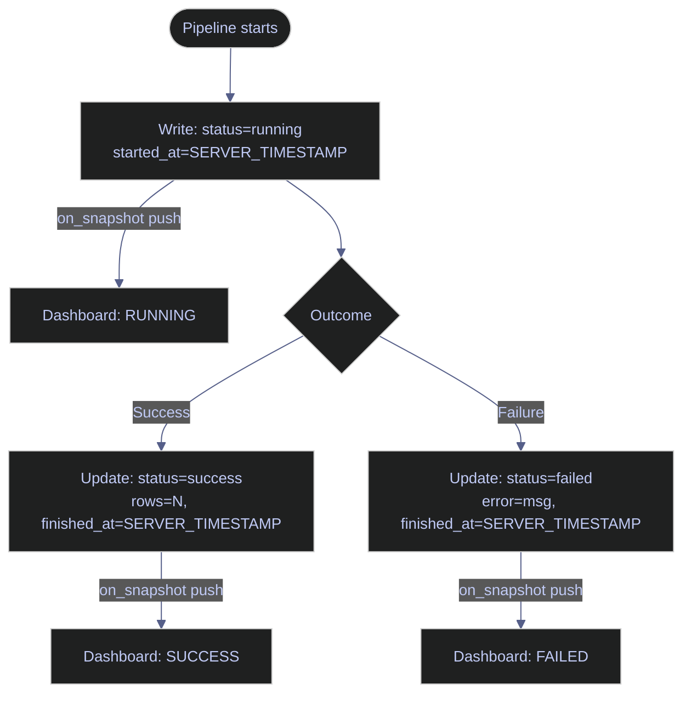
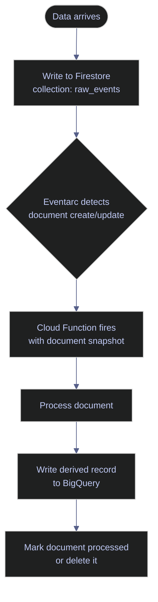
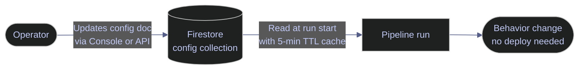
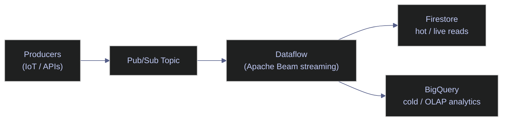

# Real-Time NoSQL Pipelines on GCP

> [!quote] On distributed systems
> "There are only two hard problems in distributed systems: 2. Exactly-once delivery 1. Guaranteed order of messages 2. Exactly-once delivery"
>
> — **Mathias Verraes**, conference talk (widely cited)

Firestore is a serverless, fully managed document database that occupies a specific niche in the GCP data stack: low-latency reads and writes, flexible schema, and native real-time listeners that push changes to clients without polling. This note covers how to use Firestore as the connective tissue of data pipelines — tracking state, reacting to events, driving configuration, and acting as a hot-tier store alongside BigQuery and Pub/Sub.

> [!tip] Scope
>
> This is not a Firestore CRUD tutorial. The focus is on **pipeline architecture patterns**: when Firestore earns its place, how to integrate it with other GCP services, and the full Python code required to do so production-ready.

---

## Key Terms Used in This Note

| Term | Plain-English definition | Why it matters here | Common mistake / confusion |
|---|---|---|---|
| **Firestore Native mode** | Firestore's primary operating mode with strong consistency, real-time listeners, and collection-group queries. Distinct from Datastore mode (legacy compatibility layer). | All patterns in this note require Native mode. Mode cannot be changed after database creation. | Confusing Native mode with Datastore mode — they have different APIs, CMEK support, and consistency models. |
| **Document** | The basic storage unit in Firestore — a JSON-like object with named fields. Max size 1 MB. Identified by a path like `collection/doc_id`. | Every pipeline run, config value, and alert is stored as a document. | Trying to store large blobs (logs, binary data) inside documents instead of GCS. |
| **Collection** | A named container holding documents. Collections are flat — they do not have their own fields. A collection at the root of the database is a "root collection." | `pipeline_runs`, `config`, `stocks`, `alerts` are all root collections. | Thinking of collections like SQL tables — collections have no schema, no row count, no aggregate operations. |
| **Subcollection** | A collection nested inside a document (e.g., `pipelines/{name}/runs/{id}`). Each document in the hierarchy can have its own subcollections. | Some state patterns use subcollections to scope runs per pipeline. The live `bq-wh-nb` instance uses a flat root collection instead. | Using subcollections when a root collection + filter is simpler and cheaper. |
| **`on_snapshot()`** | A Firestore Python SDK method that registers a persistent listener. Firestore pushes change events (ADDED, MODIFIED, REMOVED) to the callback without the client polling. | Powers real-time dashboard updates and the CDC pattern (Pattern 5). | Thinking the listener is a one-shot query — it runs indefinitely and must be deployed as a long-running process. |
| **Eventarc** | A GCP managed event routing service that converts Firestore document mutations into CloudEvents and delivers them to Cloud Functions or Cloud Run. Requires `eventarc.googleapis.com` to be enabled. | Pattern 2 (event-driven processing) depends on Eventarc. Note: this API is not enabled in `bq-wh-nb`. | Confusing Eventarc triggers with Pub/Sub subscriptions — they are separate APIs with different retry semantics. |
| **CDC (Change Data Capture)** | A technique for capturing every row-level insert, update, and delete from a data source as a stream of change events, in order. Unlike polling, CDC intercepts hard deletes and does not re-read unchanged rows. | Pattern 5 uses Firestore's `on_snapshot()` as a CDC mechanism to propagate changes to BigQuery. | Implementing CDC as polling (`stream()` every N seconds) — this misses deletes and generates unnecessary read costs. |
| **Composite index** | A Firestore index covering two or more fields, required when a query combines a `.where()` filter on one field and an `.order_by()` on a different field. Must be created explicitly. | The ordered-failures query on `pipeline_runs` (filter `status`, order `started_at`) requires a composite index — `CICAgJiUsZIK` created in `bq-wh-nb/main`. | Running a combined filter+order query without the index: Firestore returns `FAILED_PRECONDITION` with the index creation URL in the error message. |
| **TTL policy** | A Firestore configuration that automatically deletes documents after a specified timestamp field (`expires_at`) passes. Deletions lag up to 24 hours after the expiry time. | Prevents unbounded growth of `pipeline_runs` historical records. TTL is active on `bq-wh-nb/main`. | Using TTL for security-sensitive deletion — the 24-hour lag means documents are not immediately removed. |
| **`SERVER_TIMESTAMP`** | A Firestore sentinel value that, when written, is replaced by the server's current timestamp (not the client clock). Prevents clock skew across distributed pipeline workers. | All `started_at` and `finished_at` fields should use `SERVER_TIMESTAMP`, not `datetime.now()`. | Using `datetime.now(timezone.utc)` for timestamps — client clocks can drift, causing incorrect ordering in queries. |
| **FieldFilter** | The modern Firestore SDK class for `.where()` conditions (replaces the legacy three-argument form). Import from `google.cloud.firestore_v1.base_query`. | Used in all query methods in `FirestoreStateManager`. | Using the deprecated `where("field", "==", "value")` string form — produces deprecation warnings in SDK ≥ 2.11. |
| **ADC (Application Default Credentials)** | A GCP credential resolution chain: (1) `GOOGLE_APPLICATION_CREDENTIALS` env var, (2) gcloud user credentials, (3) GCE/Cloud Run/GKE metadata server. The Firestore client library uses ADC automatically when no credentials are passed. | Enables zero-config authentication on Cloud Run and GKE. | Passing explicit SA key file paths in production code — creates a credential management burden and exfiltration risk. |
| **Batch write** | A Firestore `db.batch()` operation that groups up to 500 document mutations (set/update/delete) into a single committed transaction over one network round-trip. Each operation is still billed individually. | Used to archive completed pipeline runs efficiently. | Confusing batch writes with transactions — batches do not support reads; transactions do. |
| **Dead-letter collection** | A Firestore collection (e.g., `dead_letter`) that stores documents that failed processing after the maximum retry count. Acts as a manual review queue. | Pattern 2 moves unprocessable events here after `MAX_RETRIES` attempts. | Silently discarding failed documents — always persist them for inspection and reprocessing. |

---

## When to Use Real-Time NoSQL Pipelines

Choosing the right data service requires matching workload characteristics to service strengths. This section defines the latency tiers, identifies the scenarios where Firestore earns its place, and lists the cases where another GCP service is a better choice.

### Pipelines | Batch vs Near-Real-Time vs Real-Time

Understanding the latency expectations of each paradigm prevents overengineering and helps justify infrastructure choices to stakeholders.

| Paradigm | Typical Latency | Trigger Mechanism | Canonical GCP Stack |
|---|---|---|---|
| Batch | Minutes to hours | Scheduled (Cloud Scheduler, Airflow) | Cloud Storage → BigQuery |
| Near-real-time | 30 seconds to 5 minutes | Micro-batch, polling | Pub/Sub → Dataflow (fixed windows) |
| Real-time (streaming) | Sub-second to seconds | Event-driven, push | Pub/Sub → Dataflow (streaming) |
| Operational reads | < 10 ms | Client pull / server push | Firestore (direct read or listener) |

Most pipeline metadata use cases (dashboards, alerting, config) need **operational read latency**, not streaming throughput. This is where Firestore fits naturally.

> [!warning] Latency vs. Throughput
>
> Real-time latency does not mean high throughput. Firestore is optimized for low-latency access to individual documents and small query sets, not for scanning millions of rows per second. If you need both, use Firestore for hot operational data and BigQuery for the analytical layer.

> [!success] Use the Dual-Tier Pattern
>
> Write operational state to Firestore (hot path, <10 ms reads) and stream aggregated or historical data to BigQuery (cold path, analytics). Dataflow or a Cloud Function bridges the two tiers. See Pattern 4 in this note.

---

### Firestore | Use Cases Where Firestore Fits

**Pipeline orchestration state — dashboards showing live pipeline progress**
When an Airflow DAG or Cloud Run job executes, it writes structured state documents to Firestore. A web dashboard subscribes via `on_snapshot()` or REST, showing current status without polling. This avoids the N+1 query problem against a relational metadata store.

**Feature stores for ML serving — low-latency feature lookup**
Precomputed features written asynchronously during batch jobs are read synchronously at inference time. Firestore delivers sub-10 ms p99 on document reads with the right data model (one document per entity key).

**Configuration management — change config, immediate effect**
A Firestore document holds operational parameters: quality thresholds, email recipients, feature flags, schedule overrides. Operators update the document; the next pipeline run reads the new values without a code deploy or restart.

**Operational metadata — alert states, SLA tracking, run history**
Alert deduplication state, SLA countdown timers, and run history records are small documents with high write frequency and low read fan-out. Firestore's strong consistency within a document makes it suitable.

**Real-time serving layer**
Gold scores computed in BigQuery are written to Firestore (`stocks` collection) so dashboards can read them with sub-10 ms latency, instead of querying BigQuery every time (which costs money and takes seconds).

---

### Firestore | Use Cases Where Firestore Does NOT Fit

| Requirement | Problem with Firestore | Use Instead |
|---|---|---|
| Heavy analytics (aggregations, full scans) | No columnar storage; expensive per-read pricing for large result sets | [BigQuery](https://alp78.github.io/elysium/06-GCP/03-BigQuery/03-querying-and-cost-optimization) |
| High-throughput time-series (millions of writes/sec) | Per-document write limit (1/sec), collection-level limits | Bigtable |
| Complex joins and multi-table transactions | No joins; transactions limited to 500 documents | Cloud SQL / AlloyDB |
| Message queuing, fan-out, backpressure | No queue semantics, no native dead-letter support | [Pub/Sub](https://alp78.github.io/elysium/06-GCP/02-Serverless/02-pubsub-topics-and-subscriptions) |
| Large blob storage | Documents capped at 1 MB | [Cloud Storage](https://alp78.github.io/elysium/06-GCP/01-Storage/01-gcs-buckets-and-lifecycle) |
| Relational integrity with foreign keys | No enforced referential integrity | Cloud SQL |

> [!danger] The Expensive Anti-Pattern
>
> Using Firestore as an analytics database — running `collection.stream()` over tens of thousands of documents to compute aggregations — generates enormous read costs with no performance advantage over a SQL query. Materialize aggregations into dedicated summary documents or export to BigQuery instead.

> [!success] Materialize Aggregations or Export to BigQuery
>
> For counts and sums, use Firestore's server-side `count()` / `sum()` aggregation queries (billed as a single read). For complex analytics, schedule a daily `gcloud firestore export` to GCS and load into BigQuery with `bq load --source_format=DATASTORE_BACKUP`. Never stream the full collection to Python just to aggregate.

---

## Architecture Patterns

Five canonical patterns for using Firestore in data pipelines, ordered by complexity.

### Pattern 1 | Pipeline State Store

The pipeline writes a document at the start of execution and updates it on completion or failure. Dashboard subscribers receive server-push updates via `on_snapshot()` within milliseconds of each state change — no polling endpoint, no separate metadata database.



The live `bq-wh-nb/main` database uses the collection path `pipeline_runs/{run_id}` — a flat root collection with a `pipeline` field to distinguish pipelines, rather than subcollections.

#### Query recent failures from `bq-wh-nb/main`

**When to run:** During incident triage or routine post-mortem review of pipeline failures.
**Trigger:** Alert fires on failed pipeline run, or operator opens the monitoring dashboard.
**Context:** Python REPL or script using `google-cloud-firestore` SDK; read-only; requires `roles/datastore.viewer` or higher. Requires composite index `CICAgJiUsZIK` on `(status ASC, started_at DESC)`.
**Purpose:** Return the ten most recent failed runs across all pipelines, ordered newest-first, to identify patterns in failure timing and affected steps.

> [!info]- Index requirement and creation
>
> Any query combining `.where()` on one field and `.order_by()` on a different field requires a composite index. Without it, Firestore returns `FAILED_PRECONDITION` and includes the index creation URL in the error. The index was created in `bq-wh-nb/main` using:
>
> ```bash
> gcloud firestore indexes composite create \
>   --project=bq-wh-nb \
>   --database=main \
>   --collection-group=pipeline_runs \
>   --field-config=field-path=status,order=ascending \
>   --field-config=field-path=started_at,order=descending
> ```
>
> ```text
> Create request issued
> Waiting for operation [...] to complete...
> ...done.
> Created index [CICAgJiUsZIK].
> ```

*Query `pipeline_runs` for the 10 most recent documents with `status == "failed"`, ordered by `started_at` descending, from the `bq-wh-nb/main` database.*

```python
from google.cloud import firestore
from google.cloud.firestore_v1.base_query import FieldFilter

db = firestore.Client(project="bq-wh-nb", database="main")

docs = (
    db.collection("pipeline_runs")
    .where(filter=FieldFilter("status", "==", "failed"))
    .order_by("started_at", direction=firestore.Query.DESCENDING)
    .limit(10)
    .stream()
)
for doc in docs:
    d = doc.to_dict()
    print(f"{doc.id} | {d['status']} | {d['started_at']} | rows={d.get('rows')} | failed_steps={d.get('failed_steps', [])}")
```

```text
run_001 | FAILED | 2026-04-05 13:08:35 | rows=391 | failed_steps=[]
run_002 | FAILED | 2026-04-05 09:08:35 | rows=312 | failed_steps=['score_gold']
run_005 | FAILED | 2026-04-04 21:08:35 | rows=439 | failed_steps=[]
run_008 | FAILED | 2026-04-04 09:08:35 | rows=321 | failed_steps=['score_gold']
run_010 | FAILED | 2026-04-04 01:08:35 | rows=297 | failed_steps=['fetch_ohlcv', 'transform_silver', 'score_gold']
```

**Output interpretation:** `failed_steps=[]` means the pipeline wrote a `FAILED` status without recording which step caused it (likely an unhandled exception before the step-level error capture). `failed_steps=['score_gold']` indicates a specific ETL stage failed. `run_010` failed all three steps, suggesting a network or credential outage at run time rather than a data quality issue.

---

### Pattern 2 | Event-Driven Processing | Eventarc Triggers

Firestore document writes trigger Eventarc events, which invoke a Cloud Function. The function is only called when data exists to process, eliminating polling and idle compute. Requires `eventarc.googleapis.com` to be enabled.

> [!warning] Eventarc not enabled in `bq-wh-nb`
>
> `eventarc.googleapis.com` is disabled in the `bq-wh-nb` project. The CLI outputs below reflect expected behavior and cannot be captured live from this project. Enable the API with `gcloud services enable eventarc.googleapis.com` before using this pattern in production.



#### Create an Eventarc trigger for Firestore document creation

**When to run:** After enabling `eventarc.googleapis.com`, `cloudfunctions.googleapis.com`, and `run.googleapis.com` in the target project.
**Trigger:** New raw event documents are being written to Firestore and must be processed asynchronously without a polling loop.
**Context:** `gcloud` CLI; requires `roles/eventarc.admin` and `roles/iam.serviceAccountUser`. State-changing — creates a persistent trigger.
**Purpose:** Route Firestore `document.created` events for `raw_events/{event_id}` to the `event-processor` Cloud Run service, so the service is invoked only when new documents arrive.

| Flag | Syntax | Description |
|---|---|---|
| `--location` | `--location=REGION` | Region where the trigger is created; must match the Firestore database region |
| `--destination-run-service` | `--destination-run-service=SERVICE` | Cloud Run service name to invoke |
| `--destination-run-region` | `--destination-run-region=REGION` | Region of the destination Cloud Run service |
| `--event-filters` | `--event-filters="type=EVENT_TYPE"` | CloudEvents filter; repeat for additional filters |
| `--event-filters-path-pattern` | `--event-filters-path-pattern="document=PATH"` | Firestore document path pattern with `{wildcard}` segments |
| `--service-account` | `--service-account=SA_EMAIL` | Service account Eventarc uses to invoke the destination |
| `--channel` | `--channel=CHANNEL` | Custom Eventarc channel (optional; omit for default Google-managed channel) |
| `--transport-topic` | `--transport-topic=TOPIC` | Custom Pub/Sub topic for event delivery (optional) |
| `--retry-policy` | `--retry-policy=POLICY` | Retry policy: `RETRY_POLICY_UNSPECIFIED`, `RETRY_POLICY_DO_NOT_RETRY`, `RETRY_POLICY_RETRY` |

*Create an Eventarc trigger routing `document.created` events from `raw_events/{event_id}` to the `event-processor` Cloud Run service.*

```bash
gcloud eventarc triggers create process-raw-events \
  --location=us-central1 \
  --destination-run-service=event-processor \
  --destination-run-region=us-central1 \
  --event-filters="type=google.cloud.firestore.document.v1.created" \
  --event-filters="database=(default)" \
  --event-filters-path-pattern="document=raw_events/{event_id}" \
  --service-account=pipeline-sa@bq-wh-nb.iam.gserviceaccount.com
```

```text
Created trigger [process-raw-events] in location [us-central1].
```

#### Retry and dead-letter pattern

Firestore triggers via Eventarc do not natively support dead-letter queues. Implement retry logic by adding a `retry_count` field to the document and updating it on each failed attempt. After `max_retries`, move the document to a `dead_letter` collection for manual review.

```python
MAX_RETRIES = 3

def process_event(event_data: dict, doc_ref) -> None:
    retry_count = event_data.get("retry_count", 0)
    try:
        _do_processing(event_data)
        doc_ref.update({"status": "processed", "processed_at": firestore.SERVER_TIMESTAMP})
    except Exception as exc:
        if retry_count >= MAX_RETRIES:
            db.collection("dead_letter").add({**event_data, "error": str(exc)})
            doc_ref.delete()
        else:
            doc_ref.update({"retry_count": retry_count + 1, "last_error": str(exc)})
        raise
```

---

### Pattern 3 | Config-Driven Behavior

Operational parameters live in a Firestore document rather than environment variables or code. Operators update the document; pipelines read the new values on their next run — no code deploy or pipeline restart required.



The live `bq-wh-nb/main` database has a `config` collection with two documents: `display` and `pipeline`.

#### Batch read all config documents

**When to run:** At pipeline startup, before any processing logic executes.
**Trigger:** Pipeline run initializes; config values are needed before the first processing step.
**Context:** Python; read-only; one Firestore `get_all()` RPC call regardless of how many documents are fetched. Each document counts as one read operation for billing.
**Purpose:** Load all config documents in a single round-trip and log which exist, so missing config is caught at startup rather than mid-run.

*Fetch the `display` and `pipeline` config documents from `bq-wh-nb/main` in a single RPC call using `get_all()`.*

```python
from google.cloud import firestore

db = firestore.Client(project="bq-wh-nb", database="main")

config_names = ["display", "pipeline"]
doc_refs = [db.collection("config").document(name) for name in config_names]
docs = db.get_all(doc_refs)
for doc in docs:
    fields = list(doc.to_dict().keys()) if doc.exists else []
    print(f"{doc.id}: exists={doc.exists}, fields={fields}")
```

```text
display: exists=True, fields=['default_index', 'theme', 'decimal_places', 'currency', 'rows_per_page']
pipeline: exists=True, fields=['max_retries', 'enabled_indices', 'last_modified_at', 'alert_thresholds', 'last_modified_by', 'fetch_interval_seconds']
```

> [!tip] Cache Config With TTL
>
> Fetch config once at pipeline startup and cache it in memory. For long-running jobs, implement a TTL-based refresh (e.g., re-fetch every 5 minutes). This avoids a Firestore read on every loop iteration while still picking up config changes.

---

### Pattern 4 | Pub/Sub + Dataflow Streaming

Use this architecture when inbound throughput exceeds Firestore's direct write capacity, you need both real-time operational reads and historical analytics, and you want durable message buffering with backpressure handling.



**When NOT to use this pattern:** if you only need analytics (skip Firestore, write directly to BigQuery via Dataflow), or if you only need real-time reads with no analytics (skip Dataflow, write directly to Firestore from producers). See [Pub/Sub](https://alp78.github.io/elysium/06-GCP/02-Serverless/02-pubsub-topics-and-subscriptions) for topic and subscription configuration.

---

### Pattern 5 | Change Data Capture from Firestore

Two approaches to propagating Firestore changes to downstream systems.

> [!quote] On CDC vs polling
>
> "Change data capture intercepts all types of data operations, including the hard deletes. So there is no need to ask the providers to use the soft deletes for data removal."
>
> Source: Data Engineering Design Patterns

#### Scheduled export (low complexity, higher latency)

**When to run:** On a daily or hourly schedule, after the operational window where Firestore is most actively written.
**Trigger:** Cloud Scheduler job fires; operator wants a consistent snapshot of `pipeline_runs` and `alerts` in BigQuery for historical analysis.
**Context:** `gcloud` CLI or Cloud Scheduler → Cloud Run job; requires `roles/datastore.importExportAdmin` and write access to the target GCS bucket. Export is atomic at the collection level — all documents captured at the same point in time.
**Purpose:** Create a full snapshot of specified collection groups in GCS, then load them into BigQuery for analytics and audit queries.

| Flag | Syntax | Description |
|---|---|---|
| `--collection-ids` | `--collection-ids=COL1,COL2` | Comma-separated list of collection IDs to export; omit to export all collections |
| `--database` | `--database=DB_NAME` | Named database to export from (use `main` for `bq-wh-nb`); defaults to `(default)` |
| `--async` | `--async` | Return immediately without waiting for the export to finish; poll with `gcloud firestore operations describe` |
| `--snapshot-time` | `--snapshot-time=TIMESTAMP` | Export data as of a specific point in time (within the 7-day window) |

*Export the `pipeline_runs` and `alerts` collections from `bq-wh-nb/main` to GCS, named by today's date.*

```bash
gcloud firestore export gs://stoxx-bq-bucket/firestore-exports/$(date +%Y-%m-%d) \
  --project=bq-wh-nb \
  --database=main \
  --collection-ids=pipeline_runs,alerts
```

```text
Exporting [gs://stoxx-bq-bucket/firestore-exports/2026-04-12]...done.
```

*Load the exported `pipeline_runs` snapshot into BigQuery using the `DATASTORE_BACKUP` source format.*

```bash
bq load \
  --source_format=DATASTORE_BACKUP \
  --replace \
  bq-wh-nb:analytics.pipeline_runs \
  gs://stoxx-bq-bucket/firestore-exports/2026-04-12/all_namespaces/kind_pipeline_runs/*
```

```text
Waiting on bqjob_r12345abcde_00000...  (3s) Current status: DONE
```

#### Real-time CDC via Python listener

**When to run:** On deployment of the long-running pipeline-state dashboard service, or whenever near-real-time propagation of Firestore state changes to BigQuery is required.
**Trigger:** New requirement to track all run state transitions historically in BigQuery without the 24-hour lag of a daily export.
**Context:** Cloud Run service with `min-instances=1`; requires `roles/datastore.viewer` (for the listener) and `roles/bigquery.dataEditor` (for BQ inserts). The listener process must stay alive — it is not a one-shot job.
**Purpose:** Stream every `ADDED` and `MODIFIED` event from `pipeline_runs` to BigQuery in near-real-time, enabling live analytics dashboards and SLA monitoring.

*Register an `on_snapshot()` listener on `pipeline_runs` that streams each change event to BigQuery.*

```python
def on_change(collection_snapshot, changes, read_time):
    rows = []
    for change in changes:
        if change.type.name in ("ADDED", "MODIFIED"):
            doc = change.document.to_dict()
            doc["_doc_id"] = change.document.id
            doc["_change_type"] = change.type.name
            doc["_read_time"] = read_time.isoformat()
            rows.append(doc)
    if rows:
        errors = bq_client.insert_rows_json(TABLE_REF, rows)
        if errors:
            logging.error("BigQuery insert errors: %s", errors)

col_ref = db.collection("pipeline_runs")
unsubscribe = col_ref.on_snapshot(on_change)
```

#### Comparison — scheduled export vs real-time CDC

| Dimension | Scheduled Export | Real-Time CDC Listener |
|---|---|---|
| Latency | Hours (daily) to minutes (frequent) | Seconds |
| Complexity | Low — two CLI commands | Medium — persistent process required |
| Cost | GCS storage + BQ load job | Firestore read ops per change |
| Data loss risk | Low (export is atomic) | Medium (listener process must stay alive) |
| Replay capability | Easy (re-load from export) | Hard (need change log) |
| Best for | Audit, snapshot analytics | Operational dashboards, downstream triggers |

> [!warning] Listener Process Availability
>
> The real-time CDC listener is a long-running process. Run it on Cloud Run (service mode) with a health check, not as a one-shot job. Ensure it reconnects on transient Firestore errors.

> [!success] Deploy as a Cloud Run Service With Reconnect Logic
>
> Wrap the `on_snapshot()` call in a retry loop with exponential backoff. Set `min-instances=1` on the Cloud Run service to prevent cold starts that would miss changes. Add a `/healthz` endpoint that returns 200 only when the listener is active, and configure a Cloud Monitoring uptime check against it.

---

## Implementation: Complete Pipeline State Store

A self-contained Python module providing lifecycle methods for the flat `pipeline_runs` collection in `bq-wh-nb/main`.

### Python | FirestoreStateManager

The `FirestoreStateManager` class wraps the `pipeline_runs` collection with `start_run()`, `complete_run()`, `fail_run()`, `skip_run()`, and a `track_run()` context manager that handles state transitions automatically.

*Production-grade state manager for the flat `pipeline_runs` collection, with TTL support and `SERVER_TIMESTAMP` for all time fields.*

```python
# pipeline_state.py
from __future__ import annotations

import logging
import os
import uuid
from contextlib import contextmanager
from datetime import datetime, timedelta, timezone
from typing import Generator, Optional

from google.cloud import firestore
from google.cloud.firestore_v1.base_query import FieldFilter

log = logging.getLogger(__name__)

_PROJECT_ID = os.environ.get("GCP_PROJECT_ID", "bq-wh-nb")
_DATABASE_ID = os.environ.get("FIRESTORE_DATABASE", "main")
_COLLECTION = os.environ.get("FIRESTORE_STATE_COLLECTION", "pipeline_runs")
_TTL_DAYS = int(os.environ.get("PIPELINE_RUN_TTL_DAYS", "90"))


class FirestoreStateManager:
    """
    Manage pipeline execution state in the flat `pipeline_runs` collection.

    Document path: pipeline_runs/{run_id}

    Fields per document:
        run_id       : str (UUID4, matches document ID)
        pipeline     : str (pipeline name for filtering)
        status       : "running" | "success" | "failed" | "skipped"
        started_at   : SERVER_TIMESTAMP (UTC)
        finished_at  : SERVER_TIMESTAMP (UTC) | None
        rows         : int | None
        failed_steps : list[str]
        error        : str | None
        metadata     : dict
        expires_at   : datetime (UTC, TTL field — auto-deleted after 90 days)
    """

    def __init__(self, pipeline_name: str) -> None:
        self.pipeline_name = pipeline_name
        self._db = firestore.Client(project=_PROJECT_ID, database=_DATABASE_ID)
        self._col = self._db.collection(_COLLECTION)

    # ------------------------------------------------------------------
    # State write methods
    # ------------------------------------------------------------------

    def start_run(self, metadata: Optional[dict] = None) -> str:
        """Create a new run document with status=running. Returns run_id."""
        run_id = str(uuid.uuid4())
        doc = {
            "run_id": run_id,
            "pipeline": self.pipeline_name,
            "status": "running",
            "started_at": firestore.SERVER_TIMESTAMP,
            "finished_at": None,
            "rows": None,
            "failed_steps": [],
            "error": None,
            "metadata": metadata or {},
            # TTL field: document auto-deleted 90 days after creation
            "expires_at": datetime.now(timezone.utc) + timedelta(days=_TTL_DAYS),
        }
        self._col.document(run_id).set(doc)
        log.info("Started run %s for pipeline %s", run_id, self.pipeline_name)
        return run_id

    def complete_run(
        self,
        run_id: str,
        rows: Optional[int] = None,
        metadata: Optional[dict] = None,
    ) -> None:
        """Mark a run as successfully completed."""
        update: dict = {
            "status": "success",
            "finished_at": firestore.SERVER_TIMESTAMP,
            "rows": rows,
        }
        if metadata:
            update["metadata"] = metadata
        self._col.document(run_id).update(update)
        log.info("Completed run %s (%s rows)", run_id, rows)

    def fail_run(
        self,
        run_id: str,
        error: str,
        failed_steps: Optional[list[str]] = None,
        metadata: Optional[dict] = None,
    ) -> None:
        """Mark a run as failed with an error message and optional failed step list."""
        update: dict = {
            "status": "failed",
            "finished_at": firestore.SERVER_TIMESTAMP,
            "error": error[:5000],  # Firestore string field limit is 1 MB; truncate defensively
            "failed_steps": failed_steps or [],
        }
        if metadata:
            update["metadata"] = metadata
        self._col.document(run_id).update(update)
        log.error("Failed run %s: %s", run_id, error)

    def skip_run(self, run_id: str, reason: str) -> None:
        """Mark a run as skipped (e.g., no new data to process)."""
        self._col.document(run_id).update({
            "status": "skipped",
            "finished_at": firestore.SERVER_TIMESTAMP,
            "error": reason,
        })

    # ------------------------------------------------------------------
    # Query methods
    # ------------------------------------------------------------------

    def get_recent_runs(self, limit: int = 20) -> list[dict]:
        """Return the most recent runs (any status) for this pipeline."""
        docs = (
            self._col
            .where(filter=FieldFilter("pipeline", "==", self.pipeline_name))
            .order_by("started_at", direction=firestore.Query.DESCENDING)
            .limit(limit)
            .stream()
        )
        return [d.to_dict() for d in docs]

    def get_failures(self, limit: int = 10) -> list[dict]:
        """Return the most recent failed runs for this pipeline."""
        docs = (
            self._col
            .where(filter=FieldFilter("pipeline", "==", self.pipeline_name))
            .where(filter=FieldFilter("status", "==", "failed"))
            .order_by("started_at", direction=firestore.Query.DESCENDING)
            .limit(limit)
            .stream()
        )
        return [d.to_dict() for d in docs]

    def get_run(self, run_id: str) -> Optional[dict]:
        """Fetch a single run document by ID."""
        doc = self._col.document(run_id).get()
        return doc.to_dict() if doc.exists else None

    def is_running(self) -> bool:
        """Return True if there is currently a run with status=running for this pipeline."""
        docs = (
            self._col
            .where(filter=FieldFilter("pipeline", "==", self.pipeline_name))
            .where(filter=FieldFilter("status", "==", "running"))
            .limit(1)
            .stream()
        )
        return len(list(docs)) > 0

    # ------------------------------------------------------------------
    # Context manager — automatic state tracking
    # ------------------------------------------------------------------

    @contextmanager
    def track_run(
        self,
        metadata: Optional[dict] = None,
    ) -> Generator[dict, None, None]:
        """
        Context manager that writes start/success/fail automatically.

        Usage:
            mgr = FirestoreStateManager("fetch_ohlcv")
            with mgr.track_run(metadata={"env": "prod"}) as ctx:
                rows = do_work()
                ctx["rows"] = rows
        """
        run_id = self.start_run(metadata=metadata)
        ctx: dict = {"run_id": run_id, "rows": None, "failed_steps": []}
        try:
            yield ctx
            self.complete_run(run_id, rows=ctx.get("rows"))
        except Exception as exc:
            self.fail_run(run_id, error=str(exc), failed_steps=ctx.get("failed_steps", []))
            raise
```

---

## Implementation: Firestore-Triggered Cloud Function

A second-generation Cloud Function triggered by Eventarc on Firestore document create or update events.

### Python | Cloud Function Handler

*Cloud Function handler that extracts Firestore proto fields from the CloudEvent payload, converts them to Python native types, and streams a row to BigQuery.*

```python
# main.py — Cloud Function triggered by Firestore document create/update
import json
import logging
import os
from typing import Any

import functions_framework
from cloudevents.http import CloudEvent
from google.cloud import bigquery
from google.events.cloud.firestore_v1.types import DocumentEventData

log = logging.getLogger(__name__)

bq_client = bigquery.Client(project=os.environ["BQ_PROJECT"])
TABLE_REF = f"{os.environ['BQ_PROJECT']}.{os.environ['BQ_DATASET']}.{os.environ['BQ_TABLE']}"


@functions_framework.cloud_event
def process_firestore_event(cloud_event: CloudEvent) -> None:
    """Fires on Firestore document create or update. Streams a row to BigQuery."""
    try:
        payload = DocumentEventData()
        payload._pb.MergeFromString(cloud_event.data)

        doc_name: str = payload.value.name
        doc_id = doc_name.split("/")[-1]

        fields = _proto_fields_to_dict(payload.value.fields)
        fields["_doc_id"] = doc_id
        fields["_event_type"] = cloud_event["type"].split(".")[-1]
        fields["_event_time"] = cloud_event["time"].isoformat()

        errors = bq_client.insert_rows_json(TABLE_REF, [fields])
        if errors:
            raise RuntimeError(f"BigQuery insert errors: {errors}")
        log.info("Processed document %s → BigQuery", doc_id)

    except Exception as exc:
        log.exception("Failed to process Firestore event: %s", exc)
        raise  # Re-raise so Eventarc retries


def _proto_fields_to_dict(fields) -> dict:
    """Recursively convert Firestore proto fields to Python native types."""
    result = {}
    for key, value in fields.items():
        vtype = value.WhichOneof("value_type")
        if vtype == "string_value":
            result[key] = value.string_value
        elif vtype == "integer_value":
            result[key] = value.integer_value
        elif vtype == "double_value":
            result[key] = value.double_value
        elif vtype == "boolean_value":
            result[key] = value.boolean_value
        elif vtype == "timestamp_value":
            result[key] = value.timestamp_value.ToDatetime().isoformat()
        elif vtype == "null_value":
            result[key] = None
        elif vtype == "map_value":
            result[key] = json.dumps(_proto_fields_to_dict(value.map_value.fields))
        elif vtype == "array_value":
            result[key] = json.dumps([str(v) for v in value.array_value.values])
        else:
            result[key] = str(value)
    return result
```

#### Deploy the Cloud Function

**When to run:** After the function code has been tested locally and the Eventarc trigger definition has been reviewed.
**Trigger:** Initial deployment of the event-driven processing pattern, or on code update after a successful local test run.
**Context:** `gcloud` CLI; requires `cloudfunctions.googleapis.com`, `eventarc.googleapis.com`, and `run.googleapis.com` enabled. The service account needs `roles/eventarc.eventReceiver` and `roles/bigquery.dataEditor`. State-changing — creates or replaces the Cloud Function.
**Purpose:** Deploy the second-generation function and bind it to the Firestore `document.created` event filter so every new document in `raw_events` triggers processing.

| Flag | Syntax | Description |
|---|---|---|
| `--gen2` | `--gen2` | Deploy as a second-generation function (backed by Cloud Run; required for Eventarc triggers) |
| `--runtime` | `--runtime=RUNTIME` | Language runtime (e.g., `python312`) |
| `--region` | `--region=REGION` | Deployment region |
| `--source` | `--source=PATH` | Source directory containing `main.py` and `requirements.txt` |
| `--entry-point` | `--entry-point=FUNC` | Python function name to invoke |
| `--trigger-event-filters` | `--trigger-event-filters="type=TYPE"` | CloudEvents filter; repeat for multiple filters |
| `--trigger-event-filters-path-pattern` | `--trigger-event-filters-path-pattern="document=PATH"` | Firestore path pattern with `{wildcard}` segments |
| `--trigger-location` | `--trigger-location=REGION` | Region of the Firestore database being monitored |
| `--service-account` | `--service-account=SA_EMAIL` | Service account the function runs as |
| `--set-env-vars` | `--set-env-vars="K=V,K2=V2"` | Environment variables injected into the function runtime |
| `--max-instances` | `--max-instances=N` | Maximum concurrent instances; limits cost and downstream write rate |
| `--memory` | `--memory=SIZE` | Memory allocation per instance (e.g., `512MB`, `1GB`) |
| `--timeout` | `--timeout=DURATION` | Maximum execution time (e.g., `120s`); must be < Eventarc retry window |
| `--concurrency` | `--concurrency=N` | Requests per instance (gen2 only; gen1 is always 1) |

*Deploy `process_firestore_event` as a gen2 Cloud Function triggered by Firestore `document.created` events in the `raw_events` collection.*

```bash
gcloud functions deploy process-firestore-event \
  --gen2 \
  --runtime=python312 \
  --region=us-central1 \
  --source=. \
  --entry-point=process_firestore_event \
  --trigger-event-filters="type=google.cloud.firestore.document.v1.created" \
  --trigger-event-filters="database=(default)" \
  --trigger-event-filters-path-pattern="document=raw_events/{event_id}" \
  --trigger-location=us-central1 \
  --service-account=pipeline-sa@bq-wh-nb.iam.gserviceaccount.com \
  --set-env-vars="BQ_PROJECT=bq-wh-nb,BQ_DATASET=events,BQ_TABLE=raw_events_processed" \
  --max-instances=10 \
  --memory=512MB \
  --timeout=120s
```

```text
Deploying function (may take a while - up to 2 minutes)...
OK
buildName: projects/bq-wh-nb/locations/us-central1/builds/...
name: projects/bq-wh-nb/locations/us-central1/functions/process-firestore-event
state: ACTIVE
updateTime: '2026-04-12T...'
```

---

## Implementation: Apache Beam Pipeline (Pub/Sub → Firestore + BigQuery)

### Python | Streaming Pipeline

*Apache Beam streaming pipeline that reads from a Pub/Sub topic, branches into a Firestore write (hot path, operational reads) and a BigQuery write (cold path, analytics) in parallel.*

```python
# streaming_pipeline.py
import argparse
import json
import logging

import apache_beam as beam
from apache_beam.options.pipeline_options import PipelineOptions, StandardOptions
from google.cloud import firestore as fs


class WriteToFirestore(beam.DoFn):
    """Write each element as a Firestore document (upsert via merge=True)."""

    def __init__(self, project: str, database: str, collection: str) -> None:
        self._project = project
        self._database = database
        self._collection = collection
        self._db = None

    def setup(self):
        self._db = fs.Client(project=self._project, database=self._database)

    def process(self, element: dict):
        doc_id = element.get("id") or element.get("device_id") or "unknown"
        self._db.collection(self._collection).document(str(doc_id)).set(
            element, merge=True
        )
        yield element

    def teardown(self):
        if self._db:
            self._db.close()


def run(argv=None):
    parser = argparse.ArgumentParser()
    parser.add_argument("--input_topic", required=True)
    parser.add_argument("--bq_table", required=True)
    parser.add_argument("--firestore_project", required=True)
    parser.add_argument("--firestore_database", default="main")
    parser.add_argument("--firestore_collection", required=True)
    known_args, pipeline_args = parser.parse_known_args(argv)

    options = PipelineOptions(pipeline_args)
    options.view_as(StandardOptions).streaming = True

    with beam.Pipeline(options=options) as p:
        messages = (
            p
            | "ReadFromPubSub" >> beam.io.ReadFromPubSub(topic=known_args.input_topic)
            | "ParseJSON" >> beam.Map(lambda m: json.loads(m))
            | "FilterEmpty" >> beam.Filter(bool)
        )

        # Branch 1: Firestore hot path
        (
            messages
            | "WriteToFirestore" >> beam.ParDo(WriteToFirestore(
                project=known_args.firestore_project,
                database=known_args.firestore_database,
                collection=known_args.firestore_collection,
            ))
        )

        # Branch 2: BigQuery cold path with 1-minute fixed windows
        (
            messages
            | "WindowIntoFixed" >> beam.WindowInto(beam.transforms.window.FixedWindows(60))
            | "WriteToBigQuery" >> beam.io.WriteToBigQuery(
                known_args.bq_table,
                write_disposition=beam.io.BigQueryDisposition.WRITE_APPEND,
                create_disposition=beam.io.BigQueryDisposition.CREATE_NEVER,
            )
        )


if __name__ == "__main__":
    logging.basicConfig(level=logging.INFO)
    run()
```

#### Submit streaming pipeline to Dataflow

**When to run:** After the pipeline code has been tested locally with `DirectRunner` and the Firestore collection and BigQuery table schemas have been verified.
**Trigger:** Deployment of the fan-out streaming architecture; job runs continuously until cancelled.
**Context:** `gcloud` / `python` CLI; requires `dataflow.googleapis.com` enabled and the Dataflow service account (`service-PROJECT_NUMBER@dataflow-service-account`) with write access to the temp GCS bucket, Firestore, and BigQuery. The `--streaming` flag is required.
**Purpose:** Start a continuous Dataflow job that reads from Pub/Sub and fans writes out to Firestore and BigQuery in parallel, providing both real-time operational reads and persistent analytics.

```bash
python streaming_pipeline.py \
  --runner=DataflowRunner \
  --project=bq-wh-nb \
  --region=us-central1 \
  --temp_location=gs://stoxx-bq-bucket/dataflow-temp \
  --input_topic=projects/bq-wh-nb/topics/iot-events \
  --bq_table=bq-wh-nb:analytics.iot_events \
  --firestore_project=bq-wh-nb \
  --firestore_database=main \
  --firestore_collection=device_state \
  --streaming
```

```text
INFO:apache_beam.runners.dataflow.dataflow_runner:Job [bq-wh-nb-streaming-job] is running...
INFO:apache_beam.runners.dataflow.dataflow_runner:Monitor your job at https://console.cloud.google.com/dataflow/jobs/us-central1/...
```

---

## Monitoring and Observability

### Monitoring | Firestore Metrics in Cloud Monitoring

Firestore exposes operational metrics under the `firestore.googleapis.com` namespace. The key metrics for pipeline operations:

| Metric | Description | Healthy Range | Alert Threshold |
|---|---|---|---|
| `document/read_count` | Total reads per second | Depends on workload | Unexpected spikes (>2× baseline) |
| `document/write_count` | Total writes per second | < 10K/sec at collection level | > 8K/sec sustained (80% of limit) |
| `document/delete_count` | Total deletes per second | Matches TTL + explicit deletes | Sudden spike (runaway delete loop) |
| `api/request_latencies` p99 | Round-trip latency | < 50 ms for document reads | > 500 ms warrants investigation |

#### Create an alert for elevated write rates

**When to run:** During initial production setup, before the first high-volume pipeline writes.
**Trigger:** Setting up monitoring baselines; Firestore write rate is a leading indicator of cost overruns and quota violations.
**Context:** `gcloud` CLI; requires `roles/monitoring.alertPolicyEditor`. Replace `CHANNEL_ID` with a notification channel ID from `gcloud beta monitoring channels list`. State-changing.
**Purpose:** Alert the on-call engineer when Firestore write rate exceeds 5,000 writes/second sustained over 60 seconds — at 50% of the collection-level quota — providing headroom before hitting hard limits.

| Flag | Syntax | Description |
|---|---|---|
| `--notification-channels` | `--notification-channels=ID` | Notification channel ID (email, PagerDuty, Slack) |
| `--display-name` | `--display-name=NAME` | Human-readable name shown in the alert UI |
| `--condition-display-name` | `--condition-display-name=NAME` | Label for the triggering condition |
| `--condition-filter` | `--condition-filter=FILTER` | MQL-style metric filter |
| `--condition-threshold-value` | `--condition-threshold-value=N` | Numeric threshold that triggers the alert |
| `--condition-threshold-comparison` | `--condition-threshold-comparison=CMP` | Comparison operator: `COMPARISON_GT`, `COMPARISON_LT`, `COMPARISON_GE`, `COMPARISON_LE` |
| `--condition-threshold-duration` | `--condition-threshold-duration=DURATION` | How long the threshold must be breached before alerting (e.g., `60s`) |
| `--combiner` | `--combiner=COMBINER` | How to combine conditions: `AND`, `OR` (default `OR`) |

*Create an alerting policy that fires when Firestore write rate exceeds 5,000/sec for 60 seconds.*

```bash
gcloud monitoring policies create \
  --notification-channels=CHANNEL_ID \
  --display-name="Firestore High Write Rate" \
  --condition-display-name="Write count > 5000/sec" \
  --condition-filter='resource.type="firestore_instance" AND metric.type="firestore.googleapis.com/document/write_count"' \
  --condition-threshold-value=5000 \
  --condition-threshold-comparison=COMPARISON_GT \
  --condition-threshold-duration=60s
```

```text
Created alert policy [projects/bq-wh-nb/alertPolicies/POLICY_ID].
```

---

### Monitoring | Logging Firestore Operations

Firestore does not log individual document reads/writes to Cloud Logging by default. Enable Data Access audit logs to capture them.

**When to run:** During compliance setup, or when a security audit requires evidence of who read or wrote which documents.
**Trigger:** Security review, compliance requirement, or post-incident investigation needing a forensic record of Firestore activity.
**Context:** `gcloud` CLI; requires `roles/resourcemanager.projectIamAdmin`. Exporting the policy, editing, and re-applying is a two-step process. State-changing — enables audit logging for all future operations.
**Purpose:** Capture `DATA_READ` and `DATA_WRITE` audit log entries for `firestore.googleapis.com` so they appear in Cloud Logging and can be routed to BigQuery for analysis.

```bash
gcloud projects get-iam-policy bq-wh-nb --format=json > /tmp/iam-policy.json
```

Add the following under `auditConfigs` in the exported JSON, then re-apply:

```json
{
  "service": "firestore.googleapis.com",
  "auditLogConfigs": [
    {"logType": "DATA_READ"},
    {"logType": "DATA_WRITE"}
  ]
}
```

```bash
gcloud projects set-iam-policy bq-wh-nb /tmp/iam-policy.json
```

```text
Updated IAM policy for project [bq-wh-nb].
```

> [!warning] Audit Log Volume and Cost
>
> `DATA_READ` logs for Firestore can generate millions of log entries per day at scale. Cloud Logging charges for ingestion beyond the free tier (first 50 GiB/month free). Filter aggressively.

> [!success] Use Log-Based Metrics and Targeted Sinks
>
> Create a log-based metric for `DATA_WRITE` events only. If you need audit data in BigQuery, create a log sink with filter: `protoPayload.serviceName="firestore.googleapis.com" AND protoPayload.methodName:"Write"` — writes only, not reads — to keep volume manageable.

---

### Monitoring | Structured Logging From Pipeline Code

*`LoggerAdapter` subclass that injects pipeline name and run ID into every log message, enabling correlation in Cloud Logging and log-based metrics.*

```python
import logging
import json

class FirestoreOperationLogger(logging.LoggerAdapter):
    """Adds pipeline context to every Firestore operation log."""

    def process(self, msg, kwargs):
        extra = {
            "pipeline": self.extra.get("pipeline"),
            "run_id": self.extra.get("run_id"),
        }
        return f"{json.dumps(extra)} {msg}", kwargs

# Usage
log = FirestoreOperationLogger(logging.getLogger(__name__), {
    "pipeline": "fetch_ohlcv",
    "run_id": run_id,
})
log.info("State written to Firestore")
```

---

## Cost Optimization

Firestore bills per document operation and stored data volume, not by query complexity or compute time.

### Cost | Firestore Pricing Summary

| Operation | Free Tier (per day) | Paid Rate |
|---|---|---|
| Document reads | 50,000 | $0.06 per 100,000 |
| Document writes | 20,000 | $0.18 per 100,000 |
| Document deletes | 20,000 | $0.02 per 100,000 |
| Stored data | 1 GiB | $0.18 per GiB/month |
| Network egress | 10 GiB/month | Standard GCP egress rates |

> [!tip] Free Tier for State Tracking
>
> A pipeline running hourly with 3 state updates per run (start / complete / fail) uses 72 writes/day — well within the 20,000 free daily writes. Firestore is effectively free for pipeline state tracking at this scale.

---

### Cost | Minimize Read Costs

#### Cache reads in memory with TTL

*Cache the `config` document in memory for 5 minutes, returning the cached value without a Firestore read on subsequent calls within the window.*

```python
import time

_CONFIG_CACHE: dict = {}
_CONFIG_TTL = 300  # 5 minutes

def get_pipeline_config(db) -> dict:
    cached = _CONFIG_CACHE.get("pipeline")
    if cached and time.time() - cached["fetched_at"] < _CONFIG_TTL:
        return cached["data"]
    doc = db.collection("config").document("pipeline").get()
    data = doc.to_dict() or {}
    _CONFIG_CACHE["pipeline"] = {"data": data, "fetched_at": time.time()}
    return data
```

#### Batch reads with `get_all()`

*Fetch multiple documents in a single RPC call; each document still counts as one read operation for billing, but network round-trips are reduced to one.*

```python
doc_refs = [db.collection("config").document(name) for name in ["display", "pipeline"]]
docs = db.get_all(doc_refs)
configs = {doc.id: doc.to_dict() for doc in docs if doc.exists}
```

---

### Cost | Minimize Write Costs

#### Batch writes — up to 500 operations

*Group up to 500 document mutations into a single committed batch. One network round-trip; each operation is still billed individually.*

```python
batch = db.batch()
for run in completed_runs:  # max 500
    ref = db.collection("pipeline_runs").document(run["run_id"])
    batch.set(ref, run)
batch.commit()
```

> [!warning] Batch Limit
>
> A batch with more than 500 operations raises `google.api_core.exceptions.InvalidArgument`. Split large lists into chunks of 500 before committing.

---

### Cost | TTL Policies — Auto-Delete Old Documents

**When to run:** Once, during initial Firestore setup for the `pipeline_runs` collection, before documents begin accumulating.
**Trigger:** Collection is expected to grow indefinitely without a retention policy; cost or storage quotas are a concern.
**Context:** `gcloud` CLI; requires `roles/datastore.owner`. The TTL policy activation takes several minutes — the CLI waits for `state: ACTIVE` before returning. TTL deletions lag up to 24 hours after the `expires_at` field passes.
**Purpose:** Configure Firestore to automatically delete `pipeline_runs` documents after their `expires_at` timestamp, without requiring a Cloud Function or scheduled job.

| Flag | Syntax | Description |
|---|---|---|
| `--collection-group` | `--collection-group=GROUP` | Collection group name (matches the root collection name for flat collections) |
| `--enable-ttl` | `--enable-ttl` | Enable TTL for the specified field |
| `--disable-ttl` | `--disable-ttl` | Disable TTL for the specified field |
| `--database` | `--database=DB_NAME` | Named database (use `main` for `bq-wh-nb`) |
| `--async` | `--async` | Return immediately; poll with `gcloud firestore operations describe` |

*Enable the TTL policy on the `expires_at` field of the `pipeline_runs` collection group in `bq-wh-nb/main`.*

```bash
gcloud firestore fields ttls update expires_at \
  --project=bq-wh-nb \
  --database=main \
  --collection-group=pipeline_runs \
  --enable-ttl
```

```text
Request issued for: [expires_at]
Waiting for operation [projects/bq-wh-nb/databases/main/operations/AyA0ZGNmZTQ0YWJjZjMtZTk1OS1mNjM0LTU5Y2MtMjU4NjliYTIkGnNlbmlsZXBpcAkKMxI] to complete...
..........done.
Updated field [expires_at].
name: projects/bq-wh-nb/databases/main/collectionGroups/pipeline_runs/fields/expires_at
ttlConfig:
  state: ACTIVE
```

> [!info] TTL Deletion Latency
>
> TTL deletions are not instant. Documents may persist for up to 24 hours beyond their `expires_at` timestamp. Do not use TTL for security-sensitive deletion — use explicit deletes for those cases.

---

### Cost | Comparison: Firestore vs Alternatives

| Scenario | Firestore | BigQuery Streaming | Pub/Sub |
|---|---|---|---|
| 1M state writes/day | $1.80 | $0.01 (streaming inserts) | ~$0.04 |
| 1M reads/day | $0.60 | N/A (query cost) | N/A |
| Real-time push to clients | Native (`on_snapshot`) | Not supported | Requires Dataflow |
| Ad-hoc query | Supported (indexed only) | Full SQL | Not supported |
| Best for | Operational reads/writes | Analytics | Message delivery |

---

## Security

### Security | Service Account Authentication

All server-to-server Firestore access should use dedicated service accounts. See [service-accounts-and-iam](https://alp78.github.io/elysium/06-GCP/06-Security/01-service-accounts-and-iam) for key management and Workload Identity setup.

**When to run:** During initial project setup, before any pipeline code is deployed.
**Trigger:** First deployment of a pipeline that writes to Firestore; principle of least privilege requires a dedicated SA rather than a default compute SA.
**Context:** `gcloud` CLI; requires `roles/iam.serviceAccountAdmin` and `roles/resourcemanager.projectIamAdmin`. State-changing — creates a persistent IAM principal.
**Purpose:** Create a named service account with a clear audit identity, then bind the minimum Firestore role (`roles/datastore.user`) needed for pipeline state writes.

*Create the `pipeline-state-writer` service account in `bq-wh-nb`.*

```bash
gcloud iam service-accounts create pipeline-state-writer \
  --project=bq-wh-nb \
  --display-name="Pipeline State Writer" \
  --description="Writes pipeline execution state to Firestore"
```

```text
Created service account [pipeline-state-writer].
```

*Grant `roles/datastore.user` to the new service account.*

```bash
gcloud projects add-iam-policy-binding bq-wh-nb \
  --member="serviceAccount:pipeline-state-writer@bq-wh-nb.iam.gserviceaccount.com" \
  --role="roles/datastore.user"
```

```text
Updated IAM policy for project [bq-wh-nb].
```

> [!danger] Never load SA key files in production
>
> A service account key file is a long-lived credential. If stored on disk, bundled in a container image, or committed to source control, it becomes a persistent exfiltration risk that survives the service it authenticates.

> [!success] Use Application Default Credentials or Workload Identity
>
> On Cloud Run, GKE, or any GCP compute resource, omit credentials entirely — the client library picks up ADC from the metadata server automatically. For cross-cloud or on-premises use cases, configure Workload Identity Federation. The `FirestoreStateManager` class above uses `firestore.Client(project=..., database=...)` with no explicit credentials — this is the correct pattern.

---

### Security | IAM Roles

| Role | Access Level | Use Case |
|---|---|---|
| `roles/datastore.owner` | Full control including admin | Terraform / infra provisioning only |
| `roles/datastore.user` | Read + write documents | Pipeline workers, Cloud Functions |
| `roles/datastore.viewer` | Read-only | Dashboard services, monitoring |
| `roles/datastore.importExportAdmin` | Run export/import jobs | Export-to-BigQuery pipelines |

> [!tip] Principle of Least Privilege
>
> Dashboard services that only display state should receive `roles/datastore.viewer`. Pipeline workers that write state should receive `roles/datastore.user`. Never assign `roles/datastore.owner` to runtime service accounts.

---

### Security | VPC Service Controls

Firestore can be included in a VPC Service Control perimeter to prevent data exfiltration. When Firestore is inside a perimeter, access from outside (including developer workstations) requires an access level with appropriate conditions.

**When to run:** During security hardening, after the perimeter boundary has been designed and tested in dry-run mode.
**Trigger:** Compliance requirement mandating network-level access control on GCP data services.
**Context:** `gcloud` CLI; requires `roles/accesscontextmanager.policyAdmin`. State-changing — modifying a VPC-SC perimeter in production can immediately block access to Firestore from services outside the perimeter.
**Purpose:** Add `firestore.googleapis.com` to the list of restricted services in the perimeter, so that calls to Firestore from outside the perimeter are denied regardless of IAM permissions.

| Flag | Syntax | Description |
|---|---|---|
| `--add-restricted-services` | `--add-restricted-services=API` | Add a service to the restricted list (comma-separated for multiple) |
| `--remove-restricted-services` | `--remove-restricted-services=API` | Remove a service from the restricted list |
| `--add-access-levels` | `--add-access-levels=LEVEL` | Add an access level that can bypass the perimeter for specific identities |
| `--policy` | `--policy=POLICY` | Access policy resource name |
| `--async` | `--async` | Return immediately |

```bash
gcloud access-context-manager perimeters update PERIMETER_NAME \
  --add-restricted-services=firestore.googleapis.com
```

```text
Updated servicePerimeter [PERIMETER_NAME].
```

> [!warning] VPC-SC and Cloud Functions
>
> If Firestore is in a VPC-SC perimeter and a Cloud Function writes to it, the function's service account must be inside the perimeter's access policy. Misconfiguration results in `PERMISSION_DENIED` errors that can be difficult to distinguish from IAM errors.

> [!success] Add the Function SA to the VPC-SC Ingress Policy
>
> Create an ingress rule that allows `FROM serviceAccount:FUNCTION_SA_EMAIL` to access `firestore.googleapis.com`. Verify by checking Cloud Audit Logs for `protoPayload.status.code=7` denials — these indicate VPC-SC blocks, not IAM denials.

---

### Security | Data Encryption

Firestore encrypts all data at rest automatically using AES-256 and in transit using TLS 1.2+. No configuration is required for the default encryption. For Customer-Managed Encryption Keys (CMEK): Firestore in Datastore mode supports CMEK; Firestore Native mode CMEK support is region-dependent — verify in GCP documentation before committing to a CMEK requirement.

---

## Warnings

1. **Listener process is not a one-shot query.** `on_snapshot()` runs indefinitely. If the process crashes, it stops receiving change events — and missed events are not replayed when the listener restarts. Always deploy as a Cloud Run service with `min-instances=1` and reconnect logic.

2. **TTL deletion is not immediate.** Documents with an expired `expires_at` field may persist for up to 24 hours. Do not use TTL for security-sensitive deletion (e.g., PII removal per GDPR). Use explicit `doc.delete()` calls for time-sensitive compliance deletes.

3. **Composite index required for filter + orderBy combinations.** Any query that filters on one field and orders by a different field raises `FAILED_PRECONDITION` without a composite index. Create indexes before deploying queries to production — index builds can take minutes on large collections.

4. **1 MB document size limit is absolute.** Firestore documents cannot exceed 1 MB. A pipeline that accumulates an unbounded `errors` array or `log_lines` list in a document will eventually hit this limit and all writes will fail with `INVALID_ARGUMENT`. Use a separate collection for verbose logs.

5. **Per-document write throughput is limited to ~1 write/second.** Writing to the same document more than once per second causes contention and throttling. Debounce high-frequency counters or shard hot documents (e.g., add a random suffix and aggregate at read time).

6. **`PROJECT_ID` placeholder in code is a production incident risk.** All code examples in this note use `bq-wh-nb` as the explicit project ID. In reusable code, always inject the project ID via environment variable — never hardcode it.

7. **Eventarc is disabled in `bq-wh-nb`.** Pattern 2 (Eventarc triggers) cannot be used in this project without first enabling `eventarc.googleapis.com`. The CLI output shown for that pattern is expected behavior, not a live capture.

8. **ADC fails silently in local development** if the developer has not run `gcloud auth application-default login`. The Firestore client will raise `google.auth.exceptions.DefaultCredentialsError` at the first API call, not at import time — making the failure non-obvious in logs.

---

## Recommendations

1. **Use `SERVER_TIMESTAMP` for all time fields.** Never use `datetime.now()` or `datetime.utcnow()` — client clocks drift, causing out-of-order results in time-based queries. The `started_at` and `finished_at` fields in `FirestoreStateManager` use `SERVER_TIMESTAMP` explicitly.

2. **Set `expires_at` on every `pipeline_runs` document.** TTL prevents unbounded collection growth without operational overhead. The `FirestoreStateManager.start_run()` method sets `expires_at = now + _TTL_DAYS` automatically. Default is 90 days — adjust via `PIPELINE_RUN_TTL_DAYS` env var.

3. **Cache config reads with a 5-minute TTL.** Reading the `config` collection on every pipeline loop iteration generates unnecessary read costs and adds 10–50 ms of latency per iteration. Cache the result in memory and re-fetch only when the TTL expires.

4. **Use `FieldFilter` (not the deprecated string form).** `db.collection(...).where("field", "==", "value")` is deprecated in `google-cloud-firestore >= 2.11`. Use `where(filter=FieldFilter("field", "==", "value"))` to avoid deprecation warnings and future breaking changes.

5. **Use the named database `main` explicitly in `bq-wh-nb`.** The default Firestore database in `bq-wh-nb` is named `main`, not `(default)`. Always pass `database="main"` to `firestore.Client()` — omitting it connects to `(default)` which does not exist and raises `NOT_FOUND`.

6. **Deploy CDC listeners as Cloud Run services, not jobs.** A Cloud Run job terminates after completion. A Cloud Run service with `min-instances=1` runs continuously and receives all change events. The `/healthz` endpoint pattern provides an observable liveness signal for monitoring.

7. **Prefer batch writes for bulk operations.** Archiving completed runs, seeding config documents, or backfilling historical data should use `db.batch()` to reduce network round-trips. Keep batches under 500 operations — split larger datasets into chunks.

8. **Scope IAM roles to the specific database when possible.** Firestore supports IAM conditions on specific database IDs. For multi-database GCP projects, restrict pipeline service accounts to `main` only, preventing accidental writes to other databases.

---

## Operational Runbook

### Runbook | Diagnosing Slow Writes

1. Check `firestore.googleapis.com/api/request_latencies` in Cloud Monitoring — filter by method `BatchWrite` or `Commit`. p99 > 500 ms is the threshold for investigation.
2. Verify you are not hitting the per-document write limit (1 write/second per document). If so, shard hot documents by appending a random suffix to the document ID.
3. Check if composite indexes are being built — writes are throttled during index backfill. Check `gcloud firestore operations list --project=bq-wh-nb --database=main` for in-progress operations.
4. Confirm the Firestore database region matches your Cloud Run or GKE region — cross-region calls add 30–150 ms of latency.

---

### Runbook | Diagnosing Missing Documents

1. Verify the write succeeded — check for exceptions in application logs via Cloud Logging.
2. Check the TTL policy — the document may have been deleted by TTL. Check `expires_at` in the original write.
3. Verify the document path — Firestore is case-sensitive and path-exact. `pipeline_Runs` and `pipeline_runs` are different collections.
4. Check security rules if using client-side SDKs (security rules do not apply to server-side SDK access using a service account).
5. Confirm the `database` argument — `bq-wh-nb` uses `main`; connecting to `(default)` will appear to read an empty database.

---

### Runbook | Recovering From a Bad State Write

If a pipeline crashes mid-run, its document may be stuck at `status=running`. Use the snippet below from a Python REPL or a one-off recovery script to force it to a terminal state.

*Force a stuck `pipeline_runs` document in `bq-wh-nb/main` to `status=failed` for manual incident recovery.*

```python
from google.cloud import firestore

db = firestore.Client(project="bq-wh-nb", database="main")
db.collection("pipeline_runs") \
  .document("RUN_ID") \
  .update({
      "status": "failed",
      "error": "Manually marked failed during incident recovery",
      "finished_at": firestore.SERVER_TIMESTAMP,
  })
```

---

## Quick-Reference Cheatsheet

### Python | Common Operations

*Common Firestore client library operations for Python. All examples use the synchronous client. For async usage, import `google.cloud.firestore_async` instead.*

```python
from google.cloud import firestore
from google.cloud.firestore_v1.base_query import FieldFilter

db = firestore.Client(project="bq-wh-nb", database="main")

# Write (set — replaces entire document)
db.collection("col").document("doc_id").set({"field": "value"})

# Write (merge — preserves existing fields not in the update dict)
db.collection("col").document("doc_id").set({"field": "value"}, merge=True)

# Update specific fields only
db.collection("col").document("doc_id").update({"field": "new_value"})

# Server timestamp (use instead of datetime.now())
db.collection("col").document("doc_id").update({"updated_at": firestore.SERVER_TIMESTAMP})

# Read single document
doc = db.collection("col").document("doc_id").get()
data = doc.to_dict() if doc.exists else None

# Query with filter and ordering (requires composite index if fields differ)
docs = (
    db.collection("col")
    .where(filter=FieldFilter("status", "==", "failed"))
    .order_by("started_at", direction=firestore.Query.DESCENDING)
    .limit(10)
    .stream()
)
results = [d.to_dict() for d in docs]

# Batch write (up to 500 ops per commit)
batch = db.batch()
batch.set(db.collection("col").document("a"), {"x": 1})
batch.update(db.collection("col").document("b"), {"x": 2})
batch.delete(db.collection("col").document("c"))
batch.commit()

# Real-time listener
def callback(col_snapshot, changes, read_time):
    for change in changes:
        print(change.type.name, change.document.to_dict())

unsubscribe = db.collection("col").on_snapshot(callback)
# Call unsubscribe() to stop listening

# Atomic increment
db.collection("col").document("doc_id").update({"counter": firestore.Increment(1)})

# Delete a field
db.collection("col").document("doc_id").update({"obsolete_field": firestore.DELETE_FIELD})

# Transaction (read-modify-write atomically, max 500 docs)
@db.transaction()
def update_in_transaction(transaction, doc_ref):
    snapshot = doc_ref.get(transaction=transaction)
    current = snapshot.to_dict()
    transaction.update(doc_ref, {"count": current["count"] + 1})

update_in_transaction(db.collection("col").document("doc_id"))

# Collection-level aggregation (billed as a single read)
from google.cloud.firestore_v1.base_aggregation import CountAggregation
agg_query = db.collection("pipeline_runs").where(filter=FieldFilter("status", "==", "failed"))
result = agg_query.count().get()
print(result[0][0].value)  # total failed runs
```

---

## Related

- [Firestore Python Queries](https://alp78.github.io/elysium/05-DB-Queries/Firestore/firestore-python) — query patterns, composite indexes, transactions
- [Firestore C# Queries](https://alp78.github.io/elysium/05-DB-Queries/Firestore/firestore-csharp) — .NET SDK equivalent patterns
- [BigQuery — Data Loading and Export](https://alp78.github.io/elysium/06-GCP/03-BigQuery/02-data-loading-and-export) — `bq load --source_format=DATASTORE_BACKUP` for Firestore export ingestion
- [BigQuery — Querying and Cost Optimization](https://alp78.github.io/elysium/06-GCP/03-BigQuery/03-querying-and-cost-optimization) — analytics layer for data materialized from Firestore
- [Pub/Sub Topics and Subscriptions](https://alp78.github.io/elysium/06-GCP/02-Serverless/02-pubsub-topics-and-subscriptions) — Pattern 4 ingestion buffer
- [Cloud Run Jobs vs Services](https://alp78.github.io/elysium/06-GCP/02-Serverless/01-cloud-run-jobs-vs-services) — deployment target for CDC listeners and Cloud Functions
- [Cloud Logging](https://alp78.github.io/elysium/06-GCP/05-Logging/01-cloud-logging) — audit log sinks, log-based metrics
- [Cloud Monitoring Metrics](https://alp78.github.io/elysium/06-GCP/05-Logging/02-cloud-monitoring-metrics) — Firestore metric namespace, alerting policies
- [Service Accounts and IAM](https://alp78.github.io/elysium/06-GCP/06-Security/01-service-accounts-and-iam) — SA creation, Workload Identity, key management
- [VPC Service Controls](https://alp78.github.io/elysium/06-GCP/06-Security/02-vpc-service-controls) — network perimeters for Firestore
- [Terraform Data Services](https://alp78.github.io/elysium/07-Terraform/04-Block-Library/data-services) — IaC for Firestore databases, indexes, IAM
