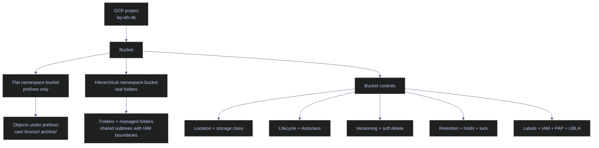

# GCS Buckets and Lifecycle

> [!abstract]- Summary
>
> Covers Google Cloud Storage bucket design and operations for data-engineering environments, with live `gcloud storage` workflows for namespace choice, lifecycle automation, governance controls, and bucket recovery in project `bq-wh-nb`.
>
> **Bucket role and inventory**
> - Defines buckets as the control plane for exports, raw landing zones, long-retention backups, and every downstream object operation that inherits bucket-level policy
> - Uses the live project `bq-wh-nb`, including production buckets `stoxx-bq-bucket` and `stoxx-sql-bucket`, plus scratch buckets for hierarchical namespace, lifecycle, Autoclass, retention, and restore drills
> - Explains how buckets relate to projects, objects, prefixes, folders, managed folders, and bucket-level policy boundaries
>
> **Namespace and access model**
> - Distinguishes flat namespace prefixes from hierarchical namespace folders, including the operational difference between name-based path layout and first-class folder resources
> - Covers managed folders as path-scoped IAM boundaries, plus the role of Uniform bucket-level access (`UBLA`) and Public access prevention (`PAP`) in keeping authorization bucket-centric and non-public
> - Shows `gcloud storage buckets create`, `buckets describe --raw`, `folders create`, `folders list`, and `managed-folders create` patterns for proving HNS is enabled and for creating auditable subtrees
>
> **Lifecycle, storage classes, and automation**
> - Explains location choice, immutable bucket placement, storage classes, Autoclass, lifecycle JSON rules, labels, and how age-based policy should align with class billing boundaries
> - Shows when to use adaptive tiering with Autoclass versus deterministic lifecycle rules with `matchesPrefix` for prefixes such as `archive/`
> - Covers label updates, lifecycle policy attachment, and the constraints around `SetStorageClass` rewrites, early-deletion exposure, and Autoclass incompatibility with manual class-transition lifecycle rules
>
> **Governance and recovery**
> - Covers versioning, default event-based hold, retention policy, irreversible bucket lock, soft delete, per-object retention capability, and restore behavior for soft-deleted buckets
> - Demonstrates `gcloud storage buckets update` patterns for versioning, hold toggles, retention period changes, and `gcloud storage restore` with bucket generation for time-bound recovery
> - Includes bucket-role design guidance for landing/raw, processing/transient, exchange/export, backup/archive, and replay/backfill buckets with different preferred controls
>
> **Operations and safety**
> - Warnings: location is immutable after creation, `--raw` is required to prove HNS, PowerShell can split unquoted comma-separated label payloads, holds and retention block cleanup, bucket lock is irreversible, and soft delete recovery is limited by the retention window
> - Recommendations table: bucket-role patterns for landing/raw, processing/transient, exchange/export, backup/archive, and replay/backfill with preferred controls for each role
> - Troubleshooting: 6 failure modes covering write failure from IAM or UBLA posture, delete blocks from holds or retention, region mismatch, asynchronous lifecycle timing, accidental bucket deletion, and cost spikes from versioning or soft-deleted bytes

> [!note]- Glossary
>
> **Project**
> - The Google Cloud billing, IAM, API, and audit boundary that owns each bucket.
> - It determines which service accounts, enabled APIs, quotas, and logs apply to bucket operations in this note.
>
> > [!info] Global name, local owner
> >
> > Bucket names are globally unique, but each bucket still belongs to exactly one project for IAM and billing control.
>
> ---
>
> **Bucket**
> - The top-level Cloud Storage container that owns namespace settings, lifecycle policy, versioning, soft delete, retention, and access defaults.
> - It is the unit you create, inspect, update, lock, delete, and restore in the workflows shown here.
>
> > [!warning] Location cannot move later
> >
> > Bucket placement is chosen at creation time. If the region is wrong for BigQuery, runtime latency, or compliance, the fix is a new bucket, not an in-place move.
>
> ---
>
> **Object**
> - The stored payload inside a bucket, with data plus metadata such as size, content type, and generation.
> - It matters here because bucket-level controls ultimately govern how object writes, deletes, and restores behave.
>
> > [!info] Bucket policy flows downward
> >
> > Object operations inherit the bucket's namespace model, versioning, soft delete, lifecycle, and retention behavior even when the command targets only one object.
>
> ---
>
> **Prefix**
> - A leading string in an object name such as `raw/2026/04/13/` that groups objects by naming convention.
> - It is how flat buckets emulate folder-like organization for partitions, zones, and lifecycle targeting.
>
> > [!warning] Name component only
> >
> > In a flat bucket, a prefix is not a first-class directory. Recursive commands act on matching names, not on a resource that exists independently.
>
> ---
>
> **Hierarchical namespace / `HNS`**
> - A bucket namespace mode that supports real folder resources instead of only prefix-shaped object names.
> - It matters when directory semantics, folder tooling, or managed-folder IAM boundaries are operational requirements.
>
> > [!warning] Prove with raw metadata
> >
> > The normalized `buckets describe` output does not show the HNS field clearly. Use `gcloud storage buckets describe --raw` and confirm `hierarchicalNamespace.enabled: true`.
>
> ---
>
> **Folder**
> - A first-class folder resource inside an HNS-enabled bucket.
> - It gives analytics and file-oriented workflows a real directory tree instead of a naming illusion.
>
> > [!warning] HNS-only command surface
> >
> > `gcloud storage folders` works only on buckets created with hierarchical namespace enabled. The same commands fail on flat buckets.
>
> ---
>
> **Managed folder**
> - A bucket subpath with its own IAM policy boundary.
> - It is the tool for sharing one bucket across teams while keeping access scoped to specific subtrees.
>
> > [!info] Policy, not lifecycle
> >
> > Managed folders create authorization boundaries. They do not move data, replace lifecycle rules, or change how storage classes work.
>
> ---
>
> **Uniform bucket-level access / `UBLA`**
> - A bucket setting that disables object ACLs and requires authorization to be managed through IAM.
> - It keeps access posture predictable and is required for hierarchical namespace buckets in the patterns shown here.
>
> > [!warning] No object ACL fallback
> >
> > Once UBLA is the intended model, fixing access issues means changing IAM, not reaching for per-object ACL exceptions.
>
> ---
>
> **Public access prevention / `PAP`**
> - A bucket control that blocks public exposure even if someone later applies an overly broad binding.
> - It matters for export, backup, and landing buckets where accidental public read would be a serious policy failure.
>
> > [!warning] Defense against drift
> >
> > PAP does not replace IAM hygiene, but it is a strong guardrail against an accidental public-sharing misconfiguration.
>
> ---
>
> **Storage class**
> - The access-cost and minimum-duration tier applied to new or existing objects, such as `STANDARD`, `NEARLINE`, or `ARCHIVE`.
> - It drives retrieval cost, storage economics, and whether a change will require a rewrite or trigger early-deletion charges.
>
> > [!warning] Class changes have consequences
> >
> > Colder classes reduce steady-state cost but can add retrieval penalties and minimum-duration exposure. Treat class choice as an economic policy, not only a label.
>
> ---
>
> **Autoclass**
> - A bucket feature that automatically moves objects between storage classes based on observed access patterns.
> - It is the adaptive-tiering choice when read behavior is unpredictable and manual class policies would drift.
>
> > [!warning] No mixed class automation
> >
> > Autoclass cannot be combined with lifecycle `SetStorageClass` rules on the same bucket. Choose one storage-class automation model.
>
> ---
>
> **Lifecycle rule**
> - A bucket policy that changes storage class or deletes objects when conditions such as age or prefix match.
> - It is the deterministic automation surface for cost control, archive cooling, and stale-data cleanup.
>
> > [!warning] Not a precise scheduler
> >
> > Lifecycle evaluation is asynchronous. Use it for policy enforcement, not for minute-accurate timing or tightly coupled orchestration.
>
> ---
>
> **Label**
> - A key-value tag stored on the bucket metadata, such as `env=lab` or `owner=codex`.
> - It makes buckets easier to filter, attribute in billing, and group by operational ownership.
>
> > [!warning] Quote PowerShell payloads
> >
> > In PowerShell, comma-separated label updates should be passed as one quoted argument, such as `"--update-labels=env=lab,owner=codex"`, or the shell can split the payload incorrectly.
>
> ---
>
> **Versioning**
> - A bucket feature that preserves older object generations when an object is overwritten.
> - It protects against accidental overwrite and provides rollback or audit history for mutable object names.
>
> > [!info] Overwrite protection only
> >
> > Versioning helps when a live object body is replaced. It does not replace soft delete or retention controls for delete and compliance scenarios.
>
> ---
>
> **Soft delete**
> - A recovery feature that keeps deleted buckets or objects restorable for a configured retention window.
> - It provides the first recovery tier after accidental deletion without requiring immediate manual re-creation.
>
> > [!warning] Recovery window costs bytes
> >
> > Soft-deleted resources still consume retained storage during the window. Recovery protection should be paired with cost-aware cleanup and inventory review.
>
> ---
>
> **Bucket generation**
> - The version identifier of the bucket resource itself, used when restoring a soft-deleted bucket by generation-qualified URI.
> - It is the safest way to target the exact deleted bucket instance during restore operations.
>
> > [!info] Restore by precise generation
> >
> > Using `gs://bucket#GENERATION` avoids ambiguity when the same bucket name has more than one historical state inside the soft-delete window.
>
> ---
>
> **Retention policy**
> - A bucket-wide minimum age before objects may be deleted.
> - It enforces compliance or operational minimum-retention requirements regardless of user intent.
>
> > [!warning] Cleanup may be blocked
> >
> > When retention is active, delete failures are often correct behavior, not broken tooling. Inspect retention state before assuming the object path is wrong.
>
> ---
>
> **Bucket lock**
> - The irreversible action that locks an existing retention policy so it cannot be shortened or removed.
> - It turns a normal retention setting into a WORM-style governance control.
>
> > [!danger] Irreversible control point
> >
> > `--lock-retention-period` is the point of no return. Test retention on scratch infrastructure first and lock only after the legal and operational consequences are fully understood.
>
> ---
>
> **Default event-based hold**
> - A bucket setting that causes newly written objects to begin with `eventBasedHold=true`.
> - It is useful when ingestion or validation workflows must explicitly release data before deletion or mutation is allowed.
>
> > [!warning] New writes inherit it
> >
> > This control affects future uploads automatically. If operators forget that the bucket default is enabled, cleanup and lifecycle behavior can appear unexpectedly blocked.
>
> ---
>
> **Per-object retention**
> - Object-level `retain-until` settings available only in buckets created with per-object retention enabled.
> - It lets one bucket hold records with different legal or operational retention horizons instead of forcing one retention age on every object.
>
> > [!warning] Capability must exist at creation
> >
> > The bucket must be created with `--enable-per-object-retention`. It is not a feature you can retrofit later onto an existing bucket.
>
> ---
>
> **Restore**
> - The recovery operation that brings a soft-deleted bucket back into the live namespace during the retention window.
> - It is the runbook action that turns soft delete from passive protection into an actual recovery path.
>
> > [!warning] Time-bound recovery workflow
> >
> > Restore is available only until the hard-delete boundary passes. Keep the bucket generation from logs or inventory and execute the runbook quickly after accidental deletion.

## Why bucket decisions matter

Most GCS outages in data platforms are not caused by Cloud Storage durability problems. They are caused by policy mistakes: the wrong region for a BigQuery export, a recursive delete against the wrong prefix, a retention policy that blocks cleanup, a missing recovery plan after soft delete, or an overly broad shared bucket where teams cannot reason about access boundaries.

Bucket design is therefore about four things at once:

- **Namespace discipline.** How paths, prefixes, folders, and managed folders model the lake.
- **Cost control.** How storage class, lifecycle, and Autoclass affect long-term spend.
- **Recovery.** How versioning, soft delete, retention, and restore interact.
- **Governance.** How IAM, default holds, managed folders, and lock semantics constrain mutations.

> [!example] Bucket Design Fit
>
> > [!success] Appropriate
> >
> > - Use this note when bucket design needs to reflect distinct operational roles such as landing, processing, export, backup, or replay rather than one generic catch-all container.
> > - Use it when hierarchical namespace, managed folders, lifecycle rules, Autoclass, retention, and soft delete must be chosen intentionally based on real workload behavior.
> > - Use it when recovery, governance, and cost controls must be part of the bucket design from the start instead of retrofitted later.
>
> > [!failure] Inappropriate
> >
> > - Do not collapse unrelated workloads into one catch-all bucket when access, retention, and lifecycle behavior differ materially.
> > - Do not combine manual class-transition lifecycle rules with an Autoclass bucket.
> > - Do not lock retention on disposable or still-unvalidated infrastructure before the recovery and cleanup behavior is fully understood.

## Conceptual Model

The control flow below is the bucket-level decision stack for most GCS-backed data platforms.



## Bucket Creation and Inspection

Creating a bucket is where the irreversible decisions happen: name, location, namespace model, uniform bucket-level access, and whether the bucket is built for per-object retention. Inspection is how you confirm that those decisions match production intent before you put data into the bucket.

### PowerShell / Linux | gcloud storage buckets | create and inspect buckets

This subsection validates four core workflows:

- Listing the current project bucket inventory.
- Inspecting an existing production bucket.
- Creating a flat namespace bucket with per-object retention enabled.
- Creating a hierarchical namespace bucket and confirming the raw API field that proves HNS is active.

#### List the current project bucket inventory

**When to run:** During first access to a project or before creating a new bucket.
**Trigger:** You need to understand what bucket estate already exists and whether a naming standard is already in use.
**Context:** Runs from any shell with `storage.googleapis.com` enabled and permission to list project buckets. Read-only.
**Purpose:** Establish the current bucket inventory and confirm the active project is the intended one.

*List every bucket in `bq-wh-nb` with its location, default class, soft-delete window, and UBLA state.*

```bash
gcloud storage buckets list --format="table(name,location,default_storage_class,soft_delete_policy.retentionDurationSeconds,uniform_bucket_level_access)"
```

```text
NAME                                      LOCATION      DEFAULT_STORAGE_CLASS  RETENTION_DURATION_SECONDS  UNIFORM_BUCKET_LEVEL_ACCESS
bq-wh-nb-codex-gcs-flat-20260413-3938     EUROPE-WEST1  STANDARD               604800                      True
bq-wh-nb-codex-gcs-hns-20260413-2288      EUROPE-WEST1  STANDARD               604800                      True
bq-wh-nb-codex-gcs-restore-20260413-4762  EUROPE-WEST1  STANDARD               604800                      True
stoxx-bq-bucket                           EUROPE-WEST1  STANDARD               604800                      True
stoxx-sql-bucket                          EUROPE-WEST1  STANDARD               604800                      True
```

All live buckets in this project are regional `EUROPE-WEST1` buckets with `STANDARD` as the default storage class, a seven-day soft-delete window (`604800` seconds), and uniform bucket-level access enabled. That tells you the project already favors IAM-only access control and a short recovery window.

#### Inspect an existing production bucket

**When to run:** Before using an existing bucket for load, export, backup, or ingestion work.
**Trigger:** A bucket already exists and you need to verify whether it is safe for the new workload.
**Context:** Read-only bucket metadata lookup.
**Purpose:** Confirm location, public-access posture, and recovery defaults on a real production bucket.

*Describe the current production export bucket.*

```bash
gcloud storage buckets describe gs://stoxx-bq-bucket --format="yaml(name,location,storage_url,public_access_prevention,soft_delete_policy.retentionDurationSeconds,uniform_bucket_level_access)"
```

```text
location: EUROPE-WEST1
name: stoxx-bq-bucket
public_access_prevention: enforced
soft_delete_policy:
  retentionDurationSeconds: '604800'
storage_url: gs://stoxx-bq-bucket/
uniform_bucket_level_access: true
```

`stoxx-bq-bucket` is locked down the way most data-engineering buckets should be: PAP is enforced, UBLA is enabled, and the recovery baseline is soft delete rather than public sharing or per-object ACLs.

#### Create a flat namespace bucket with per-object retention enabled

**When to run:** When one bucket must host objects with different retention deadlines and you still want a simple prefix-based namespace.
**Trigger:** A compliance or delivery workflow needs object-specific `retain-until` timestamps.
**Context:** State-changing bucket creation command. Requires bucket-create permission in the active project.
**Purpose:** Create a regional flat bucket that supports per-object retention.

> [!info] Why these flags matter
>
> - `--location=europe-west1` fixes data placement to a single region. This is a latency and cost decision, not just a geography label.
> - `--uniform-bucket-level-access` disables object ACL drift and forces IAM-only authorization.
> - `--public-access-prevention` blocks accidental public exposure even if someone later adds an overly broad binding.
> - `--enable-per-object-retention` makes object-level `retain-until` possible later. Without it, the object-retention commands in note `02` are unavailable.

*Create the scratch bucket used in the object-retention walkthrough.*

```bash
gcloud storage buckets create gs://bq-wh-nb-codex-gcs-flat-20260413-3938 \
  --location=europe-west1 \
  --uniform-bucket-level-access \
  --public-access-prevention \
  --enable-per-object-retention
```

```text
Creating gs://bq-wh-nb-codex-gcs-flat-20260413-3938/...
```

*Inspect the resulting bucket metadata.*

```bash
gcloud storage buckets describe gs://bq-wh-nb-codex-gcs-flat-20260413-3938 --format="yaml(name,location,per_object_retention.mode,soft_delete_policy.retentionDurationSeconds,versioning.enabled)"
```

```text
location: EUROPE-WEST1
name: bq-wh-nb-codex-gcs-flat-20260413-3938
per_object_retention:
  mode: Enabled
soft_delete_policy:
  retentionDurationSeconds: '604800'
```

The important field is `per_object_retention.mode: Enabled`. That is the bucket-level capability gate for later object-level `retain-until` operations.

#### Create a hierarchical namespace bucket

**When to run:** When directory semantics matter operationally, not just visually.
**Trigger:** Shared analytics areas, file-oriented ingest flows, or managed-folder IAM boundaries require real folder resources.
**Context:** State-changing bucket creation command. HNS requires UBLA.
**Purpose:** Create a bucket that supports first-class folders instead of prefix-only path illusions.

*Create the HNS scratch bucket.*

```bash
gcloud storage buckets create gs://bq-wh-nb-codex-gcs-hns-20260413-2288 \
  --location=europe-west1 \
  --uniform-bucket-level-access \
  --public-access-prevention \
  --enable-hierarchical-namespace
```

```text
Creating gs://bq-wh-nb-codex-gcs-hns-20260413-2288/...
```

*Read the raw API payload and confirm HNS is actually enabled.*

```bash
gcloud storage buckets describe gs://bq-wh-nb-codex-gcs-hns-20260413-2288 --raw
```

```text
etag: CAE=
generation: '1776084977255943355'
hierarchicalNamespace:
  enabled: true
...
name: bq-wh-nb-codex-gcs-hns-20260413-2288
softDeletePolicy:
  effectiveTime: '2026-04-13T12:56:17.656000+00:00'
  retentionDurationSeconds: '604800'
storageClass: STANDARD
```

The normalized `describe` output does not expose the HNS field, so `--raw` is the important operator move here. If you need to prove that a bucket is truly HNS-enabled, look for `hierarchicalNamespace.enabled: true` in the raw API representation.

| Flag | Syntax | Description |
|---|---|---|
| `--location` | `--location=europe-west1` | Sets the physical placement of the bucket. Immutable after creation. |
| `--default-storage-class` | `--default-storage-class=STANDARD` | Sets the default storage class for new objects. |
| `--uniform-bucket-level-access` | `--uniform-bucket-level-access` | Forces IAM-only authorization and disables object ACL drift. |
| `--public-access-prevention` | `--public-access-prevention` | Enforces PAP at bucket scope. |
| `--enable-hierarchical-namespace` | `--enable-hierarchical-namespace` | Creates a bucket that supports real folders. Requires UBLA. |
| `--enable-per-object-retention` | `--enable-per-object-retention` | Allows later object-level `retain-until` settings. |
| `--soft-delete-duration` | `--soft-delete-duration=14d` | Changes the soft-delete retention window. `0` disables it. |
| `--lifecycle-file` | `--lifecycle-file=policy.json` | Applies a lifecycle policy file at create time or update time. |
| `--retention-period` | `--retention-period=1d` | Sets a bucket-level minimum object age before delete. |
| `--format` | `--format="yaml(...)"` | Filters output to the fields you actually need. |
| `--raw` | `--raw` | Shows the underlying API payload instead of the normalized CLI view. |
| `--filter` | `--filter="name:stoxx"` | Narrows list output on large projects. |
| `--uri` | `--uri` | Prints only resource URIs. |

## Namespace Models, Folders, and Managed Folders

Flat buckets use prefixes that look like folders. HNS buckets add real folder resources. Managed folders sit on top of that namespace story by giving a subpath its own IAM boundary. These are related ideas, but they solve different problems:

- **Flat prefixes** organize names.
- **HNS folders** create directory-like resources.
- **Managed folders** create policy boundaries.

### PowerShell / Linux | gcloud storage folders and managed-folders | work with HNS buckets

This subsection shows the modern namespace tooling on a bucket that was created with hierarchical namespace enabled.

#### Create nested folders in a hierarchical namespace bucket

**When to run:** After creating an HNS bucket and before uploading structured content into it.
**Trigger:** You need a folder tree that behaves like a directory hierarchy instead of a flat prefix filter.
**Context:** State-changing HNS-only command. Fails on flat buckets.
**Purpose:** Materialize a directory-style path for a bronze landing zone.

*Create the nested folder path `raw/bronze/2026/04/13/` in the HNS bucket.*

```bash
gcloud storage folders create --recursive gs://bq-wh-nb-codex-gcs-hns-20260413-2288/raw/bronze/2026/04/13/
```

```text
Creating gs://bq-wh-nb-codex-gcs-hns-20260413-2288/raw/bronze/2026/04/13/...
```

#### List the resulting folder tree

**When to run:** Immediately after folder creation or when validating HNS path layout before access or ingestion changes.
**Trigger:** You need to confirm that the folder path exists as resources, not just as object-name prefixes.
**Context:** Read-only HNS folder listing.
**Purpose:** Verify the exact folder hierarchy that now exists in the bucket.

*List the current folder resources in the HNS bucket.*

```bash
gcloud storage folders list gs://bq-wh-nb-codex-gcs-hns-20260413-2288/
```

```text
---
bucket: bq-wh-nb-codex-gcs-hns-20260413-2288
name: raw/
storage_url: gs://bq-wh-nb-codex-gcs-hns-20260413-2288/raw/
---
bucket: bq-wh-nb-codex-gcs-hns-20260413-2288
name: raw/bronze/
storage_url: gs://bq-wh-nb-codex-gcs-hns-20260413-2288/raw/bronze/
---
bucket: bq-wh-nb-codex-gcs-hns-20260413-2288
name: raw/bronze/2026/
storage_url: gs://bq-wh-nb-codex-gcs-hns-20260413-2288/raw/bronze/2026/
---
bucket: bq-wh-nb-codex-gcs-hns-20260413-2288
name: raw/bronze/2026/04/13/
storage_url: gs://bq-wh-nb-codex-gcs-hns-20260413-2288/raw/bronze/2026/04/13/
```

This is the practical difference from a flat bucket: the directories themselves exist and are listable as resources.

#### Create and inspect a managed folder

**When to run:** When one logical subtree in a shared bucket needs its own IAM boundary.
**Trigger:** Several teams or pipelines share one bucket but should not share access to every path.
**Context:** State-changing command against bucket namespace metadata. Requires permission to modify bucket resources.
**Purpose:** Create a managed folder that can later hold path-scoped IAM rules.

*Create a managed folder for a shared landing subtree and list it back.*

```bash
gcloud storage managed-folders create gs://bq-wh-nb-codex-gcs-hns-20260413-2288/managed/landing/
```

```text
Creating gs://bq-wh-nb-codex-gcs-hns-20260413-2288/managed/landing/...
```

*List managed folders in the HNS bucket.*

```bash
gcloud storage managed-folders list gs://bq-wh-nb-codex-gcs-hns-20260413-2288/
```

```text
---
bucket: bq-wh-nb-codex-gcs-hns-20260413-2288
name: managed/landing/
storage_url: gs://bq-wh-nb-codex-gcs-hns-20260413-2288/managed/landing/
```

Managed folders are the right tool when one bucket must stay shared but path-level access must still be auditable and intentional.

| Flag | Syntax | Description |
|---|---|---|
| `--recursive` | `gcloud storage folders create --recursive ...` | Creates every missing folder in the path. |
| `--format` | `--format="yaml(name)"` | Restricts list output to the fields you need. |
| `--raw` | `--raw` | Returns the underlying API payload for folder or managed-folder resources. |
| `--filter` | `--filter="name:raw/"` | Narrows folder listings in large buckets. |
| `--uri` | `--uri` | Prints only managed-folder or folder URIs. |

## Storage Classes, Locations, and Lifecycle Automation

Storage economics in GCS are mostly governed by three design choices:

- **Location type** controls geography, latency, and cross-region resilience.
- **Storage class** controls minimum storage duration and retrieval cost.
- **Automation mode** controls whether class movement is manual (`lifecycle`) or adaptive (`Autoclass`).

### Choose location type intentionally

Use the location model that matches the workload boundary rather than the highest-availability option by default.

| Location model | Typical choice | Best for | Main trade-off |
|---|---|---|---|
| **Regional** | `europe-west1` | BigQuery staging, low-latency pipeline I/O, single-region compute | Lowest cost, lowest cross-region resilience |
| **Dual-region** | `EUR4`, custom dual-region | Regulated DR designs and replicated serving paths | Higher cost, more planning around replication behavior |
| **Multi-region** | `EU`, `US`, `ASIA` | Broadly distributed readers and platform-managed geo redundancy | Highest storage cost and less placement precision |

> [!info] Regional-only live estate
>
> Every live bucket in `bq-wh-nb` is regional `EUROPE-WEST1`. Dual-region placement and `--rpo=ASYNC_TURBO` are important design options, but they were not executed live here because this project currently has no dual-region or multi-region buckets.

### Compare storage classes before writing lifecycle rules

The class decision should follow the expected read pattern, not the age of the data alone.

| Storage class | Minimum storage duration | Retrieval charge pattern | Good fit |
|---|---|---|---|
| **STANDARD** | None | No retrieval charge | Active landing, frequent export, hot backups |
| **NEARLINE** | 30 days | Retrieval charges apply | Monthly reopen, low-frequency replay |
| **COLDLINE** | 90 days | Higher retrieval charges | Rare restore, quarterly audit access |
| **ARCHIVE** | 365 days | Highest retrieval sensitivity | Regulatory archive and disaster-only access |

> [!warning] Cold storage still bills early deletion
>
> Moving data to `NEARLINE`, `COLDLINE`, or `ARCHIVE` lowers storage cost, but deleting or rewriting it before the minimum duration still incurs the remaining charge.

> [!success] Match lifecycle age to the class boundary
>
> If your lifecycle rule sets `NEARLINE` at age 30, `COLDLINE` at age 90, and delete at age 365, the rule aligns with the storage-class billing boundaries instead of fighting them.

### PowerShell / Linux | gcloud storage buckets update | labels, Autoclass, and lifecycle

This subsection shows the two main automation patterns:

- **Adaptive tiering** with Autoclass.
- **Deterministic policy** with lifecycle JSON.

#### Add labels to a bucket

**When to run:** At bucket provisioning time or during cost-allocation cleanup.
**Trigger:** Finance, ownership, or environment tagging is missing.
**Context:** State-changing bucket metadata update.
**Purpose:** Make the bucket queryable by owner or environment and easier to attribute in billing analysis.

*Add two labels to the restore scratch bucket and inspect them.*

```bash
gcloud storage buckets update gs://bq-wh-nb-codex-gcs-restore-20260413-4762 "--update-labels=env=lab,owner=codex"
```

```text
Updating gs://bq-wh-nb-codex-gcs-restore-20260413-4762/...
```

```bash
gcloud storage buckets describe gs://bq-wh-nb-codex-gcs-restore-20260413-4762 --format="yaml(name,labels,autoclass.enabled,autoclass.terminalStorageClass,soft_delete_policy.retentionDurationSeconds)"
```

```text
autoclass:
  enabled: true
  terminalStorageClass: ARCHIVE
labels:
  env: lab
  owner: codex
name: bq-wh-nb-codex-gcs-restore-20260413-4762
soft_delete_policy:
  retentionDurationSeconds: '604800'
```

The labels are now part of the bucket metadata and can be used for filtering or cost attribution.

> [!bug] PowerShell list parsing on comma-separated metadata
>
> In this session, an unquoted comma-separated label or metadata argument was split incorrectly by PowerShell and sent as one malformed value.

> [!success] Quote comma-separated flag payloads
>
> In PowerShell, pass comma-separated `gcloud` key-value payloads as one quoted argument, such as `"--update-labels=env=lab,owner=codex"`.

#### Enable Autoclass on a bucket

**When to run:** When access frequency is unpredictable and manual storage-class policy would drift.
**Trigger:** The bucket contains data that sometimes becomes hot again after sitting cold.
**Context:** State-changing bucket update.
**Purpose:** Let Cloud Storage move objects between classes based on observed reads instead of age-only rules.

*Enable Autoclass and set `ARCHIVE` as the terminal class.*

```bash
gcloud storage buckets update gs://bq-wh-nb-codex-gcs-restore-20260413-4762 \
  --enable-autoclass \
  --autoclass-terminal-storage-class=ARCHIVE
```

```text
Updating gs://bq-wh-nb-codex-gcs-restore-20260413-4762/...
```

The follow-up `describe` output above shows `autoclass.enabled: true` and `terminalStorageClass: ARCHIVE`. That confirms the bucket is in adaptive-tiering mode rather than manual `SetStorageClass` mode.

#### Define a lifecycle policy file

**When to run:** Before applying lifecycle automation to prefixes that have a predictable aging curve.
**Trigger:** Archive or staging data follows a known age-based retention path.
**Context:** Local file definition plus a later bucket update. The file itself is not a Cloud resource.
**Purpose:** Express deterministic bucket policy in JSON before attaching it to the bucket.

*Define a lifecycle policy that moves `archive/` objects to `NEARLINE` after 30 days and deletes them after 365 days.*

```json
{
  "rule": [
    {
      "action": {"type": "SetStorageClass", "storageClass": "NEARLINE"},
      "condition": {"age": 30, "matchesPrefix": ["archive/"]}
    },
    {
      "action": {"type": "Delete"},
      "condition": {"age": 365, "matchesPrefix": ["archive/"]}
    }
  ]
}
```

#### Apply the lifecycle policy to a bucket

**When to run:** After the lifecycle JSON has been reviewed and the bucket is not using Autoclass for storage-class movement.
**Trigger:** You need deterministic tiering or expiry for a specific prefix.
**Context:** State-changing bucket update.
**Purpose:** Attach the lifecycle rules to the flat scratch bucket.

*Apply the lifecycle policy file and inspect the resulting rules.*

```powershell
gcloud storage buckets update gs://bq-wh-nb-codex-gcs-flat-20260413-3938 --lifecycle-file="C:\Users\aperi\AppData\Local\Temp\codex-gcs-lifecycle.json"
```

```text
Updating gs://bq-wh-nb-codex-gcs-flat-20260413-3938/...
```

```bash
gcloud storage buckets describe gs://bq-wh-nb-codex-gcs-flat-20260413-3938 --raw
```

```text
lifecycle:
  rule:
  - action:
      storageClass: NEARLINE
      type: SetStorageClass
    condition:
      age: 30
      matchesPrefix:
      - archive/
  - action:
      type: Delete
    condition:
      age: 365
      matchesPrefix:
      - archive/
...
name: bq-wh-nb-codex-gcs-flat-20260413-3938
```

The `matchesPrefix` condition is the important production pattern. It lets one bucket host multiple data zones while only specific prefixes age into colder storage or expiry.

> [!question] Autoclass or lifecycle?
>
> Use **Autoclass** when access patterns are unpredictable and the same bucket can swing between hot and cold reads.
>
> Use **manual lifecycle rules** when the retention curve is policy-driven and stable, such as `archive/` data that should always cool down and then expire on schedule.

| Flag | Syntax | Description |
|---|---|---|
| `--update-labels` | `"--update-labels=env=lab,owner=codex"` | Adds or updates bucket labels. |
| `--clear-labels` | `--clear-labels` | Removes all labels from a bucket. |
| `--enable-autoclass` | `--enable-autoclass` | Enables adaptive storage-class movement. |
| `--autoclass-terminal-storage-class` | `--autoclass-terminal-storage-class=ARCHIVE` | Sets the coldest class Autoclass may choose. |
| `--no-enable-autoclass` | `--no-enable-autoclass` | Disables Autoclass. |
| `--lifecycle-file` | `--lifecycle-file=policy.json` | Applies lifecycle rules from a JSON file. |
| `--clear-lifecycle` | `--clear-lifecycle` | Removes all lifecycle rules from the bucket. |
| `--default-storage-class` | `--default-storage-class=NEARLINE` | Changes the class applied to newly written objects. |
| `--soft-delete-duration` | `--soft-delete-duration=30d` | Changes the soft-delete retention window. |
| `--clear-soft-delete` | `--clear-soft-delete` | Removes soft-delete settings for future deletions. |

## Governance Controls: Versioning, Holds, Retention, and Lock

All of these controls change delete semantics, but they do not do the same job:

- **Versioning** protects against overwrite.
- **Soft delete** protects against delete.
- **Default event-based hold** pauses delete until a pipeline explicitly releases data.
- **Retention policy** enforces minimum age.
- **Bucket lock** makes the retention policy irreversible.

### PowerShell / Linux | gcloud storage buckets update | govern bucket mutation

This subsection covers the bucket-level controls that every downstream object operation inherits.

#### Enable object versioning on a bucket

**When to run:** Before pipelines start overwriting objects that might need rollback.
**Trigger:** A prefix contains mutable artifacts such as daily extracts, manifests, or state files.
**Context:** State-changing bucket update.
**Purpose:** Preserve older generations on overwrite instead of destroying them.

*Enable versioning on the flat scratch bucket.*

```bash
gcloud storage buckets update gs://bq-wh-nb-codex-gcs-flat-20260413-3938 --versioning
```

```text
Updating gs://bq-wh-nb-codex-gcs-flat-20260413-3938/...
```

The raw bucket metadata after the update showed `versioning.enabled: true`. That is what later made `landing/ohlcv.csv` accumulate two generations instead of a single mutable copy.

#### Enable and then clear default event-based hold

**When to run:** Enable it when new objects must be explicitly released after validation; clear it when the bucket returns to ordinary ingestion.
**Trigger:** Ingestion workflows need a deliberate release step before deletes are allowed.
**Context:** State-changing bucket metadata update.
**Purpose:** Show how bucket-level default hold affects future uploads without leaving the scratch bucket permanently frozen.

*Enable the default event-based hold on the flat bucket.*

```bash
gcloud storage buckets update gs://bq-wh-nb-codex-gcs-flat-20260413-3938 --default-event-based-hold
```

```text
Updating gs://bq-wh-nb-codex-gcs-flat-20260413-3938/...
```

*Clear the default hold again so normal object operations can continue.*

```bash
gcloud storage buckets update gs://bq-wh-nb-codex-gcs-flat-20260413-3938 --no-default-event-based-hold
```

```text
Updating gs://bq-wh-nb-codex-gcs-flat-20260413-3938/...
```

This is an operationally safe way to test the feature. You validate the control path without leaving every future upload blocked.

#### Set and clear an unlocked bucket retention policy

**When to run:** Before compliance or legal-retention enforcement is needed.
**Trigger:** A bucket must not allow early deletion for a minimum period.
**Context:** State-changing bucket policy update. Clearing is only possible while the policy remains unlocked.
**Purpose:** Show the difference between a normal retention policy and an irreversible bucket lock.

*Set a one-day bucket retention period on the flat bucket.*

```bash
gcloud storage buckets update gs://bq-wh-nb-codex-gcs-flat-20260413-3938 --retention-period=1d
```

```text
Updating gs://bq-wh-nb-codex-gcs-flat-20260413-3938/...
```

*Inspect the raw retention fields.*

```bash
gcloud storage buckets describe gs://bq-wh-nb-codex-gcs-flat-20260413-3938 --raw
```

```text
retentionPolicy:
  effectiveTime: '2026-04-13T13:04:47.177000+00:00'
  retentionPeriod: '86400'
```

*Clear the retention period again while it is still unlocked.*

```bash
gcloud storage buckets update gs://bq-wh-nb-codex-gcs-flat-20260413-3938 --clear-retention-period
```

```text
Updating gs://bq-wh-nb-codex-gcs-flat-20260413-3938/...
```

> [!danger] Bucket lock is permanent
>
> `gcloud storage buckets update --lock-retention-period` is the point of no return. After that, the retention period cannot be reduced or removed.

> [!success] Validate retention before locking
>
> Set the retention policy first, test overwrite and cleanup behavior against a scratch bucket, and lock only when the legal requirement is confirmed and the operational consequences are understood.

> [!info] Not executed live
>
> Bucket lock was deliberately not executed in `bq-wh-nb` because it is irreversible and would leave a permanent compliance constraint on a disposable teaching bucket.

| Flag | Syntax | Description |
|---|---|---|
| `--versioning` | `--versioning` | Enables bucket versioning. |
| `--no-versioning` | `--no-versioning` | Disables versioning for future writes. |
| `--default-event-based-hold` | `--default-event-based-hold` | Causes new objects to inherit `eventBasedHold=true`. |
| `--no-default-event-based-hold` | `--no-default-event-based-hold` | Stops new objects from inheriting the hold. |
| `--retention-period` | `--retention-period=1d` | Sets the bucket-wide minimum age before delete. |
| `--clear-retention-period` | `--clear-retention-period` | Removes an unlocked retention policy. |
| `--lock-retention-period` | `--lock-retention-period` | Irreversibly locks the retention policy. |
| `--soft-delete-duration` | `--soft-delete-duration=30d` | Changes the bucket soft-delete window. |
| `--clear-soft-delete` | `--clear-soft-delete` | Removes soft-delete settings for future deletions. |

## Soft Delete and Bucket Recovery

Soft delete is the first recovery tier for accidental bucket deletion. If the bucket is still inside its soft-delete window, `gcloud storage restore` can bring it back without re-creating the name manually.

### PowerShell / Linux | gcloud storage rm and restore | recover a deleted bucket

The restore workflow below uses the disposable bucket `bq-wh-nb-codex-gcs-restore-20260413-4762`.

#### Delete an empty scratch bucket

**When to run:** Only on disposable or pre-approved buckets.
**Trigger:** You are validating soft-delete recovery or intentionally decommissioning a scratch bucket.
**Context:** Destructive command. `--recursive` removes all object versions and then the bucket itself.
**Purpose:** Produce a real soft-deleted bucket that can be restored.

*Delete the empty restore bucket recursively.*

```bash
gcloud storage rm --recursive gs://bq-wh-nb-codex-gcs-restore-20260413-4762/
```

```text
Removing objects:

Removing buckets:
Removing gs://bq-wh-nb-codex-gcs-restore-20260413-4762/...
```

#### Restore the soft-deleted bucket

**When to run:** While the bucket is still within its soft-delete retention window.
**Trigger:** A bucket was deleted accidentally or too early.
**Context:** State-changing recovery command. For bucket restore, specifying the soft-deleted generation is the safest pattern.
**Purpose:** Recover the deleted bucket with its original name and metadata.

*Restore the deleted bucket using its bucket generation.*

```bash
gcloud storage restore gs://bq-wh-nb-codex-gcs-restore-20260413-4762#1776084979485756126
```

```text
Restoring gs://bq-wh-nb-codex-gcs-restore-20260413-4762#1776084979485756126...
```

*Verify that the bucket is live again.*

```bash
gcloud storage buckets describe gs://bq-wh-nb-codex-gcs-restore-20260413-4762 --raw
```

```text
autoclass:
  enabled: true
  terminalStorageClass: ARCHIVE
labels:
  env: lab
  owner: codex
name: bq-wh-nb-codex-gcs-restore-20260413-4762
softDeletePolicy:
  retentionDurationSeconds: '604800'
```

The restored bucket kept its labels and Autoclass state. That is the important operator takeaway: restore is meant to recover the deleted resource, not an empty shell with the same name.

> [!warning] Soft delete is not infinite retention
>
> The restore window lasts only as long as `softDeletePolicy.retentionDurationSeconds` allows. Once the hard-delete boundary passes, `gcloud storage restore` cannot recover the bucket.

> [!success] Treat restore as a time-bound runbook
>
> Keep the bucket generation from audit logs or inventory snapshots, restore immediately, then validate lifecycle, IAM, and downstream jobs before putting the bucket back into normal use.

| Flag | Syntax | Description |
|---|---|---|
| `--recursive` | `gcloud storage rm --recursive gs://bucket/` | Deletes all object versions and then the bucket. |
| `--all-versions` | `gcloud storage restore gs://bucket/object --all-versions` | Restores all soft-deleted versions of an object. Mainly relevant when versioning is enabled. |
| `--async` | `gcloud storage restore gs://bucket/** --async` | Starts a bulk restore operation asynchronously. |
| `--allow-overwrite` | `--allow-overwrite` | Allows restore to replace a currently live object. |
| `--created-after-time` | `--created-after-time="2026-04-01T00:00:00Z"` | Restores only resources created after a given timestamp. |
| `--created-before-time` | `--created-before-time="2026-04-30T23:59:59Z"` | Restores only resources created before a given timestamp. |
| `--deleted-after-time` | `--deleted-after-time="2026-04-01T00:00:00Z"` | Restores only resources deleted after a given timestamp. |
| `--deleted-before-time` | `--deleted-before-time="2026-04-30T23:59:59Z"` | Restores only resources deleted before a given timestamp. |
| `--if-generation-match` | `--if-generation-match=1776084979485756126` | Restores only if the target generation matches. |
| `--if-metageneration-match` | `--if-metageneration-match=3` | Adds a metadata precondition to the restore call. |

## Data-Engineering Bucket Patterns

Bucket design is easiest to reason about when every bucket has one operational role.

| Bucket role | Typical contents | Preferred controls | Why this split helps |
|---|---|---|---|
| **Landing / raw** | External drops, CDC files, partner payloads | PAP, UBLA, short soft delete, optional default event-based hold | Lets ingestion validate before release. |
| **Processing / transient** | Intermediate files, repartitioned artifacts, temp exports | Short lifecycle, often no long retention, cost-focused cleanup | Prevents scratch data from becoming permanent spend. |
| **Exchange / export** | Files handed to downstream teams or external consumers | Versioning, soft delete, signed URL workflows | Reduces risk when the same object name is overwritten or redistributed. |
| **Backup / archive** | Database backups, point-in-time exports, disaster recovery copies | Colder classes, retention, possibly lock | Makes recovery posture explicit and auditable. |
| **Replay / backfill** | Known-good historical slices | Predictable lifecycle and stronger naming discipline | Makes reruns safe without mixing with hot landing data. |

A simple and readable naming rule is: one environment, one platform domain, one workload purpose. The production buckets already visible in `bq-wh-nb` follow that principle better than a single catch-all shared bucket would.

## Troubleshooting and Runbooks

| Symptom | Likely cause | What to check first | Safe next action |
|---|---|---|---|
| Bucket exists but pipeline cannot write | IAM or UBLA mismatch | Bucket IAM, service account role, PAP/UBLA posture | Validate the writer identity before touching bucket config. |
| Delete fails unexpectedly | Retention policy or hold is active | `retentionPolicy`, default hold, object holds | Release the object hold or wait out retention; do not force-delete blindly. |
| Data is in the wrong region for BigQuery load/export | Bucket location mismatched to dataset or runtime | `location` on bucket and dataset | Create a same-region bucket rather than moving the current one. |
| Lifecycle did not fire at the exact expected minute | Lifecycle is asynchronous | `lifecycle.rule` plus object age and prefix | Treat lifecycle as policy evaluation, not a scheduler. |
| Accidental bucket deletion | Bucket is inside soft-delete window | Soft-delete duration and bucket generation | Run `gcloud storage restore` immediately. |
| Cost spike after enabling recovery controls | Soft-deleted bytes or many noncurrent versions | Billing by SKU, version count, deleted-object backlog | Pair recovery controls with explicit lifecycle cleanup rules. |

## Quick Reference

| Control | Protects against | Blocks overwrite | Blocks delete | Reversible |
|---|---|---|---|---|
| **Versioning** | Accidental overwrite | No | No | Yes |
| **Soft delete** | Accidental delete | No | No, but restore stays possible during the window | Yes |
| **Default event-based hold** | Premature release of new data | Yes until released | Yes until released | Yes |
| **Retention policy** | Early delete before minimum age | Yes for affected objects | Yes | Yes, if unlocked |
| **Bucket lock** | Policy tampering after compliance approval | Yes | Yes | No |
| **Per-object retention** | Object-specific minimum retention | Yes for that object | Yes for that object | Yes, while unlocked |
| **Lifecycle rule** | Cost drift and stale data accumulation | Indirectly, depending on rule | Yes if rule deletes | Yes |
| **Autoclass** | Manual tiering drift | No | No | Yes |

## Related

- [[02-gcs-object-operations]] - Object listing, metadata, holds, restore, eventing, and signed URLs.
- [[02-data-loading-and-export]] - BigQuery reads from and writes to these buckets.
- [[03-gcloud-authentication]] - Credentials and service-account posture for `gcloud storage`.
- [[01-service-accounts-and-iam]] - Bucket and object roles, impersonation, and least-privilege patterns.
- [[01-gcp-billing-and-pricing]] - Storage economics, retrieval trade-offs, and billing interpretation.

## References

- https://cloud.google.com/storage/docs/storage-classes
- https://cloud.google.com/storage/docs/lifecycle
- https://docs.cloud.google.com/storage/docs/hns-overview
- https://docs.cloud.google.com/storage/docs/managed-folders
- https://docs.cloud.google.com/storage/docs/soft-delete
- https://docs.cloud.google.com/storage/docs/object-versioning
- https://cloud.google.com/storage/docs/bucket-lock
