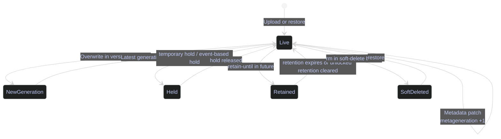

# GCS Object Operations

> [!abstract]- Summary
>
> Covers Google Cloud Storage object-level operations with `gcloud storage` workflows for inspection, safe mutation, restore, controlled sharing, and event-driven automation across production and scratch buckets.
>
> **Inspection and verification**
> - Explains object names, prefixes, content type, checksums, generations, and metagenerations so operators can identify the exact object body and metadata state before any mutation
> - Shows `gcloud storage ls -l -r`, `cat`, `objects describe`, and `hash` patterns for verifying prefix contents, inline text payloads, archived metadata snapshots, and local file integrity
> - Uses scratch and production-style buckets to ground object inspection in real paths such as `landing/`, `archive/`, `sync/`, and `events/`
>
> **Copy, sync, move, and rewrite**
> - Covers `cp`, `rsync`, `mv`, and `objects update --storage-class=...`, including dry-run planning, no-clobber posture, and the fact that some changes are rewrites rather than metadata patches
> - Distinguishes object duplication, path mirroring, copy-plus-delete movement, and class rewrites so operators know which commands create new objects versus mutate metadata
> - Shows why `mv` is not an atomic rename and why storage-class changes create rewritten object generations
>
> **Safe mutation and recovery controls**
> - Covers generation and metageneration preconditions, custom metadata patching, stale-precondition failure behavior, temporary hold, event-based hold, per-object retention, soft delete, restore tokens, and object restore
> - Explains optimistic concurrency through `--if-generation-match` and `--if-metageneration-match`, plus the difference between object body changes and metadata-only changes
> - Demonstrates that restore creates a new live generation rather than resurrecting the old generation number in place, while current documentation also clarifies that restored objects come back in `STANDARD` storage
>
> **Controlled sharing and eventing**
> - Covers signed URLs for time-bound delivery, bucket notification configuration, Pub/Sub topic and subscription setup, and `OBJECT_FINALIZE` event flow for objects written under `events/`
> - Explains the signer, verb, expiry, required headers, topic existence, notification limits, and Cloud Storage publish path details that make event-driven automation or external sharing actually work
>
> **Operations and safety**
> - Warnings: `/` is part of the object name in flat buckets, stale preconditions fail with `412`, Windows rsync warnings can add noise, class changes are rewrites, holds and retention block mutation, restore returns a new live generation, and notifications require matching prefix plus publish permissions
> - Recommendations table: landing-date, medallion-zone, export-staging, replay, and small-file consolidation layout patterns for safer lifecycle, replay, and downstream processing
> - Troubleshooting: 7 failure modes covering stale preconditions, checksum mismatch, wrong full object path, accidental delete, signed URL failure, risky recursive sync or delete, and missing notification delivery

> [!warning] Archived demo boundary
>
> The original Storage project used throughout this note, `bq-wh-nb`, has been removed. Treat the captured object listings, generations, and notification outputs as archived operator reference, not as live validation.
>
> This refresh intentionally avoids rerunning any object workflows. The note keeps the former outputs where they still illustrate the command behavior and only adds knowledge-backed corrections from current Cloud Storage documentation.

> [!note]- Glossary
>
> **Object name**
> - The full key inside a bucket, such as `landing/ohlcv.csv`, that identifies one logical object path.
> - It is the exact name every list, copy, delete, restore, and notification filter in this note operates against.
>
> > [!warning] Slash is not a folder
> >
> > In a flat bucket, `/` is only part of the object name. If the full key is wrong, the command fails even when the apparent console folder looks correct.
>
> > [!warning] `#` has version meaning in CLI syntax
> >
> > In `gcloud storage`, appending `#GENERATION` targets a specific object version. Avoid `#` in object names unless you are prepared to quote paths carefully and distinguish the literal name from generation-addressing syntax.
>
> ---
>
> **Prefix**
> - A leading string in object names that groups related keys, such as `archive/` or `events/`.
> - It is how listing, sync, lifecycle targeting, and event-notification scoping are kept narrow and predictable.
>
> > [!info] Scope operations by prefix
> >
> > Recursive commands become much safer when they are anchored to a precise prefix instead of an entire bucket root.
>
> ---
>
> **Generation**
> - The immutable version number of one stored object body.
> - It lets operators refer to one exact payload, detect overwrites, and restore or inspect a specific object version.
>
> > [!warning] New body, new generation
> >
> > In a versioned bucket, overwriting an object creates a new generation instead of changing the old payload in place.
>
> ---
>
> **Metageneration**
> - The metadata version counter attached to one object generation.
> - It is the concurrency signal used to protect metadata patches from racing each other.
>
> > [!warning] Metadata bumps separately
> >
> > Changing metadata increments metageneration without changing the object body. Confusing it with generation leads to incorrect precondition logic.
>
> > [!info] Scoped to one object generation
> >
> > Current Cloud Storage documentation defines metageneration as meaningful only alongside a specific object generation. When the object body changes and a new generation is created, the metageneration sequence for that new generation starts over.
>
> ---
>
> **Precondition / `--if-generation-match` and `--if-metageneration-match`**
> - An optimistic-concurrency check that tells GCS to perform a write only if the expected generation or metageneration still matches the current object state.
> - It is the safety mechanism that turns metadata updates from blind overwrite into explicit compare-and-set behavior.
>
> > [!warning] `412` means protect, not break
> >
> > A precondition failure is usually the correct outcome: another actor changed the object first. Re-read state, then retry with fresh values if the update is still valid.
>
> ---
>
> **Content type**
> - The MIME type stored in object metadata, such as `text/csv` or `application/json`.
> - It controls how browsers, APIs, and downstream systems interpret or render the object.
>
> > [!warning] Auto-detection can drift
> >
> > Client tooling does not always infer the content type you expect. Verify it on important delivery artifacts, especially files meant for browsers or downstream parsers.
>
> ---
>
> **`CRC32C` / `MD5`**
> - Integrity hashes stored with an object or computed locally to verify that the transferred bytes match the intended file.
> - They are the fastest way to prove upload, download, or copy correctness when a file looks suspicious.
>
> > [!info] Prefer modern transport hash
> >
> > `CRC32C` is the primary integrity check used by modern GCS tooling. `MD5` is still useful context, but `CRC32C` is the stronger operational signal here.
>
> ---
>
> **Rewrite**
> - A server-side copy operation that creates a new object body when a change cannot be applied as metadata-only, such as a storage-class change.
> - It explains why some `objects update` calls patch metadata cheaply while others create a new generation.
>
> > [!warning] Not every update is a patch
> >
> > When the CLI says `Rewriting`, treat the operation like a body mutation with new-version implications, not as a harmless metadata tweak.
>
> ---
>
> **Temporary hold**
> - A manual hold flag that blocks delete and overwrite until an operator clears it.
> - It is useful for incident review, handoff approval, or deliberate short-term mutation freezing.
>
> > [!warning] No automatic expiry exists
> >
> > Temporary hold has no timer. If the operator does not remove it, deletes, overwrites, and lifecycle actions remain blocked.
>
> ---
>
> **Event-based hold**
> - A hold that stays active until a workflow explicitly releases it after validation or another business event.
> - It is the object-level control that keeps newly landed data immutable until a release step completes.
>
> > [!warning] Release step is mandatory
> >
> > If the workflow forgets to clear the hold, the data looks stuck for a good reason: the platform is enforcing the release contract.
>
> ---
>
> **`retain-until`**
> - The object-level timestamp before which GCS must refuse deletion.
> - It gives one object a minimum retention horizon without forcing the same age on every object in the bucket.
>
> > [!warning] Bucket capability required first
> >
> > Object retention settings work only in buckets created with per-object retention enabled. Without that capability, the retention commands are unavailable.
>
> ---
>
> **Soft delete**
> - The recovery feature that keeps deleted objects restorable for a limited window instead of removing them immediately forever.
> - It is the first recovery tier after an accidental object delete in the workflows shown here.
>
> > [!warning] Recovery window expires
> >
> > Soft delete is not permanent retention. Once `hardDeleteTime` passes, restore is no longer available for that deleted version.
>
> ---
>
> **Restore token**
> - Soft-delete metadata that identifies one deleted object version when more than one deleted version may exist.
> - It matters when recovery has to target the exact deleted instance rather than any object with the same name.
>
> > [!info] Deleted versions only
> >
> > Restore tokens appear on soft-deleted object metadata, not on live objects. Capture them during investigation if the delete history is ambiguous.
>
> ---
>
> **Signed URL**
> - A time-limited URL that grants access to one object without assigning IAM directly to the caller.
> - It is the controlled-delivery mechanism for short-lived external downloads or uploads.
>
> > [!warning] Verb and headers must match
> >
> > A signed URL can still fail even before expiry if the caller uses the wrong HTTP verb or omits headers that were bound into the signature.
>
> ---
>
> **Notification configuration**
> - A bucket rule that publishes object events to a Pub/Sub topic when matching changes occur.
> - It is the eventing layer that turns object finalize or delete events into downstream processing triggers.
>
> > [!warning] Filters define event scope
> >
> > A wrong `--object-prefix` means the event may never fire or may fire on far more objects than intended. Match the notification scope to the actual layout.
>
> ---
>
> **Pub/Sub topic**
> - The messaging destination that receives Cloud Storage event notifications.
> - It is the transport boundary that lets object events fan out to subscribers without polling the bucket.
>
> > [!warning] Topic and publisher must exist
> >
> > Notifications do not work if the topic is missing, the API is disabled, or the Cloud Storage service agent cannot publish to the topic.
>
> ---
>
> **`OBJECT_FINALIZE`**
> - The event type emitted when a new object generation is successfully created.
> - It is the event most commonly used to trigger downstream ingestion or processing from arriving objects.
>
> > [!info] Generation-aware finalize event
> >
> > The finalize message includes the object generation, which is critical when a consumer must process the exact version that triggered the event.
>
> ---
>
> **Versioned object**
> - An object name whose older generations remain available because bucket versioning is enabled.
> - It matters for comparison, rollback, and restore reasoning when the same logical path has been written more than once.
>
> > [!info] Use `ls -a` to compare
> >
> > Normal listings show only the live generation. Use `gcloud storage ls -a` when the question is about history, not only the current version.
>
> ---
>
> **`mv`**
> - The convenience command that relocates an object by copying it to a new name and then deleting the source.
> - It is useful operationally, but only when copy-plus-delete semantics are acceptable for the workflow.
>
> > [!warning] Not an atomic rename
> >
> > Treat `mv` as two operations with an intermediate state, not as a metadata rename that happens instantly and indivisibly.
>
> ---
>
> **`rsync` dry run**
> - A preview mode that shows which files or objects a sync would copy before it applies any changes.
> - It is the review checkpoint that makes recursive publication or deletion safer on large prefixes.
>
> > [!warning] Mandatory for risky scope
> >
> > When a sync or delete feels risky, the preview is not optional. The dry-run output is the last cheap chance to catch a wrong source or destination path.

## Why object-level behavior matters

Many operators understand buckets but still get surprised by object behavior. The common failures are not exotic:

- A pipeline overwrites the right object name but the wrong generation.
- A recursive delete targets the correct bucket but the wrong prefix.
- A signed URL is valid, but the object metadata causes a browser or downstream client to treat it incorrectly.
- A metadata patch races another patch and silently loses the intended value.
- A restore succeeds, but the operator expected the same generation number instead of a new live generation.

Object operations are therefore about correctness as much as convenience.


## Conceptual Model



## Inspect and Verify Objects

Before copying or deleting anything, inspect the real object estate. Listing, reading, describing, and hashing are the fastest ways to prevent accidental writes against the wrong prefix or the wrong file type.

### PowerShell / Linux | gcloud storage ls, cat, objects describe, hash | inspect object state

This subsection uses the archived flat scratch bucket `bq-wh-nb-codex-gcs-flat-20260413-3938`.

#### List the archived object estate recursively

Before bulk copy, delete, lifecycle tuning, or prefix cleanup. It is typically triggered by you need to know what really exists under a bucket or prefix. Read-only listing. Show current prefixes, object sizes, and last-write timestamps.

*List every object currently stored in the flat scratch bucket.*

```bash
gcloud storage ls -l -r gs://bq-wh-nb-codex-gcs-flat-20260413-3938/
```

```text
gs://bq-wh-nb-codex-gcs-flat-20260413-3938/archive/:
        58  2026-04-13T13:10:04Z  gs://bq-wh-nb-codex-gcs-flat-20260413-3938/archive/manifest.json
       123  2026-04-13T13:07:28Z  gs://bq-wh-nb-codex-gcs-flat-20260413-3938/archive/ohlcv.csv

gs://bq-wh-nb-codex-gcs-flat-20260413-3938/events/:
        58  2026-04-13T13:09:29Z  gs://bq-wh-nb-codex-gcs-flat-20260413-3938/events/manifest.json

gs://bq-wh-nb-codex-gcs-flat-20260413-3938/landing/:
       123  2026-04-13T13:05:53Z  gs://bq-wh-nb-codex-gcs-flat-20260413-3938/landing/ohlcv.csv

gs://bq-wh-nb-codex-gcs-flat-20260413-3938/sync/:
        46  2026-04-13T13:07:24Z  gs://bq-wh-nb-codex-gcs-flat-20260413-3938/sync/customers.csv
        26  2026-04-13T13:07:24Z  gs://bq-wh-nb-codex-gcs-flat-20260413-3938/sync/inventory.txt
TOTAL: 6 objects, 434 bytes (434.00B)
```

This single command answers three operator questions immediately: which prefixes exist, whether the object sizes look sane, and whether the last write time matches the expected pipeline run.

#### Read a small object without downloading it

When an object is small enough to inspect inline. It is typically triggered by you need to validate schema, manifest payload, or text content quickly. Read-only object read to stdout. Verify the object payload without writing a local copy first.

*Print the CSV payload stored at `landing/ohlcv.csv`.*

```bash
gcloud storage cat gs://bq-wh-nb-codex-gcs-flat-20260413-3938/landing/ohlcv.csv
```

```text
symbol,date,close,volume
ADYEN.AS,2026-04-11,1498.2,238741
ASML.AS,2026-04-11,812.4,421005
SAP.DE,2026-04-11,246.7,881223
```

Use `cat` only for small text-like payloads. For larger objects, download selectively or use client tooling that can read ranges.

#### Describe object metadata

After upload, metadata patching, overwrite, or restore. It is typically triggered by you need exact metadata fields, not just a listing row. Read-only metadata lookup. Confirm size, generation, metageneration, content type, and current metadata values.

*Describe the archived `landing/ohlcv.csv` object snapshot used in this note.*

```bash
gcloud storage objects describe gs://bq-wh-nb-codex-gcs-flat-20260413-3938/landing/ohlcv.csv --format="yaml(name,size,content_type,generation,metageneration,storage_class,metadata)"
```

```text
content_type: text/csv
generation: '1776085553882775'
metageneration: 9
name: landing/ohlcv.csv
size: 123
storage_class: STANDARD
```

The important distinction here is `generation` versus `metageneration`. The body is still generation `1776085553882775`, but metadata changes have already advanced metageneration to `9`.

#### Hash a local file before or after upload

Before upload, after download, or when debugging checksum mismatch. It is typically triggered by you need proof that a local file matches the object you expect. Local command only. No API mutation. Compute CRC32C and MD5 on the local file so you can compare them to the object metadata.

*Calculate the local hashes for the source CSV file.*

```powershell
gcloud storage hash "C:\Users\aperi\AppData\Local\Temp\codex-gcs-notes-20260413\bronze\ohlcv.csv"
```

```text
crc32c_hash: LmVpXQ==
digest_format: base64
md5_hash: /4BteChPGd+Cuqf6Q0MKJQ==
url: C:\Users\aperi\AppData\Local\Temp\codex-gcs-notes-20260413\bronze\ohlcv.csv
```

This is the cleanest way to confirm that the file you think you uploaded is the file you actually uploaded.

| Flag | Syntax | Description |
|---|---|---|
| `-l` | `gcloud storage ls -l ...` | Shows object size and timestamp in listings. |
| `-r` | `gcloud storage ls -r ...` | Recurses into every matching prefix. |
| `-a` | `gcloud storage ls -a ...` | Includes noncurrent generations when versioning is enabled. |
| `--format` | `--format="yaml(...)"` | Restricts output to the fields needed for the workflow. |
| `--raw` | `--raw` | Returns the underlying API payload instead of the normalized CLI view. |
| `--soft-deleted` | `gcloud storage objects describe ... --soft-deleted` | Shows metadata for soft-deleted objects only. |
| `--fetch-encrypted-object-hashes` | `--fetch-encrypted-object-hashes` | Retries a describe request with a matching decryption key if needed. |

## Copy, Sync, Move, and Rewrite

The safest way to think about object movement is this:

- `cp` creates another object.
- `rsync` makes one path look like another path.
- `mv` is copy plus delete, not an atomic rename.
- Some updates, such as storage-class changes, are rewrites rather than lightweight metadata patches.

### PowerShell / Linux | gcloud storage cp, rsync, mv, objects update | move object data safely

#### Copy an object to a colder prefix

When promoting or duplicating an object into another prefix without removing the source. It is typically triggered by A landing artifact needs to be archived or staged elsewhere. State-changing object copy. Create a second live object without mutating the source object.

*Copy the latest landing CSV into the `archive/` prefix.*

```bash
gcloud storage cp gs://bq-wh-nb-codex-gcs-flat-20260413-3938/landing/ohlcv.csv gs://bq-wh-nb-codex-gcs-flat-20260413-3938/archive/ohlcv.csv
```

```text
Copying gs://bq-wh-nb-codex-gcs-flat-20260413-3938/landing/ohlcv.csv to gs://bq-wh-nb-codex-gcs-flat-20260413-3938/archive/ohlcv.csv
```

`cp` is the safe default when the destination must exist before you even consider deleting the source.

#### Preview and run an incremental sync

Before publishing a directory of local files to GCS, especially when several files may already exist at the destination. It is typically triggered by A local export directory must be mirrored or incrementally copied into a bucket prefix. `rsync` can be read-only in dry-run mode or state-changing in normal mode. Show the delta before copying it, then apply only the needed transfers.

*Preview the sync from the local `sync-src` directory into the bucket.*

```powershell
gcloud storage rsync --dry-run -r "C:\Users\aperi\AppData\Local\Temp\codex-gcs-notes-20260413\sync-src" gs://bq-wh-nb-codex-gcs-flat-20260413-3938/sync/
```

```text
Would copy file://C:\Users\aperi\AppData\Local\Temp\codex-gcs-notes-20260413\sync-src\customers.csv to gs://bq-wh-nb-codex-gcs-flat-20260413-3938/sync/customers.csv
Would copy file://C:\Users\aperi\AppData\Local\Temp\codex-gcs-notes-20260413\sync-src\inventory.txt to gs://bq-wh-nb-codex-gcs-flat-20260413-3938/sync/inventory.txt
```

*Run the sync for real.*

```powershell
gcloud storage rsync -r "C:\Users\aperi\AppData\Local\Temp\codex-gcs-notes-20260413\sync-src" gs://bq-wh-nb-codex-gcs-flat-20260413-3938/sync/
```

```text
Copying file://C:\Users\aperi\AppData\Local\Temp\codex-gcs-notes-20260413\sync-src\customers.csv to gs://bq-wh-nb-codex-gcs-flat-20260413-3938/sync/customers.csv
Copying file://C:\Users\aperi\AppData\Local\Temp\codex-gcs-notes-20260413\sync-src\inventory.txt to gs://bq-wh-nb-codex-gcs-flat-20260413-3938/sync/inventory.txt
Average throughput: 1.5kiB/s
```

> [!warning] Windows rsync path warnings can be noisy
>
> In this PowerShell session, `gcloud storage rsync` emitted warnings about characters that are invalid in Windows filenames while preparing its local walk state.

> [!success] Trust the copy plan, not the temporary walker name
>
> The important lines are the `Would copy` and `Copying` lines. Validate the source and destination URIs first, then treat the Windows temporary-name warning as implementation noise unless the sync itself fails.

#### Move an object after the destination is ready

Only after you are comfortable with copy-plus-delete semantics. It is typically triggered by an object must change prefix and the source should no longer remain live. State-changing copy followed by delete. Relocate the manifest from `landing/` into `archive/`.

*Move the manifest object into the archive prefix.*

```bash
gcloud storage mv gs://bq-wh-nb-codex-gcs-flat-20260413-3938/landing/manifest.json gs://bq-wh-nb-codex-gcs-flat-20260413-3938/archive/manifest.json
```

```text
Copying gs://bq-wh-nb-codex-gcs-flat-20260413-3938/landing/manifest.json to gs://bq-wh-nb-codex-gcs-flat-20260413-3938/archive/manifest.json
Removing gs://bq-wh-nb-codex-gcs-flat-20260413-3938/landing/manifest.json...
```

`mv` is convenient, but the output tells you the truth: it is not a metadata rename.

#### Change storage class on an object

When one object should move to a colder class without waiting for bucket lifecycle evaluation. It is typically triggered by an archive artifact is ready for cold storage immediately. State-changing object rewrite. Show that a storage-class change creates a rewritten object generation.

*Rewrite `archive/manifest.json` into `NEARLINE`.*

```bash
gcloud storage objects update gs://bq-wh-nb-codex-gcs-flat-20260413-3938/archive/manifest.json --storage-class=NEARLINE
```

```text
Rewriting gs://bq-wh-nb-codex-gcs-flat-20260413-3938/archive/manifest.json...
```

```bash
gcloud storage objects describe gs://bq-wh-nb-codex-gcs-flat-20260413-3938/archive/manifest.json --raw
```

```text
generation: '1776085804390461'
name: archive/manifest.json
size: '58'
storageClass: NEARLINE
```

The verb matters here. The CLI said `Rewriting`, not `Patching`, because class changes are object rewrites, not pure metadata flips.

| Flag | Syntax | Description |
|---|---|---|
| `-r` | `gcloud storage cp -r ...` or `rsync -r ...` | Recurse into subdirectories or prefixes. |
| `-n` | `gcloud storage cp -n ...` | No-clobber copy; skip existing destination objects. |
| `--dry-run` | `gcloud storage rsync --dry-run ...` | Preview the sync plan without applying it. |
| `-d` | `gcloud storage rsync -d ...` | Delete destination objects that do not exist in the source. Use with extreme care. |
| `--include` | `--include="*.parquet"` | Restrict copy or sync to matching files. |
| `--exclude` | `--exclude="*.tmp"` | Exclude matching files from copy or sync. |
| `--content-type` | `--content-type=text/csv` | Overrides auto-detected content type during upload. |
| `--storage-class` | `--storage-class=NEARLINE` | Rewrites the object into a different storage class. |
| `--continue-on-error` | `--continue-on-error` | Continue object operations after individual failures. |

## Generations, Metadata, and Preconditions

Safe automation depends on knowing whether you are updating the object body or only the metadata, and on refusing to write when another actor has changed the object since your last read.

### PowerShell / Linux | gcloud storage ls and objects update | prevent blind overwrite

#### Show every generation of a versioned object

After overwrite or when investigating versioning behavior. It is typically triggered by one logical object name has been written more than once. Read-only listing against a versioned bucket. Prove that versioning is preserving older generations instead of mutating one in place.

*List every generation of the landing CSV.*

```bash
gcloud storage ls -a gs://bq-wh-nb-codex-gcs-flat-20260413-3938/landing/ohlcv.csv
```

```text
gs://bq-wh-nb-codex-gcs-flat-20260413-3938/landing/ohlcv.csv#1776085535415169
gs://bq-wh-nb-codex-gcs-flat-20260413-3938/landing/ohlcv.csv#1776085553882775
```

The same object name now has two generations. The higher generation is current; the lower one remains available for recovery or audit.

#### Patch metadata with explicit preconditions

When a workflow must update metadata safely after first reading object state. It is typically triggered by you need to add metadata or fix content type without risking a lost update. State-changing metadata patch. Preconditions turn it into an optimistic-concurrency pattern. Update content type and custom metadata only if the expected generation and metageneration still match.

*Patch the object safely using both generation and metageneration preconditions.*

```bash
gcloud storage objects update gs://bq-wh-nb-codex-gcs-flat-20260413-3938/landing/ohlcv.csv \
  --content-type=text/csv \
  "--custom-metadata=zone=landing,format=csv" \
  --if-generation-match=1776085553882775 \
  --if-metageneration-match=2
```

```text
Patching gs://bq-wh-nb-codex-gcs-flat-20260413-3938/landing/ohlcv.csv...
```

After the patch, the object still has generation `1776085553882775`, but its metageneration advanced and the metadata now contains `zone` and `format`.

> [!info] Two precondition patterns matter most
>
> Current Cloud Storage guidance highlights two operator-grade patterns:
>
> - Use `--if-generation-match` together with `--if-metageneration-match` when you are patching metadata that depends on a previously read object state.
> - Use `--if-generation-match=0` when the goal is create-only semantics, meaning the write should succeed only if no live object with that name currently exists.

#### Show the failure path for a stale precondition

During automation testing or when explaining why optimistic concurrency is safer than blind patching. It is typically triggered by another metadata update has already advanced metageneration. State-changing command expected to fail safely. Demonstrate that stale preconditions fail with `412` instead of silently overwriting current metadata.

*Retry a metadata patch with a stale metageneration.*

```bash
gcloud storage objects update gs://bq-wh-nb-codex-gcs-flat-20260413-3938/landing/ohlcv.csv --update-custom-metadata=owner=pipeline --if-metageneration-match=1
```

```text
Patching gs://bq-wh-nb-codex-gcs-flat-20260413-3938/landing/ohlcv.csv...
ERROR: HTTPError 412: At least one of the pre-conditions you specified did not hold.
```

This is the outcome you want. A stale writer failed fast instead of trampling the newer object state.

| Flag | Syntax | Description |
|---|---|---|
| `--content-type` | `--content-type=text/csv` | Sets or corrects the stored MIME type. |
| `--custom-metadata` | `"--custom-metadata=zone=landing,format=csv"` | Replaces the full custom-metadata set. |
| `--update-custom-metadata` | `--update-custom-metadata=owner=pipeline` | Adds or updates individual metadata keys without clearing the rest. |
| `--remove-custom-metadata` | `--remove-custom-metadata=owner` | Deletes one or more custom-metadata keys. |
| `--if-generation-match` | `--if-generation-match=1776085553882775` | Runs only if the object body generation is exactly the expected one. `0` is the create-only pattern when no live object may already exist. |
| `--if-metageneration-match` | `--if-metageneration-match=2` | Runs only if the metadata version is exactly the expected one. |

## Holds, Retention, and Object Restore

These controls decide whether an object may be changed or deleted right now:

- **Temporary hold** is manual and indefinite until released.
- **Event-based hold** stays active until a workflow explicitly releases it.
- **Per-object retention** uses time instead of a manual hold.
- **Soft delete** makes delete reversible for a limited period.

### PowerShell / Linux | gcloud storage objects update, rm, restore | block and recover object mutation

#### Apply and release a temporary hold

During manual review, incident containment, or handoff approval. It is typically triggered by an object must not be deleted or overwritten until a human clears it. State-changing metadata patch. Show manual mutation blocking without changing the object body.

*Enable a temporary hold on the landing CSV.*

```bash
gcloud storage objects update gs://bq-wh-nb-codex-gcs-flat-20260413-3938/landing/ohlcv.csv --temporary-hold
```

```text
Patching gs://bq-wh-nb-codex-gcs-flat-20260413-3938/landing/ohlcv.csv...
```

```bash
gcloud storage objects describe gs://bq-wh-nb-codex-gcs-flat-20260413-3938/landing/ohlcv.csv --raw
```

```text
generation: '1776085553882775'
temporaryHold: true
metageneration: '4'
```

*Release the temporary hold again.*

```bash
gcloud storage objects update gs://bq-wh-nb-codex-gcs-flat-20260413-3938/landing/ohlcv.csv --no-temporary-hold
```

```text
Patching gs://bq-wh-nb-codex-gcs-flat-20260413-3938/landing/ohlcv.csv...
```

#### Apply and release an event-based hold

When a workflow must validate data before allowing later mutation or delete. It is typically triggered by newly landed data should stay frozen until a release step completes. State-changing metadata patch. Show the object-level hold that mirrors the bucket-level default event-based hold pattern.

*Enable the event-based hold on the same object.*

```bash
gcloud storage objects update gs://bq-wh-nb-codex-gcs-flat-20260413-3938/landing/ohlcv.csv --event-based-hold
```

```text
Patching gs://bq-wh-nb-codex-gcs-flat-20260413-3938/landing/ohlcv.csv...
```

```bash
gcloud storage objects describe gs://bq-wh-nb-codex-gcs-flat-20260413-3938/landing/ohlcv.csv --raw
```

```text
eventBasedHold: true
generation: '1776085553882775'
metageneration: '6'
```

*Release the event-based hold.*

```bash
gcloud storage objects update gs://bq-wh-nb-codex-gcs-flat-20260413-3938/landing/ohlcv.csv --no-event-based-hold
```

```text
Patching gs://bq-wh-nb-codex-gcs-flat-20260413-3938/landing/ohlcv.csv...
```

#### Set and clear per-object retention

When one object in a mixed-use bucket needs its own minimum retention horizon. It is typically triggered by A delivery file or regulatory artifact must not be deleted before a specific timestamp. State-changing object-retention update. Requires a bucket created with per-object retention enabled. Apply an object-specific `retain-until` timestamp and then clear it while still unlocked.

*Set an unlocked object retention window 15 minutes into the future.*

```bash
gcloud storage objects update gs://bq-wh-nb-codex-gcs-flat-20260413-3938/landing/ohlcv.csv \
  --retention-mode=Unlocked \
  --retain-until=2026-04-13T13:21:58Z
```

```text
Patching gs://bq-wh-nb-codex-gcs-flat-20260413-3938/landing/ohlcv.csv...
```

```bash
gcloud storage objects describe gs://bq-wh-nb-codex-gcs-flat-20260413-3938/landing/ohlcv.csv --raw
```

```text
retention:
  mode: Unlocked
  retainUntilTime: '2026-04-13T13:21:58+00:00'
retentionExpirationTime: '2026-04-13T13:21:58+00:00'
```

*Clear the unlocked retention again.*

```bash
gcloud storage objects update gs://bq-wh-nb-codex-gcs-flat-20260413-3938/landing/ohlcv.csv --clear-retention --override-unlocked-retention
```

```text
Patching gs://bq-wh-nb-codex-gcs-flat-20260413-3938/landing/ohlcv.csv...
```

#### Delete, inspect, and restore a soft-deleted object

During restore drills or after an accidental delete. It is typically triggered by an object was removed from a soft-delete-enabled bucket. Destructive delete followed by read-only inspection of soft-deleted metadata and then a state-changing restore. Show exactly what soft-deleted object metadata looks like and how restore creates a new live generation.

*Upload a disposable object into the HNS bucket, delete it, inspect the soft-deleted version, and restore it.*

```powershell
gcloud storage cp "C:\Users\aperi\AppData\Local\Temp\codex-gcs-notes-20260413\sync-src\customers.csv" gs://bq-wh-nb-codex-gcs-hns-20260413-2288/raw/bronze/2026/04/13/customers.csv
```

```text
Copying file://C:\Users\aperi\AppData\Local\Temp\codex-gcs-notes-20260413\sync-src\customers.csv to gs://bq-wh-nb-codex-gcs-hns-20260413-2288/raw/bronze/2026/04/13/customers.csv
```

```bash
gcloud storage rm gs://bq-wh-nb-codex-gcs-hns-20260413-2288/raw/bronze/2026/04/13/customers.csv
```

```text
Removing gs://bq-wh-nb-codex-gcs-hns-20260413-2288/raw/bronze/2026/04/13/customers.csv...
```

```bash
gcloud storage objects describe gs://bq-wh-nb-codex-gcs-hns-20260413-2288/raw/bronze/2026/04/13/customers.csv#1776085711778976 --soft-deleted --raw
```

```text
generation: '1776085711778976'
hardDeleteTime: '2026-04-20T13:08:36.187000+00:00'
restoreToken: 603ae31f-cf15-4709-a70b-cc7363f3bd83
softDeleteTime: '2026-04-13T13:08:36.187000+00:00'
name: raw/bronze/2026/04/13/customers.csv
```

```bash
gcloud storage restore gs://bq-wh-nb-codex-gcs-hns-20260413-2288/raw/bronze/2026/04/13/customers.csv#1776085711778976
```

```text
Restoring gs://bq-wh-nb-codex-gcs-hns-20260413-2288/raw/bronze/2026/04/13/customers.csv#1776085711778976...
```

```bash
gcloud storage objects describe gs://bq-wh-nb-codex-gcs-hns-20260413-2288/raw/bronze/2026/04/13/customers.csv --raw
```

```text
generation: '1776085720624146'
name: raw/bronze/2026/04/13/customers.csv
size: '46'
storageClass: STANDARD
```

The restored object did not come back with the same generation number. Restore made a new live generation from the deleted payload, which is exactly how you should expect recovery to behave.

> [!info] Restore token and storage-class nuances
>
> Current Cloud Storage documentation adds two details that matter in real incidents:
>
> - In hierarchical-namespace buckets, duplicate soft-deleted objects can require a `restoreToken` to disambiguate which deleted instance to recover.
> - A restored live object comes back in `STANDARD` storage, regardless of the storage class of the soft-deleted source object.

| Flag | Syntax | Description |
|---|---|---|
| `--temporary-hold` | `--temporary-hold` | Enables a manual hold on the object. |
| `--no-temporary-hold` | `--no-temporary-hold` | Releases the manual hold. |
| `--event-based-hold` | `--event-based-hold` | Enables the event-based hold on the object. |
| `--no-event-based-hold` | `--no-event-based-hold` | Releases the event-based hold. |
| `--retention-mode` | `--retention-mode=Unlocked` | Sets the object retention mode. |
| `--retain-until` | `--retain-until=2026-04-13T13:21:58Z` | Sets the retention expiry for the object. |
| `--clear-retention` | `--clear-retention` | Removes object-level retention settings. |
| `--override-unlocked-retention` | `--override-unlocked-retention` | Required when shortening or clearing unlocked retention. |
| `--soft-deleted` | `gcloud storage objects describe ... --soft-deleted` | Restricts describe output to soft-deleted objects. |
| `--all-versions` | `gcloud storage restore ... --all-versions` | Restores every soft-deleted version in order. |

## Controlled Sharing and Event-Driven Automation

Some object workflows are not about storage at rest at all. They are about how objects leave the platform or trigger downstream work.

### PowerShell / Linux | gcloud storage sign-url, buckets notifications, pubsub | publish and react to object events

#### Generate a signed URL for controlled delivery

When an external consumer needs temporary access to one object but should not receive project IAM. It is typically triggered by manual download handoff, partner delivery, dashboard export, or short-lived distribution path. Read-only signing operation that requires signing credentials rather than object mutation rights. Produce a time-limited URL for `archive/ohlcv.csv`.

*Generate a ten-minute signed URL using the project service-account key.*

```powershell
gcloud storage sign-url gs://bq-wh-nb-codex-gcs-flat-20260413-3938/archive/ohlcv.csv --private-key-file="C:\Users\aperi\My Drive\VAULT\gcp-bq-key.json" --duration=10m
```

```text
expiration: '2026-04-13 13:18:48'
http_verb: GET
resource: gs://bq-wh-nb-codex-gcs-flat-20260413-3938/archive/ohlcv.csv
signed_url: https://bq-wh-nb-codex-gcs-flat-20260413-3938.storage.googleapis.com/archive/ohlcv.csv?x-goog-signature=...
```

The important output fields are `expiration`, `http_verb`, and `signed_url`. The URL is valid only until the expiration time and only for the signed verb.

> [!info] Signed URL scope and lifetime
>
> Current Cloud Storage documentation keeps the core V4 constraint unchanged: signed URLs are for bounded access to a specific request shape, and the maximum lifetime is seven days.
>
> They are also most useful for the initial request boundary. For resumable uploads, once the session URI is created, subsequent upload requests authenticate with that session URI rather than with another signed URL.

#### Create a bucket notification and pull the resulting Pub/Sub message

When downstream processing should react to new objects rather than polling for them. It is typically triggered by object-arrival workflows, ingestion fan-out, or audit/event pipelines. State-changing configuration across Cloud Storage and Pub/Sub. Requires `pubsub.googleapis.com`, a topic, a subscription, and permission for the Cloud Storage service agent to publish. Show an end-to-end finalize event for objects written under the `events/` prefix.

*Enable the Pub/Sub API in the active project.*

```bash
gcloud services enable pubsub.googleapis.com
```

```text
Operation "operations/acf.p2-348557092514-da55c27c-cd10-4fa7-ad6a-736e25f2a6f8" finished successfully.
```

*Create the Pub/Sub topic used by the notification path.*

```bash
gcloud pubsub topics create gcs-events-demo
```

```text
Created topic [projects/bq-wh-nb/topics/gcs-events-demo].
```

*Create the subscription that will consume the bucket events.*

```bash
gcloud pubsub subscriptions create gcs-events-demo-sub --topic=gcs-events-demo
```

```text
Created subscription [projects/bq-wh-nb/subscriptions/gcs-events-demo-sub].
```

*Create an object-finalize notification for the `events/` prefix and list it back.*

```bash
gcloud storage buckets notifications create gs://bq-wh-nb-codex-gcs-flat-20260413-3938 --topic=gcs-events-demo --event-types=OBJECT_FINALIZE --object-prefix=events/
```

```text
Bucket URL: gs://bq-wh-nb-codex-gcs-flat-20260413-3938/
Notification Configuration:
  id: '6'
  event_types:
  - OBJECT_FINALIZE
  object_name_prefix: events/
  payload_format: JSON_API_V1
  topic: //pubsub.googleapis.com/projects/bq-wh-nb/topics/gcs-events-demo
```

```bash
gcloud storage buckets notifications list gs://bq-wh-nb-codex-gcs-flat-20260413-3938
```

```text
Bucket URL: gs://bq-wh-nb-codex-gcs-flat-20260413-3938/
Notification Configuration:
  id: '6'
  event_types:
  - OBJECT_FINALIZE
  object_name_prefix: events/
  payload_format: JSON_API_V1
  topic: //pubsub.googleapis.com/projects/bq-wh-nb/topics/gcs-events-demo
```

*Upload a matching object into the `events/` prefix.*

```powershell
gcloud storage cp "C:\Users\aperi\AppData\Local\Temp\codex-gcs-notes-20260413\bronze\manifest.json" gs://bq-wh-nb-codex-gcs-flat-20260413-3938/events/manifest.json
```

```text
Copying file://C:\Users\aperi\AppData\Local\Temp\codex-gcs-notes-20260413\bronze\manifest.json to gs://bq-wh-nb-codex-gcs-flat-20260413-3938/events/manifest.json
```

*Pull one Pub/Sub message from the subscription.*

```bash
gcloud pubsub subscriptions pull gcs-events-demo-sub --auto-ack --limit=1
```

```text
+-----------------------------------------------------------------------------------------------------------------------------------------------------------------------------+-------------------+------------+
| DATA                                                                                                                                                                        | MESSAGE_ID        | ACK_STATUS |
+-----------------------------------------------------------------------------------------------------------------------------------------------------------------------------+-------------------+------------+
| {                                                                                                                                                                           | 18217658696904028 | SUCCESS    |
|   "id": "bq-wh-nb-codex-gcs-flat-20260413-3938/events/manifest.json/1776085769906203",                                                                                     |                   |            |
|   "name": "events/manifest.json",                                                                                                                                           |                   |            |
|   "bucket": "bq-wh-nb-codex-gcs-flat-20260413-3938",                                                                                                                        |                   |            |
|   "generation": "1776085769906203",                                                                                                                                         |                   |            |
|   "contentType": "application/json",                                                                                                                                        |                   |            |
|   "size": "58"                                                                                                                                                              |                   |            |
| }                                                                                                                                                                           |                   |            |
+-----------------------------------------------------------------------------------------------------------------------------------------------------------------------------+-------------------+------------+
```

The pulled message confirms that the `OBJECT_FINALIZE` event carried the object name, bucket, generation, content type, and size into Pub/Sub. That is the foundation for event-driven ingestion.

> [!info] Notification semantics worth remembering
>
> Current Cloud Storage documentation adds three operational details that are easy to miss:
>
> - A bucket can have up to `100` total notification configurations and up to `10` notification configurations for the same event type.
> - Creating or deleting a notification configuration increments the bucket metageneration.
> - Replacing an existing object generates `OBJECT_FINALIZE` for the new generation and either `OBJECT_ARCHIVE` or `OBJECT_DELETE` for the prior object state, with `overwroteGeneration` carried on the finalize message.

| Flag | Syntax | Description |
|---|---|---|
| `--private-key-file` | `--private-key-file=key.json` | Uses a local private key to sign the URL. |
| `--duration` | `--duration=10m` | Sets how long the signed URL remains valid. |
| `--http-verb` | `--http-verb=PUT` | Signs a verb other than `GET`, such as upload. |
| `--headers` | `--headers=Content-Type=text/csv` | Binds required request headers into the signature. |
| `--topic` | `--topic=gcs-events-demo` | Sets the destination Pub/Sub topic for a notification. |
| `--event-types` | `--event-types=OBJECT_FINALIZE` | Restricts the notification to specific event types. |
| `--object-prefix` | `--object-prefix=events/` | Restricts the notification to matching object names. |
| `--payload-format` | `--payload-format=json` | Controls whether the message contains JSON payload or attributes only. |
| `--skip-topic-setup` | `--skip-topic-setup` | Skips topic creation and publish-permission setup. |
| `--auto-ack` | `--auto-ack` | Acknowledges pulled Pub/Sub messages automatically. |

## Data-Engineering Object Layout Patterns

The object name is part of the data model. A good prefix layout makes lifecycle policy, restore, replay, and downstream consumption much easier.

| Layout pattern | Example | Why it works |
|---|---|---|
| **Landing date prefix** | `raw/source_a/2026/04/13/file.csv` | Easy replay windows and partition-style isolation. |
| **Medallion zones** | `landing/`, `archive/`, `sync/`, `events/` | Separates ingest, retained delivery, sync state, and event-trigger paths. |
| **Export staging** | `export/job_id/part-000.parquet` | Keeps one export run isolated from the next. |
| **Replay bucket or prefix** | `replay/2026-04-01/` | Makes backfills and audit reruns explicit instead of hidden in the hot path. |
| **Small-file consolidation** | Fewer larger Parquet or compressed CSV objects | Reduces listing overhead, object-count sprawl, and downstream job startup cost. |

> [!info] Native composition is part of the compaction toolbox
>
> Cloud Storage supports native object composition for `1` to `32` source objects into one composite object. That makes `gcloud storage objects compose` a legitimate building block for bounded small-file consolidation inside one bucket when you do not yet need a full transfer or processing service.

> [!info] Not executed live
>
> Storage Transfer Service is the right tool when the transfer is large, scheduled, cross-cloud, or operationally important enough that retries, scheduling, and auditability should live in a managed service instead of in ad-hoc `cp` or `rsync` loops. A transfer job was not created here because the teaching goal was object mechanics inside the current project rather than long-running migration infrastructure.

## Troubleshooting and Runbooks

| Symptom | Likely cause | What to inspect first | Safe next step |
|---|---|---|---|
| `412` precondition failure | Object generation or metageneration changed since last read | Current `generation` and `metageneration` from `objects describe` | Re-read object state and retry with fresh preconditions. |
| Checksum mismatch after transfer | Wrong source file, truncated upload, or downstream rewrite | Local `gcloud storage hash` versus object hashes | Re-upload from the known-good file and compare again. |
| `Object not found` even though the prefix exists | Wrong full object name or folder/prefix confusion | Exact object name and prefix layout | List the prefix first, then use the full returned object path. |
| Delete succeeded but object must come back | Soft-delete window is active | `softDeleteTime`, `hardDeleteTime`, generation | Restore immediately and record the new live generation. |
| Signed URL fails | Expired signature, wrong verb, wrong headers, or invalid signer key | `expiration`, `http_verb`, and signed headers | Regenerate the URL with the exact verb and headers the caller will use. |
| Recursive sync or delete feels risky | Wrong source or destination path | Dry-run output and bucket listing | Run the dry-run first and treat it as mandatory review. |
| Notification never arrives | Pub/Sub API disabled, topic missing, wrong prefix filter, or service agent cannot publish | Topic, notification config, object prefix, Pub/Sub pull result | Re-list notification config and confirm the uploaded object actually matches the configured prefix. |

## Quick Reference

| Operation | Safest command surface | Risk to watch |
|---|---|---|
| Inspect object estate | `gcloud storage ls -l -r` | Large buckets can produce long listings; scope the prefix when possible. |
| Compare versions | `gcloud storage ls -a` | Without versioning, only one live generation exists. |
| Safe metadata patch | `gcloud storage objects update --if-generation-match --if-metageneration-match` | Blind patching can lose concurrent updates. |
| Manual freeze | `--temporary-hold` | Forgetting to clear it blocks lifecycle and delete. |
| Workflow freeze | `--event-based-hold` | Pipelines must include an explicit release step. |
| Per-object retention | `--retention-mode --retain-until` | Clearing or shortening requires `--override-unlocked-retention`. |
| Accidental delete recovery | `gcloud storage restore` | Restore creates a new live generation; it does not resurrect the old one in place. |
| External delivery | `gcloud storage sign-url` | Expiry, verb, and header mismatches are the common failures. |

## Related

- [[01-gcs-buckets-and-lifecycle]] - Bucket-level namespace, lifecycle, versioning, retention, and restore semantics.
- [[02-data-loading-and-export]] - BigQuery load and extract workflows that read from or write to these objects.
- [[01-pubsub-topics-and-subscriptions]] - Pub/Sub delivery semantics used by bucket notifications.
- [[03-cloud-run-jobs-vs-services]] - Cloud Run is a common consumer of object-arrival events and signed delivery paths.
- [[01-service-accounts-and-iam]] - Signer identities, least privilege, and bucket/object access roles.

## GCS Object Operations References

- https://cloud.google.com/sdk/gcloud/reference/storage
- https://docs.cloud.google.com/storage/docs/metadata
- https://cloud.google.com/storage/docs/request-preconditions
- https://docs.cloud.google.com/storage/docs/object-holds
- https://docs.cloud.google.com/storage/docs/soft-delete
- https://docs.cloud.google.com/storage/docs/composing-objects
- https://docs.cloud.google.com/storage/docs/pubsub-notifications
- https://docs.cloud.google.com/storage/docs/access-control/signed-urls
