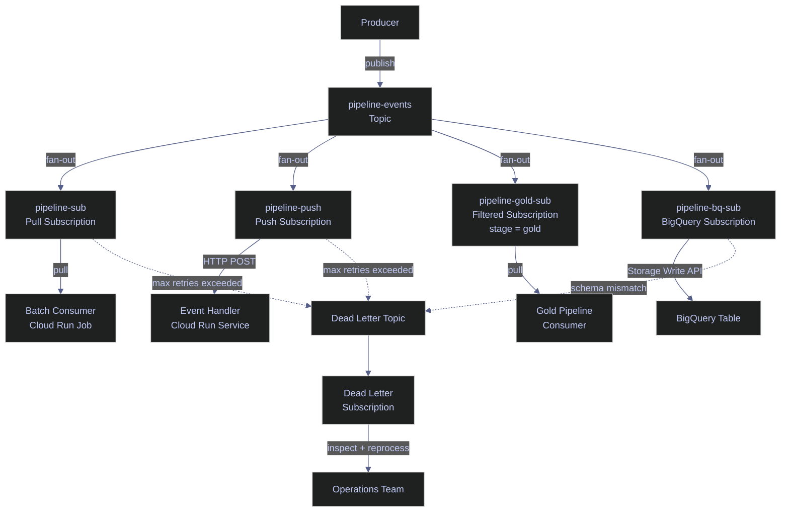

# Pub/Sub Topics and Subscriptions

> [!quote]
> "The key in making great and growable systems is much more to design how its modules communicate rather than what their internal properties and behaviors should be."
>
> — **Alan Kay**, *The Early History of Smalltalk* (1993)

> [!abstract]- Summary
>
> Covers Google Cloud Pub/Sub topic and subscription design with `gcloud`, including topic creation, pull and push delivery, retention, acknowledgement windows, dead letter routing, BigQuery subscriptions, and delivery-model tradeoffs for event-driven pipelines.
>
> **Why Pub/Sub**
> - Decouple producers from consumers so pipeline stages publish events to a topic instead of calling downstream stages directly
> - Support retry logic, dead letter queues, replay, fan-out, and horizontal consumer scaling without changing producer code
>
> **Prerequisites and pricing**
> - Enable `pubsub.googleapis.com`, grant `roles/pubsub.publisher` to publishing identities, and grant `roles/pubsub.subscriber` to consuming identities
> - For dead letter forwarding, grant the Pub/Sub service account `service-PROJECT_NUMBER@gcp-sa-pubsub.iam.gserviceaccount.com` publisher access on the dead letter topic and subscriber access on the source subscription
> - Price operations per publish and delivery with a 1 KB minimum, add storage cost for extended message retention, and expect backlog retention rather than throughput to be the main cost risk in most pipelines
>
> **Topic management**
> - Create topics with optional `--message-retention-duration`, schema validation, message encoding, labels, and CMEK encryption settings
> - Treat topics as the named publish channels that fan messages out to every attached subscription independently
>
> **Subscription management**
> - Create pull subscriptions with `--ack-deadline`, `--message-retention-duration`, expiration control, attribute filtering, exactly-once delivery, and retained acknowledged messages
> - Create push subscriptions with `--push-endpoint`, OIDC authentication, and retry backoff settings, then attach dead letter policies with `--dead-letter-topic` and `--max-delivery-attempts`
> - Use BigQuery or Cloud Storage subscriptions when Pub/Sub should write directly into analytics or object storage without an intermediate consumer process
>
> **Delivery models**
> - Compare pull, push, BigQuery, and Cloud Storage subscriptions by rate control, backpressure, authentication model, endpoint requirements, and best-fit workload shape
> - Use pull for batch and variable-rate consumers, push for event-driven HTTP handlers, BigQuery subscriptions for direct analytics ingestion, and Cloud Storage subscriptions for raw event archiving with minimal transformation
>
> **Operations and safety**
> - Warnings: Pub/Sub is at-least-once by default, short ack deadlines cause redelivery, inactive subscriptions expire after 31 days unless configured otherwise, and subscription filters both hide non-matching messages and remain immutable after creation
> - Recommendations table: the pull-vs-push-vs-BigQuery comparison table maps consumer architecture, rate control, backpressure, authentication, and ideal use cases to the right subscription type

> [!warning] Knowledge-only refresh
>
> The original Serverless demo project used for this folder no longer exists. This note keeps the generic `gcloud` examples and sample outputs as operator reference, but no Pub/Sub topics, subscriptions, push endpoints, or dead-letter paths were recreated during this refresh.
>
> The edits below only correct product behavior from current Pub/Sub documentation, including immutable subscription filters, export-subscription guidance, and current storage-pricing boundaries.

> [!note]- Glossary
>
> **Pub/Sub**
> - Google Cloud's managed messaging service for asynchronous event publication and delivery between independent producers and consumers.
> - It matters here because the note treats Pub/Sub as the communication layer that keeps pipeline stages loosely coupled and independently scalable.
>
> > [!info] Communication, not execution
> >
> > Pub/Sub moves messages; it does not run business logic for you. Consumers still need to process, retry, and observe the delivered work.
>
> ---
>
> **Topic**
> - The named publish channel that producers send messages to in Pub/Sub.
> - It matters because every subscription in the note attaches to a topic and receives its own delivery stream from that source.
>
> > [!info] Topics enable fan-out
> >
> > One published message can be delivered independently to many subscriptions on the same topic. Adding a new consumer does not require changing the producer.
>
> ---
>
> **Subscription**
> - The delivery configuration that tells Pub/Sub how messages from a topic should reach a consumer or destination.
> - It matters because retention, acknowledgement behavior, dead letter handling, and push or pull delivery are all defined at the subscription layer.
>
> > [!warning] Source and delivery are separate
> >
> > A topic stores the publish path, but the subscription controls delivery semantics. Changing subscriptions can alter consumer behavior without touching the topic.
>
> ---
>
> **Pull subscription**
> - A subscription type in which the consumer explicitly requests messages from Pub/Sub when it is ready to process them.
> - It matters because pull is the default model for batch pipelines and workloads that need explicit rate control or natural backpressure.
>
> > [!info] Consumer controls pace
> >
> > Pull keeps the consumer in charge of how fast messages are received. That makes it easier to protect downstream systems from overload.
>
> ---
>
> **Push subscription**
> - A subscription type in which Pub/Sub sends messages as HTTP POST requests to a configured endpoint.
> - It matters because push fits event-driven HTTP services such as Cloud Run or Cloud Functions that react immediately to new messages.
>
> > [!warning] Endpoint must stay healthy
> >
> > Push delivery assumes the endpoint is reachable and returns `2xx` responses when processing succeeds. Failures cause retry behavior that can hammer weak endpoints if backoff is not configured.
>
> ---
>
> **BigQuery subscription**
> - A Pub/Sub subscription type that writes messages directly into a BigQuery table using Google's managed integration path.
> - It matters because it removes the need for a separate consumer process when the destination is analytics storage rather than application logic.
>
> > [!info] No middle consumer needed
> >
> > BigQuery subscriptions are the simplest route for structured event ingestion into analytics tables, but they trade away custom processing flexibility.
>
> ---
>
> **Acknowledgement deadline**
> - The time window a consumer has to acknowledge a delivered message before Pub/Sub considers it outstanding and eligible for redelivery.
> - It matters because the deadline must exceed real processing time or duplicate deliveries become routine.
>
> > [!warning] Too short means retries
> >
> > A small ack deadline does not speed the pipeline up; it only increases the chance that Pub/Sub redelivers messages that are still being processed.
>
> ---
>
> **Message retention**
> - The configured period during which messages remain available in topic or subscription storage for replay or delayed consumption.
> - It matters because retention controls how long backlogs and historical messages survive for debugging, replay, or late-arriving consumers.
>
> > [!warning] Storage has a cost
> >
> > Longer retention is operationally useful, but large retained backlogs can become a real cost driver. Retention is not free historical archiving.
>
> ---
>
> **At-least-once delivery**
> - A delivery guarantee that ensures every message is delivered one or more times, rather than exactly once.
> - It matters because consumers in this note must tolerate duplicates and make processing idempotent unless a stronger guarantee is enabled.
>
> > [!warning] Duplicates are normal
> >
> > Redelivery is expected behavior under at-least-once semantics. Consumer logic must be safe when the same message appears more than once.
>
> ---
>
> **Exactly-once delivery**
> - An optional Pub/Sub delivery mode that adds deduplication guarantees beyond the normal at-least-once behavior.
> - It matters because it can reduce duplicate-processing risk for sensitive consumers at the cost of additional delivery overhead.
>
> > [!info] Stronger guarantees cost more
> >
> > Exactly-once delivery is not a free upgrade. It adds complexity and latency, so it should be enabled for a concrete reason rather than by default.
>
> ---
>
> **Attribute filter**
> - A server-side subscription rule that keeps only messages whose attributes match a given expression.
> - It matters because one topic can serve multiple selective consumers without each client implementing its own filtering logic.
>
> > [!warning] Non-matching messages disappear from that consumer
> >
> > Messages that fail the filter are not delivered to that subscription at all. If the filter is wrong, the consumer may silently miss valid events.
>
> ---
>
> **Dead letter topic**
> - A separate topic that receives messages that could not be processed successfully after repeated delivery attempts.
> - It matters because it prevents one poison message from being retried forever on the main subscription path.
>
> > [!warning] DLQ forwarding needs IAM too
> >
> > Dead letter routing is not just a configuration toggle. The Pub/Sub service account must have the required permissions or forwarding will not work correctly.
>
> ---
>
> **delivery attempt**
> - One try by Pub/Sub to hand a message to a subscription consumer or endpoint.
> - It matters because dead letter routing and retry analysis both depend on how many attempts a message has already consumed.
>
> > [!info] Attempts accumulate operational evidence
> >
> > Rising delivery attempts usually indicate a persistent consumer bug, malformed payload, or unreachable endpoint rather than a one-off transient failure.
>
> ---
>
> **OIDC token**
> - An identity token used by Pub/Sub push delivery to authenticate itself to an HTTPS endpoint.
> - It matters because push subscriptions in this note rely on service-account-backed OIDC authentication rather than anonymous inbound requests.
>
> > [!info] Push auth is explicit
> >
> > Pub/Sub can prove its identity to the receiver, but the endpoint must still validate the token audience and caller identity correctly.
>
> ---
>
> **subscription expiration**
> - The inactivity-based deletion behavior that removes a subscription after a configured period without observed activity.
> - It matters because infrequent pipelines can break silently if an unused subscription expires before the next publish window.
>
> > [!warning] Infrequent is not inactive on purpose
> >
> > Monthly or sporadic workloads can look abandoned to the default expiration policy. Set an explicit value or `never` when the subscription must persist.
>
> ---
>
> **seek**
> - A Pub/Sub replay operation that moves a subscription's read position to a chosen timestamp or retained message point.
> - It matters because retention only becomes operationally useful when messages can be replayed intentionally for debugging or recovery.
>
> > [!info] Replay is an explicit action
> >
> > Retained messages do not reappear on their own. Seek is the control that lets operators revisit historical message state when needed.


## Topic Management

A topic is the named channel that producers publish messages to. Topics are regional resources — messages published to a topic in `us-central1` are stored in that region. Multiple subscriptions can attach to the same topic, each receiving an independent copy of every message (fan-out pattern). The maximum message size is 10 MB per message.

### gcloud | Create and manage topics

Use `gcloud pubsub topics create` to create a new topic. A topic must exist before any subscription can be attached to it or any message published. Topics can optionally enforce schema validation (Avro or Protocol Buffers) to reject malformed messages at publish time.

#### gcloud | Create a topic

Create a named topic in the current project. The topic name must be unique within the project and can contain letters, numbers, hyphens, and underscores.

```bash
gcloud pubsub topics create pipeline-events
```

```text
Created topic [projects/my-project/topics/pipeline-events].
```

#### gcloud | Create a topic with message retention

By default, topics do not retain messages — once delivered to all subscriptions, the message is eligible for deletion. Enabling topic-level message retention stores messages for the specified duration, allowing subscriptions created later to replay historical messages.

```bash
gcloud pubsub topics create pipeline-events-retained \
  --message-retention-duration=7d
```

```text
Created topic [projects/my-project/topics/pipeline-events-retained].
```

#### gcloud | List topics

List all topics in the current project. Useful for verifying topic creation or auditing existing topics.

```bash
gcloud pubsub topics list --format="table(name)"
```

```text
NAME
projects/my-project/topics/pipeline-events
projects/my-project/topics/pipeline-events-retained
projects/my-project/topics/pipeline-events-dead-letter
```

| Flag | Syntax | Description |
|---|---|---|
| `--message-retention-duration` | `--message-retention-duration=7d` | Retain messages at the topic level for replay (max 31 days) |
| `--schema` | `--schema=my-schema` | Bind an Avro or Protocol Buffer schema for publish-time validation |
| `--message-encoding` | `--message-encoding=JSON` | Encoding for schema-validated messages (`JSON` or `BINARY`) |
| `--labels` | `--labels=env=prod,team=data` | Key-value labels for cost tracking and resource organization |
| `--kms-key` | `--kms-key=projects/.../cryptoKeys/key` | Customer-managed encryption key (CMEK) for message encryption at rest |

## Subscription Management

Subscriptions are the delivery mechanisms that connect consumers to topics. Each subscription receives an independent copy of every message published to its topic. Pub/Sub supports four subscription types: **pull** (consumer fetches messages), **push** (Pub/Sub delivers to an HTTP endpoint), **BigQuery** (Pub/Sub writes directly to a BigQuery table), and **Cloud Storage** (Pub/Sub writes to GCS buckets). BigQuery and Cloud Storage subscriptions are export subscriptions: they remove subscriber code when the destination only needs direct durable writes, but Dataflow or a custom consumer is still the better fit once you need joins, windowing, aggregation, or rich transformation. A single topic can have up to 10,000 subscriptions.

### gcloud | Create a pull subscription

Pull subscriptions require the consumer to actively fetch messages. The consumer controls the rate of processing, making pull the default choice for batch pipelines and variable-rate workloads. The `--ack-deadline` gives the consumer a window to process and acknowledge each message before Pub/Sub redelivers it. The `--message-retention-duration` keeps messages in the subscription backlog for the specified period, enabling replay.

#### gcloud | Create a pull subscription with retention

Create a pull subscription attached to an existing topic. The ack deadline of 60 seconds gives the consumer one minute to process each message before redelivery. The 7-day retention enables replaying messages for debugging.

```bash
gcloud pubsub subscriptions create pipeline-sub \
  --topic=pipeline-events \
  --ack-deadline=60 \
  --message-retention-duration=7d
```

```text
Created subscription [projects/my-project/subscriptions/pipeline-sub].
```

> [!info] At-Least-Once Delivery
>
> Pub/Sub guarantees **at-least-once delivery**: every message will be delivered at least once, but may be delivered more than once. The `--ack-deadline` determines how long the consumer has to process and acknowledge a message before Pub/Sub considers it unacknowledged and redelivers it. Set the deadline to exceed your maximum expected processing time plus margin. The default is 10 seconds; the maximum is 600 seconds.

#### gcloud | Create a pull subscription with attribute filtering

Subscription-level attribute filters allow the subscription to receive only messages matching a specific condition. The filter is evaluated server-side — non-matching messages are automatically acknowledged and never delivered to the consumer. This enables a single topic to serve multiple consumers with different filtering criteria, without any client-side logic.

```bash
gcloud pubsub subscriptions create pipeline-gold-sub \
  --topic=pipeline-events \
  --ack-deadline=60 \
  --message-filter='attributes.stage = "gold"'
```

```text
Created subscription [projects/my-project/subscriptions/pipeline-gold-sub].
```

> [!info] Filters are immutable and still bill throughput
>
> Pub/Sub lets pull and push subscriptions filter on message attributes, but you cannot edit the filter on an existing subscription. The safe change path is to snapshot the old subscription, create a new one with the new filter, then seek the new subscription to that snapshot.
>
> Non-matching messages are automatically acknowledged for that subscription, but Pub/Sub throughput charges still apply to those filtered messages.

> [!warning] Subscription Expiration
>
> Subscriptions with no subscriber activity (pull, push delivery, or message backlog) for 31 days are automatically deleted by default. This can silently break pipelines that process data on an infrequent schedule (e.g., monthly batch jobs).

> [!success] Set Expiration Policy Explicitly
>
> Set `--expiration-period=never` on subscriptions that must persist regardless of activity. For time-limited subscriptions, set an explicit duration. Always verify subscription existence before publishing to prevent silent message loss.

| Flag | Syntax | Description |
|---|---|---|
| `--topic` | `--topic=my-topic` | Topic to subscribe to (required) |
| `--ack-deadline` | `--ack-deadline=60` | Seconds before unacknowledged messages are redelivered (default: 10, max: 600) |
| `--message-retention-duration` | `--message-retention-duration=7d` | How long unacknowledged messages are retained (default: 7d, max: 31d) |
| `--expiration-period` | `--expiration-period=never` | Auto-delete subscription after inactivity (default: 31d, `never` to disable) |
| `--message-filter` | `--message-filter='attributes.key = "val"'` | Server-side attribute filter expression (immutable after creation) |
| `--enable-exactly-once-delivery` | `--enable-exactly-once-delivery` | Enable exactly-once delivery for pull subscriptions in a single region |
| `--retain-acked-messages` | `--retain-acked-messages` | Keep acknowledged messages for replay via seek |
| `--labels` | `--labels=env=prod` | Key-value labels for cost tracking |

### gcloud | Create a push subscription

Push subscriptions have Pub/Sub deliver messages as HTTP POST requests to an endpoint. The endpoint must return a `2xx` status to acknowledge the message; any other response triggers redelivery with configurable exponential backoff. Push is the natural fit for event-driven architectures where a Cloud Run service or Cloud Function processes messages as they arrive.

#### gcloud | Create a push subscription to a Cloud Run endpoint

Create a push subscription that delivers messages to a Cloud Run service URL. Pub/Sub authenticates the push request using an OIDC token from the specified service account, which the receiving service validates.

```bash
gcloud pubsub subscriptions create pipeline-push \
  --topic=pipeline-events \
  --push-endpoint=https://my-service-xyz.run.app/pubsub \
  --push-auth-service-account=pubsub-invoker@my-project.iam.gserviceaccount.com
```

```text
Created subscription [projects/my-project/subscriptions/pipeline-push].
```

#### gcloud | Configure push retry policy

By default, push subscriptions retry immediately on failure. For transient errors (HTTP 429, 5xx), configure exponential backoff to avoid overwhelming the endpoint. The minimum backoff is the initial delay; the maximum backoff caps the exponential growth.

```bash
gcloud pubsub subscriptions update pipeline-push \
  --min-retry-delay=10s \
  --max-retry-delay=600s
```

```text
Updated subscription [projects/my-project/subscriptions/pipeline-push].
```

| Flag | Syntax | Description |
|---|---|---|
| `--push-endpoint` | `--push-endpoint=https://...` | HTTPS URL that receives POST requests with messages |
| `--push-auth-service-account` | `--push-auth-service-account=sa@project.iam.gserviceaccount.com` | Service account for OIDC authentication on push requests |
| `--push-auth-token-audience` | `--push-auth-token-audience=https://...` | Audience claim for the OIDC token (defaults to push endpoint URL) |
| `--min-retry-delay` | `--min-retry-delay=10s` | Minimum backoff delay for push delivery retries |
| `--max-retry-delay` | `--max-retry-delay=600s` | Maximum backoff delay for push delivery retries |

### gcloud | Configure dead letter topics

Dead letter topics capture messages that repeatedly fail processing. After a configurable number of delivery attempts, Pub/Sub stops trying to deliver the message to the main subscription and routes it to the dead letter topic instead. Without a dead letter topic, a single unprocessable message — a malformed payload, a persistent consumer bug, or an oversized record — retries indefinitely and can block all subsequent message processing.

#### gcloud | Create a dead letter topic

Create a dedicated topic to receive messages that exhaust their delivery attempts. A separate subscription on the dead letter topic allows you to inspect, debug, and optionally reprocess failed messages.

```bash
gcloud pubsub topics create pipeline-events-dead-letter
```

```text
Created topic [projects/my-project/topics/pipeline-events-dead-letter].
```

#### gcloud | Attach dead letter policy to subscription

Update an existing subscription to forward messages after a maximum number of delivery attempts. The Pub/Sub service account must have `roles/pubsub.publisher` on the dead letter topic and `roles/pubsub.subscriber` on the source subscription for forwarding to work.

```bash
gcloud pubsub subscriptions update pipeline-sub \
  --dead-letter-topic=pipeline-events-dead-letter \
  --max-delivery-attempts=5
```

```text
Updated subscription [projects/my-project/subscriptions/pipeline-sub].
```

> [!tip] Monitor Dead-Lettered Messages
>
> Use the Cloud Monitoring metric `pubsub.googleapis.com/subscription/dead_letter_message_count` to alert when messages are being dead-lettered. Additionally, monitor `oldest_unacked_message_age` on the source subscription — a rising value above your ack deadline threshold often signals that poison-pill messages are causing repeated NACKs before they reach the dead letter topic.

| Flag | Syntax | Description |
|---|---|---|
| `--dead-letter-topic` | `--dead-letter-topic=my-dlq-topic` | Topic to receive messages that exceed max delivery attempts |
| `--max-delivery-attempts` | `--max-delivery-attempts=5` | Number of delivery attempts before forwarding to dead letter (min: 5, max: 100) |
| `--clear-dead-letter-policy` | `--clear-dead-letter-policy` | Remove the dead letter policy from a subscription |

## Pull vs Push Delivery Models

Choosing between pull and push delivery depends on the consumer architecture. Pull gives the consumer full control over message rate and backpressure — the consumer calls `pull()` when ready. Push offloads delivery timing to Pub/Sub, which sends messages as HTTP POST requests to an endpoint. For data engineering workloads, pull is the default; push suits stateless HTTP services like Cloud Run or Cloud Functions.

| Feature | Pull | Push |
|---|---|---|
| Consumer controls rate | Yes | No (Pub/Sub controls delivery rate) |
| Works with Cloud Run | Both — but push is simpler | Yes (native trigger) |
| Works with offline consumers | Yes (messages accumulate in backlog) | No (requires always-on HTTP endpoint) |
| Backpressure | Natural (consumer stops pulling) | Configurable exponential backoff retry |
| Authentication | Consumer authenticates to Pub/Sub | Pub/Sub authenticates to endpoint via OIDC |
| Best for | Batch pipelines, controlled throughput | Event-driven triggers, serverless |

> [!question] Pull vs Push vs BigQuery Subscription
>
> **Pull** — the consumer controls the pace. Best for batch pipelines, variable-rate processing, and consumers that need backpressure control. Use when the consumer is a Cloud Run Job, Dataflow pipeline, or any long-running process.
>
> **Push** — Pub/Sub sends each message as an HTTP POST to a configured endpoint. Best for event-driven architectures where a stateless Cloud Run Service or Cloud Function processes messages as they arrive.
>
> **BigQuery subscription** — Pub/Sub writes messages directly to a BigQuery table without any consumer code. Best for analytics pipelines where messages are structured data destined for BigQuery. Supports schema mapping, dead-letter handling, and uses the BigQuery Storage Write API internally, but still follows at-least-once delivery semantics. Eliminates the need for an intermediate consumer process entirely.

> [!info] BigQuery Subscriptions (GA)
>
> BigQuery subscriptions write messages directly to a BigQuery table using the Storage Write API, with no consumer process required. They are the simplest Pub/Sub → BigQuery path when the messages do not need pre-ingestion transformation, but they remain an at-least-once export mechanism rather than an exactly-once sink. Create with: `gcloud pubsub subscriptions create my-bq-sub --topic=my-topic --bigquery-table=project:dataset.table`.

> [!info] Cloud Storage export subscriptions
>
> Cloud Storage subscriptions are the parallel export pattern for raw event capture. Pub/Sub batches messages into objects in an existing bucket and acknowledges the source message only after the object write succeeds, which makes the feature useful for durable archiving without standing up Dataflow.
>
> Use a Cloud Storage subscription when the destination just needs stored event files, optionally with lightweight SMT-based reshaping. If the pipeline needs cross-message aggregation, windowing, or non-trivial transformation, a Dataflow subscriber is still the better choice.



## Related

- [pubsub-messaging](https://alp78.github.io/elysium/06-GCP/Serverless/pubsub-messaging) — Publishing messages to topics and consuming from subscriptions
- [cloud-run-jobs-vs-services](https://alp78.github.io/elysium/06-GCP/Serverless/cloud-run-jobs-vs-services) — Cloud Run Services are common push subscription endpoints
- [gcp-apis-and-services](https://alp78.github.io/elysium/06-GCP/01-Core/02-gcp-apis-and-services) — `pubsub.googleapis.com` must be enabled
- [service-accounts-and-iam](https://alp78.github.io/elysium/06-GCP/Security/service-accounts-and-iam) — `roles/pubsub.publisher` and `roles/pubsub.subscriber` roles
- [cloud-logging](https://alp78.github.io/elysium/06-GCP/Logging/cloud-logging) — Pub/Sub delivery failures appear in Cloud Logging
- [gcp-scheduling](https://alp78.github.io/elysium/12-Orchestration/Scheduling/gcp-scheduling) — Cloud Scheduler can publish to Pub/Sub topics on a cron schedule
- [Terraform Pub/Sub blocks](https://alp78.github.io/elysium/07-Terraform/Block-Library/iam-secrets-serverless) — Provision topics, subscriptions, and IAM bindings as infrastructure-as-code
- [24_py_streaming_realtime](https://alp78.github.io/elysium/02-Programming-Languages/Python/24_py_streaming_realtime) — Python `google-cloud-pubsub` client library for publishing and consuming
- [24_cs_streaming_realtime](https://alp78.github.io/elysium/02-Programming-Languages/CSharp/24_cs_streaming_realtime) — C# `Google.Cloud.PubSub.V1` client library for publishing and consuming

## References

- [Pub/Sub overview](https://cloud.google.com/pubsub/docs/overview)
- [Dead letter topics](https://cloud.google.com/pubsub/docs/dead-letter-topics)
- [Choosing pull vs push](https://cloud.google.com/pubsub/docs/pull)
- [BigQuery subscriptions](https://cloud.google.com/pubsub/docs/bigquery)
- [Cloud Storage subscriptions](https://cloud.google.com/pubsub/docs/cloudstorage)
- [Subscription expiration](https://cloud.google.com/pubsub/docs/subscription-properties#expiration)
- [Filtering messages](https://cloud.google.com/pubsub/docs/filtering)
- [Subscription properties](https://cloud.google.com/pubsub/docs/subscription-properties)
- [Pub/Sub pricing](https://cloud.google.com/pubsub/pricing)
