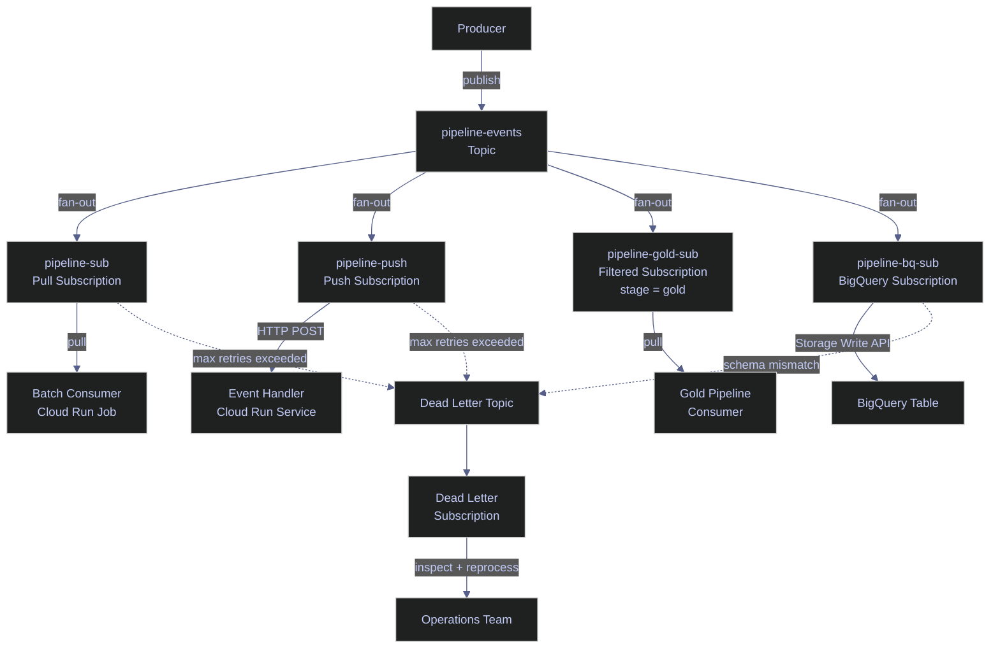

# Pub/Sub Topics and Subscriptions

> [!quote]
> "The key in making great and growable systems is much more to design how its modules communicate rather than what their internal properties and behaviors should be."
>
> — **Alan Kay**, *The Early History of Smalltalk* (1993)

Pub/Sub decouples producers from consumers. Instead of pipeline stages calling each other directly (tight coupling), they publish events to topics and subscribe independently. This pattern enables retry logic, dead letter queues, and horizontal scaling without changing the producer code. A topic is the named channel; subscriptions are the delivery mechanisms. Multiple subscriptions on the same topic each receive all messages independently.

> [!todo] Prerequisites
>
> 1. Enable the Pub/Sub API: `gcloud services enable pubsub.googleapis.com`
> 2. Ensure the publishing identity has `roles/pubsub.publisher` on the target topic
> 3. Ensure the consuming identity has `roles/pubsub.subscriber` on the target subscription
> 4. For dead letter forwarding, grant `roles/pubsub.publisher` on the dead letter topic and `roles/pubsub.subscriber` on the source subscription to the Pub/Sub service account (`service-PROJECT_NUMBER@gcp-sa-pubsub.iam.gserviceaccount.com`)

> [!info] Pricing Model
>
> Pub/Sub charges per message operation (publish + delivery), with a 1 KB minimum per operation. Message retention beyond the default 7-day window incurs storage fees at the GCS Nearline rate. Seek operations on retained messages are billed separately. Throughput pricing is negligible for most pipelines — the cost risk is in large backlogs with extended retention.

### Why Pub/Sub for Data Pipelines

Without Pub/Sub, pipeline stages call each other directly — a failure in Stage B blocks Stage A. With Pub/Sub, Stage A publishes to a topic and Stage B subscribes independently, enabling retry logic, dead letter queues, and horizontal scaling without modifying the producer. This decoupling is the foundation of event-driven data architectures.

```text
Without Pub/Sub (tight coupling):
  Stage A calls Stage B directly → Stage B failure blocks Stage A

With Pub/Sub (loose coupling):
  Stage A publishes to topic → Stage B subscribes and processes independently
  Stage B can retry, scale, or be replaced without touching Stage A
```

## Topic Management

A topic is the named channel that producers publish messages to. Topics are regional resources — messages published to a topic in `us-central1` are stored in that region. Multiple subscriptions can attach to the same topic, each receiving an independent copy of every message (fan-out pattern). The maximum message size is 10 MB per message.

### gcloud | Create and manage topics

Use `gcloud pubsub topics create` to create a new topic. A topic must exist before any subscription can be attached to it or any message published. Topics can optionally enforce schema validation (Avro or Protocol Buffers) to reject malformed messages at publish time.

#### gcloud | Create a topic

Create a named topic in the current project. The topic name must be unique within the project and can contain letters, numbers, hyphens, and underscores.

```bash
gcloud pubsub topics create pipeline-events
```

```text
Created topic [projects/my-project/topics/pipeline-events].
```

#### gcloud | Create a topic with message retention

By default, topics do not retain messages — once delivered to all subscriptions, the message is eligible for deletion. Enabling topic-level message retention stores messages for the specified duration, allowing subscriptions created later to replay historical messages.

```bash
gcloud pubsub topics create pipeline-events-retained \
  --message-retention-duration=7d
```

```text
Created topic [projects/my-project/topics/pipeline-events-retained].
```

#### gcloud | List topics

List all topics in the current project. Useful for verifying topic creation or auditing existing topics.

```bash
gcloud pubsub topics list --format="table(name)"
```

```text
NAME
projects/my-project/topics/pipeline-events
projects/my-project/topics/pipeline-events-retained
projects/my-project/topics/pipeline-events-dead-letter
```

| Flag | Syntax | Description |
|---|---|---|
| `--message-retention-duration` | `--message-retention-duration=7d` | Retain messages at the topic level for replay (max 31 days) |
| `--schema` | `--schema=my-schema` | Bind an Avro or Protocol Buffer schema for publish-time validation |
| `--message-encoding` | `--message-encoding=JSON` | Encoding for schema-validated messages (`JSON` or `BINARY`) |
| `--labels` | `--labels=env=prod,team=data` | Key-value labels for cost tracking and resource organization |
| `--kms-key` | `--kms-key=projects/.../cryptoKeys/key` | Customer-managed encryption key (CMEK) for message encryption at rest |

## Subscription Management

Subscriptions are the delivery mechanisms that connect consumers to topics. Each subscription receives an independent copy of every message published to its topic. Pub/Sub supports four subscription types: **pull** (consumer fetches messages), **push** (Pub/Sub delivers to an HTTP endpoint), **BigQuery** (Pub/Sub writes directly to a BigQuery table), and **Cloud Storage** (Pub/Sub writes to GCS buckets). A single topic can have up to 10,000 subscriptions.

### gcloud | Create a pull subscription

Pull subscriptions require the consumer to actively fetch messages. The consumer controls the rate of processing, making pull the default choice for batch pipelines and variable-rate workloads. The `--ack-deadline` gives the consumer a window to process and acknowledge each message before Pub/Sub redelivers it. The `--message-retention-duration` keeps messages in the subscription backlog for the specified period, enabling replay.

#### gcloud | Create a pull subscription with retention

Create a pull subscription attached to an existing topic. The ack deadline of 60 seconds gives the consumer one minute to process each message before redelivery. The 7-day retention enables replaying messages for debugging.

```bash
gcloud pubsub subscriptions create pipeline-sub \
  --topic=pipeline-events \
  --ack-deadline=60 \
  --message-retention-duration=7d
```

```text
Created subscription [projects/my-project/subscriptions/pipeline-sub].
```

> [!info] At-Least-Once Delivery
>
> Pub/Sub guarantees **at-least-once delivery**: every message will be delivered at least once, but may be delivered more than once. The `--ack-deadline` determines how long the consumer has to process and acknowledge a message before Pub/Sub considers it unacknowledged and redelivers it. Set the deadline to exceed your maximum expected processing time plus margin. The default is 10 seconds; the maximum is 600 seconds.

#### gcloud | Create a pull subscription with attribute filtering

Subscription-level attribute filters allow the subscription to receive only messages matching a specific condition. The filter is evaluated server-side — non-matching messages are automatically acknowledged and never delivered to the consumer. This enables a single topic to serve multiple consumers with different filtering criteria, without any client-side logic.

```bash
gcloud pubsub subscriptions create pipeline-gold-sub \
  --topic=pipeline-events \
  --ack-deadline=60 \
  --message-filter='attributes.stage = "gold"'
```

```text
Created subscription [projects/my-project/subscriptions/pipeline-gold-sub].
```

> [!warning] Subscription Expiration
>
> Subscriptions with no subscriber activity (pull, push delivery, or message backlog) for 31 days are automatically deleted by default. This can silently break pipelines that process data on an infrequent schedule (e.g., monthly batch jobs).

> [!success] Set Expiration Policy Explicitly
>
> Set `--expiration-period=never` on subscriptions that must persist regardless of activity. For time-limited subscriptions, set an explicit duration. Always verify subscription existence before publishing to prevent silent message loss.

| Flag | Syntax | Description |
|---|---|---|
| `--topic` | `--topic=my-topic` | Topic to subscribe to (required) |
| `--ack-deadline` | `--ack-deadline=60` | Seconds before unacknowledged messages are redelivered (default: 10, max: 600) |
| `--message-retention-duration` | `--message-retention-duration=7d` | How long unacknowledged messages are retained (default: 7d, max: 31d) |
| `--expiration-period` | `--expiration-period=never` | Auto-delete subscription after inactivity (default: 31d, `never` to disable) |
| `--message-filter` | `--message-filter='attributes.key = "val"'` | Server-side attribute filter expression |
| `--enable-exactly-once-delivery` | `--enable-exactly-once-delivery` | Enable exactly-once delivery (adds latency for deduplication) |
| `--retain-acked-messages` | `--retain-acked-messages` | Keep acknowledged messages for replay via seek |
| `--labels` | `--labels=env=prod` | Key-value labels for cost tracking |

### gcloud | Create a push subscription

Push subscriptions have Pub/Sub deliver messages as HTTP POST requests to an endpoint. The endpoint must return a `2xx` status to acknowledge the message; any other response triggers redelivery with configurable exponential backoff. Push is the natural fit for event-driven architectures where a Cloud Run service or Cloud Function processes messages as they arrive.

#### gcloud | Create a push subscription to a Cloud Run endpoint

Create a push subscription that delivers messages to a Cloud Run service URL. Pub/Sub authenticates the push request using an OIDC token from the specified service account, which the receiving service validates.

```bash
gcloud pubsub subscriptions create pipeline-push \
  --topic=pipeline-events \
  --push-endpoint=https://my-service-xyz.run.app/pubsub \
  --push-auth-service-account=pubsub-invoker@my-project.iam.gserviceaccount.com
```

```text
Created subscription [projects/my-project/subscriptions/pipeline-push].
```

#### gcloud | Configure push retry policy

By default, push subscriptions retry immediately on failure. For transient errors (HTTP 429, 5xx), configure exponential backoff to avoid overwhelming the endpoint. The minimum backoff is the initial delay; the maximum backoff caps the exponential growth.

```bash
gcloud pubsub subscriptions update pipeline-push \
  --min-retry-delay=10s \
  --max-retry-delay=600s
```

```text
Updated subscription [projects/my-project/subscriptions/pipeline-push].
```

| Flag | Syntax | Description |
|---|---|---|
| `--push-endpoint` | `--push-endpoint=https://...` | HTTPS URL that receives POST requests with messages |
| `--push-auth-service-account` | `--push-auth-service-account=sa@project.iam.gserviceaccount.com` | Service account for OIDC authentication on push requests |
| `--push-auth-token-audience` | `--push-auth-token-audience=https://...` | Audience claim for the OIDC token (defaults to push endpoint URL) |
| `--min-retry-delay` | `--min-retry-delay=10s` | Minimum backoff delay for push delivery retries |
| `--max-retry-delay` | `--max-retry-delay=600s` | Maximum backoff delay for push delivery retries |

### gcloud | Configure dead letter topics

Dead letter topics capture messages that repeatedly fail processing. After a configurable number of delivery attempts, Pub/Sub stops trying to deliver the message to the main subscription and routes it to the dead letter topic instead. Without a dead letter topic, a single unprocessable message — a malformed payload, a persistent consumer bug, or an oversized record — retries indefinitely and can block all subsequent message processing.

#### gcloud | Create a dead letter topic

Create a dedicated topic to receive messages that exhaust their delivery attempts. A separate subscription on the dead letter topic allows you to inspect, debug, and optionally reprocess failed messages.

```bash
gcloud pubsub topics create pipeline-events-dead-letter
```

```text
Created topic [projects/my-project/topics/pipeline-events-dead-letter].
```

#### gcloud | Attach dead letter policy to subscription

Update an existing subscription to forward messages after a maximum number of delivery attempts. The Pub/Sub service account must have `roles/pubsub.publisher` on the dead letter topic and `roles/pubsub.subscriber` on the source subscription for forwarding to work.

```bash
gcloud pubsub subscriptions update pipeline-sub \
  --dead-letter-topic=pipeline-events-dead-letter \
  --max-delivery-attempts=5
```

```text
Updated subscription [projects/my-project/subscriptions/pipeline-sub].
```

> [!tip] Monitor Dead-Lettered Messages
>
> Use the Cloud Monitoring metric `pubsub.googleapis.com/subscription/dead_letter_message_count` to alert when messages are being dead-lettered. Additionally, monitor `oldest_unacked_message_age` on the source subscription — a rising value above your ack deadline threshold often signals that poison-pill messages are causing repeated NACKs before they reach the dead letter topic.

| Flag | Syntax | Description |
|---|---|---|
| `--dead-letter-topic` | `--dead-letter-topic=my-dlq-topic` | Topic to receive messages that exceed max delivery attempts |
| `--max-delivery-attempts` | `--max-delivery-attempts=5` | Number of delivery attempts before forwarding to dead letter (min: 5, max: 100) |
| `--clear-dead-letter-policy` | `--clear-dead-letter-policy` | Remove the dead letter policy from a subscription |

## Pull vs Push Delivery Models

Choosing between pull and push delivery depends on the consumer architecture. Pull gives the consumer full control over message rate and backpressure — the consumer calls `pull()` when ready. Push offloads delivery timing to Pub/Sub, which sends messages as HTTP POST requests to an endpoint. For data engineering workloads, pull is the default; push suits stateless HTTP services like Cloud Run or Cloud Functions.

| Feature | Pull | Push |
|---|---|---|
| Consumer controls rate | Yes | No (Pub/Sub controls delivery rate) |
| Works with Cloud Run | Both — but push is simpler | Yes (native trigger) |
| Works with offline consumers | Yes (messages accumulate in backlog) | No (requires always-on HTTP endpoint) |
| Backpressure | Natural (consumer stops pulling) | Configurable exponential backoff retry |
| Authentication | Consumer authenticates to Pub/Sub | Pub/Sub authenticates to endpoint via OIDC |
| Best for | Batch pipelines, controlled throughput | Event-driven triggers, serverless |

> [!question] Pull vs Push vs BigQuery Subscription
>
> **Pull** — the consumer controls the pace. Best for batch pipelines, variable-rate processing, and consumers that need backpressure control. Use when the consumer is a Cloud Run Job, Dataflow pipeline, or any long-running process.
>
> **Push** — Pub/Sub sends each message as an HTTP POST to a configured endpoint. Best for event-driven architectures where a stateless Cloud Run Service or Cloud Function processes messages as they arrive.
>
> **BigQuery subscription** — Pub/Sub writes messages directly to a BigQuery table without any consumer code. Best for analytics pipelines where messages are structured data destined for BigQuery. Supports schema mapping, dead-letter handling, and uses the BigQuery Storage Write API internally. Eliminates the need for an intermediate consumer process entirely.

> [!info] BigQuery Subscriptions (GA)
>
> BigQuery subscriptions write messages directly to a BigQuery table using the Storage Write API, with no consumer process required. The subscription handles schema mapping (JSON message fields → BigQuery columns), metadata columns (`subscription_name`, `message_id`, `publish_time`, `attributes`), and dead-lettering for schema mismatches. This is the simplest path for Pub/Sub → BigQuery analytics pipelines. Create with: `gcloud pubsub subscriptions create my-bq-sub --topic=my-topic --bigquery-table=project:dataset.table`.



## Related

- [pubsub-messaging](https://alp78.github.io/elysium/06-GCP/Serverless/pubsub-messaging) — Publishing messages to topics and consuming from subscriptions
- [cloud-run-jobs-vs-services](https://alp78.github.io/elysium/06-GCP/Serverless/cloud-run-jobs-vs-services) — Cloud Run Services are common push subscription endpoints
- [gcp-projects-and-apis](https://alp78.github.io/elysium/06-GCP/Core/gcp-projects-and-apis) — `pubsub.googleapis.com` must be enabled
- [service-accounts-and-iam](https://alp78.github.io/elysium/06-GCP/Security/service-accounts-and-iam) — `roles/pubsub.publisher` and `roles/pubsub.subscriber` roles
- [cloud-logging](https://alp78.github.io/elysium/06-GCP/Logging/cloud-logging) — Pub/Sub delivery failures appear in Cloud Logging
- [gcp-scheduling](https://alp78.github.io/elysium/12-Orchestration/Scheduling/gcp-scheduling) — Cloud Scheduler can publish to Pub/Sub topics on a cron schedule
- [Terraform Pub/Sub blocks](https://alp78.github.io/elysium/07-Terraform/Block-Library/tf-iam-secrets-serverless) — Provision topics, subscriptions, and IAM bindings as infrastructure-as-code
- [24_py_streaming_realtime](https://alp78.github.io/elysium/02-Programming-Languages/Python/24_py_streaming_realtime) — Python `google-cloud-pubsub` client library for publishing and consuming
- [24_cs_streaming_realtime](https://alp78.github.io/elysium/02-Programming-Languages/CSharp/24_cs_streaming_realtime) — C# `Google.Cloud.PubSub.V1` client library for publishing and consuming

## References

- [Pub/Sub overview](https://cloud.google.com/pubsub/docs/overview)
- [Dead letter topics](https://cloud.google.com/pubsub/docs/dead-letter-topics)
- [Choosing pull vs push](https://cloud.google.com/pubsub/docs/pull)
- [BigQuery subscriptions](https://cloud.google.com/pubsub/docs/bigquery)
- [Subscription expiration](https://cloud.google.com/pubsub/docs/subscription-properties#expiration)
- [Filtering messages](https://cloud.google.com/pubsub/docs/filtering)
