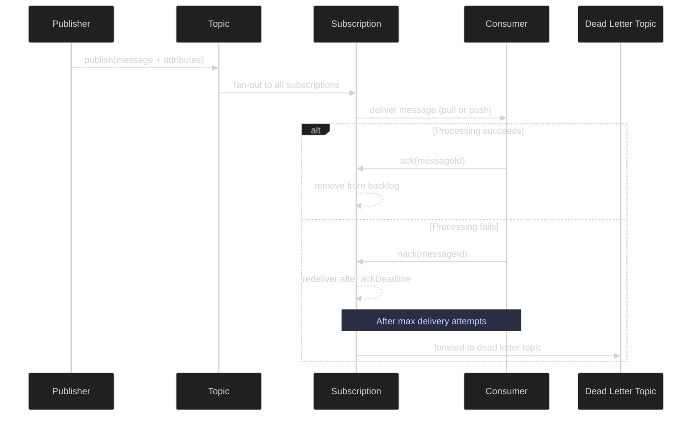
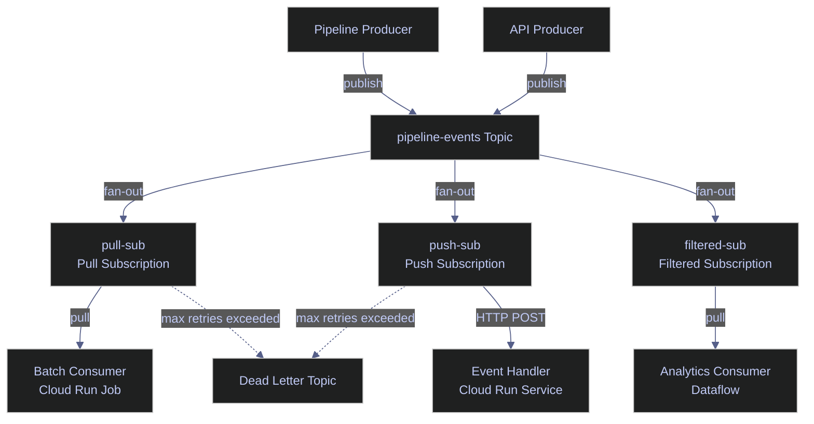

# Pub/Sub Messaging

> [!quote]
> "The basic problem of communication is that of reproducing at one point either exactly or approximately a message selected at another point."
>
> — **Claude Shannon**, *A Mathematical Theory of Communication* (1948)

> [!abstract]- Summary
>
> Covers operational Pub/Sub message flow with `gcloud`, including publishing payloads and attributes, pulling and acknowledging deliveries, monitoring subscription backlog, and designing for idempotent consumers under at-least-once delivery semantics.
>
> **Prerequisites and pricing**
> - Enable `pubsub.googleapis.com`, grant `roles/pubsub.publisher` to the publishing identity, grant `roles/pubsub.subscriber` to the consuming identity, and create the topic and subscription before testing message flow
> - Price Pub/Sub per publish and delivery operation with a 1 KB minimum, and treat retained backlog storage rather than raw throughput as the main budget drift risk in most pipelines
>
> **Publishing messages**
> - Publish message bodies with `gcloud pubsub topics publish --message=...`, attach metadata with `--attribute=...`, and use `--ordering-key` or `--message-file` when ordering or file-backed payloads are needed
> - Treat message bodies as opaque bytes and attributes as filterable metadata that subscriptions can use without parsing the payload
>
> **Consuming messages**
> - Pull messages with `gcloud pubsub subscriptions pull`, use `--limit`, `--wait`, and output formatting for inspection, and treat `--auto-ack` as a testing shortcut rather than a production pattern
> - Compare pull and push subscription behavior so the consumer model matches either batch backpressure control or event-driven HTTP delivery
>
> **Backlog and delivery semantics**
> - Monitor `numUndeliveredMessages` to detect lagging consumers and use retention settings to balance replay windows against silent storage growth
> - Understand ordering keys, exactly-once delivery, dead letter routing, and why idempotent consumer logic remains the safest default even when stronger guarantees are enabled
>
> **Message design**
> - Keep messages small, structured, and consistent, prefer JSON with a predictable schema, and publish a GCS pointer instead of a huge payload when data volume is large
> - Use schema validation on topics to reject malformed events before they enter the pipeline
>
> **Operations and safety**
> - Warnings: Pub/Sub delivers at least once by default, duplicates are expected, ordering is not guaranteed without ordering keys, and backlog storage can become a hidden cost center
> - Recommendations table: the push-versus-pull comparison and idempotency guidance map workload shape, backpressure, retry model, and endpoint type to the correct consumer design

> [!note]- Glossary
>
> **message body**
> - The actual payload bytes published into a Pub/Sub message, often encoded as JSON for human-readable event structure.
> - It matters because the body carries the business event content that consumers ultimately process, transform, or load downstream.
>
> > [!info] Pub/Sub treats bytes generically
> >
> > Pub/Sub does not care whether the payload is JSON, CSV, or binary. Structure is a producer-and-consumer contract, not a messaging-service guarantee.
>
> ---
>
> **message attribute**
> - A string key-value pair attached to a Pub/Sub message alongside the payload body.
> - It matters because attributes can drive routing, filtering, and operational classification without forcing consumers to parse the message body first.
>
> > [!info] Metadata is operational leverage
> >
> > Attributes are ideal for routing keys such as stage, run ID, or pipeline type. They keep selective delivery logic out of the payload parser.
>
> ---
>
> **`gcloud pubsub topics publish`**
> - The Google Cloud CLI command that publishes a single message to a Pub/Sub topic.
> - It matters because the note uses it as the fastest way to test event production, attributes, ordering keys, and payload shape from the terminal.
>
> > [!warning] CLI is not the throughput path
> >
> > The CLI is excellent for verification, but it is not the normal production path for sustained message publishing. Real publishers usually use client libraries with batching and flow control.
>
> ---
>
> **Pull consumption**
> - A message-consumption model in which the consumer explicitly asks Pub/Sub for messages when it is ready.
> - It matters because the note's `gcloud` examples use pull semantics and because data pipelines often need that explicit control over rate and concurrency.
>
> > [!info] Backpressure is natural
> >
> > Pull gives the consumer a built-in way to slow intake by simply requesting fewer messages. That makes it a strong default for batch and variable-rate workloads.
>
> ---
>
> **Push consumption**
> - A message-consumption model in which Pub/Sub sends each message to an HTTPS endpoint as an HTTP request.
> - It matters because push is the natural fit when the consumer is a stateless HTTP service rather than a long-running worker or batch job.
>
> > [!warning] Endpoint availability is part of the design
> >
> > Push assumes the receiver is reachable and healthy. A weak or misconfigured endpoint turns delivery into repeated retries instead of useful processing.
>
> ---
>
> **acknowledgement**
> - The signal a consumer sends to Pub/Sub to confirm that a delivered message was processed successfully.
> - It matters because acknowledgement is what removes the message from the subscription backlog under normal processing flow.
>
> > [!warning] Ack means done
> >
> > Once a message is acknowledged, Pub/Sub treats it as successfully handled. Acknowledging before successful processing converts transient failures into silent loss.
>
> ---
>
> **`--auto-ack`**
> - A CLI option that acknowledges pulled messages immediately when they are delivered to the client.
> - It matters because it is convenient for testing but unsafe for real processing logic that can still fail after receipt.
>
> > [!danger] Test shortcut only
> >
> > `--auto-ack` removes the safety net of redelivery. If downstream work fails after the message is received, Pub/Sub has already been told that the message succeeded.
>
> ---
>
> **backlog**
> - The set or count of messages delivered to a subscription but not yet acknowledged.
> - It matters because backlog growth is the clearest sign that the consumer is slower than the producer or that processing is failing repeatedly.
>
> > [!warning] Growing matters more than nonzero
> >
> > A backlog during active work is normal. A backlog that keeps increasing over time is the operational signal that capacity or reliability is off.
>
> ---
>
> **`messageId`**
> - The Pub/Sub-assigned identifier attached to each published message.
> - It matters because it is a practical ingredient in deduplication and idempotency keys when consumers must tolerate redelivery.
>
> > [!info] Useful for deduplication
> >
> > `messageId` is not the whole business key, but it is often a strong component in tracking whether a specific event delivery was already processed.
>
> ---
>
> **At-least-once delivery**
> - A delivery guarantee under which Pub/Sub may send the same message more than once but should not drop it silently before delivery.
> - It matters because it is the default contract that shapes how every robust consumer in the note must behave.
>
> > [!warning] Duplicate processing is expected
> >
> > At-least-once is not an edge case. If consumer code assumes one delivery only, it will eventually produce duplicate side effects.
>
> ---
>
> **idempotency**
> - A processing property in which handling the same message multiple times produces the same final state as handling it once.
> - It matters because it is the main safety pattern that keeps Pub/Sub consumers correct under redelivery, replay, and retry scenarios.
>
> > [!info] Design for repeats
> >
> > Idempotency is often achieved with staging tables, upserts, or deduplication keys. It is an application design choice, not something Pub/Sub can enforce for you.
>
> ---
>
> **Ordering key**
> - A message field that groups related messages so Pub/Sub preserves delivery order within that key.
> - It matters because ordered delivery is optional and should be used only when the consumer truly depends on per-key sequencing.
>
> > [!warning] Ordering narrows throughput
> >
> > Preserving order constrains how publication and processing can parallelize for a given key. Ordering is a coordination feature, not a free performance win.
>
> ---
>
> **Exactly-once delivery**
> - An optional Pub/Sub subscription mode that adds stronger deduplication guarantees than the default delivery contract.
> - It matters because it can reduce duplicate-consumption risk for selected workloads, but it does not remove the value of idempotent design.
>
> > [!info] Safer still needs design discipline
> >
> > Even with exactly-once enabled, downstream writes can still fail or be retried. Good consumer design remains valuable because messaging guarantees are not the whole system.
>
> ---
>
> **schema validation**
> - A topic-level rule that checks published messages against an Avro or Protocol Buffers schema before accepting them.
> - It matters because rejecting malformed events early prevents corrupt or incomplete payloads from reaching downstream consumers.
>
> > [!info] Fail fast at ingress
> >
> > Schema validation moves one class of data-quality failure to publish time. That is usually cheaper and clearer than discovering malformed events deep in the pipeline.
>
> ---
>
> **`MERGE` / upsert**
> - A write pattern that updates an existing row if it already exists or inserts it if it does not.
> - It matters because upsert-style writes are a standard way to make consumers idempotent when the same message can be processed more than once.
>
> > [!info] Better than blind insert
> >
> > Repeated INSERT-only logic turns duplicate delivery into duplicate data. Upsert logic makes repeated processing converge on one correct state instead.
>
> ---
>
> **GCS pointer**
> - A message payload pattern in which the event contains a Cloud Storage URI rather than the full large data object itself.
> - It matters because Pub/Sub is best used for event metadata and coordination, not for carrying oversized payloads that are better stored elsewhere.
>
> > [!warning] Events should stay lightweight
> >
> > Very large messages increase latency, cost, and operational fragility. Publishing a pointer keeps message flow fast while still linking consumers to the underlying data.

> [!example] Consumer Workflow Fit
>
> > [!success] Appropriate
> >
> > - Use these publish and pull workflows to validate topic wiring, inspect payload shape, test attributes and ordering keys, and smoke-test consumer behavior from the CLI.
> > - Use them when you need to observe backlog growth, acknowledgement behavior, or message visibility directly before handing the workload to application code.
> > - Use the note as the operational reference for designing idempotent consumers, lightweight message contracts, and alertable backlog patterns.
>
> > [!failure] Inappropriate
> >
> > - Do not copy `--auto-ack` from CLI testing into real consumers, because it acknowledges work before the business side effect is actually durable.
> > - Do not build consumers that assume single delivery under default Pub/Sub semantics; duplicate delivery, retry, and replay are normal operating conditions.
> > - Do not let retention and backlog accumulate without limits or alerts, because the failure surface then shifts from message flow to hidden storage and lag cost.



## Publishing Messages

Publishing sends a message (up to 10 MB) to a topic. Each message consists of a body (the data payload, base64-encoded internally) and optional attributes (string key-value metadata). All subscriptions attached to the topic receive a copy of every published message — this is the fan-out pattern that decouples producers from consumers.

### gcloud | Publish messages

The `gcloud pubsub topics publish` command publishes a single message to a topic. The message body is passed via `--message` and optional key-value metadata via `--attribute`. For batch publishing or high-throughput scenarios, use the Python or C# client libraries which support batching, compression, and flow control.

#### gcloud | Publish a basic message

Publish a JSON-encoded message to a topic. The message body is stored as a base64-encoded string internally — Pub/Sub treats it as an opaque byte sequence.

```bash
gcloud pubsub topics publish pipeline-events \
  --message='{"event":"pipeline_complete","index":"market_index","status":"success"}'
```

```text
messageIds:
- '12345678901234567'
```

#### gcloud | Publish with message attributes

Attributes are key-value string pairs attached as metadata separate from the message body. Consumers can filter on attributes without parsing the body, and subscriptions can be configured with server-side attribute filters to receive only matching messages.

```bash
gcloud pubsub topics publish pipeline-events \
  --message='Pipeline stage complete' \
  --attribute=stage=gold,index=market_index,run_id=20260309_1700
```

```text
messageIds:
- '12345678901234568'
```

> [!tip] Use Attributes for Filtering
>
> Pub/Sub supports server-side attribute filtering — subscriptions can be configured to only deliver messages matching specific attribute conditions. This means you can have one topic for all pipeline events but multiple subscriptions, each receiving only the events relevant to that consumer, without any client-side filtering.

| Flag | Syntax | Description |
|---|---|---|
| `--message` | `--message='...'` | Message body (string). Required unless `--message-file` is used |
| `--attribute` | `--attribute=key1=val1,key2=val2` | Comma-separated key-value attribute pairs |
| `--ordering-key` | `--ordering-key=my-key` | Ordering key for ordered delivery within the same key |
| `--message-file` | `--message-file=path/to/file` | Read message body from a file instead of inline |

## Consuming Messages

Consuming reads messages from a subscription. Pub/Sub supports two delivery modes: **pull** (the consumer requests messages) and **push** (Pub/Sub sends messages to an HTTPS endpoint). The `gcloud` CLI uses pull mode, which is also the default for most data pipeline consumers.

> [!question] Push vs Pull Subscriptions
>
> **Pull** — the consumer controls the pace. Best for batch pipelines, variable-rate processing, and consumers that need backpressure control. The consumer calls `pull()` or uses streaming pull to receive messages on demand.
>
> **Push** — Pub/Sub sends each message as an HTTP POST to a configured endpoint. Best for event-driven architectures where a Cloud Run service or Cloud Function processes messages as they arrive. The endpoint must return `2xx` to acknowledge; any other response triggers redelivery.
>
> For data engineering workloads, pull subscriptions are the default choice. Use push when the consumer is a stateless HTTP service (e.g., a Cloud Run service that transforms and forwards events).

### gcloud | Pull messages

The `gcloud pubsub subscriptions pull` command fetches messages from a pull subscription. With `--auto-ack`, messages are acknowledged immediately upon delivery — useful for testing but dangerous in production because failed processing cannot trigger redelivery.

#### gcloud | Pull messages with auto-ack

Pull up to N messages and acknowledge them immediately. Without `--auto-ack`, messages remain in the backlog after delivery, allowing you to peek without consuming.

```bash
gcloud pubsub subscriptions pull pipeline-sub --limit=10 --auto-ack
```

```text
┌──────────────────────────────────────────┬──────────────────┬──────────────────┬────────────────┐
│ DATA                                     │ MESSAGE_ID       │ ORDERING_KEY     │ ATTRIBUTES     │
├──────────────────────────────────────────┼──────────────────┼──────────────────┼────────────────┤
│ {"event":"pipeline_complete",...}         │ 12345678901234567│                  │ stage=gold     │
└──────────────────────────────────────────┴──────────────────┴──────────────────┴────────────────┘
```

> [!warning] Auto-Ack Is for Testing Only
>
> In production consumer code, never auto-acknowledge. Acknowledge only after successfully processing the message. If you auto-ack and your processing fails, the message is lost — no retry, no dead letter.

> [!success] Ack Only After Successful Processing
>
> In production consumer code (Python `google-cloud-pubsub` or C# `Google.Cloud.PubSub.V1`), call `ack()` only inside the success path of your message handler. Wrap the processing block in a try/except: on failure, either let the message timeout and be redelivered, or nack it explicitly. Pair with a dead letter topic so unprocessable messages don't block the queue indefinitely.

| Flag | Syntax | Description |
|---|---|---|
| `--auto-ack` | `--auto-ack` | Acknowledge messages immediately on delivery |
| `--limit` | `--limit=N` | Maximum number of messages to pull (default: 1) |
| `--wait` | `--wait` | Block until at least one message is available |
| `--format` | `--format=json` | Output format: `json`, `table`, `yaml`, `value` |

### Monitoring the Subscription Backlog

The subscription backlog is the count of messages delivered to a subscription but not yet acknowledged. A growing backlog means the consumer is slower than the producer — this is the primary indicator of pipeline lag.

#### gcloud | Describe subscription backlog

Query the number of undelivered messages for a subscription. This is a point-in-time snapshot; for continuous monitoring, use the Cloud Monitoring metric `pubsub.googleapis.com/subscription/num_undelivered_messages`.

```bash
gcloud pubsub subscriptions describe pipeline-sub \
  --format="value(numUndeliveredMessages)"
```

```text
1247
```

A non-zero value is normal during active processing. A *growing* value over successive checks indicates the consumer cannot keep up — scale out consumers or investigate processing bottlenecks. The same metric is available in [Cloud Monitoring](https://alp78.github.io/elysium/06-GCP/Logging/cloud-monitoring-metrics) for alerting and dashboarding.

> [!warning] Retained Messages Incur Storage Fees
>
> Messages retained beyond the default 7-day retention period (configurable up to 31 days) consume storage billed at the GCS Nearline rate. A large backlog combined with extended retention can accumulate significant storage costs silently.

> [!success] Set Retention and Alerts Proactively
>
> Set `--message-retention-duration` on the subscription to the minimum your replay requirements allow. Create a Cloud Monitoring alert on `num_undelivered_messages` exceeding a threshold to catch backlog growth before storage costs escalate.

### Ordering Keys and Exactly-Once Delivery

By default, Pub/Sub guarantees **at-least-once** delivery with **no ordering**. Messages may arrive out of order and may be delivered more than once. Two opt-in features change this behavior: ordering keys (for ordered delivery within a key) and exactly-once delivery (for deduplication at the subscription level).

> [!warning] At-Least-Once Means Duplicates Are Expected
>
> By default, Pub/Sub does **not** guarantee message ordering and **may deliver messages more than once**. For data pipelines, this means:
>
> 1. **Your consumers must be idempotent.** If a message is delivered twice, processing it twice must produce the same result as processing it once. Use MERGE (upsert) instead of INSERT.
> 2. **If you need ordering**, use ordering keys: `--ordering-key=market_index` ensures all messages with the same key arrive in order, but limits throughput to a single publisher thread per key.
> 3. **Exactly-once delivery** is available but requires enabling it on the subscription (`--enable-exactly-once-delivery`) and adds latency due to deduplication overhead.

> [!success] Design for Idempotency by Default
>
> Write all Pub/Sub consumers to be idempotent regardless of delivery mode. Use the Pub/Sub-provided `messageId` as part of your idempotency key, write to a staging table first, then MERGE into the production table. This pattern is safe under at-least-once, exactly-once, and replayed messages alike — no delivery guarantee changes require consumer code changes.

### Idempotency Patterns for At-Least-Once Delivery

Because Pub/Sub can redeliver messages, any pipeline stage consuming from a subscription must be idempotent — processing the same message twice must produce the same result. The standard pattern:

- Use **MERGE/UPSERT** instead of INSERT when writing to BigQuery or SQL Server
- Include a **unique message ID** (Pub/Sub provides one in `messageId`) in your idempotency key
- Write to a **staging table first**, then merge to production — the merge is idempotent even if repeated

### Message Format Best Practices

Structure messages as JSON with a consistent schema. Keep messages small (under 10 KB) — the hard limit is 10 MB, but large messages increase publish latency and per-operation cost. For large payloads, store the data in GCS and publish a pointer (GCS URI) in the message body.

```json
{
  "event": "pipeline_stage_complete",
  "stage": "gold",
  "index": "market_index",
  "run_id": "20260322_1700",
  "timestamp": "2026-03-22T17:00:00Z",
  "rows_processed": 5432
}
```

> [!info] Schema Validation on Topics
>
> Pub/Sub supports schema validation (GA) using Avro or Protocol Buffer schemas. When a schema is bound to a topic, messages that do not conform are rejected at publish time. This prevents malformed events from entering the pipeline. Create a schema with `gcloud pubsub schemas create` and bind it when creating the topic with `--schema=my-schema`.

For the broader architectural context of how Pub/Sub fits into event-driven pipelines, see [streaming-architecture](https://alp78.github.io/elysium/14-Data-Architecture/Architectures/streaming-architecture).



## Related

- [pubsub-topics-and-subscriptions](https://alp78.github.io/elysium/06-GCP/Serverless/pubsub-topics-and-subscriptions) — Creating topics, subscriptions, and dead letter queues
- [cloud-run-jobs-vs-services](https://alp78.github.io/elysium/06-GCP/Serverless/cloud-run-jobs-vs-services) — Cloud Run Services often serve as push subscription endpoints
- [cloud-monitoring-metrics](https://alp78.github.io/elysium/06-GCP/Logging/cloud-monitoring-metrics) — Monitor `pubsub.googleapis.com/subscription/num_undelivered_messages`
- [querying-and-cost-optimization](https://alp78.github.io/elysium/06-GCP/BigQuery/querying-and-cost-optimization) — Using MERGE (upsert) to maintain idempotency when writing to BigQuery
- [gcp-scheduling](https://alp78.github.io/elysium/12-Orchestration/Scheduling/gcp-scheduling) — Cloud Scheduler can publish to Pub/Sub topics on a cron schedule
- [Terraform Pub/Sub](https://alp78.github.io/elysium/07-Terraform) — Provision topics, subscriptions, and schemas as infrastructure-as-code

## References

- [Publishing messages](https://cloud.google.com/pubsub/docs/publisher)
- [Subscribing to messages](https://cloud.google.com/pubsub/docs/subscriber)
- [Message ordering](https://cloud.google.com/pubsub/docs/ordering)
- [Exactly-once delivery](https://cloud.google.com/pubsub/docs/exactly-once-delivery)
