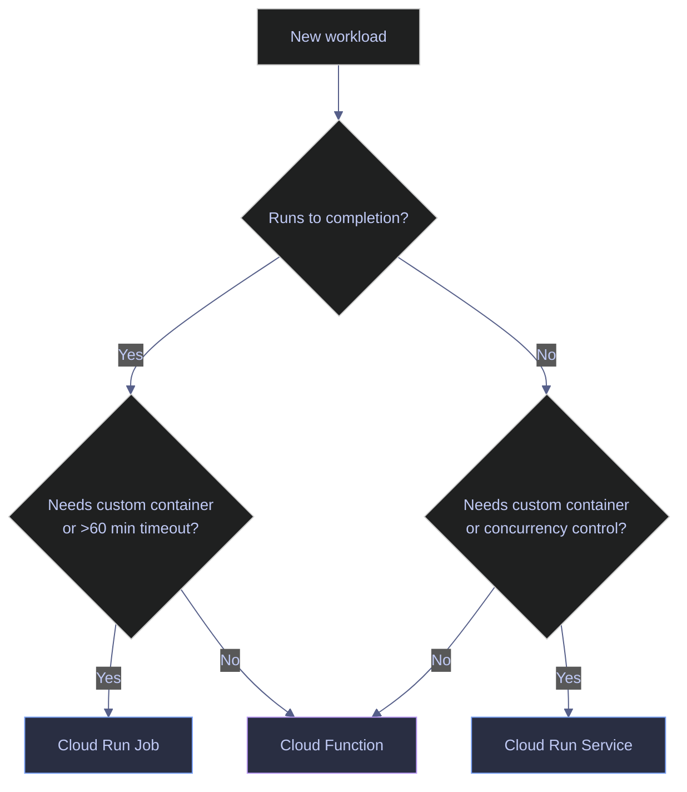
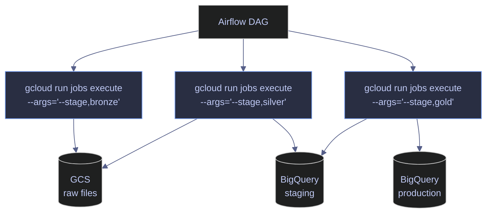

# Cloud Run Jobs vs Services

> [!quote]
> "Functions are the verbs of serverless; containers are the nouns. You need both parts of speech to write a complete sentence."
>
> — **Ben Kehoe**, iRobot cloud robotics engineer

> [!abstract]- Summary
>
> Covers how Cloud Run Jobs and Cloud Run Services differ operationally for data pipelines, including resource selection, execution and update workflows, parallel task fan-out, cold-start tradeoffs, pricing, and secure runtime configuration with environment variables and secrets.
>
> **Prerequisites**
> - Enable `run.googleapis.com`, publish a runnable container image to Artifact Registry or another accessible registry, and grant `roles/run.developer` for job definition changes plus `roles/run.invoker` for execution
> - Attach a service account with the downstream permissions the container needs for GCS, BigQuery, Secret Manager, and private networking access
>
> **Jobs vs services**
> - Use Jobs for containers that run to completion and exit, and use Services for HTTP-driven workloads that stay listening for traffic
> - Compare lifecycle, trigger model, scaling, timeout ceilings, concurrency behavior, billing shape, and cold-start mitigation across Jobs, Services, and Cloud Functions
>
> **Cloud Run Jobs**
> - List, describe, execute, monitor, update, and delete jobs with `gcloud run jobs ...`, and distinguish the persistent job definition from the per-run execution records
> - Override arguments and environment variables at execution time, and scale work horizontally with `--tasks` plus `--parallelism`
>
> **Pipeline architecture**
> - Treat each ETL stage as its own job execution so orchestrators such as Airflow can retry, replace, or reorder stages independently
> - Use the three execution models in the note: manual tool jobs, scheduled jobs, and array jobs that fan out parallel work
>
> **Cold start, pricing, and performance**
> - Expect Cloud Run Jobs to cold start every run and use image size, multi-stage builds, and lazy initialization to control startup latency
> - Use `--min-instances` and always-allocated CPU only for latency-sensitive services, and weigh those settings against their idle-cost impact
> - Distinguish service billing from job billing, and account for networking charges plus committed-use discounts where applicable
>
> **Environment variables and secrets**
> - Use `--set-env-vars` for non-sensitive configuration and `--set-secrets` for Secret Manager-backed credentials injected at runtime
> - Support multi-container sidecar patterns when one job or service revision needs logging agents, proxies, or metrics collectors next to the main container
>
> **Operations and safety**
> - Warnings: jobs always cold start, `--min-instances` and always-allocated CPU create idle cost, hardcoded secrets leak through job definitions, and a regional deployment does not span multiple regions automatically
> - Recommendations table: the Jobs-versus-Services comparison table and the cold-start guidance map workload lifecycle, timeout, concurrency, trigger style, and cost profile to the correct Cloud Run resource type

> [!note]- Glossary
>
> **Cloud Run**
> - Google Cloud's managed serverless container runtime for deploying and executing containers without managing the underlying servers directly.
> - It matters because the note frames Cloud Run as the serverless execution layer for both long-lived HTTP endpoints and run-to-completion pipeline stages.
>
> > [!info] Container runtime, not VM replacement
> >
> > Cloud Run removes server management, but it does not remove application concerns such as image size, startup time, identity, and network access design.
>
> ---
>
> **Cloud Run Service**
> - A Cloud Run resource that keeps a container revision ready to receive HTTP requests and scale based on traffic.
> - It matters because Services are the right fit for APIs, webhooks, dashboards, and push-trigger endpoints rather than batch ETL steps.
>
> > [!info] Request lifecycle defines it
> >
> > A Service exists to answer requests. If the workload's success condition is "finish once and exit," it is usually a Job instead.
>
> ---
>
> **Cloud Run Job**
> - A Cloud Run resource that launches containers to run to completion and then stop.
> - It matters because the note treats Jobs as the default serverless primitive for ETL stages, exports, scoring runs, and migrations.
>
> > [!warning] Jobs do not stay warm
> >
> > Jobs always start from a fresh execution path. There is no warm pool equivalent to `min-instances` for keeping a Job prestarted.
>
> ---
>
> **execution**
> - One concrete run of a Cloud Run Job after it has been triggered manually or by another system.
> - It matters because status, logs, duration, and failures are tracked at the execution level, not only at the job-definition level.
>
> > [!info] Definition and run differ
> >
> > Updating a Job changes future executions, not the one already running. Operational debugging usually starts from the execution record.
>
> ---
>
> **task**
> - One worker instance inside a Job execution, used when the execution fans out across multiple parallel containers.
> - It matters because tasks are how Cloud Run Jobs parallelize work without requiring multiple separate job definitions.
>
> > [!info] One execution can have many tasks
> >
> > A Job execution is the umbrella event; tasks are the parallel workers inside it. That distinction matters when reading status and scaling settings.
>
> ---
>
> **parallelism**
> - The maximum number of Job tasks allowed to run at the same time within one execution.
> - It matters because wall-clock duration and downstream load are shaped by how aggressively the Job fans work out.
>
> > [!warning] More workers can mean more pressure
> >
> > Raising parallelism reduces elapsed time only if downstream systems can absorb the load. Storage, databases, and APIs may become the real bottleneck.
>
> ---
>
> **concurrency**
> - The number of simultaneous requests a Cloud Run Service instance is allowed to process.
> - It matters because Services can multiplex traffic per instance, while Jobs effectively run one task per container instance.
>
> > [!info] Service and Job scaling differ
> >
> > Concurrency is a Service concept tied to request serving. Job scaling is described instead through tasks and parallelism.
>
> ---
>
> **cold start**
> - The startup delay that happens when Cloud Run has to pull, start, and initialize a container before it can do useful work.
> - It matters because startup latency affects every Job run and every Service scale-from-zero event.
>
> > [!warning] Small images matter
> >
> > Large images and heavy initialization directly turn into slower starts. Cold-start optimization is often more about image discipline than about the platform itself.
>
> ---
>
> **`min-instances`**
> - A Cloud Run Service setting that keeps a minimum number of container instances running even when traffic is idle.
> - It matters because it is the main platform feature for reducing cold-start latency on Services.
>
> > [!warning] Warmth costs money
> >
> > Keeping instances warm means paying for idle capacity. It is a latency tradeoff, not a free performance feature.
>
> ---
>
> **Artifact Registry**
> - Google's managed repository service for storing versioned container images and related artifacts.
> - It matters because Cloud Run needs an image source, and Artifact Registry is the standard regional image store in the note's workflows.
>
> > [!info] Region alignment helps
> >
> > Keeping the registry close to the Cloud Run region reduces unnecessary image-pull friction and keeps deployments simpler to reason about.
>
> ---
>
> **service account**
> - A non-human Google Cloud identity attached to a Job or Service so the running container can call downstream APIs.
> - It matters because Cloud Run workloads need explicit runtime identity for storage access, BigQuery work, secret retrieval, and private networking integrations.
>
> > [!warning] Runtime identity is policy boundary
> >
> > The attached service account defines what the container can do once it starts. A correct image with the wrong runtime identity still fails operationally.
>
> ---
>
> **`--set-env-vars`**
> - A Cloud Run deployment flag that stores non-sensitive environment variables on the Job or Service definition.
> - It matters because configuration such as hostnames, log levels, and stage names should be injected cleanly rather than hardcoded into the image.
>
> > [!warning] Plain text stays visible
> >
> > Environment variables set this way are convenient, but they are not secret storage. Operators can see them in CLI output, console views, and infrastructure state.
>
> ---
>
> **`--set-secrets`**
> - A Cloud Run deployment flag that injects Secret Manager values into the container environment at runtime.
> - It matters because it is the safe path for passwords, keys, and tokens that should not appear in plain-text job configuration.
>
> > [!info] Secret value, not secret metadata
> >
> > The container receives the resolved secret value through the environment variable. The secret reference remains in configuration, but the raw secret text does not.
>
> ---
>
> **VPC connector**
> - A networking component that gives serverless workloads controlled access to private VPC resources.
> - It matters because Jobs and Services often need to reach databases or private services that are not exposed over the public internet.
>
> > [!warning] Private access is explicit
> >
> > Serverless workloads do not automatically inherit private-network reachability. Private access must be designed with the correct connector or network settings.
>
> ---
>
> **sidecar**
> - An additional container deployed alongside the main container in the same Job or Service revision.
> - It matters because sidecars provide patterns for proxies, metrics agents, or logging helpers without baking every concern into the primary image.
>
> > [!info] Shared resources still apply
> >
> > Sidecars share the Job or Service revision's CPU and memory envelope. Adding one changes runtime resource pressure even if the main container is unchanged.
>
> ---
>
> **Cloud Functions (2nd gen)**
> - Google's higher-level event-function product that runs on top of Cloud Run infrastructure.
> - It matters because the note uses Cloud Functions as the lighter-weight comparison point when the workload does not need a fully custom container.
>
> > [!info] Simpler can be enough
> >
> > If the workload is small and event-driven, Cloud Functions may remove container-management overhead entirely. Cloud Run is strongest when runtime control is the priority.


## Jobs vs Services Overview

Cloud Run offers two resource types: **Jobs** for batch workloads that run to completion, and **Services** for HTTP-driven workloads that stay listening. The choice determines the lifecycle, billing model, scaling behavior, and trigger mechanism.

| Feature | Cloud Run Service | Cloud Run Job |
|---|---|---|
| Lifecycle | Runs continuously, listens for HTTP | Runs to completion, then exits |
| Trigger | HTTP request, Pub/Sub push, Eventarc | Manual, Cloud Scheduler, Airflow, Workflows |
| Scaling | 0 to 1,000 instances based on traffic | Fixed task count with configurable parallelism |
| Timeout | 60 minutes max (per request) | 168 hours / 7 days max (per task) |
| Concurrency | Up to 1,000 concurrent requests per instance | One task per container instance |
| Billing | Per-request + vCPU-seconds + memory while serving | vCPU-seconds + memory for the full execution duration |
| Cold start | Mitigated with min-instances | Always cold starts (no warm pool) |
| Use case | APIs, webhooks, dashboards, event receivers | ETL stages, data processing, batch scoring, migrations |

> [!question] When to use Jobs vs Services vs Cloud Functions
>
> - **Cloud Run Jobs** — batch workloads that run to completion: ETL stages, data exports, model scoring, database migrations. Best when you need custom containers, long timeouts (up to 7 days), or parallel task fan-out.
> - **Cloud Run Services** — request-driven workloads: REST APIs, webhook receivers, Pub/Sub push endpoints, dashboards. Best when you need auto-scaling to zero, HTTP routing, or traffic splitting.
> - **Cloud Functions** — lightweight event-driven glue: file upload triggers, Pub/Sub message handlers, simple transformations under 60 minutes. Best when you want zero infrastructure management and the function fits a single file. Cloud Functions (2nd gen) runs on Cloud Run under the hood.



## Cloud Run Jobs

Cloud Run Jobs execute a container image to completion and then exit. A job definition specifies the container image, resource limits, environment variables, and retry policy. Each time a job is triggered, Cloud Run creates an **execution** — a single run of the job that can contain one or more parallel **tasks**. For infrastructure-as-code deployment, [cloud-run](https://alp78.github.io/elysium/07-Terraform/GCP-Resources/cloud-run) provides the Terraform resource definitions.

> [!info] Parallel task execution
>
> A single job execution can run multiple identical tasks in parallel using the `--tasks` and `--parallelism` flags. Each task gets an index via the `CLOUD_RUN_TASK_INDEX` environment variable (0-based) and the total count via `CLOUD_RUN_TASK_COUNT`. Wall time scales inversely with worker count: `wall_time ≈ total_cpu_seconds / parallelism`. Maximum: 10,000 tasks per execution.

### gcloud | List and describe jobs

These commands show all jobs in a region and retrieve the full configuration of a specific job.

#### List all jobs in a region

Lists all Cloud Run Jobs in the specified region, showing the job name, region, and last execution status.

```bash
gcloud run jobs list --region=europe-west1
```

```text
   JOB                        REGION        LAST RUN STATUS  EXECUTED AT
✔  data-pipeline-pipeline     europe-west1  Succeeded        2026-04-04T08:15:00Z
✔  data-export-daily          europe-west1  Succeeded        2026-04-04T06:00:00Z
✗  data-pipeline-backfill     europe-west1  Failed           2026-04-03T22:30:00Z
```

#### Describe a job's configuration

Returns the full configuration of a job including image, resource limits, environment variables, service account, and retry policy.

```bash
gcloud run jobs describe data-pipeline-pipeline --region=europe-west1
```

### gcloud | Execute a job

Triggering a job creates a new execution. The container starts, runs, and exits. The execution inherits the job's configuration unless overridden at execution time.

#### Execute with default configuration

```bash
gcloud run jobs execute data-pipeline-pipeline --region=europe-west1
```

#### Execute with argument overrides

Pass comma-separated arguments to the container's `ENTRYPOINT`. This enables running a specific pipeline stage or index without creating a separate job definition for each variant.

```bash
gcloud run jobs execute data-pipeline-pipeline --region=europe-west1 \
  --args="--stage,gold,--index,market_index"
```

#### Execute with environment variable overrides

Override environment variables at execution time without modifying the job definition. Useful for ad-hoc runs with different parameters.

```bash
gcloud run jobs execute data-pipeline-pipeline --region=europe-west1 \
  --update-env-vars="LOG_LEVEL=DEBUG,DRY_RUN=true"
```

### gcloud | Monitor job executions

After triggering a job, monitor its progress through execution listings and logs. Job logs are written to Cloud Logging with the resource type `cloud_run_job` and can be queried from the [Cloud Logging console](https://alp78.github.io/elysium/06-GCP/Logging/cloud-logging).

#### List recent executions

Shows the execution name, status (Succeeded/Failed/Running), start time, and duration for a given job.

```bash
gcloud run jobs executions list --job=data-pipeline-pipeline \
  --region=europe-west1 --limit=5
```

```text
   EXECUTION                                  STATUS     START TIME                DURATION
✔  data-pipeline-pipeline-x4k2m              Succeeded  2026-04-04T08:15:00Z      4m12s
✔  data-pipeline-pipeline-r9j1n              Succeeded  2026-04-04T04:15:00Z      3m58s
✗  data-pipeline-pipeline-w7p3q              Failed     2026-04-03T22:30:00Z      1m03s
✔  data-pipeline-pipeline-t2m8v              Succeeded  2026-04-03T16:15:00Z      4m05s
✔  data-pipeline-pipeline-k5n6r              Succeeded  2026-04-03T08:15:00Z      3m47s
```

#### View execution logs

Streams the logs for a specific execution. Replace the execution name with the value from the execution list.

```bash
gcloud run jobs executions logs data-pipeline-pipeline-x4k2m \
  --region=europe-west1
```

### gcloud | Update job configuration

Updates the job definition for future executions. Changes take effect on the next execution — running executions are not affected. The `--memory` flag sets the RAM limit (128Mi to 32Gi), `--cpu` sets CPU allocation (1, 2, 4, 6, or 8 vCPUs for jobs), `--task-timeout` is the maximum execution time before a forced kill, and `--max-retries` controls automatic retry on failure (0 = no retry).

```bash
gcloud run jobs update data-pipeline-pipeline --region=europe-west1 \
  --image=europe-west1-docker.pkg.dev/data-platform-prod/data-pipeline/data-pipeline:latest \
  --memory=2Gi \
  --cpu=1 \
  --task-timeout=30m \
  --set-env-vars="DB_HOST=10.132.0.2,DB_NAME=data-pipeline,LOG_LEVEL=INFO" \
  --max-retries=1
```

### gcloud | Delete a job

Permanently removes a job definition and all its execution history. This cannot be undone — the execution logs remain in Cloud Logging but the job resource is deleted.

```bash
gcloud run jobs delete data-pipeline-pipeline --region=europe-west1
```

### Cloud Run Jobs flag reference

| Flag | Applies to | Syntax | Description |
|---|---|---|---|
| `--region` | All commands | `--region=europe-west1` | GCP region for the job (required) |
| `--image` | `create`, `update` | `--image=REGISTRY/IMAGE:TAG` | Container image to run |
| `--memory` | `create`, `update` | `--memory=2Gi` | Memory limit per task (128Mi to 32Gi) |
| `--cpu` | `create`, `update` | `--cpu=1` | vCPU allocation per task (1, 2, 4, 6, or 8 for jobs) |
| `--task-timeout` | `create`, `update` | `--task-timeout=30m` | Max duration per task before forced kill (up to 168h) |
| `--max-retries` | `create`, `update` | `--max-retries=1` | Retry count on task failure (0 = no retry, max 10) |
| `--tasks` | `create`, `update` | `--tasks=10` | Number of parallel tasks per execution (max 10,000) |
| `--parallelism` | `create`, `update` | `--parallelism=5` | Max tasks running concurrently (0 = all at once) |
| `--args` | `execute` | `--args="--stage,gold"` | Comma-separated args passed to ENTRYPOINT |
| `--update-env-vars` | `execute` | `--update-env-vars="K=V"` | Override env vars for this execution only |
| `--set-env-vars` | `create`, `update` | `--set-env-vars="K=V,K2=V2"` | Set environment variables on the job definition |
| `--set-secrets` | `create`, `update` | `--set-secrets="ENV=SECRET:VERSION"` | Mount Secret Manager secrets as env vars |
| `--service-account` | `create`, `update` | `--service-account=SA@PROJECT.iam` | Service account the job runs as |
| `--vpc-connector` | `create`, `update` | `--vpc-connector=CONNECTOR` | Serverless VPC Access connector for private networking |
| `--limit` | `list`, `executions list` | `--limit=5` | Maximum number of results to return |
| `--format` | All commands | `--format=json` | Output format: `json`, `yaml`, `table`, `value` |

## Pipeline Architecture

Each pipeline stage runs as an independent Cloud Run Job execution. [Airflow](https://alp78.github.io/elysium/12-Orchestration/Scheduling/gcp-scheduling) orchestrates the sequence using task dependencies. This architecture allows individual stages to be retried, redeployed, or replaced without affecting the others. For CI/CD automation that builds and deploys these containers via Workload Identity, see [github-actions-ci-cd](https://alp78.github.io/elysium/10-GitHub-Actions/github-actions-ci-cd).



> [!tip] Three execution models for Cloud Run Jobs
>
> - **Tool/script jobs** — on-demand, triggered manually for ad-hoc tasks (archive logs, export a table to CSV). Output artifacts go to GCS.
> - **Scheduled jobs** — clock-driven via Cloud Scheduler with configurable retry policy and max execution window. If the window is exceeded, the job is terminated and restarted.
> - **Array jobs** — fan-out parallelism using `--tasks` and `--parallelism`. Wall time scales inversely with worker count: `wall_time ≈ total_cpu_seconds / number_of_workers`.

## Cold Start and Performance

The first execution after a period of inactivity takes longer because Cloud Run needs to pull and start the container image. For data pipelines triggered 3x/day, cold starts are a minor annoyance (seconds, not minutes) — but for latency-sensitive services, they can be a problem.

> [!tip] Reducing Cold Start Latency
>
> - **Keep images small.** A 2 GB image with unnecessary dependencies takes 30–60 seconds to pull. A 200 MB slim image starts in 5–10 seconds. Use [docker-compose](https://alp78.github.io/elysium/09-Docker/docker-compose) locally to mirror the production container environment during development.
> - **Multi-stage Docker builds.** Build dependencies in stage 1, copy only the runtime into the final image.
> - **Lazy initialization.** Defer heavy imports and connection setup until the first request or task starts, not at module load time.
> - **Min instances = 1** (services only): keeps one instance warm. Not applicable to Jobs — they always cold start.
> - **CPU allocation = always** (services only): keeps CPU allocated even between requests, reducing startup latency.

> [!warning] Cost impact of always-on settings
>
> Setting `--min-instances=1` and `--cpu-throttling=false` (CPU always allocated) on a Cloud Run Service means you pay for idle vCPU-seconds and memory even when no requests are being served. For a service with 1 vCPU and 512 MiB running 24/7 idle, this costs approximately \$50–70/month — comparable to a small GCE VM.

> [!success] Right-size always-on settings
>
> Use `--min-instances=1` only on services with strict latency requirements (p99 < 500 ms). For internal batch-trigger endpoints or low-traffic webhooks, let instances scale to zero and accept the cold start. Monitor per-service billing in the Cloud Run section of the [billing dashboard](https://alp78.github.io/elysium/06-GCP/Cost-Management) to catch idle cost drift.

> [!info] Cloud Run pricing model
>
> - **Services:** Billed per-request ($0.40/million) + vCPU-seconds ($0.00002400) + memory GiB-seconds ($0.00000250). Free tier: 2 million requests, 180,000 vCPU-seconds, 360,000 GiB-seconds per month.
> - **Jobs:** Billed for vCPU-seconds + memory GiB-seconds for the full task execution duration. No per-request charge. Same rates as services.
> - **Networking:** Egress to the internet is charged at standard GCP rates. Egress to other GCP services in the same region is free.
> - **Committed Use Discounts:** Jobs and instance-based services qualify for 1-year (28%) and 3-year (46%) discounts. Billing granularity is 100 ms.

## Environment Variables and Secrets

Pass configuration to Cloud Run Jobs and Services via environment variables. Use `--set-env-vars` for non-sensitive values and `--set-secrets` for credentials managed in Secret Manager.

> [!danger] Hardcoded secrets in environment variables
>
> Never put sensitive values (database passwords, API keys, service account keys) directly in `--set-env-vars`. Environment variables are visible in plain text in the Cloud Console, `gcloud run jobs describe` output, Terraform state files, and CI/CD logs. A single leaked export can compromise production databases.

> [!success] Use Secret Manager references
>
> Reference secrets from Secret Manager using `--set-secrets`. The secret value is injected at runtime and never stored in the job definition. The job's service account needs `roles/secretmanager.secretAccessor` on the referenced secret.

```bash
gcloud run jobs update data-pipeline-pipeline --region=europe-west1 \
  --set-secrets="DB_PASSWORD=data-pipeline-db-password:latest"
```

The secret value is injected as an environment variable at runtime. The container reads `DB_PASSWORD` like any other env var — it never sees the secret name or version, only the resolved value. For managing secrets in Secret Manager, see [secrets-management](https://alp78.github.io/elysium/06-GCP/Security/secrets-management).

> [!info] Multi-container sidecar support
>
> Cloud Run supports deploying multiple containers in a single service or job revision (sidecar pattern). A sidecar container runs alongside the main container and shares the same network namespace. Common uses: logging agents, auth proxies, metrics collectors. Configure via `gcloud run services update --add-containers` or in the YAML service spec. Sidecar containers share the job's CPU and memory allocation.

## Related

- [pubsub-topics-and-subscriptions](https://alp78.github.io/elysium/06-GCP/Serverless/pubsub-topics-and-subscriptions) — Push subscriptions can trigger Cloud Run Services
- [pubsub-messaging](https://alp78.github.io/elysium/06-GCP/Serverless/pubsub-messaging) — Cloud Run Services as push subscription endpoints
- [gcs-object-operations](https://alp78.github.io/elysium/06-GCP/Storage/gcs-object-operations) — Jobs typically read input from and write output to GCS
- [service-accounts-and-iam](https://alp78.github.io/elysium/06-GCP/Security/service-accounts-and-iam) — `roles/run.invoker` to trigger jobs; SA attached to the job for GCS/BQ access
- [gcp-apis-and-services](https://alp78.github.io/elysium/06-GCP/01-Core/02-gcp-apis-and-services) — `run.googleapis.com` must be enabled
- [cloud-logging](https://alp78.github.io/elysium/06-GCP/Logging/cloud-logging) — Job logs are available in Cloud Logging by resource type `cloud_run_job`
- [gcp-scheduling](https://alp78.github.io/elysium/12-Orchestration/Scheduling/gcp-scheduling) — Cloud Scheduler triggers for scheduled job executions
- [bq-fundamentals](https://alp78.github.io/elysium/05-DB-Queries/BigQuery/bq-fundamentals) — BigQuery query patterns for downstream tables written by Cloud Run Jobs
- [cloud-run](https://alp78.github.io/elysium/07-Terraform/GCP-Resources/cloud-run) — Terraform resource definitions for Cloud Run Jobs and Services

## References

- [Cloud Run Jobs overview](https://cloud.google.com/run/docs/create-jobs)
- [Executing jobs](https://cloud.google.com/run/docs/execute/jobs)
- [Container image best practices](https://cloud.google.com/run/docs/tips/general)
- [Cloud Run pricing](https://cloud.google.com/run/pricing)
- [Cloud Run quotas and limits](https://cloud.google.com/run/quotas)
