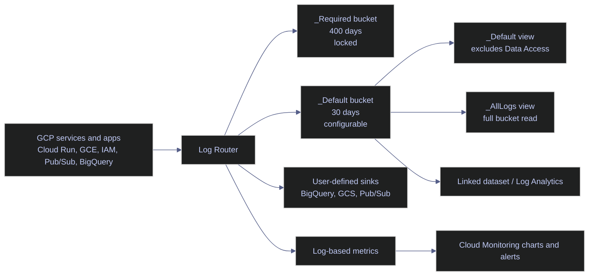

# Cloud Logging

> [!abstract]- Summary
>
> Covers Cloud Logging as the live-verified event system for project `bq-wh-nb`, including `LogEntry` structure, router-driven storage, buckets, views, sinks, scopes, audit-log payloads, `gcloud logging` read and write workflows, and the bridge into Monitoring so you can investigate incidents, design retention intentionally, and control access or exports without guessing where an event went.
>
> **Storage, routing, and access**
> - Core model: `LogEntry` payload shapes (`textPayload`, `jsonPayload`, `protoPayload`), `severity`, `logName`, and `resource.type` determine how entries are filtered, interpreted, and routed
> - Router-owned storage objects: `_Default` bucket (`global`, 30-day retention), `_Required` bucket (`global`, 400-day retention, locked), `_Default` and `_Required` system sinks, `_Default` and `_AllLogs` views, and the automatically created `_Default` log scope
> - Analytics bridge state: `gcloud logging links list` returned `[]` for `_Default`, so Log Analytics linked datasets are not yet configured in the active project
>
> **Read and write workflows**
> - Inspection commands cover buckets, sinks, views, scopes, and links with `gcloud logging buckets|sinks|views|scopes|links ... --format=json|table(...)`
> - `gcloud logging read` examples cover audit timelines, full `protoPayload` inspection, custom `textPayload` events, and structured `jsonPayload` events with explicit field selection
> - `gcloud logging write` examples show direct CLI emission of text and JSON verification entries into custom logs
> - Stable `gcloud logging tail` is not available in this SDK; only `gcloud alpha logging tail` starts a live session, and it remains automation-sensitive here
>
> **Derived signals and operational design**
> - The project currently has no user-defined log-based metrics, so Logging-to-Monitoring promotion is still only a design path rather than an active inventory object
> - Production guidance distinguishes when to keep data in `_Default`, when to route to custom buckets or sinks, and when to prefer BigQuery, GCS, or Pub/Sub as downstream destinations
> - Data-engineering scenarios cover root-cause pipeline investigation, long-horizon SQL analysis, and audit-evidence collection
>
> **Operations and safety**
> - When to use: incident triage, audit review, routing validation, retention planning, export design, and log-to-metric bridge design
> - Warnings: `_Default` is not an audit archive, `roles/logging.viewer` does not guarantee Data Access visibility, high-cardinality metric labels create cost and noise, and stable `tail` examples from older docs do not match this SDK
> - Recommendations: prefer structured `jsonPayload`, separate retention from export decisions, create log-based metrics only for recurrent event families, and validate bucket, view, IAM, and sink permissions before declaring logs missing
> - Troubleshooting: 4 failure modes covering missing logs, empty sink destinations, noisy logs, and inaccessible audit logs
>
> [!note]- Glossary
>
> **Cloud Logging**
> - Google Cloud's managed event store for operational, security, and application logs across services and custom producers.
> - This note treats Cloud Logging as the primary evidence layer for understanding what happened, who triggered it, and where the event should be stored or exported.
>
> > [!info] Event system, not metric store
> >
> > Cloud Logging preserves discrete records and payloads. It is strongest at investigation, audit, and routing, not at threshold-driven trend analysis.
>
> ---
>
> **Log entry / `LogEntry`**
> - The canonical Cloud Logging record object that holds timestamp, severity, log name, resource identity, labels, and exactly one payload shape.
> - Every filter, sink, view, and metric in this note ultimately operates on `LogEntry` fields rather than on opaque message blobs.
>
> > [!warning] One payload shape only
> >
> > A single entry cannot simultaneously use `textPayload`, `jsonPayload`, and `protoPayload`. Understanding which payload type you are looking at is the first step in reading it correctly.
>
> ---
>
> **`textPayload`**
> - An unstructured UTF-8 message body stored directly in the log entry.
> - The note uses it for human-readable verification writes and for showing the simplest possible custom logging pattern.
>
> > [!warning] Easy to write, harder to analyze
> >
> > Free-text logs are searchable, but they are a weak base for precise filters, extracted labels, or durable downstream analytics compared with structured payloads.
>
> ---
>
> **`jsonPayload`**
> - A structured JSON object stored inside the log entry with field-level queryability.
> - The note recommends `jsonPayload` for pipelines and services because it supports stable filtering, routing, and later metric extraction without fragile text parsing.
>
> > [!warning] Structure can still go wrong
> >
> > JSON payloads are only operationally useful when the keys stay bounded and predictable. High-cardinality fields create noise and downstream cost problems even in a structured payload.
>
> ---
>
> **`protoPayload`**
> - A structured payload backed by a protobuf schema, commonly used by Google-managed audit events.
> - The note uses `protoPayload` to explain why audit logs expose rich fields such as service, method, principal, request, and response without manual parsing.
>
> > [!info] Google-managed schema
> >
> > Audit logs typically store `google.cloud.audit.AuditLog` in `protoPayload`. That is why audit entries feel more like typed records than like generic application logs.
>
> ---
>
> **Cloud Audit Logs**
> - Google-managed logs that record control-plane and, where enabled, data-plane access to Google Cloud resources and APIs.
> - The note treats audit logs as the security and compliance evidence layer for access, impersonation, and administrative actions.
>
> > [!warning] Not all audit classes behave the same
> >
> > Admin Activity, System Event, Access Transparency, and Data Access logs differ in default availability, visibility, and storage path. Do not assume one audit stream implies access to all of them.
>
> ---
>
> **Data Access audit log**
> - The Cloud Audit Logs class that records access to data-plane operations rather than only administrative control-plane changes.
> - The note highlights it because the `_Default` view excludes these entries, making them one of the most common sources of "missing log" confusion.
>
> > [!warning] Hidden by the default view
> >
> > A project can be storing Data Access logs while a reader still cannot see them through the default view or with an insufficient IAM role. Visibility and storage are separate questions.
>
> ---
>
> **`severity`**
> - The importance field attached to a log entry, such as `INFO`, `NOTICE`, `WARNING`, or `ERROR`.
> - The note uses severity for triage, custom writes, filtering, and alert-oriented log design.
>
> > [!info] Severity is descriptive, not authoritative
> >
> > For custom application logs, the producer chooses the severity. A `WARNING` entry does not automatically imply business impact unless the emitting service uses the field consistently.
>
> ---
>
> **`logName`**
> - The fully qualified log stream identifier, such as `projects/bq-wh-nb/logs/cloudaudit.googleapis.com%2Factivity`.
> - The note relies on `logName` because it is often the fastest stable discriminator when narrowing an investigation to one log family.
>
> > [!warning] Log IDs are URL-encoded
> >
> > The log portion of `logName` is percent-encoded. When copying identifiers into filters, keep the encoded form exactly as Logging stores it.
>
> ---
>
> **Monitored resource / `resource.type`**
> - The resource model attached to a log entry that identifies what emitted or owns the event, such as `global`, `gce_instance`, or `audited_resource`.
> - The note uses resource typing to narrow investigations and to explain why the same project can contain many unrelated event families in one bucket.
>
> > [!warning] Resource type can be broad
> >
> > `audited_resource` is useful, but often less specific than `protoPayload.serviceName` or `methodName`. Use the whole entry context instead of over-trusting one field.
>
> ---
>
> **Log Router**
> - The Cloud Logging routing layer that evaluates incoming entries and forwards them to buckets, sinks, exclusions, and derived paths.
> - The note treats the router as the reason storage, read access, and export configuration remain separate operational concerns.
>
> > [!info] Routing happens before reading
> >
> > If an event never reached the expected bucket or sink, no amount of later querying fixes it. Router policy determines the event's storage path before readers ever search for it.
>
> ---
>
> **Log bucket**
> - A Cloud Logging storage container that holds entries and defines retention, location, and access boundaries.
> - The note uses buckets to explain why `_Default` and `_Required` behave differently for retention and compliance.
>
> > [!warning] Buckets are not interchangeable
> >
> > `_Required` is Google-managed and locked, while `_Default` is configurable. Treating them as generic containers leads to bad retention and evidence assumptions.
>
> ---
>
> **Log view**
> - A filtered read lens over a log bucket that restricts what entries a reader can see without duplicating storage.
> - The note uses views to explain why storage can be correct while the visible result set is still intentionally incomplete.
>
> > [!warning] Read boundary, not storage boundary
> >
> > A view filter changes what a reader sees, not what the bucket stores. Confusing those two layers is one of the most common logging troubleshooting mistakes.
>
> ---
>
> **Log sink**
> - A routing rule that exports matching log entries to another destination such as BigQuery, Cloud Storage, or Pub/Sub.
> - The note uses sinks when discussing archival, streaming, and analytics architectures beyond the default buckets.
>
> > [!warning] Definition alone is insufficient
> >
> > A sink can exist and still deliver nothing if its destination permissions are wrong or if the filter matches nothing. Always verify filter logic and destination IAM together.
>
> ---
>
> **Log scope**
> - A read-time aggregation object that lets one query span multiple projects, buckets, or views.
> - The note includes scopes to distinguish storage layout from investigation layout across organizational boundaries.
>
> > [!info] Scope is an access composition tool
> >
> > Log scopes do not move data. They change what can be searched together, which matters when investigations cross project or bucket lines.
>
> ---
>
> **Log-based metric**
> - A Cloud Monitoring metric derived from log entries that match a filter and optionally extract bounded labels.
> - The note uses log-based metrics as the bridge from raw events into charts and alerts.
>
> > [!warning] No historical backfill
> >
> > A new log-based metric starts counting from creation time forward. It does not retroactively convert old logs into historical metric points.
>
> ---
>
> **Log Analytics / linked dataset**
> - The SQL-analysis path where a log bucket is linked into a BigQuery dataset for longer-horizon or set-based analysis.
> - The note references linked datasets because the active project currently has none, which sets the boundary of what can be queried analytically today.
>
> > [!info] Investigation mode changes
> >
> > Raw log search is best for incidents; linked analytics becomes more useful when the question spans large windows, many services, or set-based correlation logic.
>
> ---
>
> **`gcloud logging read`**
> - The Cloud SDK command for querying log entries with Logging filters and rendering selected fields in table or JSON form.
> - The note uses it as the main reproducible incident-triage surface for audit logs, application logs, and payload inspection.
>
> > [!warning] Filters determine usefulness
> >
> > `gcloud logging read` is only as good as its filter. Starting with too broad a query wastes time; starting with the wrong view or permissions can look like a data-loss problem.
>
> ---
>
> **`gcloud logging write`**
> - The Cloud SDK command for emitting one custom log entry directly from a shell into Cloud Logging.
> - The note uses it to verify write acceptance and to demonstrate the difference between text and structured payloads.
>
> > [!warning] Acceptance is not end-to-end proof
> >
> > "Created log entry." means the Logging API accepted the write. It does not prove that a downstream sink, alert, or analytics path has already processed the event.
>
> ---
>
> **`gcloud alpha logging tail`**
> - The alpha-track Cloud SDK command for streaming matching log entries live as they arrive.
> - The note includes it because older docs imply stable `tail` support, but this SDK only exposes the feature on the alpha surface.
>
> > [!warning] Present but automation-sensitive
> >
> > The alpha command can start a live session, but non-interactive capture is fragile in this environment. Use `read` as the canonical reproducible workflow unless you truly need streaming.
>
> ---
>
> **`roles/logging.privateLogViewer`**
> - The IAM role that grants visibility into private log classes such as Data Access audit logs that ordinary log viewers often cannot read.
> - The note highlights this role because missing private-log access is one of the main reasons operators think audit evidence is absent.
>
> > [!warning] Viewer is not always enough
> >
> > `roles/logging.viewer` may let you read many logs while still hiding the most security-sensitive ones. Validate the exact role boundary before concluding that the service never logged the event.
>
> ---
>
> **Retention policy**
> - The configured number of days a log bucket stores entries before they age out.
> - The note uses retention to distinguish short-horizon operational troubleshooting from long-horizon compliance and forensic needs.
>
> > [!warning] Defaults may be too short
> >
> > Thirty days is enough for recent incident response but often too short for audits, seasonal analysis, or investigations that start late. Retention should reflect the question horizon, not just the default.

## Why This Topic Matters

Data engineering incidents usually begin as events, not as averages. A Cloud Run task exits with code `1`, a scheduler trigger never reaches the worker, a Pub/Sub consumer starts retrying, or a VM login policy fails. Metrics tell you that a system moved out of range. Logs tell you which actor, method, resource, and payload caused the movement. In Google Cloud, Cloud Logging is also the security evidence layer because Cloud Audit Logs capture control-plane and, when enabled, data-plane access.

The live project state already shows why this matters. The project has system buckets, system sinks, system views, a default log scope, active audit logs, and no user-defined log-based metrics or analytics links. That is a realistic production baseline: enough telemetry to investigate platform events, but not yet enough derived metrics or retention architecture to support long-horizon analytics on its own.

## Conceptual Model

Cloud Logging separates ingest, storage, access, and export. That separation is the reason you can keep the same incoming log flow while changing retention, access boundaries, or downstream destinations.



### Cloud Logging | live project summary

The active project uses only the default storage and routing objects. There are no user-created sinks, no linked datasets, and no user-defined log-based metrics.

| Object | Live state in `bq-wh-nb` | Operational meaning |
|---|---|---|
| `_Default` bucket | `global`, `retentionDays: 30`, `ACTIVE` | Main non-required storage bucket |
| `_Required` bucket | `global`, `retentionDays: 400`, `locked: true`, `ACTIVE` | Audit and required system logging bucket |
| `_Default` sink | Routes non-required logs to `_Default` | Baseline project routing |
| `_Required` sink | Routes required audit/system logs to `_Required` | Baseline compliance/security routing |
| `_Default` view | Excludes `cloudaudit.googleapis.com/data_access` | Reader-friendly default view, not full bucket access |
| `_AllLogs` view | No filter | Full bucket read lens |
| `_Default` log scope | `projects/bq-wh-nb` only | No cross-project aggregation yet |
| Linked datasets on `_Default` | `[]` | Log Analytics not configured on this bucket |
| User-defined log-based metrics | `[]` | No log-to-metric bridge objects yet |

> [!info] Important conceptual note not safely executed here
>
> The active project does not contain user-defined buckets, exclusions, sinks, log-based metrics, analytics links, or custom views. Creating them would mutate a live production-style project and can affect retention, cost, access, or downstream delivery. This note therefore distinguishes between:
>
> - live-verified inspection workflows for the objects that already exist
> - production guidance for objects that were important to explain but not safe to create here

## PowerShell / Linux

This section uses `gcloud` because the command syntax is the same on Windows PowerShell and Linux shells for the workflows shown here.

### PowerShell / Linux | gcloud logging | inspect buckets, views, sinks, and scopes

Use these commands before you change retention, IAM, routing, or analytics posture. They show the storage objects that already exist, the filters that govern default read access, and whether the project has any extra routing or analytics surface beyond the Google-managed defaults.

#### Inspect the `_Default` bucket

**When to run:** Before changing retention or explaining why logs disappear after a fixed number of days.
**Trigger:** The reader needs to know where ordinary application and platform logs are stored.
**Context:** Run in a shell with project-level Logging read access. Read-only.
**Purpose:** Confirm the bucket name, location, lifecycle state, and retention policy for the main project bucket.

| Field | Type | Meaning |
|---|---|---|
| `name` | string | Fully qualified bucket resource name |
| `description` | string | Human-friendly purpose of the bucket |
| `lifecycleState` | enum | Current bucket state such as `ACTIVE` |
| `retentionDays` | integer | Number of days Cloud Logging retains entries in the bucket |

*Describe the project's default log bucket and its retention policy.*

```powershell
gcloud logging buckets describe _Default --location=global --format=json
```

```text
{
  "description": "Default bucket",
  "lifecycleState": "ACTIVE",
  "name": "projects/bq-wh-nb/locations/global/buckets/_Default",
  "retentionDays": 30
}
```

This confirms the expected default retention posture: ordinary logs stay in `_Default` for 30 days unless you change the bucket retention or route matching logs elsewhere. The bucket lives in the `global` location, which matters for data residency and for any future linked dataset or cross-region query design.

#### Inspect the `_Required` bucket

**When to run:** Before discussing audit retention, security evidence, or immutable default routing.
**Trigger:** The reader needs to know where Google-required logs are stored and why that bucket behaves differently.
**Context:** Run in a shell with project-level Logging read access. Read-only.
**Purpose:** Verify the fixed audit bucket attributes that are not controlled like `_Default`.

| Field | Type | Meaning |
|---|---|---|
| `name` | string | Fully qualified bucket resource name |
| `description` | string | Bucket role in the project |
| `lifecycleState` | enum | Current bucket state |
| `locked` | boolean | Whether retention configuration is locked against updates |
| `retentionDays` | integer | Required retention period for stored entries |

*Describe the Google-managed required bucket that stores audit and other mandatory logs.*

```powershell
gcloud logging buckets describe _Required --location=global --format=json
```

```text
{
  "description": "Audit bucket",
  "lifecycleState": "ACTIVE",
  "locked": true,
  "name": "projects/bq-wh-nb/locations/global/buckets/_Required",
  "retentionDays": 400
}
```

The `locked: true` field is the operational difference that matters most. `_Required` is not a general-purpose archive bucket. It is a Google-managed bucket for required audit/system logs, and the 400-day retention is fixed.

#### Inspect default routing

**When to run:** Before diagnosing missing logs, planning export paths, or teaching the difference between buckets and sinks.
**Trigger:** A reader sees logs in buckets and assumes that storage and routing are the same thing.
**Context:** Run in a shell with project-level Logging read access. Read-only.
**Purpose:** Show the actual router filters that split required versus non-required log traffic.

| Field | Type | Meaning |
|---|---|---|
| `name` | string | Sink identifier |
| `destination` | string | Bucket or external target receiving matching entries |
| `filter` | string | Logging query filter used by the sink |
| `resourceName` | string | Full sink resource path |

*Describe the system sink that routes non-required traffic to `_Default`.*

```powershell
gcloud logging sinks describe _Default --format=json
```

```text
{
  "destination": "logging.googleapis.com/projects/bq-wh-nb/locations/global/buckets/_Default",
  "filter": "NOT LOG_ID(\"cloudaudit.googleapis.com/activity\") AND NOT LOG_ID(\"externalaudit.googleapis.com/activity\") AND NOT LOG_ID(\"cloudaudit.googleapis.com/system_event\") AND NOT LOG_ID(\"externalaudit.googleapis.com/system_event\") AND NOT LOG_ID(\"cloudaudit.googleapis.com/access_transparency\") AND NOT LOG_ID(\"externalaudit.googleapis.com/access_transparency\")",
  "name": "_Default",
  "resourceName": "projects/bq-wh-nb/sinks/_Default"
}
```

*Describe the system sink that routes required traffic to `_Required`.*

```powershell
gcloud logging sinks describe _Required --format=json
```

```text
{
  "destination": "logging.googleapis.com/projects/bq-wh-nb/locations/global/buckets/_Required",
  "filter": "LOG_ID(\"cloudaudit.googleapis.com/activity\") OR LOG_ID(\"externalaudit.googleapis.com/activity\") OR LOG_ID(\"cloudaudit.googleapis.com/system_event\") OR LOG_ID(\"externalaudit.googleapis.com/system_event\") OR LOG_ID(\"cloudaudit.googleapis.com/access_transparency\") OR LOG_ID(\"externalaudit.googleapis.com/access_transparency\")",
  "name": "_Required",
  "resourceName": "projects/bq-wh-nb/sinks/_Required"
}
```

These two sink definitions are the cleanest live proof that the Log Router is policy-driven. They also explain why not every audit log appears in `_Default`. Routing happens before you query.

#### Inspect views, scopes, and analytics links

**When to run:** Before troubleshooting access gaps, explaining why one reader sees fewer logs than another, or evaluating whether Log Analytics is already enabled.
**Trigger:** A query result seems incomplete even though the bucket clearly stores the data.
**Context:** Run in a shell with project-level Logging read access. Read-only.
**Purpose:** Distinguish bucket contents from view filters, log scopes, and linked datasets.

| Field | Type | Meaning |
|---|---|---|
| `VIEW_ID` | string | View name inside the bucket |
| `DESCRIPTION` | string | Purpose of the view |
| `FILTER` | string | Logging query that restricts visibility in the view |
| `resourceNames` | array | Resources aggregated by the log scope |

*List the default views on the `_Default` bucket.*

```powershell
gcloud logging views list --bucket=_Default --location=global --format="table(name,description,filter)"
```

```text
VIEW_ID   DESCRIPTION                                 FILTER
_AllLogs  Access to all logs
_Default  Access to all logs except data access logs  NOT LOG_ID("cloudaudit.googleapis.com/data_access") AND NOT LOG_ID("externalaudit.googleapis.com/data_access")
```

*Describe the automatically created project log scope.*

```powershell
gcloud logging scopes describe _Default --project=bq-wh-nb --format=json
```

```text
{
  "name": "projects/bq-wh-nb/locations/global/logScopes/_Default",
  "resourceNames": [
    "projects/bq-wh-nb"
  ]
}
```

*List linked datasets on `_Default` to see whether Log Analytics is already configured.*

```powershell
gcloud logging links list --bucket=_Default --location=global --format=json
```

```text
[]
```

The `_Default` view result is the key access-control fact: a reader who only has access to that default view will not see Data Access audit logs. The scope output shows that this project is not aggregating logs from other projects or custom views. The empty links list shows that `_Default` is not currently linked to a BigQuery dataset for Log Analytics.

| Flag | Syntax | Description |
|---|---|---|
| `--location` | `--location=global` | Specifies the bucket or scope location |
| `--format` | `--format=json` | Chooses JSON or table output for inspection |
| `--bucket` | `--bucket=_Default` | Identifies which bucket owns the view or link |
| `--project` | `--project=bq-wh-nb` | Targets a specific project when the default config is not sufficient |

### PowerShell / Linux | gcloud logging | read real log entries

Use `gcloud logging read` for incident triage, audit review, and payload inspection. The core skill is not memorizing one filter. It is knowing which `LogEntry` fields narrow the search fastest and which payload type you expect to find.

#### Read recent audit logs in table form

**When to run:** At the start of a security review or when you need a fast audit timeline.
**Trigger:** You know the event class is audit-related but not yet the exact method or resource.
**Context:** Run in a shell with `roles/logging.viewer` or `roles/logging.privateLogViewer`, depending on whether Data Access entries must be visible. Read-only.
**Purpose:** Surface the actor, service, method, and timestamp of recent audit events without reading full JSON first.

| Column | Source field | Meaning |
|---|---|---|
| `TIMESTAMP` | `timestamp` | When the event occurred |
| `LOG_NAME` | `logName` | Which audit stream contains the event |
| `TYPE` | `resource.type` | Monitored resource classification |
| `SEVERITY` | `severity` | Log importance value |
| `SERVICE_NAME` | `protoPayload.serviceName` | Google API or service that emitted the audit log |
| `METHOD_NAME` | `protoPayload.methodName` | API method or action that occurred |
| `PRINCIPAL_EMAIL` | `protoPayload.authenticationInfo.principalEmail` | Identity that performed or requested the operation |

*Query the most recent audit events and render only the fields needed for a fast timeline.*

```powershell
gcloud logging read 'logName:"cloudaudit.googleapis.com"' --limit=5 --freshness=30d --format="table(timestamp,logName,resource.type,severity,protoPayload.serviceName,protoPayload.methodName,protoPayload.authenticationInfo.principalEmail)"
```

```text
TIMESTAMP                       LOG_NAME                                                        TYPE              SEVERITY  SERVICE_NAME            METHOD_NAME                                                         PRINCIPAL_EMAIL
2026-04-13T13:42:32.855240774Z  projects/bq-wh-nb/logs/cloudaudit.googleapis.com%2Factivity     audited_resource  NOTICE    iam.googleapis.com      iam.serviceAccounts.actAs                                           alexper.recovery@gmail.com
2026-04-13T13:42:32.122132Z     projects/bq-wh-nb/logs/cloudaudit.googleapis.com%2Fdata_access  audited_resource  INFO      oslogin.googleapis.com  google.cloud.oslogin.dataplane.OsLoginDataPlaneService.CheckPolicy  alexper.recovery@gmail.com
2026-04-13T13:42:32.087148099Z  projects/bq-wh-nb/logs/cloudaudit.googleapis.com%2Factivity     audited_resource  NOTICE    iam.googleapis.com      iam.serviceAccounts.actAs                                           alexper.recovery@gmail.com
2026-04-13T13:42:32.082874Z     projects/bq-wh-nb/logs/cloudaudit.googleapis.com%2Fdata_access  audited_resource  INFO      oslogin.googleapis.com  google.cloud.oslogin.dataplane.OsLoginDataPlaneService.CheckPolicy  alexper.recovery@gmail.com
2026-04-13T13:42:32.008244Z     projects/bq-wh-nb/logs/cloudaudit.googleapis.com%2Fdata_access  audited_resource  INFO      oslogin.googleapis.com  google.cloud.oslogin.dataplane.OsLoginDataPlaneService.CheckPolicy  alexper.recovery@gmail.com
```

This output shows both control-plane and data-access activity in the same investigation window. `iam.serviceAccounts.actAs` explains control-plane impersonation checks, while the OS Login `CheckPolicy` method explains instance login authorization checks. Both events belong to `audited_resource`, which is why `resource.type` is less specific here than the service and method fields.

#### Inspect a full `protoPayload` audit entry

**When to run:** After the table view tells you which service and method matter.
**Trigger:** You need request or authorization detail, not only the high-level timeline.
**Context:** Same permissions as the previous command. Read-only.
**Purpose:** Read the nested `AuditLog` object stored in `protoPayload`.

| Field | Type | Meaning |
|---|---|---|
| `protoPayload.@type` | string | Declares the protobuf-backed payload type |
| `authenticationInfo.principalEmail` | string | Caller identity |
| `authorizationInfo` | array | Permissions evaluated during the operation |
| `methodName` | string | API method invoked |
| `resourceName` | string | Fully qualified resource being acted on |
| `serviceName` | string | Service that generated the audit record |

*Read one audit log entry as full JSON to inspect the protobuf payload directly.*

```powershell
gcloud logging read 'logName:"cloudaudit.googleapis.com"' --limit=1 --freshness=30d --format=json
```

```text
[
  {
    "insertId": "1xdq4ulf2av22d",
    "logName": "projects/bq-wh-nb/logs/cloudaudit.googleapis.com%2Factivity",
    "protoPayload": {
      "@type": "type.googleapis.com/google.cloud.audit.AuditLog",
      "authenticationInfo": {
        "principalEmail": "alexper.recovery@gmail.com"
      },
      "authorizationInfo": [
        {
          "granted": true,
          "permission": "iam.serviceAccounts.actAs",
          "permissionType": "ADMIN_WRITE",
          "resource": "projects/-/serviceAccounts/bq-wh-sa@bq-wh-nb.iam.gserviceaccount.com"
        }
      ],
      "methodName": "iam.serviceAccounts.actAs",
      "request": {
        "@type": "type.googleapis.com/CanActAsServiceAccountRequest",
        "name": "bq-wh-sa@bq-wh-nb.iam.gserviceaccount.com"
      },
      "resourceName": "projects/-/serviceAccounts/bq-wh-sa@bq-wh-nb.iam.gserviceaccount.com",
      "response": {
        "@type": "type.googleapis.com/CanActAsServiceAccountResponse",
        "success": true
      },
      "serviceName": "iam.googleapis.com"
    },
    "receiveTimestamp": "2026-04-13T13:42:02.180888995Z",
    "resource": {
      "labels": {
        "method": "iam.serviceAccounts.actAs",
        "project_id": "bq-wh-nb",
        "service": "iam.googleapis.com"
      },
      "type": "audited_resource"
    },
    "severity": "NOTICE",
    "timestamp": "2026-04-13T13:42:02.180888995Z"
  }
]
```

This entry is the concrete example of why audit logs use `protoPayload`. The event is more than a message string. It has a typed request, a typed response, and explicit authorization facts.

#### Read a live `textPayload` entry

**When to run:** When you need to verify unstructured application or ad hoc shell logging.
**Trigger:** You know the log name and only need the message text and severity.
**Context:** Read-only. The log was intentionally written during this refactor for verification.
**Purpose:** Show what an unstructured custom log entry looks like in Cloud Logging.

| Column | Source field | Meaning |
|---|---|---|
| `TIMESTAMP` | `timestamp` | When Logging accepted the entry |
| `SEVERITY` | `severity` | Severity chosen at write time |
| `TYPE` | `resource.type` | Resource type associated with the entry |
| `TEXT_PAYLOAD` | `textPayload` | Human-readable message body |

*Read the verification log entry that was written as plain text.*

```powershell
gcloud logging read 'logName="projects/bq-wh-nb/logs/codex-cloud-logging-text"' --limit=5 --freshness=1d --format="table(timestamp,severity,resource.type,textPayload)"
```

```text
TIMESTAMP                       SEVERITY  TYPE    TEXT_PAYLOAD
2026-04-13T13:42:20.635565815Z  NOTICE    global  Codex verification text entry 2026-04-13T14:44:00Z
```

This is the simplest `LogEntry` payload shape. It is useful for quick operator messages, but not ideal when you later need to chart or alert on extracted fields.

#### Read a live `jsonPayload` entry

**When to run:** When you need structured application telemetry.
**Trigger:** The investigation requires field-level filtering, grouping, or future metric extraction.
**Context:** Read-only. The log was intentionally written during this refactor for verification.
**Purpose:** Show a structured custom entry that can be filtered by JSON path.

| Column | Source field | Meaning |
|---|---|---|
| `TIMESTAMP` | `timestamp` | When the entry was accepted |
| `SEVERITY` | `severity` | Chosen write severity |
| `TYPE` | `resource.type` | Resource type |
| `WORKFLOW` | `jsonPayload.workflow` | Structured event category |
| `NOTE` | `jsonPayload.note` | Source note or producer identifier |
| `PROJECT` | `jsonPayload.project` | Project echoed into the payload |

*Read the verification log entry that was written as JSON.*

```powershell
gcloud logging read 'logName="projects/bq-wh-nb/logs/codex-cloud-logging-json"' --limit=5 --freshness=1d --format="table(timestamp,severity,resource.type,jsonPayload.workflow,jsonPayload.note,jsonPayload.project)"
```

```text
TIMESTAMP                       SEVERITY  TYPE    WORKFLOW        NOTE              PROJECT
2026-04-13T13:42:20.626347780Z  WARNING   global  vault-refactor  01-cloud-logging  bq-wh-nb
```

This is the payload style to prefer for pipelines and services. Each JSON key is queryable, so you can later build precise sinks, dashboards, or log-based metrics without parsing free text.

| Flag | Syntax | Description |
|---|---|---|
| `--limit` | `--limit=5` | Caps the number of entries returned |
| `--freshness` | `--freshness=30d` | Restricts results to recent time only |
| `--format` | `--format="table(...)"` | Renders selected fields instead of full JSON |
| `--order` | `--order=asc` | Changes result ordering from default newest-first |
| `--project` | `--project=bq-wh-nb` | Overrides the active project if needed |

### PowerShell / Linux | gcloud logging | write verification entries

Use `gcloud logging write` when a shell script, break-glass runbook, or one-off operational check must emit an event directly into Logging without a client library.

#### Write a text log entry

**When to run:** During controlled verification of routing or to leave a shell-origin event marker.
**Trigger:** You need a human-readable log entry immediately from the CLI.
**Context:** State-changing. Writes one new log entry into the active project.
**Purpose:** Confirm that the project accepts direct CLI log writes and that the chosen log name becomes queryable.

| Argument | Meaning |
|---|---|
| `codex-cloud-logging-text` | Destination log ID |
| message string | `textPayload` value |
| `--severity=NOTICE` | Sets the log severity |

*Write a plain-text verification event into a dedicated custom log.*

```powershell
gcloud logging write codex-cloud-logging-text "Codex verification text entry 2026-04-13T14:44:00Z" --severity=NOTICE
```

```text
Created log entry.
```

The command output is intentionally minimal. Success means the event was accepted by the Logging API, not that a downstream sink or alert has already processed it.

#### Write a JSON log entry

**When to run:** When you need a structured event from a shell context.
**Trigger:** The downstream consumer needs stable keys instead of message parsing.
**Context:** State-changing. Writes one new JSON log entry into the active project.
**Purpose:** Demonstrate how `gcloud logging write` can produce `jsonPayload`.

| Argument | Meaning |
|---|---|
| `codex-cloud-logging-json` | Destination log ID |
| JSON object | Structured payload stored in `jsonPayload` |
| `--severity=WARNING` | Sets the log severity |
| `--payload-type=json` | Tells `gcloud` not to treat the payload as text |

*Write a structured verification event into a dedicated custom log.*

```powershell
gcloud logging write codex-cloud-logging-json '{"workflow":"vault-refactor","note":"01-cloud-logging","verifiedAt":"2026-04-13T14:44:00Z","project":"bq-wh-nb"}' --severity=WARNING --payload-type=json
```

```text
Created log entry.
```

This is the safest CLI pattern when you know the event will later feed dashboards, metrics, or automated triage. Structured fields age better than free-form text.

| Flag | Syntax | Description |
|---|---|---|
| `--severity` | `--severity=WARNING` | Sets the `severity` field on the written entry |
| `--payload-type` | `--payload-type=json` | Chooses text versus JSON payload handling |
| `--project` | `--project=bq-wh-nb` | Sends the write to a specific project |

### PowerShell / Linux | gcloud logging | live tailing in this SDK

Historically, many Cloud Logging guides present `gcloud logging tail` as a stable command. That is not true in this environment.

#### Verify the stable command surface

**When to run:** Before copying a `tail` command from older documentation into an operator runbook.
**Trigger:** A guide claims that `gcloud logging tail` is available on the stable surface.
**Context:** Read-only. This command intentionally checks CLI behavior.
**Purpose:** Confirm whether live tailing is a stable command in the installed Cloud SDK.

*Ask the stable CLI to run `tail` and capture the current behavior.*

```powershell
gcloud logging tail 'logName="projects/bq-wh-nb/logs/codex-cloud-logging-tail-2"' --buffer-window=1s --format=json
```

```text
ERROR: (gcloud.logging) Invalid choice: 'tail'.
This command is available in one or more alternate release tracks.  Try:
  gcloud alpha logging tail
  gcloud beta logging tail
```

This is a live correction to the older note. In this SDK build, stable `gcloud logging` supports `read` and `write`, but not stable `tail`.

#### Verify the alpha tail surface

**When to run:** When you need to confirm whether streaming exists at all in the installed SDK.
**Trigger:** The stable surface rejected `tail`.
**Context:** Read-only with respect to the tail command itself, but the session below was paired with a deliberate verification write. The streaming capture was attempted under non-interactive automation.
**Purpose:** Confirm that the alpha surface exists and starts a tail session, while documenting the automation limitation honestly.

*Start the alpha tail command in the current environment.*

```powershell
gcloud alpha logging tail 'logName="projects/bq-wh-nb/logs/codex-cloud-logging-tail-5"' --buffer-window=1s --format='value(timestamp,severity,textPayload)'
```

```text
C:\Users\aperi\AppData\Local\Google\Cloud SDK\google-cloud-sdk\lib\third_party\google\cloud\__init__.py:20: UserWarning: pkg_resources is deprecated as an API. See https://setuptools.pypa.io/en/latest/pkg_resources.html. The pkg_resources package is slated for removal as early as 2025-11-30. Refrain from using this package or pin to Setuptools<81.
  import pkg_resources
Initializing tail session.
```

The alpha command exists and starts a live session, but non-interactive capture in this environment did not flush streamed entries before forced termination. That is why this note uses `read` as the canonical reproducible workflow and treats `alpha tail` as a verified but automation-sensitive tool.

| Flag | Syntax | Description |
|---|---|---|
| `--buffer-window` | `--buffer-window=1s` | Buffers entries briefly to improve ordering |
| `--format` | `--format=json` | Controls how streamed entries render |

### PowerShell / Linux | gcloud logging | check the log-to-metric bridge

Log-based metrics are the narrow bridge between event streams and alertable numeric time series. They are useful when a recurring log pattern is too important to keep only in raw logs but does not already exist as a native metric.

#### Inspect the current log-based metric inventory

**When to run:** Before designing a new alert or dashboard from logs.
**Trigger:** You need to know whether the project already derives metrics from logs.
**Context:** Run in a shell with Logging read access. Read-only.
**Purpose:** Show whether user-defined log-based metrics already exist in the active project.

| Field | Type | Meaning |
|---|---|---|
| result array | array | All user-defined and system-visible log metrics returned by the command |
| `[]` | empty array | No user-defined log-based metrics exist in the project |

*List log-based metrics in the active project.*

```powershell
gcloud logging metrics list --format=json
```

```text
[]
```

The live project currently has no user-defined log-based metrics. That means no existing log pattern has yet been promoted into a chartable or alertable Cloud Monitoring series.

> [!warning] Do not create log-based metrics by reflex
>
> A log-based metric is operational state, not a saved search. Every additional metric adds cardinality, alert design pressure, and potential cost.

> [!success] Create a log-based metric only when the event pattern is recurrent
>
> Good candidates are repeated pipeline failure signatures, dead-letter counts, retry storms, or bounded error families that need dashboards or alerts. Ad hoc forensics should stay in raw logs.

## Warnings And Anti-Patterns

These are the failure modes that most often turn a working logging setup into an expensive, misleading, or incomplete one.

> [!warning] Do not treat `_Default` as an audit archive
>
> `_Default` in this project retains logs for 30 days. That is enough for operational triage, not for long-horizon compliance or forensics.

> [!success] Use retention and routing intentionally
>
> If you need longer retention, change `_Default` deliberately or route selected logs to a custom bucket, a linked analytics dataset, or a dedicated archive destination.

> [!warning] Do not assume `roles/logging.viewer` exposes Data Access audit logs
>
> The `_Default` view excludes Data Access audit logs, and Data Access visibility often requires `roles/logging.privateLogViewer`.

> [!success] Validate the read boundary before declaring logs "missing"
>
> First verify the bucket, then the view filter, then the IAM role, and only then the service configuration.

> [!warning] Do not create high-cardinality log-based metric labels
>
> Labels extracted from values like full timestamps, UUIDs, or `insertId` can explode time-series count and cost.

> [!success] Extract only the dimensions you will actually aggregate by
>
> Safe examples are environment, pipeline name, result class, resource zone, or a bounded error code family.

## Recommendations And Production Rules

These rules convert the live findings above into repeatable production behavior.

Use structured application logs whenever you control the emitter. `jsonPayload` gives you safer filtering, cleaner exports, and a better path to derived metrics than `textPayload`.

Keep security and analytics concerns separate. `_Required` is for required logs, `_Default` is for operational retention, custom buckets are for deliberate retention boundaries, and sinks are for exporting to systems with different performance or compliance needs.

Export design should match the question you are trying to answer:

- Use BigQuery or Log Analytics when the problem is set-based analysis over long time windows.
- Use GCS when the requirement is cheap archival of raw log objects.
- Use Pub/Sub when the requirement is near-real-time downstream reaction.

Prefer log-based metrics only when the event matters repeatedly enough to deserve charting or alerting. A one-off investigation belongs in raw logs. A recurrent failure signature belongs in a metric.

## Data-Engineering Scenarios

These scenarios show how to apply Cloud Logging during common platform and pipeline investigations.

### Pipeline failed and I need the root cause fast

Start with a narrow `read` query, not with an all-logs scan. Filter on `resource.type`, `severity`, and the relevant log or audit stream first. If the failure involves identity, configuration drift, or access denial, inspect audit logs immediately because `protoPayload.methodName`, `resourceName`, and `principalEmail` usually shorten the investigation faster than application logs alone.

### Need long-term retention and SQL analysis

If the main question is trend analysis, cost attribution, or large-window correlation across many services, raw log browsing becomes the wrong tool. In that case:

1. Retain the operational subset in `_Default`.
2. Route the analytic subset to a custom bucket or external destination.
3. Use a linked dataset or BigQuery sink for SQL access.

In the active project, `gcloud logging links list --bucket=_Default --location=global --format=json` returned `[]`, so that analytics path is not yet configured.

### Need compliance or audit evidence

Use audit log filters, not general free-text searches. The live audit output in this project already shows IAM impersonation and OS Login policy checks. For evidence collection, preserve the exact `logName`, `methodName`, `resourceName`, `principalEmail`, and timestamps.

## Troubleshooting And Runbooks

These runbooks focus on the most common reasons a Logging workflow appears broken even when the platform is behaving as designed.

### Logs are missing

Check these layers in order:

1. Confirm the service is writing logs at all.
2. Confirm the log lands in the expected bucket.
3. Confirm the view you are querying does not exclude that log class.
4. Confirm your IAM role exposes the needed bucket or Data Access logs.
5. Confirm no sink or exclusion pattern intentionally removed the event from local storage.

The most common false positive in this project would be querying through the `_Default` view and expecting to see Data Access audit logs that the view intentionally hides.

### Sink exists but destination is empty

Verify the sink filter first, then the sink destination, then the destination IAM binding for the Logging service account. A created sink with no destination permissions is structurally valid but operationally ineffective.

### Too many logs or noisy logs

Reduce noise at the source first. If a service emits repetitive `INFO` or `DEBUG` logs that nobody reads, tune the service logging policy before you add bucket-level exclusions. Exclusions are useful, but they permanently change what is stored.

### Audit logs are inaccessible

Determine whether the gap is configuration or permissions:

1. If Admin Activity is missing, suspect query scope or IAM first, because those logs are always written.
2. If Data Access is missing, verify whether the service writes Data Access logs by default and whether your role includes `roles/logging.privateLogViewer`.
3. If the event should be in `_Default`, verify whether you are reading the bucket or only the `_Default` view.

## Quick Reference

Use this table when you already know the question and only need the fastest verified command path.

| Need | Fastest live workflow |
|---|---|
| Check ordinary retention | `gcloud logging buckets describe _Default --location=global --format=json` |
| Check audit retention | `gcloud logging buckets describe _Required --location=global --format=json` |
| See default routing | `gcloud logging sinks describe _Default --format=json` and `_Required` |
| Verify view boundaries | `gcloud logging views list --bucket=_Default --location=global --format="table(name,description,filter)"` |
| Read audit timeline | `gcloud logging read 'logName:"cloudaudit.googleapis.com"' --limit=5 --freshness=30d --format="table(...)"` |
| Verify custom log write | `gcloud logging write ...` followed by `gcloud logging read 'logName="projects/bq-wh-nb/logs/..."'` |
| Check log-based metrics inventory | `gcloud logging metrics list --format=json` |
| Check analytics links | `gcloud logging links list --bucket=_Default --location=global --format=json` |

## Related Notes

These notes extend the same observability workflow into metrics, service-specific debugging, and downstream analytics.

- [cloud-monitoring-metrics](https://alp78.github.io/elysium/06-GCP/Logging/cloud-monitoring-metrics) - Metrics, alignment, alerting, and the API fallback now required in this SDK
- [gcp-cloud-monitoring-deep-dive](https://alp78.github.io/elysium/13-Observability/GCP-Native/gcp-cloud-monitoring-deep-dive) - Broader observability framing around dashboards, alerts, and incident handling
- [vpc-service-controls](https://alp78.github.io/elysium/06-GCP/Security/vpc-service-controls) - Policy-denied investigations and audit evidence
- [dataset-and-table-management](https://alp78.github.io/elysium/06-GCP/BigQuery/dataset-and-table-management) - BigQuery as a sink or analytics destination
- [cloud-run-jobs-vs-services](https://alp78.github.io/elysium/06-GCP/Serverless/cloud-run-jobs-vs-services) - Typical producer of operational pipeline logs

## References

These official references were used to verify retention behavior, audit log structure, metrics bridging, and cost guidance.

- [Log entry data model](https://cloud.google.com/logging/docs/log-entry-data-model)
- [Logging query language](https://cloud.google.com/logging/docs/view/logging-query-language)
- [Cloud Audit Logs overview](https://cloud.google.com/logging/docs/audit)
- [Configure log buckets](https://docs.cloud.google.com/logging/docs/buckets)
- [Configure log views](https://cloud.google.com/logging/docs/logs-views)
- [Create and manage log scopes](https://cloud.google.com/logging/docs/log-scope/create-and-manage)
- [Log-based metrics overview](https://docs.cloud.google.com/logging/docs/logs-based-metrics)
- [Troubleshoot log-based metrics](https://docs.cloud.google.com/logging/docs/logs-based-metrics/troubleshooting)
- [Cloud Logging quotas and limits](https://docs.cloud.google.com/logging/quotas)
- [Google Cloud Observability pricing](https://cloud.google.com/stackdriver/pricing)
