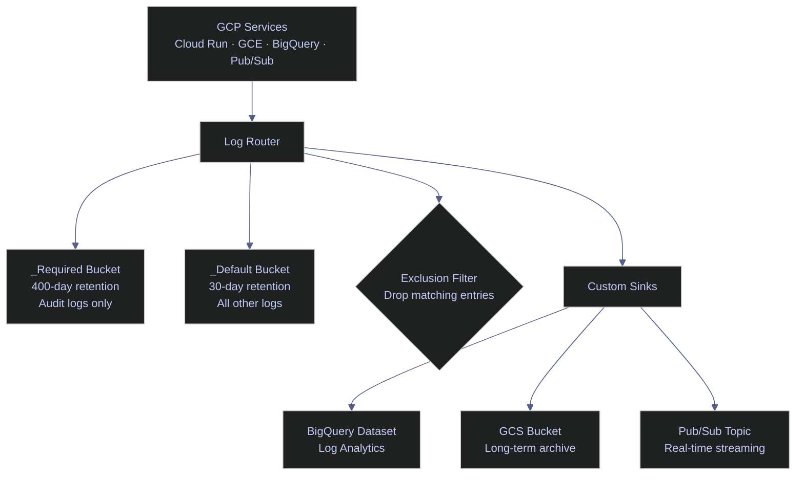

# Cloud Logging — Finding the Needle

> [!quote]
> "Monitoring is for known-unknowns and actionable alerts, observability is for unknown-unknowns and empowering you to ask arbitrary new questions."
>
> — **Charity Majors**, *Observability Engineering* (2022)

When your Cloud Run job fails at 3 AM, Cloud Logging is the first place you look. As one of the three pillars covered in [observability-deep-dive](https://alp78.github.io/elysium/13-Observability/Monitoring/observability-deep-dive), logging complements metrics and tracing to give you full incident visibility. Every GCP service writes structured log entries to the **Log Router**, which routes them to log buckets and optional export sinks. The `gcloud logging read` command supports a powerful filter language that lets you narrow from millions of log entries to the specific failure in seconds — it is not grep, it is a structured query language applied to structured log records.



## Read and Filter Logs

Cloud Logging stores log entries as structured records. Each entry has fields like `severity`, `timestamp`, `resource.type`, `textPayload` (unstructured string) or `jsonPayload` (structured JSON), and `logName`. The `gcloud logging read` command accepts a filter expression using the [Logging query language](https://cloud.google.com/logging/docs/view/logging-query-language) — a field-path comparison syntax that operates on these fields directly.

**Prerequisites:** Cloud Logging API must be enabled. Read access requires `roles/logging.viewer`. Reading Data Access audit logs additionally requires `roles/logging.privateLogViewer`.

### Read recent logs

By default, `gcloud logging read` returns entries from the last 24 hours, ordered newest first. Use `--format=json` for machine-readable output or `--format="table(...)"` for human-readable columns.

#### gcloud logging read — read recent logs

Retrieves the most recent log entries for a given resource type, ordered by timestamp descending.

```bash
gcloud logging read 'resource.type="cloud_run_job"' \
  --limit=50 \
  --format=json
```

```text
[
  {
    "insertId": "1a2b3cde",
    "jsonPayload": {
      "message": "Processed 1523 records in 12.4s"
    },
    "logName": "projects/my-project/logs/run.googleapis.com%2Fstdout",
    "resource": {
      "labels": {
        "job_name": "data-pipeline",
        "location": "europe-west1",
        "project_id": "my-project"
      },
      "type": "cloud_run_job"
    },
    "severity": "INFO",
    "timestamp": "2026-03-22T14:32:10.123456789Z"
  }
]
```

### Filter by severity

The `>=` operator matches that severity level and all levels above it. Common threshold for pipeline incident response: `severity>=WARNING`. The full severity hierarchy in ascending order: `DEFAULT`, `DEBUG`, `INFO`, `NOTICE`, `WARNING`, `ERROR`, `CRITICAL`, `ALERT`, `EMERGENCY`.

#### gcloud logging read — filter by severity

```bash
gcloud logging read 'severity>=ERROR' --limit=20
```

```text
---
insertId: xyz789abc
logName: projects/my-project/logs/run.googleapis.com%2Fstdout
resource:
  labels:
    job_name: data-pipeline
    location: europe-west1
    project_id: my-project
  type: cloud_run_job
severity: ERROR
textPayload: 'ConnectionError: Failed to connect to Cloud SQL after 3 retries'
timestamp: '2026-03-22T03:12:45.234567890Z'
```

### Filter by time range

Timestamps use ISO 8601 format in UTC. The `timestamp` field supports `>=`, `<=`, `>`, `<` comparisons. Without a time filter, the query defaults to the last 24 hours. For incident post-mortems with a known failure window, a time range filter dramatically reduces scan time.

#### gcloud logging read — filter by time range

```bash
gcloud logging read \
  'timestamp>="2026-03-09T14:00:00Z" AND timestamp<="2026-03-09T15:00:00Z"' \
  --limit=100
```

```text
---
insertId: timerange001
resource:
  labels:
    job_name: index-builder
    location: europe-west1
    project_id: my-project
  type: cloud_run_job
severity: INFO
textPayload: 'Batch 12/48 complete — 3200 constituents processed'
timestamp: '2026-03-09T14:17:33.112233445Z'
```

### Full-text search

`textPayload:"term"` performs substring search on unstructured log messages. For structured logs (Cloud Run emitting JSON to stdout), use `jsonPayload.message:"term"` to search within the message field, or `jsonPayload.field="value"` for exact field matching.

#### gcloud logging read — full-text search

```bash
gcloud logging read 'textPayload:"deadlock"' --limit=10
```

```text
---
insertId: deadlock001
resource:
  labels:
    instance_id: data-pipeline-sql
    project_id: my-project
    zone: europe-west1-b
  type: gce_instance
severity: ERROR
textPayload: 'Transaction (Process ID 72) was deadlocked on lock resources with another process'
timestamp: '2026-03-22T09:44:12.887766554Z'
```

### Filter by resource type

Each GCP service writes logs under a specific `resource.type`. Use `resource.labels` to further narrow to a specific job name, instance ID, or cluster. See the resource types quick reference in [Filter Language Reference](#filter-language-reference) for all supported values.

#### gcloud logging read — filter by resource type

```bash
gcloud logging read \
  'resource.type="gce_instance" AND resource.labels.instance_id="data-pipeline-sql"' \
  --limit=30
```

```text
---
insertId: gce001xyz
resource:
  labels:
    instance_id: data-pipeline-sql
    project_id: my-project
    zone: europe-west1-b
  type: gce_instance
severity: WARNING
textPayload: 'Disk usage at 87% on /dev/sdb'
timestamp: '2026-03-22T11:05:00.000000000Z'
```

### Combine multiple filters for incident response

Filters combine with `AND`, `OR`, `NOT`. Parentheses group sub-expressions. Newlines within a filter string are ignored — use them for readability when building multi-condition queries.

#### gcloud logging read — combine filters

Scope to the job name, restrict time to the failure window, and use `table` format for quick scanning across multiple entries.

```bash
gcloud logging read '
  resource.type="cloud_run_job"
  AND severity>=WARNING
  AND resource.labels.job_name="data-pipeline"
  AND timestamp>="2026-03-09T00:00:00Z"
' --limit=100 --format="table(timestamp,severity,textPayload)"
```

```text
TIMESTAMP                         SEVERITY  TEXT_PAYLOAD
2026-03-09T03:12:45.234567890Z    ERROR     ConnectionError: Failed to connect to Cloud SQL after 3 retries
2026-03-09T03:12:44.111222333Z    WARNING   Cloud SQL connection pool exhausted (max=10)
2026-03-09T03:12:43.000000000Z    WARNING   Retrying Cloud SQL connection (attempt 2/3)
```

| Flag | Syntax | Description |
|---|---|---|
| `--limit` | `--limit=50` | Maximum number of log entries to return |
| `--format` | `--format=json` | Output format: `json`, `yaml`, `table(field,...)`, `value(field)` |
| `--freshness` | `--freshness=1h` | Return only entries newer than this duration (e.g., `1h`, `7d`) |
| `--order` | `--order=asc` | Sort order: `desc` (newest first, default) or `asc` |
| `--project` | `--project=my-project` | Target project (defaults to active gcloud config) |

## Tail Logs in Real Time

`gcloud logging tail` opens a streaming connection to Cloud Logging and prints new entries as they arrive, with sub-second latency. Unlike polling `gcloud logging read` repeatedly, the connection stays open — entries appear in near-real-time. Use it during active incidents or deployments to watch a service live.

### Stream live logs

Combine with a severity filter and resource type to reduce noise. The command blocks until interrupted.

#### gcloud logging tail — stream live logs

```bash
gcloud logging tail 'resource.type="cloud_run_job" AND severity>=ERROR'
```

```text
Waiting for new log entries...
2026-03-22T14:32:10.123Z  ERROR     cloud_run_job[data-pipeline]  ConnectionError: timeout after 30s
2026-03-22T14:32:11.456Z  ERROR     cloud_run_job[data-pipeline]  Retrying connection (attempt 2/3)
2026-03-22T14:32:42.789Z  CRITICAL  cloud_run_job[data-pipeline]  Job failed after 3 retries — exiting with code 1
```

> [!tip] Use logging tail during active incidents
>
> `gcloud logging tail` is your live monitoring window during an incident or deployment. Combine it with a severity filter and resource type to see only what matters. Unlike polling `gcloud logging read` repeatedly, `tail` opens a streaming connection — entries appear in near-real-time with sub-second latency. Press `Ctrl+C` to close the stream.

| Flag | Syntax | Description |
|---|---|---|
| `--buffer-window` | `--buffer-window=5s` | Time to buffer entries for ordering before display (default: 2s) |
| `--format` | `--format=json` | Output format |
| `--project` | `--project=my-project` | Target project |

## Write Log Entries

`gcloud logging write` manually writes a log entry to a named log. Use it to verify log routing, test alerting policies, or emit operational events from shell scripts that do not have a Cloud Logging client library available. The log name does not need to exist beforehand.

### Write a log entry from the CLI

The log name is a user-defined string that appears in `logName` as `projects/PROJECT_ID/logs/LOGNAME`.

#### gcloud logging write — write a test log entry

```bash
gcloud logging write pipeline-events "Manual test entry from CLI" --severity=INFO
```

```text
Created log entry.
```

| Flag | Syntax | Description |
|---|---|---|
| `--severity` | `--severity=ERROR` | Log severity level (default: `DEFAULT`) |
| `--payload-type` | `--payload-type=json` | Payload type: `text` (default) or `json` |
| `--project` | `--project=my-project` | Target project |

## Log Export and Sinks

A **log sink** routes a filtered subset of log entries to an external destination. The Log Router evaluates every incoming entry against all configured sinks and forwards matching entries. Sinks are the primary mechanism for long-term log archival, BigQuery-based log analysis, and real-time log streaming.

Common data engineering use cases:
- Export ERROR logs to BigQuery for ad-hoc SQL analysis and dashboarding
- Archive all logs to GCS for compliance retention beyond 30 days
- Stream CRITICAL logs to Pub/Sub to trigger alerting pipelines

> [!warning] Grant destination permissions after sink creation
>
> When you create a sink, Cloud Logging generates a dedicated service account for it. You must manually grant that account write access to the destination (BigQuery Data Editor, Storage Object Creator, or Pub/Sub Publisher). Until you do, the sink exists but silently drops all matching entries.

> [!success] Grant permissions immediately using the identity printed in the create output
>
> The `gcloud logging sinks create` output prints the service account email. Run `gcloud projects add-iam-policy-binding` on the destination project immediately after creation.

### Create a log sink

Sinks are project-scoped by default. Folder- and organization-level aggregated sinks capture logs across child projects.

#### gcloud logging sinks create — export to BigQuery

Cloud Logging creates one table per log type in the dataset (e.g., `cloudaudit_googleapis_com_activity`, `run_googleapis_com_stdout`) and partitions by date. Combine with Log Analytics for direct BigQuery SQL queries against log data without an ETL step.

```bash
gcloud logging sinks create bq-pipeline-errors \
  bigquery.googleapis.com/projects/my-project/datasets/pipeline_logs \
  --log-filter='resource.type="cloud_run_job" AND severity>=ERROR'
```

```text
Created [https://logging.googleapis.com/v2/projects/my-project/sinks/bq-pipeline-errors].
Please remember to grant `serviceAccount:p123456789-000000@gcp-sa-logging.iam.gserviceaccount.com` the BigQuery Data Editor role on the dataset.
```

#### gcloud logging sinks create — export to GCS

Exports matching log entries as JSON files to a GCS bucket, batched into hourly objects. Use for compliance archival or when raw log files are required downstream.

```bash
gcloud logging sinks create gcs-all-logs \
  storage.googleapis.com/my-project-log-archive \
  --log-filter='severity>=WARNING'
```

```text
Created [https://logging.googleapis.com/v2/projects/my-project/sinks/gcs-all-logs].
Please remember to grant `serviceAccount:p123456789-000001@gcp-sa-logging.iam.gserviceaccount.com` the Storage Object Creator role on the bucket.
```

#### gcloud logging sinks create — export to Pub/Sub

Streams matching entries to a Pub/Sub topic in near-real-time. Use for event-driven alerting pipelines — for example, triggering a Cloud Function on every CRITICAL log from a production job.

```bash
gcloud logging sinks create pubsub-critical-alerts \
  pubsub.googleapis.com/projects/my-project/topics/log-alerts \
  --log-filter='severity>=CRITICAL'
```

```text
Created [https://logging.googleapis.com/v2/projects/my-project/sinks/pubsub-critical-alerts].
Please remember to grant `serviceAccount:p123456789-000002@gcp-sa-logging.iam.gserviceaccount.com` the Pub/Sub Publisher role on the topic.
```

| Flag | Syntax | Description |
|---|---|---|
| `--log-filter` | `--log-filter='severity>=ERROR'` | Logging query language filter; only matching entries are exported |
| `--include-children` | `--include-children` | Include logs from child resources (for folder/org-level sinks) |
| `--description` | `--description="Pipeline error archive"` | Human-readable description of the sink |

## Audit Logs

Cloud Audit Logs record administrative and data-access activity across GCP services. They are stored in the `_Required` log bucket (400-day retention, non-configurable) and form the authoritative trail for security, compliance, and incident investigation.

### Audit log types

Four audit log types exist. Admin Activity, System Event, and Policy Denied are always on and generate no additional cost. Data Access logs must be explicitly enabled and are high-volume.

| Type | Log name | Enabled by default | Covers |
|---|---|---|---|
| **Admin Activity** | `cloudaudit.googleapis.com/activity` | Always on | API calls that modify resources (create, delete, update) |
| **Data Access** | `cloudaudit.googleapis.com/data_access` | Disabled | API calls that read resource configuration or data |
| **System Event** | `cloudaudit.googleapis.com/system_event` | Always on | Automated GCP maintenance events |
| **Policy Denied** | `cloudaudit.googleapis.com/policy` | Always on | VPC-SC violations and org policy denials |

> [!warning] Data Access logs are disabled by default and are high-volume
>
> Enabling Data Access logs for BigQuery or GCS on large projects can ingest hundreds of GiB per day — every SELECT query against BigQuery generates a Data Access log entry. Broad enablement on production projects will push costs well above the 50 GiB free tier within hours.

> [!success] Enable Data Access logs selectively per service and operation type
>
> Enable only for services handling sensitive data (e.g., a specific BigQuery dataset for PII). Scope to `DATA_READ` and `DATA_WRITE` only — not `ADMIN_READ`, which is typically redundant with Admin Activity logs.

### Query VPC-SC violations

Cloud Audit Logs record all VPC Service Controls denials under `protoPayload.status.code=7`. See [vpc-service-controls](https://alp78.github.io/elysium/06-GCP/Security/vpc-service-controls) for the specific filter pattern and interpretation guide.

## Filter Language Reference

Cloud Logging uses a structured filter language — not regex, not full-text search. Filters operate on the typed fields of log entries. Multiple conditions combine with `AND`, `OR`, `NOT`. String comparisons are case-sensitive.

> [!info]- Filter Language Quick Reference
>
> - `resource.type="cloud_run_job"` — all Cloud Run job logs
> - `resource.type="gce_instance"` — all VM logs
> - `severity>=ERROR` — ERROR, CRITICAL, ALERT, EMERGENCY
> - `severity=WARNING` — exactly WARNING severity
> - `textPayload:"search term"` — log messages containing this substring
> - `jsonPayload.message:"search"` — structured JSON log messages containing this substring
> - `resource.labels.job_name="name"` — logs from a specific Cloud Run job
> - `resource.labels.instance_id="id"` — logs from a specific VM
> - `timestamp>="2026-03-22T00:00:00Z"` — logs after this UTC timestamp
> - `protoPayload.status.code=7` — permission denied errors (VPC-SC violations use code 7)

> [!info]- Resource Types Quick Reference
>
> - `cloud_run_job` — Cloud Run Jobs
> - `cloud_run_revision` — Cloud Run Services
> - `gce_instance` — Compute Engine VMs
> - `bigquery_resource` — BigQuery operations
> - `pubsub_subscription` — Pub/Sub delivery events
> - `k8s_container` — Kubernetes/GKE containers

> [!tip] Related patterns
>
> SQL Server [audit-logging](https://alp78.github.io/elysium/04-SQL-Server/01-Server-Operations/audit-logging) can forward its audit events to Cloud Logging via the Datadog agent or custom log sinks, unifying database and infrastructure logs in one place. For teams using Datadog as an alternative log destination, [datadog-log-management](https://alp78.github.io/elysium/13-Observability/Datadog/datadog-log-management) provides the routing configuration.

## Log Buckets and Retention

Cloud Logging stores log entries in **log buckets** — managed storage containers within the service. Two system buckets exist in every project by default.

| Bucket | Retention | Contents | Configurable? |
|---|---|---|---|
| `_Required` | 400 days | Admin Activity, System Event, Policy Denied, Data Access logs | No |
| `_Default` | 30 days | All other log entries | Yes (1–3,650 days) |

Custom log buckets can be created for fine-grained retention policies or regional data residency requirements. **Log Analytics** buckets (GA 2023) add a BigQuery-backed query layer — you can run SQL directly against log data in the Cloud Console without exporting to a separate dataset.

> [!warning] Extending `_Default` retention increases storage cost
>
> Beyond the default 30-day window, log storage is charged at $0.01/GiB/month. On high-volume pipelines emitting DEBUG-level logs, this accumulates quickly with no incident-response benefit.

> [!success] Use log exclusion filters to drop noisy log types before storage
>
> Create exclusion filters on the `_Default` bucket to discard DEBUG and INFO logs from services like health check probes or high-frequency Cloud Run revisions. Exclusions reduce ingestion volume and storage cost without affecting higher-severity entries.

## Pricing

Cloud Logging pricing applies to log ingestion (writing entries into the service) and extended storage (retention beyond defaults).

| Component | Free tier | Paid tier |
|---|---|---|
| Log ingestion | First 50 GiB/project/month | $0.01/GiB after free tier |
| `_Default` bucket storage | 30 days included | $0.01/GiB/month for extended retention |
| `_Required` bucket storage | 400 days included | Not configurable |
| Log Analytics queries | No additional log charge | Standard BigQuery on-demand query costs apply |

> [!warning] High-frequency services fill the free tier quickly
>
> A Cloud Run service handling 1,000 requests/minute with INFO-level logging can generate 50+ GiB/month. DEBUG logging on the same service can be an order of magnitude higher.

> [!success] Use exclusion filters to stay within the free tier
>
> Exclude `severity=DEBUG` and `severity=INFO` from the `_Default` bucket for services that do not require that granularity. Keeping WARNING and above gives full incident visibility at a fraction of the ingestion volume.

## Related

- [cloud-monitoring-metrics](https://alp78.github.io/elysium/06-GCP/Logging/cloud-monitoring-metrics) — Metrics tell you *how much*; logs tell you *what happened*
- [cloud-run-jobs-vs-services](https://alp78.github.io/elysium/06-GCP/Serverless/cloud-run-jobs-vs-services) — Cloud Run job logs are the most common starting point for pipeline debugging
- [vm-lifecycle](https://alp78.github.io/elysium/06-GCP/Compute/vm-lifecycle) — VM system logs appear under `resource.type="gce_instance"`
- [vpc-service-controls](https://alp78.github.io/elysium/06-GCP/Security/vpc-service-controls) — VPC-SC violations appear in Cloud Audit Logs
- [dataset-and-table-management](https://alp78.github.io/elysium/06-GCP/BigQuery/dataset-and-table-management) — BigQuery operations appear under `resource.type="bigquery_resource"`
- [GCP observability patterns](https://alp78.github.io/elysium/13-Observability/GCP-Native/) — Uptime checks, alerting policies, and dashboards built on top of Cloud Logging and Monitoring
- [GCP resource provisioning](https://alp78.github.io/elysium/07-Terraform/) — Provision log sinks and custom log buckets with Terraform

## References

- [Cloud Logging filter language](https://cloud.google.com/logging/docs/view/logging-query-language)
- [Resource types](https://cloud.google.com/logging/docs/api/v2/resource-list)
- [gcloud logging reference](https://cloud.google.com/sdk/gcloud/reference/logging)
- [Log sinks overview](https://cloud.google.com/logging/docs/export/configure_export_v2)
- [Cloud Audit Logs overview](https://cloud.google.com/logging/docs/audit)
- [Log buckets and retention](https://cloud.google.com/logging/docs/storage)

