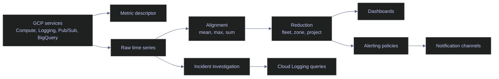

# Cloud Monitoring Metrics

> [!abstract]- Summary
>
> Covers Cloud Monitoring as the live-verified metric and alerting control plane for project `bq-wh-nb`, including metric descriptors, monitored resources, raw and aggregated time series, the current `gcloud monitoring` surface, the Monitoring v3 API fallback, notification and uptime surfaces, and the bridge back to Cloud Logging so you can interpret numeric signals correctly before you chart, alert, or troubleshoot.
>
> **Metric model and live project baseline**
> - Core schema: metric descriptors, metric types, monitored resources, labels, points, `metricKind`, `valueType`, units, `samplePeriod`, and `ingestDelay` determine how Monitoring data must be read
> - The active project currently has Compute Engine metric producers but no dashboards, alerting policies, uptime configs, or configured notification channels, which means raw telemetry exists but operator-facing control objects are still absent
> - Logging-derived Monitoring signals already exist through native metrics such as `logging.googleapis.com/billing/bytes_ingested`, even though no user-defined monitoring objects are configured
>
> **CLI and control surfaces**
> - Stable `gcloud monitoring` in this SDK exposes `dashboards`, `policies`, `snoozes`, and `uptime`, but not stable descriptor or time-series list commands
> - Inventory commands verify that dashboards, policies, uptime configs, and notification channels currently return `[]`, while beta channel-descriptor commands expose supported delivery types such as `email`, `pagerduty`, `pubsub`, `slack`, `sms`, and `webhook_*`
> - Uptime workflows include source-IP inventory for firewall planning before synthetic checks are created
>
> **Descriptor and time-series reads**
> - Monitoring v3 API reads use `gcloud auth print-access-token` plus `Invoke-RestMethod` to query metric descriptors and `timeSeries` directly
> - Descriptor examples cover Logging billing metrics and Compute Engine CPU metrics, including units, resource models, and sampling behavior
> - Time-series examples cover raw per-VM CPU utilization, aligned and reduced fleet CPU, and Logging bytes-ingested metrics that bridge observability cost questions back to Monitoring
>
> **Operations and safety**
> - When to use: threshold design, trend analysis, fleet-health review, backlog or saturation diagnosis, alert-delivery planning, and log-to-metric investigation pivots
> - Warnings: missing data is not automatically healthy data, noisy raw points should not page operators directly, high-cardinality labels increase cost and noise, and Monitoring API read economics now depend on time series returned rather than only request count
> - Recommendations: read the descriptor before the data, align and reduce signals before alerting, pair every important metric alert with a log query, and validate the full chain from metric existence to policy to enabled notification channel
> - Troubleshooting: 4 failure modes covering empty metric queries, alerts that never fired, alerts that fire too often, and fragmented Cloud Run or pipeline investigations
>
> [!note]- Glossary
>
> **Cloud Monitoring**
> - Google Cloud's managed metric, alerting, dashboard, and uptime system for numeric time-series telemetry.
> - This note treats Monitoring as the place where operators detect sustained behavior, define thresholds, and evaluate fleet health before pivoting into logs for explanation.
>
> > [!info] Metrics answer different questions
> >
> > Monitoring is strongest at trends, thresholds, and saturation. It complements Logging rather than replacing it because it stores numeric time series instead of rich event payloads.
>
> ---
>
> **Metric descriptor**
> - The schema object that defines a metric's type, unit, kind, value type, labels, and sampling metadata.
> - The note treats descriptor reads as mandatory because misreading units or semantic behavior is one of the fastest ways to build broken charts and alerts.
>
> > [!warning] Read schema before points
> >
> > Querying a metric without inspecting its descriptor invites mistakes about units, delay, and aggregation semantics. The point values rarely explain those rules on their own.
>
> ---
>
> **Metric type**
> - The canonical identifier of a metric, such as `compute.googleapis.com/instance/cpu/utilization` or `logging.googleapis.com/billing/bytes_ingested`.
> - The note uses metric types in every API filter, descriptor lookup, charting workflow, and alert-design question.
>
> > [!info] Prefixes reveal producers
> >
> > Metric namespaces usually expose the producing service family. That makes the type string a quick clue about whether the signal comes from Compute, Logging, Pub/Sub, or another control plane.
>
> ---
>
> **Monitored resource**
> - The resource model attached to a time series, such as `gce_instance` or `global`, with its own identifying labels.
> - The note emphasizes monitored resources because resource labels often matter as much as metric labels when you are narrowing an investigation.
>
> > [!warning] Metric and resource labels are separate
> >
> > Operators often focus on metric labels and forget that the resource model contributes critical dimensions like instance ID, zone, or project. Ignoring resource labels makes filters and reductions misleading.
>
> ---
>
> **Label**
> - A named dimension on either the metric or the monitored resource that distinguishes one time series from another.
> - The note uses labels for filtering, grouping, reduction, and alert-scope design.
>
> > [!warning] Cardinality is operational cost
> >
> > Every unique label combination can create a distinct time series. High-cardinality labels increase cost, clutter dashboards, and make alerts harder to reason about.
>
> ---
>
> **Time series**
> - A stream of metric points for one exact metric plus one exact label set over time.
> - The note treats the time series, not the descriptor, as the fundamental unit of charting, alert evaluation, and Monitoring API pricing.
>
> > [!warning] Label change means new series
> >
> > If any label value changes, Monitoring treats the result as a different time series. This is why bounded labels matter so much operationally.
>
> ---
>
> **Point**
> - A single observed metric value associated with an instant or interval in a time series.
> - The note uses points to distinguish raw samples from aligned windows and to show why one observed value is never enough context by itself.
>
> > [!warning] Point meaning depends on kind
> >
> > A point from a `GAUGE` metric and a point from a `DELTA` metric should not be read the same way. The number alone is not enough without the metric semantics.
>
> ---
>
> **`metricKind`**
> - The semantic behavior of a metric, such as `GAUGE`, `DELTA`, or `CUMULATIVE`, that defines how consecutive points should be interpreted.
> - The note uses `metricKind` to explain why alignment and alert logic must respect whether a metric is level-like or change-over-time.
>
> > [!warning] Semantics drive math
> >
> > Aggregating the wrong metric kind with the wrong intuition produces plausible but wrong dashboards. Always let the descriptor tell you how the series behaves before you summarize it.
>
> ---
>
> **GAUGE**
> - A metric kind whose point represents the value of something at a specific moment rather than accumulated change over an interval.
> - The note uses `GAUGE` metrics for examples like CPU utilization and current stored-byte levels.
>
> > [!info] Level, not increment
> >
> > Consecutive `GAUGE` points are snapshots. Summing them directly usually does not answer a meaningful operational question.
>
> ---
>
> **DELTA**
> - A metric kind whose point represents how much a value changed during a bounded interval.
> - The note uses `DELTA` metrics for ingestion or usage patterns where each point is a slice of activity rather than a standing level.
>
> > [!warning] Interval matters
> >
> > A `DELTA` value is only meaningful with its time window. Treating it like a point-in-time level hides the rate or accumulation behavior the metric is designed to express.
>
> ---
>
> **`valueType`**
> - The data type of the metric's value, such as `DOUBLE`, `INT64`, `BOOL`, or distribution-shaped types.
> - The note includes `valueType` because type determines whether a series is continuous, count-based, or otherwise constrained before you chart it.
>
> > [!warning] Numeric does not imply unitless
> >
> > Even when the value type is numeric, the descriptor's unit still controls interpretation. A `DOUBLE` can represent seconds, bytes, or percentages, and those are not interchangeable.
>
> ---
>
> **`samplePeriod` / `ingestDelay`**
> - Descriptor metadata that states how often Monitoring expects fresh samples and how long they can take to become queryable.
> - The note treats these fields as critical for troubleshooting empty reads and for designing alert windows that do not outrun metric delivery.
>
> > [!warning] Delay can mimic absence
> >
> > A query returning nothing does not automatically mean the workload is healthy or the metric is gone. Sometimes the data simply has not arrived yet within the documented ingest delay.
>
> ---
>
> **Alignment**
> - The per-series transformation that converts raw points into windowed values such as mean, max, sum, or rate over a chosen interval.
> - The note uses alignment to reduce noise and to make alerting decisions match the time horizon that operators actually care about.
>
> > [!warning] Raw points are often too twitchy
> >
> > Alerting directly on one-minute raw points is a common route to flapping. Alignment is how you convert noisy samples into decision-quality signals.
>
> ---
>
> **Per-series aligner**
> - The specific alignment function, such as `ALIGN_MEAN` or `ALIGN_MAX`, applied independently to each time series before any cross-series aggregation.
> - The note includes aligners because the chosen function changes what the returned number actually means.
>
> > [!info] Function choice changes the question
> >
> > `ALIGN_MEAN` answers a different operational question from `ALIGN_MAX`. One smooths typical behavior; the other preserves peak behavior for the alignment window.
>
> ---
>
> **Reduction**
> - The aggregation of multiple aligned time series into fewer fleet-level or group-level series.
> - The note uses reduction to answer questions about a resource set rather than about one individual VM or service.
>
> > [!warning] Aggregation can hide outliers
> >
> > Reducing unlike resources into one value can blur the exact host or zone that is in trouble. Reduction is powerful, but only when the grouping matches the investigation scope.
>
> ---
>
> **Cross-series reducer**
> - The specific aggregation function, such as `REDUCE_MAX` or `REDUCE_MEAN`, applied across multiple aligned series.
> - The note uses reducers to show how the same underlying fleet can look very different depending on whether you ask for the busiest member or the average member.
>
> > [!warning] Reducer choice affects paging behavior
> >
> > `REDUCE_MAX` is sensitive to one bad actor; `REDUCE_MEAN` can hide it. Pick the reducer that matches whether you want to catch any hot instance or only broad fleet degradation.
>
> ---
>
> **Alerting policy**
> - A Monitoring object that evaluates one or more conditions against time-series data and opens incidents when the rules are met.
> - The note treats alerting policies as control-system objects whose quality depends on condition design, not merely on their existence.
>
> > [!warning] An alert object can still be incomplete
> >
> > A policy with no working channel, bad alignment, or the wrong threshold is operationally unfinished even if the API says it exists.
>
> ---
>
> **Notification channel**
> - A delivery path such as email, PagerDuty, Pub/Sub, Slack, SMS, or webhook that Monitoring can use when a policy triggers.
> - The note includes channels because policies that cannot notify anyone do not close the incident-response loop.
>
> > [!warning] Policy without channel means silence
> >
> > An alert can evaluate correctly and still tell nobody if the project has no enabled notification channel instance. Always validate delivery, not just condition logic.
>
> ---
>
> **Notification channel descriptor**
> - The schema definition for a channel type, including the labels required to configure an instance of that type.
> - The note uses descriptors to explain the difference between supported delivery families and actual configured channels.
>
> > [!info] Descriptor is not instance
> >
> > Seeing a `pubsub` or `pagerduty` descriptor only proves the platform supports that channel type. It does not mean any usable channel has been created in the project.
>
> ---
>
> **Uptime check / synthetic monitor**
> - An active probe executed by Cloud Monitoring to verify that an endpoint is reachable and behaving as expected from external probe infrastructure.
> - The note includes uptime checks because they complement passive telemetry by proving whether a service can actually be contacted.
>
> > [!warning] Firewall planning comes first
> >
> > Probe traffic originates from specific Monitoring-controlled IP ranges. If those ranges are blocked, the monitor fails for networking reasons rather than for application reasons.
>
> ---
>
> **Monitoring v3 API**
> - The REST API surface used to read metric descriptors and time series when the installed stable CLI does not expose those commands directly.
> - The note uses the API as the reliable fallback for live descriptor and series inspection in this SDK.
>
> > [!warning] Surface mismatch is real
> >
> > Older runbooks often assume stable `gcloud monitoring` can list descriptors and time series. In this environment, trusting that stale assumption wastes time until you fall back to the API.
>
> ---
>
> **`gcloud auth print-access-token`**
> - The Cloud SDK command that prints a bearer token suitable for authenticated Monitoring v3 API reads.
> - The note uses it because the PowerShell API examples need a live token before `Invoke-RestMethod` can query Monitoring.
>
> > [!warning] Token proves identity, not authorization breadth
> >
> > Having an access token only means you are authenticated. The API still enforces IAM permissions on the project and the Monitoring resource surface you query.
>
> ---
>
> **Log-based metric**
> - A Monitoring metric derived from matching Cloud Logging entries rather than emitted directly by a service's native metric pipeline.
> - The note includes log-based metrics because they are the main bridge from event patterns into chartable or alertable numerical signals.
>
> > [!warning] Bridge, not backfill
> >
> > Log-based metrics start from creation time and depend on stable, bounded log patterns. They are useful for recurrent failures, not as a retroactive substitute for raw log analysis.

## Why This Topic Matters

Metrics answer the questions that logs cannot answer quickly at scale: Is backlog rising, is CPU saturating, are errors sustained or spiky, and did the problem affect one instance or the whole fleet? In data engineering, these are the signals that tell you when a scheduled batch is late, when a consumer is falling behind, when retries are amplifying load, and when costs or retention are creeping upward.

This active project already proves the split between Logging and Monitoring:

- Logging has active audit logs, default buckets, and verification writes.
- Monitoring has active metric APIs, running Compute Engine instances, no dashboards, no alerting policies, no uptime configs, and no configured notification channels.

That is a normal platform baseline. The raw telemetry exists. The operational question is how to interpret it and which pieces are still missing.

## Conceptual Model

Metrics become useful only after you read them with the right schema and aggregation semantics. The diagram below shows the signal path that matters operationally.



### Cloud Monitoring | live project summary

The active project already has metric-producing resources, but almost no Monitoring control objects.

| Object | Live state in `bq-wh-nb` | Operational meaning |
|---|---|---|
| Compute instances | `stoxx-airflow`, `stoxx-vm` | Native VM metrics are available |
| Dashboards | `[]` | No saved visual views yet |
| Alerting policies | `[]` | No active Monitoring threshold policies yet |
| Uptime configs | `[]` | No active uptime checks or synthetic monitors yet |
| Notification channels | `[]` | Policies cannot notify anyone yet |
| Notification channel descriptor types | `email`, `pagerduty`, `pubsub`, `slack`, `sms`, `webhook_*`, others | Supported delivery types exist even though no instances are configured |

> [!info] Important conceptual note not safely executed here
>
> The active project does not contain dashboards, alerting policies, uptime configs, synthetic monitors, or configured notification channels. Creating those objects would mutate the live environment and can page people, generate cost, or create false confidence. This note therefore separates:
>
> - live-verified inventory and query workflows
> - production guidance for alert and monitor design that was important but not safe to instantiate here

## PowerShell / Linux

This section covers the current `gcloud` command surface that exists in the installed SDK.

### PowerShell / Linux | gcloud monitoring | verify the current CLI surface

Older guides often show stable commands like `gcloud monitoring metrics-descriptors list` and `gcloud monitoring time-series list`. Those commands are not present on the stable surface in this environment, so the first operational step is to verify the CLI that is actually installed.

#### Inspect the stable Monitoring command groups

Before copying metric-descriptor or time-series commands from older notes. It is typically triggered by A runbook assumes that stable `gcloud monitoring` exposes direct metric query subcommands. Read-only. This command checks the installed SDK surface. Confirm which stable Monitoring command groups actually exist.

*Ask the stable CLI which Monitoring groups it currently exposes.*

```powershell
gcloud monitoring --help
```

```text
NAME
    gcloud monitoring - manage Cloud Monitoring dashboards

GROUPS
    GROUP is one of the following:

     dashboards
        Manage Cloud Monitoring dashboards.

     policies
        Manage Cloud Monitoring alerting policies.

     snoozes
        Manage Cloud Monitoring snoozes.

     uptime
        Manage Cloud Monitoring uptime checks and synthetic monitors.
```

This is the most important live correction in the chapter. Stable `gcloud monitoring` in this environment is a control-plane CLI for dashboards, policies, snoozes, and uptime. It is not the current stable interface for listing metric descriptors or raw time series.

#### Inspect the existing Monitoring inventory

Before building alerts or dashboards on top of assumed existing objects. It is typically triggered by you need to know whether the project already has alerting and visualization state. Read-only. Show whether dashboards, policies, uptime checks, and notification channels already exist.

| Field | Type | Meaning |
|---|---|---|
| result array | array | Inventory returned by the CLI |
| `[]` | empty array | No configured objects of that type exist in the project |

*List dashboards in the active project.*

```powershell
gcloud monitoring dashboards list --format=json
```

```text
[]
```

*List alerting policies in the active project.*

```powershell
gcloud monitoring policies list --format=json
```

```text
[]
```

*List uptime checks and synthetic monitors in the active project.*

```powershell
gcloud monitoring uptime list-configs --format=json
```

```text
[]
```

*List configured notification channels in the active project.*

```powershell
gcloud alpha monitoring channels list --format=json
```

```text
[]
```

The project currently has raw telemetry but no configured Monitoring control objects. That means alerts are not yet firing, dashboards are not yet persisted, and notification delivery is not configured.

| Flag | Syntax | Description |
|---|---|---|
| `--format` | `--format=json` | Chooses machine-readable inventory output |
| `--project` | `--project=bq-wh-nb` | Overrides the active project when needed |

### PowerShell / Linux | gcloud monitoring | inspect notification and uptime surfaces

Notification channels and uptime checks are where Monitoring becomes operator-visible. Even when the project has no configured instances, it is still useful to inspect the supported channel types and the public probe source ranges.

#### List supported notification channel descriptor types

Before designing alert delivery. It is typically triggered by you need to know whether email, Pub/Sub, PagerDuty, Slack, SMS, or webhook delivery is supported. Read-only. Uses the beta descriptor surface because that is what exists in this SDK. Show the channel families that can be instantiated in the project.

*List the supported notification channel descriptor types.*

```powershell
gcloud beta monitoring channel-descriptors list --format="value(type)"
```

```text
campfire
email
google_chat
hipchat
pagerduty
pubsub
slack
sms
webhook_basicauth
webhook_tokenauth
```

This output tells you what kinds of channels can exist. It does not mean any channel of that type is already configured.

#### Inspect the Pub/Sub channel descriptor

Before choosing Pub/Sub as a notification fan-out target. It is typically triggered by you need to know which labels the descriptor requires. Read-only. Show that a channel descriptor is a schema, not a configured channel instance.

| Field | Type | Meaning |
|---|---|---|
| `displayName` | string | Human-facing name of the descriptor type |
| `type` | string | Channel type identifier |
| `labels` | array | Required configuration fields for channel creation |

*Describe the built-in Pub/Sub notification channel descriptor.*

```powershell
gcloud beta monitoring channel-descriptors describe pubsub --format=json
```

```text
{
  "description": "A channel that publishes notifications to Cloud Pub/Sub topics.",
  "displayName": "Cloud Pub/Sub",
  "labels": [
    {
      "description": "The PubSub topic.",
      "key": "topic"
    }
  ],
  "launchStage": "GA",
  "name": "projects/bq-wh-nb/notificationChannelDescriptors/pubsub",
  "type": "pubsub"
}
```

The important operational point is that descriptors define the required configuration shape. A descriptor is not a live channel and does not deliver anything on its own.

#### List uptime probe source IPs

Before firewalling an endpoint that an uptime check or synthetic monitor must reach. It is typically triggered by the networking team needs the source ranges for Monitoring probes. Read-only. Show where uptime checks can originate from.

| Column | Meaning |
|---|---|
| `REGION` | Broad probe region grouping |
| `LOCATION` | Human-friendly probe location |
| `IP_ADDRESS` | Source IP that can send probe traffic |

*List a representative slice of uptime check source addresses.*

```powershell
gcloud monitoring uptime list-ips --limit=6 --format="table(region,location,ipAddress)"
```

```text
REGION  LOCATION  IP_ADDRESS
USA     Oregon    35.197.117.125
USA     Oregon    35.203.157.42
USA     Oregon    35.199.157.7
USA     Oregon    35.233.206.171
USA     Oregon    35.197.32.224
USA     Oregon    35.233.167.246
```

This command is useful even when there are no configured uptime checks yet because firewall and allowlist work often happens before the monitor object is created.

| Flag | Syntax | Description |
|---|---|---|
| `--format` | `--format=json` or `table(...)` | Renders descriptor or IP output in a human-usable form |
| `--limit` | `--limit=6` | Restricts how many probe addresses are displayed |

## PowerShell

Stable `gcloud monitoring` in this environment does not expose direct metric-descriptor or time-series list commands. The live fallback below uses the Monitoring v3 API with an access token printed by `gcloud`.

### PowerShell | Monitoring API | read metric descriptors

Read the descriptor before you read the data. The descriptor tells you how many labels exist, which resource model to expect, whether the metric is `GAUGE` or `DELTA`, what the unit means, and how quickly the data should arrive.

#### Inspect logging billing metric descriptors

Before charting or alerting on Logging-related ingestion or retention signals. It is typically triggered by you need to know which logging metrics already exist natively in Monitoring. PowerShell-only in this note because the workflow uses `Invoke-RestMethod`. Read-only. Show the descriptor schema for built-in Logging billing metrics.

| Field | Meaning |
|---|---|
| `type` | Canonical metric type identifier |
| `metricKind` | Whether the series is `GAUGE` or `DELTA` |
| `valueType` | Data type of each point |
| `unit` | Unit string used by Monitoring |
| `labels` | Metric labels that create additional time-series dimensions |
| `samplePeriod` | Expected sampling cadence |
| `ingestDelay` | Typical delay before points are queryable |

*Query Logging metric descriptors through the Monitoring v3 API and keep only the fields needed for interpretation.*

```powershell
$token = gcloud auth print-access-token
$headers = @{ Authorization = "Bearer $token" }
$filter = [uri]::EscapeDataString('metric.type = starts_with("logging.googleapis.com/")')
$uri = "https://monitoring.googleapis.com/v3/projects/bq-wh-nb/metricDescriptors?filter=$filter&pageSize=5"
$resp = Invoke-RestMethod -Headers $headers -Uri $uri -Method Get
$resp.metricDescriptors |
  Select-Object type,metricKind,valueType,unit,@{Name='labels';Expression={@($_.labels.key)}},@{Name='samplePeriod';Expression={$_.metadata.samplePeriod}},@{Name='ingestDelay';Expression={$_.metadata.ingestDelay}} |
  ConvertTo-Json -Depth 10
```

```text
[
  {
    "type": "logging.googleapis.com/billing/bytes_ingested",
    "metricKind": "DELTA",
    "valueType": "INT64",
    "unit": "By",
    "labels": "resource_type",
    "samplePeriod": "60s",
    "ingestDelay": "300s"
  },
  {
    "type": "logging.googleapis.com/billing/bytes_stored",
    "metricKind": "GAUGE",
    "valueType": "INT64",
    "unit": "By",
    "labels": [
      "data_type",
      "log_bucket_location",
      "log_bucket_id"
    ],
    "samplePeriod": "60s",
    "ingestDelay": "300s"
  },
  {
    "type": "logging.googleapis.com/billing/log_bucket_bytes_ingested",
    "metricKind": "DELTA",
    "valueType": "INT64",
    "unit": "By",
    "labels": [
      "log_source",
      "resource_type",
      "log_bucket_location",
      "log_bucket_id"
    ],
    "samplePeriod": "60s",
    "ingestDelay": "300s"
  },
  {
    "type": "logging.googleapis.com/billing/log_bucket_monthly_bytes_ingested",
    "metricKind": "GAUGE",
    "valueType": "INT64",
    "unit": "By",
    "labels": [
      "log_source",
      "resource_type",
      "log_bucket_location",
      "log_bucket_id"
    ],
    "samplePeriod": "1800s",
    "ingestDelay": "6000s"
  },
  {
    "type": "logging.googleapis.com/billing/monthly_bytes_ingested",
    "metricKind": "GAUGE",
    "valueType": "INT64",
    "unit": "By",
    "labels": "resource_type",
    "samplePeriod": "1800s",
    "ingestDelay": "6000s"
  }
]
```

This output is the bridge back to the Logging note. Cloud Logging already emits Monitoring-native billing metrics, so not every logging question requires a custom log-based metric. Notice how retention-focused metrics are `GAUGE`, while ingestion metrics are `DELTA`.

#### Inspect Compute Engine CPU descriptors

Before querying VM performance or alerting on CPU saturation. It is typically triggered by you need to know which CPU metrics exist and how to interpret their units. Read-only. Show that metric descriptors carry the schema needed to interpret utilization, usage time, and reserved cores correctly.

*Query Compute Engine CPU descriptors through the Monitoring v3 API.*

```powershell
$token = gcloud auth print-access-token
$headers = @{ Authorization = "Bearer $token" }
$filter = [uri]::EscapeDataString('metric.type = starts_with("compute.googleapis.com/instance/cpu/")')
$uri = "https://monitoring.googleapis.com/v3/projects/bq-wh-nb/metricDescriptors?filter=$filter&pageSize=5"
$resp = Invoke-RestMethod -Headers $headers -Uri $uri -Method Get
$resp.metricDescriptors |
  Select-Object type,metricKind,valueType,unit,@{Name='samplePeriod';Expression={$_.metadata.samplePeriod}},@{Name='ingestDelay';Expression={$_.metadata.ingestDelay}},@{Name='monitoredResourceTypes';Expression={$_.monitoredResourceTypes -join ','}} |
  ConvertTo-Json -Depth 5
```

```text
[
  {
    "type": "compute.googleapis.com/instance/cpu/guest_visible_vcpus",
    "metricKind": "GAUGE",
    "valueType": "DOUBLE",
    "unit": "1",
    "samplePeriod": "60s",
    "ingestDelay": "240s",
    "monitoredResourceTypes": "gce_instance"
  },
  {
    "type": "compute.googleapis.com/instance/cpu/reserved_cores",
    "metricKind": "GAUGE",
    "valueType": "DOUBLE",
    "unit": "1",
    "samplePeriod": "60s",
    "ingestDelay": "240s",
    "monitoredResourceTypes": "gce_instance"
  },
  {
    "type": "compute.googleapis.com/instance/cpu/scheduler_wait_time",
    "metricKind": "DELTA",
    "valueType": "DOUBLE",
    "unit": "s{idle}",
    "samplePeriod": "60s",
    "ingestDelay": "240s",
    "monitoredResourceTypes": "gce_instance"
  },
  {
    "type": "compute.googleapis.com/instance/cpu/usage_time",
    "metricKind": "DELTA",
    "valueType": "DOUBLE",
    "unit": "s{CPU}",
    "samplePeriod": "60s",
    "ingestDelay": "240s",
    "monitoredResourceTypes": "gce_instance"
  },
  {
    "type": "compute.googleapis.com/instance/cpu/utilization",
    "metricKind": "GAUGE",
    "valueType": "DOUBLE",
    "unit": "10^2.%",
    "samplePeriod": "60s",
    "ingestDelay": "240s",
    "monitoredResourceTypes": "gce_instance"
  }
]
```

The `unit` field matters. `compute.googleapis.com/instance/cpu/utilization` is a `GAUGE` with unit `10^2.%`, which means the raw point value is a fraction rendered as percent. A value of `0.517...` is about `51.7%`, not `0.517%`.

### PowerShell | Monitoring API | read raw and aggregated time series

Raw time series tell you what one labeled source did. Aggregated time series tell you what a fleet or slice did after explicit alignment and reduction rules were applied. Both views are useful, but they answer different questions.

#### Read raw CPU utilization for one VM

During host-level triage or right-sizing review. It is typically triggered by you need to know whether one VM is actually saturated or idle. Read-only. Show an unaggregated VM metric with its resource labels and recent points.

| Field | Meaning |
|---|---|
| `metric.type` | Metric being queried |
| `metric.labels.instance_name` | Human-friendly VM name |
| `resource.labels.instance_id` | Stable instance identifier used by Monitoring |
| `resource.labels.zone` | Zone of the VM |
| `points[].interval` | Time window for each metric point |
| `points[].value.doubleValue` | Observed CPU utilization fraction |

*Query raw CPU utilization points for one VM in the active project.*

```powershell
$token = gcloud auth print-access-token
$headers = @{ Authorization = "Bearer $token" }
$start = [uri]::EscapeDataString((Get-Date).ToUniversalTime().AddHours(-6).ToString('o'))
$end = [uri]::EscapeDataString((Get-Date).ToUniversalTime().ToString('o'))
$filter = [uri]::EscapeDataString('metric.type = "compute.googleapis.com/instance/cpu/utilization"')
$uri = "https://monitoring.googleapis.com/v3/projects/bq-wh-nb/timeSeries?filter=$filter&interval.startTime=$start&interval.endTime=$end&view=FULL&pageSize=3"
(Invoke-RestMethod -Headers $headers -Uri $uri -Method Get) | ConvertTo-Json -Depth 100
```

```text
{
  "timeSeries": [
    {
      "metric": {
        "labels": {
          "instance_name": "stoxx-airflow"
        },
        "type": "compute.googleapis.com/instance/cpu/utilization"
      },
      "resource": {
        "type": "gce_instance",
        "labels": {
          "project_id": "bq-wh-nb",
          "zone": "europe-west1-b",
          "instance_id": "3833904033025838281"
        }
      },
      "metricKind": "GAUGE",
      "valueType": "DOUBLE",
      "points": [
        {
          "interval": {
            "startTime": "2026-04-13T13:44:00Z",
            "endTime": "2026-04-13T13:44:00Z"
          },
          "value": {
            "doubleValue": 0.26974677127151203
          }
        },
        {
          "interval": {
            "startTime": "2026-04-13T13:43:00Z",
            "endTime": "2026-04-13T13:43:00Z"
          },
          "value": {
            "doubleValue": 0.11170530053671257
          }
        },
        {
          "interval": {
            "startTime": "2026-04-13T13:42:00Z",
            "endTime": "2026-04-13T13:42:00Z"
          },
          "value": {
            "doubleValue": 0.01081406960042619
          }
        }
      ]
    }
  ],
  "nextPageToken": "CMG1x8-vgZ-glQES7wEiHQoQCgYIqOXzzgYSBgio5fPOBhIJGQD7KdqvJYY_KgxnY2VfaW5zdGFuY2UyvwFqFwoHcHJvamVjdBoMMzQ4NTU3MDkyNTE0aiEKB3NlcnZpY2UaFmNvbXB1dGUuZ29vZ2xlYXBpcy5jb21qGQoNcmVzb3VyY2VfdHlwZRoIaW5zdGFuY2VqGgoIbG9jYXRpb24aDmV1cm9wZS13ZXN0MS1iaiIKC3Jlc291cmNlX2lkGhMzODMzOTA0MDMzMDI1ODM4MjgxciYKFW1ldHJpYzovaW5zdGFuY2VfbmFtZRoNc3RveHgtYWlyZmxvdw",
  "unit": "10^2.%"
}
```

This is a raw per-instance series. The points show CPU rising from about `1.1%` to `11.2%` to `27.0%` across consecutive one-minute samples. That is a real workload ramp, not necessarily a problem. The `unit` field confirms how to convert the fraction into operator-friendly percent.

#### Read aligned and reduced CPU utilization

During fleet-level health review, threshold design, or noisy-alert cleanup. It is typically triggered by raw per-instance series are too granular for the operational question. Read-only. Show how alignment and reduction change the meaning of the returned point.

*Query one aligned and reduced CPU series across the project's VM set.*

```powershell
$token = gcloud auth print-access-token
$headers = @{ Authorization = "Bearer $token" }
$start = [uri]::EscapeDataString((Get-Date).ToUniversalTime().AddHours(-6).ToString('o'))
$end = [uri]::EscapeDataString((Get-Date).ToUniversalTime().ToString('o'))
$filter = [uri]::EscapeDataString('metric.type = "compute.googleapis.com/instance/cpu/utilization"')
$uri = "https://monitoring.googleapis.com/v3/projects/bq-wh-nb/timeSeries?filter=$filter&interval.startTime=$start&interval.endTime=$end&view=FULL&pageSize=3&aggregation.alignmentPeriod=3600s&aggregation.perSeriesAligner=ALIGN_MEAN&aggregation.crossSeriesReducer=REDUCE_MAX"
(Invoke-RestMethod -Headers $headers -Uri $uri -Method Get) | ConvertTo-Json -Depth 100
```

```text
{
  "timeSeries": [
    {
      "metric": {
        "type": "compute.googleapis.com/instance/cpu/utilization"
      },
      "resource": {
        "type": "gce_instance",
        "labels": {
          "project_id": "bq-wh-nb"
        }
      },
      "metricKind": "GAUGE",
      "valueType": "DOUBLE",
      "points": [
        {
          "interval": {
            "startTime": "2026-04-13T13:47:08.24961Z",
            "endTime": "2026-04-13T13:47:08.24961Z"
          },
          "value": {
            "doubleValue": 0.1426432415897683
          }
        },
        {
          "interval": {
            "startTime": "2026-04-13T12:47:08.24961Z",
            "endTime": "2026-04-13T12:47:08.24961Z"
          },
          "value": {
            "doubleValue": 0.06123336967894423
          }
        },
        {
          "interval": {
            "startTime": "2026-04-13T11:47:08.24961Z",
            "endTime": "2026-04-13T11:47:08.24961Z"
          },
          "value": {
            "doubleValue": 0.04817410439093394
          }
        }
      ]
    }
  ],
  "nextPageToken": "CJHokZmd95DytAESNyInChoKCwi8r_POBhCQ_oJ3EgsIvK_zzgYQkP6CdxIJGa8Nv7VGqqg_KgxnY2VfaW5zdGFuY2U",
  "unit": "10^2.%"
}
```

This result is not the same question as the raw series above. `ALIGN_MEAN` produces an hourly mean for each VM, and `REDUCE_MAX` then keeps the highest aligned VM across the set for each hour. The latest returned point is about `14.3%`, which means the busiest aligned VM in that hour still averaged comfortably below saturation.

#### Read Logging ingestion as a Monitoring time series

During cost review, retention review, or when log volume itself is the problem. It is typically triggered by you need a numeric signal for logging ingestion rather than reading raw entries. Read-only. Show that Logging already emits Monitoring-native usage series.

*Query recent points for the Logging bytes-ingested metric.*

```powershell
$token = gcloud auth print-access-token
$headers = @{ Authorization = "Bearer $token" }
$start = [uri]::EscapeDataString((Get-Date).ToUniversalTime().AddDays(-1).ToString('o'))
$end = [uri]::EscapeDataString((Get-Date).ToUniversalTime().ToString('o'))
$filter = [uri]::EscapeDataString('metric.type = "logging.googleapis.com/billing/bytes_ingested"')
$uri = "https://monitoring.googleapis.com/v3/projects/bq-wh-nb/timeSeries?filter=$filter&interval.startTime=$start&interval.endTime=$end&view=FULL&pageSize=5"
(Invoke-RestMethod -Headers $headers -Uri $uri -Method Get) | ConvertTo-Json -Depth 100
```

```text
{
  "timeSeries": [
    {
      "metric": {
        "labels": {
          "resource_type": "audited_resource"
        },
        "type": "logging.googleapis.com/billing/bytes_ingested"
      },
      "resource": {
        "type": "global",
        "labels": {
          "project_id": "bq-wh-nb"
        }
      },
      "metricKind": "DELTA",
      "valueType": "INT64",
      "points": [
        {
          "interval": {
            "startTime": "2026-04-13T13:42:00Z",
            "endTime": "2026-04-13T13:43:00Z"
          },
          "value": {
            "int64Value": "25870"
          }
        },
        {
          "interval": {
            "startTime": "2026-04-13T13:41:00Z",
            "endTime": "2026-04-13T13:42:00Z"
          },
          "value": {
            "int64Value": "5680"
          }
        },
        {
          "interval": {
            "startTime": "2026-04-13T13:40:00Z",
            "endTime": "2026-04-13T13:41:00Z"
          },
          "value": {
            "int64Value": "167"
          }
        },
        {
          "interval": {
            "startTime": "2026-04-13T13:36:00Z",
            "endTime": "2026-04-13T13:37:00Z"
          },
          "value": {
            "int64Value": "26126"
          }
        },
        {
          "interval": {
            "startTime": "2026-04-13T13:35:00Z",
            "endTime": "2026-04-13T13:36:00Z"
          },
          "value": {
            "int64Value": "6531"
          }
        }
      ]
    }
  ],
  "nextPageToken": "COejn43bir-CYhKFASIXChAKBgiE4vPOBhIGCMDi884GEgMQgzMqBmdsb2JhbDJiahcKB3Byb2plY3QaDDM0ODU1NzA5MjUxNGoQCgZyZWdpb24aBmdsb2JhbGoLCgRoYXNoGgM0NjZyKAoUbWV0cmljOnJlc291cmNlX3R5cGUaEGF1ZGl0ZWRfcmVzb3VyY2U",
  "unit": "By"
}
```

This is the cleanest live example of the Logging-Monitoring bridge. The project can already chart bytes ingested into log buckets without creating a custom metric. The current points show bursts tied to `audited_resource`, which matches the audit-heavy activity observed in the Logging note.

## Warnings And Anti-Patterns

These are the mistakes that most often turn Monitoring from a decision tool into a source of false confidence or alert noise.

> [!warning] Do not treat missing data as healthy data
>
> A query that returns nothing can mean the metric does not exist, the filter is wrong, the ingest delay has not elapsed, the resource labels do not match, or the alert evaluation window is too tight.

> [!success] Check schema and delay before blaming the workload
>
> Read the descriptor first, confirm `samplePeriod` and `ingestDelay`, then validate the metric filter and monitored resource labels.

> [!warning] Do not alert directly on noisy raw series
>
> Raw one-minute points often flap because they represent transient spikes, not stable states.

> [!success] Align and reduce before you page people
>
> Use alignment to smooth to the decision window you actually care about, then reduce only across the resource set that should share one incident.

> [!warning] Do not use unbounded labels in custom or log-based metrics
>
> Labels like full timestamps, UUIDs, or request IDs create time-series explosions, higher cost, and unreadable dashboards.

> [!success] Keep labels bounded and operational
>
> Good labels are environment, pipeline name, result class, service name, zone, or bounded error family.

## Recommendations And Production Rules

These rules translate the live project findings into a safer operating model for metrics and alerts.

Read the metric descriptor before you design the chart or the alert. `metricKind`, `valueType`, `unit`, `samplePeriod`, and `ingestDelay` are not metadata trivia. They determine what the data means and when it is safe to act on it.

Treat alerting as a control system, not as a checkbox. A policy with no channel, no retest window, or no log investigation path is incomplete even if the object exists in Monitoring.

Pair every important alert with the log query that explains it. Metrics surface the anomaly. Logs explain the anomaly. If the team cannot pivot from a chart to a log query quickly, the observability design is unfinished.

Remember that Monitoring API economics changed in late 2025. Read costs are now tied to time series returned rather than only raw API call count, so broad, high-cardinality queries are more expensive than focused reads.

## Data-Engineering Scenarios

These scenarios show where Monitoring should lead the investigation and where Logging should take over.

### Backlog is rising

For consumer lag, start with the native backlog metric for the transport, not with application logs. After the metric proves the backlog is real and sustained, pivot into logs to find whether the cause is authentication failure, downstream slowness, dead-letter churn, or retry amplification.

### VM-backed batch worker is slow

Use raw VM CPU and scheduler metrics to determine whether the worker is compute-bound, then read host or application logs to separate saturation from lock waits, network stalls, or external dependency failures.

### Logging cost is rising

Do not begin in raw log search. Begin with Monitoring metrics such as `logging.googleapis.com/billing/bytes_ingested`, then pivot into Logging to determine which resource type or log family is driving the increase.

### Alert did not fire

Check the chain in order:

1. Did the time series exist?
2. Did the policy exist?
3. Did the condition align and reduce in the intended way?
4. Did the channel exist and stay enabled?
5. Did the incident auto-close or never open because missing data logic masked it?

## Troubleshooting And Runbooks

These runbooks focus on metric query failures, silent alerts, and noisy evaluations.

### Metrics exist but the query returns nothing

Use this sequence:

1. Read the descriptor and confirm the metric type exactly.
2. Confirm the monitored resource type and labels.
3. Extend the query interval past `samplePeriod + ingestDelay`.
4. Remove reduction first, then remove alignment, then widen the label filter.
5. Only after the read works should you tighten the query again.

### Alert did not fire

Because the active project has no alerting policies, this is an architectural runbook rather than a live object inspection:

1. Verify the underlying metric exists with raw API reads.
2. Verify the alert threshold would actually have been crossed after alignment and reduction.
3. Verify the policy condition window was longer than metric delay and shorter than the incident you care about.
4. Verify at least one enabled notification channel exists.

### Alert fires too often

The usual causes are one of these:

1. The signal is too raw and should be aligned.
2. The reducer collapses unlike resources into one noisy incident.
3. The threshold is too close to normal variance.
4. The alert is really a log-search problem and should not be a metric alert.

### Cloud Run or pipeline logs are fragmented across services

Use Monitoring first to identify the time window and the stressed service, then pivot into Logging with that window, service name, and severity filter. A metric narrows the timeline. A log query explains the sequence.

## Quick Reference

Use this table when you know the operational question and need the shortest verified path to the answer.

| Need | Fastest live workflow |
|---|---|
| Verify current stable Monitoring CLI | `gcloud monitoring --help` |
| Check if the project has dashboards | `gcloud monitoring dashboards list --format=json` |
| Check if alerts exist | `gcloud monitoring policies list --format=json` |
| Check if uptime checks exist | `gcloud monitoring uptime list-configs --format=json` |
| List supported notification types | `gcloud beta monitoring channel-descriptors list --format="value(type)"` |
| Read a descriptor live | Monitoring v3 API `metricDescriptors` call with `gcloud auth print-access-token` |
| Read raw VM points live | Monitoring v3 API `timeSeries` call with `view=FULL` |
| Read aligned fleet points live | Add `aggregation.alignmentPeriod`, `perSeriesAligner`, and `crossSeriesReducer` |
| Check logging usage numerically | Query `logging.googleapis.com/billing/bytes_ingested` |

## Related Notes

These notes extend the Monitoring workflow into log investigation and broader observability design.

- [cloud-logging](https://alp78.github.io/elysium/06-GCP/Logging/cloud-logging) - Event investigation, buckets, sinks, views, and audit logs
- [gcp-cloud-monitoring-deep-dive](https://alp78.github.io/elysium/13-Observability/GCP-Native/gcp-cloud-monitoring-deep-dive) - Broader alerting, dashboard, and incident-response patterns
- [cloud-run-jobs-vs-services](https://alp78.github.io/elysium/06-GCP/Serverless/cloud-run-jobs-vs-services) - Typical producer of pipeline and service metrics
- [pubsub-messaging](https://alp78.github.io/elysium/06-GCP/Serverless/pubsub-messaging) - Backlog and lag interpretation for queue-driven systems
- [dataset-and-table-management](https://alp78.github.io/elysium/06-GCP/BigQuery/dataset-and-table-management) - BigQuery-side workload metrics and cost questions

## References

These official references were used to verify metric kinds, API surfaces, notification channels, uptime behavior, and pricing.

- [Cloud Monitoring API](https://cloud.google.com/monitoring/api/)
- [Value types and metric kinds](https://docs.cloud.google.com/monitoring/api/v3/kinds-and-types)
- [Cloud Monitoring pricing](https://cloud.google.com/stackdriver/pricing)
- [Create and manage notification channels by API](https://docs.cloud.google.com/monitoring/alerts/using-channels-api)
- [Uptime checks](https://cloud.google.com/monitoring/uptime-checks)
- [Create metric-threshold alerting policies](https://cloud.google.com/monitoring/alerts/using-alerting-ui)
- [Cloud Logging note for log-side investigation workflows](https://alp78.github.io/elysium/06-GCP/Logging/cloud-logging)
