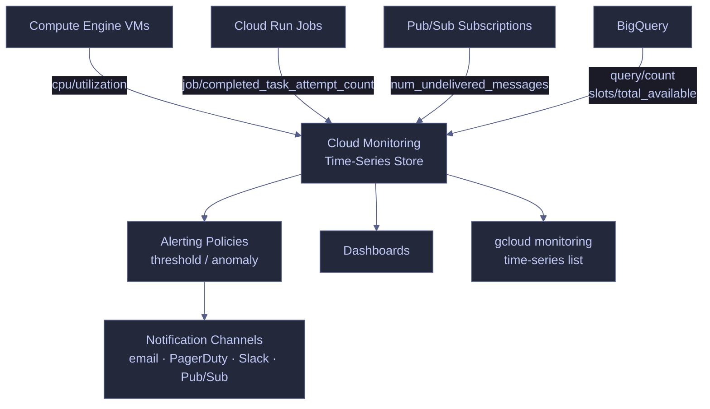

# Cloud Monitoring — Metrics and Alerts

> [!quote]
> "Metrics without context are just numbers. Cloud Monitoring's value is correlating CPU, memory, and I/O time series with the specific job or query that caused the spike."
>
> — **Liz Fong-Jones**, observability advocate

Cloud Monitoring captures time-series metrics for every GCP resource. When your VM's CPU spikes, when a Cloud Run job fails repeatedly, or when a Pub/Sub subscription is falling behind — Cloud Monitoring has the data. The `gcloud monitoring` commands let you explore available metrics and read historical data from the command line, without opening the Cloud Console. This is essential for scripted capacity planning and right-sizing decisions.

> [!info] Prerequisites
> - **API:** Enable `monitoring.googleapis.com` before running any `gcloud monitoring` command.
> - **IAM:** `roles/monitoring.viewer` for read-only metric queries; `roles/monitoring.admin` to create or delete alerting policies.
> - **Project flag:** All commands require `--project=PROJECT_ID` or a configured default project (`gcloud config set project PROJECT_ID`).



## Listing Available Metric Types

Cloud Monitoring exposes thousands of metric types across all GCP services. Use `gcloud monitoring metrics-descriptors list` to discover what is available before constructing a time-series query.

### gcloud | List metric descriptors

#### gcloud monitoring metrics-descriptors list — filter by service prefix

Filter the full metric catalog to the service prefix you are investigating. Without `--filter`, this command returns thousands of entries.

```bash
gcloud monitoring metrics-descriptors list \
  --filter="metric.type:compute.googleapis.com/instance/cpu"
```

```text
NAME                                                  DISPLAY_NAME
compute.googleapis.com/instance/cpu/usage_time        CPU Usage
compute.googleapis.com/instance/cpu/utilization       CPU Utilization
compute.googleapis.com/instance/cpu/reserved_cores    Reserved vCPUs
```

| Flag | Description |
|---|---|
| `--filter` | Restrict results by metric type prefix (e.g., `metric.type:run.googleapis.com`) |
| `--format` | Output format: `table`, `json`, `yaml`, `value(type)` |
| `--page-size` | Number of results per page (default: 100) |

## Reading Time-Series Data

`gcloud monitoring time-series list` queries historical metric data for a resource. Pair it with `--interval-start-time` and `--format` to extract the values you need for capacity planning or incident investigation.

### gcloud | VM CPU Utilization

Use these queries before any VM resize decision to establish actual peak and baseline load.

#### gcloud monitoring time-series list — 24-hour CPU utilization

Retrieves all CPU utilization data points for a named VM over the past 24 hours. The `resource.labels.instance_id` value must match the instance name exactly.

```bash
gcloud monitoring time-series list \
  --filter='metric.type="compute.googleapis.com/instance/cpu/utilization" AND resource.labels.instance_id="data-pipeline-sql"' \
  --interval-start-time="$(date -u -d '1 day ago' +%Y-%m-%dT%H:%M:%SZ)" \
  --format="value(points.value.doubleValue)"
```

```text
0.12340567
0.13450123
0.09876543
```

#### gcloud monitoring time-series list — peak CPU over 7 days

Pipes output through `sort -n | tail -5` to surface only the top five highest-utilization data points from the last week. Values are expressed as decimals (0.30 = 30%).

```bash
gcloud monitoring time-series list \
  --filter='metric.type="compute.googleapis.com/instance/cpu/utilization"
            AND resource.labels.instance_id="data-pipeline-sql"' \
  --interval-start-time="$(date -u -d '7 days ago' +%Y-%m-%dT%H:%M:%SZ)" \
  --format="value(points.value.doubleValue)" | sort -n | tail -5
```

```text
0.28904312
0.29103456
0.30120987
0.31230000
0.33456789
```

> [!tip] Right-Sizing VMs with Metrics
>
> If the top 5 data points from the last 7 days are all below 0.30 (30%), the VM is over-provisioned. Pull this data before any resize decision. See [vm-lifecycle](https://alp78.github.io/elysium/06-GCP/Compute/vm-lifecycle) for the full right-sizing workflow.

| Flag | Description |
|---|---|
| `--filter` | MQL-style filter; combine `metric.type` and `resource.labels` with `AND` |
| `--interval-start-time` | ISO 8601 start time for the query window |
| `--interval-end-time` | ISO 8601 end time (defaults to now if omitted) |
| `--format` | `value(...)` extracts specific fields; `json` returns the full payload |
| `--aggregation` | Reduce data points across the window (e.g., `REDUCE_MAX`, `REDUCE_MEAN`) |

## Key Metrics for Data Engineers

The following metric types cover the most common monitoring needs across Compute Engine, Cloud Run, Pub/Sub, and BigQuery.

| Metric | Description |
|---|---|
| `compute.googleapis.com/instance/cpu/utilization` | VM CPU % |
| `compute.googleapis.com/instance/disk/read_bytes_count` | Disk read throughput |
| `compute.googleapis.com/instance/disk/write_bytes_count` | Disk write throughput |
| `compute.googleapis.com/instance/network/received_bytes_count` | Network in |
| `run.googleapis.com/job/completed_task_attempt_count` | Cloud Run job completions |
| `pubsub.googleapis.com/subscription/num_undelivered_messages` | Pub/Sub backlog |
| `bigquery.googleapis.com/query/count` | BigQuery query count |
| `bigquery.googleapis.com/slots/total_available` | BigQuery slot usage |

## Metrics vs Logs

Choose your observability signal based on what you are trying to answer.

| Signal type | Tool | Best for |
|---|---|---|
| Metrics (numeric, aggregated) | Cloud Monitoring | Trends, capacity planning, alerting thresholds, right-sizing |
| Logs (text, events) | [Cloud Logging](https://alp78.github.io/elysium/06-GCP/Logging/cloud-logging) | Root cause analysis, debugging failures, finding specific errors |

Metrics tell you *how much* and *when* — they are aggregated numbers over time. Logs tell you *what happened* — they are discrete events with full context. Senior engineers use both together: metrics surface anomalies, logs explain them.

## Common Monitoring Patterns

Use these patterns as ad-hoc checks during incident response or pipeline health reviews.

### gcloud | Pub/Sub Backlog

#### gcloud monitoring time-series list — subscription undelivered messages

A rising `num_undelivered_messages` count indicates the consumer is falling behind. Query over the last hour to detect a lag spike.

```bash
gcloud monitoring time-series list \
  --filter='metric.type="pubsub.googleapis.com/subscription/num_undelivered_messages" AND resource.labels.subscription_id="pipeline-sub"' \
  --interval-start-time="$(date -u -d '1 hour ago' +%Y-%m-%dT%H:%M:%SZ)" \
  --format="value(points.value.int64Value)"
```

```text
1024
1087
1142
```

### gcloud | Cloud Run Job Completion Rate

#### gcloud monitoring time-series list — completed task attempt count

Filter by the `result` label to distinguish successful from failed task attempts. A growing `failed` count indicates a recurring pipeline error.

```bash
gcloud monitoring time-series list \
  --filter='metric.type="run.googleapis.com/job/completed_task_attempt_count"' \
  --interval-start-time="$(date -u -d '1 day ago' +%Y-%m-%dT%H:%M:%SZ)" \
  --format="value(metric.labels.result,points.value.int64Value)"
```

```text
succeeded;42
failed;3
```

## Alerting Policies

Alerting policies define the conditions under which Cloud Monitoring fires a notification. Use the Cloud Console or Terraform for initial setup; use `gcloud` for scripted inspection and export.

While `gcloud monitoring` CLI commands are used for ad-hoc queries, alerting policies are best configured through the Cloud Console or Terraform. The Cloud Console's alerting UI supports:
- Threshold conditions on any metric (e.g., CPU > 80% for 5 minutes)
- Anomaly detection for unusual metric spikes
- Notification channels (email, PagerDuty, Slack, Pub/Sub)
- SLO-based alerting for error rates and latency

> [!warning] Custom Metrics Pricing
>
> GCP-native metrics (Compute Engine, Cloud Run, BigQuery) are free to collect and query. Custom metrics — emitted from application code or Ops Agent — are billed at $0.01 per metric per month for each time series beyond the free tier (150 MiB/month ingestion). Design custom metric cardinality carefully to avoid runaway costs.

## Related

- [cloud-logging](https://alp78.github.io/elysium/06-GCP/Logging/cloud-logging) — Logs complement metrics for full observability; use both during incident response
- [vm-lifecycle](https://alp78.github.io/elysium/06-GCP/Compute/vm-lifecycle) — Metric-driven right-sizing decisions for Compute Engine VMs
- [cloud-run-jobs-vs-services](https://alp78.github.io/elysium/06-GCP/Serverless/cloud-run-jobs-vs-services) — Monitor `run.googleapis.com/job/completed_task_attempt_count` for pipeline success rates
- [pubsub-messaging](https://alp78.github.io/elysium/06-GCP/Serverless/pubsub-messaging) — `pubsub.googleapis.com/subscription/num_undelivered_messages` detects pipeline lag
- [dataset-and-table-management](https://alp78.github.io/elysium/06-GCP/BigQuery/dataset-and-table-management) — BigQuery slot utilization metrics for capacity planning
- [GCP-Native Observability](https://alp78.github.io/elysium/13-Observability/GCP-Native) — Deeper monitoring coverage: Ops Agent, log-based metrics, uptime checks
- [Terraform GCP Resources](https://alp78.github.io/elysium/07-Terraform) — Provision alerting policies and notification channels as code

## References

- [Cloud Monitoring metrics list](https://cloud.google.com/monitoring/api/metrics_gcp)
- [gcloud monitoring time-series reference](https://cloud.google.com/sdk/gcloud/reference/monitoring/time-series/list)
- [Creating alerting policies](https://cloud.google.com/monitoring/alerts/using-alerting-ui)
