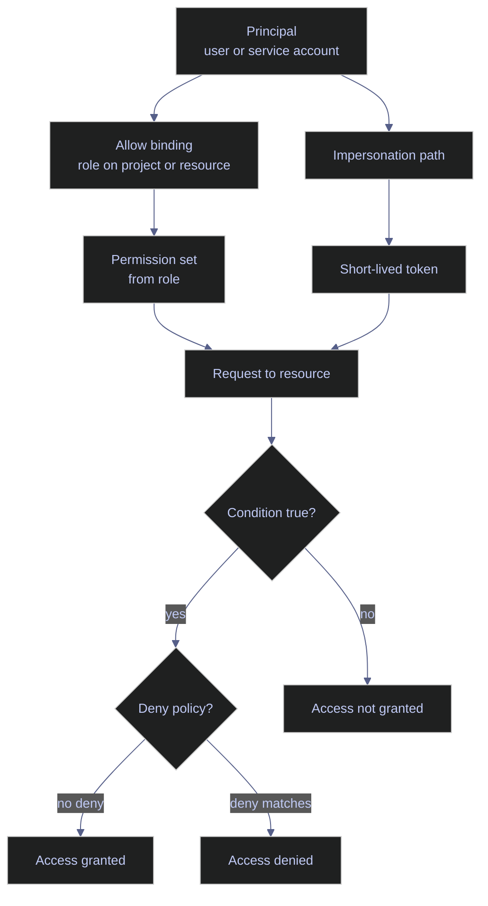

# Service Accounts and IAM

> [!abstract]- Summary
>
> Covers the service-account and IAM control plane for `bq-wh-nb`, including service-account lifecycle, project and resource bindings, custom roles, conditional access, impersonation, policy analysis, and the current deny-policy and principal-access-boundary limits in this project-only environment.
>
> **Scope and live context**
> - Work from the live project `bq-wh-nb`, using outputs captured on April 13, 2026
> - The capture session included one active GitHub Actions Workload Identity Federation path, two user-managed keys on `bq-wh-sa`, and a disposable lab principal `codex-sec-lab-260413@bq-wh-nb.iam.gserviceaccount.com` created to validate lifecycle, impersonation, and troubleshooting workflows
>
> **Service accounts and keys**
> - Inspect existing service accounts, describe high-privilege identities, and distinguish Google-managed key rotation from risky long-lived user-managed keys
> - Create, disable, re-enable, and clean up disposable service accounts to validate safe machine-identity lifecycle operations
>
> **Project bindings and conditional access**
> - Create a project-scoped custom role, lint and apply a time-based conditional binding, and validate its effect with Cloud Asset analysis and Policy Troubleshooter
> - Distinguish project-scope grants, resource-scope grants, and higher-order controls such as deny policies and principal-side boundaries
>
> **Impersonation and secret-scope IAM**
> - Grant `roles/iam.serviceAccountTokenCreator`, mint short-lived impersonated tokens, and prove the split between project-scope metadata visibility and secret-scope payload access
> - Prefer impersonation, metadata-backed credentials, or Workload Identity Federation instead of downloadable JSON keys
>
> **Modern guardrails**
> - Inspect the current Policy Intelligence simulation surface and show that the live local `simulate` commands target Organization Policy rather than project-level IAM allow-policy dry runs
> - Demonstrate why deny policies and PAB policies are conceptually relevant but not fully authorable from this project boundary because the required scope and permissions are absent
>
> **Operations and safety**
> - Warnings: wrong-principal failures often look like generic auth errors, conditional bindings can expire silently, user-managed keys are long-lived bearer credentials, and deny or PAB controls can be unavailable even when the CLI surface exists
> - Recommendations table: the data-engineering scenarios table maps common deployment and operations cases to the correct IAM pattern, and the quick-reference table summarizes which controls are live, conceptual, or intentionally temporary in `bq-wh-nb`
> - Troubleshooting: 5 failure modes covering impersonation denial, expired conditions, secret metadata versus payload mismatches, high-blast-radius service accounts, and deny-policy authoring limits

> [!note]- Glossary
>
> **IAM**
> - Google Cloud Identity and Access Management, the policy system that decides whether a principal can use a permission on a resource.
> - It matters because almost every BigQuery, Cloud Storage, Secret Manager, Cloud Run, and impersonation action in this note succeeds or fails at the IAM layer first.
>
> > [!info] Authorization, not authentication
> >
> > IAM answers "are you allowed?" after an identity is established. A valid login alone does not grant resource access.
>
> ---
>
> **principal**
> - The acting identity in an authorization decision, such as a user, group, service account, workforce identity, or workload identity.
> - It matters because every IAM evaluation starts by identifying exactly which principal is making the request.
>
> > [!warning] Identity mix-ups mislead debugging
> >
> > Many "auth failures" are really wrong-principal failures. If the runtime principal is different from the one you intended, every role audit can point to the wrong target.
>
> ---
>
> **permission**
> - The smallest IAM authorization unit checked by Google Cloud APIs, such as `resourcemanager.projects.get` or `secretmanager.versions.access`.
> - It matters because policies, troubleshooting tools, and custom roles all resolve down to concrete permissions at request time.
>
> > [!info] APIs check permissions directly
> >
> > Roles are only a packaging layer. The API decision ultimately evaluates the individual permission, not the role name you remember.
>
> ---
>
> **role**
> - A named bundle of permissions that can be granted to one or more principals.
> - It matters because least-privilege design in this note is expressed through predefined roles, custom roles, and narrow resource-scope grants.
>
> > [!warning] Broad roles hide blast radius
> >
> > Basic and overly broad predefined roles are convenient, but they make it hard to reason about what a machine identity can actually do in production.
>
> ---
>
> **binding**
> - The policy statement that attaches a role to a principal on a specific resource.
> - It matters because bindings are the effective authorization edges that turn abstract roles into live access.
>
> > [!info] Role plus scope matters
> >
> > The same role granted at different resource levels has very different consequences. A project-level binding is not equivalent to a secret-level or bucket-level binding.
>
> ---
>
> **allow policy**
> - The standard IAM policy surface that grants roles to principals on projects and other resources.
> - It matters because most of the note's live changes are ordinary allow-policy updates rather than hard-deny controls.
>
> > [!info] Multiple grants can overlap
> >
> > A principal can receive the same effective permission through several allow bindings at different scopes. Troubleshooting often means finding which grant is actually making access possible.
>
> ---
>
> **policy inheritance**
> - The way IAM grants applied at higher levels in the resource hierarchy flow down to child resources unless a stronger control intervenes.
> - It matters because project-level roles often explain access that appears to come from a narrower resource scope.
>
> > [!warning] Inherited access is easy to miss
> >
> > Operators often inspect only the local resource policy and miss inherited roles from a parent scope. That leads to incorrect assumptions about why access still works.
>
> ---
>
> **deny policy**
> - A separate IAM control type that explicitly blocks permissions for selected principals even if allow bindings would otherwise grant them.
> - It matters because deny is the hard guardrail above ordinary grants, and the note shows why it is not currently authorable from this project boundary.
>
> > [!warning] CLI support is not authority
> >
> > Seeing deny-policy commands in the SDK does not mean the current project or principal can create them. Policy family availability and delegated authority are separate things.
>
> ---
>
> **conditional binding**
> - An IAM binding whose effect depends on a CEL expression evaluating to true for the request.
> - It matters because temporary, context-aware access in the note is implemented through time-bound conditions rather than permanent membership changes.
>
> > [!warning] Conditions fail closed
> >
> > When the condition becomes false, the grant disappears immediately without changing the binding membership list. That can look like a sudden unexplained permission loss.
>
> ---
>
> **custom role**
> - A project- or organization-scoped role that you define yourself by choosing a supported permission set.
> - It matters because the note uses a minimal custom role to prove metadata-only access without handing out a broader predefined role.
>
> > [!info] Not every permission is eligible
> >
> > Some permissions, including important administrative ones, cannot be delegated through custom roles at a given scope. Always check support before designing around a custom role.
>
> ---
>
> **service account**
> - A Google-managed machine identity intended for workloads, automation, and cross-service API calls.
> - It matters because service accounts are the primary runtime identities for Cloud Run, Compute Engine, CI/CD, and secret access in this note.
>
> > [!warning] Machine identity can still be dangerous
> >
> > A service account is safer than a user login for automation, but it can still create a major incident path if it has broad roles or leaked credentials.
>
> ---
>
> **service-account key**
> - A downloadable private key file that allows any holder to authenticate as the service account.
> - It matters because the note treats user-managed keys as migration debt and a high-risk exception rather than a recommended runtime pattern.
>
> > [!danger] Keys are portable identity theft
> >
> > A leaked JSON key gives the attacker the service account's identity until the key is deleted. There is no short-lived safety boundary like impersonation or metadata tokens.
>
> ---
>
> **impersonation**
> - A workflow in which one principal asks IAM Credentials to mint a short-lived access token for a target service account.
> - It matters because it is the safest way in this note to test workload identity behavior from a human operator session without creating a key file.
>
> > [!info] Keyless but auditable
> >
> > Impersonation avoids long-lived keys while still preserving the chain back to the human or automation principal that minted the token.
>
> ---
>
> **`roles/iam.serviceAccountTokenCreator`**
> - The role that allows a principal to mint short-lived tokens for a target service account through impersonation.
> - It matters because impersonation fails immediately without this grant on the target service account.
>
> > [!warning] Token creation is powerful
> >
> > Granting token-creator is effectively granting the ability to act as that service account for the token lifetime. It should be assigned narrowly and reviewed carefully.
>
> ---
>
> **Policy Troubleshooter**
> - The Google Cloud service that evaluates whether a principal can use a permission on a resource at a given point in time.
> - It matters because the note uses it to prove whether conditional access is granted, absent, or blocked in the live policy state.
>
> > [!info] Real state, not draft state
> >
> > Troubleshooter explains current policy reality. It is excellent for live debugging, but it does not preview hypothetical future policy changes.
>
> ---
>
> **Policy Simulator**
> - The Policy Intelligence family of simulation tools that preview the effect of some policy changes before enforcement.
> - It matters because the note clarifies that the live CLI simulation surface available here is for Organization Policy, not project-level IAM allow-policy simulation.
>
> > [!warning] Simulation scope is narrower than it sounds
> >
> > "Policy Simulator" is a broad product label, but the commands visible in one environment may only cover specific policy families. Do not assume every IAM change is previewable from the same surface.
>
> ---
>
> **principal access boundary (PAB) policy**
> - An IAM control that limits which resources a principal can ever be eligible to access, regardless of ordinary allow bindings.
> - It matters because it represents the principal-side boundary model discussed in the note, but it depends on organization-level scope that this project does not expose.
>
> > [!info] Organization boundary required
> >
> > PAB is not a project-local feature you can turn on ad hoc. It depends on organization-level objects and bindings, so the absence of a visible organization is a hard blocker.

## Why IAM matters for data engineering

Most platform failures that look like "auth problems" are actually one of four different issues:

- The wrong principal is being used.
- The right principal has the wrong role or scope.
- A conditional binding no longer evaluates to true.
- A higher-order control such as deny, VPC Service Controls, or secret-level IAM blocks the request.

Data engineers hit this constantly: Cloud Run jobs that can write BigQuery but not read a bucket, GitHub Actions that can authenticate through WIF but cannot impersonate the deployment service account, or local scripts that work with user ADC but fail under the production service account. IAM is the decision layer that separates those cases.


## Conceptual Model

The control path below is the minimum model to keep in your head when debugging access:



## Service Accounts and Keys

Service accounts are the machine identities that your pipelines actually run as. The first questions to answer are: which service accounts already exist, which ones are high privilege, and whether any of them still rely on long-lived user-managed keys.

### PowerShell / Linux | gcloud iam service-accounts | inspect service accounts and keys

This subsection validates the current service-account estate and shows the real difference between system-managed keys and user-managed keys.

#### List the current project service accounts

**When to run:** At the start of any IAM review, incident-response triage, or least-privilege cleanup.
**Trigger:** You need to know which machine identities already exist in the project.
**Context:** Read-only command against the IAM API. Requires permission to list service accounts in the project.
**Purpose:** Establish the current machine-identity inventory before changing any bindings.

*List the live service accounts in `bq-wh-nb` with display names and disabled state.*

```bash
gcloud iam service-accounts list \
  --project=bq-wh-nb \
  --format="table(displayName,email,disabled)"
```

```text
DISPLAY NAME                            EMAIL                                                   DISABLED
Pipeline State Writer                   pipeline-state-writer@bq-wh-nb.iam.gserviceaccount.com  False
GitHub Actions (git-lab)                github-actions-sa@bq-wh-nb.iam.gserviceaccount.com      False
Codex Security Lab                      codex-sec-lab-260413@bq-wh-nb.iam.gserviceaccount.com   False
BQ WH SA                                bq-wh-sa@bq-wh-nb.iam.gserviceaccount.com               False
Compute Engine default service account  348557092514-compute@developer.gserviceaccount.com      False
```

The important operational point is that `bq-wh-nb` already has dedicated identities for GitHub Actions and pipeline state writes. That is a healthier pattern than reusing the default Compute Engine service account everywhere.

#### Describe the primary high-privilege service account

**When to run:** Before auditing roles, keys, or impersonation rights on a production service account.
**Trigger:** A workload identity appears central to the project or carries broad permissions.
**Context:** Read-only metadata lookup on a service account resource.
**Purpose:** Capture the stable resource name, unique ID, and client ID for the principal you are about to audit.

*Describe `bq-wh-sa`, the broadest data-platform service account in this project.*

```bash
gcloud iam service-accounts describe \
  bq-wh-sa@bq-wh-nb.iam.gserviceaccount.com \
  --project=bq-wh-nb \
  --format=json
```

```json
{
  "displayName": "BQ WH SA",
  "email": "bq-wh-sa@bq-wh-nb.iam.gserviceaccount.com",
  "etag": "MDEwMjE5MjA=",
  "name": "projects/bq-wh-nb/serviceAccounts/bq-wh-sa@bq-wh-nb.iam.gserviceaccount.com",
  "oauth2ClientId": "108539674431524446365",
  "projectId": "bq-wh-nb",
  "uniqueId": "108539674431524446365"
}
```

This confirms that `bq-wh-sa` is a user-managed service account owned by project `bq-wh-nb`, not a Google-managed service agent.

#### Inspect key risk on a production service account

**When to run:** During any least-privilege review, credential leak investigation, or migration away from JSON key files.
**Trigger:** You need to know whether a service account still has long-lived downloadable credentials.
**Context:** Read-only key inventory lookup on the service account.
**Purpose:** Separate short-lived Google-managed signing keys from user-managed keys that can be copied and leaked.

> [!danger] User-managed keys are long-lived bearer credentials
>
> A user-managed service-account key remains valid until it is explicitly deleted. If it lands in source control, an artifact store, or a chat paste, the attacker holds the same effective identity as the service account.

> [!success] Prefer impersonation, WIF, or metadata-backed tokens
>
> Use `--impersonate-service-account` for operator testing, Workload Identity Federation for external CI/CD, and the metadata server for Cloud Run or GCE. Keep JSON keys as a migration exception, not the steady-state design.

*List the current key inventory on `bq-wh-sa`.*

```bash
gcloud iam service-accounts keys list \
  --iam-account=bq-wh-sa@bq-wh-nb.iam.gserviceaccount.com \
  --project=bq-wh-nb \
  --format="table(keyType,keyOrigin,validAfterTime,validBeforeTime)"
```

```text
KEY_TYPE        KEY_ORIGIN       CREATED_AT            EXPIRES_AT
SYSTEM_MANAGED  GOOGLE_PROVIDED  2026-04-04T07:33:18Z  2026-04-21T07:33:18Z
SYSTEM_MANAGED  GOOGLE_PROVIDED  2026-04-13T07:33:18Z  2026-04-29T07:33:18Z
USER_MANAGED    GOOGLE_PROVIDED  2026-03-22T16:27:38Z  9999-12-31T23:59:59Z
USER_MANAGED    GOOGLE_PROVIDED  2026-04-05T07:34:04Z  9999-12-31T23:59:59Z
```

This is a real risk signal. The two `SYSTEM_MANAGED` rows are normal Google-managed rotation artifacts. The two `USER_MANAGED` rows are the credentials that should be migrated away from.

#### Create, disable, and re-enable a disposable service account

**When to run:** During controlled IAM testing, onboarding of a new workload, or break-glass rehearsal.
**Trigger:** You need a new machine identity with no inherited assumptions and no existing key history.
**Context:** State-changing IAM commands on the project. Requires service-account create, disable, and enable permissions.
**Purpose:** Validate the service-account lifecycle without touching production identities.

*Create the disposable service account used for the rest of the note, then disable and re-enable it.*

```bash
gcloud iam service-accounts create codex-sec-lab-260413 \
  --project=bq-wh-nb \
  --display-name="Codex Security Lab" \
  --description="Disposable security walkthrough principal for April 13 2026"
```

```text
Created service account [codex-sec-lab-260413].
```

```bash
gcloud iam service-accounts disable \
  codex-sec-lab-260413@bq-wh-nb.iam.gserviceaccount.com \
  --project=bq-wh-nb
```

```text
Disabled service account [codex-sec-lab-260413@bq-wh-nb.iam.gserviceaccount.com].
```

```bash
gcloud iam service-accounts enable \
  codex-sec-lab-260413@bq-wh-nb.iam.gserviceaccount.com \
  --project=bq-wh-nb
```

```text
Enabled service account [codex-sec-lab-260413@bq-wh-nb.iam.gserviceaccount.com].
```

Disabling is the safer containment action during an incident because it is reversible and immediate. Deletion is a cleanup or retirement step, not the first response to suspicious activity.

| Flag | Syntax | Description |
|---|---|---|
| `--project` | `--project=bq-wh-nb` | Project that owns the service account resource. |
| `--display-name` | `--display-name="Codex Security Lab"` | Human-readable label shown in Console and `list` output. |
| `--description` | `--description="..."` | Free-text operational purpose for the service account. |
| `--format` | `--format=json` | Restricts output to a machine-readable shape for auditing or scripting. |
| `--iam-account` | `--iam-account=bq-wh-sa@bq-wh-nb.iam.gserviceaccount.com` | Selects the service account whose keys you want to inspect. |

## Project Bindings, Custom Roles, and Conditional Access

Project-level grants are where most over-privilege starts. This section keeps the scope intentionally narrow: one custom role, one conditional predefined role, and live policy-analysis outputs that show how those bindings behave.

### PowerShell / Linux | gcloud iam roles and projects | create and validate least-privilege bindings

This subsection creates a minimal project custom role, validates a time-based IAM condition, grants the lab principal a temporary browser role, and then proves the condition changes the result over time.

#### Create a project-scoped custom role

**When to run:** When no predefined role matches the exact machine permissions you want.
**Trigger:** A service account needs less than a predefined role but more than one isolated permission.
**Context:** State-changing IAM role administration on the project.
**Purpose:** Replace broad predefined roles with a tiny permission set that can be reasoned about.

*Create a custom role that can only read Secret Manager metadata, not secret payloads.*

```bash
gcloud iam roles create codexSecretMetaViewer \
  --project=bq-wh-nb \
  --title="Codex Secret Metadata Viewer" \
  --description="Temporary custom role for secret metadata walkthroughs" \
  --permissions="secretmanager.secrets.get,secretmanager.secrets.list" \
  --stage=GA
```

```text
description: Temporary custom role for secret metadata walkthroughs
etag: BwZPV9LzrWk=
includedPermissions:
- secretmanager.secrets.get
- secretmanager.secrets.list
name: projects/bq-wh-nb/roles/codexSecretMetaViewer
stage: GA
title: Codex Secret Metadata Viewer
Created role [codexSecretMetaViewer].
```

This role is intentionally weak: it can inventory secret containers but cannot read secret values.

#### Lint a temporary conditional binding before adding it

**When to run:** Before applying any IAM condition that could unexpectedly lock out a workload.
**Trigger:** You are about to add time-based or context-aware access.
**Context:** Read-only validation call against the IAM condition linter.
**Purpose:** Catch malformed CEL or unsupported references before changing the project policy.

*Lint the CEL expression used for the temporary browser binding.*

```bash
gcloud alpha iam policies lint-condition \
  --resource-name='//cloudresourcemanager.googleapis.com/projects/bq-wh-nb' \
  --expression='request.time < timestamp("2026-12-31T23:59:59Z")' \
  --title='Expiry2026' \
  --description='Temporary browser access for lab principal' \
  --format=json
```

```text
{}
```

The empty JSON object means the linter found no issues with this expression in the project context.

#### Add project bindings to the lab principal

**When to run:** After the principal exists and the access requirement has been reduced to a minimal role set.
**Trigger:** A new workload needs live access to one project surface.
**Context:** State-changing project IAM policy update.
**Purpose:** Grant the lab principal one small custom role and one temporary predefined role.

*Grant the custom role unconditionally and `roles/browser` under a time-bound condition.*

```bash
gcloud projects add-iam-policy-binding bq-wh-nb \
  --member='serviceAccount:codex-sec-lab-260413@bq-wh-nb.iam.gserviceaccount.com' \
  --role='projects/bq-wh-nb/roles/codexSecretMetaViewer' \
  --condition=None
```

```text
Updated IAM policy for project [bq-wh-nb].
```

```bash
gcloud projects add-iam-policy-binding bq-wh-nb \
  --member='serviceAccount:codex-sec-lab-260413@bq-wh-nb.iam.gserviceaccount.com' \
  --role='roles/browser' \
  --condition='expression=request.time < timestamp("2026-12-31T23:59:59Z"),title=Expiry2026,description=Temporary browser access for lab principal'
```

```text
WARNING: Adding binding with condition to a policy without condition will change the behavior of add-iam-policy-binding and remove-iam-policy-binding commands.
Updated IAM policy for project [bq-wh-nb].
```

The custom role handles metadata inventory. The browser role is the temporary project-level read grant that expires on December 31, 2026.

#### Inspect the resulting project bindings for the lab principal

**When to run:** Immediately after any IAM policy change.
**Trigger:** You need to confirm the project policy now contains exactly the intended membership and condition.
**Context:** Read-only IAM policy inspection with filtering.
**Purpose:** Verify that the binding landed with the expected role and condition.

*Filter the project policy down to only the bindings that mention the lab principal.*

```bash
gcloud projects get-iam-policy bq-wh-nb \
  --flatten='bindings[].members' \
  --filter='bindings.members:codex-sec-lab-260413@bq-wh-nb.iam.gserviceaccount.com' \
  --format='table(bindings.role,bindings.condition.title,bindings.condition.expression)'
```

```text
ROLE                                           TITLE       EXPRESSION
projects/bq-wh-nb/roles/codexSecretMetaViewer
roles/browser                                  Expiry2026  request.time < timestamp("2026-12-31T23:59:59Z")
```

This is the exact shape you want after a change: one row for the unconditional custom role and one row for the temporary browser grant.

#### Analyze the effective allow path with Cloud Asset

**When to run:** After a grant exists but before you rely on it in production.
**Trigger:** You want to know which binding is responsible for a permission.
**Context:** Read-only analysis against Cloud Asset Inventory.
**Purpose:** Prove which IAM binding contributes `resourcemanager.projects.get` for the lab principal.

*Ask Cloud Asset which binding explains project-read access for the lab principal.*

```bash
gcloud asset analyze-iam-policy \
  --project=bq-wh-nb \
  --identity='serviceAccount:codex-sec-lab-260413@bq-wh-nb.iam.gserviceaccount.com' \
  --permissions='resourcemanager.projects.get' \
  --format='table(policy.binding.role,policy.binding.condition.title,ACLs.accesses.permission,ACLs.conditionEvaluationValue)'
```

```text
ROLE           TITLE       PERMISSION                          CONDITION_EVALUATION_VALUE
roles/browser  Expiry2026  [['resourcemanager.projects.get']]  ['CONDITIONAL']
Your analysis request is fully explored. The ACLs matching your requests are listed per IAM policy binding, so there could be duplications.
```

Cloud Asset correctly points to the conditional browser binding. That is the binding that currently makes project metadata readable.

#### Troubleshoot the permission before and after the expiry time

**When to run:** Before cutover, before an expiration window ends, or whenever a conditional binding is suspected.
**Trigger:** A workload has a conditional grant and you need to know whether the condition evaluates to true right now.
**Context:** Read-only call to Policy Troubleshooter.
**Purpose:** Show that the same binding grants access on April 13, 2026 and stops granting access after January 1, 2027.

*Troubleshoot the project-read permission while the condition is still true.*

```bash
gcloud policy-intelligence troubleshoot-policy iam \
  //cloudresourcemanager.googleapis.com/projects/bq-wh-nb \
  --principal-email=codex-sec-lab-260413@bq-wh-nb.iam.gserviceaccount.com \
  --permission=resourcemanager.projects.get \
  --request-time='2026-04-13T12:00:00Z' \
  --format='yaml(overallAccessState,allowPolicyExplanation.allowAccessState,denyPolicyExplanation.denyAccessState)'
```

```text
allowPolicyExplanation:
  allowAccessState: ALLOW_ACCESS_STATE_GRANTED
denyPolicyExplanation:
  denyAccessState: DENY_ACCESS_STATE_NOT_DENIED
overallAccessState: CAN_ACCESS
```

*Troubleshoot the same permission after the condition has expired.*

```bash
gcloud policy-intelligence troubleshoot-policy iam \
  //cloudresourcemanager.googleapis.com/projects/bq-wh-nb \
  --principal-email=codex-sec-lab-260413@bq-wh-nb.iam.gserviceaccount.com \
  --permission=resourcemanager.projects.get \
  --request-time='2027-01-01T00:00:00Z' \
  --format='yaml(overallAccessState,allowPolicyExplanation.allowAccessState,denyPolicyExplanation.denyAccessState)'
```

```text
allowPolicyExplanation:
  allowAccessState: ALLOW_ACCESS_STATE_NOT_GRANTED
denyPolicyExplanation:
  denyAccessState: DENY_ACCESS_STATE_NOT_DENIED
overallAccessState: CANNOT_ACCESS
```

This is the cleanest possible conditional-access proof: same principal, same permission, same resource, different request time, different answer.

| Flag | Syntax | Description |
|---|---|---|
| `--permissions` | `--permissions='secretmanager.secrets.list'` | Permission or permissions to analyze in Cloud Asset. |
| `--identity` | `--identity='serviceAccount:...'` | Principal whose effective access you want to analyze. |
| `--member` | `--member='serviceAccount:...'` | Principal receiving a project binding. |
| `--role` | `--role='roles/browser'` | Predefined or custom role to grant. |
| `--condition` | `--condition='expression=...,title=...,description=...'` | Adds a CEL-based conditional binding. |
| `--condition=None` | `--condition=None` | Explicitly states that the binding is unconditional when the project policy already contains conditional bindings. |
| `--request-time` | `--request-time='2027-01-01T00:00:00Z'` | Forces Troubleshooter to evaluate the binding at a specific timestamp. |
| `--resource-name` | `--resource-name='//cloudresourcemanager.googleapis.com/projects/bq-wh-nb'` | Resource context for linting a condition. |
| `--format` | `--format='yaml(...)'` | Restricts output to only the decision fields you need. |

### PowerShell / Linux | gcloud policy-intelligence simulate | verify the current simulation boundary

The prompt for this chapter called out Policy Simulator explicitly, so it matters to be precise about what the local SDK can simulate here. In this environment the live `simulate` command group is for Organization Policy simulation, not for project-level IAM allow-policy dry runs.

#### Inspect the current Policy Intelligence simulate surface

**When to run:** Before assuming the CLI can preview the exact IAM change you are about to make.
**Trigger:** You want to know whether simulation is available for the policy family you care about.
**Context:** CLI help inspection.
**Purpose:** Distinguish the live simulation surface from the IAM-validation tools that are actually usable in this project.

```bash
gcloud policy-intelligence simulate --help
```

```text
NAME
    gcloud policy-intelligence simulate - simulate changes to organization
        policies

DESCRIPTION
    Simulate changes to organization policies.

COMMANDS
    COMMAND is one of the following:

     orgpolicy
        Understand how changes to organization policies could affect your
        resources.
```

The practical meaning is:

- use condition linting before writing a conditional binding
- use Cloud Asset analysis to see which binding grants a permission
- use Policy Troubleshooter to ask whether access is granted right now
- use the `simulate` family only where Organization Policy simulation is the relevant control surface

## Impersonation and Secret-Scope IAM

Keyless operator testing is the practical bridge between IAM policy review and workload validation. If impersonation works and the workload can only reach the intended resource, the design is usually in good shape.

### PowerShell / Linux | gcloud auth and secrets | validate access through impersonation

This subsection grants the operator short-lived impersonation rights on the lab principal, then proves that the principal can list secret metadata project-wide and read the payload of one secret only because of a secret-scope accessor binding.

#### Grant token-creator on the lab principal to the operator

**When to run:** Before testing a workload identity from your own authenticated session.
**Trigger:** You need a short-lived token for a service account but do not want to download a key file.
**Context:** State-changing IAM policy update on the service account resource itself.
**Purpose:** Authorize the human operator to mint access tokens for the lab principal.

*Grant `roles/iam.serviceAccountTokenCreator` on the lab service account to the current user.*

```bash
gcloud iam service-accounts add-iam-policy-binding \
  codex-sec-lab-260413@bq-wh-nb.iam.gserviceaccount.com \
  --project=bq-wh-nb \
  --member='user:alexper.recovery@gmail.com' \
  --role='roles/iam.serviceAccountTokenCreator'
```

```text
Updated IAM policy for serviceAccount [codex-sec-lab-260413@bq-wh-nb.iam.gserviceaccount.com].
```

*Read the service-account IAM policy back and confirm the token-creator grant.*

```bash
gcloud iam service-accounts get-iam-policy \
  codex-sec-lab-260413@bq-wh-nb.iam.gserviceaccount.com \
  --project=bq-wh-nb \
  --format=json
```

```json
{
  "bindings": [
    {
      "members": [
        "user:alexper.recovery@gmail.com"
      ],
      "role": "roles/iam.serviceAccountTokenCreator"
    }
  ],
  "etag": "BwZPV9VD1Yc=",
  "version": 1
}
```

This binding is what makes impersonation possible. Without it, `gcloud auth print-access-token --impersonate-service-account=...` fails immediately.

#### Mint a short-lived token through impersonation

**When to run:** During safe identity testing, CLI-based debugging, or REST API reproduction.
**Trigger:** You need to prove that you can authenticate as the service account without exporting a key.
**Context:** Read-only token-minting call through IAM Credentials.
**Purpose:** Demonstrate the keyless authentication path for the lab principal.

*Print an impersonated OAuth token for the lab principal.*

```bash
gcloud auth print-access-token \
  --impersonate-service-account=codex-sec-lab-260413@bq-wh-nb.iam.gserviceaccount.com
```

```text
ya29.c.c0AZ4bNpYV_7mbGBvxXimByD4p5WPRPX5qRNHpE_...[redacted]...2e6v-8g6dXXoip
WARNING: This command is using service account impersonation. All API calls will be executed as [codex-sec-lab-260413@bq-wh-nb.iam.gserviceaccount.com].
```

The warning is important: the token belongs to the service account, but the audit trail still points back to the impersonating user.

#### Prove project-scope metadata access and secret-scope payload access

**When to run:** After the service account has both project-scope and resource-scope grants.
**Trigger:** You need to prove that the principal can see what it should see and nothing more.
**Context:** The first command relies on the custom project role plus the temporary browser role. The second relies on `roles/secretmanager.secretAccessor` at secret scope.
**Purpose:** Validate least privilege with a real secret list and a real secret read.

*List secrets as the lab principal.*

```bash
gcloud secrets list \
  --project=bq-wh-nb \
  --limit=5 \
  --format='table(name)' \
  --impersonate-service-account=codex-sec-lab-260413@bq-wh-nb.iam.gserviceaccount.com
```

```text
NAME
codex-api-token-260413
WARNING: This command is using service account impersonation. All API calls will be executed as [codex-sec-lab-260413@bq-wh-nb.iam.gserviceaccount.com].
```

*Read the current version of the secret payload as the lab principal.*

```bash
gcloud secrets versions access current \
  --secret=codex-api-token-260413 \
  --project=bq-wh-nb \
  --impersonate-service-account=codex-sec-lab-260413@bq-wh-nb.iam.gserviceaccount.com
```

```text
ghp_codex_v2_20260413
WARNING: This command is using service account impersonation. All API calls will be executed as [codex-sec-lab-260413@bq-wh-nb.iam.gserviceaccount.com].
```

This is the intended split:

- The project custom role lets the principal enumerate secret containers.
- The secret-level accessor role lets the principal read exactly one secret's payload.

| Flag | Syntax | Description |
|---|---|---|
| `--impersonate-service-account` | `--impersonate-service-account=codex-sec-lab-260413@bq-wh-nb.iam.gserviceaccount.com` | Runs the command with a short-lived token for the target service account. |
| `--limit` | `--limit=5` | Restricts list output while validating access. |
| `--secret` | `--secret=codex-api-token-260413` | Chooses the secret whose version you want to access. |
| `--project` | `--project=bq-wh-nb` | Project context for Secret Manager and IAM calls. |
| `--format` | `--format='table(name)'` | Keeps the output focused on the access proof rather than full metadata. |

## Modern Guardrails: Deny Policies and Principal Access Boundary Policies

Deny policies and PAB policies are now core parts of the Google Cloud authorization model, but they sit above ordinary project allow bindings. The important distinction for this environment is that the CLI surface exists locally, while the control-plane authority needed to apply those policies does not.

### PowerShell / Linux | gcloud iam policies | inspect deny-policy support at the current project boundary

This subsection shows the difference between "the command exists" and "the environment can author the policy."

#### List current deny policies attached to the project

**When to run:** Before assuming a permission is blocked only by allow policy.
**Trigger:** You are auditing a project for higher-order IAM guardrails.
**Context:** Read-only deny-policy inventory on the project attachment point.
**Purpose:** Determine whether any explicit deny policies already apply to this project.

*List deny policies attached to project number `348557092514`.*

```bash
gcloud iam policies list \
  --attachment-point='cloudresourcemanager.googleapis.com/projects/348557092514' \
  --kind=denypolicies \
  --format=yaml
```

```text
{}
```

There are no deny policies currently attached to this project.

#### Attempt project-scope deny-policy creation

**When to run:** When you need to verify whether project-scope deny administration is actually available to the current principal.
**Trigger:** You want to block a dangerous permission even if an allow binding grants it.
**Context:** State-changing deny-policy create attempt on the project attachment point.
**Purpose:** Validate whether this environment can author deny policies at project scope.

*Attempt to create a deny policy that would block secret reads for the disposable lab principal.*

```bash
gcloud iam policies create deny-codex-secret-read \
  --attachment-point='cloudresourcemanager.googleapis.com/projects/348557092514' \
  --kind=denypolicies \
  --policy-file='deny-secret-access.json'
```

```text
ERROR: (gcloud.iam.policies.create) [alexper.recovery@gmail.com] does not have permission to access policies instance [cloudresourcemanager.googleapis.com%252Fprojects%252F348557092514] (or it may not exist): Permission iam.googleapis.com/denypolicies.create denied on resource cloudresourcemanager.googleapis.com/projects/348557092514.
```

The practical result is clear: deny-policy authoring is not available from the current project-only authority surface in `bq-wh-nb`.

#### Check whether deny-policy creation can be delegated through a custom role

**When to run:** After a deny-policy create attempt fails and you need to know whether a custom role could close the gap.
**Trigger:** The current principal lacks `iam.denypolicies.create`.
**Context:** Read-only permission capability check.
**Purpose:** Determine whether `iam.denypolicies.create` is eligible for project custom roles in this environment.

*Query the permission metadata for `iam.denypolicies.create` on this project resource.*

```bash
gcloud alpha iam list-testable-permissions \
  //cloudresourcemanager.googleapis.com/projects/bq-wh-nb \
  --filter='name=iam.denypolicies.create' \
  --format='table(name,stage,customRolesSupportLevel)'
```

```text
NAME                     STAGE  CUSTOM_ROLES_SUPPORT_LEVEL
iam.denypolicies.create  GA     NOT_SUPPORTED
```

This explains why the project cannot self-bootstrap deny authoring through a temporary custom role. The permission is real, but it is not custom-role-delegable at this project scope.

| Flag | Syntax | Description |
|---|---|---|
| `--attachment-point` | `--attachment-point='cloudresourcemanager.googleapis.com/projects/348557092514'` | Resource where the deny policy would attach. |
| `--kind` | `--kind=denypolicies` | Selects the deny-policy policy family. |
| `--policy-file` | `--policy-file='deny-secret-access.json'` | JSON or YAML document that defines the deny rule. |
| `--filter` | `--filter='name=iam.denypolicies.create'` | Restricts testable-permission output to the exact permission you care about. |
| `--format` | `--format='table(...)'` | Keeps the result focused on the capability decision. |

### PowerShell / Linux | gcloud iam principal-access-boundary-policies | understand the organization boundary

PAB policies are not a project-local feature. They depend on organization-level policy objects and organization-level bindings, which this project does not currently expose.

#### Confirm that `bq-wh-nb` has no visible organization parent

**When to run:** Before planning any PAB or VPC Service Controls rollout.
**Trigger:** You are deciding whether a project can host organization-scoped security controls.
**Context:** Read-only organization and project metadata lookup.
**Purpose:** Prove whether this project sits inside an organization that can hold org-scoped controls.

*List visible organizations for the current credentials, then describe the project itself.*

```bash
gcloud organizations list --format=json
```

```json
[]
```

```bash
gcloud projects describe bq-wh-nb --format=json
```

```json
{
  "createTime": "2026-03-22T16:26:19.672Z",
  "lifecycleState": "ACTIVE",
  "name": "BQ Database",
  "projectId": "bq-wh-nb",
  "projectNumber": "348557092514"
}
```

There is no visible organization in the current credential context, and the project metadata shows no parent object. That is the reason PAB remains conceptual here.

> [!info] Live boundary
>
> The local SDK exposes `gcloud iam principal-access-boundary-policies` commands, but those commands require `--organization` and organization-level policy bindings. In this environment, the absence of a visible organization is the blocker, not missing CLI support.

## Recommendations and Production Rules

- Create one service account per workload boundary. GitHub deployment, Cloud Run execution, and state-writing pipelines should not share one broad identity.
- Prefer resource-scope roles over project-scope roles wherever the product supports them: buckets, datasets, secrets, and service accounts are the important examples in this chapter.
- Treat every user-managed key as a migration candidate. The live `bq-wh-sa` inventory shows why: key sprawl is easy to create and easy to forget.
- Lint IAM conditions before adding them, then prove them with Policy Troubleshooter using real request times.
- Use custom roles for metadata-only or narrowly scoped workflows, but remember that some permissions, including `iam.denypolicies.create`, are not custom-role-eligible.
- Use impersonation to test machine identity behavior from an operator session. It gives you a real answer with short-lived credentials and better auditability than a JSON key file.

## Data-Engineering Scenarios

| Scenario | Correct IAM pattern | What to avoid |
|---|---|---|
| GitHub Actions deploys to GCP | WIF provider + `roles/iam.workloadIdentityUser` on one deployment service account | Exporting a JSON key into repository secrets |
| Cloud Run job reads one secret and writes one bucket | Service account with secret-scope accessor on that secret and bucket-scope object role on that bucket | Project-wide `roles/editor` or `roles/storage.admin` |
| Local operator tests a workload identity | `--impersonate-service-account` plus Policy Troubleshooter and Cloud Asset analysis | Downloading a key file to a workstation |
| Temporary analyst access | Time-bound conditional binding with a documented expiry | Permanent project-wide viewer/editor grant |
| Incident response on suspicious machine identity | Disable the service account, review token-creator grants, remove broad bindings, rotate or delete user-managed keys | Deleting the service account first and losing visibility into what it was bound to |

## Troubleshooting and Incident Response

| Symptom | Likely cause | First check | Safe next action |
|---|---|---|---|
| `PERMISSION_DENIED` during impersonation | Missing `roles/iam.serviceAccountTokenCreator` | `gcloud iam service-accounts get-iam-policy` on the target SA | Grant token creator narrowly to the operator or CI identity |
| Permission works yesterday but not today | Conditional binding expired | Policy Troubleshooter with `--request-time` | Extend or replace the conditional binding intentionally |
| Workload can see secret names but not values | Metadata role only, no secret accessor | Secret-level IAM policy and Troubleshooter on `secretmanager.versions.access` | Add `roles/secretmanager.secretAccessor` at secret scope, not project scope |
| Service account suddenly exposes broad blast radius | User-managed keys or broad project roles | `gcloud iam service-accounts keys list` and project IAM filter | Remove unused keys, replace with impersonation/WIF, narrow bindings |
| Deny policy design exists on paper but cannot be applied | Scope or permission boundary issue | `gcloud iam policies create` error and `list-testable-permissions` result | Escalate to the organization-level security admin who can author deny policies |

## Quick Reference

| Control | Layer | Best use | Current live status in `bq-wh-nb` |
|---|---|---|---|
| **Service account** | Identity | One machine identity per workload | In active use |
| **Custom role** | Allow policy | Minimal nonstandard permission bundle | Proven live with `codexSecretMetaViewer` |
| **Conditional binding** | Allow policy | Temporary or context-aware access | Proven live with `Expiry2026` |
| **Impersonation** | Authentication path | Keyless operator and CI testing | Proven live |
| **User-managed key** | Credential material | Migration exception only | Still present on `bq-wh-sa` |
| **Deny policy** | Hard authorization guardrail | Explicitly block dangerous permissions | CLI available, authoring blocked here |
| **PAB policy** | Principal-side resource boundary | Restrict which resources principals can ever access | Conceptual only here because no visible org scope |

## Related

- [[02-gcp-identity-and-connection-patterns]] - Choose between user auth, service accounts, impersonation, metadata server, and WIF.
- [[03-secrets-management]] - Secret containers, versions, aliases, CMEK, rotation, and secret-scope IAM.
- [[03-gcloud-authentication]] - ADC, credential search order, service-account activation, and WIF credential files.
- [[01-gcp-resource-hierarchy]] - The project boundary where most of these IAM decisions are attached.
- [[05-gcs-buckets-and-lifecycle]] - Bucket IAM and data-lake governance patterns that depend on the identities designed here.

## References

- https://cloud.google.com/iam/docs/service-account-overview
- https://docs.cloud.google.com/iam/docs/troubleshoot-access
- https://docs.cloud.google.com/iam/docs/deny-access
- https://docs.cloud.google.com/iam/docs/principal-access-boundary-policies
- https://cloud.google.com/asset-inventory/docs/analyzing-iam-policies
