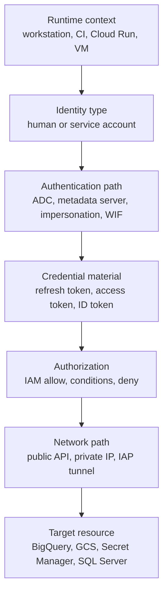

# GCP Identity and Connection Patterns

> [!abstract]- Summary
>
> Covers the decision model for Google Cloud identity and connectivity, separating identity type, authentication path, credential material, runtime attachment, token type, and network path so local development, CI/CD, Cloud Run, GCE, Airflow, and private-service access can use the right trust pattern.
>
> **Scope and live context**
> - Use live examples from `bq-wh-nb`, captured on April 13, 2026, with the active CLI account `alexper.recovery@gmail.com`, local ADC enabled, one GitHub Actions WIF pool and provider, and a disposable impersonation test service account `codex-sec-lab-260413@bq-wh-nb.iam.gserviceaccount.com`
> - Separate identity, authentication, authorization, credential material, runtime attachment, and network path so failures are classified in the correct layer
>
> **Local operator identity**
> - Distinguish `gcloud auth login` from `gcloud auth application-default login`, prove the active CLI account, inspect local SDK config, and verify whether client libraries can mint ADC tokens
> - Treat CLI auth and ADC as separate stores even when both currently resolve to the same human identity
>
> **Service accounts and federation**
> - Inventory project service accounts, inspect the GitHub Actions WIF pool and provider, and prove the repo-level `roles/iam.workloadIdentityUser` narrowing on the deployment service account
> - Treat dedicated machine identities, WIF, and service-account impersonation as the normal path for CI/CD and runtime workloads
>
> **Impersonation and token types**
> - Mint short-lived access tokens for Google APIs and audience-bound ID tokens for identity-aware HTTP receivers, both through service-account impersonation
> - Use the token type that matches the target: Google APIs expect access tokens, while Cloud Run invocations or IAP-protected services often expect ID tokens
>
> **Metadata server and network path**
> - Distinguish runtime-attached metadata-backed credentials from workstation auth, and separate Google API identity success from private-network reachability
> - Use the runtime decision matrix and scenario tables to map local development, Cloud Run, GCE, Airflow, GitHub Actions, and private SQL access to the correct identity and network pattern
>
> **Operations and safety**
> - Warnings: CLI auth does not automatically configure ADC, identity success does not prove network reachability, WIF may still fail at the impersonation binding layer, and the metadata server only exists inside supported Google runtimes
> - Recommendations table: the runtime decision matrix, data-engineering scenarios, and quick-reference table map runtime context, token type, network path, and recommended auth pattern to the right design choice
> - Troubleshooting: 5 failure modes covering CLI-versus-ADC mismatches, missing WIF impersonation grants, private-SQL network failures, testing with the wrong identity, and access-token versus ID-token confusion

> [!note]- Glossary
>
> **human identity**
> - A user account such as `alexper.recovery@gmail.com` used for interactive Google Cloud access through the CLI or Console.
> - It matters because human identities are appropriate for operator workflows but should not be the runtime identity of production automation.
>
> > [!warning] Operators are not workloads
> >
> > A successful operator session proves only that the human account can act. It does not prove that the workload's attached service account has the same access.
>
> ---
>
> **machine identity**
> - A service account used to represent a workload, runtime, or automation path instead of a human user.
> - It matters because Cloud Run, GCE, Airflow workers, and CI/CD should execute under machine identities with narrow attached roles.
>
> > [!info] Identity should match runtime
> >
> > The safest workload design uses a service account that exists specifically for that runtime boundary, not a reused human login or a generic broad admin identity.
>
> ---
>
> **ADC**
> - Application Default Credentials, the client-library credential lookup chain used by Google SDKs and many tools.
> - It matters because local code, Terraform, and language client libraries depend on ADC rather than on the `gcloud` CLI credential store directly.
>
> > [!warning] CLI and ADC are separate
> >
> > `gcloud auth login` can succeed while application code still fails if ADC was never configured. Shared success is common, but it is not guaranteed.
>
> ---
>
> **runtime attachment**
> - The identity physically attached to a compute runtime, such as a Cloud Run service account or a GCE VM service account.
> - It matters because runtime attachment decides what the workload can obtain from the metadata server without local key files.
>
> > [!info] Deployer and runtime differ
> >
> > The human who deploys a service is not necessarily the identity that service uses at runtime. Confusing those roles leads to wrong access assumptions.
>
> ---
>
> **metadata server**
> - A local Google-managed endpoint inside supported runtimes that mints short-lived credentials for the attached service account.
> - It matters because it is the preferred production authentication path for Cloud Run and GCE workloads running inside Google Cloud.
>
> > [!warning] Workstation cannot use it
> >
> > The metadata server exists only inside supported Google runtimes. A laptop or CI environment outside Google Cloud cannot rely on it.
>
> ---
>
> **impersonation**
> - A workflow where one principal mints a short-lived token for a target service account instead of downloading a key file.
> - It matters because it is the safest operator and CI/CD path in this note for testing or using workload identity behavior directly.
>
> > [!info] Best bridge for testing
> >
> > Impersonation gives a production-like IAM answer while preserving auditability and avoiding long-lived credential material on disk.
>
> ---
>
> **access token**
> - A short-lived OAuth 2.0 bearer token used to call Google APIs such as BigQuery, Cloud Storage, and Secret Manager.
> - It matters because most Google API clients and CLI operations ultimately present access tokens to the target service.
>
> > [!warning] Not for every receiver
> >
> > An access token is correct for Google APIs, but it is not the right credential for audience-bound HTTP services that expect an ID token instead.
>
> ---
>
> **ID token**
> - A signed identity token with an audience claim that identifies the intended receiver.
> - It matters because Cloud Run invocations, IAP-protected endpoints, and other identity-aware services often validate audience-bound ID tokens rather than generic API access tokens.
>
> > [!warning] Audience must match
> >
> > An ID token can still be rejected even when it is valid if the `aud` claim does not match what the receiver expects.
>
> ---
>
> **WIF**
> - Workload Identity Federation, where an external identity exchanges an external token for Google credentials without using a JSON key.
> - It matters because it is the recommended identity bridge for GitHub Actions and other external CI/CD systems in this note.
>
> > [!info] Federation is usually not the last step
> >
> > WIF often only gets the external workload into Google identity space. Service-account impersonation usually follows to obtain the actual workload runtime identity.
>
> ---
>
> **credential material**
> - The concrete token or secret used to authenticate, such as a refresh token, access token, ID token, or JSON key file.
> - It matters because the note separates safe short-lived material from dangerous long-lived credentials that persist on disk or in CI secrets.
>
> > [!warning] Persistence creates risk
> >
> > The most dangerous credential is usually the one exported, copied, or forgotten after the workflow ends. Short-lived material reduces that blast radius.
>
> ---
>
> **network path**
> - The transport route a request takes to its target, such as a public Google API endpoint, private VPC route, or IAP tunnel.
> - It matters because correct identity and IAM still do not guarantee that the target is reachable over the network path the workload actually uses.
>
> > [!warning] Auth success is not connectivity success
> >
> > A workload can authenticate perfectly and still fail because the target sits behind a private IP, a firewall rule, IAP, or another unreachable network boundary.
>
> ---
>
> **local ADC**
> - Application Default Credentials configured on a workstation for local client-library and SDK use.
> - It matters because it is the common local-development path for Python, C#, Go, and Terraform when testing against Google APIs.
>
> > [!info] Local convenience, not runtime design
> >
> > Local ADC is useful for development, but it should not be confused with how the workload will authenticate once deployed to Cloud Run or GCE.
>
> ---
>
> **Workload Identity Pool**
> - The IAM resource that groups trusted external identities participating in a federation setup.
> - It matters because the note's GitHub Actions trust path begins at a pool that defines which external workload identities can be considered at all.
>
> > [!info] Pool is the trust boundary
> >
> > The pool defines the external identity universe. Providers and service-account bindings then narrow that universe further.
>
> ---
>
> **OIDC provider**
> - The WIF configuration object that trusts one external OpenID Connect issuer and maps its claims into Google IAM attributes.
> - It matters because the GitHub Actions provider in the note is what turns GitHub-issued identity tokens into a federated Google trust decision.
>
> > [!warning] Claims are policy inputs
> >
> > Provider-side claim mapping and conditions are not incidental metadata. They directly shape which external identities are accepted or rejected.
>
> ---
>
> **IAP tunnel**
> - An Identity-Aware Proxy transport path used to reach private Google Cloud resources such as VMs or internal services without exposing them publicly.
> - It matters because some data-platform flows combine Google API auth with a separate private network access path to reach SQL Server or private hosts.
>
> > [!info] Tunnel and app auth differ
> >
> > Reaching a private host through IAP solves the network path, not the target application's own login model. You may still need SQL, SSH, or HTTP-layer credentials after the tunnel succeeds.

## Why this matters for data engineering

Data platforms almost always combine multiple trust boundaries:

- A local engineer uses the CLI and client libraries.
- A CI/CD system deploys infrastructure and code.
- A Cloud Run job or VM executes data movement.
- A secret store protects database passwords and vendor tokens.
- A private database may require IAP or private VPC routing even when Google API calls do not.

If those layers are not separated clearly, teams end up debugging the wrong thing. A GitHub Actions workflow can authenticate correctly through WIF and still fail because it cannot impersonate the deployment service account. A Cloud Run job can have correct BigQuery IAM and still fail to reach a private SQL Server because the network path is wrong. This note keeps those failure domains separate.


## Conceptual Model



Read the diagram from left to right. A request only succeeds if every stage lines up:

- the runtime uses the intended identity
- the identity gets the correct short-lived token
- IAM grants the needed permission
- the network path can actually reach the target

## Local Human Auth and ADC

The most important local distinction is that `gcloud` CLI auth and ADC are different stores. In this workstation both exist and both resolve to the same human identity, but that is an implementation detail, not a guarantee.

### PowerShell / Linux | gcloud auth and config | inspect the local operator context

This subsection proves what the workstation is authenticated as right now and whether application code can get ADC without a key file.

#### List the active CLI account

Before any operator action that changes IAM, secrets, or infrastructure. It is typically triggered by you need to confirm which human identity the CLI will use. Read-only inspection of the local `gcloud` credential store. Avoid applying changes under the wrong user session.

```bash
gcloud auth list \
  --format='table(account,status)'
```

```text
ACCOUNT                     ACTIVE
alexper.recovery@gmail.com  *
```

This is the `gcloud auth login` side of the world: the CLI is acting as the human user.

#### Read the active project and account from the local SDK config

At the start of any shell session or incident-response console. It is typically triggered by you want to see whether the local SDK context matches the project you intended to touch. Read-only local config lookup. Confirm project, account, and default region in one place.

```bash
gcloud config list \
  --format=json
```

```json
{
  "accessibility": {
    "screen_reader": "False"
  },
  "core": {
    "account": "alexper.recovery@gmail.com",
    "disable_usage_reporting": "False",
    "project": "bq-wh-nb"
  },
  "run": {
    "region": "europe-west1"
  }
}
```

This is local workstation state, not an IAM policy. Changing it affects what the CLI targets, but it does not grant new permissions by itself.

#### Prove that ADC is available for client libraries

Before running Python, C#, Go, or Terraform code that relies on Google client libraries. It is typically triggered by you need to know whether local application code can obtain a token without a service-account key. Read-only token mint from the ADC credential store. Distinguish "the CLI works" from "application code can authenticate.".

```bash
gcloud auth application-default print-access-token
```

```text
ya29.a0Aa7MYi...[redacted]...0209
```

The important result is not the token value itself but the fact that a token was minted successfully. That means local ADC is configured. The practical distinction is:

- `gcloud auth login` feeds CLI commands.
- `gcloud auth application-default login` feeds application code through ADC.

| Flag | Syntax | Description |
|---|---|---|
| `--format` | `--format='table(account,status)'` | Restricts the output shape to the fields you actually need during validation. |

## Service Accounts, WIF, and Project Machine Identity

The project's machine identity layer is the next thing to inspect. In `bq-wh-nb` there are dedicated service accounts for GitHub Actions, pipeline state writes, and the main warehouse runtime account `bq-wh-sa`.

### PowerShell / Linux | gcloud iam workload-identity-pools | inspect service accounts and the GitHub WIF trust chain

This subsection proves which machine identities exist and how the GitHub Actions trust path is restricted.

#### List the current project service accounts

At the start of least-privilege review or service-account cleanup. It is typically triggered by you need an inventory of machine identities already present in the project. Read-only IAM lookup on the project. Identify which principals should be considered runtime identities versus one-off lab principals.

```bash
gcloud iam service-accounts list \
  --project=bq-wh-nb \
  --format='table(displayName,email,disabled)'
```

```text
DISPLAY NAME                            EMAIL                                                   DISABLED
Pipeline State Writer                   pipeline-state-writer@bq-wh-nb.iam.gserviceaccount.com  False
GitHub Actions (git-lab)                github-actions-sa@bq-wh-nb.iam.gserviceaccount.com      False
Codex Security Lab                      codex-sec-lab-260413@bq-wh-nb.iam.gserviceaccount.com   False
BQ WH SA                                bq-wh-sa@bq-wh-nb.iam.gserviceaccount.com               False
Compute Engine default service account  348557092514-compute@developer.gserviceaccount.com      False
```

This confirms the project already uses dedicated service accounts rather than only the default Compute Engine service account.

#### List the current WIF pools

Before reviewing CI/CD access or external workload access. It is typically triggered by you want to confirm whether the project already has federation configured. Read-only IAM lookup on the project's workload-identity-pool collection. Identify external trust boundaries that can authenticate into the project without JSON keys.

```bash
gcloud iam workload-identity-pools list \
  --project=bq-wh-nb \
  --location=global \
  --format='table(name,state,displayName)'
```

```text
NAME                                                                         STATE   DISPLAY_NAME
projects/348557092514/locations/global/workloadIdentityPools/github-actions  ACTIVE  GitHub Actions
```

There is exactly one pool, and it is dedicated to GitHub Actions.

#### Describe the GitHub provider inside the WIF pool

When validating which external OIDC issuer and claims are trusted. It is typically triggered by A repository deployment workflow needs to be audited or debugged. Read-only provider lookup. Show the exact issuer, attribute mapping, and provider-side condition used for GitHub federation.

```bash
gcloud iam workload-identity-pools providers describe github \
  --project=bq-wh-nb \
  --location=global \
  --workload-identity-pool=github-actions \
  --format=json
```

```json
{
  "attributeCondition": "assertion.repository_owner == 'alp78'",
  "attributeMapping": {
    "attribute.actor": "assertion.actor",
    "attribute.repository": "assertion.repository",
    "attribute.repository_owner": "assertion.repository_owner",
    "google.subject": "assertion.sub"
  },
  "displayName": "GitHub",
  "name": "projects/348557092514/locations/global/workloadIdentityPools/github-actions/providers/github",
  "oidc": {
    "issuerUri": "https://token.actions.githubusercontent.com"
  },
  "state": "ACTIVE"
}
```

This shows two independent guardrails:

- the provider only trusts GitHub's OIDC issuer
- the provider condition only allows repositories owned by `alp78`

#### Inspect which repository can impersonate the GitHub Actions service account

After reviewing the provider and before approving repository access. It is typically triggered by you need to know which repository can actually exchange WIF into the target service account. Read-only IAM policy lookup on the service account. Confirm the repo-level trust binding.

```bash
gcloud iam service-accounts get-iam-policy \
  github-actions-sa@bq-wh-nb.iam.gserviceaccount.com \
  --project=bq-wh-nb \
  --format=json
```

```json
{
  "bindings": [
    {
      "members": [
        "principalSet://iam.googleapis.com/projects/348557092514/locations/global/workloadIdentityPools/github-actions/attribute.repository/alp78/git-lab"
      ],
      "role": "roles/iam.workloadIdentityUser"
    }
  ],
  "etag": "BwZPVI5NoOc=",
  "version": 1
}
```

This is narrower than the provider condition. The provider trusts `alp78` as the owner. The service-account binding then narrows actual impersonation to the repository `alp78/git-lab`.

| Flag | Syntax | Description |
|---|---|---|
| `--project` | `--project=bq-wh-nb` | Project that owns the service-account and WIF resources. |
| `--location` | `--location=global` | WIF pools and providers are global in this setup. |
| `--workload-identity-pool` | `--workload-identity-pool=github-actions` | Selects the pool whose provider you want to inspect. |
| `--format` | `--format=json` | Preserves provider conditions and attribute mappings exactly. |

## Impersonation and Token Types

Impersonation is the cleanest operator path when you need to act like a workload. It avoids service-account keys and gives you a short-lived token with an audit trail that still points back to the human operator.

### PowerShell / Linux | gcloud auth | mint short-lived tokens through service-account impersonation

This subsection proves the difference between an access token for Google APIs and an ID token for audience-bound service calls.

#### Mint an access token as the lab service account

Before testing Google API access as a workload identity. It is typically triggered by you need to reproduce workload behavior without exporting a key file. Read-only IAM Credentials token mint. Get a short-lived OAuth 2.0 access token for Google APIs as the target service account.

```bash
gcloud auth print-access-token \
  --impersonate-service-account=codex-sec-lab-260413@bq-wh-nb.iam.gserviceaccount.com
```

```text
ya29.c.c0AZ4bNp...[redacted]...x0nvIl6WW314cVjOFg9SckfQuRf8JZft0ZWSJ3mf-kdjW0ROm9-YrhFwwgcZ-3-6-0ph6esxg4adr8QUy0le-lv3hF
WARNING: This command is using service account impersonation. All API calls will be executed as [codex-sec-lab-260413@bq-wh-nb.iam.gserviceaccount.com].
```

This token is for Google APIs such as BigQuery, Cloud Storage, Secret Manager, and Cloud Resource Manager.

#### Mint an audience-bound ID token as the same service account

Before calling an HTTPS endpoint that validates identity tokens instead of generic Google API access tokens. It is typically triggered by you need a token for Cloud Run invoker-style or IAP-protected HTTP flows. Read-only IAM Credentials token mint. Show the difference between "authenticate to Google APIs" and "authenticate to an audience-bound receiver.".

```bash
gcloud auth print-identity-token \
  --impersonate-service-account=codex-sec-lab-260413@bq-wh-nb.iam.gserviceaccount.com \
  --audiences=https://example.com
```

```text
eyJhbGciOiJSUzI1NiIsImtpZCI6ImIzZDk1Yjk1...[redacted]...v4BL-Q
WARNING: This command is using service account impersonation. All API calls will be executed as [codex-sec-lab-260413@bq-wh-nb.iam.gserviceaccount.com].
```

The operational split is:

- access token: use for Google APIs
- ID token: use for an HTTP receiver that validates an audience claim

| Flag | Syntax | Description |
|---|---|---|
| `--impersonate-service-account` | `--impersonate-service-account=codex-sec-lab-260413@bq-wh-nb.iam.gserviceaccount.com` | Tells `gcloud` to mint a short-lived token for the target service account. |
| `--audiences` | `--audiences=https://example.com` | Sets the audience claim for the ID token. |

## Metadata Server and Private Network Paths

The metadata server and IAP are important, but they are runtime-specific. This workstation can prove local auth, WIF, and impersonation directly. It cannot safely demonstrate a GCE metadata token or an IAP tunnel in this note because those require a running Google runtime or a live target behind IAP.

> [!info] Live verified workflow
>
> The live examples above verify:
>
> - human CLI auth
> - local ADC
> - project service-account inventory
> - GitHub WIF trust
> - impersonated access and ID tokens

> [!warning] Important conceptual note not safely executed here
>
> The metadata server only exists inside supported runtimes such as GCE and Cloud Run. IAP tunneling only matters when the target is a private HTTPS or TCP service, such as a private VM or SQL Server host. Those runtime-specific flows are real, but they are not safely reproducible from this workstation-only note without a dedicated live target and network boundary.

For the detailed CLI mechanics behind user auth, ADC, and WIF credential files, see [[03-gcloud-authentication]]. For IAP and private VM access patterns, see the compute chapter notes such as [[02-vm-ssh-and-file-transfer]].

## Runtime Decision Matrix

| Runtime or source | Identity type | Auth path | Credential material | Network path | Default recommendation |
|---|---|---|---|---|---|
| Local developer running `gcloud` | Human identity | `gcloud auth login` | CLI refresh token | Public Google API endpoint | Fine for operator commands, not for workload runtime |
| Local developer running Python or C# | Human identity or impersonated service account | ADC, optionally impersonation | ADC access token | Public Google API endpoint | Prefer ADC plus impersonation over downloading a JSON key |
| Cloud Run job calling BigQuery or Secret Manager | Service account attached to the service | Metadata server | Short-lived access token | Public Google API endpoint | Best default for serverless GCP workloads |
| GCE VM calling Google APIs | Service account attached to the VM | Metadata server | Short-lived access token | Public Google API endpoint | Best default for VM-hosted GCP access |
| GitHub Actions deploying to GCP | External GitHub identity -> service account | WIF plus impersonation | External OIDC token -> short-lived Google token | Public Google API endpoint | Best practice for CI/CD, no JSON key |
| Airflow worker reading Secret Manager then hitting SQL Server | Service account for Google APIs plus database login for SQL | Metadata server or impersonation for Google APIs, DB auth for SQL | Access token for Google APIs plus DB credential | Public Google API endpoint for Google services, private VPC or IAP for SQL | Treat Google auth and SQL auth as separate layers |
| Workstation connecting to a private SQL Server VM | Human identity for tunnel plus SQL login at the DB | `gcloud` auth for IAP, DB auth for SQL | CLI token plus DB credential | IAP tunnel or private network | First debug the tunnel, then debug database auth |

## Data-Engineering Scenarios

| Scenario | Correct pattern | Why it is correct | What usually goes wrong |
|---|---|---|---|
| Local analyst reads BigQuery safely | Human ADC or service-account impersonation | No key file, short-lived token, direct API path | The developer only ran `gcloud auth login`, so client libraries still fail |
| GitHub Actions deploys a Cloud Run job | GitHub OIDC -> WIF provider -> deployment service account | No repository secret key, repo-scoped trust | The repo is missing `roles/iam.workloadIdentityUser` on the service account |
| Cloud Run job reads Secret Manager and writes BigQuery | Attached service account via metadata server | No local credential material, best runtime pattern | The service account has BigQuery roles but not secret-level access |
| Airflow triggers a data load and writes state to GCS | Attached worker identity for Google APIs, separate DB or vendor credential only where required | Keeps Google auth keyless while isolating non-Google secrets | Teams mix Google API auth and downstream database auth into one opaque "credentials" problem |
| Operator tests a workload in production-like conditions | `--impersonate-service-account` | Exact IAM answer without JSON keys | The human user tests with their own broad access and misreads the result |

## Troubleshooting and Incident Response

| Symptom | Layer to suspect first | Fastest live check | Likely fix |
|---|---|---|---|
| `gcloud` works but Python fails | ADC, not CLI auth | `gcloud auth application-default print-access-token` | Run `gcloud auth application-default login` or use impersonation-aware ADC |
| GitHub workflow authenticates but deploy still fails | Service-account impersonation binding | `gcloud iam service-accounts get-iam-policy` on the target service account | Add or narrow `roles/iam.workloadIdentityUser` |
| Cloud Run can call BigQuery but not private SQL | Network path | Check connector, IAP, or private IP routing design | Fix VPC connector, tunnel, or firewall, not IAM |
| Local test succeeds but workload fails in production | Wrong identity | Compare human auth path versus runtime-attached service account | Re-test through impersonation or runtime identity |
| HTTP call returns unauthorized but Google APIs work | Token type mismatch | Check whether the receiver expects an ID token | Use `gcloud auth print-identity-token` or the runtime equivalent |

## Quick Reference

| Need | Use | Avoid |
|---|---|---|
| Operator CLI session | `gcloud auth login` | Assuming it automatically configures ADC |
| Local application code | `gcloud auth application-default login` or impersonation-backed ADC | Downloading a service-account key by default |
| Production workload on GCP | Attached service account plus metadata server | Baking credentials into the image |
| External CI/CD | WIF plus service-account impersonation | JSON keys in repository secrets |
| Exact workload test from a laptop | `--impersonate-service-account` | Testing with a broad human owner role |
| Private VM or SQL access | IAP or private VPC routing | Treating it as only an IAM issue |

## Related

- [[01-service-accounts-and-iam]] - Service-account lifecycle, conditional bindings, impersonation rights, and least-privilege design.
- [[03-secrets-management]] - Secret access patterns for local code, runtime-attached workloads, and CI/CD.
- [[03-gcloud-authentication]] - Detailed CLI and ADC mechanics for user auth, service-account activation, and WIF credential files.
- [[02-vm-ssh-and-file-transfer]] - IAP tunnel and private VM access patterns.
- [[03-cloud-run-jobs-vs-services]] - Runtime-attached service accounts and serverless execution context.

## References

- https://cloud.google.com/docs/authentication/application-default-credentials
- https://cloud.google.com/iam/docs/workload-identity-federation-with-deployment-pipelines
- https://cloud.google.com/iam/docs/service-account-impersonation
- https://cloud.google.com/compute/docs/metadata/overview
