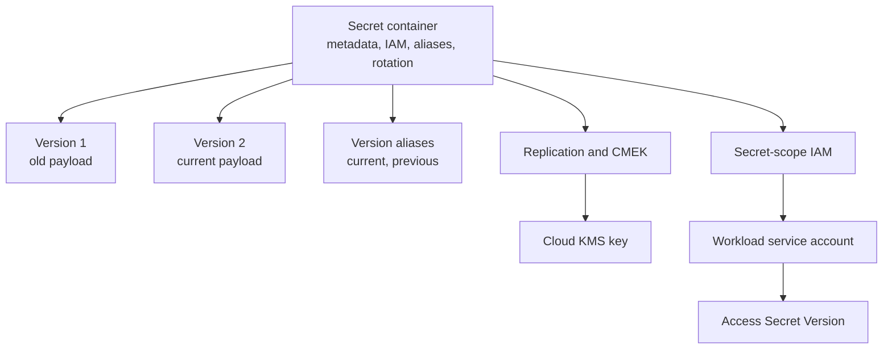

# Secrets Management

> [!abstract]- Summary
>
> Covers Google Cloud Secret Manager as the runtime secret store for `bq-wh-nb`, including secret containers and versions, regional and automatically replicated secrets, aliases, scheduled destruction, CMEK, secret-scope IAM, impersonated access tests, and rotation-safe operating patterns.
>
> **Scope and live context**
> - Use live examples captured on April 13, 2026 from two lab secrets later removed during cleanup: `codex-api-token-260413`, an automatically replicated CMEK-backed secret with aliases and rotation metadata, and `codex-sql-pass-ew1-260413`, a regional secret in `europe-west1`
> - Distinguish what Secret Manager is good for, such as runtime credentials, from what belongs elsewhere, such as large binaries, non-sensitive configuration, or authorization policy itself
>
> **Secret inventory and encryption**
> - Inspect the global secret inventory, describe the automatic secret's labels, aliases, Pub/Sub notifications, rotation metadata, and CMEK key binding, and confirm the Secret Manager service agent can use the KMS key
> - Separate container metadata from version payload state so encryption, IAM, and aliasing are understood as container-level controls over immutable versions
>
> **Regional secrets and endpoint routing**
> - Show the exact failure mode when a regional secret is queried without the Secret Manager regional endpoint override
> - Use `api_endpoint_overrides/secretmanager` for regional operations, then unset it immediately after the required commands so later global calls are not surprised
>
> **Versions, aliases, and rotation**
> - List versions, inspect enabled versus disabled state, use version aliases such as `current` and `previous`, and prove the stale-alias failure mode when an alias still points at a disabled version
> - Treat rotation as add new version, repoint alias, disable old version, and rely on destroy TTL for the recovery window rather than editing payloads in place
>
> **Secret-scope IAM and impersonation**
> - Validate least privilege by attaching `roles/secretmanager.secretAccessor` at the secret container rather than the whole project, then prove access through service-account impersonation and Policy Troubleshooter
> - Keep project-scope metadata visibility separate from payload access so workloads can see only the secrets they actually need to read
>
> **Operations and safety**
> - Warnings: `--location` alone is not enough for regional secret CLI operations, stale aliases can point to disabled versions, CMEK fails if the Secret Manager service agent lacks KMS rights, and immediate destroy removes your rollback path
> - Recommendations table: the data-engineering scenarios table and quick-reference table map Cloud Run, Airflow, GitHub Actions, residency, and rotation requirements to the correct Secret Manager pattern
> - Troubleshooting: 5 failure modes covering missing regional endpoint override, missing secret-scope IAM, stale aliases, missing CMEK KMS access, and premature disable or destroy actions

> [!note]- Glossary
>
> **Secret Manager**
> - Google Cloud's managed secret store for versioned sensitive values that workloads fetch at runtime.
> - It matters because this note treats Secret Manager as the correct home for runtime credentials without baking them into code, images, or local files.
>
> > [!info] Storage for secrets, not everything
> >
> > Secret Manager is best for small sensitive values. It is not a general-purpose store for arbitrary files, binaries, or non-sensitive configuration.
>
> ---
>
> **secret container**
> - The top-level Secret Manager resource that holds metadata, IAM policy, aliases, replication settings, and rotation controls.
> - It matters because operational controls such as labels, secret-scope IAM, CMEK, and alias definitions all live on the container rather than on one payload version.
>
> > [!info] Container is policy surface
> >
> > The container describes and governs the secret, but it does not directly hold the mutable payload. Versions do that.
>
> ---
>
> **secret version**
> - An immutable payload instance stored inside a secret container.
> - It matters because rotation is performed by adding a new version and repointing consumers rather than editing an existing secret in place.
>
> > [!warning] Rotation creates, it does not edit
> >
> > Once a version exists, its payload is fixed. Safe rotation always means adding a version, not overwriting history.
>
> ---
>
> **automatic replication**
> - Google-managed replication of secret data across Google's infrastructure without a user-selected data region.
> - It matters because it is the simplest default when a secret does not need a strict regional residency boundary.
>
> > [!info] Simpler but not region-bound
> >
> > Automatic replication reduces operational overhead, but it is not the right choice when regulations or architecture require data to remain in one region.
>
> ---
>
> **regional secret**
> - A secret whose storage and control plane are tied to a specific region such as `europe-west1`.
> - It matters because regional residency changes not only where the data lives but also how the CLI must talk to Secret Manager.
>
> > [!warning] Endpoint changes too
> >
> > A regional secret is not just a metadata flag. The CLI must use the matching regional Secret Manager endpoint for many operational commands.
>
> ---
>
> **version alias**
> - A named pointer such as `current` or `previous` that resolves to a concrete secret version number.
> - It matters because aliases let applications target stable names during rotation instead of hardcoding numeric version IDs.
>
> > [!warning] Alias can point to dead state
> >
> > An alias is only as safe as the version it references. If it still points to a disabled version, applications fail even though the alias itself exists.
>
> ---
>
> **CMEK**
> - A customer-managed Cloud KMS key used by Secret Manager to encrypt and decrypt secret payloads.
> - It matters because CMEK gives the project explicit control over the encryption key lifecycle rather than relying only on Google-managed encryption.
>
> > [!warning] Key ownership adds dependency
> >
> > CMEK strengthens control, but it also introduces one more dependency that must stay correctly permissioned and operational for secret access to work.
>
> ---
>
> **service agent**
> - A Google-managed service account used internally by a Google service to act on your project's behalf.
> - It matters because Secret Manager's service agent must be able to use the KMS key whenever CMEK protects a secret.
>
> > [!info] Not your workload identity
> >
> > A service agent is neither a human user nor your application's service account. It is the internal identity the Google service itself uses for control-plane operations.
>
> ---
>
> **secret-scope IAM**
> - IAM bindings attached to one secret container instead of to the whole project.
> - It matters because secret-scope access is the least-privilege pattern for letting one workload read one secret without exposing every secret in the project.
>
> > [!warning] Project-wide access is usually too broad
> >
> > Granting accessor roles at project scope is easy, but it widens blast radius across every secret. Use container-level bindings whenever the workload scope is narrow.
>
> ---
>
> **version destroy TTL**
> - The delay between disabling a secret version and its permanent destruction.
> - It matters because this recovery window makes it possible to reverse a bad rotation or accidental disable before the payload is irretrievably gone.
>
> > [!info] Delay is not a runbook
> >
> > A destroy window buys time, but it does not replace documented rotation and rollback procedures. You still need to know what to restore and when.
>
> ---
>
> **annotation**
> - Free-form key-value metadata attached to a secret for operator context and ownership hints.
> - It matters because annotations help humans understand who owns a secret and what system consumes it without changing its access model.
>
> > [!info] Metadata, not policy
> >
> > Annotations improve operational clarity, but they do not grant or restrict access. Treat them as documentation fields rather than control mechanisms.
>
> ---
>
> **regional endpoint override**
> - A local `gcloud` configuration change that points Secret Manager commands at a regional API endpoint instead of the default global endpoint.
> - It matters because regional secret operations can fail with confusing argument errors unless the CLI is routed to the correct endpoint first.
>
> > [!warning] Local setting can leak into later work
> >
> > If you leave the endpoint override in place, later global secret commands may behave unexpectedly. Set it only for the regional operation window, then unset it.
>
> ---
>
> **rotation metadata**
> - The secret container metadata that records planned rotation cadence and next rotation time.
> - It matters because rotation is not only a payload change; it is also an operational schedule that should be visible and intentional.
>
> > [!info] Schedule is guidance, not automation by itself
> >
> > Rotation metadata tells operators when rotation should happen. It does not automatically produce a new version unless you pair it with your own automation or runbook.
>
> ---
>
> **Pub/Sub notification topic**
> - A Pub/Sub topic attached to a secret so Secret Manager can emit notifications about relevant secret events.
> - It matters because rotation and lifecycle changes can feed other operational workflows or observability paths through Pub/Sub.
>
> > [!info] Secret events can become workflows
> >
> > Notifications are useful when secret changes should trigger audits, downstream rotation consumers, or operator alerts rather than remaining silent metadata changes.

## Why this matters for data engineering

Secret Manager solves a very specific problem: how to let workloads fetch sensitive values at runtime without hardcoding them into source code, environment files, container images, or CI secrets. It is the right home for:

- database passwords
- API tokens
- vendor credentials
- migration-era service-account keys that have not been eliminated yet

It is not the right home for:

- large binary artifacts
- non-sensitive configuration that belongs in code or environment-specific config files
- authorization policy itself, which belongs in IAM


## Conceptual Model



The control model is simple but strict:

- IAM decides which principal can access the secret.
- the secret container decides which version alias points where.
- KMS decides whether Secret Manager can encrypt and decrypt the payload.

## Secret Inventory and Current State

The first step is to inspect what exists already. In this project the default global endpoint only shows the automatically replicated secret; the regional secret requires a regional endpoint override.

### PowerShell / Linux | gcloud secrets | inspect the current secret inventory

This subsection establishes the current global-secret state and the CMEK relationship used by the automatic secret.

#### List the global secret inventory

At the start of secret review, rotation planning, or incident response. It is typically triggered by you need to see what secret containers are visible on the default Secret Manager endpoint. Read-only Secret Manager inventory lookup. Establish the current set of globally addressed secrets before reviewing versions or IAM.

```bash
gcloud secrets list \
  --project=bq-wh-nb \
  --format='table(name,labels)'
```

```text
NAME                    LABELS
codex-api-token-260413  {'env': 'lab', 'owner': 'codex'}
```

This does not mean the project only has one secret. It means the default endpoint shows the automatically replicated secret. Regional secrets are a separate operational surface.

#### Confirm the Secret Manager service agent used for CMEK

Before wiring Secret Manager to a Cloud KMS key. It is typically triggered by you need to know which Google-managed principal must be granted KMS rights. Service Identity API call. Surface the exact Secret Manager service agent email for the project.

```bash
gcloud beta services identity create \
  --service=secretmanager.googleapis.com \
  --project=bq-wh-nb
```

```text
Service identity created: service-348557092514@gcp-sa-secretmanager.iam.gserviceaccount.com
```

Even when the service agent already exists, this command is useful because it surfaces the exact principal that needs access to the KMS key.

#### Inspect the CMEK-backed automatic secret

Before rotation, alias changes, or secret-scope IAM changes. It is typically triggered by you need to understand the secret's metadata, CMEK key, rotation schedule, and aliases. Read-only secret metadata lookup. Show the full control plane attached to the secret container.

```bash
gcloud secrets describe \
  codex-api-token-260413 \
  --project=bq-wh-nb \
  --format=json
```

```json
{
  "createTime": "2026-04-13T13:59:08.599424Z",
  "etag": "\"164f5800a354b6\"",
  "labels": {
    "env": "lab",
    "owner": "codex"
  },
  "name": "projects/348557092514/secrets/codex-api-token-260413",
  "replication": {
    "automatic": {
      "customerManagedEncryption": {
        "kmsKeyName": "projects/bq-wh-nb/locations/global/keyRings/codex-sec-lab-global/cryptoKeys/secret-cmek-auto"
      }
    }
  },
  "rotation": {
    "nextRotationTime": "2026-05-01T00:00:00Z",
    "rotationPeriod": "2592000s"
  },
  "topics": [
    {
      "name": "projects/bq-wh-nb/topics/codex-sec-rotation-260413"
    }
  ],
  "versionAliases": {
    "current": "2"
  },
  "versionDestroyTtl": "86400s"
}
```

This one object already tells you most of the operational story:

- automatic replication is enabled
- a customer-managed KMS key protects the payload
- rotation metadata exists
- Pub/Sub notifications exist
- alias `current` points to version `2`
- destroyed versions wait one day before permanent destruction

#### Confirm that the Secret Manager service agent can use the KMS key

Immediately after enabling CMEK or when a secret create/access call fails around encryption. It is typically triggered by you need to verify the KMS side of the dependency. Read-only IAM policy lookup on the crypto key. Prove that Secret Manager's service agent has encrypt/decrypt access to the key.

```bash
gcloud kms keys get-iam-policy \
  secret-cmek-auto \
  --project=bq-wh-nb \
  --location=global \
  --keyring=codex-sec-lab-global \
  --format=json
```

```json
{
  "bindings": [
    {
      "members": [
        "serviceAccount:service-348557092514@gcp-sa-secretmanager.iam.gserviceaccount.com"
      ],
      "role": "roles/cloudkms.cryptoKeyEncrypterDecrypter"
    }
  ],
  "etag": "BwZPV-JXyvU=",
  "version": 1
}
```

If this binding is missing, CMEK-backed secret operations fail even when secret IAM is correct.

| Flag | Syntax | Description |
|---|---|---|
| `--project` | `--project=bq-wh-nb` | Project that owns the secret or KMS resource. |
| `--format` | `--format=json` | Preserves nested fields such as replication, rotation, topics, and aliases. |
| `--location` | `--location=global` | KMS location for the automatic-replication key. |
| `--keyring` | `--keyring=codex-sec-lab-global` | KMS key ring that owns the crypto key. |

## Regional Secrets and the Endpoint Override

Regional Secret Manager uses a regional endpoint. The important operational detail is that the CLI does not automatically switch endpoints just because you passed `--location=europe-west1`.

### PowerShell / Linux | gcloud secrets and config | work with a regional secret safely

This subsection shows the exact failure mode without the regional endpoint override, then the successful regional workflow with the override in place.

#### Try to describe the regional secret without the regional endpoint override

Only as a diagnosis step when a regional secret command unexpectedly fails. It is typically triggered by you used `--location` but the command still returned an argument-format error. Read-only regional secret lookup against the default endpoint. Show the exact error that indicates the endpoint override is missing.

```bash
gcloud secrets describe \
  codex-sql-pass-ew1-260413 \
  --project=bq-wh-nb \
  --location=europe-west1 \
  --format=json
```

```text
ERROR: (gcloud.secrets.describe) INVALID_ARGUMENT: The provided Secret ID [projects/bq-wh-nb/locations/europe-west1/secrets/codex-sql-pass-ew1-260413] does not match the expected format [projects/*/secrets/*]
```

This is not an IAM denial. It is a control-plane routing problem.

> [!bug] Regional secret gotcha
>
> `--location=europe-west1` is not enough by itself. The `gcloud` CLI still talks to the default Secret Manager endpoint unless you override `api_endpoint_overrides/secretmanager`.

#### Point the CLI at the regional Secret Manager endpoint

Before regional `list`, `describe`, `versions list`, and similar operational commands. It is typically triggered by you need to operate on regional secrets from the CLI. Local `gcloud` configuration change. Route Secret Manager CLI calls to the correct regional endpoint.

```bash
gcloud config set \
  api_endpoint_overrides/secretmanager \
  https://secretmanager.europe-west1.rep.googleapis.com/
```

```text
Updated property [api_endpoint_overrides/secretmanager].
```

#### List and describe the regional secret

After the regional endpoint override is in place. It is typically triggered by you need to confirm regional secret metadata or inspect version state. Read-only Secret Manager calls against the regional endpoint. Prove that the secret exists and is region-bound to `europe-west1`.

```bash
gcloud secrets list \
  --project=bq-wh-nb \
  --location=europe-west1 \
  --format=json
```

```json
[
  {
    "annotations": {
      "owner": "codex",
      "system": "warehouse"
    },
    "createTime": "2026-04-13T14:00:09.113860Z",
    "etag": "\"164f57e68ec344\"",
    "labels": {
      "env": "lab",
      "tier": "regional"
    },
    "name": "projects/348557092514/locations/europe-west1/secrets/codex-sql-pass-ew1-260413",
    "versionDestroyTtl": "86400s"
  }
]
```

```bash
gcloud secrets describe \
  codex-sql-pass-ew1-260413 \
  --project=bq-wh-nb \
  --location=europe-west1 \
  --format=json
```

```json
{
  "annotations": {
    "owner": "codex",
    "system": "warehouse"
  },
  "createTime": "2026-04-13T14:00:09.113860Z",
  "etag": "\"164f57e68ec344\"",
  "labels": {
    "env": "lab",
    "tier": "regional"
  },
  "name": "projects/348557092514/locations/europe-west1/secrets/codex-sql-pass-ew1-260413",
  "versionDestroyTtl": "86400s"
}
```

The resource name itself proves the regional boundary: `locations/europe-west1/secrets/...`.

#### Return the CLI to the default Secret Manager endpoint

Immediately after a regional secret operation. It is typically triggered by you are done with the regional commands and do not want to surprise later global commands. Local `gcloud` configuration change. Prevent the workstation from accidentally staying pinned to a regional endpoint.

```bash
gcloud config unset api_endpoint_overrides/secretmanager
```

```text
Unset property [api_endpoint_overrides/secretmanager].
```

> [!success] Safe regional workflow
>
> Set the regional endpoint override, run the regional commands you actually need, then unset the override immediately.

## Versions, Aliases, and Rotation State

The core operational problem in Secret Manager is not storing one value. It is evolving the value safely over time while keeping consumers pointed at the correct version.

### PowerShell / Linux | gcloud secrets versions | inspect alias and version state

This subsection shows how alias changes interact with disabled versions and scheduled destruction.

#### List the current versions of the automatic secret

Before any alias move, disable, destroy, or incident-response change. It is typically triggered by you need to know the current version states. Read-only version inventory lookup. Show which versions are enabled, disabled, and scheduled for destruction.

```bash
gcloud secrets versions list \
  codex-api-token-260413 \
  --project=bq-wh-nb \
  --format=json
```

```json
[
  {
    "clientSpecifiedPayloadChecksum": true,
    "createTime": "2026-04-13T14:00:39.677562Z",
    "etag": "\"164f57e860e67a\"",
    "name": "projects/348557092514/secrets/codex-api-token-260413/versions/2",
    "replicationStatus": {
      "automatic": {
        "customerManagedEncryption": {
          "kmsKeyVersionName": "projects/bq-wh-nb/locations/global/keyRings/codex-sec-lab-global/cryptoKeys/secret-cmek-auto/cryptoKeyVersions/1"
        }
      }
    },
    "state": "ENABLED"
  },
  {
    "clientSpecifiedPayloadChecksum": true,
    "createTime": "2026-04-13T13:59:10.968064Z",
    "etag": "\"164f5800b7a43c\"",
    "name": "projects/348557092514/secrets/codex-api-token-260413/versions/1",
    "replicationStatus": {
      "automatic": {
        "customerManagedEncryption": {
          "kmsKeyVersionName": "projects/bq-wh-nb/locations/global/keyRings/codex-sec-lab-global/cryptoKeys/secret-cmek-auto/cryptoKeyVersions/1"
        }
      }
    },
    "scheduledDestroyTime": "2026-04-14T14:07:27.940037675Z",
    "state": "DISABLED"
  }
]
```

This is the healthy rotation picture:

- version `2` is enabled and active
- version `1` is disabled
- version `1` still has a recovery window before permanent destruction

#### Recreate a stale alias and prove the access failure

During alias troubleshooting or runbook validation. It is typically triggered by A consumer still references an alias that points to an old disabled version. Safe metadata change followed by a read attempt. Show what a broken alias looks like in practice.

```bash
gcloud secrets update \
  codex-api-token-260413 \
  --project=bq-wh-nb \
  --update-version-aliases='current=2,previous=1'
```

```text
Updated secret [codex-api-token-260413].
```

```bash
gcloud secrets versions access previous \
  --secret=codex-api-token-260413 \
  --project=bq-wh-nb
```

```text
ERROR: (gcloud.secrets.versions.access) FAILED_PRECONDITION: Secret Version [projects/348557092514/secrets/codex-api-token-260413/versions/1] is in DISABLED state.
```

This is the exact stale-alias failure mode. The alias exists, but it points to a version that is no longer readable.

#### Remove the stale alias and confirm the steady-state metadata

Immediately after confirming the stale alias problem. It is typically triggered by the old alias should no longer be used by any consumer. State-changing secret metadata update, followed by read-only inspection. Return the secret to a clean state where only `current` remains.

```bash
gcloud secrets update \
  codex-api-token-260413 \
  --project=bq-wh-nb \
  --remove-version-aliases='previous'
```

```text
Updated secret [codex-api-token-260413].
```

```bash
gcloud secrets describe \
  codex-api-token-260413 \
  --project=bq-wh-nb \
  --format=json
```

```json
{
  "createTime": "2026-04-13T13:59:08.599424Z",
  "etag": "\"164f5800a354b6\"",
  "labels": {
    "env": "lab",
    "owner": "codex"
  },
  "name": "projects/348557092514/secrets/codex-api-token-260413",
  "replication": {
    "automatic": {
      "customerManagedEncryption": {
        "kmsKeyName": "projects/bq-wh-nb/locations/global/keyRings/codex-sec-lab-global/cryptoKeys/secret-cmek-auto"
      }
    }
  },
  "rotation": {
    "nextRotationTime": "2026-05-01T00:00:00Z",
    "rotationPeriod": "2592000s"
  },
  "topics": [
    {
      "name": "projects/bq-wh-nb/topics/codex-sec-rotation-260413"
    }
  ],
  "versionAliases": {
    "current": "2"
  },
  "versionDestroyTtl": "86400s"
}
```

The container is back in its clean steady state with one active alias.

| Flag | Syntax | Description |
|---|---|---|
| `--update-version-aliases` | `--update-version-aliases='current=2,previous=1'` | Creates or moves aliases to specific versions. |
| `--remove-version-aliases` | `--remove-version-aliases='previous'` | Deletes alias names that should no longer resolve. |
| `--secret` | `--secret=codex-api-token-260413` | Selects the secret whose version will be accessed. |

## Secret-Scope IAM and Impersonated Access

The safest access model is usually:

- project-level metadata visibility only where needed
- secret-level accessor on the specific secret container

### PowerShell / Linux | gcloud secrets and policy-intelligence | validate least-privilege secret access

This subsection proves that the disposable lab service account can read the payload of one secret because of a secret-scope IAM binding, not because of broad project access.

#### Inspect the secret-level IAM policy

Before granting or troubleshooting secret access. It is typically triggered by A workload should read one secret and nothing else. Read-only IAM policy lookup on the secret container. Confirm the binding exists at secret scope.

```bash
gcloud secrets get-iam-policy \
  codex-api-token-260413 \
  --project=bq-wh-nb \
  --format=json
```

```json
{
  "bindings": [
    {
      "members": [
        "serviceAccount:codex-sec-lab-260413@bq-wh-nb.iam.gserviceaccount.com"
      ],
      "role": "roles/secretmanager.secretAccessor"
    }
  ],
  "etag": "BwZPV-pDSR4=",
  "version": 1
}
```

This is the least-privilege pattern. The lab principal can access this secret because the binding is attached here, not to the entire project.

#### List visible secrets as the impersonated lab service account

After granting access and before trusting that the workload can enumerate the intended container. It is typically triggered by you need to validate effective access as the workload identity itself. Secret Manager call executed through service-account impersonation. Confirm the principal can see the target secret.

```bash
gcloud secrets list \
  --project=bq-wh-nb \
  --limit=5 \
  --format='table(name)' \
  --impersonate-service-account=codex-sec-lab-260413@bq-wh-nb.iam.gserviceaccount.com
```

```text
NAME
codex-api-token-260413
WARNING: This command is using service account impersonation. All API calls will be executed as [codex-sec-lab-260413@bq-wh-nb.iam.gserviceaccount.com].
```

#### Read the current secret value as the impersonated lab service account

After the metadata listing succeeds and you need to prove payload access. It is typically triggered by you want a direct end-to-end proof that the binding actually permits version reads. Secret Manager access call executed through service-account impersonation. Validate the exact runtime path a workload would use.

```bash
gcloud secrets versions access current \
  --secret=codex-api-token-260413 \
  --project=bq-wh-nb \
  --impersonate-service-account=codex-sec-lab-260413@bq-wh-nb.iam.gserviceaccount.com
```

```text
ghp_codex_v2_20260413
WARNING: This command is using service account impersonation. All API calls will be executed as [codex-sec-lab-260413@bq-wh-nb.iam.gserviceaccount.com].
```

The value was returned through a short-lived token, not a JSON key file.

#### Troubleshoot the permission against the secret resource

When the caller and the binding look correct but the request still fails. It is typically triggered by you need IAM's current answer for `secretmanager.versions.access`. Read-only Policy Troubleshooter call. Prove whether the secret access path is currently granted or denied.

```bash
gcloud policy-intelligence troubleshoot-policy iam \
  //secretmanager.googleapis.com/projects/348557092514/secrets/codex-api-token-260413 \
  --principal-email=codex-sec-lab-260413@bq-wh-nb.iam.gserviceaccount.com \
  --permission=secretmanager.versions.access \
  --format='yaml(overallAccessState,allowPolicyExplanation.allowAccessState,denyPolicyExplanation.denyAccessState)'
```

```text
allowPolicyExplanation:
  allowAccessState: ALLOW_ACCESS_STATE_GRANTED
denyPolicyExplanation:
  denyAccessState: DENY_ACCESS_STATE_NOT_DENIED
overallAccessState: CAN_ACCESS
```

This is the cleanest proof that access is working for the intended reason.

| Flag | Syntax | Description |
|---|---|---|
| `--impersonate-service-account` | `--impersonate-service-account=codex-sec-lab-260413@bq-wh-nb.iam.gserviceaccount.com` | Runs the command with a short-lived token for the workload identity. |
| `--limit` | `--limit=5` | Keeps list output small during validation. |
| `--permission` | `--permission=secretmanager.versions.access` | Permission whose effective access you want Troubleshooter to evaluate. |

## Production Rules

- Grant `roles/secretmanager.secretAccessor` on the secret container, not at project scope, unless the workload truly must read many secrets.
- Use aliases like `current` to decouple consumers from raw version numbers, but remove stale aliases immediately after rotation.
- Treat regional secrets as a first-class design choice, not an afterthought. Residency requirements affect both API endpoints and runbooks.
- Use CMEK only when the key lifecycle and KMS access model are understood operationally. CMEK without service-agent KMS access is just a broken deployment.
- Prefer runtime fetches through metadata-backed credentials, WIF, or impersonation. Do not copy secret values into repository secrets, local files, or long-lived environment variables unless there is no better option.

## Data-Engineering Scenarios

| Scenario | Correct pattern | Why it works | What to avoid |
|---|---|---|---|
| Cloud Run job reads one API token | Secret-scope accessor on one secret | Keeps blast radius to one container | Project-wide accessor on every secret |
| Airflow needs connection strings and variables | Secret Manager backend with per-secret IAM | Removes sensitive values from the Airflow metadata DB | Storing passwords directly in Airflow connections UI |
| GitHub Actions deploys and reads deployment metadata | WIF for Google auth, Secret Manager only for non-Google secrets if truly needed | Keeps CI keyless for Google access | JSON service-account keys in GitHub secrets |
| Regional workload keeps credentials in `europe-west1` | Regional secret plus regional endpoint operations | Aligns secret residency with the workload and data boundary | Assuming `--location` alone is enough in the CLI |
| Rotating a vendor token after suspected exposure | Add or promote new version, repoint alias, disable old version, watch destroy TTL | Gives a rollback window and clear current-state metadata | Editing a value in place or deleting the only known-good version immediately |

## Troubleshooting and Incident Response

| Symptom | Likely cause | First check | Safe next action |
|---|---|---|---|
| Regional secret commands fail with `INVALID_ARGUMENT` | Missing regional endpoint override | Check `api_endpoint_overrides/secretmanager` | Set the regional endpoint, perform the operation, then unset it |
| Secret access works as a human but not as a workload | Secret-scope IAM missing for the workload principal | `gcloud secrets get-iam-policy` | Add `roles/secretmanager.secretAccessor` on the secret only |
| Alias resolves but access still fails | Alias points to a disabled version | `gcloud secrets versions list` and `describe` | Repoint or remove the alias |
| CMEK-backed secret create/access fails | Secret Manager service agent lacks KMS rights | `gcloud kms keys get-iam-policy` | Grant `roles/cloudkms.cryptoKeyEncrypterDecrypter` to the service agent |
| Secret was disabled or scheduled for destruction too early | Rotation runbook skipped the recovery window | `gcloud secrets versions list` | Stop promoting the broken alias, restore from a surviving version if possible, and rebuild the runbook |

## Quick Reference

| Need | Use | Avoid |
|---|---|---|
| One workload reads one secret | Secret-scope `roles/secretmanager.secretAccessor` | Project-wide accessor if not required |
| Stable consumer reference | Alias such as `current` | Hardcoded version number everywhere |
| Residency boundary | Regional secret plus regional endpoint override | Assuming automatic replication and regional requirements are equivalent |
| Customer key control | Secret Manager CMEK with service-agent KMS grant | Enabling CMEK without validating KMS IAM |
| Rotation safety | Disable old version, keep destroy TTL, then remove stale aliases | Immediate irreversible destroy of the last known-good version |

## Related

- [[01-service-accounts-and-iam]] - Service-account design, impersonation, and least-privilege bindings.
- [[02-gcp-identity-and-connection-patterns]] - How workloads authenticate before they reach Secret Manager.
- [[03-gcloud-authentication]] - ADC, impersonation, and WIF credential mechanics.
- [[03-cloud-run-jobs-vs-services]] - Runtime-attached service accounts and secret delivery into serverless workloads.
- [[01-cloud-logging]] - Audit log queries and access evidence once Secret Manager events are visible in logging.

## References

- https://cloud.google.com/secret-manager/docs/overview
- https://cloud.google.com/secret-manager/regional-secrets/create-regional-secret
- https://cloud.google.com/secret-manager/docs/assign-alias-to-secret-version
- https://cloud.google.com/secret-manager/docs/cmek
- https://cloud.google.com/secret-manager/docs/access-control
