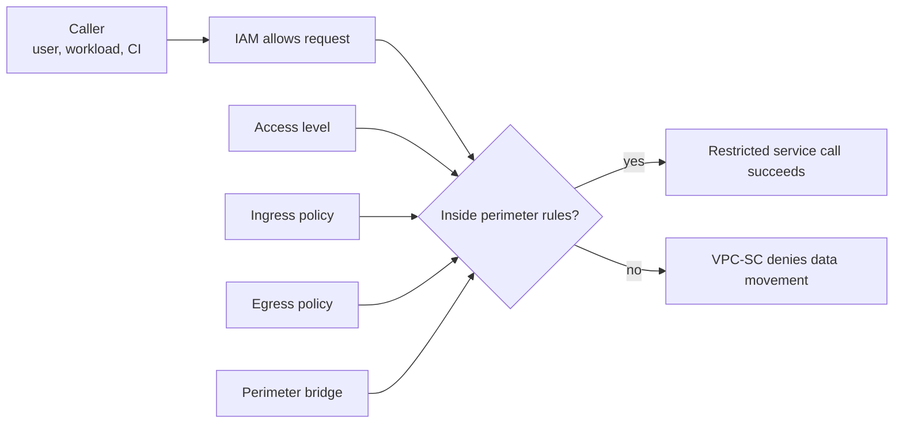

# VPC Service Controls

> [!abstract]- Summary
>
> Covers VPC Service Controls as Google Cloud's data-perimeter layer above IAM, using archived operator evidence from `bq-wh-nb`, including Access Context Manager concepts, supported-service limits, dry-run rollout, bridges, ingress and egress rules, VPC accessible services, audit evidence, and the boundary that prevented real perimeter authoring in that project.
>
> **Scope and archived boundary**
> - Work from the removed project `bq-wh-nb`, where no visible organization parent existed in the captured credential context
> - Separate what was verified there, such as project facts, supported-service checks, CLI surfaces, and logging state, from conceptual workflows that require organization-level Access Context Manager authority
>
> **Control model**
> - Distinguish IAM's answer to "who may call the service" from VPC-SC's answer to "may data cross this perimeter boundary"
> - Use Access Context Manager concepts such as access levels, service perimeters, ingress, egress, dry run, and enforcement to model trusted context and approved data flow
>
> **Supported services and perimeter shapes**
> - Validate supported-service coverage for BigQuery, Cloud Storage, Secret Manager, and Cloud Run Admin, and treat partial-support signals such as `roles/bigquery.admin` as a warning against broad assumptions
> - Distinguish regular perimeters, perimeter bridges, restricted services, and VPC accessible services, and remember that perimeters wrap projects rather than individual buckets or datasets
>
> **Logging and rollout**
> - Query current audit logs for `VpcServiceControlAuditMetadata` and interpret an empty result correctly when no perimeter is deployed
> - Roll out safely by confirming policy boundaries, creating explicit dry-run specs first, observing dry-run evidence across a full workload cycle, then promoting into enforce mode only after exceptions are deliberately modeled
>
> **Data-engineering design patterns**
> - Apply perimeter design to BigQuery extracts, Cloud Storage movement, Airflow orchestration, GitHub Actions deployment paths, Cloud Run workloads, partner delivery, and protected-project-to-protected-project exchange
> - Use bridges, ingress, egress, and internal API restrictions as separate tools rather than flattening every workflow into one oversized perimeter
>
> **Operations and safety**
> - Warnings: no visible organization means no safe perimeter creation here, supported-product coverage is not universal, broad roles can be only partially supported, and enforce mode should never be the first validation step
> - Recommendations table: the data-engineering design-pattern table and quick-reference table map exports, partner exchange, Airflow placement, CI/CD boundaries, and internal API restriction needs to the correct VPC-SC pattern
> - Troubleshooting: 5 failure modes covering IAM-looks-correct-but-export-fails, broken trusted ingress, cross-project protected traffic gaps, dry-run-without-evidence, and unsupported-role assumptions
>
> [!warning] Archived demo boundary
>
> The original project `bq-wh-nb` has been removed. The project metadata, CLI help output, and logging examples in this note are preserved as archived operator reference, and this refresh did not rerun Access Context Manager or Cloud Logging commands against a replacement environment.

> [!note]- Glossary
>
> **VPC Service Controls**
> - Google Cloud's data-perimeter system that restricts how protected data can move across defined service boundaries even when IAM would otherwise permit access.
> - It matters because the note treats VPC-SC as the layer that answers data-exfiltration questions IAM alone cannot solve.
>
> > [!warning] IAM success can still fail here
> >
> > A request can have the correct principal and permission and still be denied by VPC-SC. That is why perimeter incidents often confuse teams that only inspect IAM.
>
> ---
>
> **Access Context Manager**
> - The organization-level control plane that owns access policies, access levels, and service perimeters for VPC-SC.
> - It matters because real VPC-SC administration depends on Access Context Manager authority that is not available in this project-only environment.
>
> > [!warning] Organization scope is mandatory
> >
> > Without a visible organization and the right org-level permissions, the CLI can show VPC-SC surfaces but cannot safely create real perimeter policy.
>
> ---
>
> **access level**
> - A contextual classification of requests based on attributes such as IP range, device posture, or request time.
> - It matters because access levels are how VPC-SC decides which external contexts count as trusted for ingress decisions.
>
> > [!info] Context, not entitlement
> >
> > Access levels do not grant permissions by themselves. They classify request context and are evaluated alongside perimeter policy.
>
> ---
>
> **service perimeter**
> - The main VPC-SC boundary object that encloses projects and restricts data movement for selected Google services.
> - It matters because every real VPC-SC rollout in the note centers on deciding which projects and services belong inside one perimeter.
>
> > [!warning] Perimeter is data-plane control
> >
> > A service perimeter does not replace generic networking or host firewall controls. It governs supported Google service traffic, not every packet on the network.
>
> ---
>
> **dry run**
> - A perimeter specification used to preview the effect of VPC-SC changes before enforcement blocks any traffic.
> - It matters because dry run is the safest rollout stage for learning which legitimate workflows would break under the proposed boundary.
>
> > [!warning] No explicit dry run means no preview signal
> >
> > If you never create an explicit dry-run spec, you do not get meaningful preview-only audit evidence. Teams then lose the safest feedback stage.
>
> ---
>
> **enforce mode**
> - The active perimeter configuration that actually blocks requests crossing disallowed boundaries.
> - It matters because this is the stage where a bad rollout stops real workloads rather than only generating diagnostics.
>
> > [!danger] Enforcement is the blast-radius stage
> >
> > Enforce mode is where design mistakes become outages. It should follow observed dry-run validation, not replace it.
>
> ---
>
> **ingress policy**
> - A perimeter rule that defines which requests from outside the perimeter are allowed to reach protected services inside it.
> - It matters because trusted callers such as CI/CD, partner systems, or orchestrators often sit outside the perimeter and need deliberate entry rules.
>
> > [!warning] Missing ingress blocks good callers too
> >
> > A trusted external principal can still fail if no ingress rule admits its context and target. Correct IAM alone is not enough.
>
> ---
>
> **egress policy**
> - A perimeter rule that defines which requests from inside the perimeter may send data outward.
> - It matters because controlled exports, partner delivery, and cross-project operations often depend on explicit egress approval.
>
> > [!warning] Egress is where exfiltration control lives
> >
> > If the design ignores egress, operators often discover the gap only when exports or integrations fail at runtime. Egress must be modeled intentionally.
>
> ---
>
> **perimeter bridge**
> - A special perimeter type that allows data exchange between projects that already belong to regular service perimeters.
> - It matters because bridges are the safe pattern for controlled exchange between otherwise protected project groups.
>
> > [!info] Bridge is not the main perimeter
> >
> > A bridge complements regular perimeters; it does not replace them. It exists to connect protected zones, not to act as the whole security model.
>
> ---
>
> **restricted services**
> - The Google APIs whose traffic is actually governed by the perimeter boundary.
> - It matters because VPC-SC only protects services that participate in the supported-services model, and design errors often start by assuming that every API is restricted equally.
>
> > [!warning] Support is product-specific
> >
> > Not every Google API participates in VPC-SC, and not every broad role maps cleanly to supported permissions. Always verify support before treating a service as perimeter-protected.
>
> ---
>
> **VPC accessible services**
> - An optional setting that narrows which Google APIs workloads inside the perimeter may call.
> - It matters because it is the stronger internal API-restriction mode when you want to reduce the service surface available from protected runtimes.
>
> > [!warning] Tighter than basic perimetering
> >
> > Restricting VPC accessible services is more aggressive than only listing restricted services. It can break internal workloads if you have not enumerated their API dependencies carefully.
>
> ---
>
> **supported service**
> - A Google service that explicitly participates in VPC-SC's perimeter model.
> - It matters because BigQuery, Cloud Storage, Secret Manager, and Cloud Run Admin can only be perimeter-protected if the service is in the supported-services catalog.
>
> > [!info] Catalog check is first design step
> >
> > Before drafting a perimeter, confirm that the services your workloads depend on are actually supported. Unsupported services change the entire design boundary.
>
> ---
>
> **`VpcServiceControlAuditMetadata`**
> - The Cloud Audit Logs metadata type that records VPC-SC decision details for relevant requests.
> - It matters because this is the primary logging evidence operators query when diagnosing whether a failure came from the perimeter layer.
>
> > [!info] Empty result can be correct
> >
> > If no perimeter is deployed, an empty VPC-SC audit query is the right answer. It means there is no current denial evidence to inspect, not that the query is broken.
>
> ---
>
> **project membership boundary**
> - The rule that service perimeters currently accept projects as members rather than individual sub-resources such as buckets or datasets.
> - It matters because it forces perimeter design to think at the project boundary first and treat finer-grained controls as separate layers.
>
> > [!warning] Buckets and datasets are not perimeter members
> >
> > Teams often try to design perimeters around individual data assets. The live control-plane rule is stricter: the perimeter wraps projects, not isolated child resources.

## Why this matters for data engineering

Data engineers usually secure the "who" side of the problem first:

- service account roles
- bucket and dataset IAM
- secret access

That is necessary, but not sufficient. Once an identity can read data, a second question appears:

> Where is that data allowed to go?

VPC Service Controls is the answer for Google-managed data planes. It helps protect against:

- compromised service accounts copying BigQuery or GCS data to another project
- accidental exports to a non-approved destination
- trusted identities using valid IAM to exfiltrate data outside the allowed boundary

It does not replace:

- IAM least privilege
- row- and column-level data security inside BigQuery
- compute firewalling for your own VMs and private IP services


## Conceptual Model



The order matters:

- IAM can say "yes"
- VPC-SC can still say "no"

That is why VPC-SC incidents often confuse teams that only inspect IAM.

## Archived Boundary in `bq-wh-nb`

The archived environment could not author a real perimeter because there was no visible organization scope. That is the first thing to prove before designing any rollout.

### PowerShell / Linux | gcloud organizations and projects | prove the current perimeter-authoring boundary

This subsection establishes why actual perimeter creation is out of scope for this project-only credential context.

#### List visible organizations for the current credentials

Before any VPC-SC design work. It is typically triggered by you need to know whether the current project is attached to an organization visible to the current principal. Read-only organization inventory lookup. Determine whether Access Context Manager policy objects are even available.

```bash
gcloud organizations list --format=json
```

```json
[]
```

No visible organization means there is no visible Access Context Manager policy boundary to administer from this credential context.

#### Describe the current project

Immediately after the organization check. It is typically triggered by you need to confirm the project identity and whether parent data is visible. Read-only project metadata lookup. Show the project number that would be added to a perimeter and prove that no parent is visible in the returned metadata.

```bash
gcloud projects describe \
  bq-wh-nb \
  --format=json
```

```json
{
  "createTime": "2026-03-22T16:26:19.672Z",
  "lifecycleState": "ACTIVE",
  "name": "BQ Database",
  "projectId": "bq-wh-nb",
  "projectNumber": "348557092514"
}
```

The project exists and is active, but there is no visible parent object in this response. That is the live reason real perimeter creation is not shown in this environment.

> [!warning] Important conceptual note not safely executed here
>
> Real VPC-SC creation requires:
>
> - an organization-level Access Context Manager policy
> - organization-level permissions such as Access Context Manager admin roles
> - a deliberate rollout plan across real projects
>
> None of those prerequisites are visible in the current `bq-wh-nb` credential context.

> [!info] Current product note: scoped policies and metadata limits
>
> Current VPC Service Controls documentation distinguishes between the main organization-level access policy model and scoped policies that can delegate perimeter administration lower in the hierarchy. The same documentation also stresses that VPC-SC is designed to control data movement, not every possible metadata path, so IAM still carries part of the protection burden.

## Supported Services and Product Limits

VPC-SC only works where the product supports it. Unsupported services and partially supported permission bundles are one of the most common sources of bad perimeter assumptions.

### PowerShell / Linux | gcloud access-context-manager | inspect supported services and partial support signals

This subsection verifies which important data-platform APIs are listed as VPC-SC-supported and shows a live partial-support signal for `roles/bigquery.admin`.

#### List selected VPC-SC-supported services

Before drafting the perimeter's restricted-services list. It is typically triggered by you need to confirm whether the APIs you care about participate in VPC-SC. Read-only lookup against the supported-services catalog. Validate the perimeter relevance of common data-platform APIs.

```bash
gcloud access-context-manager supported-services list \
  --filter='name:(bigquery.googleapis.com OR storage.googleapis.com OR secretmanager.googleapis.com OR run.googleapis.com)' \
  --format='table(name,title)'
```

```text
NAME                          TITLE
bigquery.googleapis.com       BigQuery API
run.googleapis.com            Cloud Run Admin API
secretmanager.googleapis.com  Secret Manager API
storage.googleapis.com        Cloud Storage API
```

This confirms that BigQuery, Cloud Storage, Secret Manager, and Cloud Run Admin are within the supported-services catalog.

#### Check support status for a broad BigQuery admin role

When you want to know whether a role's permission set aligns cleanly with VPC-SC support. It is typically triggered by A design assumes "BigQuery admin" implies uniform VPC-SC behavior. Read-only supported-permissions lookup. Surface the compatibility warning that broad roles often contain a mix of supported and unsupported permissions.

```bash
gcloud access-context-manager supported-permissions describe \
  roles/bigquery.admin \
  --format='yaml(support_status)'
```

```text
---
support_status: PARTIALLY_SUPPORTED
```

This is the important operator signal: do not assume a large predefined role maps perfectly onto VPC-SC behavior.

## Access Levels, Perimeters, Bridges, and VPC Accessible Services

The environment cannot create a real perimeter here, but the local SDK can still prove the current control-plane shape through its live help surfaces.

### PowerShell / Linux | gcloud access-context-manager help | inspect the real perimeter authoring surface

This subsection uses the CLI help output as a live control-plane map.

#### Show what an access level evaluates

Before designing trusted-ingress conditions. It is typically triggered by you need to separate access levels from IAM and understand what attributes they use. CLI help inspection. Show the raw request attributes access levels classify.

```bash
gcloud access-context-manager levels --help | Select-String -Pattern 'IP address|device identity|time of day'
```

```text
that request (e.g. IP address, device identity, time of day, etc.).
```

Access levels classify requests by contextual attributes. They are not role bindings and they do not grant permissions by themselves.

#### Show the perimeter-create surface, including bridges and VPC accessible services

Before writing Terraform or CLI rollout steps. It is typically triggered by you need to verify the current SDK surface for regular perimeters, bridge perimeters, restricted services, and VPC accessible services. CLI help inspection. Confirm that the local SDK supports the flags required by the design.

```bash
gcloud access-context-manager perimeters create --help | Select-String -Pattern '--perimeter-type|--resources|--restricted-services|--enable-vpc-accessible-services|--vpc-allowed-services' -Context 0,1
```

```text
--perimeter-type=PERIMETER_TYPE; default="regular"
--resources=[RESOURCES,...] [--restricted-services=[SERVICE,...]]
--enable-vpc-accessible-services
  --vpc-allowed-services=[VPC_SERVICE,...]
--resources=[RESOURCES,...]
  Comma-separated list of resources (currently only projects, in the form
--restricted-services=[SERVICE,...]
  Comma-separated list of services to which the perimeter boundary does
--enable-vpc-accessible-services
  Whether to restrict API calls within the perimeter to those in the
--vpc-allowed-services=[VPC_SERVICE,...]
  Comma-separated list of APIs accessible from within the Service
```

This is the exact live surface for:

- choosing `regular` or `bridge`
- adding project resources
- restricting services
- turning on VPC accessible services

#### Show the bridge-versus-regular perimeter behavior

When cross-project data exchange between protected projects is part of the design. It is typically triggered by you need to know whether a regular perimeter or a bridge is the right construct. CLI help inspection. Confirm the current SDK description of bridge semantics.

```bash
gcloud access-context-manager perimeters create --help | Select-String -Pattern 'bridge|regular' -Context 0,1
```

```text
--perimeter-type=PERIMETER_TYPE; default="regular"
Type of the perimeter. PERIMETER_TYPE must be one of:
bridge
  Allows resources in different regular service perimeters to import
  and export data between each other.
  A project may belong to multiple bridge service perimeters (only if
  it also belongs to a regular service perimeter).
regular
  Allows resources within this service perimeter to import and export
  A project may belong to at most one regular service perimeter.
```

The important design takeaway is that a bridge is for controlled exchange between regular perimeters, not a replacement for the main perimeter itself.

#### Show the ingress and egress policy update surface

Before planning rollout exceptions for external callers or partner delivery. It is typically triggered by you need to verify how the current SDK models ingress and egress policy updates. CLI help inspection. Show the exact update flags used to manage policy files.

```bash
gcloud access-context-manager perimeters update --help | Select-String -Pattern 'ingress|egress|--clear-ingress-policies|--set-ingress-policies|--clear-egress-policies|--set-egress-policies' -Context 0,1
```

```text
[--clear-egress-policies | --set-egress-policies=YAML_FILE]
[--clear-ingress-policies | --set-ingress-policies=YAML_FILE]
These flags modify the enforced EgressPolicies of this ServicePerimeter.
--clear-egress-policies
  Empties existing enforced Egress Policies.
--set-egress-policies=YAML_FILE
  Path to a file containing a list of Egress Policies.
These flags modify the enforced IngressPolicies of this ServicePerimeter.
--clear-ingress-policies
  Empties existing enforced Ingress Policies.
--set-ingress-policies=YAML_FILE
  Path to a file containing a list of Ingress Policies.
```

This is the live reminder that most real VPC-SC rollouts depend on external YAML policy files, not just one short CLI command.

#### Show the current dry-run control surface

Before any planned cutover into enforce mode. It is typically triggered by you want to confirm whether the SDK supports dry-run configuration and explicit promotion into enforce mode. CLI help inspection. Verify the live dry-run workflow surface.

```bash
gcloud access-context-manager perimeters dry-run --help
```

```text
NAME
    gcloud access-context-manager perimeters dry-run - enable management of
        dry-run mode configuration for Service Perimeters

DESCRIPTION
    A dry-run mode configuration (also known as the Service Perimeter
    `spec`) makes it possible to understand the impact of any changes to a
    VPC Service Controls policy change before committing the change to the
    enforcement mode configuration.

    Note: For Service Perimeters without an explicit dry-run mode
    configuration, the enforcement mode configuration is used as the dry-run
    mode configuration, resulting in no audit logs being generated.
```

```bash
gcloud access-context-manager perimeters dry-run enforce --help
```

```text
DESCRIPTION
    Copies a Service Perimeter's dry-run mode configuration to its enforcement
    mode configuration and unsets the explicit dry-run spec.
```

This is why dry run is operationally important. Without an explicit dry-run spec, there is no preview-only signal to analyze.

> [!info] Current product note: explicit dry-run specs
>
> Current rollout guidance treats dry run as an explicit spec you manage deliberately, not as a vague preview mode. The operational goal is to observe dry-run evidence across a representative workload cycle before promoting any configuration into enforced perimeter behavior.

#### Confirm the perimeter membership boundary

Before assuming buckets, datasets, or service accounts can be added directly to a perimeter. It is typically triggered by A design proposes adding something other than projects as perimeter members. CLI help inspection. Prove the membership rule enforced by the current control plane.

```bash
gcloud access-context-manager perimeters --help | Select-String -Pattern 'Currently, the only allowed members of a service perimeter are projects'
```

```text
Currently, the only allowed members of a service perimeter are projects.
```

This is a hard design constraint. Perimeters wrap projects, not individual buckets or datasets.

## Current Logging State

There is no active perimeter in this environment, so the correct current logging check is "look for VPC-SC denial evidence and confirm that none exists."

### PowerShell / Linux | gcloud logging | check for current VPC-SC denial evidence

During incident triage or after a dry-run or enforce rollout. It is typically triggered by you need to know whether current audit logs show VPC-SC metadata. Read-only Cloud Logging query. Distinguish "no perimeter denials exist" from "the query itself failed.".

```bash
gcloud logging read \
  'protoPayload.metadata.@type="type.googleapis.com/google.cloud.audit.VpcServiceControlAuditMetadata" AND resource.labels.project_id="bq-wh-nb"' \
  --limit=5 \
  --format=json
```

```json
[]
```

That is the correct current-state answer for this project: there is no visible VPC-SC denial evidence because there is no visible perimeter rollout here.

## Rollout Guidance for Real Environments

When the organization boundary exists, the safest rollout order is:

1. Confirm the access policy and trusted projects.
2. Identify supported services and known unsupported or partially supported paths.
3. Create explicit dry-run specs first.
4. Observe dry-run audit evidence over a full pipeline cycle.
5. Add missing ingress and egress exceptions deliberately.
6. Promote dry-run config into enforce mode only after the dry-run logs are clean.

> [!info] Current product note: Cloud Run perimeter compliance
>
> Cloud Run inside a service perimeter has additional runtime requirements beyond IAM. Current guidance requires Direct VPC egress or a Serverless VPC Access connector, all egress routed through the VPC path, and internal-only ingress; setting ingress to `all` disables VPC Service Controls enforcement for the service.

## Data-Engineering Design Patterns

| Scenario | Correct VPC-SC pattern | Why it works | Main risk if skipped |
|---|---|---|---|
| BigQuery extract must stay internal | Restrict BigQuery and Cloud Storage, no general egress | Blocks export to arbitrary projects or buckets | Any granted reader can exfiltrate data |
| Partner delivery is required | Regular perimeter plus explicit egress policy or bridge to an approved project | Makes the export path intentional and reviewable | Operators bypass controls with ad hoc copy jobs |
| Airflow runs outside the protected data perimeter | Either move Airflow inside the perimeter or add narrowly scoped ingress/egress rules | Separates orchestration access from data exfiltration protection | Airflow succeeds in dev and breaks in prod cutover |
| GitHub Actions deploys Cloud Run but should not read data | Keep CI outside the data perimeter, use WIF for control plane, and avoid data-plane permissions | Deployment path stays separate from data path | CI accidentally becomes a data reader |
| Cloud Run inside the perimeter needs only a small API set | Use VPC accessible services plus narrow runtime IAM | Reduces internal API surface | Internal workloads can still call too many services |
| Two protected projects must exchange data | Use regular perimeters plus a perimeter bridge | Keeps both projects protected while allowing approved sharing | Teams flatten everything into one oversized perimeter |

## Troubleshooting and Incident Response

| Symptom | Most likely layer | First check | Next action |
|---|---|---|---|
| IAM looks correct but BigQuery export still fails | VPC-SC or egress | Check audit logs for `VpcServiceControlAuditMetadata` | Inspect restricted services and egress rules |
| External trusted user cannot reach a protected service | Access level or ingress | Review access levels and ingress policies | Fix trusted context or ingress spec |
| Cross-project protected-to-protected traffic fails | Missing bridge or egress rule | Check whether the projects share a regular perimeter or bridge | Add bridge or explicit egress path |
| Dry-run generated no useful evidence | No explicit dry-run spec | Review `perimeters dry-run` state | Create an explicit dry-run spec before observing |
| A design assumes every BigQuery admin action is perimeter-governed | Supported-product misunderstanding | Review `supported-permissions` | Break broad workflows into supported service and permission paths |

## Quick Reference

| Need | Use | Avoid |
|---|---|---|
| Preview change impact | Explicit dry-run perimeter spec | First change in enforce mode |
| Allow cross-perimeter exchange | Perimeter bridge or narrow egress policy | One giant flat perimeter |
| Reduce internal API surface | VPC accessible services | Assuming perimeter restriction already limits every internal API |
| Admit only trusted external contexts | Access levels plus ingress policy | Treating IAM role membership as equivalent to trusted context |
| Diagnose denials | Audit log query for `VpcServiceControlAuditMetadata` | Looking only at IAM bindings |

## Related

- [[01-service-accounts-and-iam]] - IAM is the identity and authorization layer that VPC-SC sits on top of.
- [[02-gcp-identity-and-connection-patterns]] - Identity, runtime, and network-path separation before perimeter analysis.
- [[01-gcp-resource-hierarchy]] - The project boundary that becomes the perimeter membership unit.
- [[01-cloud-logging]] - Cloud Audit Logs and investigation workflows used when VPC-SC denials appear.
- [[02-gcs-object-operations]] - Cloud Storage transfer operations that are often constrained by perimeter design.

## GCP VPC Service Controls References

- https://cloud.google.com/vpc-service-controls/docs/overview
- https://cloud.google.com/vpc-service-controls/docs/dry-run-mode
- https://cloud.google.com/vpc-service-controls/docs/supported-products
- https://cloud.google.com/vpc-service-controls/docs/service-perimeters
- https://cloud.google.com/vpc-service-controls/docs/ingress-egress-rules
- https://cloud.google.com/vpc-service-controls/docs/access-level-design
- https://docs.cloud.google.com/run/docs/securing/using-vpc-service-controls
