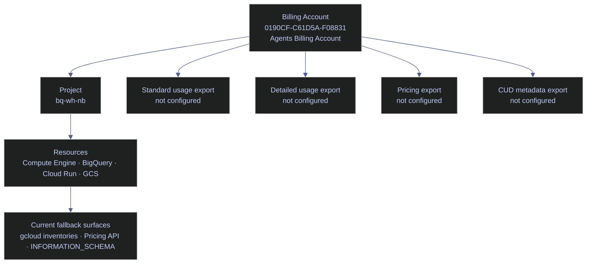

# GCP Billing and Pricing

> [!abstract]- Summary
>
> Covers Cloud Billing topology, export readiness, live pricing surfaces, and attribution maturity for `bq-wh-nb`, so operators can distinguish a project that can spend money from one that is actually ready for invoice-grade FinOps work.
>
> **Billing topology and current state**
> - Confirms that `bq-wh-nb` is linked to billing account `billingAccounts/0190CF-C61D5A-F08831` (`Agents Billing Account`), that the account currency is `CZK`, and that billing is enabled for the project
> - Explains the current billing hierarchy: one open billing account, one active linked project, and one visible `roles/billing.admin` binding for `user:alexper.recovery@gmail.com`
> - Separates billing linkage from export readiness so "billing enabled" is not mistaken for "FinOps ready"
>
> **Export surfaces and readiness**
> - Distinguishes standard usage cost export, detailed usage cost export, pricing export, and CUD metadata export by what analytical questions each one answers
> - Confirms that `bq-wh-nb` currently has no billing-export dataset in BigQuery, so there is no live `gcp_billing_export_v1_*`, detailed usage, pricing, or CUD metadata table to query
> - Explains the dataset-location consequence on first enablement: supported multi-region datasets can backfill current and previous month data, while supported regional datasets begin at enablement time only
>
> **Pricing and commitments**
> - Uses the Cloud Billing Catalog API / Pricing API in `CZK` to retrieve live public prices for Compute Engine E2 core and RAM, persistent disk, and BigQuery analysis and storage tiers in `europe-west1`
> - Distinguishes list price from effective price, and makes clear that current public rates are suitable for forward estimates but not for invoice-grade reconciliation
> - Confirms that `bq-wh-nb` currently has no Compute Engine commitments and no BigQuery capacity commitments, so commitment-backed or amortized pricing claims would be inaccurate
>
> **Attribution and production rules**
> - Explains label attribution as the ownership layer that turns raw spend into accountability, while noting that billing export records labels only on future usage rows after labels are applied
> - Calls out the current attribution gap: VM inventory already carries labels such as `app` and `env`, while the current BigQuery datasets do not expose dataset labels in the verified metadata
> - Establishes production rules for cost notes and dashboards: prove the export dataset exists first, separate list-price estimates from effective-cost analysis, and label long-lived resources before reconciliation matters
>
> **Operations and safety**
> - Warnings: billing-enabled projects can still lack exports, pricing export is separate from usage export, list price is not invoice truth, label attribution is forward-only in export rows, and missing commitment inventory means you cannot safely describe current pricing as discounted
> - Recommendations: treat linkage, export, pricing, and attribution as separate checks; use the Pricing API for current `CZK` list rates; enable standard usage export before budgets or chargeback; and label datasets, buckets, and long-lived compute before month-end reconciliation

> [!note]- Glossary
>
> **Cloud Billing account**
> - The financial container that pays for one or more Google Cloud projects and owns invoices, budgets, and billing-export configuration.
> - It is the top-level billing object operators must identify before they can reason about spend, linkage, or budgets in this note.
>
> > [!warning] One payer at a time
> >
> > A project can be linked to only one billing account at once. If the payer is wrong, every downstream budget, export, and attribution assumption is wrong too.
>
> ---
>
> **Payments profile**
> - The commercial and legal payment identity that sits behind the billing account.
> - It matters because it explains how Google collects payment and issues invoices, even though day-to-day operators usually work with the billing account instead.
>
> > [!info] Related but not identical
> >
> > Operators often say "billing account" when they really mean the broader payment relationship. The payment profile exists behind that control plane, but it is not the same API object.
>
> ---
>
> **Project-to-billing linkage**
> - The association between a Google Cloud project and the billing account that funds it.
> - It is the minimum condition for paid services to accrue usage correctly in `bq-wh-nb`.
>
> > [!warning] Billing enabled is not enough
> >
> > A healthy link only proves the project can spend money. It does not prove exports, budgets, attribution, or recommendation surfaces are configured.
>
> ---
>
> **SKU**
> - A billable stock-keeping unit representing one priced behavior, such as VM core time, RAM time, or BigQuery analysis.
> - It is the level where pricing and later cost analysis become specific enough to separate fixed and variable cost drivers.
>
> > [!info] Services split into many SKUs
> >
> > One service name usually hides many SKUs. Serious pricing work happens below the service label, not at the headline product name alone.
>
> ---
>
> **List price**
> - The public Google Cloud rate before credits, free-tier offsets, taxes, negotiated discounts, or commitments are applied.
> - It is the correct starting point for forward estimates when billing export or invoice data is absent.
>
> > [!warning] Planning rate only
> >
> > List price is useful for modeling, but it is not invoice truth. Treating it as paid cost leads to false precision in chargeback and savings claims.
>
> ---
>
> **Effective price**
> - The rate actually paid after credits, discounts, commitments, taxes, and other billing adjustments take effect.
> - It is the number required for mature FinOps, reconciliation, and true cost-per-team analysis.
>
> > [!warning] Cannot be inferred safely
> >
> > Without billing export or invoice data, effective price is not reconstructable from public rate cards alone. The missing evidence matters more than the estimate.
>
> ---
>
> **Standard usage cost export**
> - The Cloud Billing BigQuery export that writes usage cost rows by service, SKU, project, credits, and invoice month.
> - It is the base dataset needed for cost trends, budget validation, label-based reporting, and chargeback.
>
> > [!warning] Missing in this project
> >
> > `bq-wh-nb` does not currently have this export configured. Until it exists, cost SQL and invoice-grade trend analysis are blocked.
>
> ---
>
> **Detailed usage cost export**
> - A richer Cloud Billing export that adds more granular attribution fields than the standard export.
> - It is the dataset needed when analysts want deeper per-resource or reconciliation-oriented drill-down.
>
> > [!warning] More rows, more detail
> >
> > Detailed export gives stronger attribution, but it also creates higher row volume. Plan storage, query patterns, and dataset design before enabling it casually.
>
> ---
>
> **Pricing export**
> - A BigQuery export of Google Cloud list prices rather than usage charges.
> - It supports internal calculators and point-in-time price analysis without scraping public pricing pages.
>
> > [!warning] Separate from usage export
> >
> > Pricing export does not answer "what did we spend?" It answers "what is the public rate sheet?" Treat it as a companion surface, not a replacement for usage export.
>
> ---
>
> **CUD metadata export**
> - A BigQuery export of commitment metadata and subscription details for committed-use discount analysis.
> - It is required for defensible commitment coverage, utilization, and amortization work.
>
> > [!warning] Commitment analysis needs evidence
> >
> > Without this export, commitment coverage analysis is mostly guesswork. The absence matters even more when teams start discussing "savings" or amortized rates.
>
> ---
>
> **Label attribution**
> - The practice of using labels to map spend back to teams, environments, or workloads.
> - It is the ownership layer that turns raw billing data into accountability and chargeback-ready reporting.
>
> > [!warning] Forward-only signal
> >
> > Billing export captures labels on future usage rows after the labels exist. Relabeling today does not retroactively fix last month's unattributed spend.
>
> ---
>
> **Cloud Billing Catalog API / Pricing API**
> - The Google pricing surface that returns current public SKU prices programmatically, including regional and currency-specific list rates.
> - It is the live fallback source for `CZK` list pricing when billing export is absent in `bq-wh-nb`.
>
> > [!info] Use live currency alignment
> >
> > Querying the API in the billing-account currency avoids mixing USD documentation examples with a live account that is actually billed in `CZK`.
>
> ---
>
> **Compute Engine commitment**
> - A purchased commitment that changes how long-running compute should be priced and analyzed.
> - It matters because TCO notes and rightsizing guidance become misleading if they assume on-demand rates when commitments already exist.
>
> > [!warning] None are present here
> >
> > The live inventory returned no Compute Engine commitments in `bq-wh-nb`. Any current VM math in this chapter should therefore be treated as on-demand list-price math.
>
> ---
>
> **BigQuery capacity commitment**
> - A purchased slot commitment that moves BigQuery from pure on-demand analysis pricing to reserved-capacity pricing.
> - It matters when warehouse-heavy environments need edition-based capacity planning and amortization analysis.
>
> > [!warning] On-demand remains current
> >
> > No BigQuery capacity commitments were found in `europe-west1` for this project. Current BigQuery cost interpretation should therefore stay in the on-demand frame.
>
> ---
>
> **Billing-export dataset**
> - The BigQuery dataset that holds Cloud Billing managed export tables such as usage, pricing, or commitment metadata.
> - It is the capability gate that determines whether cost analysis can move from inventory-and-pricing estimates into actual export-backed SQL.
>
> > [!warning] Location choice changes backfill
> >
> > On first enablement, supported multi-region datasets can backfill the current and previous month, while supported regional datasets start at enablement time. Pick the dataset location deliberately.

## Why This Matters

Cloud Billing problems are usually not invoice problems first. They start as missing linkage, missing exports, missing attribution, or missing price interpretation. In `bq-wh-nb`, the billing link is healthy, but the export and attribution layers are incomplete. That means operators can estimate cost drivers and inspect public prices, but they cannot yet do invoice-grade reconciliation, amortized commitment analysis, or budget enforcement from BigQuery.


## Conceptual Model

The billing account is healthy, but the export layer below it is still missing. That distinction matters because many teams wrongly treat "billing enabled" as equivalent to "FinOps ready."



## Current Billing Topology

The live billing topology is simple: one open billing account, one active linked project, and one identity with `roles/billing.admin` on the billing account.

> [!info] Live Scope
>
> - Billing account `billingAccounts/0190CF-C61D5A-F08831` is open and denominated in `CZK`.
> - Project `bq-wh-nb` is linked to that account and `billingEnabled` is `true`.
> - The current billing-account IAM policy exposes one explicit binding: `roles/billing.admin` for `user:alexper.recovery@gmail.com`.

### PowerShell / Linux | gcloud | inspect billing account linkage

Use these commands to prove that a project can spend money and to confirm who can manage the financial control plane.

#### List accessible billing accounts

Run this before any budget, export, or billing-link change. It is typically triggered by use it during initial billing validation or when an operator is unsure which account funds the project. Run from any authenticated shell with `gcloud` configured. This is read-only. Establish the canonical billing account ID, display name, and account status.

| Field | Source column | Unit / type | Meaning |
|---|---|---|---|
| `name` | Cloud Billing account resource name | STRING | Immutable account identifier used by APIs and `gcloud`. |
| `displayName` | Billing account metadata | STRING | Human-readable account name shown in the console. |
| `currencyCode` | Billing account metadata | STRING | Currency used for account pricing and invoices. |
| `open` | Billing account metadata | BOOLEAN | Whether the account is active for new charges. |

*This command returns the billing accounts visible to the active identity as JSON so the exact account IDs can be reused safely in later workflows.*

```powershell
gcloud billing accounts list --format=json
```

```text
[
  {
    "currencyCode": "CZK",
    "displayName": "Agents Billing Account",
    "masterBillingAccount": "",
    "name": "billingAccounts/0190CF-C61D5A-F08831",
    "open": true
  },
  {
    "currencyCode": "CZK",
    "displayName": "My Billing Account",
    "masterBillingAccount": "",
    "name": "billingAccounts/01E212-1C5E05-99306D",
    "open": false
  }
]
```

The important result is not just the ID. It is that only one visible account is currently open, which removes ambiguity about where `bq-wh-nb` should be linked.

#### Verify the project-to-billing link

Run this before enabling paid APIs, creating exports, or investigating "billing disabled" service failures. It is typically triggered by use it whenever a project is new, recently moved, or suspected to be linked to the wrong payer. This is a read-only `gcloud billing` lookup against one project. Confirm that the project is linked to the expected billing account and that billing is enabled.

| Field | Source column | Unit / type | Meaning |
|---|---|---|---|
| `billingAccountName` | Project billing info | STRING | Billing account attached to the project. |
| `billingEnabled` | Project billing info | BOOLEAN | Whether the project can accrue paid usage. |
| `name` | Billing info resource name | STRING | API resource for the project billing record. |

*This command returns the live billing linkage for `bq-wh-nb`.*

```powershell
gcloud billing projects describe bq-wh-nb --format=json
```

```text
{
  "billingAccountName": "billingAccounts/0190CF-C61D5A-F08831",
  "billingEnabled": true,
  "name": "projects/bq-wh-nb/billingInfo",
  "projectId": "bq-wh-nb"
}
```

This is the minimum condition for paid services to work, but it says nothing about exports, budgets, or cost attribution maturity.

#### Inspect billing-account IAM

Run this before any export, budget, or account-level billing change that requires billing-account permissions. It is typically triggered by use it when a command fails with `PERMISSION_DENIED` and you need to separate missing IAM from missing API enablement. This reads the billing-account IAM policy. It requires access to read billing IAM. Verify which principals can administer billing-account resources.

| Field | Source column | Unit / type | Meaning |
|---|---|---|---|
| `role` | IAM binding | STRING | Billing-account role granted by the binding. |
| `members` | IAM binding | ARRAY<STRING> | Principals that hold the role. |

*This command returns the billing-account IAM policy as JSON.*

```powershell
gcloud billing accounts get-iam-policy 0190CF-C61D5A-F08831 --format=json
```

```text
{
  "bindings": [
    {
      "members": [
        "user:alexper.recovery@gmail.com"
      ],
      "role": "roles/billing.admin"
    }
  ],
  "etag": "BwY..."
}
```

The key operational takeaway is that the active user has billing-admin rights, so the current missing export state is not caused by obvious account-level IAM loss.

| Flag | Syntax | Description |
|---|---|---|
| `--format` | `--format=json` | Returns machine-readable output so account IDs and policy fields can be captured exactly. |

### PowerShell / Linux | BigQuery / gcloud | verify export readiness and commitment state

Billing exports and commitment metadata do not appear automatically just because a project has BigQuery enabled. This section proves what is and is not present today.

#### List datasets in the active project

Run this before assuming billing export tables exist. It is typically triggered by use it when a note, query, or dashboard references `gcp_billing_export_*` and you need to verify the dataset first. This is a read-only BigQuery metadata listing in the active project. Confirm whether a billing-export dataset, pricing export, or CUD metadata export already exists.

| Field | Source column | Unit / type | Meaning |
|---|---|---|---|
| `kind` | BigQuery dataset metadata | STRING | Returned resource type. |
| `id` | BigQuery dataset metadata | STRING | Fully qualified dataset identifier. |
| `location` | BigQuery dataset metadata | STRING | Dataset location, which matters for export backfill behavior. |

*This command lists all datasets visible in `bq-wh-nb`.*

```powershell
bq ls --format=prettyjson
```

```text
[
  {
    "kind": "bigquery#dataset",
    "id": "bq-wh-nb:stoxx_bronze",
    "location": "europe-west1"
  },
  {
    "kind": "bigquery#dataset",
    "id": "bq-wh-nb:stoxx_silver",
    "location": "europe-west1"
  },
  {
    "kind": "bigquery#dataset",
    "id": "bq-wh-nb:stoxx_gold",
    "location": "europe-west1"
  }
]
```

There is no billing-export dataset here. That means there is no live `gcp_billing_export_v1_*`, detailed usage table, pricing export table, or CUD metadata table to query in this project today.

#### Check for Compute Engine commitments

Run this before attributing savings to commitments or writing about effective VM pricing. It is typically triggered by use it when planning rightsizing or when cost analysis assumes committed-use discounts exist. This is a read-only inventory query against Compute Engine commitments. Confirm whether resource-based commitments are active in the project.

| Field | Source column | Unit / type | Meaning |
|---|---|---|---|
| JSON array length | Command result | INTEGER | Number of commitments returned by the project inventory. |

*This command checks for Compute Engine commitments in the current project.*

```powershell
gcloud compute commitments list --format=json
```

```text
[]
```

The empty result means there are no visible Compute Engine commitments in `bq-wh-nb`, so list-price VM math should not be presented as amortized or commitment-backed math.

#### Check for BigQuery capacity commitments

Run this before discussing BigQuery editions, slot commitments, or reservation-backed spend. It is typically triggered by use it when a warehouse-heavy TCO model assumes dedicated slot capacity. This is a read-only BigQuery reservation inventory lookup in `europe-west1`. Confirm whether the project has any active capacity commitments for BigQuery.

| Field | Source column | Unit / type | Meaning |
|---|---|---|---|
| Command status text | `bq` CLI result | STRING | Human-readable summary of whether commitments exist in the selected location. |

*This command checks for BigQuery capacity commitments in the project region.*

```powershell
bq ls --capacity_commitment --location=europe-west1 --format=prettyjson
```

```text
No capacity commitments found.
```

This confirms that the current BigQuery posture is on-demand rather than reservation-backed.

| Flag | Syntax | Description |
|---|---|---|
| `--format` | `--format=prettyjson` | Returns structured BigQuery metadata. |
| `--capacity_commitment` | `bq ls --capacity_commitment` | Switches the listing surface from datasets to BigQuery commitments. |
| `--location` | `--location=europe-west1` | Restricts the lookup to the region where current datasets live. |

### PowerShell | Cloud Billing Catalog API | query current list prices

The Pricing API is the live list-price source when billing export is absent. It does not tell you what you were billed. It tells you what the public rate sheet currently says for a given SKU and region.

#### Query Compute Engine and disk list prices for `europe-west1`

Run this when you need a current public rate for a SKU that actually exists in the environment. It is typically triggered by use it during TCO modeling, rightsizing, or when a stale price table would be unsafe. This is a read-only REST call against the Cloud Billing Catalog API using an access token from the active `gcloud` identity. Retrieve live list prices for E2 core and RAM time plus the persistent disk types used by the current VMs.

| Field | Source column | Unit / type | Meaning |
|---|---|---|---|
| `description` | SKU metadata | STRING | Human-readable description of the SKU. |
| `serviceRegions` | SKU metadata | ARRAY<STRING> | Regions where the SKU applies. |
| `tieredRates` | Pricing expression | ARRAY / OBJECT | Price tiers for the SKU. |
| `effectiveTime` | Pricing metadata | TIMESTAMP | When the returned price becomes effective. |

*This PowerShell pipeline fetches the Compute Engine SKU catalog in `CZK`, filters it to the active region, and returns only the core, RAM, disk, and snapshot entries that matter for the current project inventory.*

```powershell
$token = gcloud auth print-access-token
$headers = @{ Authorization = "Bearer $token" }
$service = "6F81-5844-456A"
$pageToken = $null
$skus = @()

do {
  $url = "https://cloudbilling.googleapis.com/v1/services/$service/skus?pageSize=5000&currencyCode=CZK"
  if ($pageToken) { $url += "&pageToken=$pageToken" }
  $response = Invoke-RestMethod -Headers $headers -Uri $url
  $skus += $response.skus
  $pageToken = $response.nextPageToken
} while ($pageToken)

$skus |
  Where-Object {
    ($_.serviceRegions -contains "europe-west1") -and (
      $_.description -eq "E2 Instance Core running in EMEA" -or
      $_.description -eq "E2 Instance Ram running in EMEA" -or
      $_.description -eq "Balanced PD Capacity" -or
      $_.description -eq "SSD backed PD Capacity" -or
      $_.description -eq "Storage PD Snapshot"
    )
  } |
  Select-Object description, serviceRegions,
    @{n="tieredRates";e={$_.pricingInfo[0].pricingExpression.tieredRates}},
    @{n="effectiveTime";e={$_.pricingInfo[0].effectiveTime}} |
  ConvertTo-Json -Depth 8
```

```text
[
  {
    "description": "E2 Instance Core running in EMEA",
    "serviceRegions": ["europe-west1"],
    "tieredRates": {
      "startUsageAmount": 0,
      "unitPrice": { "currencyCode": "CZK", "units": "0", "nanos": 509871109 }
    },
    "effectiveTime": "2026-04-13T07:00:00Z"
  },
  {
    "description": "E2 Instance Ram running in EMEA",
    "serviceRegions": ["europe-west1"],
    "tieredRates": {
      "startUsageAmount": 0,
      "unitPrice": { "currencyCode": "CZK", "units": "0", "nanos": 68343520 }
    },
    "effectiveTime": "2026-04-13T07:00:00Z"
  },
  {
    "description": "Balanced PD Capacity",
    "serviceRegions": ["us-central1", "us-central2", "us-east1", "us-west1", "asia-east1", "europe-west1"],
    "tieredRates": {
      "startUsageAmount": 0,
      "unitPrice": { "currencyCode": "CZK", "units": "2", "nanos": 125050000 }
    },
    "effectiveTime": "2026-04-13T07:00:00Z"
  }
]
```

These values are live public list prices. They are suitable for forward modeling, but they are still not effective cost because they exclude credits, free tiers, and any future commitments.

#### Query BigQuery analysis and storage price tiers for `europe-west1`

Run this when you need current query or storage list prices for BigQuery in the project region. It is typically triggered by use it during TCO work or when validating whether current BigQuery usage is still inside the free tier. This is a read-only Pricing API lookup against the BigQuery service catalog. Retrieve the current analysis and storage tiers that apply to on-demand BigQuery usage in `europe-west1`.

| Field | Source column | Unit / type | Meaning |
|---|---|---|---|
| `description` | SKU metadata | STRING | BigQuery cost dimension represented by the SKU. |
| `tieredRates.startUsageAmount` | Pricing expression | NUMERIC | Usage threshold where a tier starts. |
| `tieredRates.unitPrice` | Pricing expression | MONEY | Public rate at that tier. |
| `displayQuantity` | Pricing expression | NUMERIC | Display quantity used for the returned unit. |

*This PowerShell pipeline pulls the relevant BigQuery SKUs for analysis and storage in `europe-west1`.*

```powershell
$token = gcloud auth print-access-token
$headers = @{ Authorization = "Bearer $token" }
$service = "24E6-581D-38E5"
$pageToken = $null
$skus = @()

do {
  $url = "https://cloudbilling.googleapis.com/v1/services/$service/skus?pageSize=5000&currencyCode=CZK"
  if ($pageToken) { $url += "&pageToken=$pageToken" }
  $response = Invoke-RestMethod -Headers $headers -Uri $url
  $skus += $response.skus
  $pageToken = $response.nextPageToken
} while ($pageToken)

$skus |
  Where-Object {
    ($_.serviceRegions -contains "europe-west1") -and (
      $_.description -eq "Analysis (europe-west1)" -or
      $_.description -eq "Active Logical Storage (europe-west1)" -or
      $_.description -eq "Long Term Logical Storage (europe-west1)"
    )
  } |
  Select-Object description, serviceRegions,
    @{n="tieredRates";e={$_.pricingInfo[0].pricingExpression.tieredRates}},
    @{n="displayQuantity";e={$_.pricingInfo[0].pricingExpression.displayQuantity}},
    @{n="effectiveTime";e={$_.pricingInfo[0].effectiveTime}} |
  ConvertTo-Json -Depth 8
```

```text
[
  {
    "description": "Analysis (europe-west1)",
    "serviceRegions": ["europe-west1"],
    "tieredRates": [
      {
        "startUsageAmount": 0,
        "unitPrice": { "currencyCode": "CZK", "units": "0", "nanos": 0 }
      },
      {
        "startUsageAmount": 1,
        "unitPrice": { "currencyCode": "CZK", "units": "159", "nanos": 378750000 }
      }
    ],
    "displayQuantity": 1,
    "effectiveTime": "2026-04-13T07:00:00Z"
  },
  {
    "description": "Active Logical Storage (europe-west1)",
    "serviceRegions": ["europe-west1"],
    "tieredRates": [
      {
        "startUsageAmount": 0,
        "unitPrice": { "currencyCode": "CZK", "units": "0", "nanos": 0 }
      },
      {
        "startUsageAmount": 10,
        "unitPrice": { "currencyCode": "CZK", "units": "0", "nanos": 425010000 }
      }
    ],
    "displayQuantity": 1,
    "effectiveTime": "2026-04-13T07:00:00Z"
  }
]
```

The live tier data matters more than a copied price table. It shows that query spend is free until the first `1 TiB`, and active logical storage is free until the first `10 GiB`, after which public list pricing applies.

| Flag | Syntax | Description |
|---|---|---|
| `pageSize` | `?pageSize=5000` | Pulls enough SKU rows to filter region and description locally. |
| `currencyCode` | `?currencyCode=CZK` | Returns prices in the same currency as the billing account. |
| `ConvertTo-Json -Depth 8` | `ConvertTo-Json -Depth 8` | Preserves tiered pricing arrays in the final output. |

## Export Types and Current State

Billing export maturity is not about one table. It is about which export family is enabled and what analytical questions each family can answer.

| Export surface | What it contains | When you need it | Current state in `bq-wh-nb` | Operational implication |
|---|---|---|---|---|
| Standard usage cost export | Daily usage cost rows by service, SKU, project, credits, and invoice month | Baseline spend trends, cost by service, project, or label | Not configured | There is no invoice-grade cost history to query in BigQuery. |
| Detailed usage cost export | Richer usage rows with more resource attribution detail | Per-resource drill-down, stronger reconciliation, and deeper attribution | Not configured | Resource-level cost analysis is blocked. |
| Pricing export | Public list-price data in BigQuery | Internal calculators and point-in-time price references | Not configured | Price analysis must use the Pricing API or the public price list instead. |
| CUD metadata export | Commitment subscription metadata and coverage context | Commitment utilization and amortization analysis | Not configured | You cannot do defensible CUD coverage analysis from BigQuery yet. |

> [!warning] Billing Export Is Still Missing
>
> `bq-wh-nb` has BigQuery enabled, but it does not have a Cloud Billing export dataset. Until that changes, this project cannot support invoice-grade cost trends, cost-by-label queries, or budget-validation SQL.

> [!success] Enable Export With The Correct Dataset Strategy
>
> - If you want the first export to backfill current and previous month data, use a supported multi-region dataset (`EU` or `US`) on the first enablement.
> - If you create the export dataset in a supported region such as `europe-west1`, export starts from the enablement date forward and does not backfill earlier usage.
> - Do not manually insert rows into billing-export tables after export is enabled; Google can overwrite managed export tables.

## Attribution and Pricing Interpretation

Live inventory shows partial attribution maturity. Current Compute Engine instances carry labels such as `app` and `env`, but the BigQuery datasets `stoxx_bronze`, `stoxx_silver`, and `stoxx_gold` do not expose any `labels` field in their current dataset metadata. That means cost ownership is currently stronger on VM inventory than on warehouse inventory.

Pricing interpretation also needs discipline:

- **List price** is what the Pricing API returned in this note.
- **Effective price** is what you actually pay after credits, discounts, taxes, and free-tier offsets.
- **Current project state** shows no Compute Engine commitments and no BigQuery capacity commitments, so there is no evidence of commitment-backed pricing in `bq-wh-nb`.
- **Safe conclusion today**: use live list prices for forward planning, but do not describe them as amortized, discounted, or invoice-accurate.

## Recommendations / Production Rules

- Treat billing linkage, billing export, pricing export, and attribution as four separate maturity checks.
- Never write cost SQL until you have proved the target billing-export dataset exists.
- Use the Pricing API for current public rates when the chapter needs exact list pricing, especially in a non-USD billing account such as `CZK`.
- Separate list-price estimates from effective-cost analysis in every note and dashboard.
- Enable standard usage export before building budgets, anomaly queries, or chargeback logic; otherwise every downstream control plane becomes guesswork.
- Label datasets, buckets, and long-lived compute resources consistently before month-end reconciliation matters.

## Quick Reference

| Question | Live answer |
|---|---|
| Which billing account funds `bq-wh-nb`? | `billingAccounts/0190CF-C61D5A-F08831` (`Agents Billing Account`) |
| Is billing enabled? | Yes |
| What currency applies? | `CZK` |
| Is Cloud Billing export configured in BigQuery? | No |
| Are Compute Engine commitments present? | No |
| Are BigQuery capacity commitments present? | No |
| What should be used for current public prices? | Cloud Billing Catalog API / Pricing API |

## Links To Related Notes In The Vault

- [02 - GCP Cost Monitoring and Budgets](02-gcp-cost-monitoring-and-budgets.md)
- [03 - GCP Total Cost of Ownership](03-gcp-total-cost-of-ownership.md)
- [01 - Cloud Logging](../07-Logging/01-cloud-logging.md)
- [02 - Cloud Monitoring Metrics](../07-Logging/02-cloud-monitoring-metrics.md)
