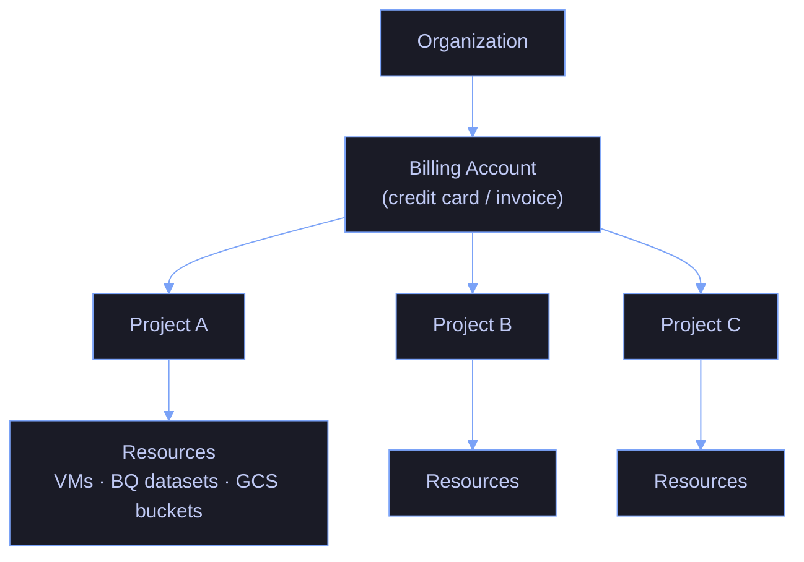

# GCP Billing and Pricing — Data Engineering Reference

> [!quote]
> "FinOps is the practice of bringing financial accountability to the variable spend model of cloud, enabling distributed teams to make business trade-offs between speed, cost, and quality."
>
> — **J.R. Storment**, *Cloud FinOps*

This note is the single source of truth for GCP cost management across every data engineering service. It covers pricing models, billing dimensions, free tiers, discount mechanisms, cost formulas, and practical gcloud / BigQuery commands for ongoing cost analysis.

> [!important] Prices Are Approximate
> All prices shown are approximate list prices for the `us-central1` region as of early 2026. Always verify current prices at [cloud.google.com/pricing](https://cloud.google.com/pricing). Multi-region and European regions are typically 10–30% higher.

---

## GCP Billing Fundamentals

### Billing Hierarchy

Every GCP cost traces through this four-level hierarchy. Resources generate usage charges that roll up through the project to the linked billing account. A project can be linked to only one billing account at a time, but a single billing account can fund many projects.



- One billing account can fund many projects.
- A project can only be linked to one billing account at a time.
- Resources within a project inherit that project's billing account.
- Charges accumulate at the resource level, roll up to project, then to billing account.

List all billing accounts you have access to:

```bash
gcloud billing accounts list
```

```text
ACCOUNT_ID            NAME                      OPEN  MASTER_ACCOUNT_ID
01ABCD-234EFG-567HIJ  My Billing Account        True
```

Link a project to a billing account:

```bash
gcloud billing projects link PROJECT_ID \
  --billing-account=BILLING_ACCOUNT_ID
```

```text
billingAccountName: billingAccounts/01ABCD-234EFG-567HIJ
billingEnabled: true
name: projects/PROJECT_ID/billingInfo
projectId: PROJECT_ID
```

Verify the current billing link for a project:

```bash
gcloud billing projects describe PROJECT_ID
```

```text
billingAccountName: billingAccounts/01ABCD-234EFG-567HIJ
billingEnabled: true
name: projects/my-project/billingInfo
projectId: my-project
```

### Billing Export to BigQuery (Essential)

> [!tip] Foundation of All Cost Analysis
>
> Enable detailed billing export so you can query your actual spend with SQL. This is a one-time console setup per billing account:
>
> 1. Navigate: **Billing → Billing Export → BigQuery Export → Edit Settings**
> 2. Create a dataset first: `billing_export`
> 3. Set table prefix: `gcp_billing_export_v1`
> 4. Resulting table: `billing_export.gcp_billing_export_v1_XXXXXXXX` (X = billing account digits)

Key columns in the billing export table:

| Column | Description |
|--------|-------------|
| `service.description` | Human-readable service name (e.g., "BigQuery") |
| `sku.description` | Specific SKU (e.g., "Analysis (On Demand)") |
| `usage_start_time` | Billing period start |
| `cost` | USD cost for this line item |
| `usage.amount` | Quantity used |
| `usage.unit` | Unit (bytes, seconds, etc.) |
| `labels` | Resource labels as key-value pairs |
| `project.id` | GCP project |
| `resource.name` | Specific resource identifier |

Query total cost by service for the last 30 days:

```sql
SELECT
  service.description AS service,
  SUM(cost) AS total_cost_usd,
  SUM(cost) / SUM(SUM(cost)) OVER () * 100 AS pct_of_total
FROM `billing_export.gcp_billing_export_v1_XXXXXXXX`
WHERE DATE(_PARTITIONTIME) >= DATE_SUB(CURRENT_DATE(), INTERVAL 30 DAY)
GROUP BY service
ORDER BY total_cost_usd DESC
```

Cost by label (e.g., by `pipeline` label):

```sql
SELECT
  (SELECT value FROM UNNEST(labels) WHERE key = 'pipeline') AS pipeline,
  SUM(cost) AS total_cost_usd
FROM `billing_export.gcp_billing_export_v1_XXXXXXXX`
WHERE DATE(_PARTITIONTIME) >= DATE_SUB(CURRENT_DATE(), INTERVAL 7 DAY)
GROUP BY pipeline
ORDER BY total_cost_usd DESC
```

### Resource Labels for Cost Attribution

Labels are the single most important cost governance tool. Every resource should carry at minimum: `team`, `environment`, and `pipeline`.

Label a Compute Engine VM:

```bash
gcloud compute instances update VM_NAME \
  --update-labels=team=data-platform,env=prod,pipeline=daily-ingest
```

Label a GCS bucket:

```bash
gcloud storage buckets update gs://BUCKET_NAME \
  --update-labels=team=data-platform,env=staging,pipeline=etl
```

Label a BigQuery dataset:

```bash
bq update --set_label team:data-platform --set_label env:prod PROJECT_ID:DATASET
```

List all labels currently applied to a resource:

```bash
gcloud compute instances describe VM_NAME --format='get(labels)'
```

```text
{u'env': u'prod', u'pipeline': u'daily-ingest', u'team': u'data-platform'}
```

> [!warning] Labels Are Not Retroactive
>
> Labels only appear on billing export rows created after the label was applied. Label resources at creation time via IaC (Terraform, etc.) to ensure full coverage.

> [!success] Enforce labels at creation time with Terraform
> Declare a `locals { common_labels = {...} }` block in every Terraform module and apply it to every resource. This ensures all resources are labeled from their first billing row. For existing unlabeled resources, apply labels immediately and accept that pre-label history will be unattributed.

### Budget Alerts

Set budget alerts before costs spiral. Alerts do not cap spending; they notify.

Create a budget (requires `billing.budgets.create` permission on the billing account):

```bash
gcloud billing budgets create \
  --billing-account=BILLING_ACCOUNT_ID \
  --display-name="Monthly Data Platform Budget" \
  --budget-amount=5000USD \
  --threshold-rules-percent=0.5 \
  --threshold-rules-percent=0.9 \
  --threshold-rules-percent=1.0 \
  --filter-projects=PROJECT_ID
```

List existing budgets for a billing account:

```bash
gcloud billing budgets list --billing-account=BILLING_ACCOUNT_ID
```

```text
DISPLAY_NAME                    BUDGET_AMOUNT  FILTER_PROJECTS
Monthly Data Platform Budget    5000.0 USD     PROJECT_ID
```

You can also attach a Pub/Sub topic to a budget to trigger automated cost-control actions (e.g., stop non-critical VMs when 90% threshold is hit).

---

## Pricing for Every GCP Data Engineering Service

Each section below covers one GCP service: its billing model, pricing dimensions, free tier, discount mechanisms, cost formulas, and the gcloud commands most relevant to cost analysis. Services are ordered by typical cost impact in a data engineering platform.

---

### Compute Engine (VMs)

**Billing unit:** Per-second (minimum 1 minute)

#### Compute Engine cost formula — vCPU + memory + disk + network

The total monthly cost of a VM is the sum of four independent dimensions. Each is billed separately, including when the VM is stopped (disk and static IP continue to accrue).

```text
Monthly cost =
  ( vCPU_count × vCPU_rate/hr
  + RAM_GB    × RAM_rate/hr  ) × hours_running
  + disk_GB   × disk_rate/GB/month
  + snapshot_GB × $0.050/GB/month (regional)
  + unattached_static_IPs × $0.01/hr
```

#### Machine Type Rates (approximate, us-central1)

Rates vary by machine family. Choose the family based on the workload type — E2 for general batch, N2 for higher single-thread performance, C2 for compute-intensive jobs.

| Machine family | vCPU/hour | Memory/GB/hour | Notes |
|----------------|-----------|----------------|-------|
| e2 | $0.03351 | $0.00450 | General purpose, best price/perf for most workloads |
| n2 | $0.04715 | $0.00632 | Higher single-thread perf |
| n2d | $0.03878 | $0.00521 | AMD EPYC, ~17% cheaper than n2 |
| c2 | $0.05200 | $0.00698 | Compute-optimized |
| m1 (memory) | $0.04800 | $0.00732 | Very large RAM workloads |

#### Disk Pricing

Persistent disks are billed continuously regardless of VM state — a stopped VM still pays for its attached disk. Detached disks also accrue storage charges until deleted.

| Type | Cost/GB/month | IOPS | Notes |
|------|---------------|------|-------|
| pd-standard (HDD) | $0.040 | Low | Cold data, infrequent access |
| pd-balanced | $0.100 | Medium | General purpose |
| pd-ssd | $0.170 | High | Databases, high-IOPS workloads |
| pd-extreme | $0.125 + IOPS charge | Very High | Needs explicit IOPS provisioning |
| hyperdisk-balanced | varies | High | Newer generation |

Snapshots: **$0.050/GB/month** (regional) or **$0.065/GB/month** (multi-regional)

#### Discount Mechanisms

**Sustained Use Discounts (SUD)** — fully automatic, no commitment required:

> [!warning] SUD Varies by Machine Family
>
> N1 and M1/M2 series get up to ~30% SUD. N2, N2D, and C2 series get up to ~20% SUD. **E2 machines do NOT qualify for SUDs at all.** The table below shows the N1/M1/M2 tiers; N2/N2D/C2 tiers are lower.

> [!success] Use N1/N2 for sustained workloads; use CUDs for E2
> If a VM runs 24/7 for months, prefer N1 or N2 to benefit from automatic SUDs. For E2 machines (which have no SUD), use a 1-year CUD to get ~37% off on-demand — the only discount path for the E2 family.

| Usage in month | Discount (N1/M1/M2) | Discount (N2/N2D/C2) |
|----------------|---------------------|----------------------|
| 0–25% | 0% | 0% |
| 25–50% | 20% off | Up to 10% off |
| 50–75% | 40% off | Up to 15% off |
| 75–100% | Net ~30% for full month | Net ~20% for full month |

Running an N1 VM 24/7 for a full month yields ~30% off automatically. N2/C2 yields ~20%. E2 yields zero SUD.

**Committed Use Discounts (CUD)** — requires a 1- or 3-year resource commitment:

| Commitment | Discount |
|------------|----------|
| 1-year | ~37% off on-demand |
| 3-year | ~55% off on-demand |

CUDs apply at the project or billing-account level (for resource-based CUDs). They do not apply to Spot VMs.

Purchase a resource-based CUD for 1 year:

```bash
gcloud compute commitments create COMMITMENT_NAME \
  --plan=12-month \
  --region=us-central1 \
  --resources=vcpu=16,memory=64GB
```

List existing commitments in a region:

```bash
gcloud compute commitments list --filter="region=us-central1"
```

**Spot / Preemptible VMs** — 60–91% off on-demand rates, can be terminated any time:

Create a Spot VM (current API — `--provisioning-model=SPOT`):

```bash
gcloud compute instances create INSTANCE_NAME \
  --machine-type=e2-standard-4 \
  --provisioning-model=SPOT \
  --instance-termination-action=STOP \
  --zone=us-central1-a
```

The legacy `--preemptible` flag still works but is functionally equivalent to Spot:

```bash
gcloud compute instances create INSTANCE_NAME \
  --machine-type=e2-standard-4 \
  --preemptible \
  --zone=us-central1-a
```

> [!warning] Cost Trap: Idle VMs
>
> A stopped VM still charges for its attached persistent disk and any reserved static IP. To pay zero, delete the disk or resize to the minimum, and release the static IP. Stopping alone does NOT eliminate all costs.

> [!success] Release disks and IPs before long-term VM shutdown
> When stopping a VM for more than a few days, snapshot the disk, delete it, and release any reserved static IPs. Restore from snapshot when needed. This eliminates all idle storage charges. Automate with a Cloud Scheduler job that stops VMs nightly and optionally cleans up unattached resources.

#### Special Licensing Costs

SQL Server on Windows: adds \$0.40–\$2.00/hour on top of VM price depending on edition. Use SQL Server on Linux (Developer/Express edition = free) or bring-your-own license (BYOL) to avoid this.

GPU VMs: GPUs are billed per-hour on top of the base VM cost. Example: NVIDIA A100 ~$3.67/hour additional.

#### Right-Sizing with the Recommender API

The Compute Recommender analyzes actual CPU and memory utilization over 8 days and suggests a smaller machine type when the VM is consistently underutilized. Recommendations include projected monthly savings.

List machine-type right-sizing recommendations for a zone:

```bash
gcloud recommender recommendations list \
  --recommender=google.compute.instance.MachineTypeRecommender \
  --location=us-central1-a \
  --project=PROJECT_ID \
  --format=json | jq '.[] | {name: .name, impact: .primaryImpact.costProjection}'
```

Apply a recommendation using the ETAG from the previous output (required for optimistic concurrency):

```bash
gcloud recommender recommendations apply RECOMMENDATION_ID \
  --recommender=google.compute.instance.MachineTypeRecommender \
  --location=us-central1-a \
  --etag=ETAG
```

#### Inventory and Cost Audit Commands

Run these periodically to identify idle or over-provisioned resources that are silently accruing cost.

List all running VMs and their machine types:

```bash
gcloud compute instances list \
  --filter="status=RUNNING" \
  --format="table(name,zone,machineType.basename(),status)"
```

```text
NAME             ZONE           MACHINE_TYPE    STATUS
pipeline-worker  us-central1-a  e2-standard-4   RUNNING
data-api         us-central1-b  n2-standard-2   RUNNING
```

List VMs by zone with preemptibility flag:

```bash
gcloud compute instances list \
  --format="table(name,zone,machineType.basename(),scheduling.preemptible)"
```

Find unattached (orphaned) persistent disks — these continue billing even with no VM attached:

```bash
gcloud compute disks list \
  --filter="NOT users:*" \
  --format="table(name,zone,sizeGb,type.basename())"
```

```text
NAME              ZONE           SIZE_GB  TYPE
old-data-disk     us-central1-a  500      pd-ssd
unused-backup     us-central1-b  200      pd-standard
```

Find unattached static IPs — each costs $0.01/hr (~$7.20/month):

```bash
gcloud compute addresses list \
  --filter="status=RESERVED AND NOT users:*"
```

```text
NAME         REGION       ADDRESS        STATUS
orphan-ip-1  us-central1  35.193.x.x     RESERVED
```

Delete an unattached static IP:

```bash
gcloud compute addresses delete IP_NAME --region=us-central1
```

**Free tier:** 1 e2-micro instance per month in `us-*` regions (excluding `us-east4`, `us-east5`).

---

### BigQuery

BigQuery has two fundamentally different pricing models. Choose based on workload predictability.

#### Model 1: On-Demand (Pay per Query)

- **$6.25 per TB of data scanned**
- First **1 TB/month free**
- Billed on bytes scanned, not rows returned, not execution time

> [!danger] Full-Table Scan Costs
>
> Cost Trap: Full-Table Scans.
> `SELECT * FROM huge_table` scans every byte. A 10 TB table costs $62.50 per full scan. Always filter on partitioned columns and cluster keys to minimize bytes scanned.

> [!success] Partition tables and use `--dry_run` before executing
> Partition every large table by date and cluster on common filter columns. Use `bq query --dry_run` to see bytes-to-be-scanned before running any query. Set `require_partition_filter = TRUE` on the table so unfiltered queries are rejected at the API level.

#### Model 2: Editions (Capacity / Slot-Based)

Editions replace the legacy flat-rate reservations. You pay for compute capacity (slots) per hour rather than per byte scanned. Autoscaling adjusts slot count between zero and your configured maximum.

| Edition | Price/slot-hour | Min slots | Autoscaling |
|---------|----------------|-----------|-------------|
| Standard | $0.04 | 100 | Yes (baseline 0) |
| Enterprise | $0.06 | 100 | Yes |
| Enterprise Plus | $0.10 | 100 | Yes |

Editions are best when:
- Queries run frequently throughout the day (capacity is amortized over time)
- You need predictable costs / budget certainty
- You have SLA requirements for slot availability

On-demand is best when:
- Workloads are bursty and unpredictable
- Total monthly scanned volume is under ~500 GB–5 TB
- Ad-hoc analytics with infrequent queries

#### BigQuery Storage Pricing

Storage is billed separately from compute. The distinction between active and long-term storage is applied automatically per table — no manual configuration required.

| Storage type | Cost/GB/month | Condition |
|-------------|---------------|-----------|
| Active | $0.020 | Table modified in last 90 days |
| Long-term | $0.010 | Table NOT modified for 90+ consecutive days |

Long-term storage kicks in automatically per-table (not per-dataset). This is a free 50% storage discount for cold tables — use it by not unnecessarily writing to archive tables.

Partitioned tables get long-term pricing applied per-partition, so old partitions become cheap while new ones stay active-priced.

#### Streaming Inserts Pricing

- **$0.010 per 200 MB** inserted via the legacy streaming API
- Each row is rounded up to 1 KB minimum
- Prefer batch loads (free) or the Storage Write API where possible

> [!tip] Free Tier Summary (BigQuery)
>
> - 1 TB queries/month (on-demand)
> - 10 GB storage/month
> - Free batch loading, exporting, copying, and metadata operations

#### Cost Estimation Commands

Use dry-run mode to estimate query cost before execution — the query is validated and bytes-scanned is returned without actually running it or consuming any quota.

```bash
bq query \
  --dry_run \
  --use_legacy_sql=false \
  "SELECT event_id, user_id, ts
   FROM my_dataset.events
   WHERE DATE(ts) = '2026-03-22'
     AND event_type = 'purchase'"
```

```text
Query successfully validated. Assuming the tables are not modified,
running this query will process 52428800 bytes.
```

Convert dry-run output to cost estimate:

```bash
# Bytes → TB → cost
BYTES=52428800  # example output
python3 -c "print(f'Estimated cost: \${$BYTES / 1e12 * 6.25:.4f}')"
```

#### BigQuery SQL for Cost Analysis

Query cost by user (last 30 days):

```sql
SELECT
  user_email,
  COUNT(*) AS query_count,
  ROUND(SUM(total_bytes_processed) / POW(10, 12), 4) AS tb_scanned,
  ROUND(SUM(total_bytes_processed) / POW(10, 12) * 6.25, 2) AS est_cost_usd,
  ROUND(AVG(total_bytes_processed) / POW(10, 9), 2) AS avg_gb_per_query
FROM `region-us`.INFORMATION_SCHEMA.JOBS
WHERE
  creation_time > TIMESTAMP_SUB(CURRENT_TIMESTAMP(), INTERVAL 30 DAY)
  AND job_type = 'QUERY'
  AND state = 'DONE'
GROUP BY user_email
ORDER BY tb_scanned DESC
```

Most expensive individual queries (last 7 days):

```sql
SELECT
  job_id,
  user_email,
  query,
  ROUND(total_bytes_processed / POW(10, 12), 4) AS tb_scanned,
  ROUND(total_bytes_processed / POW(10, 12) * 6.25, 4) AS est_cost_usd,
  TIMESTAMP_DIFF(end_time, start_time, SECOND) AS duration_seconds,
  creation_time
FROM `region-us`.INFORMATION_SCHEMA.JOBS
WHERE
  creation_time > TIMESTAMP_SUB(CURRENT_TIMESTAMP(), INTERVAL 7 DAY)
  AND job_type = 'QUERY'
  AND state = 'DONE'
ORDER BY total_bytes_processed DESC
LIMIT 50
```

Tables generating the most scan cost:

```sql
SELECT
  referenced_table.project_id,
  referenced_table.dataset_id,
  referenced_table.table_id,
  COUNT(DISTINCT job_id) AS query_count,
  ROUND(SUM(total_bytes_processed) / POW(10, 12), 4) AS tb_scanned,
  ROUND(SUM(total_bytes_processed) / POW(10, 12) * 6.25, 2) AS est_cost_usd
FROM `region-us`.INFORMATION_SCHEMA.JOBS,
  UNNEST(referenced_tables) AS referenced_table
WHERE
  creation_time > TIMESTAMP_SUB(CURRENT_TIMESTAMP(), INTERVAL 30 DAY)
  AND job_type = 'QUERY'
  AND state = 'DONE'
GROUP BY 1, 2, 3
ORDER BY tb_scanned DESC
LIMIT 30
```

Storage cost breakdown by dataset:

```sql
SELECT
  table_schema AS dataset,
  ROUND(SUM(size_bytes) / POW(10, 9), 2) AS total_gb,
  ROUND(SUM(size_bytes) / POW(10, 9) * 0.02, 4) AS est_storage_cost_usd
FROM `PROJECT_ID`.INFORMATION_SCHEMA.TABLE_STORAGE
GROUP BY dataset
ORDER BY total_gb DESC
```

Daily cost trend (slots or on-demand):

```sql
SELECT
  DATE(creation_time) AS query_date,
  COUNT(*) AS queries,
  ROUND(SUM(total_bytes_processed) / POW(10, 12), 4) AS tb_scanned,
  ROUND(SUM(total_bytes_processed) / POW(10, 12) * 6.25, 2) AS est_cost_usd
FROM `region-us`.INFORMATION_SCHEMA.JOBS
WHERE
  creation_time > TIMESTAMP_SUB(CURRENT_TIMESTAMP(), INTERVAL 90 DAY)
  AND job_type = 'QUERY'
  AND state = 'DONE'
GROUP BY query_date
ORDER BY query_date DESC
```

#### BigQuery Cost Optimization Tactics

Partitioning reduces scan cost by restricting data read:

```sql
-- Create a partitioned table
CREATE TABLE my_dataset.events
PARTITION BY DATE(event_timestamp)
CLUSTER BY event_type, user_id
AS SELECT * FROM my_dataset.events_raw;

-- Verify partition pruning: compare billed bytes with vs without partition filter
-- Always filter on the partition column!
WHERE DATE(event_timestamp) BETWEEN '2026-01-01' AND '2026-03-22'
```

Column selection — never `SELECT *`:

```sql
-- BAD: scans all columns (full row width × all rows)
SELECT * FROM my_dataset.events WHERE DATE(ts) = '2026-03-22'

-- GOOD: scans only selected columns (BigQuery is columnar)
SELECT event_id, user_id, event_type FROM my_dataset.events
WHERE DATE(ts) = '2026-03-22'
```

Materialized views for repeated aggregation patterns:

```sql
CREATE MATERIALIZED VIEW my_dataset.daily_event_counts
PARTITION BY date
AS
SELECT
  DATE(event_timestamp) AS date,
  event_type,
  COUNT(*) AS cnt
FROM my_dataset.events
GROUP BY 1, 2;
-- Queries hitting this view only scan the MV, not the underlying table
```

See [querying-and-cost-optimization](https://alp78.github.io/elysium/06-GCP/BigQuery/querying-and-cost-optimization) for full BigQuery optimization patterns.

---

### Cloud Run

**Billing philosophy:** Pay only for what executes. Zero cost when idle (no requests, no job executions). This makes Cloud Run ideal for batch data engineering jobs.

#### Cloud Run Services (HTTP/gRPC)

Services are billed per request and per CPU/memory time consumed during request processing. If `--cpu-always-on` is set, idle CPU is billed at the lower between-request rate.

| Dimension | Rate | Free tier/month |
|-----------|------|-----------------|
| Requests | $0.40/million | 2 million requests |
| CPU (request processing) | $0.00002400/vCPU-second | 180,000 vCPU-seconds |
| Memory (request processing) | $0.00000250/GB-second | 360,000 GB-seconds |
| CPU (always-on, between requests) | $0.00001800/vCPU-second | — |

#### Cloud Run Jobs (Batch Workloads)

Jobs have no per-request charge — billing starts when the task container starts and stops when it exits. Multiple parallel tasks in one execution each accrue cost independently.

| Dimension | Rate |
|-----------|------|
| CPU | $0.00002400/vCPU-second |
| Memory | $0.00000250/GB-second |
| No per-request charge | — |

#### Cloud Run Job cost formula — vCPU-seconds + memory-seconds + requests

The formula below calculates the cost of one execution. For scheduled daily jobs, multiply by 30 to get the monthly estimate.

```text
Cost = executions × duration_seconds × (vCPU × $0.0000240 + RAM_GB × $0.0000025)
```

Example: 1 execution/day of a 2-vCPU, 4 GB, 300-second job:

```text
Daily cost = 1 × 300 × (2 × 0.0000240 + 4 × 0.0000025)
           = 300 × (0.0000480 + 0.0000100)
           = 300 × 0.0000580
           = $0.0174/day → ~$0.52/month
```

> [!tip] Cloud Run vs VM
>
> Cloud Run vs VM for Batch Jobs.
> A Cloud Run Job running 1 hour/day costs roughly \$0.04–0.08/day. An e2-standard-2 VM running 24/7 costs ~\$49/month. If a job runs less than ~8 hours/day, Cloud Run is cheaper even before accounting for provisioning overhead.

> [!warning] Min Instances Cost Trap
>
> Cost Trap: min-instances > 0.
> Setting `--min-instances=1` on a Cloud Run Service keeps one container always warm. CPU allocated between requests at the idle rate. For low-traffic services that don't need sub-second cold start, keep min-instances at 0.

> [!success] Keep min-instances at 0 for batch and low-traffic services
> Deploy Cloud Run Jobs and infrequent services with `--min-instances=0`. Cold start for most container images is under 2 seconds — acceptable for batch jobs and internal tools. Only set `min-instances=1` for user-facing services with strict sub-second latency SLAs.

Deploy a Cloud Run Job with cost-efficient defaults:

```bash
gcloud run jobs create JOB_NAME \
  --image=gcr.io/PROJECT_ID/IMAGE:TAG \
  --region=us-central1 \
  --cpu=1 \
  --memory=512Mi \
  --task-timeout=600 \
  --max-retries=3
```

Execute the job:

```bash
gcloud run jobs execute JOB_NAME --region=us-central1
```

Check execution history and durations:

```bash
gcloud run jobs executions list --job=JOB_NAME --region=us-central1
```

Deploy a service with `--min-instances=0` to avoid idle charges:

```bash
gcloud run deploy SERVICE_NAME \
  --image=gcr.io/PROJECT_ID/IMAGE:TAG \
  --region=us-central1 \
  --min-instances=0 \
  --max-instances=10 \
  --cpu=1 \
  --memory=512Mi
```

See [cloud-run-jobs-vs-services](https://alp78.github.io/elysium/06-GCP/Serverless/cloud-run-jobs-vs-services) for architecture guidance.

---

### Pub/Sub

**Billing model:** Based on total data volume (message size × message count).

| Dimension | Rate | Free tier/month |
|-----------|------|-----------------|
| Message delivery (publish + deliver) | $0.04/GB (=$40/TB) | First 10 GB |
| Retained acknowledged messages | $0.27/GB/month | — |
| Snapshot storage | $0.27/GB/month | — |
| BigQuery subscription | $0.05/GB delivered | — |

**Minimum message size:** 1,000 bytes (1 KB) per publish operation. Even a 10-byte message is billed as 1 KB.

#### Pub/Sub cost formula — message volume + delivery + storage

Total message volume includes both the publish and delivery legs — a message published once and delivered to two subscriptions counts as three message-bytes.

```text
Monthly cost = max(0, total_message_volume_GB - 10) × $0.04
             + retained_acknowledged_GB × $0.27
```

Example: 500 million messages/month at 500 bytes each:

```text
Volume = 500M × max(500, 1000) bytes = 500M × 1000 = 500 GB
Cost   = (500 - 10) × $0.04 = 490 × $0.04 = $19.60/month
```

> [!warning] Large Message Payloads
>
> Cost Trap: Large Message Payloads.
> Pub/Sub is billed on raw bytes. If you publish 1 MB JSON blobs, you pay 1000× more than publishing a 1 KB event ID and fetching the payload from GCS. Store large payloads in GCS; publish a reference to Pub/Sub.

> [!success] Use the claim-check pattern for large payloads
> Write the large payload to GCS, then publish only the GCS URI as the Pub/Sub message. The subscriber fetches the full payload from GCS only when needed. This keeps message cost near the 1 KB minimum and decouples payload size from messaging throughput.

> [!warning] Retained Acknowledged Messages
>
> Cost Trap: Retained Acknowledged Messages.
> If a subscription has message retention enabled (for replay), all acknowledged messages are stored at $0.27/GB/month. This can accumulate fast for high-volume topics. Set retention only as long as needed.

> [!success] Set the shortest retention period that satisfies your replay needs
> Use `gcloud pubsub subscriptions modify-config SUBSCRIPTION_ID --message-retention-duration=1d` to cap retention. For most pipelines, 24-hour replay is sufficient. Only extend to 7 days if you have an explicit replay or audit requirement.

Check undelivered message count on a subscription via Cloud Monitoring:

```bash
gcloud monitoring read \
  'pubsub.googleapis.com/subscription/num_undelivered_messages' \
  --filter='resource.label.subscription_id=SUBSCRIPTION_ID' \
  --freshness=1h
```

List all subscriptions and their retention configurations:

```bash
gcloud pubsub subscriptions list --format=json | jq '.[] | {name, messageRetentionDuration}'
```

Update retention on a subscription to cap storage cost:

```bash
gcloud pubsub subscriptions modify-config SUBSCRIPTION_ID \
  --message-retention-duration=1d
```

> [!info] Pub/Sub Lite Deprecated
> Pub/Sub Lite (the zonal, capacity-provisioned variant) was deprecated in January 2024 and is no longer available for new projects. Use standard Pub/Sub for all new messaging workloads.

See [pubsub-messaging](https://alp78.github.io/elysium/06-GCP/Serverless/pubsub-messaging) and [pubsub-topics-and-subscriptions](https://alp78.github.io/elysium/06-GCP/Serverless/pubsub-topics-and-subscriptions) for operational patterns.

---

### Cloud Storage (GCS)

**Billing dimensions:** Storage class, storage volume, operations (Class A / Class B), and egress.

#### Storage Classes and Pricing

Choose the storage class based on how frequently the data is accessed. The lower the storage price, the higher the retrieval cost and the longer the minimum storage commitment.

| Class | Storage/GB/month | Retrieval/GB | Min storage duration | Use case |
|-------|-----------------|-------------|---------------------|----------|
| Standard | $0.020 | Free | None | Active data, landing zones, temp files |
| Nearline | $0.010 | $0.010 | 30 days | Monthly backups, low-access data |
| Coldline | $0.004 | $0.020 | 90 days | Quarterly audits, DR archives |
| Archive | $0.0012 | $0.050 | 365 days | Compliance, legal hold, cold backups |

> [!warning] Early Deletion Charges
>
> Deleting a Nearline object before 30 days charges you for the remaining duration. Deleting a Coldline object at day 45 of 90 charges you for the remaining 45 days of minimum. Plan lifecycle transitions carefully.

> [!success] Set lifecycle rules to match minimum storage durations
> Configure GCS lifecycle rules so objects transition to Nearline only after 30 days, to Coldline only after 90 days, and to Archive only after 365 days. This aligns transitions with the minimum duration guarantees and eliminates early-deletion charges entirely.

#### Operations Pricing

Operations are charged per thousand requests, regardless of object size. High-frequency access patterns (e.g., listing bucket contents in a loop) can generate significant Class A charges.

| Class | Operations | Price |
|-------|-----------|-------|
| Class A (write-like) | Writes, list, multi-part uploads | $0.005/1,000 ops |
| Class B (read-like) | Reads, metadata get | $0.0004/1,000 ops |

Class A ops are 12.5× more expensive than Class B. Minimizing unnecessary bucket listing and re-writes matters at scale.

#### Egress Pricing

Egress charges apply when data leaves a region. Co-locating compute and storage in the same GCP region eliminates most egress costs for data pipelines.

| Destination | Rate |
|-------------|------|
| Same region (within GCP) | Free |
| Different region (within GCP) | $0.01/GB |
| Internet (first 1 GB/month) | Free |
| Internet (thereafter) | $0.12/GB |
| Dedicated Interconnect | \$0.02–0.04/GB |

> [!danger] Data Egress Costs
>
> Cost Trap: Data Egress.
> Downloading 1 TB from GCS to the internet costs $122.88. Keep downstream compute in the same region as your GCS buckets. If data must leave GCP, compress it first.

> [!success] Co-locate compute and storage; compress before external transfer
> Deploy BigQuery, Dataflow, Cloud Run, and GCS in the same region to keep all internal data transfer free. When data must reach an external partner, compress to gzip or Parquet first to reduce egress volume by 60–80% before it leaves GCP.

#### Free Tier

- 5 GB Standard storage/month
- 5,000 Class A operations/month
- 50,000 Class B operations/month
- 1 GB egress to internet/month

#### GCS Lifecycle Rules for Cost Optimization

Lifecycle rules run server-side on a daily schedule. They evaluate each object's age, storage class, and other conditions, then apply the configured action automatically with no compute cost.

Apply a lifecycle policy that transitions objects through storage classes and deletes after 365 days:

```bash
cat > /tmp/lifecycle.json <<'EOF'
{
  "lifecycle": {
    "rule": [
      {
        "action": {"type": "SetStorageClass", "storageClass": "NEARLINE"},
        "condition": {"age": 30, "matchesStorageClass": ["STANDARD"]}
      },
      {
        "action": {"type": "SetStorageClass", "storageClass": "COLDLINE"},
        "condition": {"age": 90, "matchesStorageClass": ["NEARLINE"]}
      },
      {
        "action": {"type": "Delete"},
        "condition": {"age": 365}
      }
    ]
  }
}
EOF

gsutil lifecycle set /tmp/lifecycle.json gs://BUCKET_NAME
```

Verify the lifecycle policy was applied:

```bash
gsutil lifecycle get gs://BUCKET_NAME
```

Check total bucket storage usage:

```bash
gsutil du -s gs://BUCKET_NAME
```

```text
17179869184  gs://BUCKET_NAME
```

Find objects larger than 1 GB — candidates for Coldline or Archive transition:

```bash
gsutil ls -l gs://BUCKET_NAME/** | awk '$1 > 1073741824 {print $0}' | sort -rn
```

See [gcs-buckets-and-lifecycle](https://alp78.github.io/elysium/06-GCP/Storage/gcs-buckets-and-lifecycle) and [gcs-object-operations](https://alp78.github.io/elysium/06-GCP/Storage/gcs-object-operations) for operational patterns.

---

### Firestore

**Billing model:** Per-operation (reads, writes, deletes) plus storage.

#### Pricing

Firestore charges per document operation — each read, write, or delete on a single document counts as one operation regardless of document size. The free tier resets daily, making Firestore effectively free for development.

| Operation | Rate | Free tier/day |
|-----------|------|---------------|
| Document reads | $0.06/100,000 | 50,000 reads |
| Document writes | $0.18/100,000 | 20,000 writes |
| Document deletes | $0.02/100,000 | 20,000 deletes |
| Storage | $0.18/GB/month | 1 GB |
| Network egress | Standard GCP egress rates | — |

Free tier resets daily (not monthly), making Firestore effectively free for development workloads.

> [!tip] Writes Cost 3x More
>
> Writes Are 3× More Expensive Than Reads.
> At $0.18/100K writes vs $0.06/100K reads, writes are 3× more expensive. Batch writes using `writeBatch()` to reduce operation count, and avoid unnecessary document overwrites.

> [!danger] Unindexed Collection-Group Queries
>
> Cost Trap: Unindexed Collection-Group Queries.
> A query that cannot use an index falls back to a collection scan, reading every document in the collection. A 1M-document collection with 10 such queries/day = 10M reads = $6/day = $180/month. Always verify query plans and index coverage.

> [!success] Define composite indexes and verify query plans before production
> Add composite indexes for every multi-field query in `firestore.indexes.json` and deploy them before the query goes live. Test queries in the Firebase emulator or staging environment to confirm index coverage. Firestore surfaces missing index errors with a direct link to create the required index.

#### Firestore cost estimation — reads, writes, deletes, storage

Subtract the free daily allowance before calculating cost. The example below shows a real-time dashboard workload with high read volume.

```text
Monthly reads cost  = (total_reads - 50,000/day × 30) / 100,000 × $0.06
Monthly writes cost = (total_writes - 20,000/day × 30) / 100,000 × $0.18
```

Example: 5M reads/day, 500K writes/day (real-time dashboard):

```text
Monthly reads  = (5,000,000 - 50,000) × 30 / 100,000 × $0.06
               = 149,850,000 / 100,000 × $0.06 = $89.91

Monthly writes = (500,000 - 20,000) × 30 / 100,000 × $0.18
               = 14,400,000 / 100,000 × $0.18 = $25.92

Total ≈ $115.83/month
```

Check Firestore read count for the last 24 hours via Cloud Monitoring:

```bash
gcloud monitoring read \
  'firestore.googleapis.com/document/read_count' \
  --project=PROJECT_ID \
  --freshness=24h \
  --align=ALIGN_SUM
```

Estimate database storage size:

```bash
gcloud firestore databases describe --project=PROJECT_ID
```

See [firestore-data-model-and-operations](https://alp78.github.io/elysium/06-GCP/Firestore/firestore-data-model-and-operations) and [real-time-nosql-pipelines](https://alp78.github.io/elysium/06-GCP/Firestore/real-time-nosql-pipelines) for design patterns.

---

### Dataflow (Apache Beam)

**Billing model:** Worker resources consumed during job execution. Billed per second.

#### Pricing

Dataflow bills independently for compute (vCPU + memory), disk, and data shuffle. Streaming jobs cost ~22–25% more than equivalent batch jobs due to persistent worker overhead.

| Resource | Batch rate | Streaming rate |
|----------|-----------|---------------|
| Worker vCPU | $0.056/vCPU/hour | $0.069/vCPU/hour |
| Worker memory | $0.003557/GB/hour | $0.004390/GB/hour |
| Worker disk (HDD) | $0.000054/GB/hour | $0.000054/GB/hour |
| Worker disk (SSD) | $0.000298/GB/hour | $0.000298/GB/hour |
| Dataflow Shuffle (batch) | $0.008/GB shuffled | — |
| Streaming Engine | — | $0.018/GB shuffled |

Streaming jobs: 22–25% more expensive than batch due to persistent worker overhead and streaming engine.

#### Dataflow cost formula — worker vCPUs + memory + shuffle

Shuffle cost is often the largest variable — it depends on the volume of data redistributed across workers during group-by or join operations.

```text
Batch job cost =
  workers × duration_hours × (vCPUs_per_worker × $0.056 + RAM_GB × $0.003557)
  + disk_GB × duration_hours × $0.000054
  + shuffle_GB × $0.008
```

Example: 10-worker batch job, 2 hours, n1-standard-4 equivalent (4 vCPU, 15 GB), 250 GB disk, 100 GB shuffle:

```text
Compute = 10 × 2 × (4 × $0.056 + 15 × $0.003557)
        = 10 × 2 × ($0.224 + $0.053355)
        = 10 × 2 × $0.277355
        = $5.55

Disk    = 10 × 250 × 2 × $0.000054 = $0.27

Shuffle = 100 × $0.008 = $0.80

Total   ≈ $6.62
```

> [!warning] Over-Provisioned Workers
>
> Cost Trap: Over-Provisioned Worker Counts.
> Dataflow autoscaling helps, but setting `--num-workers` too high wastes money on idle workers. Let autoscaling determine worker count, or profile the job first with a small `--num-workers=2` run to establish a baseline.

> [!success] Profile first, then let autoscaling manage scale
> Run the job with `--num-workers=2 --max-workers=20` and no `--num-workers` floor. Inspect the autoscaler's chosen worker count in the Dataflow UI after the first run. Set `--num-workers` to that baseline only if autoscaling ramp-up lag is causing SLA issues.

> [!warning] Streaming Jobs Running 24/7
>
> Cost Trap: Streaming Jobs Running 24/7.
> A 10-worker streaming Dataflow job at $0.069/vCPU/hour with 4 vCPUs/worker = $0.276/worker/hour × 10 = $2.76/hour = $66.24/day = ~$2,000/month just for compute. Evaluate whether Cloud Run, Cloud Functions, or Pub/Sub + BigQuery streaming inserts can replace a Dataflow streaming job.

> [!success] Evaluate Pub/Sub → BigQuery direct subscription as a zero-worker alternative
> For high-volume streaming into BigQuery, a **Pub/Sub BigQuery subscription** writes messages directly to a BigQuery table with no worker VMs — billed at $0.05/GB delivered, eliminating Dataflow compute cost entirely for simple insert workloads.

Submit a batch Dataflow job with cost-conscious defaults (start at 2 workers, let autoscaling go to 20):

```bash
gcloud dataflow jobs run JOB_NAME \
  --gcs-location=gs://BUCKET/templates/TEMPLATE \
  --region=us-central1 \
  --num-workers=2 \
  --max-workers=20 \
  --worker-machine-type=n1-standard-4 \
  --disk-size-gb=50
```

List running Dataflow jobs — a common cost leak when forgotten streaming jobs run 24/7:

```bash
gcloud dataflow jobs list --region=us-central1 --filter="state=JOB_STATE_RUNNING"
```

```text
JOB_ID            NAME               TYPE       CREATION_TIME         STATE
2026-03-22_abc123 daily-etl-job      Batch      2026-03-22 08:00:00   Running
2026-03-20_def456 streaming-ingest   Streaming  2026-03-20 00:00:00   Running
```

Cancel a batch job immediately:

```bash
gcloud dataflow jobs cancel JOB_ID --region=us-central1
```

Drain a streaming job gracefully — commits in-flight work before stopping:

```bash
gcloud dataflow jobs drain JOB_ID --region=us-central1
```

---

### Cloud Scheduler

#### Cloud Scheduler pricing — jobs per month, free tier

Cloud Scheduler is charged per job definition per month, not per execution. Executions are unlimited and free.

| Dimension | Rate | Free tier |
|-----------|------|-----------|
| Jobs | $0.10/job/month | First 3 jobs free |
| Executions | Free | Unlimited |

Cloud Scheduler is trivially cheap — a pipeline with 20 scheduled jobs costs $1.70/month. Never a significant cost driver.

List all scheduled jobs to identify any orphan definitions:

```bash
gcloud scheduler jobs list --location=us-central1
```

```text
ID                   LOCATION     SCHEDULE (TZ)                    TARGET_TYPE  STATE
daily-ingest         us-central1  0 6 * * * (America/Chicago)      HTTP         ENABLED
weekly-report        us-central1  0 9 * * 1 (UTC)                  Pub/Sub      ENABLED
old-unused-trigger   us-central1  */5 * * * * (UTC)                HTTP         PAUSED
```

Delete an unused job:

```bash
gcloud scheduler jobs delete JOB_NAME --location=us-central1
```

---

### Cloud Functions (Gen 2)

#### Cloud Functions pricing — invocations, compute time, networking

Cloud Functions Gen 2 runs on Cloud Run infrastructure, so pricing is identical to Cloud Run services. The free tier is generous enough that low-volume event-driven functions have zero cost.

| Dimension | Rate | Free tier/month |
|-----------|------|-----------------|
| Invocations | $0.40/million | First 2 million |
| Compute (CPU) | $0.00002400/vCPU-second | First 180,000 vCPU-seconds |
| Compute (memory) | $0.00000250/GB-second | First 360,000 GiB-seconds |
| Networking egress | $0.12/GB | First 5 GB |

Cloud Functions Gen 2 runs on Cloud Run under the hood, so pricing is identical to Cloud Run services. The free tier is generous enough that low-volume event-driven functions cost nothing.

List all functions and their trigger types:

```bash
gcloud functions list --format="table(name,status,trigger)"
```

```text
NAME                 STATUS  TRIGGER
on-pubsub-message    ACTIVE  pubsub
on-gcs-upload        ACTIVE  storage
nightly-aggregator   ACTIVE  http
```

Describe a function to check min-instances (which adds idle cost):

```bash
gcloud functions describe FUNCTION_NAME --region=us-central1
```

Remove always-on instances to eliminate idle charges:

```bash
gcloud functions deploy FUNCTION_NAME \
  --min-instances=0 \
  --region=us-central1
```

---

### Secret Manager

#### Secret Manager pricing — active versions, access operations

Secret Manager charges per active secret version, not per secret. A secret with 10 versions counts as 10 billable units. Only enabled versions are counted — disabled and destroyed versions are not billed.

| Dimension | Rate | Free tier |
|-----------|------|-----------|
| Secret versions (active) | $0.06/version/month | First 6 versions free |
| Access operations | $0.03/10,000 | First 10,000 operations free |

Secret Manager almost never appears as a cost item. With 6 free versions, a typical application stays in the free tier.

> [!tip] Secret Version Hygiene
>
> Destroy old secret versions that are no longer in rotation. Each active version costs $0.06/month. If you have 100 secrets with 10 versions each, that's 1,000 versions = $57/month (minus the 6 free).

List all versions of a secret to identify old ones for destruction:

```bash
gcloud secrets versions list SECRET_NAME
```

```text
NAME  STATE    CREATED              DESTROYED
5     enabled  2026-03-01T00:00:00  -
4     enabled  2026-02-01T00:00:00  -
3     disabled 2026-01-01T00:00:00  -
2     destroyed 2025-12-01T00:00:00 2026-01-15T00:00:00
1     destroyed 2025-11-01T00:00:00 2025-12-15T00:00:00
```

Destroy an old version permanently (irreversible — the secret data is gone):

```bash
gcloud secrets versions destroy VERSION_NUMBER --secret=SECRET_NAME
```

Disable a version reversibly (it stops being billed but can be re-enabled):

```bash
gcloud secrets versions disable VERSION_NUMBER --secret=SECRET_NAME
```

---

### Cloud Logging

#### Cloud Logging pricing — ingestion, storage, routing

Billing occurs at ingestion time — logs are metered as they enter the `_Default` sink. Exclusion filters drop logs before ingestion, eliminating the charge entirely.

| Dimension | Rate | Free tier/month |
|-----------|------|-----------------|
| Log ingestion | $0.50/GB | First 50 GB |
| Log storage beyond 30 days | $0.01/GB/month | 30 days retention included |
| Log bucket storage | $0.01/GB/month | — |

> [!danger] Debug Logging in Production
>
> Cost Trap: DEBUG-Level Logging in Production.
> A service logging at DEBUG level can generate 10–100× more log volume than INFO level. At $0.50/GB, 1 TB/month of logs = $476.84 (after 50 GB free). Always use INFO or WARNING in production; use log sampling for high-throughput services.

> [!success] Set log level to WARNING in production and create exclusion filters
> Configure your service's log level to `WARNING` or `ERROR` in production via environment variables. Additionally, create a Cloud Logging exclusion for `severity<=DEBUG` on the `_Default` sink to drop any debug output from libraries before it is ingested and billed.

> [!warning] Log Exclusion Filters
>
> Use log exclusion filters to drop high-volume, low-value logs before they are ingested and billed.

> [!success] Add exclusion filters for health checks and noisy paths
> Create exclusions for `/healthz`, `/readiness`, and any other high-frequency low-value endpoints using `gcloud logging exclusions create`. This keeps the same observability for real errors while eliminating the bulk of unnecessary log volume.

Create a log exclusion to drop DEBUG-level logs from Cloud Run before ingestion:

```bash
gcloud logging exclusions create drop-debug-logs \
  --project=PROJECT_ID \
  --description="Drop debug logs from data workers" \
  --log-filter='severity="DEBUG" AND resource.type="cloud_run_revision"'
```

List current exclusion filters:

```bash
gcloud logging exclusions list --project=PROJECT_ID
```

```text
NAME             DESCRIPTION                       FILTER                                              DISABLED
drop-debug-logs  Drop debug logs from data workers severity="DEBUG" AND resource.type="cloud_run..."   False
```

Export logs to GCS for long-term cheap retention instead of paying Cloud Logging storage rates:

```bash
gcloud logging sinks create long-term-logs-sink \
  storage.googleapis.com/LOG_ARCHIVE_BUCKET \
  --log-filter='severity>=WARNING' \
  --project=PROJECT_ID
```

See [cloud-logging](https://alp78.github.io/elysium/06-GCP/Logging/cloud-logging) for logging infrastructure patterns.

---

### Artifact Registry

#### Artifact Registry pricing — storage per GB, free tier

Each pushed image layer is stored as an immutable blob. Untagged images from old CI builds accumulate silently — set cleanup policies to cap storage growth.

| Dimension | Rate | Free tier |
|-----------|------|-----------|
| Storage | $0.10/GB/month | 0.5 GB free |
| Egress (same region) | Free | — |
| Egress (cross-region within GCP) | $0.01/GB | — |
| Egress to internet | $0.12/GB | — |

> [!tip] Clean Up Old Image Tags
>
> Container images accumulate fast. A 2 GB image with 50 versions = 100 GB = $10/month. Set up cleanup policies to delete images older than N days or beyond the last N versions.

List repositories and their sizes:

```bash
gcloud artifacts repositories list --location=us-central1
```

```text
REPOSITORY     FORMAT  MODE                 DESCRIPTION  LOCATION     LABELS  ENCRYPTION  CREATE_TIME
app-images     DOCKER  STANDARD_REPOSITORY               us-central1          Google-managed  2025-06-01T00:00:00
```

List images in a repository:

```bash
gcloud artifacts docker images list us-central1-docker.pkg.dev/PROJECT_ID/REPO
```

Delete a specific image by digest:

```bash
gcloud artifacts docker images delete \
  us-central1-docker.pkg.dev/PROJECT_ID/REPO/IMAGE@DIGEST
```

Set a cleanup policy to delete untagged images older than 30 days:

```bash
gcloud artifacts repositories set-cleanup-policies REPO_NAME \
  --location=us-central1 \
  --policy='[{"name":"delete-old-untagged","action":{"type":"Delete"},"condition":{"tagState":"UNTAGGED","olderThan":"30d"}}]'
```

---

### Cloud NAT

#### Cloud NAT pricing — per-VM charge + data processing

Cloud NAT has two cost components: a per-VM gateway charge (applied continuously while VMs are routed through NAT) and a per-GB data processing charge for all traffic that traverses the gateway.

| Dimension | Rate | Free tier |
|-----------|------|-----------|
| NAT gateway (Public NAT) | $0.0014/hr per VM (max $0.044/hr at 32+ VMs) | None |
| NAT gateway (Private NAT) | $0.045/hour flat | None |
| Data processed | $0.045/GB | None |

> [!warning] Hidden Cloud NAT Cost
>
> Public NAT costs $0.0014/hr per VM using the gateway, capping at $0.044/hr (~$32/month) for 32+ VMs. Even with zero traffic, the per-VM charge applies while the gateway exists. If you have NAT gateways in multiple regions "just in case," that adds up. Disable NAT in regions where VMs do not need internet access.

> [!success] Enable Private Google Access instead of NAT for GCP API traffic
> Enable **Private Google Access** on the subnet (`gcloud compute networks subnets update SUBNET --enable-private-ip-google-access`) so VMs can reach GCP APIs (BigQuery, GCS, Pub/Sub) without a NAT gateway. Only provision NAT for VMs that genuinely need to reach external internet services.

List all Cloud Routers (NAT gateways are attached to routers):

```bash
gcloud compute routers list --format="table(name,region)"
```

List NAT configurations on a specific router:

```bash
gcloud compute routers nats list --router=ROUTER_NAME --region=REGION
```

Delete a NAT gateway to stop per-VM charges in an unused region:

```bash
gcloud compute routers nats delete NAT_NAME \
  --router=ROUTER_NAME \
  --region=us-central1
```

Check NAT flow logs to verify VMs actually use the gateway before deleting it:

```bash
gcloud logging read \
  'resource.type="nat_gateway" AND jsonPayload.destination!~"^10\." AND jsonPayload.bytes_sent>0' \
  --project=PROJECT_ID \
  --limit=10
```

---

### Network Egress (Cross-Service Summary)

Egress charges apply whenever data leaves a region. This is often an invisible multiplier on storage and compute costs.

| Traffic path | Rate |
|-------------|------|
| Within same zone | Free |
| Same region, different zone | $0.01/GB |
| Different GCP regions | \$0.01–\$0.08/GB |
| Internet (first 1 GB free) | $0.12/GB |
| Cloud CDN cache fill | \$0.02–\$0.08/GB |
| Dedicated Interconnect | \$0.02–\$0.04/GB |

> [!tip] Co-Locate Data and Compute
>
> Keep Data and Compute Co-Located.
> Run BigQuery, GCS, Compute Engine, and Cloud Run in the same region. Cross-region egress at $0.08/GB adds up quickly when processing terabytes of data. This is especially important when GCS → Dataflow → BigQuery — all should be in the same region.

---

### GCP Master Pricing Summary Table

Single-view reference of billing units, approximate rates, free tiers, and the most common cost trap for every service covered in this file.

| Service | Billing unit | Price | Free tier | Biggest cost trap |
|---------|-------------|-------|-----------|------------------|
| Compute Engine | vCPU-hour + GB-hour | \$0.031–0.047/vCPU | 1 e2-micro/month | Idle VMs running 24/7 with attached disks |
| BigQuery (on-demand) | TB scanned | $6.25/TB | 1 TB queries, 10 GB storage | Full-table scans on unpartitioned tables |
| BigQuery (editions) | Slot-hour | \$0.04–0.10 | None | Buying more slots than peak demand requires |
| Cloud Run | vCPU-second | $0.000024 | 2M req, 360K GB-s, 180K vCPU-s | min-instances > 0 when not needed |
| Pub/Sub | GB ingested | $0.04/GB | 10 GB/month | Large message payloads + message retention |
| GCS Standard | GB/month | $0.020 | 5 GB | Egress to internet at $0.12/GB |
| GCS Nearline | GB/month | $0.010 | — | Early deletion charges (<30 days) |
| GCS Coldline | GB/month | $0.004 | — | Early deletion charges (<90 days) |
| GCS Archive | GB/month | $0.0012 | — | Early deletion charges (<365 days) |
| Firestore reads | 100K reads | $0.06 | 50K reads/day | Unindexed queries scanning entire collections |
| Firestore writes | 100K writes | $0.18 | 20K writes/day | Unnecessary document overwrites |
| Dataflow batch | vCPU-hour | $0.056 | None | Over-provisioned workers + shuffle ($0.008/GB) |
| Dataflow streaming | vCPU-hour | $0.069 | None | Streaming jobs replacing batch-viable workloads |
| Cloud Logging | GB ingested | $0.50/GB | 50 GB/month | DEBUG-level logging in production |
| Cloud NAT | Per-VM-hour | $0.0014/VM (max $0.044) | None | Gateways left on in unused regions |
| Static IP (unused) | IP-hour | $0.01 | None | Forgotten reserved IPs not attached to VMs |
| Artifact Registry | GB/month | $0.10 | 0.5 GB | Accumulated untagged old image versions |
| Secret Manager | Version/month | $0.06 | 6 versions | Old secret versions not destroyed |
| Cloud Scheduler | Job/month | $0.10 | 3 jobs | Negligible — never a real cost item |

---

### GCP Discount Mechanisms Summary

Overview of every automatic and opt-in discount mechanism available across GCP services. Sustained use and free tier discounts require no action — the others require explicit commitment or workload configuration.

| Discount type | Services | Discount | Requirement |
|--------------|----------|----------|-------------|
| Sustained Use Discounts (SUD) | Compute Engine N1/M1/M2 (~30%), N2/N2D/C2 (~20%). E2 excluded | Up to ~20-30% | Automatic, just run >25% of month |
| Committed Use Discounts — resource | Compute Engine | 37% (1yr) / 55% (3yr) | Commit to vCPU + RAM for 1 or 3 years |
| Committed Use Discounts — spend | All GCP services | Negotiated | Large enterprise spend contracts |
| Spot / Preemptible VMs | Compute Engine | 60–91% | Accept interruption risk |
| BigQuery flat-rate / editions | BigQuery | Predictable cost | Minimum 100 slots, pay hourly |
| Long-term storage | BigQuery, GCS | 50% off storage | Don't modify tables for 90 days |
| Free tier | All major services | 100% on usage below limit | Automatic |

Check active Committed Use Discounts for a project:

```bash
gcloud compute commitments list --project=PROJECT_ID
```

```text
NAME              REGION       CPU_TOTAL  MEMORY_TOTAL  STATUS  END_TIME
prod-2yr-commit   us-central1  16         64GB          ACTIVE  2027-04-01T00:00:00
```

Query SUD and CUD savings visible in the billing export (last 30 days):

```sql
SELECT
  sku.description,
  SUM(cost) AS total_cost
FROM `billing_export.gcp_billing_export_v1_XXXXXXXX`
WHERE
  (LOWER(sku.description) LIKE '%sustained%'
  OR LOWER(sku.description) LIKE '%committed%')
  AND DATE(_PARTITIONTIME) >= DATE_SUB(CURRENT_DATE(), INTERVAL 30 DAY)
GROUP BY sku.description
ORDER BY total_cost
```

---

## Cost Governance Patterns

These BigQuery queries run against the billing export table to detect anomalies, attribute cost to teams, and identify unlabeled or idle resources. Schedule them as BigQuery scheduled queries or Dataform assertions for continuous visibility.

### Weekly Cost Review Query

Run this weekly against the billing export to catch anomalies:

```sql
WITH weekly_costs AS (
  SELECT
    service.description AS service,
    DATE_TRUNC(DATE(_PARTITIONTIME), WEEK) AS week,
    SUM(cost) AS cost_usd
  FROM `billing_export.gcp_billing_export_v1_XXXXXXXX`
  WHERE DATE(_PARTITIONTIME) >= DATE_SUB(CURRENT_DATE(), INTERVAL 8 WEEK)
  GROUP BY service, week
),
with_lag AS (
  SELECT
    *,
    LAG(cost_usd) OVER (PARTITION BY service ORDER BY week) AS prev_week_cost
  FROM weekly_costs
)
SELECT
  service,
  week,
  cost_usd,
  prev_week_cost,
  ROUND((cost_usd - prev_week_cost) / NULLIF(prev_week_cost, 0) * 100, 1) AS pct_change
FROM with_lag
WHERE week = DATE_TRUNC(CURRENT_DATE(), WEEK)
ORDER BY pct_change DESC
```

### Anomaly Detection: Unexpected Cost Spikes

This query surfaces services whose daily cost exceeds twice their 30-day rolling average. Run it daily as a scheduled query and alert on non-empty results.

```sql
-- Alert when a service costs >2x its 30-day average in a single day
WITH daily AS (
  SELECT
    service.description AS service,
    DATE(_PARTITIONTIME) AS day,
    SUM(cost) AS daily_cost
  FROM `billing_export.gcp_billing_export_v1_XXXXXXXX`
  WHERE DATE(_PARTITIONTIME) >= DATE_SUB(CURRENT_DATE(), INTERVAL 35 DAY)
  GROUP BY service, day
),
stats AS (
  SELECT
    service,
    day,
    daily_cost,
    AVG(daily_cost) OVER (
      PARTITION BY service
      ORDER BY day
      ROWS BETWEEN 30 PRECEDING AND 1 PRECEDING
    ) AS rolling_30d_avg
  FROM daily
)
SELECT
  service,
  day,
  daily_cost,
  rolling_30d_avg,
  ROUND(daily_cost / NULLIF(rolling_30d_avg, 0), 2) AS cost_multiplier
FROM stats
WHERE
  day = DATE_SUB(CURRENT_DATE(), INTERVAL 1 DAY)
  AND daily_cost > rolling_30d_avg * 2
  AND daily_cost > 5  -- ignore tiny absolute costs
ORDER BY cost_multiplier DESC
```

### Cost Attribution by Label

Break down spend by the `env` and `team` labels to charge back costs to the responsible teams. Resources missing required labels surface as `unlabeled` — use the following query to find and remediate them.

```sql
-- Cost breakdown by environment label
SELECT
  COALESCE((SELECT value FROM UNNEST(labels) WHERE key = 'env'), 'unlabeled') AS environment,
  COALESCE((SELECT value FROM UNNEST(labels) WHERE key = 'team'), 'unlabeled') AS team,
  service.description AS service,
  ROUND(SUM(cost), 2) AS cost_usd
FROM `billing_export.gcp_billing_export_v1_XXXXXXXX`
WHERE DATE(_PARTITIONTIME) >= DATE_SUB(CURRENT_DATE(), INTERVAL 30 DAY)
GROUP BY environment, team, service
HAVING cost_usd > 0.01
ORDER BY cost_usd DESC
```

### Find Unlabeled Resources (Cost Attribution Gap)

Any resource missing the `team` label cannot be attributed to a cost center. This query identifies the highest-cost unlabeled resources to prioritize remediation.

```sql
-- Resources contributing cost but missing required labels
SELECT
  service.description AS service,
  resource.name AS resource,
  SUM(cost) AS cost_usd
FROM `billing_export.gcp_billing_export_v1_XXXXXXXX`
WHERE
  DATE(_PARTITIONTIME) >= DATE_SUB(CURRENT_DATE(), INTERVAL 7 DAY)
  AND NOT EXISTS (
    SELECT 1 FROM UNNEST(labels) WHERE key = 'team'
  )
  AND cost > 0
GROUP BY service, resource
HAVING cost_usd > 1
ORDER BY cost_usd DESC
LIMIT 50
```

### Idle Resource Audit

Run this audit monthly. Stopped VMs still pay for attached disks; reserved static IPs charge $0.01/hr regardless of attachment status.

VMs stopped for more than 7 days — still accruing disk charges:

```bash
gcloud compute instances list \
  --filter="status=TERMINATED" \
  --format="table(name,zone,lastStartTimestamp,status)"
```

Unattached persistent disks sorted by size:

```bash
gcloud compute disks list \
  --filter="NOT users:*" \
  --format="table(name,zone,sizeGb,type.basename(),status)" \
  --sort-by=sizeGb
```

Unattached static IPs — each costs $0.01/hour ($7.20/month):

```bash
gcloud compute addresses list \
  --filter="status=RESERVED AND NOT users:*" \
  --format="table(name,region,address,status)"
```

BigQuery tables not modified in 90+ days — candidates for archival or deletion:

```sql
SELECT
  t.table_schema,
  t.table_name,
  ts.last_modified_time,
  ROUND(ts.size_bytes / POW(10,9), 2) AS size_gb
FROM `PROJECT_ID`.INFORMATION_SCHEMA.TABLES t
JOIN `PROJECT_ID`.INFORMATION_SCHEMA.TABLE_STORAGE ts
  ON t.table_schema = ts.table_schema AND t.table_name = ts.table_name
WHERE ts.last_modified_time < TIMESTAMP_SUB(CURRENT_TIMESTAMP(), INTERVAL 90 DAY)
ORDER BY ts.size_bytes DESC
```

---

## FinOps Checklist

Cadenced tasks to keep GCP spend under control. Automate the daily checks via Cloud Monitoring alerts and BigQuery scheduled queries. The weekly and monthly items require human review of recommendations and query results.

### Daily (Automated)
- [ ] Budget alert thresholds set at 50%, 90%, 100% of monthly budget
- [ ] Billing export flowing to BigQuery (verify rows appearing daily)
- [ ] Anomaly detection query scheduled (or use GCP Recommender)

### Weekly
- [ ] Run weekly cost review query against billing export
- [ ] Check for unattached static IPs
- [ ] Check for unattached persistent disks
- [ ] Review Dataflow streaming job costs (high per-hour)
- [ ] Check Cloud Logging ingestion volume

### Monthly
- [ ] Right-sizing review: run Compute Recommender for all VMs
- [ ] BigQuery: identify top-10 most expensive queries and optimize
- [ ] GCS: verify lifecycle policies are working (check storage class distribution)
- [ ] Review Pub/Sub message retention settings
- [ ] Destroy old Secret Manager versions
- [ ] Clean up Artifact Registry old image tags
- [ ] Check for idle Dataflow jobs left running
- [ ] Verify all resources carry required cost attribution labels

### Quarterly
- [ ] Review CUD coverage vs actual vCPU usage
- [ ] Evaluate on-demand vs editions for BigQuery based on 90-day usage pattern
- [ ] Review Cloud NAT gateways — disable in unused regions
- [ ] Archive or delete BigQuery datasets not used in 90+ days
- [ ] GCS: transition appropriate buckets to colder storage classes

---

### GCP Free Tiers Quick Reference

Free tier limits reset monthly per billing account unless noted otherwise. Compute Engine and Cloud Run free tiers do not stack across multiple accounts.

| Service | Free tier | Notes |
|---------|-----------|-------|
| Compute Engine | 1 e2-micro/month | `us-*` regions only (excl. us-east4/5) |
| BigQuery | 1 TB queries, 10 GB storage/month | On-demand model only |
| Cloud Run | 2M requests, 360K GB-s, 180K vCPU-s/month | Per billing account |
| Pub/Sub | 10 GB/month | Message volume |
| GCS | 5 GB Standard, 5K Class A, 50K Class B ops | Per billing account |
| Firestore | 50K reads, 20K writes, 20K deletes, 1 GB storage | Per day, not per month |
| Cloud Functions | 2M invocations, 180K vCPU-s, 360K GiB-s/month | Gen 2 uses Cloud Run pricing |
| Cloud Logging | 50 GB ingestion/month | Audit logs always free |
| Secret Manager | 6 active versions, 10K access ops/month | Per billing account |
| Cloud Scheduler | 3 jobs | Per billing account |

---

## Related Notes

- [moc-gcp](https://alp78.github.io/elysium/06-GCP/moc-gcp) — GCP section overview and navigation
- [querying-and-cost-optimization](https://alp78.github.io/elysium/06-GCP/BigQuery/querying-and-cost-optimization) — BigQuery query optimization techniques
- [dataset-and-table-management](https://alp78.github.io/elysium/06-GCP/BigQuery/dataset-and-table-management) — Partitioning and clustering setup
- [data-loading-and-export](https://alp78.github.io/elysium/06-GCP/BigQuery/data-loading-and-export) — Batch loading (free) vs streaming inserts (paid)
- [vm-lifecycle](https://alp78.github.io/elysium/06-GCP/Compute/vm-lifecycle) — VM states, stop vs delete cost implications
- [disks-and-snapshots](https://alp78.github.io/elysium/06-GCP/Compute/disks-and-snapshots) — Disk types and snapshot pricing
- [cloud-run-jobs-vs-services](https://alp78.github.io/elysium/06-GCP/Serverless/cloud-run-jobs-vs-services) — When to use jobs vs services for cost efficiency
- [pubsub-messaging](https://alp78.github.io/elysium/06-GCP/Serverless/pubsub-messaging) — Pub/Sub patterns and message size impact
- [gcs-buckets-and-lifecycle](https://alp78.github.io/elysium/06-GCP/Storage/gcs-buckets-and-lifecycle) — Lifecycle policies for storage cost reduction
- [firestore-data-model-and-operations](https://alp78.github.io/elysium/06-GCP/Firestore/firestore-data-model-and-operations) — Operation count optimization
- [cloud-logging](https://alp78.github.io/elysium/06-GCP/Logging/cloud-logging) — Log exclusion and volume reduction
- [gcp-projects-and-apis](https://alp78.github.io/elysium/06-GCP/Core/gcp-projects-and-apis) — Project structure and billing linkage
- [service-accounts-and-iam](https://alp78.github.io/elysium/06-GCP/Security/service-accounts-and-iam) — IAM for billing account access
- [07-Terraform](https://alp78.github.io/elysium/07-Terraform) — IaC provisioning of GCP resources with cost attribution labels baked in
- [13-Observability](https://alp78.github.io/elysium/13-Observability) — Datadog cost monitoring and cloud spend dashboards
