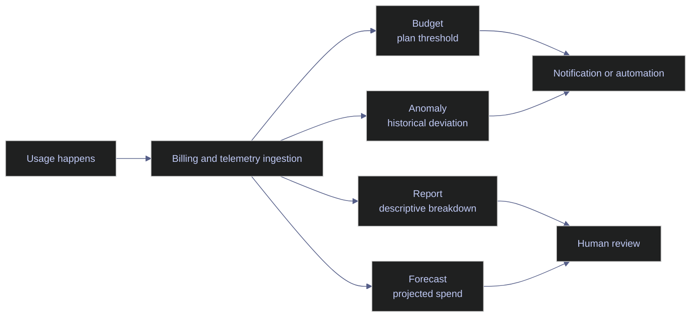

# GCP Cost Monitoring and Budgets

> [!abstract]- Summary
>
> Covers the live cost-control plane for `bq-wh-nb`, separating budgets, anomalies, reports, forecasts, and workload proxies so operators can respond safely when the project can spend money but still lacks a fully wired FinOps control surface.
>
> **Cost-control state and missing surfaces**
> - Confirms that the project currently lacks a complete monitoring plane: there is no billing export dataset, `billingbudgets.googleapis.com` is disabled, `recommender.googleapis.com` is disabled, `cloudscheduler.googleapis.com` is disabled, and Pub/Sub has no topics or subscriptions for programmatic cost notifications
> - Explains that a failed `gcloud billing budgets list` call in this project proves the Budget API is disabled, not that zero budget objects necessarily exist
> - Shows why budgets, scheduled automation, recommendation-backed optimization, and Pub/Sub notification delivery cannot be documented as live operational reality yet
>
> **Budgets, anomalies, reports, and forecasts**
> - Distinguishes budgets as plan-threshold controls, anomalies as historical-deviation signals, reports as descriptive breakdowns, and forecasts as projected month-end spend estimates
> - Explains why collapsing all four into one vague "cost alerting" concept produces noisy automation and inaccurate runbooks
> - Maps each surface to the current project status so missing APIs are treated as blocked control-plane capabilities rather than as healthy zero-state surfaces
>
> **Workload proxies while export is absent**
> - Uses BigQuery `region-europe-west1.INFORMATION_SCHEMA.JOBS_BY_PROJECT` to rank principals, query counts, bytes processed, slot consumption, and most-referenced tables as temporary cost signals
> - Uses NAT flow logs and the Monitoring API metric `logging.googleapis.com/billing/bytes_ingested` as supporting signals when network or logging costs are suspected
> - Emphasizes that these are workload proxies for investigation and trend clues, not invoice-grade cost rows or authoritative spend history
>
> **Runbooks and control-plane sequencing**
> - Provides the safe build order for the missing control plane: enable standard Cloud Billing export first, then enable Budget API, Pub/Sub, Cloud Scheduler, and Recommender only when each surface will actually be used
> - Documents conceptual-but-not-executed workflows for Billing Reports, budget-to-Pub/Sub delivery, anomaly review, and FinOps hub so the note does not pretend those surfaces were validated live
> - Includes incident-style runbooks for missing budget visibility, suspected BigQuery spend spikes, network drift, and logging-cost drift
>
> **Operations and safety**
> - Warnings: a spend-capable project can still lack its cost-control plane, `SERVICE_DISABLED` does not prove a true zero state, workload telemetry is not billing export, same-day data is often incomplete because of export lag, and disabling billing is an outage action rather than routine cost governance
> - Recommendations: enable billing export first; wire Budget API, Pub/Sub, Scheduler, and Recommender only when ready to use them; prefer selective enforcement to full billing shutdown; and document which resources are safe to stop before automating any response
> - Troubleshooting: 4 runbooks covering missing budget visibility, BigQuery spend suspicion without export, suspected network cost drift, and suspected logging cost drift

> [!note]- Glossary
>
> **Budget**
> - A planned spend ceiling or threshold for a billing scope such as a billing account or project.
> - It is the control surface that tells operators whether real spend is drifting away from plan.
>
> > [!warning] Budget is not a hard cap
> >
> > A budget does not stop spending by itself. Without notifications or automation, it remains an observation mechanism rather than an enforcement mechanism.
>
> ---
>
> **Threshold rule**
> - A percentage of the budget amount that triggers a notification when billing data crosses it.
> - It turns a budget from passive configuration into an alerting signal.
>
> > [!warning] Alert arrives after ingestion
> >
> > Threshold notifications depend on billing-data ingestion. They do not fire before the underlying usage exists.
>
> ---
>
> **Anomaly**
> - A spend pattern that deviates materially from recent historical behavior.
> - It catches surprises that a static monthly threshold can miss even when the project has not crossed budget yet.
>
> > [!warning] Healthy month can still spike
> >
> > A month can remain under budget overall and still contain a meaningful anomaly early in the cycle. Budget adherence and anomaly detection answer different questions.
>
> ---
>
> **Report**
> - A descriptive breakdown of past or current spend by dimensions such as service, SKU, or label.
> - It is the surface used to explain what changed after a cost increase has been observed.
>
> > [!info] Explanation, not alerting
> >
> > Reports tell you what happened. They do not tell you first that something unusual needs intervention.
>
> ---
>
> **Forecast**
> - A projected future spend estimate based on current usage patterns and historical behavior.
> - It helps operators decide whether the month is likely to exceed plan before the invoice closes.
>
> > [!warning] Projection is not invoice
> >
> > Forecasts are useful for planning, but they remain estimates. They should not be confused with billed truth or settlement data.
>
> ---
>
> **Programmatic notification**
> - A machine-readable event, often delivered through Pub/Sub, when a budget or anomaly surface emits a signal.
> - It is the handoff point for Slack, ticketing, Cloud Run, or other selective-enforcement workflows.
>
> > [!warning] Needs plumbing beyond the budget
> >
> > The budget object alone is not enough. API enablement, Pub/Sub topics, subscribers, and IAM all have to exist for the notification path to be real.
>
> ---
>
> **FinOps hub**
> - Google Cloud's optimization and recommendation surface for cost and usage efficiency.
> - It centralizes rightsizing and other efficiency guidance that operators should review regularly once the recommendation plane is active.
>
> > [!warning] Depends on recommendation surfaces
> >
> > FinOps hub is only as real as the underlying recommendation APIs and data. In this project, those surfaces are not enabled yet.
>
> ---
>
> **Export lag**
> - The delay between usage happening and the corresponding telemetry or billing data becoming queryable.
> - It matters because partial-day data can look like a sudden spike or sudden drop when the pipeline is simply incomplete.
>
> > [!warning] Same-day analysis is incomplete
> >
> > Cost reviews that treat early or mid-day numbers as full truth often create false positives. Delay-aware interpretation is part of safe FinOps.
>
> ---
>
> **Selective enforcement**
> - A targeted response such as stopping non-critical resources instead of disabling billing for the entire project.
> - It reduces spend while preserving the core platform and avoiding a self-inflicted outage.
>
> > [!warning] Needs allowlist and rollback
> >
> > Selective enforcement is only safe when the team already knows which resources are non-critical and how to reverse the action quickly.
>
> ---
>
> **Cloud Billing Budget API / `billingbudgets.googleapis.com`**
> - The API surface that makes budget objects queryable and manageable programmatically.
> - It is the capability gate for `gcloud billing budgets` and any automation built on budget configuration.
>
> > [!warning] Disabled blocks visibility
> >
> > In `bq-wh-nb`, this API is disabled. That means failed budget queries reflect a missing surface, not a proven absence of budget definitions.
>
> ---
>
> **Recommender API / `recommender.googleapis.com`**
> - The API that exposes recommendation-backed optimization data such as machine-type rightsizing suggestions.
> - It is the prerequisite for treating recommendation-driven cost optimization as a live workflow.
>
> > [!warning] No recommendations without API
> >
> > If the Recommender API is disabled, the absence of results is not evidence that no optimization opportunities exist. It only proves the surface is unavailable.
>
> ---
>
> **Workload proxy**
> - A telemetry signal that approximates cost drivers when real billing-export rows are unavailable.
> - It lets operators investigate likely sources of spend using query bytes, slot time, NAT logs, or logging-ingestion metrics without pretending those signals are invoices.
>
> > [!warning] Proxy is not billed cost
> >
> > Workload proxies are useful for direction and triage, but they should never be described as invoice-grade cost truth.
>
> ---
>
> **`JOBS_BY_PROJECT`**
> - The BigQuery `INFORMATION_SCHEMA` view that exposes recent job metadata such as user, bytes processed, and slot consumption.
> - It is the strongest available analytical workload proxy in this note while billing export is missing.
>
> > [!info] Good for actor attribution
> >
> > This view helps answer who is scanning data and which principals or tables dominate the observed analytical workload, even though it is not a billing table.
>
> ---
>
> **`logging.googleapis.com/billing/bytes_ingested`**
> - The Cloud Monitoring metric that tracks billed log-ingestion bytes.
> - It is the supporting signal used here to detect whether logging volume is starting to become a real cost driver.
>
> > [!info] Trend signal before export
> >
> > Even before Cloud Billing export exists, this metric can reveal whether logging ingestion is flat, rising, or noisy after a platform change.
>
> ---
>
> **Pub/Sub topic**
> - The messaging destination that would carry budget or anomaly notifications into downstream automation.
> - It is the transport boundary required for programmatic cost responses in this note's architecture.
>
> > [!warning] Empty means no delivery path
> >
> > In the current project, no Pub/Sub topics or subscriptions exist. There is therefore no live machine-readable notification channel for budgets or anomalies today.
>
> ---
>
> **Cloud Scheduler**
> - The managed scheduling surface used to run periodic cost checks, notifications, or cleanup automations.
> - It matters when a team wants recurring budget validation or anomaly triage jobs without manual intervention.
>
> > [!warning] Scheduled automation is blocked
> >
> > If `cloudscheduler.googleapis.com` is disabled, there is no active scheduler plane to carry recurring cost-control jobs, regardless of what a runbook assumes.
>
> ---
>
> **Billing-export dataset**
> - The BigQuery dataset that would hold Cloud Billing managed export tables for invoice-grade spend analysis.
> - It is the missing foundation beneath budgets, anomaly validation, chargeback, and most defensible cost dashboards in `bq-wh-nb`.
>
> > [!warning] Missing foundation blocks maturity
> >
> > Without billing export, the project can still investigate workload behavior, but it cannot support serious reconciliation, trend SQL, or export-backed forecasting.

## Why This Matters

Cost monitoring fails in two common ways. The first is no control plane at all, where teams only discover spend at invoice time. The second is a fake control plane, where dashboards and notes assume exports, budgets, or anomaly feeds exist even though the project has never enabled them. `bq-wh-nb` is currently in the second category if you rely on the old placeholder chapter, so the safe path is to document exactly which surfaces exist and which do not.


## Conceptual Model

Budgets, anomalies, reports, and forecasts answer different questions and should not be collapsed into one vague "cost alerting" concept.



## Live Cost-Control State

The current project state is incomplete but explicit:

- Budgets cannot be listed because `billingbudgets.googleapis.com` is disabled on `bq-wh-nb`.
- Pub/Sub has no topics and no subscriptions, so there is no live delivery path for programmatic budget or anomaly notifications.
- Cloud Scheduler is disabled, so there is no live scheduled automation surface in the project.
- Recommender is disabled, so FinOps hub and recommendation-backed optimization workflows are blocked.

### PowerShell / Linux | gcloud | inspect the current cost-control surfaces

These commands establish whether the project has a real budgeting and automation plane or only the underlying billable services.

#### Attempt to list billing budgets

**When to run:** Run this before claiming budgets exist or before troubleshooting a missing budget notification.
**Trigger:** Use it when building a cost control note, budget automation, or runbook for the current billing account.
**Context:** This is a read-only command against the billing account, but it still depends on the Cloud Billing Budget API being enabled for the consumer project.
**Purpose:** Verify whether budgets are queryable from the current project context.

| Field | Source column | Unit / type | Meaning |
|---|---|---|---|
| `[]` | CLI result | JSON array | The command returns no budget objects before failing. |
| `service` | Error metadata | STRING | API service that blocked the command. |
| `reason` | Error metadata | STRING | Primary failure reason returned by Google APIs. |
| `activationUrl` | Error metadata | STRING | The exact enablement URL for the missing API. |

*This command tries to enumerate budgets on the live billing account.*

```powershell
gcloud billing budgets list --billing-account=0190CF-C61D5A-F08831 --format=json
```

```text
[]
API [billingbudgets.googleapis.com] not enabled on project [bq-wh-nb].
ERROR: (gcloud.billing.budgets.list) ... Cloud Billing Budget API has not been used in project bq-wh-nb before or it is disabled.
...
service: billingbudgets.googleapis.com
reason: SERVICE_DISABLED
```

This is not evidence of zero budgets. It is evidence that the current project cannot even query the budget surface yet.

#### Check whether Pub/Sub topics exist for programmatic notifications

**When to run:** Run this before describing budget-to-Pub/Sub or anomaly-to-Pub/Sub automation as if it already exists.
**Trigger:** Use it when validating notification plumbing.
**Context:** This is a read-only project inventory call against Pub/Sub.
**Purpose:** Confirm whether the project currently has a message bus that could receive billing notifications.

| Field | Source column | Unit / type | Meaning |
|---|---|---|---|
| JSON array length | CLI result | INTEGER | Number of topics returned by the project inventory. |

*This command lists Pub/Sub topics in `bq-wh-nb`.*

```powershell
gcloud pubsub topics list --format=json
```

```text
[]
```

No topics means there is currently no destination for budget or anomaly notifications.

#### Check whether Pub/Sub subscriptions exist

**When to run:** Run this after checking topics and before assuming any downstream consumer exists.
**Trigger:** Use it when a workflow claims a Cloud Run service, function, or worker consumes billing events.
**Context:** This is a read-only Pub/Sub inventory lookup.
**Purpose:** Confirm whether any subscriber exists to process cost-control messages.

| Field | Source column | Unit / type | Meaning |
|---|---|---|---|
| JSON array length | CLI result | INTEGER | Number of subscriptions visible in the project. |

*This command lists Pub/Sub subscriptions in `bq-wh-nb`.*

```powershell
gcloud pubsub subscriptions list --format=json
```

```text
[]
```

This confirms there is no current consumer path for cost notifications.

#### Check whether Cloud Scheduler exists for automation

**When to run:** Run this before documenting scheduled anomaly checks or budget-validation jobs.
**Trigger:** Use it when a chapter or runbook mentions scheduled Slack, Cloud Run, or cleanup actions.
**Context:** This read-only command still depends on the Cloud Scheduler API being enabled on the project.
**Purpose:** Verify whether the project can enumerate scheduler jobs today.

| Field | Source column | Unit / type | Meaning |
|---|---|---|---|
| `service` | Error metadata | STRING | API that blocked the command. |
| `reason` | Error metadata | STRING | Google API failure reason. |

*This command checks for scheduler jobs in `europe-west1`.*

```powershell
gcloud scheduler jobs list --location=europe-west1 --format=json
```

```text
[]
API [cloudscheduler.googleapis.com] not enabled on project [bq-wh-nb].
ERROR: (gcloud.scheduler.jobs.list) PERMISSION_DENIED: Cloud Scheduler API has not been used in project bq-wh-nb before or it is disabled.
...
service: cloudscheduler.googleapis.com
reason: SERVICE_DISABLED
```

Scheduled cost automation is not available until the API is enabled.

#### Check whether recommendations are available

**When to run:** Run this before describing FinOps hub or recommendation-driven optimization as an active workflow.
**Trigger:** Use it when a review depends on rightsizing or idle-resource recommendations.
**Context:** This is a read-only Recommender API call scoped to the project and zone.
**Purpose:** Verify whether recommendation-backed optimization is queryable today.

| Field | Source column | Unit / type | Meaning |
|---|---|---|---|
| `service` | Error metadata | STRING | API that blocked the lookup. |
| `reason` | Error metadata | STRING | Returned failure reason. |

*This command attempts to list VM rightsizing recommendations for `bq-wh-nb`.*

```powershell
gcloud recommender recommendations list `
  --recommender=google.compute.instance.MachineTypeRecommender `
  --location=europe-west1-b `
  --project=bq-wh-nb `
  --format=json
```

```text
[]
API [recommender.googleapis.com] not enabled on project [bq-wh-nb].
ERROR: (gcloud.recommender.recommendations.list) PERMISSION_DENIED: Recommender API has not been used in project bq-wh-nb before or it is disabled.
...
service: recommender.googleapis.com
reason: SERVICE_DISABLED
```

FinOps hub cannot be treated as live and queryable until the recommendation surface is enabled.

| Flag | Syntax | Description |
|---|---|---|
| `--billing-account` | `--billing-account=0190CF-C61D5A-F08831` | Targets the billing account rather than the active project alone. |
| `--location` | `--location=europe-west1` | Scopes regional control-plane queries. |
| `--recommender` | `--recommender=google.compute.instance.MachineTypeRecommender` | Selects the recommendation family being queried. |
| `--format` | `--format=json` | Preserves the raw API failure metadata and empty-array result. |

> [!warning] The Cost Control Plane Is Not Wired Yet
>
> `bq-wh-nb` can spend money today, but budgets, scheduled automation, and recommendation-driven optimization are not active project capabilities yet. Treat any document that assumes they already exist as inaccurate.

> [!success] Build The Control Plane In This Order
>
> - Enable standard Cloud Billing export first so there is invoice-grade data.
> - Enable `billingbudgets.googleapis.com`, `pubsub.googleapis.com`, `cloudscheduler.googleapis.com`, and `recommender.googleapis.com` only when you are ready to use them.
> - Create a Pub/Sub topic and subscriber before you document programmatic notifications as operational reality.

### PowerShell / Linux | BigQuery | analyze workload signals while billing export is absent

Without billing export, the safest temporary cost proxy is workload telemetry. BigQuery job metadata cannot replace invoice data, but it does show who is scanning data and which tables dominate analytical activity.

#### Query BigQuery jobs by user for the last 30 days

**When to run:** Run this when billing export is missing but you still need to understand which principals drive query activity.
**Trigger:** Use it during spend reviews, sudden query spikes, or TCO work.
**Context:** This is a read-only SQL query against `region-europe-west1.INFORMATION_SCHEMA.JOBS_BY_PROJECT`.
**Purpose:** Rank users and service accounts by query count, bytes processed, and slot consumption.

| Field | Source column | Unit / type | Meaning |
|---|---|---|---|
| `user_email` | `JOBS_BY_PROJECT.user_email` | STRING | Principal that submitted the query job. |
| `query_count` | `COUNT(*)` | INTEGER | Number of completed query jobs in the time window. |
| `total_bytes_processed` | `SUM(total_bytes_processed)` | INTEGER bytes | Total logical bytes processed by that principal. |
| `total_slot_ms` | `SUM(total_slot_ms)` | INTEGER ms | Aggregate slot time consumed by that principal. |

*This query summarizes BigQuery query activity by principal for the last 30 days.*

```sql
SELECT
  user_email,
  COUNT(*) AS query_count,
  SUM(total_bytes_processed) AS total_bytes_processed,
  SUM(total_slot_ms) AS total_slot_ms
FROM `region-europe-west1`.INFORMATION_SCHEMA.JOBS_BY_PROJECT
WHERE creation_time >= TIMESTAMP_SUB(CURRENT_TIMESTAMP(), INTERVAL 30 DAY)
  AND job_type = 'QUERY'
  AND state = 'DONE'
GROUP BY user_email
ORDER BY total_bytes_processed DESC
LIMIT 20
```

| user_email | query_count | total_bytes_processed | total_slot_ms |
|---|---:|---:|---:|
| `alexper.recovery@gmail.com` | 57 | 201346831 | 2531 |
| `bq-wh-sa@bq-wh-nb.iam.gserviceaccount.com` | 85 | 83859334 | 117943 |
| `github-actions-sa@bq-wh-nb.iam.gserviceaccount.com` | 12 | 616435 | 296 |

The current query volume is small in absolute terms, but the service account consumes far more slot time than the human user, which is a useful signal for scheduled or pipeline-driven work.

#### Query the most-referenced tables by bytes processed

**When to run:** Run this when you need to find which datasets or tables are most likely to drive analytical cost.
**Trigger:** Use it after a spike, before designing budgets, or during TCO modeling.
**Context:** This is a read-only SQL query that unnests `referenced_tables` from `JOBS_BY_PROJECT`.
**Purpose:** Identify the tables and metadata surfaces most often touched by recent queries.

| Field | Source column | Unit / type | Meaning |
|---|---|---|---|
| `project_id` | `referenced_tables.project_id` | STRING | Project that owns the referenced table. |
| `dataset_id` | `referenced_tables.dataset_id` | STRING | Dataset containing the referenced table. |
| `table_id` | `referenced_tables.table_id` | STRING | Table or metadata view referenced by the query. |
| `query_count` | `COUNT(*)` | INTEGER | Number of queries touching that object. |
| `total_bytes_processed` | `SUM(total_bytes_processed)` | INTEGER bytes | Aggregate bytes processed across those queries. |

*This query ranks referenced tables by bytes processed over the last 30 days.*

```sql
SELECT
  referenced_tables.project_id AS project_id,
  referenced_tables.dataset_id AS dataset_id,
  referenced_tables.table_id AS table_id,
  COUNT(*) AS query_count,
  SUM(total_bytes_processed) AS total_bytes_processed
FROM `region-europe-west1`.INFORMATION_SCHEMA.JOBS_BY_PROJECT,
UNNEST(referenced_tables) AS referenced_tables
WHERE creation_time >= TIMESTAMP_SUB(CURRENT_TIMESTAMP(), INTERVAL 30 DAY)
  AND job_type = 'QUERY'
  AND state = 'DONE'
GROUP BY project_id, dataset_id, table_id
ORDER BY total_bytes_processed DESC
LIMIT 20
```

| project_id | dataset_id | table_id | query_count | total_bytes_processed |
|---|---|---|---:|---:|
| `bq-wh-nb` | `stoxx_silver` | `eurostoxx50_ohlcv` | 37 | 62318280 |
| `bq-wh-nb` | `stoxx_gold` | `TABLES` | 10 | 41943040 |
| `bq-wh-nb` | `stoxx_gold` | `COLUMNS` | 10 | 41943040 |
| `bq-wh-nb` | `stoxx_silver` | `index_dim` | 22 | 6380036 |
| `bq-wh-nb` | `stoxx_bronze` | `trading_calendar` | 16 | 3270232 |
| `bq-wh-nb` | `stoxx_gold` | `scores_daily` | 5 | 2269270 |

This result shows a useful anti-pattern: metadata introspection through `INFORMATION_SCHEMA` is itself a visible analytical workload. In small environments the cost is tiny, but it still proves that schema exploration can dominate bytes processed when the business tables are small.

| Flag | Syntax | Description |
|---|---|---|
| `--use_legacy_sql` | `--use_legacy_sql=false` | Forces GoogleSQL so `INFORMATION_SCHEMA` works as written. |
| `--format` | `--format=prettyjson` | Returns structured result rows when the query is run through `bq query`. |

### PowerShell / Linux | Logging / Monitoring APIs | inspect supporting cost signals

When billing export is absent, resource telemetry still helps isolate likely cost paths such as NAT use and logging growth.

#### Read recent Cloud NAT flow logs

**When to run:** Run this when network egress or NAT gateway usage is suspected to be part of a cost increase.
**Trigger:** Use it during TCO reviews or after seeing unexplained internet-facing traffic.
**Context:** This is a read-only Cloud Logging query over NAT gateway flow logs.
**Purpose:** Confirm whether a VM is actively using Cloud NAT and where the traffic is going.

| Field | Source column | Unit / type | Meaning |
|---|---|---|---|
| `endpoint.vm_name` | `jsonPayload.endpoint.vm_name` | STRING | VM using the NAT gateway. |
| `gateway_name` | `jsonPayload.gateway_identifiers.gateway_name` | STRING | NAT gateway serving the connection. |
| `dest_ip` | `jsonPayload.connection.dest_ip` | STRING | Remote endpoint reached through NAT. |
| `nat_ip` | `jsonPayload.connection.nat_ip` | STRING | Public NAT IP address used for the translation. |

*This command reads two recent NAT flow log entries from the project.*

```powershell
gcloud logging read 'resource.type="nat_gateway"' --limit=2 --freshness=30d --format=json
```

```text
[
  {
    "jsonPayload": {
      "connection": {
        "dest_ip": "185.125.188.57",
        "nat_ip": "34.52.196.121",
        "src_ip": "10.132.0.8"
      },
      "endpoint": {
        "vm_name": "stoxx-vm",
        "region": "europe-west1",
        "zone": "europe-west1-b"
      },
      "gateway_identifiers": {
        "gateway_name": "stoxx-nat",
        "router_name": "stoxx-router"
      }
    },
    "resource": {
      "type": "nat_gateway"
    }
  }
]
```

This does not quantify the bill, but it proves that `stoxx-vm` is actively using `stoxx-nat`, so NAT is not merely an unused configuration artifact.

#### Query Cloud Logging billing bytes via the Monitoring API

**When to run:** Run this when you need to know whether logging volume is drifting upward before it becomes a billed ingestion issue.
**Trigger:** Use it during weekly FinOps review or after noisy service changes.
**Context:** This is a read-only Monitoring API call using the active `gcloud` access token.
**Purpose:** Retrieve recent points for `logging.googleapis.com/billing/bytes_ingested`.

| Field | Source column | Unit / type | Meaning |
|---|---|---|---|
| `resource_type` | `metric.labels.resource_type` | STRING | Resource classification for the ingested log bytes. |
| `endTime` | `points[].interval.endTime` | TIMESTAMP | End of the sampled minute interval. |
| `int64Value` | `points[].value.int64Value` | INTEGER bytes | Bytes ingested for that interval. |

*This PowerShell call queries recent `logging.googleapis.com/billing/bytes_ingested` time-series data for `bq-wh-nb`. The excerpt below is trimmed to three recent points for readability.*

```powershell
$token = gcloud auth print-access-token
$headers = @{ Authorization = "Bearer $token" }
$project = "projects/bq-wh-nb"
$filter = [System.Uri]::EscapeDataString('metric.type="logging.googleapis.com/billing/bytes_ingested"')
$intervalEnd = (Get-Date).ToUniversalTime().ToString("o")
$intervalStart = (Get-Date).ToUniversalTime().AddDays(-1).ToString("o")
$url = "https://monitoring.googleapis.com/v3/$project/timeSeries?filter=$filter&interval.endTime=$intervalEnd&interval.startTime=$intervalStart&view=FULL"
Invoke-RestMethod -Headers $headers -Uri $url
```

```text
{
  "metric": {
    "labels": {
      "resource_type": "audited_resource"
    },
    "type": "logging.googleapis.com/billing/bytes_ingested"
  },
  "points": [
    {
      "interval": { "endTime": "2026-04-13T15:37:00Z" },
      "value": { "int64Value": "3530" }
    },
    {
      "interval": { "endTime": "2026-04-13T15:36:00Z" },
      "value": { "int64Value": "2352" }
    },
    {
      "interval": { "endTime": "2026-04-13T15:35:00Z" },
      "value": { "int64Value": "1265" }
    }
  ]
}
```

Current logging ingestion is tiny. The operational value here is not the absolute number. It is that the project now has a live metric you can trend, threshold, and compare over time even before billing export is enabled.

| Flag | Syntax | Description |
|---|---|---|
| `--freshness` | `--freshness=30d` | Limits the Cloud Logging query horizon. |
| `--limit` | `--limit=2` | Returns a compact result set for manual inspection. |
| `view` | `view=FULL` | Requests full time-series points from the Monitoring API. |

## Budget Vs Anomaly Vs Report Vs Forecast

Each surface answers a different operational question. Mixing them together creates noisy automation and poor runbooks.

| Surface | Operational question | Current live status in `bq-wh-nb` | Correct action |
|---|---|---|---|
| Budget | "Are we crossing a planned spend threshold?" | Blocked by disabled Budget API | Enable the API, then define thresholds and destinations. |
| Anomaly | "Is today materially different from recent history?" | Native anomaly review not validated here | Use workload proxies now; enable billing export and anomaly surfaces next. |
| Report | "What changed by service, SKU, project, or label?" | Console surface exists conceptually, but export-backed detail is absent | Treat reports as a post-export step, not as a current live workflow. |
| Forecast | "If the month continues like this, where do we land?" | Console surface exists conceptually; current project lacks export-backed spend history | Use conservative manual forecasting until billing export is enabled. |

## Important Conceptual Or Console Workflows Not Safely Executed Here

Some Google Cloud cost-management features are important enough to document even when the current project cannot validate them live yet.

| Surface | What the platform supports | Why it was not executed here | Safe next step |
|---|---|---|---|
| Cloud Billing Reports | Spend trend analysis and forecasting in the console | The project has no billing export dataset and this note stays CLI/API-grounded | Use Reports after export is enabled and compare it to BigQuery export rows. |
| Budget email and Pub/Sub notifications | Threshold notifications and automation hooks | The Budget API is disabled and Pub/Sub is empty | Enable Budget API, create a topic, then validate delivery with a non-destructive test budget. |
| Anomaly detection | Spend anomaly review and optional notifications | The project does not yet have the surrounding budget/export plumbing documented as active | Enable export first, then review anomalies against invoice-grade data. |
| FinOps hub | Recommendation and optimization review surface | `recommender.googleapis.com` is disabled here | Enable Recommender and review outputs before writing optimization automation. |

## Recommendations / Production Rules

- Do not confuse "no budgets returned" with "no budgets exist" until you prove the Budget API is enabled.
- Treat workload telemetry as a proxy, not a replacement, for billing export.
- Use budgets for plan adherence and anomalies for historical deviation; one should not replace the other.
- Prefer selective enforcement such as stopping non-critical resources or throttling optional workloads; disabling billing for the whole project is an outage response, not a routine budget action.
- Never automate cost response before you know which resources are safe to stop and which are business-critical.
- Add a billing export dataset before you invest in dashboards, because every serious trend, reconciliation, and forecast depends on it.

## Troubleshooting / Incident-Response Runbooks

### Missing budget visibility

- Confirm the billing account ID with `gcloud billing accounts list`.
- Run `gcloud billing budgets list ...`.
- If the result shows `SERVICE_DISABLED`, enable `billingbudgets.googleapis.com` in the consumer project before debugging IAM any further.

### Sudden BigQuery spend suspicion without billing export

- Run the `JOBS_BY_PROJECT` query by principal to isolate the actor.
- Run the referenced-tables query to find which tables or metadata scans dominate bytes processed.
- Do not describe the result as invoice truth; describe it as a workload proxy until export exists.

### Suspected network cost drift

- Read recent NAT flow logs.
- Confirm whether the traffic is genuine external dependency traffic or an avoidable pattern that could use Private Google Access.
- Only then decide whether the NAT gateway is a justified recurring driver.

### Suspected logging cost drift

- Query `logging.googleapis.com/billing/bytes_ingested`.
- Compare recent point density and magnitude to the pre-change baseline.
- If the metric grows, trace the producing resource type before changing retention or exclusions blindly.

## Quick Reference

| Question | Live answer |
|---|---|
| Can the project list billing budgets today? | No; `billingbudgets.googleapis.com` is disabled. |
| Is there a Pub/Sub path for billing notifications? | No; topics and subscriptions are both empty. |
| Is scheduled cost automation available? | No; Cloud Scheduler API is disabled. |
| Are recommendation-backed optimizations available? | No; Recommender API is disabled. |
| What can be used right now for cost clues? | BigQuery `INFORMATION_SCHEMA`, NAT flow logs, and `logging.googleapis.com/billing/bytes_ingested`. |

## Links To Related Notes In The Vault

- [01 - GCP Billing and Pricing](01-gcp-billing-and-pricing.md)
- [03 - GCP Total Cost of Ownership](03-gcp-total-cost-of-ownership.md)
- [01 - Cloud Logging](../07-Logging/01-cloud-logging.md)
- [02 - Cloud Monitoring Metrics](../07-Logging/02-cloud-monitoring-metrics.md)
