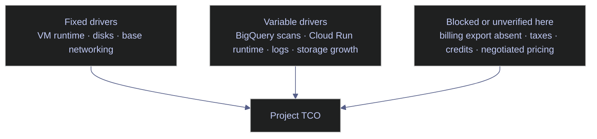

# GCP Total Cost of Ownership

> [!abstract]- Summary
>
> Covers the live total cost of ownership baseline for `bq-wh-nb`, using verified inventory, current public prices, and observed workload shape to separate what is fixed, what is variable, and what still cannot be defended without billing export.
>
> **Current TCO frame**
> - Defines the project's current cost structure around two always-on VMs, five attached persistent disks, small regional storage buckets, two Cloud Run jobs with very low observed runtime, small BigQuery workloads, and no visible Compute Engine or BigQuery commitments
> - Splits TCO into fixed drivers, variable drivers, and blocked or unverified components so the note does not confuse measured inventory with missing invoice-grade evidence
> - Explains why a live, project-grounded TCO baseline is more defensible than a generic reference architecture estimate built from imaginary volumes and stale rate cards
>
> **Inventory and workload measurement**
> - Uses `gcloud compute instances list`, `gcloud compute disks list`, and `gcloud storage du -s` to inventory always-on compute, attached persistent disks, and current bucket footprint
> - Uses BigQuery `region-europe-west1.INFORMATION_SCHEMA.JOBS_BY_PROJECT`, `gcloud run jobs list`, and `gcloud run jobs executions list` to measure current analytical and serverless workload intensity
> - Establishes that the current project is still dominated by fixed infrastructure rather than by BigQuery scans or Cloud Run execution time
>
> **Live pricing and baseline calculation**
> - Uses the Cloud Billing Catalog API / Pricing API in `CZK` to retrieve current E2 compute and persistent-disk list prices that match the actual inventory in `europe-west1`
> - Translates that live pricing plus current VM and disk sizes into a recurring monthly list-price floor, then separately estimates the current observed Cloud Run and BigQuery variable footprint
> - Shows that the current recurring floor is about `2391.0729 CZK` per month from the two VMs and five disks, while observed Cloud Run and BigQuery usage is currently financially negligible
>
> **Scenario analysis and decision points**
> - Compares lightweight API, batch-ingestion, Airflow-centric, streaming, and warehouse-heavy scenarios using the current project state rather than hypothetical enterprise-scale assumptions
> - Explains why the biggest current lever is VM rightsizing or off-hours shutdown, not BigQuery slot purchases or Cloud Run redesign
> - Calls out still-unverified drivers such as NAT, egress, taxes, credits, and invoice reconciliation, which remain blocked by the absence of billing export
>
> **Operations and safety**
> - Warnings: static architecture estimates age badly, current list prices are not effective invoice prices, shared-core VM math must match the live SKU, small free-tier workloads can hide future growth, and absent billing export blocks invoice-grade reconciliation
> - Recommendations: avoid BigQuery slots for now, focus on VM rightsizing and off-hours shutdown, do not remove NAT blindly, do not over-focus on tiny current GCS storage, and fix attribution before attempting chargeback
> - Troubleshooting: 4 runbooks covering a TCO baseline that looks too low, BigQuery suddenly becoming material, Cloud Run jobs no longer looking cheap, and month-end reconciliation still being impossible

> [!note]- Glossary
>
> **Total cost of ownership / `TCO`**
> - The total cost of running a workload across compute, storage, network, and operational overhead rather than only one service line item.
> - It is the only frame in this note that can explain why a small project may still have a meaningful recurring floor.
>
> > [!warning] Some inputs remain estimates
> >
> > Without billing export, parts of TCO remain evidence-backed estimates rather than invoice truth. The note is intentionally explicit about that boundary.
>
> ---
>
> **Fixed cost driver**
> - A cost that recurs even when workload demand is low, such as an always-on VM or an attached disk.
> - It matters because fixed drivers currently dominate the monthly baseline in `bq-wh-nb`.
>
> > [!info] Fixed does not mean permanent
> >
> > Fixed usually means "currently provisioned all the time," not "architecturally unavoidable forever." Rightsizing and shutdown policy can still change it.
>
> ---
>
> **Variable cost driver**
> - A cost that grows with workload activity, such as query bytes or Cloud Run runtime.
> - It determines how the architecture scales once the current steady floor is no longer the dominant factor.
>
> > [!warning] Tiny now can grow later
> >
> > Variable drivers often look irrelevant in small environments right up until usage crosses a pricing threshold or the workload shape changes.
>
> ---
>
> **List price**
> - The public price returned by Google's pricing surface before credits, commitments, taxes, discounts, or free-tier offsets are applied.
> - It is the correct base rate for the forward-looking calculations in this note.
>
> > [!warning] Modeling rate only
> >
> > List price is suitable for baseline planning, not for claiming what the invoice actually charged after billing adjustments.
>
> ---
>
> **Effective price**
> - The actual price paid after credits, discounts, free-tier effects, and other billing adjustments are applied.
> - It is the number required for mature FinOps, chargeback, and invoice reconciliation.
>
> > [!warning] Billing export still required
> >
> > Effective price cannot be reconstructed safely here because the project still lacks billing export and commitment metadata.
>
> ---
>
> **Shared-core VM**
> - A VM shape such as `e2-medium` where the advertised vCPUs map to a fractional physical-core allocation rather than to a standard dedicated-core shape.
> - It matters because CPU-price reasoning for shared-core machines should not be copied blindly from standard-machine examples.
>
> > [!warning] Match the live SKU
> >
> > Shared-core pricing logic has to align with the verified machine family and public SKU, or the baseline becomes quietly wrong.
>
> ---
>
> **Persistent disk**
> - A Compute Engine block-storage resource that bills independently of whether the attached VM is busy or even stopped.
> - It is a meaningful part of the fixed floor in this project because five attached disks continue to exist regardless of current CPU demand.
>
> > [!warning] Stop does not remove disk cost
> >
> > Shutting down a VM reduces compute spend, but attached persistent disks still bill. TCO models that ignore that behavior systematically understate the fixed floor.
>
> ---
>
> **Cloud Run job**
> - A serverless batch execution surface that charges based on runtime and allocated resources rather than on always-on provisioning.
> - It is the main variable serverless component evaluated in this note's current workload baseline.
>
> > [!info] Runtime decides materiality
> >
> > The current Cloud Run job history is measured in seconds, not hours. That is why the present variable footprint is negligible compared with the VM floor.
>
> ---
>
> **Capacity commitment**
> - A purchased BigQuery slot commitment that changes warehouse cost analysis from pure on-demand pricing to reserved-capacity pricing.
> - It matters because BigQuery TCO becomes a different problem once commitments exist.
>
> > [!warning] None are present today
> >
> > No BigQuery capacity commitments exist in `bq-wh-nb`, so reservation-backed reasoning would be inaccurate in the current baseline.
>
> ---
>
> **Compute Engine commitment**
> - A purchased commitment that changes how long-running VM compute should be priced and interpreted.
> - It matters because recurring VM cost can look very different when covered by commitments instead of pure on-demand pricing.
>
> > [!warning] Current VM math is on-demand
> >
> > The live inventory shows no Compute Engine commitments in this project. Current VM baseline calculations should therefore remain in the on-demand list-price frame.
>
> ---
>
> **Free tier**
> - A usage threshold that carries zero public list price until consumption passes the threshold.
> - It matters because very small environments can appear nearly free on variable services until they outgrow the first pricing band.
>
> > [!warning] Hidden growth boundary
> >
> > Free-tier coverage can hide the moment when a previously negligible workload starts becoming a real billable driver. Track growth before the threshold is crossed.
>
> ---
>
> **Cloud Billing Catalog API / Pricing API**
> - The Google pricing surface used here to retrieve current public SKU rates in the billing-account currency.
> - It is how the note maps the verified inventory to live `CZK` prices instead of relying on copied documentation tables.
>
> > [!info] Prefer live currency alignment
> >
> > Pulling prices in `CZK` keeps the estimate aligned to the billing account and avoids mixing local billing with default USD examples.
>
> ---
>
> **Billing export**
> - The Cloud Billing data export that would provide invoice-grade usage and cost rows for reconciliation and mature FinOps analysis.
> - It is the missing evidence layer beneath the baseline, especially for NAT, egress, taxes, credits, and final billed totals.
>
> > [!warning] Missing evidence layer
> >
> > Without billing export, the note can defend the inventory and public-rate baseline, but it cannot prove invoice reconciliation or actual paid cost by SKU.
>
> ---
>
> **NAT cost driver**
> - The networking spend introduced when workloads traverse Cloud NAT for outbound internet access.
> - It matters because live NAT flow logs prove the path is active even though the exact billed amount is not yet defensible here.
>
> > [!warning] Do not remove blindly
> >
> > NAT can be a legitimate recurring driver. Reducing it safely requires confirming whether the traffic can move to a different access pattern such as Private Google Access or a redesigned workload path.

## Why This Matters

Static architecture estimates age badly because they are built from imaginary volumes and stale rate cards. A project-grounded TCO note should start from what actually exists, then separate what is measured, what is priced, and what is still blocked by missing billing export. In `bq-wh-nb`, that distinction changes the answer completely: the steady monthly floor is driven by VMs and disks, not by BigQuery queries or Cloud Run jobs.

> [!example] TCO Decision Fit
>
> > [!success] Appropriate
> >
> > - Use this note when you need to refresh the current monthly baseline from verified inventory, current public pricing, and observed workload shape in `bq-wh-nb`.
> > - Use it when comparing optimization options so you can tell whether a proposal targets the real dominant cost driver, such as always-on VMs and disks, rather than a negligible variable service.
> > - Use it to separate fixed, variable, and still-unverified drivers before making architecture or rightsizing decisions.
>
> > [!failure] Inappropriate
> >
> > - Do not use this note for invoice reconciliation, effective-rate analysis, or commitment amortization while billing export and paid-cost evidence are still missing.
> > - Do not make confident claims about NAT, egress, taxes, credits, or negotiated discounts from inventory and public pricing alone.
> > - Do not generalize this project’s TCO baseline into a generic GCP architecture estimate; the numbers here are tied to the live `bq-wh-nb` footprint.

## Conceptual Model

TCO is easiest to reason about when you split the platform into fixed, variable, and blocked or unverified components.



## Live Inventory Of Current Cost Drivers

The current project is small enough that the resource inventory is still the most honest starting point for TCO.

### PowerShell / Linux | gcloud | inventory always-on infrastructure

These commands identify the recurring drivers that continue to exist even if no new analytical work is executed today.

#### List running Compute Engine instances

**When to run:** Run this at the start of any TCO or rightsizing review.
**Trigger:** Use it when you need to know which workloads create the platform’s fixed compute floor.
**Context:** This is a read-only Compute Engine inventory query.
**Purpose:** Identify always-on machine types, regions, and labels.

| Field | Source column | Unit / type | Meaning |
|---|---|---|---|
| `name` | Instance metadata | STRING | VM name. |
| `zone` | Instance metadata | STRING | Zone hosting the VM. |
| `machineType.basename()` | Instance metadata | STRING | Machine type that drives compute pricing. |
| `status` | Instance metadata | STRING | Whether the instance is running and therefore accruing compute charges. |
| `labels` | Instance metadata | MAP | Attribution metadata currently applied to the instance. |

*This command lists the current Compute Engine instances in `bq-wh-nb`.*

```powershell
gcloud compute instances list --format="table(name,zone,machineType.basename(),status,labels)"
```

| name | zone | machineType.basename() | status | labels |
|---|---|---|---|---|
| `stoxx-airflow` | `europe-west1-b` | `e2-standard-2` | `RUNNING` | `{'app': 'stoxx-airflow', 'env': 'dev'}` |
| `stoxx-vm` | `europe-west1-b` | `e2-medium` | `RUNNING` | `{'app': 'stoxx-db', 'env': 'dev'}` |

Both VMs are currently running, so both contribute to the project’s steady compute floor.

#### List attached persistent disks

**When to run:** Run this whenever you compare stop-vs-delete savings or model storage-heavy VM architectures.
**Trigger:** Use it when VM costs look modest but the monthly bill still does not drop after stoppage.
**Context:** This is a read-only persistent-disk inventory query.
**Purpose:** Quantify attached disk sizes and types, which continue to bill independently of instance runtime.

| Field | Source column | Unit / type | Meaning |
|---|---|---|---|
| `name` | Disk metadata | STRING | Persistent disk name. |
| `sizeGb` | Disk metadata | INTEGER GiB | Provisioned disk size. |
| `type.basename()` | Disk metadata | STRING | Disk class used for pricing. |
| `users.len()` | Computed inventory field | INTEGER | Number of attached users; `1` means the disk is attached. |

*This command lists current persistent disks in the project.*

```powershell
gcloud compute disks list --format="table(name,zone,sizeGb,type.basename(),status,users.len())"
```

| name | zone | sizeGb | type.basename() | status | users.len() |
|---|---|---:|---|---|---:|
| `stoxx-airflow` | `europe-west1-b` | 30 | `pd-balanced` | `READY` | 1 |
| `stoxx-data` | `europe-west1-b` | 100 | `pd-ssd` | `READY` | 1 |
| `stoxx-log` | `europe-west1-b` | 20 | `pd-ssd` | `READY` | 1 |
| `stoxx-tempdb` | `europe-west1-b` | 20 | `pd-ssd` | `READY` | 1 |
| `stoxx-vm` | `europe-west1-b` | 50 | `pd-balanced` | `READY` | 1 |

The disk inventory is important because attached disks continue to bill even if the VMs are stopped.

#### Measure bucket footprint

**When to run:** Run this before treating object storage as a meaningful TCO driver.
**Trigger:** Use it when a design review assumes GCS is a large contributor to monthly cost.
**Context:** This is a read-only aggregate size query across the main workload buckets.
**Purpose:** Separate real storage cost drivers from buckets that are operationally present but financially negligible.

| Field | Source column | Unit / type | Meaning |
|---|---|---|---|
| First column | `gcloud storage du -s` result | INTEGER bytes | Total stored bytes in the bucket. |
| Second column | `gcloud storage du -s` result | STRING | Bucket URI. |

*This command measures the current footprint of the main workload buckets.*

```powershell
gcloud storage du -s gs://stoxx-bq-bucket gs://stoxx-sql-bucket gs://stoxx-stage-bucket
```

```text
20540 gs://stoxx-bq-bucket
100597760 gs://stoxx-sql-bucket
1193638 gs://stoxx-stage-bucket
```

Current GCS footprint is tiny. Separate `gcloud storage buckets describe` calls also show these buckets are `STANDARD`, regional `EUROPE-WEST1`, and currently protected by a 7-day soft-delete policy (`retentionDurationSeconds = 604800`).

| Flag | Syntax | Description |
|---|---|---|
| `--format` | `--format="table(...)"` | Projects only the fields needed for TCO inspection. |
| `-s` | `gcloud storage du -s` | Returns per-bucket totals instead of per-object output. |

### PowerShell / Linux | BigQuery / Cloud Run | measure variable workload

Variable drivers are the easiest place to make wrong assumptions. The live query and execution history shows that current workload volume is still very small.

#### Summarize BigQuery query activity by principal

**When to run:** Run this when you need to know whether analytical workloads are large enough to matter in the current TCO.
**Trigger:** Use it during warehouse design reviews and before considering BigQuery editions.
**Context:** This is a read-only SQL query against `JOBS_BY_PROJECT`.
**Purpose:** Measure current query activity without pretending it is the same as billed cost.

| Field | Source column | Unit / type | Meaning |
|---|---|---|---|
| `user_email` | `JOBS_BY_PROJECT.user_email` | STRING | Principal that submitted the queries. |
| `query_count` | `COUNT(*)` | INTEGER | Number of query jobs in the time window. |
| `total_bytes_processed` | `SUM(total_bytes_processed)` | INTEGER bytes | Logical bytes processed by those queries. |
| `total_slot_ms` | `SUM(total_slot_ms)` | INTEGER ms | Aggregate slot time used by those queries. |

*This query summarizes current BigQuery analytical activity for the last 30 days.*

```sql
SELECT
  user_email,
  COUNT(*) AS query_count,
  SUM(total_bytes_processed) AS total_bytes_processed,
  SUM(total_slot_ms) AS total_slot_ms
FROM `region-europe-west1`.INFORMATION_SCHEMA.JOBS_BY_PROJECT
WHERE creation_time >= TIMESTAMP_SUB(CURRENT_TIMESTAMP(), INTERVAL 30 DAY)
  AND job_type = 'QUERY'
  AND state = 'DONE'
GROUP BY user_email
ORDER BY total_bytes_processed DESC
LIMIT 20
```

| user_email | query_count | total_bytes_processed | total_slot_ms |
|---|---:|---:|---:|
| `alexper.recovery@gmail.com` | 57 | 201346831 | 2531 |
| `bq-wh-sa@bq-wh-nb.iam.gserviceaccount.com` | 85 | 83859334 | 117943 |
| `github-actions-sa@bq-wh-nb.iam.gserviceaccount.com` | 12 | 616435 | 296 |

The current analytical volume is far below any level that would justify BigQuery slots or capacity commitments.

#### List Cloud Run jobs

**When to run:** Run this before assuming serverless batch work is a major cost driver.
**Trigger:** Use it during TCO reviews or when batch jobs are blamed for unexpected spend.
**Context:** This is a read-only Cloud Run inventory call scoped to `europe-west1`.
**Purpose:** Identify job-level CPU, memory, and execution history.

| Field | Source column | Unit / type | Meaning |
|---|---|---|---|
| `name` | Job metadata | STRING | Cloud Run job name. |
| `template.template.containers[0].resources.limits.cpu` | Job metadata | STRING | CPU limit per task. |
| `template.template.containers[0].resources.limits.memory` | Job metadata | STRING | Memory limit per task. |
| `executionCount` | Job metadata | INTEGER | Number of recorded executions for the job. |

*This command lists current Cloud Run jobs in `europe-west1`.*

```powershell
gcloud run jobs list --region=europe-west1 --format=json
```

```text
[
  {
    "name": "stoxx-bronze-load",
    "cpu": "2",
    "memory": "2Gi",
    "executionCount": 1
  },
  {
    "name": "stoxx-stage-fetch",
    "cpu": "2",
    "memory": "2Gi",
    "executionCount": 4
  }
]
```

The current job estate is tiny: two batch jobs, both with modest resource limits.

#### Inspect recent Cloud Run execution durations

**When to run:** Run this when you need a real runtime input for Cloud Run TCO.
**Trigger:** Use it after job design changes or when a supposedly cheap batch pattern starts to look expensive.
**Context:** This is a read-only execution-history query for a single Cloud Run job.
**Purpose:** Measure actual runtime rather than assuming duration.

| Field | Source column | Unit / type | Meaning |
|---|---|---|---|
| `name` | Execution metadata | STRING | Individual execution name. |
| `completionTime` | Execution metadata | TIMESTAMP | When the execution finished. |
| `completionStatus` | Execution metadata | STRING | Whether the execution finished successfully. |
| `duration` | Execution metadata | STRING | Wall-clock runtime of the execution. |

*This command returns recent executions for `stoxx-stage-fetch`.*

```powershell
gcloud run jobs executions list --job=stoxx-stage-fetch --region=europe-west1 --format=json
```

```text
[
  { "name": "stoxx-stage-fetch-s2b48", "duration": "57.01s", "completionStatus": "completed successfully" },
  { "name": "stoxx-stage-fetch-xtrwd", "duration": "1m10.96s", "completionStatus": "completed successfully" },
  { "name": "stoxx-stage-fetch-rb465", "duration": "48.77s", "completionStatus": "completed successfully" },
  { "name": "stoxx-stage-fetch-tw826", "duration": "58.75s", "completionStatus": "completed successfully" }
]
```

The execution history confirms that current serverless batch work is measured in seconds, not hours.

| Flag | Syntax | Description |
|---|---|---|
| `--region` | `--region=europe-west1` | Scopes Cloud Run inventory and execution history to the active region. |
| `--job` | `--job=stoxx-stage-fetch` | Selects the execution history for one Cloud Run job. |
| `--format` | `--format=json` | Preserves fields needed for later cost calculations. |

### PowerShell | Cloud Billing Catalog API | translate inventory into live list prices

The goal is not to recreate the invoice. The goal is to map live inventory to current public prices in the same currency as the billing account.

#### Query live Compute Engine and disk prices

**When to run:** Run this when a TCO model needs current list prices rather than copied documentation values.
**Trigger:** Use it during baseline refreshes or before any price-sensitive design decision.
**Context:** This is a read-only Pricing API call using the active `gcloud` token.
**Purpose:** Retrieve the live rates that match the actual VM and disk types present in the project region.

| Field | Source column | Unit / type | Meaning |
|---|---|---|---|
| `description` | SKU metadata | STRING | Priced behavior exposed by the SKU. |
| `tieredRates.unitPrice` | Pricing expression | MONEY | Public list price for the SKU. |
| `effectiveTime` | Pricing metadata | TIMESTAMP | When that price became effective. |

*This PowerShell pipeline reads live list prices for E2 compute and the persistent-disk classes used by `bq-wh-nb`.*

```powershell
$token = gcloud auth print-access-token
$headers = @{ Authorization = "Bearer $token" }
$service = "6F81-5844-456A"
$pageToken = $null
$skus = @()

do {
  $url = "https://cloudbilling.googleapis.com/v1/services/$service/skus?pageSize=5000&currencyCode=CZK"
  if ($pageToken) { $url += "&pageToken=$pageToken" }
  $response = Invoke-RestMethod -Headers $headers -Uri $url
  $skus += $response.skus
  $pageToken = $response.nextPageToken
} while ($pageToken)

$skus |
  Where-Object {
    ($_.serviceRegions -contains "europe-west1") -and (
      $_.description -eq "E2 Instance Core running in EMEA" -or
      $_.description -eq "E2 Instance Ram running in EMEA" -or
      $_.description -eq "Balanced PD Capacity" -or
      $_.description -eq "SSD backed PD Capacity"
    )
  } |
  Select-Object description,
    @{n="tieredRates";e={$_.pricingInfo[0].pricingExpression.tieredRates}},
    @{n="effectiveTime";e={$_.pricingInfo[0].effectiveTime}} |
  ConvertTo-Json -Depth 8
```

```text
[
  {
    "description": "E2 Instance Core running in EMEA",
    "tieredRates": { "startUsageAmount": 0, "unitPrice": { "currencyCode": "CZK", "units": "0", "nanos": 509871109 } },
    "effectiveTime": "2026-04-13T07:00:00Z"
  },
  {
    "description": "E2 Instance Ram running in EMEA",
    "tieredRates": { "startUsageAmount": 0, "unitPrice": { "currencyCode": "CZK", "units": "0", "nanos": 68343520 } },
    "effectiveTime": "2026-04-13T07:00:00Z"
  },
  {
    "description": "Balanced PD Capacity",
    "tieredRates": { "startUsageAmount": 0, "unitPrice": { "currencyCode": "CZK", "units": "2", "nanos": 125050000 } },
    "effectiveTime": "2026-04-13T07:00:00Z"
  },
  {
    "description": "SSD backed PD Capacity",
    "tieredRates": { "startUsageAmount": 0, "unitPrice": { "currencyCode": "CZK", "units": "3", "nanos": 612585000 } },
    "effectiveTime": "2026-04-13T07:00:00Z"
  }
]
```

These prices are enough to build a current fixed-cost baseline for the existing VMs and disks.

#### Calculate the recurring monthly baseline from live inventory

**When to run:** Run this when you need a quick recurring monthly floor from the current project state.
**Trigger:** Use it after any machine-type or disk-size change.
**Context:** This is a local PowerShell calculation that uses live rates and live inventory values already verified in this note.
**Purpose:** Convert the project’s fixed infrastructure into a monthly public list-price baseline in `CZK`.

| Field | Source column | Unit / type | Meaning |
|---|---|---|---|
| `component` | Local calculation output | STRING | Resource family being priced. |
| `monthlyCzk` | Local calculation output | DECIMAL | Monthly list-price estimate for that component. |

*This PowerShell snippet calculates the recurring monthly floor from the live VM and disk inventory.*

```powershell
$vmCoreRate = 0.509871109
$vmRamRate = 0.06834352
$pdBalanced = 2.12505
$pdSsd = 3.612585
$hours = 730

$items = @()
$items += [pscustomobject]@{
  component = "stoxx-airflow vm"
  monthlyCzk = [math]::Round($hours * ((2 * $vmCoreRate) + (8 * $vmRamRate)), 4)
}
$items += [pscustomobject]@{
  component = "stoxx-vm vm"
  monthlyCzk = [math]::Round($hours * ((1 * $vmCoreRate) + (4 * $vmRamRate)), 4)
}
$items += [pscustomobject]@{
  component = "pd-balanced disks (80 GiB)"
  monthlyCzk = [math]::Round(80 * $pdBalanced, 4)
}
$items += [pscustomobject]@{
  component = "pd-ssd disks (140 GiB)"
  monthlyCzk = [math]::Round(140 * $pdSsd, 4)
}

$items | ConvertTo-Json -Depth 4
```

```text
[
  { "component": "stoxx-airflow vm", "monthlyCzk": 1143.538 },
  { "component": "stoxx-vm vm", "monthlyCzk": 571.769 },
  { "component": "pd-balanced disks (80 GiB)", "monthlyCzk": 170.004 },
  { "component": "pd-ssd disks (140 GiB)", "monthlyCzk": 505.7619 }
]
```

This is the most important result in the note. It shows that the current steady-state floor is driven by VMs and disks, not by serverless or analytical activity. The `stoxx-vm` calculation uses the shared-core `e2-medium` shape as the half-sized counterpart to `e2-standard-2`, which matches the live machine-type metadata and keeps the estimate aligned with the actual VM family.

#### Calculate the current observed variable footprint

**When to run:** Run this when you want to check whether variable drivers are still negligible or starting to compete with the fixed floor.
**Trigger:** Use it during monthly reviews or after workload growth.
**Context:** This is a local PowerShell calculation using live execution durations, live query bytes, and live list prices already verified in this note.
**Purpose:** Estimate the current variable footprint for Cloud Run jobs and BigQuery analysis.

| Field | Source column | Unit / type | Meaning |
|---|---|---|---|
| `totalSeconds` | Local calculation output | DECIMAL seconds | Summed Cloud Run execution duration. |
| `totalCzk` | Local calculation output | DECIMAL | Current list-price estimate for the measured variable workload. |
| `totalTiB` | Local calculation output | DECIMAL TiB | BigQuery bytes processed converted to tebibytes. |
| `listPriceCzkIfAboveFreeTier` | Local calculation output | DECIMAL | What the measured BigQuery workload would cost above the free tier. |

*This PowerShell snippet turns the live Cloud Run and BigQuery activity into a variable-cost estimate.*

```powershell
$jobCpuRate = 0.000382509
$jobMemRate = 0.000042501
$totalSeconds = 57.01 + 70.96 + 48.77 + 58.75 + 31.19
$bytes = 201346831 + 83859334 + 616435
$analysisRate = 159.37875

[pscustomobject]@{
  cloudRun = [pscustomobject]@{
    totalSeconds = $totalSeconds
    totalCzk = [math]::Round(($totalSeconds * 2 * $jobCpuRate) + ($totalSeconds * 2 * $jobMemRate), 6)
  }
  bigQuery = [pscustomobject]@{
    totalBytes = $bytes
    totalTiB = [math]::Round($bytes / 1099511627776, 9)
    listPriceCzkIfAboveFreeTier = [math]::Round(($bytes / 1099511627776) * $analysisRate, 6)
  }
} | ConvertTo-Json -Depth 6
```

```text
{
  "cloudRun": {
    "totalSeconds": 266.68,
    "totalCzk": 0.226683
  },
  "bigQuery": {
    "totalBytes": 285822600,
    "totalTiB": 0.000259954,
    "listPriceCzkIfAboveFreeTier": 0.041431
  }
}
```

Current variable workload is effectively negligible compared to the steady VM and disk floor. BigQuery usage is far below the first `1 TiB` analysis tier, and the measured Cloud Run executions amount to only a fraction of one `CZK`.

| Flag | Syntax | Description |
|---|---|---|
| `currencyCode` | `?currencyCode=CZK` | Keeps pricing aligned with the billing-account currency. |
| `pageSize` | `?pageSize=5000` | Retrieves a large enough SKU slice to filter locally by description and region. |
| `ConvertTo-Json -Depth 8` | `ConvertTo-Json -Depth 8` | Preserves nested tiered-rate structures in the output. |

## Current `bq-wh-nb` TCO Baseline

The live evidence points to a very clear hierarchy of cost drivers.

| Driver | Live basis | Approx monthly list price (`CZK`) | Interpretation |
|---|---|---:|---|
| `stoxx-airflow` VM | `e2-standard-2`, running | 1143.538 | Largest fixed compute driver in the project. |
| `stoxx-vm` VM | `e2-medium`, running | 571.769 | Second fixed compute driver. |
| `pd-balanced` disks | 80 GiB total | 170.004 | Persists whether or not the VMs are busy. |
| `pd-ssd` disks | 140 GiB total | 505.7619 | Meaningful fixed storage floor. |
| Cloud Run jobs | 266.68 seconds observed | 0.226683 | Operationally real but financially tiny right now. |
| BigQuery analysis | 285822600 bytes over 30 days | 0.041431 above free tier | Current usage is still tiny and effectively free at public-tier thresholds. |
| Main GCS buckets | About 0.095 GiB total | about 0.0403 | Not a material cost driver today. |

The current recurring list-price floor for just the two VMs and five attached disks is about `2391.0729 CZK` per month before free-tier effects, taxes, credits, or negotiated pricing. That is the number that matters most for this project’s current architecture.

There are also important costs that remain unverified here:

- Cloud NAT is definitely in use because live NAT flow logs show `stoxx-vm` going through `stoxx-nat`, but exact NAT spend is not defensible without billing export.
- Network egress, taxes, credits, and any future discounts are outside the evidence currently available in this project.
- There is no billing export dataset, so the note cannot reconcile these estimates to invoice rows yet.

## Data-Engineering Scenario Matrix

The current environment is small enough that scenario planning should be grounded in actual relevance, not just platform possibility.

| Scenario | Current relevance to `bq-wh-nb` | Primary fixed drivers | Primary variable drivers | Decision trigger |
|---|---|---|---|---|
| Lightweight API + scheduler + BigQuery | Low today | None significant yet | Query bytes, small serverless runtime | Only becomes relevant if Cloud Run services and Scheduler are introduced. |
| Batch ingestion + Cloud Run Jobs + GCS + BigQuery | High | Minimal fixed cost if VM dependencies are removed | Cloud Run seconds, GCS growth, BigQuery scans | Current job history proves this path is viable and cheap at small scale. |
| Airflow-centric orchestration | High | `stoxx-airflow` VM | Log growth, occasional job bursts | This is currently the largest single compute floor. |
| Streaming / event-driven ingestion | Low today | Could add always-on consumers if introduced | Pub/Sub volume, consumer runtime | Pub/Sub topics and subscriptions are currently absent. |
| Warehouse-heavy analytics | Low today | BigQuery commitments if purchased | Query bytes or slot-hours | No reservations exist and current scan volume is tiny. |

## Recommendations / Decision Points

- **Do not buy BigQuery slots yet.** Current 30-day analytical volume is only `0.000259954 TiB`, and the project has no evidence of sustained warehouse pressure.
- **Treat VM rightsizing and off-hours shutdown as the biggest current lever.** The fixed VM and disk floor dwarfs observed Cloud Run and BigQuery usage.
- **Do not remove NAT blindly.** Live logs prove `stoxx-vm` currently uses `stoxx-nat`; remove or redesign only after confirming the traffic path can move to Cloud Run or Private Google Access.
- **Do not over-focus on GCS lifecycle yet.** The bucket footprint is tiny today, though `stoxx-sql-bucket` could become material if it turns into a backup archive without lifecycle transitions.
- **Fix attribution before chargeback.** The VM labels are useful, but the project still lacks billing export and BigQuery dataset labels, so cross-team TCO is not yet defensible.

## Troubleshooting / Incident-Response Runbooks

### TCO looks higher than the inventory-based baseline

- Check for NAT, egress, tax, or logging charges that the baseline intentionally does not estimate.
- Confirm whether any new always-on service was added outside the main VM and disk inventory.
- Enable billing export before arguing over invoice deltas.

### BigQuery suddenly becomes a serious driver

- Rerun the `JOBS_BY_PROJECT` query by principal.
- Rerun the referenced-table query from the monitoring note.
- Only consider reservations or commitments after you have at least a sustained history of meaningful scan volume.

### Cloud Run jobs stop looking cheap

- Re-run job execution listings and recalculate with the same formula from this note.
- Check for retries, concurrency changes, or runtime increases before changing architecture.

### Month-end reconciliation is still impossible

- Confirm again that no billing export dataset exists.
- Enable standard usage export first.
- Only then compare inventory-based estimates to billed cost by SKU, label, and service.

## Quick Reference

| Question | Live answer |
|---|---|
| What dominates current TCO? | Running VMs and attached persistent disks. |
| Are BigQuery commitments present? | No. |
| Are Compute Engine commitments present? | No. |
| Is current Cloud Run usage material? | No; observed runtime is financially negligible. |
| Is current BigQuery query volume material? | No; it is still tiny and below the first free-tier breakpoint. |
| What is the biggest missing TCO input? | Billing export, because it is needed for invoice-grade reconciliation. |

## Links To Related Notes In The Vault

- [01 - GCP Billing and Pricing](01-gcp-billing-and-pricing.md)
- [02 - GCP Cost Monitoring and Budgets](02-gcp-cost-monitoring-and-budgets.md)
- [01 - Cloud Logging](../07-Logging/01-cloud-logging.md)
- [02 - Cloud Monitoring Metrics](../07-Logging/02-cloud-monitoring-metrics.md)
