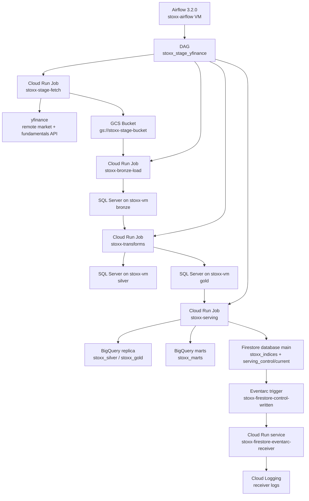

# STOXX Index Pipeline

The STOXX index pipeline ran in GCP from `yfinance` acquisition through Eventarc notification on **2026-04-13**. Raw JSON landed in GCS, SQL Server on `stoxx-vm` executed the bronze, silver, and gold layers, BigQuery held the analytical replica and marts, Firestore published the serving documents, and Eventarc emitted the downstream publish event.

Each section below focuses on one operational boundary: runtime topology, deployment, validation, and the supporting artifact bundle. The execution path stays explicit so the pipeline can be audited without relying on hidden project context.

## Related topics

- [[04-sql-server-on-compute-engine]]
- [[05-airflow-on-compute-engine]]
- [[03-cloud-run-jobs-vs-services]]
- [[01-firestore-data-model-and-operations]]
- [[02-real-time-nosql-pipelines]]
- [[05-bigquery-problems]]
- [[02-stoxx-index-pipeline-source-files]]

## Architecture overview

The architecture section defines the key terms used throughout the note, maps the runtime topology, and separates the storage and execution boundaries that make the pipeline reproducible.

### Key terms

| Term | Definition | Operational role |
|---|---|---|
| `OHLCV` | Open, high, low, close, and volume observations recorded per symbol and trading date. | Forms the raw market-history series staged from `yfinance`, landed in bronze, and historized in silver. |
| `medallion architecture` | A layered data pattern that separates raw landing, cleaned historical facts, and business-facing outputs. | Explains why SQL Server keeps distinct `bronze`, `silver`, and `gold` schemas with different contracts. |
| `DAG` | Directed acyclic graph. In Airflow, it defines task order, dependency rules, and runtime behavior for a workflow. | `stoxx_stage_yfinance` is the orchestration contract for the pipeline run. |
| `IAP` | Identity-Aware Proxy tunneling for access to private Google Cloud resources. | Administrative access to `stoxx-vm` and `stoxx-airflow` uses IAP instead of public IP exposure. |
| `break-glass` | Emergency administrative access reserved for recovery when the standard operator path fails. | `dba_break_glass` is the named SQL Server recovery login used to re-establish sysadmin access safely. |
| `CloudEvent` | A standard event envelope that carries source, subject, type, and time metadata across eventing systems. | Eventarc delivers the Firestore control-document write to the receiver service as a CloudEvent. |

### Runtime topology

The runtime topology shows where orchestration ends, where stateful processing happens, and where the serving publish boundary emits its downstream event.

*Depicts the runtime topology from external acquisition through the Firestore control-document event boundary.*



### Processing layers

The pipeline moves the same business entities across raw, operational, analytical, and serving contracts. Each layer below has a different retention model and consumer boundary.

#### Raw stage in GCS

- Stores the first durable cloud copy of the fetched `yfinance` payloads.
- Writes JSON objects under `gs://stoxx-stage-bucket` in prefixes such as `stage/`, `dimensions/`, `pulse/`, and `manifests/`.
- Forms the replay boundary between external acquisition and SQL ingestion.

#### Bronze

- Holds the newest operational SQL snapshot with minimal reshaping.
- Keeps ingestion logic simple and recoverable.
- Optimizes for reliable landing, not for historical analytics.

#### Silver

- Holds cleaned and historized records at business grain.
- Gap-fills OHLCV history and upserts daily and quarterly signals.
- Turns raw snapshots into time series that can be trusted for repeatable downstream logic.

#### Gold

- Holds business-facing metrics derived from silver.
- Computes scores, rankings, and index-level performance that products and analysts can use directly.
- Stays inside SQL Server because the transformations are already implemented there in T-SQL and Python job wrappers.

#### BigQuery replica

- Holds analytical copies of the selected SQL silver and gold tables.
- Offloads heavier analytical reads and mart builds from the SQL VM.
- Preserves a stable handoff from operational SQL to cloud analytics.

#### BigQuery marts

- Hold dashboard-oriented read models such as `mart_index_factsheet_latest` and `mart_constituent_screener_latest`.
- Apply the final aggregation grain and join logic needed by the serving layer.
- Separate business consumption models from the raw analytical replica.

#### Firestore serving layer

- Holds pre-shaped documents for low-latency application reads.
- Publishes root documents and subcollections in Firestore database `main`.
- Avoids runtime analytical joins by materializing the dashboard-facing view ahead of time.

#### Firestore control document

- Holds the publish-complete signal for the latest serving snapshot.
- Updates `serving_control/current` with `publish_id`, counts, and affected indexes.
- Creates one deliberate event boundary for Eventarc instead of treating every serving-document write as a separate downstream event.

### Runtime components

These runtime surfaces own orchestration, stateful persistence, serving publication, or event delivery. Each component description identifies the boundary it controls.

#### SQL VM `stoxx-vm`

- Hosts SQL Server 2022 and the `stoxx` medallion database.
- Runs in `europe-west1-b` on private IP `10.132.0.8`.
- Acts as the stateful operational persistence tier for bronze, silver, and gold.

#### Airflow VM `stoxx-airflow`

- Hosts Airflow 3.2.0 in Docker Compose.
- Runs in `europe-west1-b` on private IP `10.132.0.9`.
- Owns orchestration only; heavy ingestion and transformation work runs in Cloud Run jobs.

#### Stage bucket `gs://stoxx-stage-bucket`

- Holds raw JSON landing files and manifests.
- Uses regional storage with uniform bucket-level access.
- Preserves deterministic replay inputs if a downstream step fails.

#### Cloud Run job `stoxx-stage-fetch`

- Fetches market and fundamentals data from `yfinance`.
- Lands JSON into GCS.
- Last validated success ran on `2026-04-13T17:30:57Z`.

#### Cloud Run job `stoxx-bronze-load`

- Reads the staged JSON objects from GCS.
- Loads the bronze SQL tables on `stoxx-vm`.
- Last validated success ran on `2026-04-13T17:32:15Z`.

#### Cloud Run job `stoxx-transforms`

- Builds silver and gold inside SQL Server.
- Applies the historization and scoring logic.
- Last validated success ran on `2026-04-13T17:35:40Z`.

#### Cloud Run job `stoxx-serving`

- Replicates SQL outputs into BigQuery.
- Builds the BigQuery marts and publishes Firestore documents.
- Last validated success ran on `2026-04-13T18:14:04Z`.

#### BigQuery datasets `stoxx_silver`, `stoxx_gold`, `stoxx_marts`

- Hold the analytical replica and the final marts.
- Separate scalable analytical reads from the SQL operational tier.
- Were populated and validated during the live pipeline run documented here.

#### Firestore database `main`

- Holds the serving documents and the control document.
- Runs in native mode with real-time listeners available to clients.
- Provides the document-oriented serving boundary after the analytical marts are built.

#### Eventarc trigger `stoxx-firestore-control-written`

- Watches the Firestore control document for publish-complete writes.
- Routes matching Firestore CloudEvents to the receiver service.
- Acts as the first downstream observer of the serving publish boundary.

#### Receiver service `stoxx-firestore-eventarc-receiver`

- Receives Firestore CloudEvents from Eventarc.
- Logs the event payload into Cloud Logging.
- Provides visible operational proof that the end-to-end publish completed.

## Provisioning and deployment

Provisioning combines the verified SQL Server and Airflow bring-up with the BigQuery, Firestore, and Eventarc steps that complete the pipeline. The commands and outputs below show the reproducible deployment path; the full embedded scripts now live in [[02-stoxx-index-pipeline-source-files]].

### Provision the SQL target on `stoxx-vm`

The pipeline writes into the SQL Server database `stoxx`, not `stoxx_db`. The final target keeps only the medallion schemas `bronze`, `silver`, and `gold`, but it preserves the VM-specific split file layout:

- data files on `/mnt/sqldata`
- log file on `/mnt/sqllog`

The full VM and SQL bring-up is documented in [[04-sql-server-on-compute-engine]]. The pipeline-specific minimum is:

1. regain safe sysadmin access
2. create a named break-glass admin login
3. create the `stoxx_pipeline` login
4. grant the bronze and transform roles it needs
5. validate the final `stoxx` database layout

> [!warning] SQL admin recovery has two failure paths
>
> Two operator errors break the recovery boundary quickly:
>
> - Running `mssql-conf -n set-sa-password` while `mssql-server` is still active fails immediately and leaves no working admin path.
> - Writing generated passwords to instance metadata or markdown notes turns emergency credentials into standing credentials.
>
> The recovery sequence must preserve both recoverability and credential containment.

> [!success] SQL admin recovery stays bounded
>
> Stop `mssql-server`, generate fresh credentials, write them only to `/root/.stoxx_sql_login.env` under `umask 077`, reset `sa`, restart SQL Server, and then create and verify a named sysadmin login such as `dba_break_glass`.

#### Reset `sa` and write a root-only credential file

*Opens an IAP shell on the SQL VM, stops SQL Server, generates fresh credentials, writes the root-only environment file, and resets the `sa` password.*

```bash
gcloud compute ssh stoxx-vm \
  --project=bq-wh-nb \
  --zone=europe-west1-b \
  --tunnel-through-iap

sudo systemctl stop mssql-server

umask 077

SA_PWD=$(python3 - <<'PY'
import secrets
print("Sa!2026" + secrets.token_hex(10))
PY
)

BREAK_GLASS_PWD=$(python3 - <<'PY'
import secrets
print("Bg!2026" + secrets.token_hex(10))
PY
)

cat > /root/.stoxx_sql_login.env <<EOF
SA_PWD=$SA_PWD
BREAK_GLASS_LOGIN=dba_break_glass
BREAK_GLASS_PWD=$BREAK_GLASS_PWD
EOF

MSSQL_SA_PASSWORD="$SA_PWD" /opt/mssql/bin/mssql-conf -n set-sa-password
ls -l /root/.stoxx_sql_login.env
systemctl is-active mssql-server
```

*Returns the password reset result, the credential-file permissions, and the stopped SQL Server state before restart.*

```text
ForceFlush is enabled for this instance.
Failed to open password policy registry path. Using default password policy values.
BulkAdmin AllowedPathsList cleared (path filtering disabled)
ForceFlush feature is enabled for log durability.
Configuring SQL Server...
The system administrator password has been changed.
Please run 'sudo systemctl start mssql-server' to start SQL Server.
-rw------- 1 root root 113 Apr 13 12:54 /root/.stoxx_sql_login.env
inactive
```

#### Restart SQL Server and validate the service

*Starts SQL Server again on the VM and inspects the service state after the password reset.*

```bash
sudo systemctl start mssql-server
sleep 8
sudo systemctl status mssql-server --no-pager | head -12
```

*Confirms that the SQL Server Linux service returned to an active running state.*

```text
● mssql-server.service - Microsoft SQL Server Database Engine
     Loaded: loaded (/lib/systemd/system/mssql-server.service; enabled; vendor preset: enabled)
     Active: active (running) since Mon 2026-04-13 12:55:10 UTC; 13s ago
       Docs: https://docs.microsoft.com/en-us/sql/linux
   Main PID: 19605 (sqlservr)
      Tasks: 151
     Memory: 642.0M
        CPU: 13.693s
     CGroup: /system.slice/mssql-server.service
             ├─19605 /opt/mssql/bin/sqlservr
             └─19608 /opt/mssql/bin/sqlservr
```

#### Create the named break-glass sysadmin login

*Creates the `dba_break_glass` SQL login if it does not exist, grants it `sysadmin`, and prints the final login state.*

```bash
source /root/.stoxx_sql_login.env

cat > /tmp/create_break_glass.sql <<SQL
SET NOCOUNT ON;
IF NOT EXISTS (SELECT 1 FROM sys.server_principals WHERE name = N'dba_break_glass')
BEGIN
    CREATE LOGIN [dba_break_glass]
        WITH PASSWORD = N'$BREAK_GLASS_PWD',
             CHECK_POLICY = ON,
             CHECK_EXPIRATION = OFF,
             DEFAULT_DATABASE = [master];
END;
IF IS_SRVROLEMEMBER(N'sysadmin', N'dba_break_glass') <> 1
BEGIN
    ALTER SERVER ROLE [sysadmin] ADD MEMBER [dba_break_glass];
END;
SELECT name, type_desc, is_disabled, IS_SRVROLEMEMBER(N'sysadmin', name) AS is_sysadmin
FROM sys.server_principals
WHERE name IN (N'sa', N'dba_break_glass')
ORDER BY name;
SQL

/opt/mssql-tools18/bin/sqlcmd \
  -S localhost -U sa -P "$SA_PWD" -C -b -W -s "|" -h -1 \
  -i /tmp/create_break_glass.sql
```

*Shows that both `sa` and `dba_break_glass` are enabled SQL logins with `sysadmin` membership.*

```text
dba_break_glass|SQL_LOGIN|0|1
sa|SQL_LOGIN|0|1
```

#### Create the pipeline login and grant transform permissions

The deployed bronze loader and transform jobs do not run as `sa`. They use the dedicated SQL login `stoxx_pipeline`.

The two provisioning scripts used here are `provision_pipeline_login.sql` and `grant_pipeline_transform_permissions.sql`. Both now live in [[02-stoxx-index-pipeline-source-files]].

Run them as the named sysadmin:

*Executes the pipeline-login creation script in `master` and the schema-permission grant script in `stoxx`.*

```bash
source /root/.stoxx_sql_login.env

/opt/mssql-tools18/bin/sqlcmd -C -S localhost -U "$BREAK_GLASS_LOGIN" -P "$BREAK_GLASS_PWD" \
  -d master -v PipelinePwd='REDACTED-RUNTIME-ONLY' \
  -i /opt/stoxx/ddl/provision_pipeline_login.sql

/opt/mssql-tools18/bin/sqlcmd -C -S localhost -U "$BREAK_GLASS_LOGIN" -P "$BREAK_GLASS_PWD" \
  -d stoxx \
  -i /opt/stoxx/ddl/grant_pipeline_transform_permissions.sql
```

Validate the final database roles from the live VM:

*Queries SQL Server role membership to verify that `stoxx_pipeline` has the bronze loader and transformer roles.*

```sql
SELECT r.name AS role_name, m.name AS member_name
FROM stoxx.sys.database_role_members drm
INNER JOIN stoxx.sys.database_principals r
    ON r.principal_id = drm.role_principal_id
INNER JOIN stoxx.sys.database_principals m
    ON m.principal_id = drm.member_principal_id
WHERE r.name IN ('bronze_loader','pipeline_transformer')
ORDER BY r.name, m.name;
```

| role_name | member_name |
|---|---|
| bronze_loader | stoxx_pipeline |
| pipeline_transformer | stoxx_pipeline |

Validate the final split-file layout:

*Queries `sys.master_files` to prove the database still uses the split data and log layout required on the VM.*

```sql
SELECT name, type_desc, physical_name, size * 8 / 1024 AS size_mb
FROM sys.master_files
WHERE database_id = DB_ID('stoxx')
ORDER BY file_id;
```

| name | type_desc | physical_name | size_mb |
|---|---|---|---|
| stoxx_Primary | ROWS | `/mnt/sqldata/stoxx_Primary.mdf` | 256 |
| stoxx_Log | LOG | `/mnt/sqllog/stoxx_Log.ldf` | 256 |
| stoxx_Current_01 | ROWS | `/mnt/sqldata/stoxx_Current_01.ndf` | 512 |
| stoxx_Current_02 | ROWS | `/mnt/sqldata/stoxx_Current_02.ndf` | 512 |
| stoxx_Archive_01 | ROWS | `/mnt/sqldata/stoxx_Archive_01.ndf` | 256 |

Validate the active medallion scope:

*Counts the SQL tables present in the `bronze`, `silver`, and `gold` schemas.*

```sql
SELECT s.name AS schema_name, COUNT(*) AS table_count
FROM sys.tables t
INNER JOIN sys.schemas s
    ON s.schema_id = t.schema_id
WHERE s.name IN ('bronze','silver','gold')
GROUP BY s.name
ORDER BY s.name;
```

| schema_name | table_count |
|---|---|
| bronze | 11 |
| gold | 3 |
| silver | 6 |

*Lists the active index definitions that drive the end-to-end pipeline scope.*

```sql
SELECT index_key, display_name, file_prefix
FROM bronze.dim_index
ORDER BY index_key;
```

| index_key | display_name | file_prefix |
|---|---|---|
| euro_stoxx_50 | Euro Stoxx 50 | eurostoxx50 |
| stoxx_asia_50 | STOXX Asia/Pacific 50 | stoxxasia50 |
| stoxx_usa_50 | STOXX USA 50 | stoxxusa50 |

### Create the stage bucket

The stage bucket is the raw landing zone. It is private, region-local, and predictable. The fetch job writes JSON there, and the bronze loader consumes those exact objects.

#### Create and inspect the bucket

*Creates the regional GCS stage bucket and prints its storage configuration for verification.*

```bash
gcloud storage buckets create gs://stoxx-stage-bucket \
  --project=bq-wh-nb \
  --location=europe-west1 \
  --uniform-bucket-level-access \
  --public-access-prevention

gcloud storage buckets describe gs://stoxx-stage-bucket
```

*Confirms the bucket name, region, and access controls used for raw-stage storage.*

```text
creation_time: 2026-04-13T13:39:24+0000
location: EUROPE-WEST1
name: stoxx-stage-bucket
public_access_prevention: enforced
storage_url: gs://stoxx-stage-bucket/
uniform_bucket_level_access: true
```

### Create the Airflow VM and install Airflow 3.2

The VM `stoxx-airflow` is a private Compute Engine host that runs Airflow 3.2.0 in Docker Compose. It owns orchestration only. It does not perform direct data transformation itself; it triggers Cloud Run jobs that do the operational work.

#### Create the VM

*Creates the private Compute Engine VM that will host the Airflow control plane.*

```bash
gcloud compute instances create stoxx-airflow \
  --project=bq-wh-nb \
  --zone=europe-west1-b \
  --machine-type=e2-standard-2 \
  --image-family=ubuntu-2204-lts \
  --image-project=ubuntu-os-cloud \
  --boot-disk-size=30GB \
  --boot-disk-type=pd-balanced \
  --no-address \
  --service-account=bq-wh-sa@bq-wh-nb.iam.gserviceaccount.com \
  --scopes=https://www.googleapis.com/auth/cloud-platform \
  --metadata="enable-oslogin=TRUE" \
  --tags="airflow,iap-ssh" \
  --labels="app=stoxx-airflow,env=dev"
```

*Connects to the new VM over IAP and verifies the hostname and Ubuntu image version.*

```bash
gcloud compute ssh stoxx-airflow \
  --project=bq-wh-nb \
  --zone=europe-west1-b \
  --tunnel-through-iap \
  --command="hostname && lsb_release -ds"
```

*Shows that the new orchestration VM is reachable and running the expected Ubuntu release.*

```text
stoxx-airflow
Ubuntu 22.04.5 LTS
```

#### Install Docker Engine and Compose

*Installs Docker Engine, Compose, and the required package repositories on the Airflow VM.*

```bash
gcloud compute ssh stoxx-airflow \
  --project=bq-wh-nb \
  --zone=europe-west1-b \
  --tunnel-through-iap \
  --command="
    sudo apt-get update &&
    sudo apt-get install -y ca-certificates curl gnupg lsb-release &&
    sudo install -m 0755 -d /etc/apt/keyrings &&
    curl -fsSL https://download.docker.com/linux/ubuntu/gpg |
      sudo gpg --dearmor -o /etc/apt/keyrings/docker.gpg &&
    sudo chmod a+r /etc/apt/keyrings/docker.gpg &&
    echo 'deb [arch='\"'\"'$(dpkg --print-architecture)'\"'\"' signed-by=/etc/apt/keyrings/docker.gpg] https://download.docker.com/linux/ubuntu '\"'\"'$(. /etc/os-release && echo $VERSION_CODENAME)'\"'\"' stable' |
      sudo tee /etc/apt/sources.list.d/docker.list > /dev/null &&
    sudo apt-get update &&
    sudo apt-get install -y docker-ce docker-ce-cli containerd.io docker-buildx-plugin docker-compose-plugin &&
    sudo systemctl enable --now docker &&
    sudo usermod -aG docker \$USER
  "
```

*Prints the user identity, Docker Engine version, and Docker Compose version after installation.*

```bash
gcloud compute ssh stoxx-airflow \
  --project=bq-wh-nb \
  --zone=europe-west1-b \
  --tunnel-through-iap \
  --command="id && docker --version && docker compose version"
```

*Confirms that the operator account joined the `docker` group and that the expected Docker tooling is available.*

```text
uid=1137701540(alexper_recovery_gmail_com) ... groups=...,999(docker)
Docker version 29.4.0, build 9d7ad9f
Docker Compose version v5.1.2
```

#### Add the Airflow Google connection and Cloud Run execution rights

The Airflow DAG uses `CloudRunExecuteJobOperator`. Two setup items are mandatory on a fresh install:

1. create `google_cloud_default`
2. grant `roles/run.developer` to the VM service account

*Creates the `google_cloud_default` Airflow connection inside the running worker container.*

```bash
gcloud compute ssh stoxx-airflow \
  --project=bq-wh-nb \
  --zone=europe-west1-b \
  --tunnel-through-iap \
  --command="
    cd /home/alexper_recovery_gmail_com/app &&
    docker compose exec -T airflow-worker \
      airflow connections add google_cloud_default \
      --conn-uri 'google-cloud-platform://'
  "
```

*Returns the successful creation of the default Google Cloud connection required by the DAG operators.*

```text
Successfully added `conn_id`=google_cloud_default : google-cloud-platform://
```

*Grants Cloud Run execution rights to the VM service account used by Airflow.*

```bash
gcloud projects add-iam-policy-binding bq-wh-nb \
  --member=\"serviceAccount:bq-wh-sa@bq-wh-nb.iam.gserviceaccount.com\" \
  --role=\"roles/run.developer\" \
  --condition=None
```

*Confirms that the IAM policy update completed successfully.*

```text
Updated IAM policy for project [bq-wh-nb].
```

Validate the live connection:

*Reads the Airflow connection back from the running worker to verify the final connection object.*

```bash
gcloud compute ssh stoxx-airflow \
  --project=bq-wh-nb \
  --zone=europe-west1-b \
  --tunnel-through-iap \
  --command="
    cd /home/alexper_recovery_gmail_com/app &&
    sudo docker compose exec -T airflow-worker airflow connections get google_cloud_default
  "
```

*Prints the stored Airflow connection metadata for `google_cloud_default`.*

```text
id | conn_id              | conn_type             | description | host | schema | login | password | port | is_encrypted | is_extra_encrypted | extra_dejson | get_uri
===+======================+=======================+=============+======+========+=======+==========+======+==============+====================+==============+=========================
1  | google_cloud_default | google_cloud_platform | None        |      |        | None  | None     | None | False        | False              | {}           | google-cloud-platform://
```

#### Validate the final Airflow runtime

*Lists the Docker Compose services that make up the Airflow deployment on the VM.*

```bash
gcloud compute ssh stoxx-airflow \
  --project=bq-wh-nb \
  --zone=europe-west1-b \
  --tunnel-through-iap \
  --command="cd /home/alexper_recovery_gmail_com/app && sudo docker compose ps"
```

*Returns the final healthy state of the Airflow API server, scheduler, dag processor, triggerer, worker, Redis, and Postgres containers.*

```text
NAME                          IMAGE                 COMMAND                  SERVICE                 CREATED             STATUS                       PORTS
app-airflow-apiserver-1       stoxx-airflow:3.2.0   "/usr/bin/dumb-init …"   airflow-apiserver       About an hour ago   Up About an hour (healthy)   0.0.0.0:8080->8080/tcp, [::]:8080->8080/tcp
app-airflow-dag-processor-1   stoxx-airflow:3.2.0   "/usr/bin/dumb-init …"   airflow-dag-processor   About an hour ago   Up About an hour (healthy)   8080/tcp
app-airflow-scheduler-1       stoxx-airflow:3.2.0   "/usr/bin/dumb-init …"   airflow-scheduler       About an hour ago   Up About an hour (healthy)   8080/tcp
app-airflow-triggerer-1       stoxx-airflow:3.2.0   "/usr/bin/dumb-init …"   airflow-triggerer       About an hour ago   Up About an hour (healthy)   8080/tcp
app-airflow-worker-1          stoxx-airflow:3.2.0   "/usr/bin/dumb-init …"   airflow-worker          About an hour ago   Up About an hour (healthy)   8080/tcp
app-postgres-1                postgres:16           "docker-entrypoint.s…"   postgres                5 hours ago         Up 5 hours (healthy)         5432/tcp
app-redis-1                   redis:7.2-bookworm    "docker-entrypoint.s…"   redis                   5 hours ago         Up 5 hours (healthy)         6379/tcp
```

> [!warning] Airflow restarts have two noisy failure signals
>
> Fresh restarts can produce misleading symptoms even when the stack is recoverable:
>
> - Health checks can report `health: starting` briefly during `docker compose up -d` or container recreation.
> - The DAG depends on `SERVING_JOB`; when the variable was unset, Compose logged `The "SERVING_JOB" variable is not set. Defaulting to a blank string.`
>
> Treat both as validation issues, not as proof that the runtime is irrecoverable.

> [!success] Validate the recovered Airflow runtime
>
> Wait for the health checks to settle, confirm the final container state with `docker compose ps` and `airflow jobs check`, and keep `SERVING_JOB: ${SERVING_JOB:-stoxx-serving}` in `docker-compose.yaml` so restarted environments still resolve the serving job name.

### Build and deploy the Cloud Run jobs

Four Cloud Run jobs implement the runtime boundary between orchestration and execution:

1. `stoxx-stage-fetch`
2. `stoxx-bronze-load`
3. `stoxx-transforms`
4. `stoxx-serving`

The split keeps each job aligned to one operational responsibility, one image, and one failure surface.

#### Build and deploy `stoxx-stage-fetch`

*Builds the `stoxx-stage-fetch` container image and deploys the Cloud Run job that fetches yfinance data into GCS.*

```bash
gcloud builds submit "C:\Users\aperi\My Drive\VAULT\.codex-temp\stoxx-stage-fetch" \
  --project=bq-wh-nb \
  --tag=europe-west1-docker.pkg.dev/bq-wh-nb/stoxx-demo/stoxx-stage-fetch:20260413-2

gcloud run jobs deploy stoxx-stage-fetch \
  --project=bq-wh-nb \
  --region=europe-west1 \
  --image=europe-west1-docker.pkg.dev/bq-wh-nb/stoxx-demo/stoxx-stage-fetch:20260413-2 \
  --service-account=bq-wh-sa@bq-wh-nb.iam.gserviceaccount.com \
  --cpu=2 \
  --memory=2Gi \
  --task-timeout=30m \
  --max-retries=0 \
  --set-env-vars=GCP_PROJECT_ID=bq-wh-nb,STAGE_BUCKET=stoxx-stage-bucket,OHLCV_LOOKBACK_DAYS=10,INFO_WORKERS=6,HISTORY_WORKERS=4,YF_RETRIES=5,JOB_NAME=stoxx-stage-fetch
```

#### Build and deploy `stoxx-bronze-load`

*Builds the bronze loader image and deploys the Cloud Run job that reads the stage manifest and writes SQL bronze tables.*

```bash
gcloud builds submit "C:\Users\aperi\My Drive\VAULT\.codex-temp\stoxx-bronze-load" \
  --project=bq-wh-nb \
  --tag=europe-west1-docker.pkg.dev/bq-wh-nb/stoxx-demo/stoxx-bronze-load:20260413-1

gcloud run jobs deploy stoxx-bronze-load \
  --project=bq-wh-nb \
  --region=europe-west1 \
  --image=europe-west1-docker.pkg.dev/bq-wh-nb/stoxx-demo/stoxx-bronze-load:20260413-1 \
  --service-account=bq-wh-sa@bq-wh-nb.iam.gserviceaccount.com \
  --cpu=2 \
  --memory=2Gi \
  --task-timeout=30m \
  --max-retries=0 \
  --network=default \
  --subnet=default \
  --vpc-egress=private-ranges-only \
  --set-env-vars=GCP_PROJECT_ID=bq-wh-nb,JOB_NAME=stoxx-bronze-load,MANIFEST_URI=gs://stoxx-stage-bucket/manifests/stoxx-stage-fetch/latest.json,SQL_HOST=10.132.0.8,SQL_PORT=1433,SQL_DATABASE=stoxx,SQL_USER=stoxx_pipeline \
  --set-secrets=SQL_PASSWORD=stoxx-pipeline-sql-password:latest
```

#### Build and deploy `stoxx-transforms`

*Builds the SQL transform image and deploys the Cloud Run job that materializes silver and gold tables inside SQL Server.*

```bash
gcloud builds submit "C:\Users\aperi\My Drive\VAULT\.codex-temp\stoxx-transforms" \
  --project=bq-wh-nb \
  --tag=europe-west1-docker.pkg.dev/bq-wh-nb/stoxx-demo/stoxx-transforms:20260413-1

gcloud run jobs deploy stoxx-transforms \
  --project=bq-wh-nb \
  --region=europe-west1 \
  --image=europe-west1-docker.pkg.dev/bq-wh-nb/stoxx-demo/stoxx-transforms:20260413-1 \
  --service-account=bq-wh-sa@bq-wh-nb.iam.gserviceaccount.com \
  --cpu=2 \
  --memory=4Gi \
  --task-timeout=30m \
  --max-retries=0 \
  --network=default \
  --subnet=default \
  --vpc-egress=private-ranges-only \
  --set-env-vars=DD_TRACE_ENABLED=false,SQL_HOST=10.132.0.8,SQL_PORT=1433,SQL_DATABASE=stoxx,SQL_USER=stoxx_pipeline \
  --set-secrets=SA_PASSWORD=stoxx-pipeline-sql-password:latest
```

#### Build and deploy `stoxx-serving`

*Builds the serving image and deploys the Cloud Run job that syncs BigQuery replicas, builds marts, and publishes Firestore documents.*

```bash
gcloud builds submit "C:\Users\aperi\My Drive\VAULT\.codex-temp\stoxx-serving" \
  --project=bq-wh-nb \
  --tag=europe-west1-docker.pkg.dev/bq-wh-nb/stoxx-demo/stoxx-serving:20260413-8

gcloud run jobs deploy stoxx-serving \
  --project=bq-wh-nb \
  --region=europe-west1 \
  --image=europe-west1-docker.pkg.dev/bq-wh-nb/stoxx-demo/stoxx-serving:20260413-8 \
  --service-account=bq-wh-sa@bq-wh-nb.iam.gserviceaccount.com \
  --cpu=2 \
  --memory=4Gi \
  --task-timeout=30m \
  --max-retries=0 \
  --network=default \
  --subnet=default \
  --vpc-egress=private-ranges-only \
  --set-env-vars=GCP_PROJECT_ID=bq-wh-nb,BQ_LOCATION=europe-west1,BQ_SILVER_DATASET=stoxx_silver,BQ_GOLD_DATASET=stoxx_gold,BQ_MARTS_DATASET=stoxx_marts,FIRESTORE_DATABASE=main,FIRESTORE_COLLECTION=stoxx_indices,LOG_LEVEL=INFO,SQL_HOST=10.132.0.8,SQL_PORT=1433,SQL_DATABASE=stoxx,SQL_USER=stoxx_pipeline \
  --set-secrets=SQL_PASSWORD=stoxx-pipeline-sql-password:latest
```

Live validation of the final serving job:

*Describes the deployed `stoxx-serving` Cloud Run job to verify image, networking, secrets, and runtime settings.*

```bash
gcloud run jobs describe stoxx-serving --project=bq-wh-nb --region=europe-west1
```

*Returns the final deployed `stoxx-serving` job configuration that was validated during the rollout.*

```text
+ Job stoxx-serving in region europe-west1
Executed 16 times
Last executed 2026-04-13T18:14:04.297439Z with execution stoxx-serving-82g8s
Last updated on 2026-04-13T18:12:28.983750Z by alexper.recovery@gmail.com

Tasks:               1
Parallelism:         No limit
Container None
  Image:             europe-west1-docker.pkg.dev/bq-wh-nb/stoxx-demo/stoxx-serving:20260413-8
  Memory:            4Gi
  CPU:               2
  Env vars:
    BQ_GOLD_DATASET  stoxx_gold
    BQ_LOCATION      europe-west1
    BQ_MARTS_DATASET stoxx_marts
    BQ_SILVER_DATASET stoxx_silver
    FIRESTORE_COLLECTION stoxx_indices
    FIRESTORE_DATABASE main
    GCP_PROJECT_ID   bq-wh-nb
    LOG_LEVEL        INFO
    SQL_DATABASE     stoxx
    SQL_HOST         10.132.0.8
    SQL_PORT         1433
    SQL_USER         stoxx_pipeline
  Secrets:
    SQL_PASSWORD     stoxx-pipeline-sql-password:latest
Task Timeout:        30m
Max Retries:         0
Service account:     bq-wh-sa@bq-wh-nb.iam.gserviceaccount.com
VPC access:
  Network:           default
  Subnet:            default
  Egress:            private-ranges-only
```

> [!warning] Cloud Run deployment can fail at both network and SQL boundaries
>
> Two configuration errors broke the first deployment path:
>
> - One serving deployment referenced a nonexistent VPC connector and failed with `VPC connector projects/bq-wh-nb/locations/europe-west1/connectors/default does not exist, or Cloud Run does not have permission to use it.`
> - The first OHLCV transform failed with `The SELECT permission was denied on the object 'eurostoxx50_ohlcv', database 'stoxx', schema 'silver'. (229)` because the pipeline login did not yet hold the required transform role membership.

> [!success] Deploy against the real runtime path
>
> Use direct `--network=default --subnet=default --vpc-egress=private-ranges-only` for jobs that must reach the SQL VM privately, then run `grant_pipeline_transform_permissions.sql` and verify that `stoxx_pipeline` is a member of `pipeline_transformer`.

### Provision BigQuery, Firestore, and Eventarc

The serving half of the pipeline executes five ordered steps:

1. copy SQL outputs into BigQuery
2. build BigQuery marts
3. publish serving projections to Firestore
4. update `serving_control/current`
5. let Eventarc catch that control-document write

#### Firestore database

*Describes the Firestore database used for the serving layer and the control document.*

```bash
gcloud firestore databases describe \
  --project=bq-wh-nb \
  --database=main
```

*Confirms that the serving database is `main`, uses native mode, and has realtime updates enabled.*

```text
appEngineIntegrationMode: DISABLED
concurrencyMode: PESSIMISTIC
createTime: '2026-04-05T07:38:52.956876Z'
databaseEdition: STANDARD
locationId: europe-west1
name: projects/bq-wh-nb/databases/main
realtimeUpdatesMode: REALTIME_UPDATES_MODE_ENABLED
type: FIRESTORE_NATIVE
```

#### Deploy the Eventarc receiver service

*Deploys the Cloud Run service that receives Firestore CloudEvents from Eventarc.*

```bash
gcloud run deploy stoxx-firestore-eventarc-receiver \
  --project=bq-wh-nb \
  --region=europe-west1 \
  --source="C:\Users\aperi\My Drive\VAULT\.codex-temp\firestore-control-eventarc-receiver" \
  --allow-unauthenticated
```

*Describes the deployed receiver service to verify its URL, revision, scaling, and service account.*

```bash
gcloud run services describe stoxx-firestore-eventarc-receiver \
  --project=bq-wh-nb \
  --region=europe-west1
```

*Returns the active Eventarc receiver revision and the exposed service endpoint.*

```text
+ Service stoxx-firestore-eventarc-receiver in region europe-west1

URL:     https://stoxx-firestore-eventarc-receiver-348557092514.europe-west1.run.app
Ingress: all
Traffic:
  100% LATEST (currently stoxx-firestore-eventarc-receiver-00001-j8b)

Scaling: Auto (Min: 0, Max: 20)

Last updated on 2026-04-13T18:06:40.134448Z by alexper.recovery@gmail.com:
  Revision stoxx-firestore-eventarc-receiver-00001-j8b
  Service account:   348557092514-compute@developer.gserviceaccount.com
  Concurrency:       80
  Timeout:           300s
```

#### Create the Eventarc trigger on the Firestore control document

*Creates the Eventarc service identity and then provisions the trigger that watches `serving_control/current`.*

```bash
gcloud beta services identity create \
  --service=eventarc.googleapis.com \
  --project=bq-wh-nb

gcloud eventarc triggers create stoxx-firestore-control-written \
  --project=bq-wh-nb \
  --location=europe-west1 \
  --destination-run-service=stoxx-firestore-eventarc-receiver \
  --destination-run-region=europe-west1 \
  --event-filters="type=google.cloud.firestore.document.v1.written" \
  --event-filters="database=main" \
  --event-filters-path-pattern="document=serving_control/current" \
  --service-account=stoxx-eventarc-trigger@bq-wh-nb.iam.gserviceaccount.com
```

First failure before the Eventarc service identity existed:

*Captures the initial permission failure that occurred before the Eventarc service agent was ready.*

```text
ERROR: (gcloud.eventarc.triggers.create) FAILED_PRECONDITION: Invalid resource state for "": Permission denied while using the Eventarc Service Agent. If you recently started to use Eventarc, it may take a few minutes before all necessary permissions are propagated to the Service Agent.
```

Successful retry:

*Returns the successful trigger creation after the Eventarc service identity had propagated.*

```text
Creating trigger [stoxx-firestore-control-written] in project [bq-wh-nb], location [europe-west1]...
..............................................................................................done.
WARNING: It may take up to 2 minutes for the new trigger to become active.
```

Validate the live trigger:

*Describes the Eventarc trigger to verify the final Firestore filters and Pub/Sub transport resources.*

```bash
gcloud eventarc triggers describe stoxx-firestore-control-written \
  --project=bq-wh-nb \
  --location=europe-west1
```

*Prints the trigger filters, destination service, and managed transport topic and subscription.*

```text
createTime: '2026-04-13T18:08:05.523266022Z'
destination:
  cloudRun:
    region: europe-west1
    service: stoxx-firestore-eventarc-receiver
eventDataContentType: application/protobuf
eventFilters:
- attribute: type
  value: google.cloud.firestore.document.v1.written
- attribute: database
  value: main
- attribute: document
  operator: match-path-pattern
  value: serving_control/current
serviceAccount: stoxx-eventarc-trigger@bq-wh-nb.iam.gserviceaccount.com
transport:
  pubsub:
    subscription: projects/bq-wh-nb/subscriptions/eventarc-europe-west1-stoxx-firestore-control-written-sub-850
    topic: projects/bq-wh-nb/topics/eventarc-europe-west1-stoxx-firestore-control-written-166
```

> [!warning] Firestore database identity is explicit
>
> The serving layer does not target the default Firestore database. It targets `main`, so publishing or trigger creation against `(default)` would miss the real serving writes.

> [!success] Bind both publisher and trigger to `main`
>
> Set `FIRESTORE_DATABASE=main` in `stoxx-serving`, and create the Eventarc trigger with `database=main`.

### Deploy the Airflow DAG

Airflow orchestrates the pipeline through one manual DAG named `stoxx_stage_yfinance`. It fans out only where parallelism is safe: the three silver transforms run in parallel after the bronze load, but the pipeline remains strictly ordered across the major business boundaries.

The DAG source file `stoxx_stage_yfinance.py` now lives in [[02-stoxx-index-pipeline-source-files]].

#### Copy the DAG and restart Airflow

Copy the DAG and restart the Airflow services:

*Copies the final DAG file onto the Airflow VM and restarts the Compose stack so the scheduler and worker load it.*

```bash
gcloud compute scp \
  --project=bq-wh-nb \
  --zone=europe-west1-b \
  --tunnel-through-iap \
  "C:\Users\aperi\My Drive\VAULT\.codex-temp\airflow-vm\dags\stoxx_stage_yfinance.py" \
  stoxx-airflow:/home/alexper_recovery_gmail_com/app/dags/stoxx_stage_yfinance.py

gcloud compute ssh stoxx-airflow \
  --project=bq-wh-nb \
  --zone=europe-west1-b \
  --tunnel-through-iap \
  --command="
    cd /home/alexper_recovery_gmail_com/app &&
    sudo docker compose up -d
  "
```

### Validate the full DAG run

The final fully successful end-to-end run used for this note was:

- DAG run id: `manual__2026-04-13T17:28:30Z_serving`
- start: `2026-04-13 17:30:26 UTC`
- finish: `2026-04-13 17:41:44 UTC`

#### Inspect the final task states

*Queries Airflow for the task-level states of the final successful end-to-end DAG run.*

```bash
gcloud compute ssh stoxx-airflow \
  --project=bq-wh-nb \
  --zone=europe-west1-b \
  --tunnel-through-iap \
  --command="
    cd /home/alexper_recovery_gmail_com/app &&
    sudo docker compose exec -T airflow-worker \
      airflow tasks states-for-dag-run stoxx_stage_yfinance manual__2026-04-13T17:28:30Z_serving
  "
```

*Shows that every task in the final end-to-end run completed in the `success` state.*

```text
dag_id               | logical_date | task_id                               | state   | start_date                       | end_date
=====================+==============+=======================================+=========+==================================+=================================
stoxx_stage_yfinance |              | build_gold_scores                     | success | 2026-04-13T17:34:07.755655+00:00 | 2026-04-13T17:35:19.502117+00:00
stoxx_stage_yfinance |              | build_bigquery_marts                  | success | 2026-04-13T17:38:08.176627+00:00 | 2026-04-13T17:39:31.636842+00:00
stoxx_stage_yfinance |              | transform_ohlcv_to_silver             | success | 2026-04-13T17:32:52.958397+00:00 | 2026-04-13T17:34:07.065424+00:00
stoxx_stage_yfinance |              | build_gold_index_performance          | success | 2026-04-13T17:35:20.521940+00:00 | 2026-04-13T17:36:29.693701+00:00
stoxx_stage_yfinance |              | load_bronze_into_sql                  | success | 2026-04-13T17:31:54.675515+00:00 | 2026-04-13T17:32:52.180176+00:00
stoxx_stage_yfinance |              | sync_gold_to_bigquery                 | success | 2026-04-13T17:36:30.357505+00:00 | 2026-04-13T17:38:07.571071+00:00
stoxx_stage_yfinance |              | publish_serving_to_firestore          | success | 2026-04-13T17:39:32.834998+00:00 | 2026-04-13T17:40:40.082303+00:00
stoxx_stage_yfinance |              | fetch_bronze_stage_into_gcs           | success | 2026-04-13T17:30:27.650234+00:00 | 2026-04-13T17:31:54.180281+00:00
stoxx_stage_yfinance |              | transform_signals_daily_to_silver     | success | 2026-04-13T17:32:53.576918+00:00 | 2026-04-13T17:33:59.913948+00:00
stoxx_stage_yfinance |              | transform_signals_quarterly_to_silver | success | 2026-04-13T17:32:53.740656+00:00 | 2026-04-13T17:34:04.283928+00:00
stoxx_stage_yfinance |              | validate_serving_layer                | success | 2026-04-13T17:40:40.571297+00:00 | 2026-04-13T17:41:44.811851+00:00
```

### Replay reset procedure

The replay workflow requires a short reset so the most recent processing window can be reloaded and the downstream inserts remain observable.

The reset scripts `reset_recent_stoxx_demo_window.sql` and `reset_recent_stoxx_demo_window.ps1` now live in [[02-stoxx-index-pipeline-source-files]].

#### Execute the reset before a replay run

Execute the reset with:

*Uploads the reset SQL to the SQL VM and trims the recent bronze, silver, and gold windows so the next run produces observable inserts again.*

```powershell
& 'C:\Users\aperi\My Drive\VAULT\.codex-temp\stoxx-transforms\reset_recent_stoxx_demo_window.ps1' -DaysBack 3
```

## Pipeline execution path

The execution path below traces one successful publish from raw landing to downstream event emission. Each stage shows the inspection command or query used during validation and a bounded result that proves the state transition at that boundary.

### External acquisition and GCS landing

`stoxx-stage-fetch` acquires current market and fundamentals data from `yfinance` and lands one JSON object per logical entity in the stage bucket. The job reads the three index definition files, fetches `.info` plus recent OHLCV history, writes `dimensions/`, `stage/`, and `pulse/` objects, and finalizes the landing set by updating `manifests/stoxx-stage-fetch/latest.json`.

#### Inspect the manifest

*Reads the latest stage manifest from GCS to verify the publish timestamp, the number of covered indices, the number of symbols, and the absence of fetch errors.*

```bash
gcloud storage cat gs://stoxx-stage-bucket/manifests/stoxx-stage-fetch/latest.json
```

*Returns the landing manifest written by the fetch job.*

```text
{
  "generated_at": "2026-04-13T17:31:42Z",
  "index_count": 3,
  "symbol_count": 150,
  "errors": []
}
```

#### Inspect the object inventory

*Lists the staged JSON objects in GCS so the reader can see the raw landing files produced for the bronze layer.*

```bash
gcloud storage ls -l "gs://stoxx-stage-bucket/stage/*.json"
```

*Returns the staged OHLCV and signal payload files stored in the raw landing bucket.*

```text
675705  2026-04-13T17:31:41Z  gs://stoxx-stage-bucket/stage/eurostoxx50_ohlcv.json
239270  2026-04-13T17:31:41Z  gs://stoxx-stage-bucket/stage/eurostoxx50_signals_daily.json
222329  2026-04-13T17:31:41Z  gs://stoxx-stage-bucket/stage/eurostoxx50_signals_quarterly.json
...
TOTAL: 9 objects, 675705 bytes (659.87 KiB)
```

#### Inspect a staged OHLCV payload

*Reads the staged Euro STOXX 50 OHLCV JSON payload that the bronze loader will convert into SQL rows.*

```bash
gcloud storage cat gs://stoxx-stage-bucket/stage/eurostoxx50_ohlcv.json
```

Sample from the staged `eurostoxx50_ohlcv.json` payload:

| symbol | date | open | high | low | close | volume |
|---|---|---|---|---|---|---|
| ASML.AS | 2026-03-27 | 1157.0 | 1163.0 | 1129.8 | 1146.4 | 641843 |
| ASML.AS | 2026-03-30 | 1136.4 | 1155.4 | 1096.2 | 1112.0 | 735589 |
| ASML.AS | 2026-03-31 | 1101.0 | 1126.8 | 1080.2 | 1119.2 | 874917 |
| ASML.AS | 2026-04-01 | 1159.0 | 1190.0 | 1143.4 | 1187.6 | 741501 |
| ASML.AS | 2026-04-02 | 1137.0 | 1174.0 | 1126.6 | 1161.0 | 647486 |

### Bronze ingestion into SQL Server

`stoxx-bronze-load` consumes the stage manifest, downloads each landed object, maps it to its target bronze table, and applies the appropriate load semantics by entity grain. OHLCV is merged by `(symbol, date)`, while daily and quarterly signal entities are reloaded as the current operational snapshot.

#### Inspect the bronze OHLCV landing table

*Queries the current bronze OHLCV landing table for the latest rows written by the loader.*

```sql
SELECT TOP 5 symbol, [date], [open], high, low, [close], volume
FROM bronze.eurostoxx50_ohlcv
ORDER BY [date] DESC, symbol;
```

| symbol | date | open | high | low | close | volume |
|---|---|---|---|---|---|---|
| ABI.BR | 2026-04-13 | 64.14 | 64.28 | 63.6 | 63.86 | 1870889 |
| AD.AS | 2026-04-13 | 41.12 | 41.52 | 41.11 | 41.27 | 1411723 |
| ADS.DE | 2026-04-13 | 136.25 | 136.75 | 135.25 | 136.0 | 459029 |
| ADYEN.AS | 2026-04-13 | 852.0 | 893.0 | 843.0 | 892.4 | 147920 |
| AI.PA | 2026-04-13 | 187.5 | 188.38 | 186.24 | 187.5 | 722197 |

The bronze OHLCV tables retain only the current operational window after silver has absorbed the new data, so bronze remains a landing layer rather than a historical store.

#### Inspect bronze retention behavior

*Counts the bronze OHLCV rows and checks the minimum and maximum dates to prove that bronze keeps only the latest operational window.*

```sql
SELECT COUNT(*) AS bronze_ohlcv_rows, MIN([date]) AS min_date, MAX([date]) AS max_date
FROM bronze.eurostoxx50_ohlcv;
```

| bronze_ohlcv_rows | min_date | max_date |
|---|---|---|
| 50 | 2026-04-13 | 2026-04-13 |

#### Inspect the bronze daily signal snapshot

*Queries the current bronze daily signal table to show the latest per-symbol daily metrics loaded from the staged JSON.*

```sql
SELECT TOP 5 _index, symbol, CAST([timestamp] AS date) AS signal_date, forward_pe, price_to_book, upside_potential
FROM bronze.signals_daily
ORDER BY signal_date DESC, _index, symbol;
```

| _index | symbol | signal_date | forward_pe | price_to_book | upside_potential |
|---|---|---|---|---|---|
| euro_stoxx_50 | ABI.BR | 2026-04-13 | 15.624916 | 1.6541375 | 0.17018728468524902 |
| euro_stoxx_50 | AD.AS | 2026-04-13 | 13.887908 | 2.578408 | 0.0055730554882480465 |
| euro_stoxx_50 | ADS.DE | 2026-04-13 | 11.624756 | 4.2067494 | 0.39705882352941169 |
| euro_stoxx_50 | ADYEN.AS | 2026-04-13 | 18.683887 | 5.32471 | 0.59681757059614537 |
| euro_stoxx_50 | AI.PA | 2026-04-13 | 23.869934 | 4.1338716 | 0.06666666666666665 |

### Silver transformation

The silver layer converts bronze snapshots into historized, queryable facts at business grain.

- OHLCV is gap-filled by exchange trading calendar and historized in `silver.*_ohlcv`.
- daily signals are upserted by `(_index, symbol, signal_date)`.
- quarterly signals are upserted by `(_index, symbol, as_of_date)`.

#### Inspect silver OHLCV history

*Queries the silver OHLCV history table to show the cleaned and historized rows produced from the bronze landing layer.*

```sql
SELECT TOP 5 symbol, [date], [open], high, low, [close], is_filled
FROM silver.eurostoxx50_ohlcv
ORDER BY [date] DESC, symbol;
```

| symbol | date | open | high | low | close | is_filled |
|---|---|---|---|---|---|---|
| ABI.BR | 2026-04-13 | 64.14 | 64.28 | 63.6 | 63.86 | 0 |
| AD.AS | 2026-04-13 | 41.12 | 41.52 | 41.11 | 41.27 | 0 |
| ADS.DE | 2026-04-13 | 136.25 | 136.75 | 135.25 | 136.0 | 0 |
| ADYEN.AS | 2026-04-13 | 852.0 | 893.0 | 843.0 | 892.4 | 0 |
| AI.PA | 2026-04-13 | 187.5 | 188.38 | 186.24 | 187.5 | 0 |

Silver OHLCV retains the analytical history used by downstream scoring and index calculations.

#### Inspect silver history depth

*Counts the historized silver OHLCV rows and checks the time span retained for analytical use.*

```sql
SELECT COUNT(*) AS silver_ohlcv_rows, MIN([date]) AS min_date, MAX([date]) AS max_date
FROM silver.eurostoxx50_ohlcv;
```

| silver_ohlcv_rows | min_date | max_date |
|---|---|---|
| 67355 | 2021-01-04 | 2026-04-13 |

#### Inspect the current silver dimensions

*Queries the current silver dimension rows that enrich downstream scoring and serving steps with sector, country, and exchange metadata.*

```sql
SELECT TOP 5 _index, symbol, sector, country, exchange, is_current
FROM silver.index_dim
WHERE is_current = 1
ORDER BY _index, symbol;
```

| _index | symbol | sector | country | exchange | is_current |
|---|---|---|---|---|---|
| euro_stoxx_50 | ABI.BR | Consumer Defensive | Belgium | BRU | 1 |
| euro_stoxx_50 | AD.AS | Consumer Defensive | Netherlands | AMS | 1 |
| euro_stoxx_50 | ADS.DE | Consumer Cyclical | Germany | GER | 1 |
| euro_stoxx_50 | ADYEN.AS | Technology | Netherlands | AMS | 1 |
| euro_stoxx_50 | AI.PA | Basic Materials | France | PAR | 1 |

#### Inspect historized silver daily signals

*Queries silver daily signals to show how the bronze snapshot was upserted into a historical daily fact table.*

```sql
SELECT TOP 5 _index, symbol, signal_date, forward_pe, price_to_book, upside_potential
FROM silver.signals_daily
ORDER BY signal_date DESC, _index, symbol;
```

| _index | symbol | signal_date | forward_pe | price_to_book | upside_potential |
|---|---|---|---|---|---|
| euro_stoxx_50 | ABI.BR | 2026-04-13 | 15.624916 | 1.6541375 | 0.17018728468524902 |
| euro_stoxx_50 | AD.AS | 2026-04-13 | 13.887908 | 2.578408 | 0.0055730554882480465 |
| euro_stoxx_50 | ADS.DE | 2026-04-13 | 11.624756 | 4.2067494 | 0.39705882352941169 |
| euro_stoxx_50 | ADYEN.AS | 2026-04-13 | 18.683887 | 5.32471 | 0.59681757059614537 |
| euro_stoxx_50 | AI.PA | 2026-04-13 | 23.869934 | 4.1338716 | 0.06666666666666665 |

#### Inspect historized silver quarterly signals

*Queries silver quarterly signals to show the persisted fiscal-quarter snapshot used later by the gold quality and governance models.*

```sql
SELECT TOP 5 _index, symbol, as_of_date, gross_margins, return_on_equity, overall_risk
FROM silver.signals_quarterly
ORDER BY as_of_date DESC, _index, symbol;
```

| _index | symbol | as_of_date | gross_margins | return_on_equity | overall_risk |
|---|---|---|---|---|---|
| stoxx_asia_50 | 3382.T | 2026-02-28 | 0.16202 | 0.07605 | 1 |
| stoxx_asia_50 | 9983.T | 2026-02-28 | 0.54169 | 0.20616 | 5 |
| stoxx_usa_50 | ORCL | 2026-02-28 | 0.67084 | 0.57572 | 9 |
| stoxx_usa_50 | MU | 2026-02-26 | 0.58437 | 0.39823002 | 3 |
| stoxx_usa_50 | COST | 2026-02-15 | 0.12926 | 0.29650998 | 1 |

### Gold transformation

The gold layer derives business-facing metrics and ranking outputs from the historized silver inputs.

- `gold.scores_daily` calculates value, momentum, and sentiment signals per stock.
- `gold.scores_quarterly` calculates quality, health, and governance metrics.
- `gold.index_performance` calculates index-level time series such as daily return, rolling return, volatility, and aggregate valuation.

#### Inspect daily gold scores

*Queries the daily gold score table to show ranked per-stock analytics derived from silver daily signals and dimensions.*

```sql
SELECT TOP 5 _index, symbol, score_date, composite_score, composite_rank, market_cap, index_weight
FROM gold.scores_daily
ORDER BY score_date DESC, _index, composite_rank, symbol;
```

| _index | symbol | score_date | composite_score | composite_rank | market_cap | index_weight |
|---|---|---|---|---|---|---|
| euro_stoxx_50 | BNP.PA | 2026-04-13 | 0.65027023641565262 | 1 | 98890686464 | 0.019382468154344679 |
| euro_stoxx_50 | VOW.DE | 2026-04-13 | 0.46685499818997211 | 2 | 45216829440 | 0.0088624499232319836 |
| euro_stoxx_50 | IFX.DE | 2026-04-13 | 0.43697459334179811 | 3 | 55900860416 | 0.010956508499999355 |
| euro_stoxx_50 | TTE.PA | 2026-04-13 | 0.43182062306397517 | 4 | 169971646464 | 0.033314259841136062 |
| euro_stoxx_50 | ENI.MI | 2026-04-13 | 0.42199736537515342 | 5 | 70617112576 | 0.013840878090722576 |

#### Inspect quarterly gold scores

*Queries the quarterly gold score table to show quality and governance metrics built from silver quarterly fundamentals.*

```sql
SELECT TOP 5 _index, symbol, as_of_date, quality_score, quality_rank, governance_score, governance_rank
FROM gold.scores_quarterly
ORDER BY as_of_date DESC, _index, quality_rank, symbol;
```

| _index | symbol | as_of_date | quality_score | quality_rank | governance_score | governance_rank |
|---|---|---|---|---|---|---|
| stoxx_asia_50 | 9983.T | 2026-02-28 | 0.63752232080769278 | 5 | 5.6 | 14 |
| stoxx_asia_50 | 3382.T | 2026-02-28 | -1.1863896449499411 | 50 | 9.0 | 1 |
| stoxx_usa_50 | ORCL | 2026-02-28 | -0.89927951752687885 | 49 | 3.0 | 19 |
| stoxx_usa_50 | MU | 2026-02-26 | 0.37180987104078544 | 12 | 6.2 | 7 |
| stoxx_usa_50 | COST | 2026-02-15 | -0.51225504585330928 | 42 | 7.0 | 4 |

#### Inspect gold index performance

*Queries the gold index-performance table to show the index-level time series generated from silver OHLCV and daily signals.*

```sql
SELECT TOP 5 _index, perf_date, daily_return, rolling_30d_return, ytd_return, stocks_count
FROM gold.index_performance
ORDER BY perf_date DESC, _index;
```

| _index | perf_date | daily_return | rolling_30d_return | ytd_return | stocks_count |
|---|---|---|---|---|---|
| euro_stoxx_50 | 2026-04-13 | -0.0038324561027185972 | -0.044198430631456675 | -0.007650875149683767 | 50 |
| stoxx_asia_50 | 2026-04-13 | 0.00085207511964490248 | -0.012298000250384855 | 0.088983387988848861 | 12 |
| stoxx_usa_50 | 2026-04-13 | 0.0044521983169900714 | 0.00033623782369995858 | 0.041408488989996384 | 50 |
| euro_stoxx_50 | 2026-04-10 | 0.0020284551930983686 | -0.037822516443515086 | -0.0038331092699792624 | 50 |
| stoxx_asia_50 | 2026-04-10 | 0.0014575875829731543 | -0.026176659082553955 | 0.088056282301926192 | 50 |

### BigQuery analytical replica refresh

`stoxx-serving --mode=sync-replica` refreshes the cloud analytical copy of the selected SQL outputs so downstream reads and mart builds do not execute on the operational SQL VM. The replica step recreates and reloads:

- `stoxx_silver.index_dim`
- `stoxx_gold.scores_daily`
- `stoxx_gold.scores_quarterly`
- `stoxx_gold.index_performance`

The replica boundary separates operational SQL writes from analytical reads.

#### Inspect the replicated BigQuery gold table

*Queries the replicated BigQuery daily gold table to verify that SQL gold was copied into the analytics layer without changing the business grain.*

```sql
SELECT _index, symbol, score_date, composite_score, composite_rank
FROM `bq-wh-nb.stoxx_gold.scores_daily`
ORDER BY score_date DESC, _index, composite_rank, symbol
LIMIT 5;
```

| _index | symbol | score_date | composite_score | composite_rank |
|---|---|---|---|---|
| euro_stoxx_50 | BNP.PA | 2026-04-13 | 0.6502702364156526 | 1 |
| euro_stoxx_50 | VOW.DE | 2026-04-13 | 0.4668549981899721 | 2 |
| euro_stoxx_50 | IFX.DE | 2026-04-13 | 0.4369745933417981 | 3 |
| euro_stoxx_50 | TTE.PA | 2026-04-13 | 0.4318206230639752 | 4 |
| euro_stoxx_50 | ENI.MI | 2026-04-13 | 0.4219973653751534 | 5 |

### BigQuery datamart construction

`stoxx-serving --mode=build-marts` reshapes the replica layer into serving-oriented analytical models. The job builds four primary datamarts:

- `mart_constituent_screener_latest`
- `mart_sector_heatmap_latest`
- `mart_index_compare_history`
- `mart_index_factsheet_latest`

The datamart layer exposes ranking and performance fields that are not self-explanatory without a field reference.

Key fields in `mart_constituent_screener_latest`:

| Field | Meaning | Operational use |
|---|---|---|
| `score_date` | Trading date for the daily score snapshot. | Distinguishes the serving snapshot from earlier rebuilds. |
| `composite_score` | Weighted daily score built from value, momentum, and sentiment inputs. Higher is stronger. | Primary sorting metric for the constituent screener. |
| `composite_rank` | Rank of `composite_score` within one index on one `score_date`; `1` is strongest. | Determines display order and top-constituent selection. |
| `sector` | Latest serving-sector classification for the stock. | Supports filtering and sector-level rollups. |

Key fields in `mart_index_compare_history`:

| Field | Meaning | Operational use |
|---|---|---|
| `base_100` | Rebased cumulative performance series where the comparison baseline is normalized near `100`. | Makes cross-index performance curves directly comparable. |
| `daily_return` | One-day percentage return stored as a decimal fraction. | Shows the latest move before compounding. |
| `rolling_30d_return` | Thirty-trading-day cumulative return stored as a decimal fraction. | Highlights short-term trend strength or drawdown. |
| `ytd_return` | Year-to-date return stored as a decimal fraction. | Shows calendar-year performance through the current row. |

#### Inspect the factsheet mart

*Queries the index factsheet mart and extracts the first symbol from the nested top-constituents array to limit output width while preserving the document shape.*

```sql
SELECT
  _index,
  as_of_date,
  avg_composite_score,
  stocks_count,
  top_constituents[OFFSET(0)].symbol AS top_symbol
FROM `bq-wh-nb.stoxx_marts.mart_index_factsheet_latest`
ORDER BY _index;
```

Sample from `mart_index_factsheet_latest`:

| _index | as_of_date | avg_composite_score | stocks_count | top_symbol |
|---|---|---|---|---|
| euro_stoxx_50 | 2026-04-13 | 0.01923119403749058 | 50 | BNP.PA |
| stoxx_asia_50 | 2026-04-13 | 0.023128419284850904 | 12 | 4568.T |
| stoxx_usa_50 | 2026-04-13 | 0.008376408278473683 | 50 | MU |

#### Inspect the constituent screener mart

*Queries the constituent screener mart for the highest-ranked rows so the per-stock serving grain is visible.*

```sql
SELECT _index, symbol, score_date, composite_score, composite_rank, sector
FROM `bq-wh-nb.stoxx_marts.mart_constituent_screener_latest`
ORDER BY _index, composite_rank, symbol
LIMIT 5;
```

Sample from `mart_constituent_screener_latest`:

| _index | symbol | score_date | composite_score | composite_rank | sector |
|---|---|---|---|---|---|
| euro_stoxx_50 | BNP.PA | 2026-04-13 | 0.6502702364156526 | 1 | Financial Services |
| euro_stoxx_50 | VOW.DE | 2026-04-13 | 0.4668549981899721 | 2 | Consumer Cyclical |
| euro_stoxx_50 | IFX.DE | 2026-04-13 | 0.4369745933417981 | 3 | Technology |
| euro_stoxx_50 | TTE.PA | 2026-04-13 | 0.4318206230639752 | 4 | Energy |
| euro_stoxx_50 | ENI.MI | 2026-04-13 | 0.4219973653751534 | 5 | Energy |

#### Inspect the sector heatmap mart

*Queries the sector heatmap mart for the heaviest Euro STOXX 50 sectors so the aggregated serving grain is visible.*

```sql
SELECT _index, score_date, sector, stock_count, total_weight, avg_composite_score
FROM `bq-wh-nb.stoxx_marts.mart_sector_heatmap_latest`
WHERE _index = 'euro_stoxx_50'
ORDER BY total_weight DESC, sector
LIMIT 5;
```

Sample from `mart_sector_heatmap_latest`:

| _index | score_date | sector | stock_count | total_weight | avg_composite_score |
|---|---|---|---|---|---|
| euro_stoxx_50 | 2026-04-13 | Financial Services | 11 | 0.202167 | 0.03288874631223965 |
| euro_stoxx_50 | 2026-04-13 | Industrials | 10 | 0.19112 | 0.04528305170779484 |
| euro_stoxx_50 | 2026-04-13 | Consumer Cyclical | 9 | 0.17629 | -0.10734261620293291 |
| euro_stoxx_50 | 2026-04-13 | Technology | 5 | 0.149438 | 0.08290680291651072 |
| euro_stoxx_50 | 2026-04-13 | Consumer Defensive | 4 | 0.077242 | -0.1491554676074793 |

#### Inspect the historical compare mart

*Queries the historical index-compare mart for the latest rows so the base-100 series and rolling performance metrics are visible.*

```sql
SELECT _index, perf_date, base_100, daily_return, rolling_30d_return, ytd_return
FROM `bq-wh-nb.stoxx_marts.mart_index_compare_history`
ORDER BY perf_date DESC, _index
LIMIT 5;
```

Sample from `mart_index_compare_history`:

| _index | perf_date | base_100 | daily_return | rolling_30d_return | ytd_return |
|---|---|---|---|---|---|
| euro_stoxx_50 | 2026-04-13 | 204.269001386657 | -0.0038324561027185972 | -0.044198430631456675 | -0.007650875149683767 |
| stoxx_asia_50 | 2026-04-13 | 202.14916382811307 | 0.0008520751196449025 | -0.012298000250384855 | 0.08898338798884886 |
| stoxx_usa_50 | 2026-04-13 | 281.94842022182553 | 0.0044521983169900714 | 0.0003362378236999586 | 0.041408488989996384 |
| euro_stoxx_50 | 2026-04-10 | 205.05486515601632 | 0.0020284551930983686 | -0.037822516443515086 | -0.0038331092699792624 |
| stoxx_asia_50 | 2026-04-10 | 201.97706419697195 | 0.0014575875829731543 | -0.026176659082553955 | 0.088056282301926192 |

#### Mart-build failure and resolution

The first factsheet build failed because the query used a correlated subquery pattern that BigQuery could not de-correlate.

Observed planner error:

```text
Correlated subqueries that reference other tables are not supported unless they can be de-correlated...
```

The final build rewrote the logic into explicit pre-aggregated CTEs and `ARRAY_AGG(...)` constructs, which restored stable set-based joins.

### Firestore serving publication

The serving publication step materializes the BigQuery marts into Firestore documents optimized for low-latency application reads rather than analytical scans.

- top-level collection: `stoxx_indices`
- one root document per index
- subcollections:
  - `constituents`
  - `sectors`
  - `performance`
- publish-complete control document:
  - `serving_control/current`

#### Inspect the Firestore control document

*Reads the Firestore control document that signals the completion of the latest serving publish.*

```python
from google.cloud import firestore

db = firestore.Client(project="bq-wh-nb", database="main")
snap = db.collection("serving_control").document("current").get()
print(snap.to_dict())
```

Returned control document:

*Returns the Firestore control payload that marks the serving refresh boundary.*

```json
{
  "pipeline": "stoxx_stage_yfinance",
  "root_doc_count": 3,
  "updated_at": "2026-04-13 18:14:46.203000+00:00",
  "publisher": "stoxx-serving",
  "publish_id": "20260413T181446.198512Z",
  "database": "main",
  "constituent_doc_count": 150,
  "published_at": "2026-04-13 18:14:46.203000+00:00",
  "indexes": [
    "euro_stoxx_50",
    "stoxx_asia_50",
    "stoxx_usa_50"
  ],
  "sector_doc_count": 28,
  "performance_doc_count": 4044
}
```

#### Inspect a serving subcollection

*Reads the first five constituent documents for `euro_stoxx_50` ordered by `composite_rank` from Firestore.*

```python
from google.cloud import firestore

db = firestore.Client(project="bq-wh-nb", database="main")
docs = (
    db.collection("stoxx_indices")
      .document("euro_stoxx_50")
      .collection("constituents")
      .order_by("composite_rank")
      .limit(5)
      .stream()
)
for doc in docs:
    print(doc.to_dict())
```

Sample from `stoxx_indices/euro_stoxx_50/constituents`:

| symbol | score_date | composite_score | composite_rank | sector |
|---|---|---|---|---|
| BNP.PA | 2026-04-13 | 0.6502702364156526 | 1 | Financial Services |
| VOW.DE | 2026-04-13 | 0.4668549981899721 | 2 | Consumer Cyclical |
| IFX.DE | 2026-04-13 | 0.4369745933417981 | 3 | Technology |
| TTE.PA | 2026-04-13 | 0.4318206230639752 | 4 | Energy |
| ENI.MI | 2026-04-13 | 0.4219973653751534 | 5 | Energy |

#### Inspect the root serving document

*Reads the root Firestore document for `euro_stoxx_50` to show the compact factsheet-style serving shape published from BigQuery marts.*

```python
from google.cloud import firestore

db = firestore.Client(project="bq-wh-nb", database="main")
snap = db.collection("stoxx_indices").document("euro_stoxx_50").get()
print(snap.to_dict())
```

Sample from the root serving document `stoxx_indices/euro_stoxx_50`:

*Returns the compact Firestore root document consumed by the Euro STOXX 50 factsheet view.*

```json
{
  "_index": "euro_stoxx_50",
  "as_of_date": "2026-04-13",
  "stocks_count": 50,
  "avg_composite_score": 0.01923119403749058,
  "avg_market_cap": 102041376440,
  "top_constituents": [
    {
      "symbol": "BNP.PA",
      "composite_rank": 1,
      "sector": "Financial Services"
    },
    {
      "symbol": "VOW.DE",
      "composite_rank": 2,
      "sector": "Consumer Cyclical"
    },
    {
      "symbol": "IFX.DE",
      "composite_rank": 3,
      "sector": "Technology"
    }
  ]
}
```

### Eventarc notification on control-document publication

At the end of the Firestore publication step, the pipeline updates a single control document. Eventarc listens to `serving_control/current` in Firestore database `main` and routes each matching `google.cloud.firestore.document.v1.written` event to the Cloud Run receiver service.

#### Inspect the latest CloudEvent summary

*Reads the latest receiver log line from Cloud Logging to inspect the Firestore CloudEvent metadata emitted through Eventarc.*

```bash
gcloud logging read "resource.type=\"cloud_run_revision\" AND resource.labels.service_name=\"stoxx-firestore-eventarc-receiver\" AND textPayload:\"Firestore control-doc event received\"" \
  --project=bq-wh-nb \
  --limit=1 \
  --freshness=24h
```

Latest observed CloudEvent in Cloud Logging:

| field | value |
|---|---|
| `ce_id` | `c45b216f-7ff8-4364-bf7a-8ce21b3a7857` |
| `ce_type` | `google.cloud.firestore.document.v1.written` |
| `ce_subject` | `documents/serving_control/current` |
| `ce_time` | `2026-04-13T18:14:46.225695Z` |
| `ce_source` | `//firestore.googleapis.com/projects/bq-wh-nb/databases/main` |
| `body_size_bytes` | `967` |

#### Inspect the raw receiver log line

*Prints the raw Cloud Run receiver log entry so the full Firestore CloudEvent payload shape is visible.*

```text
2026-04-13 18:14:46,360 INFO firestore-control-eventarc-receiver {"body_size_bytes": 967, "ce_id": "c45b216f-7ff8-4364-bf7a-8ce21b3a7857", "ce_source": "//firestore.googleapis.com/projects/bq-wh-nb/databases/main", "ce_subject": "documents/serving_control/current", "ce_time": "2026-04-13T18:14:46.225695Z", "ce_type": "google.cloud.firestore.document.v1.written", ... "message": "Firestore control-doc event received", ...}
```

The receiver log line confirms that the Firestore publication boundary emitted a downstream event. The same control-document write can drive a dashboard refresh, cache invalidation workflow, or notification path.

## Source files

The embedded scripts, SQL files, payload samples, and helper files referenced by this note now live in [[02-stoxx-index-pipeline-source-files]]. Keeping the artifact bundle in a sibling note preserves the operational walkthrough here while retaining the full reference set for audit and reuse.
