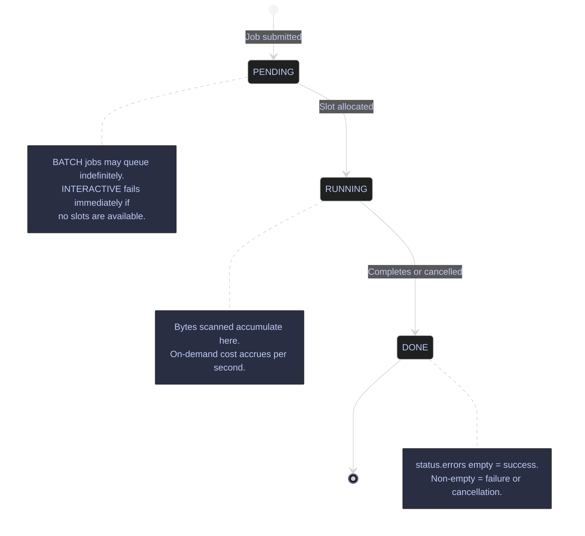

# BigQuery Job Management

> [!quote]
> "A complex system that works is invariably found to have evolved from a simple system that worked."
>
> — **John Gall**, *Systemantics* (1975)

Every BigQuery operation — query, load, export, copy — creates a job. Jobs are the unit of work in BigQuery. Understanding how to list jobs, inspect their details (including errors and bytes processed), and cancel runaway jobs is essential for incident response and cost governance. The job history is your primary audit trail for understanding what ran, who ran it, and how much it cost.

Job history is retained in `INFORMATION_SCHEMA.JOBS` for 180 days. The `bq ls -j` command surfaces the same history but defaults to the last 100 jobs. All job management operations require at minimum `roles/bigquery.jobUser` (own jobs only); inspecting or canceling another user's job requires `roles/bigquery.admin`, which grants `bigquery.jobs.listAll` and `bigquery.jobs.cancel` across all principals in the project.

> [!info]
> All four BigQuery operation types create trackable jobs: `QUERY`, `LOAD`, `EXTRACT` (export), and `COPY`. All appear in `bq ls -j` and `INFORMATION_SCHEMA.JOBS`, and all accumulate bytes-processed billing during execution.

## Job Operations via bq CLI

The `bq` CLI provides three core job management operations: listing recent jobs, inspecting job details, and canceling running jobs. For datasets in non-US/EU regions, pass `--location=<region>` to all `bq` job commands — omitting it returns a "job not found" error even when the job ID is correct.

### List Recent Jobs

Lists jobs submitted by the current user, sorted by creation time descending. Use `-a` to list all users' jobs across the project (requires `roles/bigquery.admin`).

#### bq ls -j — list recent jobs

The `-j` flag switches `bq ls` from its default mode (listing datasets) to listing jobs. `--max_results` defaults to 100; `--max_results=10` limits output for quick triage.

```bash
bq ls -j --max_results=10
```

```text
             jobId                        Job Type    State      Start Time             Duration
 ---------------------------------------- ----------- --------- ---------------------- ----------
 job_abc123_us_central1_xxxx              query       DONE      05 Apr 2026 01:15:00   0:00:02
 job_def456_us_central1_yyyy              query       RUNNING   05 Apr 2026 01:16:00   0:00:30
 job_ghi789_us_central1_zzzz              load        DONE      05 Apr 2026 01:10:00   0:00:45
```

#### bq ls -j -a — list all users' jobs

Expands the listing to include jobs from all principals in the project. Requires `roles/bigquery.admin` (`bigquery.jobs.listAll`).

```bash
bq ls -j -a --max_results=25
```

```text
             jobId                        Job Type    State      Start Time             User
 ---------------------------------------- ----------- --------- ---------------------- ------------------------------------------
 job_abc123_us_central1_xxxx              query       DONE      05 Apr 2026 01:15:00   svc-account@project.iam.gserviceaccount.com
 job_xyz999_us_central1_aaaa              query       RUNNING   05 Apr 2026 01:17:00   analyst@company.com
```

| Flag | Syntax | Description |
|---|---|---|
| `-j` | `bq ls -j` | List jobs instead of datasets |
| `-a` | `bq ls -j -a` | List all users' jobs (requires `roles/bigquery.admin`) |
| `--max_results` | `--max_results=<n>` | Number of jobs to return (default: 100) |
| `--min_creation_time` | `--min_creation_time=<epoch_ms>` | Filter jobs created after this epoch millisecond timestamp |
| `--max_creation_time` | `--max_creation_time=<epoch_ms>` | Filter jobs created before this epoch millisecond timestamp |
| `--job_type` | `--job_type=query\|load\|extract\|copy` | Filter by job type |
| `--location` | `--location=<region>` | Required for datasets in non-US/EU regions |
| `--project_id` | `--project_id=<project>` | Target a specific project (defaults to active `gcloud` project) |

### Inspect Job Details

Returns the full job resource as JSON: the SQL executed, bytes scanned, slot usage, timing, and error messages. Use this after a job fails or to calculate cost for a specific execution.

#### bq show -j — inspect job details

Retrieves the complete job resource. Use `--format=prettyjson` for a readable JSON dump; use `--format=json` for machine parsing.

```bash
bq show -j --format=prettyjson <job_id>
```

```text
{
  "configuration": {
    "jobType": "QUERY",
    "query": {
      "query": "SELECT * FROM `project.dataset.large_table`",
      "useLegacySql": false
    }
  },
  "statistics": {
    "creationTime": "1743814500000",
    "startTime": "1743814501000",
    "endTime": "1743814522000",
    "query": {
      "totalBytesProcessed": "540000000000",
      "cacheHit": false,
      "statementType": "SELECT"
    }
  },
  "status": {
    "state": "DONE",
    "errors": []
  }
}
```

Key fields in the output:

- **`configuration.query.query`** — the full SQL that was executed
- **`statistics.query.totalBytesProcessed`** — bytes scanned; divide by 10¹² × $6.25 for on-demand cost estimate
- **`statistics.query.cacheHit`** — `true` if the result was served from cache (no charge for on-demand)
- **`status.state`** — `RUNNING`, `PENDING`, or `DONE`
- **`status.errors`** — non-empty if the job failed; each entry contains `reason` and `message`
- **`statistics.creationTime`** / **`statistics.endTime`** — epoch milliseconds; subtract for elapsed wall time

| Flag | Syntax | Description |
|---|---|---|
| `--format` | `--format=prettyjson` | Output format: `prettyjson`, `json`, `yaml`, `table`, `value` |
| `--location` | `--location=<region>` | Required for jobs in non-US/EU regions |
| `--project_id` | `--project_id=<project>` | Target a specific project |

### Cancel a Running Job

Sends a cancellation request to a `RUNNING` or `PENDING` job. Cancellation is best-effort — the job transitions to `DONE` state promptly in most cases, but may complete a brief continuation before stopping.

#### bq cancel — stop a running query

Cancels the specified job. The job ID is available from `bq ls -j` output or from the BigQuery console job history tab.

```bash
bq cancel <job_id>
```

```text
Job 'my-project:US.job_def456_us_central1_yyyy' successfully stopped.
```

> [!warning] On-Demand Charges Accumulate While a Job Runs
>
> BigQuery on-demand pricing charges per byte scanned. A `SELECT *` against a large unpartitioned table begins accumulating cost the moment it enters `RUNNING` state. Canceling late in execution may still incur a significant charge — the final bill reflects bytes scanned up to the cancellation point, not zero.

> [!success] Run a Dry Run Before Executing Large Queries
>
> Use `bq query --dry_run` to inspect bytes that would be scanned before committing to execution. Combined with early cancellation for runaway jobs, this limits unintended cost. See [querying-and-cost-optimization](https://alp78.github.io/elysium/06-GCP/BigQuery/querying-and-cost-optimization) for dry-run syntax.

| Flag | Syntax | Description |
|---|---|---|
| `--location` | `--location=<region>` | Required for jobs in non-US/EU regions |
| `--project_id` | `--project_id=<project>` | Target a specific project |
| `--async` | `--async` | Return immediately without waiting for the cancellation to complete |

### Find a Job ID

Job IDs appear in:
- The output of `bq query` (printed when the query starts)
- `bq ls -j` listings
- The BigQuery console (job history tab)
- [Cloud Logging](https://alp78.github.io/elysium/06-GCP/Logging/cloud-logging) entries for BigQuery audit logs (resource type `bigquery_resource`)

## Job States Reference

BigQuery jobs transition through three states. All jobs end in `DONE` regardless of outcome — success, failure, and cancellation are all represented as `DONE` with different `status.errors` content.



| State | Meaning |
|---|---|
| `PENDING` | Queued, waiting for slot allocation |
| `RUNNING` | Currently executing |
| `DONE` | Completed (check `status.errors` for success vs failure vs cancellation) |

## Cost Recovery with INFORMATION_SCHEMA

For a more powerful view of job history and cost, use `INFORMATION_SCHEMA.JOBS` directly in BigQuery SQL (see [querying-and-cost-optimization](https://alp78.github.io/elysium/06-GCP/BigQuery/querying-and-cost-optimization) for the full query). The `bq ls -j` command is useful for quick command-line checks, but SQL against `INFORMATION_SCHEMA` gives you full analytical power over the job history.

## Related

- [querying-and-cost-optimization](https://alp78.github.io/elysium/06-GCP/BigQuery/querying-and-cost-optimization) — Dry runs before execution and INFORMATION_SCHEMA cost queries
- [data-loading-and-export](https://alp78.github.io/elysium/06-GCP/BigQuery/data-loading-and-export) — Load and export operations also create BQ jobs
- [cloud-logging](https://alp78.github.io/elysium/06-GCP/Logging/cloud-logging) — BigQuery jobs emit audit logs visible in Cloud Logging
- [cloud-monitoring-metrics](https://alp78.github.io/elysium/06-GCP/Logging/cloud-monitoring-metrics) — `bigquery.googleapis.com/query/count` and slot usage metrics

## References

- [BigQuery job management](https://cloud.google.com/bigquery/docs/managing-jobs)
- [INFORMATION_SCHEMA.JOBS](https://cloud.google.com/bigquery/docs/information-schema-jobs)
