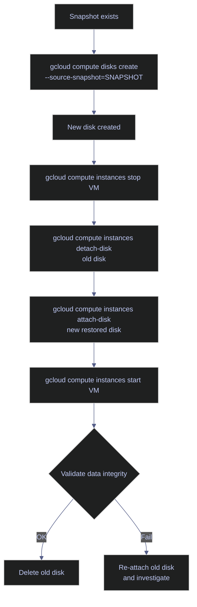

# Disks and Snapshots — Protecting Your Data

> [!quote]
> "Backups are not sexy, but neither is data loss."
>
> — **W. Curtis Preston**, *Backup & Recovery* (2007)

Compute Engine persistent disk snapshots are your undo button. Snapshots are incremental — only changed blocks are stored — making them fast and inexpensive to create. The rule is simple: **always snapshot before any risky operation** (OS upgrades, database updates, schema migrations, disk resizing). The serial console provides the last resort for diagnosing VMs that fail to boot.

> [!info] Prerequisites
>
> - **API:** `compute.googleapis.com` must be enabled.
> - **IAM:** `roles/compute.storageAdmin` for disk and snapshot operations; `roles/compute.instanceAdmin.v1` for full VM management including attaching and detaching disks.

## Disk Management

Persistent disks are network-attached block storage volumes that exist independently of the VM instances they are attached to. A disk persists until explicitly deleted — it outlives the VM it was attached to — making it the correct layer for durable application data such as database files, pipeline staging directories, and OS volumes.

### Listing and Creating Disks

#### gcloud | List all persistent disks

List all persistent disks in the project across all zones. Use `--filter` to scope by zone, name, or status.

```bash
gcloud compute disks list
```

```text
[OUTPUT CELL MISSING — add representative output]
```

#### gcloud | Create a new persistent disk

Creates a zonal persistent disk. You can create a blank disk, initialize it from a source snapshot, or initialize from an image. The disk must be in the same zone as the VM you intend to attach it to.

```bash
gcloud compute disks create data-pipeline-sql-disk \
  --zone=europe-west1-b \
  --size=50GB \
  --type=pd-ssd
```

```text
[OUTPUT CELL MISSING — add representative output]
```

| Flag | Syntax | Description |
|---|---|---|
| `--zone` | `--zone=europe-west1-b` | Zone where the disk is created. Must match the VM zone for attachment. |
| `--size` | `--size=100GB` | Disk size in GB. Can only be increased after creation, never decreased. |
| `--type` | `--type=pd-ssd` | Disk type: `pd-ssd`, `pd-balanced`, `pd-standard`, `pd-extreme`, `hyperdisk-balanced`, `hyperdisk-throughput`, `hyperdisk-extreme`. |
| `--image` | `--image=IMAGE_NAME` | Initialize disk from a public or custom image (used for boot disks). |
| `--source-snapshot` | `--source-snapshot=SNAPSHOT_NAME` | Initialize disk from an existing snapshot (restore flow). |
| `--replica-zones` | `--replica-zones=ZONE_A,ZONE_B` | Create a Regional Persistent Disk replicated synchronously across two zones for HA. |
| `--description` | `--description="..."` | Human-readable label for operational clarity. |
| `--labels` | `--labels=env=prod,team=data` | Resource labels for cost attribution and filtering. |

## Snapshot Management

Snapshots capture the state of a persistent disk at a point in time. They are stored in Cloud Storage and are incremental — only changed blocks since the last snapshot are transferred and stored. The first snapshot of a disk is a full copy; subsequent snapshots capture only changes, making them significantly faster and cheaper. Snapshots are cross-regional: a snapshot taken from `europe-west1` can restore a disk in `us-central1`.

> [!warning] Snapshot Cost Trap
>
> Snapshots accumulate silently. A daily schedule with a 30-day retention window on a 500 GB disk can generate ~$390/month at ~$0.026/GB/month (US multi-regional). Orphaned manual snapshots from one-off operations are a common hidden cost.

> [!success] Use Snapshot Schedules with Retention Windows
>
> Automate snapshot creation and deletion with resource policies (see [Configuring Snapshot Schedules](#configuring-snapshot-schedules) below). Set `--max-retention-days` to automatically purge snapshots older than your recovery window, capping storage costs.

### Creating Snapshots Manually

Snapshot before any risky operation — OS upgrades, SQL Server updates, schema migrations, disk resizing. The first snapshot of a large disk may take several minutes; subsequent incremental snapshots on typical workloads complete in under a minute.

#### gcloud | Create a disk snapshot

Creates an incremental snapshot of the specified disk. The snapshot name should encode the date and reason to make identification easy during incident response.

```bash
gcloud compute disks snapshot data-pipeline-sql-disk \
  --zone=europe-west1-b \
  --snapshot-names=data-pipeline-sql-before-upgrade-$(date +%Y%m%d)
```

```text
[OUTPUT CELL MISSING — add representative output]
```

> [!tip] Snapshot Naming Convention
>
> Include the date and the reason in the snapshot name: `data-pipeline-sql-before-upgrade-20260322`. This makes it immediately clear which snapshot to restore from when things go wrong at 3 AM.

#### gcloud | List snapshots

Lists all snapshots in the project. Use `--filter` to scope by source disk or creation time.

```bash
gcloud compute snapshots list
```

```text
[OUTPUT CELL MISSING — add representative output]
```

| Flag | Syntax | Description |
|---|---|---|
| `--zone` | `--zone=europe-west1-b` | Zone of the source disk. |
| `--snapshot-names` | `--snapshot-names=NAME` | Comma-separated snapshot names to create. |
| `--storage-location` | `--storage-location=us` | Multi-regional (`us`, `eu`, `asia`) or regional (`us-central1`) storage for the snapshot. Defaults to closest multi-region. |
| `--description` | `--description="..."` | Description attached to the snapshot resource. |
| `--async` | `--async` | Return immediately without waiting for the snapshot to complete. Useful in scripted pipelines. |

### Restoring a Disk from a Snapshot

Restoration requires creating a new disk from the snapshot, then reattaching it to the VM. There is no in-place restore — the original disk is not modified. This means you can validate the restored disk before cutting over, keeping the original as a safety net until the restore is confirmed good.



#### gcloud | Create a new disk from a snapshot

Creates a new persistent disk initialized from the snapshot's contents. The disk type does not need to match the original.

```bash
gcloud compute disks create data-pipeline-sql-restored \
  --zone=europe-west1-b \
  --source-snapshot=data-pipeline-sql-before-upgrade-20260309 \
  --type=pd-ssd
```

```text
[OUTPUT CELL MISSING — add representative output]
```

> [!todo] Full Disk Restore Procedure
>
> 1. Create a new disk from the snapshot (command above).
> 2. Stop the VM: `gcloud compute instances stop INSTANCE_NAME --zone=ZONE`.
> 3. Detach the old disk: `gcloud compute instances detach-disk INSTANCE_NAME --disk=OLD_DISK --zone=ZONE`.
> 4. Attach the restored disk: `gcloud compute instances attach-disk INSTANCE_NAME --disk=data-pipeline-sql-restored --zone=ZONE`.
> 5. Start the VM: `gcloud compute instances start INSTANCE_NAME --zone=ZONE`.
> 6. SSH in and verify data integrity before deleting the old disk.

| Flag | Syntax | Description |
|---|---|---|
| `--source-snapshot` | `--source-snapshot=SNAPSHOT_NAME` | Source snapshot to restore from. |
| `--zone` | `--zone=europe-west1-b` | Zone where the new disk is created. Must match the target VM zone. |
| `--type` | `--type=pd-ssd` | Disk type for the restored disk. Does not need to match the original. |
| `--size` | `--size=100GB` | Override disk size. Must be ≥ the source snapshot's original disk size. |

### Configuring Snapshot Schedules

Snapshot schedules use resource policies to automate snapshot creation and deletion. A single policy can be attached to multiple disks. The schedule runs according to UTC by default, and snapshots are stored in the location specified by `--storage-location` on the policy.

#### gcloud | Create a snapshot schedule resource policy

Creates a reusable snapshot schedule resource policy in a given region. The `--max-retention-days` parameter automatically deletes snapshots older than the specified window.

```bash
gcloud compute resource-policies create snapshot-schedule daily-snapshot-policy \
  --region=europe-west1 \
  --max-retention-days=7 \
  --on-source-disk-delete=keep-auto-snapshots \
  --daily-schedule \
  --start-time=02:00
```

```text
[OUTPUT CELL MISSING — add representative output]
```

#### gcloud | Attach a snapshot schedule to a disk

Binds an existing resource policy to a disk. The disk will then receive automated snapshots according to the policy schedule.

```bash
gcloud compute disks add-resource-policies data-pipeline-sql-disk \
  --zone=europe-west1-b \
  --resource-policies=daily-snapshot-policy
```

```text
[OUTPUT CELL MISSING — add representative output]
```

| Flag | Syntax | Description |
|---|---|---|
| `--region` | `--region=europe-west1` | Region where the resource policy is created. Must match the disk's region. |
| `--max-retention-days` | `--max-retention-days=7` | Automatically delete snapshots older than this many days. |
| `--on-source-disk-delete` | `--on-source-disk-delete=keep-auto-snapshots` | Behavior when the source disk is deleted: `keep-auto-snapshots` (retain snapshots) or `apply-retention-policy` (delete per schedule). |
| `--daily-schedule` | `--daily-schedule` | Create one snapshot per day. Alternatives: `--hourly-schedule=N`, `--weekly-schedule=DAY`. |
| `--start-time` | `--start-time=02:00` | UTC start time for the snapshot window (ISO 8601 format). |

## Disk Operations

Disk modifications after creation are constrained: size can only grow, never shrink. Disk type cannot be changed after creation — to change type, create a new disk from a snapshot of the original and delete the source disk.

### Resizing a Persistent Disk

Compute Engine persistent disk resize is an online operation — the VM does not need to be stopped and the disk does not need to be detached. However, the OS-level filesystem is not automatically expanded after the disk grows; this must be done manually inside the VM.

#### gcloud | Resize a persistent disk

Increases the size of an existing persistent disk. The operation is online and non-disruptive to the running VM. Filesystem expansion inside the OS must follow as a separate step.

```bash
gcloud compute disks resize data-pipeline-sql-disk \
  --zone=europe-west1-b \
  --size=100GB
```

```text
[OUTPUT CELL MISSING — add representative output]
```

> [!warning] Filesystem Must Be Expanded Manually
>
> After `gcloud compute disks resize`, the new disk capacity is allocated but invisible to the OS. You must SSH in and run the appropriate filesystem expansion command:
> - **ext4:** `sudo resize2fs /dev/sda1`
> - **xfs:** `sudo xfs_growfs /`
>
> Skipping this step leaves your application still seeing the old, smaller disk.

> [!success] Run Filesystem Expansion Immediately After Disk Resize
>
> After `gcloud compute disks resize`, SSH into the VM and run `sudo resize2fs /dev/sda1` (ext4) or `sudo xfs_growfs /` (xfs). Verify with `df -h` that the filesystem now reflects the new capacity before resuming any application workloads.

| Flag | Syntax | Description |
|---|---|---|
| `--size` | `--size=100GB` | New disk size in GB. Must be larger than the current size — shrinking is not supported. |
| `--zone` | `--zone=europe-west1-b` | Zone of the disk. |
| `--async` | `--async` | Return immediately without waiting for the resize operation to complete. |

## Troubleshooting

### Serial Console Access

The serial console provides access to a VM's boot sequence output and kernel logs — the only diagnostic channel that remains available when SSH is unreachable. `get-serial-port-output` reads the non-interactive output buffer (BIOS/UEFI messages, kernel logs, systemd startup). For interactive serial console access (a shell at the boot prompt), enable it in instance metadata first with `serial-port-enable=true`.

#### gcloud | Get serial port output

Retrieves the raw output from the VM's serial console. This includes anything written to `/dev/ttyS0` — BIOS/UEFI messages, kernel boot output, systemd initialization, and application startup logs.

```bash
gcloud compute instances get-serial-port-output data-pipeline-sql \
  --zone=europe-west1-b
```

```text
[OUTPUT CELL MISSING — add representative output]
```

> [!info] Serial Console Use Cases
>
> - Kernel panic after an OS update — the VM boots but SSH never comes up
> - Disk full causing boot failure — `/` mounted read-only, init fails
> - Incorrect `/etc/fstab` entries after adding a new disk — VM hangs at mount
> - Grub misconfiguration after updating boot loader

| Flag | Syntax | Description |
|---|---|---|
| `--zone` | `--zone=europe-west1-b` | Zone of the instance. |
| `--port` | `--port=2` | Serial port number (1–4). Port 1 is the default kernel/BIOS output. |
| `--start` | `--start=BYTE_OFFSET` | Start reading from a specific byte offset in the output buffer. Useful for tailing large logs. |

## Disk Types Reference

Compute Engine offers two disk families: **Persistent Disk** (block storage billed by provisioned capacity) and **Hyperdisk** (next-generation block storage with independently configurable IOPS and throughput, GA since 2024). Hyperdisk availability varies by zone — check the [GCE disk types docs](https://cloud.google.com/compute/docs/disks) before selecting a type.

> [!warning] Pricing Varies by Region
>
> Prices below are approximate US region rates. Regions such as `europe-west1` carry a 10–20% premium. Check the [GCE pricing page](https://cloud.google.com/compute/disks-image-pricing) for current rates in your region.

### Persistent Disk Types

| Type | Use case | Max IOPS (read/write per GB) | Approx. price (US) |
|---|---|---|---|
| `pd-standard` | Sequential reads, cold backups, archive | 0.75 / 1.5 | ~$0.04/GB/month |
| `pd-balanced` | General purpose, cost-efficient production workloads | 6 / 6 | ~$0.10/GB/month |
| `pd-ssd` | Databases, production OLTP, low latency | 30 / 30 | ~$0.17/GB/month |
| `pd-extreme` | Highest-performance databases, requires explicit IOPS provisioning | Up to 120,000 IOPS total | ~$0.125/GB/month + $0.003/provisioned IOPS |

### Hyperdisk Types

Hyperdisk decouples IOPS and throughput from disk size. You provision capacity, IOPS, and throughput independently — eliminating the need to over-provision disk size just to reach performance targets. This makes Hyperdisk more cost-efficient than `pd-ssd` or `pd-extreme` for workloads with predictable, high performance requirements.

| Type | Use case | Max provisioned IOPS | Max provisioned throughput |
|---|---|---|---|
| `hyperdisk-balanced` | General purpose, replaces `pd-ssd` for most workloads | 160,000 | 2,400 MB/s |
| `hyperdisk-throughput` | Data analytics, sequential-heavy ETL pipelines | 1,200 | 2,400 MB/s |
| `hyperdisk-extreme` | Mission-critical OLTP, SAP HANA, Oracle | 350,000 | 5,000 MB/s |
| `hyperdisk-ml` | ML training, high read throughput, multi-reader support | 1,200 | 2,400 MB/s |

> [!info] Regional Persistent Disks
>
> Regional Persistent Disks synchronously replicate data across two zones in the same region, providing automatic failover: if the primary zone fails, the disk can be force-attached to a VM in the secondary zone with no data loss. Create with `--replica-zones=ZONE_A,ZONE_B` during disk creation. Cost is approximately 2× the zonal equivalent. Recommended for stateful workloads with RPO = 0 requirements.

## Related

- [vm-lifecycle](https://alp78.github.io/elysium/06-GCP/Compute/vm-lifecycle) — Stop the VM before detaching/attaching disks after snapshot restore
- [vm-ssh-and-file-transfer](https://alp78.github.io/elysium/06-GCP/Compute/vm-ssh-and-file-transfer) — SSH is the primary access method; serial console is the fallback
- [gcs-buckets-and-lifecycle](https://alp78.github.io/elysium/06-GCP/Storage/gcs-buckets-and-lifecycle) — GCS is the alternative storage layer for pipeline data (not OS disks)
- [cloud-logging](https://alp78.github.io/elysium/06-GCP/Logging/cloud-logging) — Check Cloud Logging alongside serial console output for boot diagnostics
- [Terraform: GCP compute resources](https://alp78.github.io/elysium/07-Terraform/) — IaC provisioning of persistent disks and snapshot schedules

## References

- [Persistent disk snapshots](https://cloud.google.com/compute/docs/disks/create-snapshots)
- [Resize a persistent disk](https://cloud.google.com/compute/docs/disks/resize-persistent-disk)
- [Serial console access](https://cloud.google.com/compute/docs/troubleshooting/troubleshooting-using-serial-console)
- [Disk types and performance](https://cloud.google.com/compute/docs/disks/performance)
- [Snapshot schedules](https://cloud.google.com/compute/docs/disks/scheduled-snapshots)
- [Hyperdisk overview](https://cloud.google.com/compute/docs/disks/hyperdisks)
