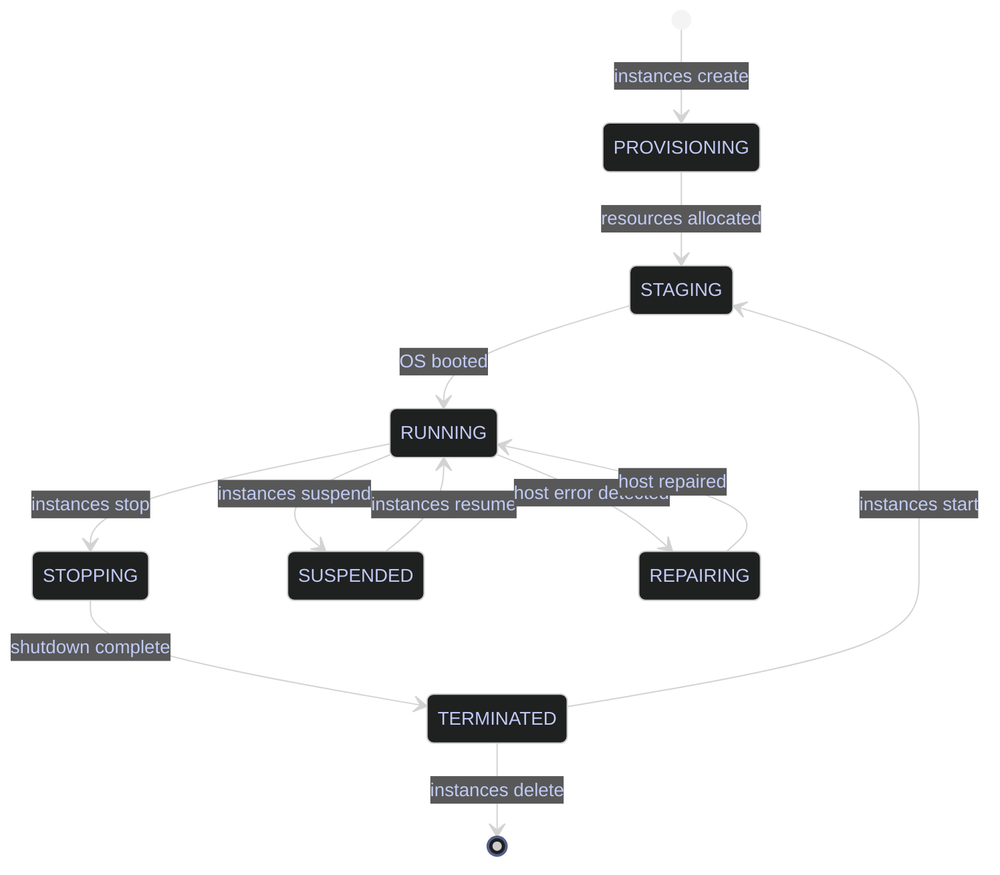

# VM Lifecycle — Start, Stop, Resize, and Debug

> [!quote]
> "I remember the days when I built my own gaming PCs. Eventually I sold out and bought an Xbox because I just wanted to play games, not build gaming rigs. Serverless is like that."
>
> — **Kelsey Hightower**, Twitter (2018)

Compute Engine VMs host self-managed services — SQL Server, Airflow, monitoring agents, and any workload that doesn't fit the serverless model. Unlike [Cloud Run](https://alp78.github.io/elysium/06-GCP/Serverless/cloud-run-jobs-vs-services) (which is ephemeral), VMs are stateful and persistent, making them your responsibility to maintain, secure, and right-size. Understanding the full lifecycle — including scheduled start/stop and cost-aware right-sizing — is essential for operating VMs economically.



## Instance Lifecycle Operations

Compute Engine exposes lifecycle operations as individual `gcloud compute instances` subcommands. Most operations complete within 60–90 seconds; resizing requires a stopped instance. Requires `compute.googleapis.com` enabled and `roles/compute.instanceAdmin.v1`.

### Listing and Describing Compute Engine VMs

`instances list` returns a summary table — NAME, ZONE, MACHINE_TYPE, INTERNAL_IP, EXTERNAL_IP, and STATUS. `instances describe` returns the full resource representation in YAML by default, including disks, network interfaces, service account, labels, metadata, and scheduling options. Use `--format` to extract specific fields for scripting.

#### gcloud | List all VM instances

Returns a quick inventory of all VMs in the current project with their status and machine type.

```bash
gcloud compute instances list
```

```text
NAME                  ZONE            MACHINE_TYPE   PREEMPTIBLE  INTERNAL_IP  EXTERNAL_IP     STATUS
data-pipeline-sql     europe-west1-b  n2-standard-4               10.132.0.2   34.90.123.45    RUNNING
dev-airflow           europe-west1-b  e2-medium                   10.132.0.5                   TERMINATED
```

#### gcloud | Describe a specific VM instance

Returns the full YAML resource definition for a VM — use for auditing configuration, extracting service account, or checking disk attachments.

```bash
gcloud compute instances describe data-pipeline-sql --zone=europe-west1-b
```

```text
creationTimestamp: '2026-01-15T09:00:00.000-08:00'
machineType: zones/europe-west1-b/machineTypes/n2-standard-4
name: data-pipeline-sql
networkInterfaces:
- networkIP: 10.132.0.2
  subnetwork: regions/europe-west1/subnetworks/default
serviceAccounts:
- email: pipeline-sa@my-project.iam.gserviceaccount.com
  scopes:
  - https://www.googleapis.com/auth/cloud-platform
status: RUNNING
zone: zones/europe-west1-b
```

| Flag | Syntax | Description |
|---|---|---|
| `--zones` | `instances list --zones=europe-west1-b,europe-west1-c` | Filter by one or more zones |
| `--filter` | `instances list --filter="status=RUNNING"` | Filter results by field value |
| `--format` | `--format=json` / `--format="value(name,status)"` | Output as JSON, YAML, CSV, or extracted fields |
| `--zone` | `instances describe NAME --zone=ZONE` | Required for describe — specifies the instance zone |
| `--flatten` | `--flatten="networkInterfaces[].accessConfigs[]"` | Flatten repeated fields for `value()` extraction |

### VM Start, Stop, and Reset Operations

`start` and `stop` are graceful operations: GCP sends an ACPI shutdown signal (equivalent to pressing the power button). `reset` is a hard reboot — it does not attempt a clean shutdown and should be used only when the VM is unresponsive. Stopped VMs (`TERMINATED` state) do not incur vCPU or memory charges, but persistent disk charges continue.

#### gcloud | Start a VM instance

Transitions the VM from `TERMINATED` to `RUNNING`. Takes 60–90 seconds for the OS to boot.

```bash
gcloud compute instances start data-pipeline-sql --zone=europe-west1-b
```

```text
Starting instance(s) data-pipeline-sql...
Updated [https://www.googleapis.com/compute/v1/projects/my-project/zones/europe-west1-b/instances/data-pipeline-sql].
```

#### gcloud | Stop a VM instance

Sends a graceful ACPI shutdown signal. The VM transitions from `RUNNING` to `STOPPING` then `TERMINATED`.

```bash
gcloud compute instances stop data-pipeline-sql --zone=europe-west1-b
```

```text
Stopping instance(s) data-pipeline-sql...
Updated [https://www.googleapis.com/compute/v1/projects/my-project/zones/europe-west1-b/instances/data-pipeline-sql].
```

> [!warning] Disk Charges Continue When Stopped
>
> Stopping a VM eliminates compute charges but disk storage charges continue. For VMs you need to stop long-term, consider snapshotting the disk and deleting the VM entirely — then recreating from the snapshot when needed.

> [!success] Snapshot and Delete for Long-Term Suspension
>
> For VMs idle for more than a few days, create a snapshot with `gcloud compute disks snapshot`, then delete the VM and its disk. Recreate from the snapshot when needed. This eliminates both compute and disk charges for the suspension period.

#### gcloud | Reset (hard reboot) a VM instance

Forces an immediate hardware reset without a clean shutdown. Use only when the VM is unresponsive to SSH and `stop` does not complete.

```bash
gcloud compute instances reset data-pipeline-sql --zone=europe-west1-b
```

```text
Resetting instance(s) data-pipeline-sql...
Updated [https://www.googleapis.com/compute/v1/projects/my-project/zones/europe-west1-b/instances/data-pipeline-sql].
```

| Flag | Syntax | Description |
|---|---|---|
| `--zone` | `--zone=europe-west1-b` | Zone of the instance (required for all operations) |
| `--async` | `--async` | Return immediately without waiting for the operation to complete |
| `--discard-local-ssd` | `--discard-local-ssd` | Required when stopping a VM with local SSD; local SSD data is lost on stop |

### Deleting a VM Instance

Permanently removes a VM and, by default, also deletes the boot disk. Non-boot persistent disks are detached but not deleted unless `--delete-disks=all` is specified. This action is irreversible — ensure a disk snapshot exists before deleting if data must be preserved.

#### gcloud | Delete a VM instance

```bash
gcloud compute instances delete data-pipeline-sql --zone=europe-west1-b
```

```text
The following instances will be deleted. Attached disks configured to be auto-deleted will be deleted unless they are attached to any other instances or the `--keep-disks` flag is given and specifies them for keeping. Deleting a disk is irreversible and any data on the disk will be lost.
 - [data-pipeline-sql] in [europe-west1-b]

Do you want to continue (Y/n)?  Y
Deleted [https://www.googleapis.com/compute/v1/projects/my-project/zones/europe-west1-b/instances/data-pipeline-sql].
```

| Flag | Syntax | Description |
|---|---|---|
| `--zone` | `--zone=europe-west1-b` | Zone of the instance |
| `--delete-disks` | `--delete-disks=all` | Delete all attached disks (boot + data) along with the VM |
| `--keep-disks` | `--keep-disks=all` | Keep all attached disks after deleting the VM |
| `--quiet` / `-q` | `-q` | Skip the confirmation prompt |

### Resizing a VM by Changing Machine Type

The VM must be in `TERMINATED` state before changing machine type — you cannot resize a running VM. Machine type families: `e2-*` (cost-optimized, burstable — dev/small workloads), `n2-*` (balanced — production), `c2-*` (compute-optimized — CPU-intensive transforms), `m2-*` (memory-optimized — large databases), or custom sizing with `--custom-cpu` and `--custom-memory`.

#### gcloud | Stop the instance before resizing

```bash
gcloud compute instances stop data-pipeline-sql --zone=europe-west1-b
```

```text
Stopping instance(s) data-pipeline-sql...
Updated [https://www.googleapis.com/compute/v1/projects/my-project/zones/europe-west1-b/instances/data-pipeline-sql].
```

#### gcloud | Change the machine type

```bash
gcloud compute instances set-machine-type data-pipeline-sql \
  --zone=europe-west1-b \
  --machine-type=e2-standard-4
```

```text
Updated [https://www.googleapis.com/compute/v1/projects/my-project/zones/europe-west1-b/instances/data-pipeline-sql].
```

#### gcloud | Start the instance after resizing

```bash
gcloud compute instances start data-pipeline-sql --zone=europe-west1-b
```

```text
Starting instance(s) data-pipeline-sql...
Updated [https://www.googleapis.com/compute/v1/projects/my-project/zones/europe-west1-b/instances/data-pipeline-sql].
```

| Flag | Syntax | Description |
|---|---|---|
| `--machine-type` | `--machine-type=n2-standard-4` | Predefined machine type to apply |
| `--custom-cpu` | `--custom-cpu=6` | Number of vCPUs for a custom machine type |
| `--custom-memory` | `--custom-memory=20GB` | Memory for a custom machine type (must be multiple of 256 MB) |
| `--zone` | `--zone=europe-west1-b` | Zone of the instance |

### Right-Sizing VMs with Cloud Monitoring Data

The most common waste in cloud data engineering is over-provisioned VMs. Right-sizing requires looking at actual utilization, not guesses. Requires `monitoring.googleapis.com` enabled and `roles/monitoring.viewer`. CPU metrics are collected automatically by Compute Engine; memory metrics require the Cloud Monitoring agent installed on the VM.

#### gcloud | Query CPU utilization metrics over the last 7 days

Returns the top 5 highest CPU utilization data points over the last week. Use to identify peak load before downsizing.

```bash
gcloud monitoring time-series list \
  --filter='metric.type="compute.googleapis.com/instance/cpu/utilization"
            AND resource.labels.instance_id="data-pipeline-sql"' \
  --interval-start-time="$(date -u -d '7 days ago' +%Y-%m-%dT%H:%M:%SZ)" \
  --format="value(points.value.doubleValue)" | sort -n | tail -5
```

```text
# Values are floats between 0.0 (0%) and 1.0 (100% utilization).
# Example top-5 peak readings:
0.28
0.31
0.33
0.35
0.42
```

> [!tip] Right-Sizing Rules of Thumb
>
> - If peak CPU utilization is 30%, you're paying for 70% wasted capacity. Downsize.
> - If `free -h` on the VM shows less than 60% memory used at peak, try the next smaller machine type. Monitor for a week after downsizing.
> - An e2-medium running 24/7 costs ~$25/month. An e2-standard-4 costs ~$97/month.

| Flag | Syntax | Description |
|---|---|---|
| `--filter` | `--filter='metric.type=... AND resource.labels...'` | Filter by metric type and resource label |
| `--interval-start-time` | `--interval-start-time=2026-01-01T00:00:00Z` | Start of the query window (ISO 8601) |
| `--interval-end-time` | `--interval-end-time=2026-01-08T00:00:00Z` | End of the query window (ISO 8601) |
| `--format` | `--format="value(points.value.doubleValue)"` | Extract specific fields from the time series response |

### Scheduled Start/Stop to Save Costs

Instance schedules are a Compute Engine resource policy (`compute.googleapis.com/resourcePolicies`) that attach to VMs and issue automatic start/stop commands on a cron schedule. The policy is regional — it must be created in the same region as the VM. If a VM only needs to run during business hours (12 hours/day, 5 days/week), scheduling start/stop saves approximately 64% of compute costs.

> [!warning] Cost Trap — Forgotten Always-On VMs
>
> A VM without a schedule running 24/7 on `n2-standard-4` costs ~$97/month. If the workload only runs during business hours, that's ~$62/month wasted.

> [!success] Attach an Instance Schedule
>
> Create a resource policy with a cron start/stop schedule and attach it to the VM. The schedule operates independently — if the VM is manually stopped, it will still be started again at the next scheduled time.

#### gcloud | Create an instance schedule resource policy

Creates a regional resource policy with cron-based start and stop schedules. The timezone value is a standard IANA timezone string.

```bash
gcloud compute resource-policies create instance-schedule data-pipeline-schedule \
  --region=europe-west1 \
  --vm-start-schedule="0 7 * * 1-5" \
  --vm-stop-schedule="0 21 * * 1-5" \
  --timezone="Europe/Paris"
```

```text
Created [https://www.googleapis.com/compute/v1/projects/my-project/regions/europe-west1/resourcePolicies/data-pipeline-schedule].
```

#### gcloud | Attach the schedule to a VM

```bash
gcloud compute instances add-resource-policies data-pipeline-sql \
  --zone=europe-west1-b \
  --resource-policies=data-pipeline-schedule
```

```text
Updated [https://www.googleapis.com/compute/v1/projects/my-project/zones/europe-west1-b/instances/data-pipeline-sql].
```

| Flag | Syntax | Description |
|---|---|---|
| `--region` | `--region=europe-west1` | Region for the resource policy (must match the VM's region) |
| `--vm-start-schedule` | `--vm-start-schedule="0 7 * * 1-5"` | Cron expression for VM start time |
| `--vm-stop-schedule` | `--vm-stop-schedule="0 21 * * 1-5"` | Cron expression for VM stop time |
| `--timezone` | `--timezone="Europe/Paris"` | IANA timezone string for cron interpretation |
| `--resource-policies` | `--resource-policies=POLICY_NAME` | Name of the resource policy to attach to the VM |

### Spot and Preemptible VMs

Spot VMs are surplus Compute Engine capacity offered at up to 91% discount. They can be preempted (stopped) by GCP at any time with a 30-second notice — making them suitable for fault-tolerant batch jobs, ETL pipelines, and ML training, but not for stateful always-on services. Spot VMs replaced the legacy preemptible VM type — they have no hard 24-hour runtime limit, but preemption remains possible at any time.

#### gcloud | Create a Spot VM

```bash
gcloud compute instances create batch-etl-worker \
  --zone=europe-west1-b \
  --machine-type=n2-standard-4 \
  --provisioning-model=SPOT \
  --instance-termination-action=STOP
```

```text
Created [https://www.googleapis.com/compute/v1/projects/my-project/zones/europe-west1-b/instances/batch-etl-worker].
NAME              ZONE            MACHINE_TYPE   PREEMPTIBLE  INTERNAL_IP  EXTERNAL_IP  STATUS
batch-etl-worker  europe-west1-b  n2-standard-4  true         10.132.0.8                RUNNING
```

> [!warning] Spot VMs Are Not Suitable for Stateful Services
>
> SQL Server, Airflow schedulers, and any service that cannot tolerate abrupt shutdown should never run on Spot VMs. A preemption event during a write can cause data loss or corruption.

> [!success] Use Spot VMs for Batch ETL and ML Training
>
> Batch ETL jobs, BigQuery export/import workers, and ML training runs are ideal Spot VM workloads — they are restartable, fault-tolerant, and savings reach up to 91% vs. standard VMs.

| Flag | Syntax | Description |
|---|---|---|
| `--provisioning-model` | `--provisioning-model=SPOT` | Provisions as a Spot VM (preferred over `--preemptible`) |
| `--instance-termination-action` | `--instance-termination-action=STOP` | Action on preemption: `STOP` (default) or `DELETE` |
| `--preemptible` | `--preemptible` | Legacy flag — creates a preemptible VM with a 24-hour hard runtime limit |
| `--maintenance-policy` | `--maintenance-policy=TERMINATE` | Required for GPU/TPU VMs — host maintenance terminates rather than live-migrates |

## Machine Type Reference

Compute Engine offers predefined machine type families optimized for different workload profiles, plus fully custom sizing. Pricing varies by family, region, and whether Committed Use Discounts (CUDs) or Spot pricing apply.

### Compute Engine Machine Type Families

Selecting the right machine type family is the primary lever for balancing cost and performance. For data engineering workloads, `n2-*` is the default production choice; `e2-*` for dev/test; `c2-*` or `c3-*` for CPU-bound transforms.

| Family | Processor | Best for | Example |
|---|---|---|---|
| `e2-*` | Intel/AMD (variable) | Dev/test, burstable, cost-optimized | `e2-medium`, `e2-standard-2` |
| `n2-*` | Intel Cascade Lake | Balanced production workloads | `n2-standard-4`, `n2-standard-8` |
| `n2d-*` | AMD EPYC | Production, better price-per-core than `n2` | `n2d-standard-4`, `n2d-standard-8` |
| `t2d-*` | AMD EPYC Milan | Scale-out web, cost-sensitive stateless | `t2d-standard-4`, `t2d-standard-16` |
| `t2a-*` | Ampere Altra (ARM) | ARM-native workloads, web servers | `t2a-standard-4`, `t2a-standard-16` |
| `c2-*` | Intel Cascade Lake | CPU-intensive transforms, compute | `c2-standard-4`, `c2-standard-8` |
| `c3-*` | Intel Sapphire Rapids | Latest-gen compute, HPC, lower latency | `c3-standard-4`, `c3-standard-8` |
| `n4-*` | Intel Emerald Rapids | Latest-gen balanced, highest single-core perf | `n4-standard-4`, `n4-standard-8` |
| `m2-*` | Intel Cascade Lake | Large in-memory databases | `m2-ultramem-208` |
| Custom | Intel/AMD | Exact CPU/memory sizing (avoids over-provisioning) | `--custom-cpu=6 --custom-memory=20GB` |

## Related

- [vm-ssh-and-file-transfer](https://alp78.github.io/elysium/06-GCP/Compute/vm-ssh-and-file-transfer) — Accessing VMs after they are running
- [disks-and-snapshots](https://alp78.github.io/elysium/06-GCP/Compute/disks-and-snapshots) — Snapshotting before risky resize or upgrade operations
- [cloud-monitoring-metrics](https://alp78.github.io/elysium/06-GCP/Logging/cloud-monitoring-metrics) — Reading CPU and memory metrics for right-sizing decisions
- [gcloud-configurations](https://alp78.github.io/elysium/06-GCP/Core/gcloud-configurations) — Targeting the right project/zone before lifecycle operations
- [service-accounts-and-iam](https://alp78.github.io/elysium/06-GCP/Security/service-accounts-and-iam) — Service account attached to the VM controls what it can access
- [gcp-scheduling](https://alp78.github.io/elysium/12-Orchestration/Scheduling/gcp-scheduling) — Cloud Scheduler for triggering VM start/stop via HTTP or Pub/Sub
- [Terraform GCP Compute](https://alp78.github.io/elysium/07-Terraform/GCP/) — Provisioning Compute Engine VMs and resource policies via IaC

## References

- [Compute Engine machine families](https://cloud.google.com/compute/docs/machine-resource)
- [VM instance lifecycle](https://cloud.google.com/compute/docs/instances/instance-life-cycle)
- [Instance schedules](https://cloud.google.com/compute/docs/instances/schedule-instance-start-stop)
