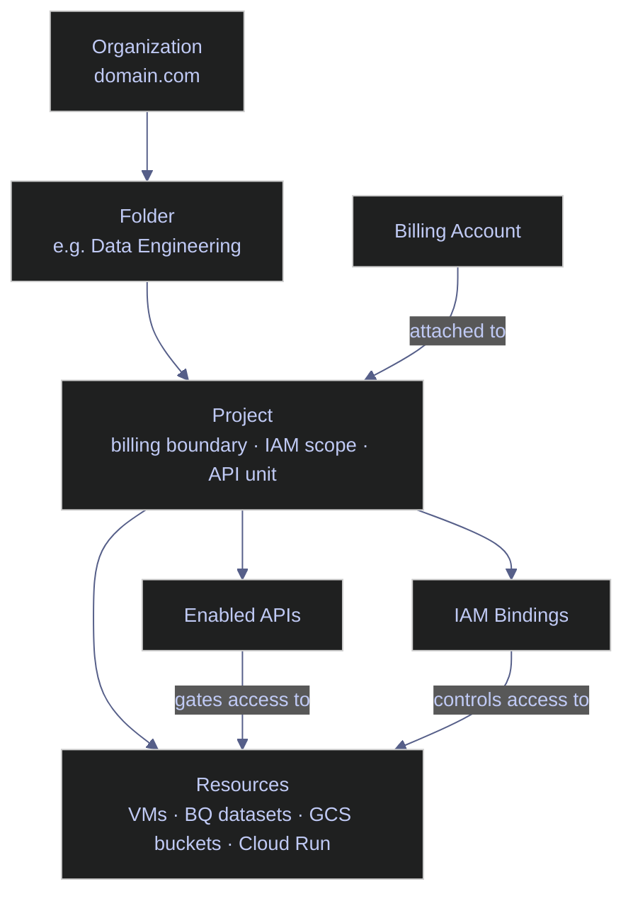

# GCP Projects and APIs

> [!quote]
> "A GCP project is not just a folder — it is a billing boundary, an IAM scope, and an API activation unit. Getting the project structure wrong is the most expensive mistake to fix later."
>
> — **Daz Wilkin**, Google Developer Advocate

GCP projects are the fundamental organizational unit for resources, billing, and access control. Every resource — VMs, BigQuery datasets, Cloud Run jobs, GCS buckets — lives inside a project. APIs must be explicitly enabled per project before the corresponding services can be used; an `API not enabled` error is always the result of a missing `gcloud services enable` call.

## GCP Projects

A common failure mode when setting up a new GCP project is running `gcloud run jobs execute` or `bq query` only to receive an error that the API is disabled. Knowing which APIs to enable upfront — and how to verify what is currently enabled — eliminates this class of errors. Projects also serve as the billing boundary and the IAM scope for [service account](https://alp78.github.io/elysium/06-GCP/Security/service-accounts-and-iam) permissions.



### List Projects

Returns all GCP projects accessible to the authenticated account. Project ID is the stable identifier used in `--project` flags, API calls, and Terraform configurations. Project number is the numeric equivalent used in some IAM bindings and service account names.

```bash
gcloud projects list
```

```text
PROJECT_ID             NAME                     PROJECT_NUMBER
data-platform-dev      Data Platform Dev        123456789012
data-platform-staging  Data Platform Staging    234567890123
data-platform-prod     Data Platform Prod       345678901234
```

| Flag | Description | Example |
|---|---|---|
| `--filter` | Filter by attribute (lifecycle state, label, name) | `--filter="lifecycleState=ACTIVE"` |
| `--format` | Output format | `--format="value(projectId)"` |
| `--limit` | Maximum results to return | `--limit=50` |
| `--sort-by` | Sort field; prefix `~` for descending | `--sort-by=name` |

### Describe a Project

Retrieves full project metadata: labels, parent resource (folder or organization), lifecycle state, creation time, and project number. Use this to confirm the active project before running destructive operations or to inspect labels used for cost attribution.

```bash
gcloud projects describe data-platform-prod
```

```text
createTime: '2023-01-15T10:30:00.000Z'
labels:
  env: prod
  team: data-engineering
lifecycleState: ACTIVE
name: projects/345678901234
parent:
  id: '987654321'
  type: folder
projectId: data-platform-prod
projectNumber: '345678901234'
```

### Project Lifecycle

A project's `lifecycleState` field (visible in `gcloud projects describe`) indicates whether the project is `ACTIVE`, `DELETE_REQUESTED`, or `DELETE_IN_PROGRESS`. Deleting a project initiates a 30-day soft delete — resources are frozen and inaccessible but not destroyed, and the project can be fully restored within that window.

```bash
gcloud projects undelete PROJECT_ID
```

> [!tip] 30-Day Recovery Window
> After deletion, a project enters `DELETE_REQUESTED` state. All resources remain intact for 30 days. Run `gcloud projects undelete PROJECT_ID` within that window to restore the project and all its resources to `ACTIVE` state.

## GCP APIs

APIs gate access to every GCP service. Attempting to call a service with its API disabled immediately returns an `API [service] not enabled on project` error. There is no implicit activation — every project must have each API explicitly enabled before any SDK call, `gcloud` command, or client library will succeed. This applies independently per project; enabling an API in dev does not propagate to staging or prod.

### List Enabled APIs

Returns all APIs currently active in the target project. Use `--filter` to check whether a specific API is enabled before running dependent commands or deployment scripts.

```bash
gcloud services list --enabled
```

```text
NAME                                    TITLE
bigquery.googleapis.com                 BigQuery API
cloudresourcemanager.googleapis.com     Cloud Resource Manager API
compute.googleapis.com                  Compute Engine API
run.googleapis.com                      Cloud Run Admin API
storage.googleapis.com                  Cloud Storage API
```

| Flag | Description | Example |
|---|---|---|
| `--enabled` | Show only currently enabled APIs | `--enabled` |
| `--available` | Show all APIs available to the project | `--available` |
| `--filter` | Filter by name pattern | `--filter="name:bigquery"` |
| `--format` | Output format | `--format="value(name)"` |
| `--project` | Target project | `--project=data-platform-prod` |

### Enable APIs

Activates one or more APIs in the target project. The operation typically completes within seconds. Enable APIs before running any `gcloud` command or SDK call that requires the service — this is the first step when provisioning a new project.

```bash
gcloud services enable bigquery.googleapis.com
```

```text
Operation "operations/acf.p2-345678901234-abc12345-def6-7890-ghij-klmnopqrstuv" finished successfully.
```

To enable multiple APIs in a single call:

```bash
gcloud services enable bigquery.googleapis.com run.googleapis.com pubsub.googleapis.com
```

| Flag | Description | Example |
|---|---|---|
| `--project` | Target project (overrides active config) | `--project=data-platform-prod` |
| `--async` | Return immediately without waiting for the operation | `--async` |

> [!tip] Bootstrap a New Project
> When provisioning a new project, enable all required APIs in one call to avoid hitting disabled-API errors one by one during setup:
> ```bash
> gcloud services enable \
>   bigquery.googleapis.com \
>   run.googleapis.com \
>   pubsub.googleapis.com \
>   compute.googleapis.com \
>   storage.googleapis.com \
>   logging.googleapis.com \
>   monitoring.googleapis.com \
>   secretmanager.googleapis.com \
>   artifactregistry.googleapis.com
> ```

> [!warning] APIs Are Per-Project
>
> Enabling an API in your dev project does not enable it in prod. Every project must have APIs enabled independently. When setting up a new environment (dev → staging → prod), API enablement must be repeated for each project — or automated with [Terraform](https://alp78.github.io/elysium/07-Terraform/moc-terraform).

> [!success] Automate API enablement with Terraform
> Use the `google_project_service` Terraform resource to declare all required APIs as code. Running `terraform apply` on a new project enables every API in one step, eliminating the per-project manual gap:
> ```hcl
> resource "google_project_service" "apis" {
>   for_each = toset(["bigquery.googleapis.com", "run.googleapis.com", "pubsub.googleapis.com"])
>   service  = each.key
> }
> ```

### Common Data Engineering APIs

| API | Service |
|---|---|
| `bigquery.googleapis.com` | BigQuery |
| `run.googleapis.com` | Cloud Run |
| `pubsub.googleapis.com` | Pub/Sub |
| `compute.googleapis.com` | Compute Engine |
| `storage.googleapis.com` | Cloud Storage (usually enabled by default) |
| `logging.googleapis.com` | Cloud Logging |
| `monitoring.googleapis.com` | Cloud Monitoring |
| `secretmanager.googleapis.com` | Secret Manager |
| `artifactregistry.googleapis.com` | Artifact Registry (Docker images) |

## gcloud Command Anatomy

Every `gcloud` invocation follows a consistent structure. Understanding this anatomy lets you interpret any undocumented command from first principles and construct new commands without trial and error.

### Command Structure

Every `gcloud` command follows this pattern:

```text
gcloud [GROUP] [SUBGROUP] [ACTION] [POSITIONAL_ARGS] [FLAGS]
```

| Segment | Description | Example |
|---|---|---|
| `GROUP` | Top-level product area | `compute`, `run`, `iam`, `pubsub` |
| `SUBGROUP` | Resource type within the group | `instances`, `jobs`, `service-accounts` |
| `ACTION` | Verb | `create`, `list`, `describe`, `delete`, `update` |
| `POSITIONAL_ARGS` | Resource name(s) | `my-instance`, `my-topic` |
| `FLAGS` | Named parameters prefixed with `--` | `--zone=us-central1-a` |

```bash
gcloud compute instances create prices-etl-vm \
  --zone=europe-west1-b \
  --machine-type=e2-standard-4 \
  --image-family=debian-12 \
  --image-project=debian-cloud
```

The `bq` CLI follows a slightly different convention — global flags precede the command rather than following it:

```text
bq [GLOBAL_FLAGS] COMMAND [FLAGS] [ARGS]
```

```bash
bq --project_id=fin-prod-project query --use_legacy_sql=false 'SELECT ...'
```

### Global Flags

These flags apply to nearly every `gcloud` command and can be combined freely.

| Flag | Description | Example |
|---|---|---|
| `--project` | Override the active project | `--project=fin-prod-project` |
| `--account` | Override the active account | `--account=svc@proj.iam.gserviceaccount.com` |
| `--configuration` | Use a named configuration | `--configuration=prod` |
| `--format` | Output format: `json`, `yaml`, `csv`, `table`, `value(FIELD)` | `--format=json` |
| `--filter` | Server-side or client-side filter expression | `--filter="status=RUNNING"` |
| `--limit` | Maximum number of resources to list | `--limit=20` |
| `--sort-by` | Sort field; prefix `~` for descending | `--sort-by=~createTime` |
| `--quiet` | Disable interactive prompts; assume yes | `--quiet` |
| `--verbosity` | Log level: `debug`, `info`, `warning`, `error` | `--verbosity=debug` |
| `--impersonate-service-account` | Impersonate a SA for the call | `--impersonate-service-account=sa@proj.iam.gserviceaccount.com` |
| `--log-http` | Log all HTTP requests/responses to stderr | `--log-http` |

## Related

- [gcloud-authentication](https://alp78.github.io/elysium/06-GCP/Core/gcloud-authentication) — Authentication must be established before project and API commands work
- [gcloud-configurations](https://alp78.github.io/elysium/06-GCP/Core/gcloud-configurations) — Use named configurations to target the right project automatically
- [gcloud-output-formatting](https://alp78.github.io/elysium/06-GCP/Core/gcloud-output-formatting) — Use `--format` and `--filter` to extract project IDs into scripts
- [service-accounts-and-iam](https://alp78.github.io/elysium/06-GCP/Security/service-accounts-and-iam) — Service accounts live within projects; IAM bindings are project-scoped
- [dataset-and-table-management](https://alp78.github.io/elysium/06-GCP/BigQuery/dataset-and-table-management) — Requires `bigquery.googleapis.com` to be enabled
- [cloud-run-jobs-vs-services](https://alp78.github.io/elysium/06-GCP/Serverless/cloud-run-jobs-vs-services) — Requires `run.googleapis.com` to be enabled
- [moc-terraform](https://alp78.github.io/elysium/07-Terraform/moc-terraform) — Automate API enablement and project provisioning with `google_project_service`

## References

- [GCP Services list](https://cloud.google.com/terms/services)
- [API enablement documentation](https://cloud.google.com/service-usage/docs/enable-disable)
