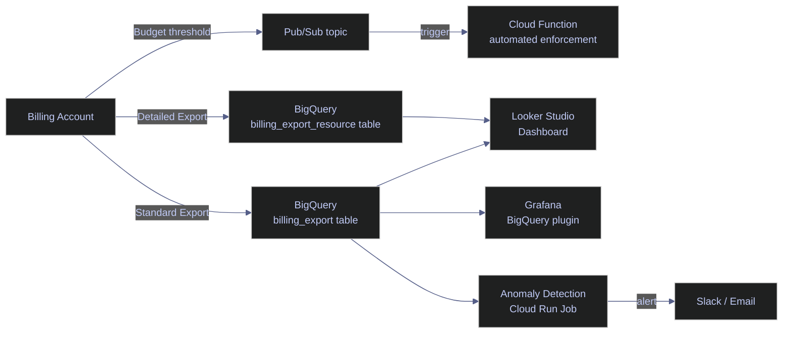
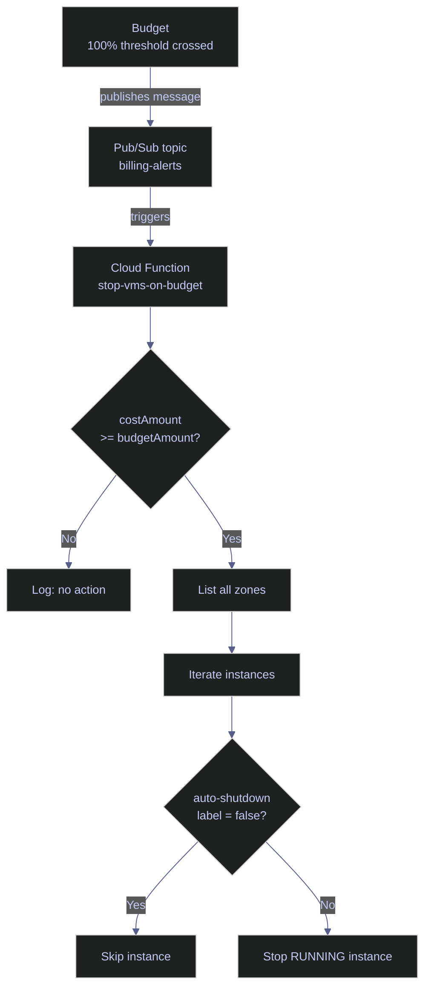
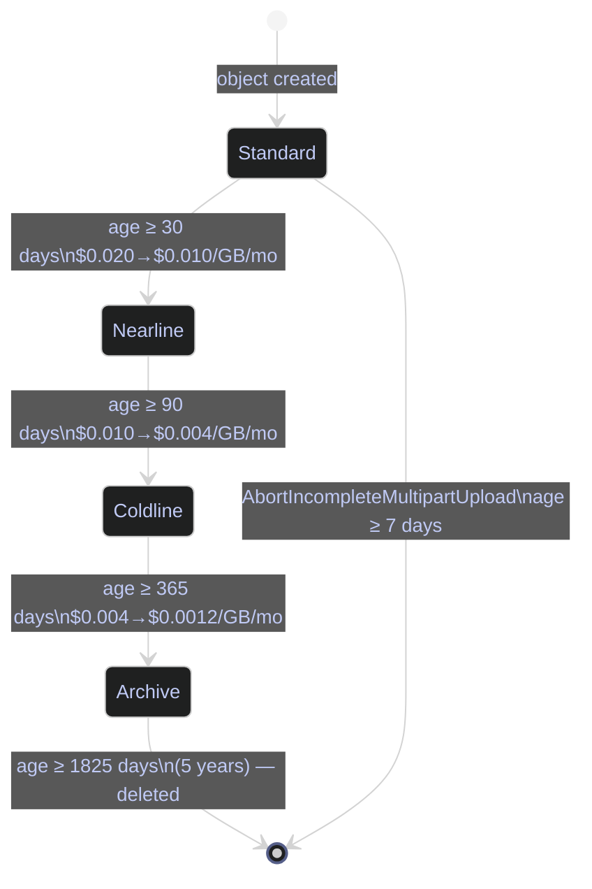

# GCP Cost Monitoring and Budgets

> [!quote]
> "A cloud budget without an alert is a credit card without a limit — you will only discover the damage after the bill arrives."
>
> — **J.R. Storment**, *Cloud FinOps*

> [!abstract]
> Operational FinOps for GCP. Covers the full stack: export billing data, alert on budgets, detect anomalies, optimize per service, and automate enforcement.



---

## Setting Up Billing Export to BigQuery

Billing export is the foundation of all cost analysis on GCP. Without it, you are flying blind — the billing console only shows aggregated data with limited filtering.

### Enable the Billing Export

Billing export is configured at the billing account level, not the project level. You need the account ID before enabling export — use the command below to retrieve it. Enabling the actual export has no direct `gcloud` command; it must be done in the Console (**Billing → Billing export → BigQuery export**) or via Terraform (`google_billing_account_bucket_config` — see the Terraform section below).

```bash
gcloud billing accounts list
```

You need two roles:
- `roles/billing.admin` on the billing account
- `roles/bigquery.dataEditor` on the destination dataset

### Create the Destination Dataset

The dataset must exist in BigQuery before enabling export in the console. The location must match the region where you want billing data stored — `US` is the standard choice for multi-regional availability.

```bash
bq mk \
  --dataset \
  --location=US \
  --description="GCP billing export" \
  PROJECT_ID:billing_export
```

Verify the dataset was created:

```bash
bq ls --datasets PROJECT_ID
```

### Standard vs Detailed Export

GCP offers three export types. Standard export covers daily resource-level costs and is sufficient for most cost tracking. Detailed export adds per-resource attribution (individual VM IDs, disk IDs) — required for right-sizing analysis and chargebacks. Pricing export provides SKU-level rates for building internal cost calculators.

| Export type | Table name suffix | Granularity | Use case |
|---|---|---|---|
| Standard | `gcp_billing_export_v1_XXXXXX` | Resource-level daily | General cost tracking |
| Detailed usage cost | `gcp_billing_export_resource_v1_XXXXXX` | SKU + resource ID | Attribution and right-sizing |
| Pricing | `cloud_pricing_export` | SKU pricing data | Build cost calculators |

Enable **detailed usage cost export** if you want resource-level attribution (e.g., per-VM, per-disk costs). It is more expensive in terms of rows but essential for serious FinOps work.

> [!warning] Export Lag
>
> Billing data typically lags by 24–48 hours. Do not alert on same-day data for critical decisions. Use a 2-day buffer in time-sensitive queries.

> [!success] Filter on `usage_start_time >= TIMESTAMP_SUB(... INTERVAL 2 DAY)` for reliable anomaly detection
> Always use a 2-day lag buffer when querying recent spend: `WHERE usage_start_time < TIMESTAMP_SUB(CURRENT_TIMESTAMP(), INTERVAL 2 DAY)`. This ensures your anomaly queries operate on complete billing rows, avoiding false-negative alerts from partially ingested data.

### Key Columns in the Export Table

The billing export table schema is consistent across all GCP projects but the `resource.name` column is only populated in the detailed export. The columns below are the most useful for cost analysis queries; the full schema has ~30 columns.

| Column | Type | Description |
|---|---|---|
| `billing_account_id` | STRING | Billing account |
| `service.description` | STRING | GCP service name (e.g., "BigQuery", "Compute Engine") |
| `sku.description` | STRING | SKU name (e.g., "N1 Predefined Instance Core") |
| `usage_start_time` | TIMESTAMP | Start of usage period |
| `usage_end_time` | TIMESTAMP | End of usage period |
| `project.id` | STRING | Project ID |
| `project.name` | STRING | Project name |
| `labels` | ARRAY | Resource labels as key-value pairs |
| `resource.name` | STRING | Resource identifier (detailed export only) |
| `location.region` | STRING | Region (e.g., "us-central1") |
| `cost` | FLOAT64 | Cost in billing currency after credits |
| `credits` | ARRAY | Promotions, SUDs, CUDs applied |
| `usage.amount` | FLOAT64 | Usage quantity |
| `usage.unit` | STRING | Usage unit (e.g., "byte-seconds", "seconds") |
| `currency` | STRING | Billing currency code |
| `invoice.month` | STRING | Invoice month (YYYYMM) |
| `cost_type` | STRING | regular, tax, adjustment, rounding_error |

### Example Queries

Production-ready SQL queries against the standard billing export table. Replace `PROJECT_ID.billing_export.gcp_billing_export_v1_XXXXXX` with your actual export table name (visible in BigQuery after enabling export). All queries filter on `cost_type = 'regular'` to exclude tax and rounding-error rows.

#### BigQuery billing export — cost by service, current month

```sql
SELECT
  service.description AS service,
  ROUND(SUM(cost), 2) AS total_cost,
  ROUND(SUM(cost) / SUM(SUM(cost)) OVER () * 100, 1) AS pct_of_total
FROM `PROJECT_ID.billing_export.gcp_billing_export_v1_XXXXXX`
WHERE
  invoice.month = FORMAT_DATE('%Y%m', CURRENT_DATE())
  AND cost_type = 'regular'
GROUP BY service
ORDER BY total_cost DESC;
```

#### BigQuery billing export — cost by label (team, pipeline)

```sql
SELECT
  (SELECT value FROM UNNEST(labels) WHERE key = 'team') AS team,
  ROUND(SUM(cost), 2) AS total_cost
FROM `PROJECT_ID.billing_export.gcp_billing_export_v1_XXXXXX`
WHERE
  invoice.month = FORMAT_DATE('%Y%m', CURRENT_DATE())
  AND cost_type = 'regular'
GROUP BY team
ORDER BY total_cost DESC;
```

#### BigQuery billing export — cost by project, current month

```sql
SELECT
  project.id AS project_id,
  project.name AS project_name,
  ROUND(SUM(cost), 2) AS total_cost
FROM `PROJECT_ID.billing_export.gcp_billing_export_v1_XXXXXX`
WHERE
  invoice.month = FORMAT_DATE('%Y%m', CURRENT_DATE())
  AND cost_type = 'regular'
GROUP BY project_id, project_name
ORDER BY total_cost DESC;
```

#### BigQuery billing export — daily spend trend, last 30 days

```sql
SELECT
  DATE(usage_start_time) AS usage_date,
  ROUND(SUM(cost), 2) AS daily_cost
FROM `PROJECT_ID.billing_export.gcp_billing_export_v1_XXXXXX`
WHERE
  usage_start_time >= TIMESTAMP_SUB(CURRENT_TIMESTAMP(), INTERVAL 30 DAY)
  AND cost_type = 'regular'
GROUP BY usage_date
ORDER BY usage_date;
```

#### BigQuery billing export — cost by SKU (find surprise line items)

```sql
SELECT
  service.description AS service,
  sku.description AS sku,
  location.region AS region,
  ROUND(SUM(cost), 2) AS total_cost,
  ROUND(SUM(usage.amount), 2) AS total_usage,
  usage.unit AS unit
FROM `PROJECT_ID.billing_export.gcp_billing_export_v1_XXXXXX`
WHERE
  invoice.month = FORMAT_DATE('%Y%m', CURRENT_DATE())
  AND cost_type = 'regular'
  AND cost > 0
GROUP BY service, sku, region, unit
ORDER BY total_cost DESC
LIMIT 50;
```

> [!tip] Partition Your Queries
>
> The billing export table is partitioned on `usage_start_time`. Always filter on this column (not `usage_end_time`) to avoid full table scans. A 30-day query on a busy account can easily scan 10+ GB without a partition filter.

---

## Budget Alerts

Budgets in GCP are attached to billing accounts and can scope to specific projects, services, or labels.

### Create a Budget via gcloud

A budget is a threshold definition — it does not stop spending. It fires Pub/Sub or email notifications when cumulative monthly spend crosses each threshold percentage. The Billing Budgets API must be enabled on the project owning the Pub/Sub topic.

#### gcloud | Create a billing-account-level budget with threshold alerts

A basic budget scoped to the entire billing account. Thresholds at 50%, 80%, and 100% fire progressively urgent alerts. Connecting a Pub/Sub topic enables automated enforcement (see the automation section below).

```bash
gcloud billing budgets create \
  --billing-account=ACCOUNT_ID \
  --display-name="Data Platform Monthly" \
  --budget-amount=500USD \
  --threshold-rule=percent=50 \
  --threshold-rule=percent=80 \
  --threshold-rule=percent=100 \
  --notifications-pubsub-topic=projects/PROJECT_ID/topics/billing-alerts
```

#### gcloud | Create a budget scoped to specific projects

Scoping a budget to a subset of projects lets each team own their cost ceiling independently. Multiple project IDs are comma-separated.

```bash
gcloud billing budgets create \
  --billing-account=ACCOUNT_ID \
  --display-name="Production Projects Budget" \
  --budget-amount=1000USD \
  --projects=projects/PROJECT_ID_1,projects/PROJECT_ID_2 \
  --threshold-rule=percent=80 \
  --threshold-rule=percent=100 \
  --notifications-pubsub-topic=projects/PROJECT_ID/topics/billing-alerts
```

#### gcloud | Create a budget scoped to a specific service

Scoping to a service uses the GCP service ID (not the display name). BigQuery's service ID is `95FF-2EF5-5EA1`. Useful for tracking a single expensive service independently of the overall project budget.

```bash
gcloud billing budgets create \
  --billing-account=ACCOUNT_ID \
  --display-name="BigQuery Budget" \
  --budget-amount=200USD \
  --filter-services=services/95FF-2EF5-5EA1 \
  --threshold-rule=percent=90 \
  --notifications-pubsub-topic=projects/PROJECT_ID/topics/billing-alerts
```

#### gcloud | List budgets on a billing account

```bash
gcloud billing budgets list --billing-account=ACCOUNT_ID
```

#### gcloud | Describe a budget

```bash
gcloud billing budgets describe BUDGET_ID --billing-account=ACCOUNT_ID
```

#### gcloud | Delete a budget

```bash
gcloud billing budgets delete BUDGET_ID --billing-account=ACCOUNT_ID
```

| Flag | Syntax | Description |
|---|---|---|
| `--billing-account` | `--billing-account=ACCOUNT_ID` | Billing account the budget belongs to |
| `--display-name` | `--display-name="Name"` | Human-readable budget name |
| `--budget-amount` | `--budget-amount=500USD` | Budget ceiling in `<amount><CURRENCY>` format |
| `--threshold-rule` | `--threshold-rule=percent=80` | Alert threshold as a percentage of the budget amount; repeat for multiple thresholds |
| `--notifications-pubsub-topic` | `--notifications-pubsub-topic=projects/P/topics/T` | Pub/Sub topic to receive budget alert messages |
| `--projects` | `--projects=projects/P1,projects/P2` | Scope the budget to specific projects |
| `--filter-services` | `--filter-services=services/SERVICE_ID` | Scope the budget to a specific GCP service |

> [!warning] Budget Alert Lag
>
> Budget alerts are based on spend data that can lag up to 24 hours. A 100% alert does not mean spending stops — charges continue to accrue. Use budget alerts as early warning signals, not hard cutoffs.

> [!success] Set the 100% threshold alert and connect a Pub/Sub automation for enforcement
> Configure alerts at 50%, 80%, and 100% thresholds. Attach a Pub/Sub topic to the budget and wire it to a Cloud Function that stops non-critical VMs when the 100% threshold fires. This provides automated enforcement rather than relying solely on email notifications.

### Budget Alert → Pub/Sub → Cloud Function

The full automation pattern: budget fires a Pub/Sub message, Cloud Function reacts.



#### gcloud | Create the Pub/Sub topic for billing alerts

The Billing service account (`billing-alerts@system.gserviceaccount.com`) is a GCP-managed service account that needs `roles/pubsub.publisher` on the topic before the budget can publish to it.

```bash
gcloud pubsub topics create billing-alerts --project=PROJECT_ID
```

```bash
gcloud pubsub topics add-iam-policy-binding billing-alerts \
  --member=serviceAccount:billing-alerts@system.gserviceaccount.com \
  --role=roles/pubsub.publisher \
  --project=PROJECT_ID
```

#### Python / gcloud | Deploy Cloud Function to auto-shutdown VMs on budget exceeded

```python
# main.py — Cloud Function triggered by Pub/Sub billing alert
import base64
import json
import googleapiclient.discovery
from google.cloud import compute_v1


def stop_vms_on_budget_exceeded(event, context):
    """Stop all non-critical VMs when budget threshold is exceeded."""

    # Decode the Pub/Sub message
    pubsub_data = base64.b64decode(event['data']).decode('utf-8')
    budget_data = json.loads(pubsub_data)

    cost_amount = budget_data.get('costAmount', 0)
    budget_amount = budget_data.get('budgetAmount', 0)

    # Only act at 100% threshold
    if cost_amount < budget_amount:
        print(f"Spend {cost_amount} < budget {budget_amount}. No action.")
        return

    print(f"Budget exceeded: {cost_amount} / {budget_amount}. Stopping VMs.")

    compute = compute_v1.InstancesClient()
    zones_client = compute_v1.ZonesClient()

    project = "YOUR_PROJECT_ID"  # or read from env var

    # List all zones
    for zone in zones_client.list(project=project):
        zone_name = zone.name

        # List instances in zone
        for instance in compute.list(project=project, zone=zone_name):
            # Skip instances tagged as critical
            labels = instance.labels or {}
            if labels.get('auto-shutdown') == 'false':
                print(f"Skipping {instance.name} (auto-shutdown=false)")
                continue

            if instance.status == 'RUNNING':
                print(f"Stopping {instance.name} in {zone_name}")
                compute.stop(
                    project=project,
                    zone=zone_name,
                    instance=instance.name
                )
```

Deploy the function triggered by the `billing-alerts` Pub/Sub topic:

```bash
gcloud functions deploy stop-vms-on-budget \
  --runtime=python311 \
  --trigger-topic=billing-alerts \
  --entry-point=stop_vms_on_budget_exceeded \
  --region=us-central1 \
  --service-account=budget-enforcer@PROJECT_ID.iam.gserviceaccount.com \
  --set-env-vars=PROJECT_ID=PROJECT_ID
```

Grant the `budget-enforcer` service account permission to stop VMs:

```bash
gcloud projects add-iam-policy-binding PROJECT_ID \
  --member=serviceAccount:budget-enforcer@PROJECT_ID.iam.gserviceaccount.com \
  --role=roles/compute.instanceAdmin.v1
```

### Multiple Budget Strategy

A single billing-account budget is insufficient for multi-team environments. Layer budgets at different scopes so each team owns their ceiling, and the platform team retains visibility at the account level.

| Budget scope | Threshold | Action |
|---|---|---|
| Per billing account | 80%, 100% | Email alert + Slack |
| Per production project | 90%, 100% | Email + auto-shutdown |
| Per team (via labels) | 80% | Email team lead |
| BigQuery only | 80% | Disable on-demand slots |
| Dev/staging environment | 50% | Auto-shutdown non-prod VMs |

```bash
# Label-based budget (e.g., for a specific team)
# Note: label-based budgets require the Billing API; use Terraform for this
# See Terraform section for the resource definition
```

---

## Cost Anomaly Detection

Automated anomaly detection catches runaway jobs, misconfigured resources, and unexpected usage spikes before they appear on the invoice.

### BigQuery SQL — Detect Spend Anomalies

The query below computes a 7-day rolling average per service and flags any day where spend exceeds 2× the average as `ANOMALY` and 1.5× as `ELEVATED`. It runs against the previous day's data (with the 1-day lag buffer) so it can be scheduled via Cloud Scheduler each morning.

```sql
-- Daily spend vs 7-day rolling average
-- Flag days where spend is more than 2x the average
WITH daily_spend AS (
  SELECT
    DATE(usage_start_time) AS usage_date,
    service.description AS service,
    SUM(cost) AS daily_cost
  FROM `PROJECT_ID.billing_export.gcp_billing_export_v1_XXXXXX`
  WHERE
    usage_start_time >= TIMESTAMP_SUB(CURRENT_TIMESTAMP(), INTERVAL 30 DAY)
    AND cost_type = 'regular'
  GROUP BY usage_date, service
),
rolling_avg AS (
  SELECT
    usage_date,
    service,
    daily_cost,
    AVG(daily_cost) OVER (
      PARTITION BY service
      ORDER BY usage_date
      ROWS BETWEEN 7 PRECEDING AND 1 PRECEDING
    ) AS seven_day_avg
  FROM daily_spend
)
SELECT
  usage_date,
  service,
  ROUND(daily_cost, 2) AS daily_cost,
  ROUND(seven_day_avg, 2) AS seven_day_avg,
  ROUND(daily_cost / NULLIF(seven_day_avg, 0), 2) AS ratio,
  CASE
    WHEN daily_cost > seven_day_avg * 2 THEN 'ANOMALY'
    WHEN daily_cost > seven_day_avg * 1.5 THEN 'ELEVATED'
    ELSE 'NORMAL'
  END AS status
FROM rolling_avg
WHERE
  usage_date = DATE_SUB(CURRENT_DATE(), INTERVAL 1 DAY)
  AND seven_day_avg > 1  -- ignore near-zero baseline
ORDER BY ratio DESC;
```

### Python — Automated Anomaly Detection and Alerting

A self-contained script that wraps the anomaly SQL above, posts a Slack alert when anomalies are found, and is designed to run as a daily Cloud Run Job or Cloud Function. Configuration is via environment variables so no credentials are embedded in code.

```python
#!/usr/bin/env python3
"""
gcp_cost_anomaly.py
Run daily (Cloud Scheduler → Cloud Run job or Cloud Function).
Queries billing export, detects anomalies, sends Slack/email alerts.
"""

import os
from datetime import date, timedelta
from google.cloud import bigquery
import requests


BILLING_TABLE = os.environ["BILLING_TABLE"]  # PROJECT.dataset.table
SLACK_WEBHOOK = os.environ.get("SLACK_WEBHOOK_URL")
ANOMALY_RATIO_THRESHOLD = float(os.environ.get("ANOMALY_THRESHOLD", "2.0"))
MIN_BASELINE_COST = float(os.environ.get("MIN_BASELINE_COST", "5.0"))


ANOMALY_QUERY = """
WITH daily_spend AS (
  SELECT
    DATE(usage_start_time) AS usage_date,
    service.description AS service,
    SUM(cost) AS daily_cost
  FROM `{table}`
  WHERE
    usage_start_time >= TIMESTAMP_SUB(CURRENT_TIMESTAMP(), INTERVAL 30 DAY)
    AND cost_type = 'regular'
  GROUP BY usage_date, service
),
rolling_avg AS (
  SELECT
    usage_date,
    service,
    daily_cost,
    AVG(daily_cost) OVER (
      PARTITION BY service
      ORDER BY usage_date
      ROWS BETWEEN 7 PRECEDING AND 1 PRECEDING
    ) AS seven_day_avg
  FROM daily_spend
)
SELECT
  usage_date,
  service,
  ROUND(daily_cost, 2) AS daily_cost,
  ROUND(seven_day_avg, 2) AS seven_day_avg,
  ROUND(daily_cost / NULLIF(seven_day_avg, 0), 2) AS ratio
FROM rolling_avg
WHERE
  usage_date = DATE_SUB(CURRENT_DATE(), INTERVAL 1 DAY)
  AND seven_day_avg > {min_baseline}
  AND daily_cost > seven_day_avg * {threshold}
ORDER BY ratio DESC
""".format(
    table=BILLING_TABLE,
    min_baseline=MIN_BASELINE_COST,
    threshold=ANOMALY_RATIO_THRESHOLD,
)


def detect_anomalies():
    client = bigquery.Client()
    results = client.query(ANOMALY_QUERY).result()
    anomalies = [dict(row) for row in results]
    return anomalies


def send_slack_alert(anomalies: list[dict]):
    if not SLACK_WEBHOOK or not anomalies:
        return

    lines = [f"*GCP Cost Anomaly Alert* — {date.today() - timedelta(days=1)}"]
    for a in anomalies:
        lines.append(
            f"• *{a['service']}*: ${a['daily_cost']:.2f} vs "
            f"${a['seven_day_avg']:.2f} avg ({a['ratio']:.1f}x)"
        )

    payload = {"text": "\n".join(lines)}
    resp = requests.post(SLACK_WEBHOOK, json=payload, timeout=10)
    resp.raise_for_status()


def main():
    anomalies = detect_anomalies()
    if anomalies:
        print(f"Found {len(anomalies)} anomalies:")
        for a in anomalies:
            print(f"  {a['service']}: {a['ratio']}x above baseline")
        send_slack_alert(anomalies)
    else:
        print("No anomalies detected.")


if __name__ == "__main__":
    main()
```

### Cloud Monitoring Custom Metric for Daily Spend

Writing daily spend as a custom Cloud Monitoring metric enables alerting policies and dashboard charts without relying on the billing console. The metric can be queried alongside infrastructure metrics (CPU, memory, error rates) in the same Monitoring workspace. Requires the `monitoring.metricDescriptors.create` and `monitoring.timeSeries.create` permissions (included in `roles/monitoring.metricWriter`).

```python
from google.cloud import monitoring_v3
from google.cloud import bigquery
import time

def write_daily_spend_metric(project_id: str, cost: float, service: str):
    client = monitoring_v3.MetricServiceClient()
    project_name = f"projects/{project_id}"

    series = monitoring_v3.TimeSeries()
    series.metric.type = "custom.googleapis.com/billing/daily_spend"
    series.metric.labels["service"] = service
    series.resource.type = "global"
    series.resource.labels["project_id"] = project_id

    now = time.time()
    interval = monitoring_v3.TimeInterval(
        {"end_time": {"seconds": int(now), "nanos": 0}}
    )
    point = monitoring_v3.Point(
        {"interval": interval, "value": {"double_value": cost}}
    )
    series.points = [point]

    client.create_time_series(name=project_name, time_series=[series])
    print(f"Written metric: {service} = ${cost:.2f}")
```

---

## Cost Optimization Strategies

Each GCP service has a distinct pricing model and a corresponding set of optimization levers. The sections below cover Compute Engine, BigQuery, Cloud Storage, Cloud Run, Pub/Sub, Cloud Logging, Cloud NAT, and Firestore — with specific commands, configuration patterns, and cost traps for each.

### Compute Engine

Compute Engine is typically the largest cost driver. The three primary levers are right-sizing (using GCP Recommender to identify oversized VMs), scheduling (shutting down non-production VMs overnight and on weekends), and Committed Use Discounts (exchanging flexibility for up to 55% off on-demand rates). Spot VMs offer 60–91% savings for fault-tolerant batch workloads.

#### Right-Sizing with GCP Recommender

The GCP Recommender analyzes VM CPU and memory utilization over the past 8 days and generates machine-type recommendations. Idle VM recommendations flag instances with near-zero CPU over the same window. Recommendations must be explicitly acknowledged (`mark-claimed`) before you resize to prevent conflicting changes.

```bash
gcloud recommender recommendations list \
  --recommender=google.compute.instance.MachineTypeRecommender \
  --location=us-central1-a \
  --project=PROJECT_ID \
  --format="table(name,stateInfo.state,primaryImpact.costProjection.cost.units)"
```

List VMs flagged as idle (near-zero CPU utilization for 8+ days):

```bash
gcloud recommender recommendations list \
  --recommender=google.compute.instance.IdleResourceRecommender \
  --location=us-central1-a \
  --project=PROJECT_ID
```

Acknowledge a recommendation before resizing — this locks it so the Recommender doesn't conflict with your change. The `--etag` value comes from the recommendation's `etag` field in the list output.

```bash
gcloud recommender recommendations mark-claimed \
  RECOMMENDATION_ID \
  --recommender=google.compute.instance.MachineTypeRecommender \
  --location=us-central1-a \
  --project=PROJECT_ID \
  --etag=ETAG
```

| Flag | Syntax | Description |
|---|---|---|
| `--recommender` | `--recommender=google.compute.instance.MachineTypeRecommender` | Recommender type |
| `--location` | `--location=ZONE` | Zone to query (zone-scoped for VM recommenders) |
| `--project` | `--project=PROJECT_ID` | Project to query |
| `--format` | `--format="table(...)"` | Output format; `table(name,stateInfo.state,...)` for tabular display |
| `--etag` | `--etag=ETAG` | Optimistic concurrency lock; required for `mark-claimed` |

#### Schedule VM Shutdown with Cloud Scheduler

Cloud Scheduler sends authenticated HTTP requests to the Compute Engine REST API on a cron schedule. The pattern below stops dev VMs at 8 PM UTC weekdays and restarts them at 7 AM, eliminating ~13 idle hours per weekday (54% of the day). A dedicated service account with only `roles/compute.instanceAdmin.v1` is used — not a broad editor role. For the full Cloud Scheduler reference, see [GCP Scheduling](https://alp78.github.io/elysium/12-Orchestration/Scheduling/gcp-scheduling).

Create the service account and grant it the minimum required role:

```bash
gcloud iam service-accounts create vm-scheduler \
  --display-name="VM Scheduler"
```

```bash
gcloud projects add-iam-policy-binding PROJECT_ID \
  --member=serviceAccount:vm-scheduler@PROJECT_ID.iam.gserviceaccount.com \
  --role=roles/compute.instanceAdmin.v1
```

Create the stop job (fires at 8 PM UTC Mon–Fri):

```bash
gcloud scheduler jobs create http stop-dev-vms \
  --schedule="0 20 * * 1-5" \
  --uri="https://compute.googleapis.com/compute/v1/projects/PROJECT_ID/zones/ZONE/instances/INSTANCE_NAME/stop" \
  --http-method=POST \
  --oauth-service-account-email=vm-scheduler@PROJECT_ID.iam.gserviceaccount.com \
  --location=us-central1
```

Create the start job (fires at 7 AM UTC Mon–Fri):

```bash
gcloud scheduler jobs create http start-dev-vms \
  --schedule="0 7 * * 1-5" \
  --uri="https://compute.googleapis.com/compute/v1/projects/PROJECT_ID/zones/ZONE/instances/INSTANCE_NAME/start" \
  --http-method=POST \
  --oauth-service-account-email=vm-scheduler@PROJECT_ID.iam.gserviceaccount.com \
  --location=us-central1
```

> [!warning] Spot VM Gotcha
>
> Spot VMs can be preempted with 30 seconds notice. Never run stateful workloads or anything that cannot checkpoint. Use them for: batch ETL, ML training jobs, CI/CD workers, and parallelizable data processing.

> [!success] Design Spot workloads with checkpointing or idempotent retries
> Structure Spot-based jobs so each unit of work is independently retryable. For Dataflow, enable checkpointing. For Cloud Run Jobs, ensure each task execution is idempotent — if a task is re-run after preemption, it should produce the same result without duplication.

#### Committed Use Discounts

Committed Use Discounts (CUDs) exchange flexibility for a reduced rate. General-purpose CUDs commit to a specific number of vCPUs and GB of memory in a region for 1 or 3 years — you pay for the commitment regardless of actual usage. Sustained Use Discounts (SUDs) apply automatically when a VM runs more than 25% of a month with no action required.

Purchase a 1-year CUD committing to 10 vCPUs and 40 GB memory in `us-central1`:

```bash
gcloud compute commitments create my-commitment \
  --plan=12-month \
  --region=us-central1 \
  --resources=vcpu=10,memory=40GB \
  --type=GENERAL_PURPOSE
```

```bash
gcloud compute commitments list --region=us-central1
```

```bash
gcloud compute commitments describe my-commitment --region=us-central1
```

| Discount type | Commitment | Discount |
|---|---|---|
| Sustained Use Discount (SUD) | Automatic | Up to 30% for N1 |
| Committed Use Discount 1yr | 1-year commit | ~37% |
| Committed Use Discount 3yr | 3-year commit | ~55% |
| Spot VM | No commit, preemptible | 60–91% |

| Flag | Syntax | Description |
|---|---|---|
| `--plan` | `--plan=12-month` | Commitment duration: `12-month` or `36-month` |
| `--region` | `--region=REGION` | Region for the commitment (must match VMs) |
| `--resources` | `--resources=vcpu=10,memory=40GB` | vCPU count and memory in GB |
| `--type` | `--type=GENERAL_PURPOSE` | Machine family: `GENERAL_PURPOSE`, `MEMORY_OPTIMIZED`, `ACCELERATOR_OPTIMIZED` |

> [!tip] Custom Machine Types
>
> When a standard machine type has more RAM or vCPU than you need, create a custom machine type. Example: instead of n2-standard-8 (8 vCPU, 32 GB), use `n2-custom-6-24576` (6 vCPU, 24 GB). Pay only for what you configure.

```bash
gcloud compute instances create my-instance \
  --machine-type=n2-custom-6-24576 \
  --zone=us-central1-a
```

---

### BigQuery

BigQuery on-demand pricing charges per byte scanned. The primary cost levers are partitioning and clustering (reduces scan size), dry-run validation before execution, per-user quotas (prevents accidental full-table scans), and slot-based capacity commitments (converts variable per-byte cost to a fixed monthly rate). For query optimization patterns beyond cost controls, see [BigQuery query patterns](https://alp78.github.io/elysium/05-DB-Queries/BigQuery/bq-fundamentals).

> [!warning] On-Demand Cost Trap
>
> On-demand BigQuery pricing charges per byte scanned. A single `SELECT *` on a 10 TB table costs ~$50. Enforce partition filters and use `--dry_run` before running unfamiliar queries.

> [!success] Enable `require_partition_filter` and run `--dry_run` before executing
> Set `require_partition_filter = TRUE` on large tables so that any unfiltered query fails at the API level before scanning data. Always run `bq query --dry_run` on new queries to see the byte estimate before incurring cost.

#### Partition and Cluster Tables

Partitioning limits the bytes scanned by restricting which date shards are read. Clustering further prunes data within each partition by sorting on the specified columns. Together they can reduce scan size by 90%+ on a well-filtered query. `require_partition_filter = TRUE` enforces that every query must include a partition predicate — any unfiltered query fails before scanning data.

```sql
-- Create a partitioned and clustered table
CREATE TABLE `PROJECT_ID.dataset.events`
PARTITION BY DATE(event_timestamp)
CLUSTER BY user_id, event_type
OPTIONS (
  partition_expiration_days = 365,
  require_partition_filter = TRUE
)
AS SELECT * FROM source_table;
```

```bash
# Enable partition filter requirement on existing table
bq update \
  --require_partition_filter=true \
  PROJECT_ID:dataset.events
```

#### Dry Run Before Expensive Queries

> [!info] Why dry run matters
> On-demand BigQuery charges per byte scanned — a single `SELECT *` on a 10 TB table costs ~$50. `--dry_run` validates the query and reports how many bytes it would scan **without executing it**. Wrap this in a script to enforce a byte ceiling: if the estimate exceeds the limit, abort before any cost is incurred.

```bash
bq query \
  --dry_run \
  --use_legacy_sql=false \
  'SELECT * FROM `PROJECT_ID.dataset.events` WHERE DATE(event_timestamp) = "2026-01-01"'
```

```text
Query successfully validated. Assuming the tables are not modified,
running this query will process 1234567890 bytes of data.
```

The script below aborts execution if the byte estimate exceeds a configured ceiling (10 GB here = ~$50 at on-demand rates):

```bash
BYTES_LIMIT=10737418240
BYTES=$(bq query --dry_run --use_legacy_sql=false "$QUERY" 2>&1 | grep -oP '\d+ bytes')
if [ "$BYTES" -gt "$BYTES_LIMIT" ]; then
  echo "Query would scan $(numfmt --to=iec $BYTES). Aborting."
  exit 1
fi
```

#### Set Per-User and Per-Project Byte Quotas

> [!info] Why quotas matter
> Without quotas, a single analyst running an unfiltered `SELECT *` can scan terabytes and blow the entire team's monthly budget in one query. Per-user byte quotas cap how much data each user can scan per day. Capacity commitments (slot-based pricing) provide a predictable monthly cost instead of pay-per-byte.

Create a capacity commitment using BigQuery Editions slot-based pricing. `FLEX` slots are provisioned within seconds and can be cancelled after 60 seconds — use for variable workloads. `MONTHLY` and `ANNUAL` plans offer higher discounts for predictable workloads.

```bash
gcloud alpha bq reservations capacity-commitments create \
  --location=us-central1 \
  --slot-count=100 \
  --plan=FLEX \
  --project=PROJECT_ID
```

Set per-user byte quotas via the console: **IAM & Admin → Quotas → "Query usage per day per user"**.

BigQuery Editions replaces the legacy flat-rate reservations with three tiers:

| Edition | Autoscaling | Commitment options | Best for |
|---|---|---|---|
| Standard | Yes (up to max slots) | None | Variable analytics workloads |
| Enterprise | Yes | 1-year or 3-year | Production analytics with predictable usage |
| Enterprise Plus | Yes | 1-year or 3-year | Highest performance, largest discounts |

Check current quota settings:

```bash
gcloud quotas info --service=bigquery.googleapis.com --project=PROJECT_ID
```

#### Materialized Views for Repeated Queries

> [!abstract] How materialized views save cost
> A materialized view pre-computes and caches expensive aggregations. BigQuery automatically rewrites incoming queries to read from the MV instead of scanning the full base table — the user doesn't need to reference the MV explicitly. With `enable_refresh = TRUE`, the cache refreshes on a schedule (e.g., every 60 minutes). You pay for the refresh scan, but all subsequent reads hit the cached result at near-zero cost.

```sql
CREATE MATERIALIZED VIEW `PROJECT_ID.dataset.daily_revenue_mv`
PARTITION BY report_date
OPTIONS (enable_refresh = TRUE, refresh_interval_minutes = 60)
AS
SELECT
  DATE(order_timestamp) AS report_date,
  product_category,
  COUNT(*) AS order_count,
  SUM(revenue_usd) AS total_revenue
FROM `PROJECT_ID.dataset.orders`
GROUP BY report_date, product_category;
```

---

### Cloud Storage

GCS pricing has three components: storage (per GB per month, varies by class), retrieval (per GB read for Nearline/Coldline/Archive), and operations (per-request). The primary cost lever is lifecycle policies — automatically transitioning objects to cheaper storage classes as they age and deleting them before they accumulate indefinitely.

#### Lifecycle Policies

Apply a lifecycle configuration from a local JSON file (see the `lifecycle.json` example below for the full tiering ruleset):

```bash
gcloud storage buckets update gs://BUCKET_NAME \
  --lifecycle-file=lifecycle.json
```

View the current lifecycle configuration on a bucket:

```bash
gcloud storage buckets describe gs://BUCKET_NAME \
  --format="value(lifecycle)"
```

#### lifecycle.json — full GCS tiering: Nearline → Coldline → Archive → Delete

```json
{
  "lifecycle": {
    "rule": [
      {
        "action": {"type": "SetStorageClass", "storageClass": "NEARLINE"},
        "condition": {"age": 30, "matchesStorageClass": ["STANDARD"]}
      },
      {
        "action": {"type": "SetStorageClass", "storageClass": "COLDLINE"},
        "condition": {"age": 90, "matchesStorageClass": ["NEARLINE"]}
      },
      {
        "action": {"type": "SetStorageClass", "storageClass": "ARCHIVE"},
        "condition": {"age": 365, "matchesStorageClass": ["COLDLINE"]}
      },
      {
        "action": {"type": "Delete"},
        "condition": {"age": 1825}
      },
      {
        "action": {"type": "AbortIncompleteMultipartUpload"},
        "condition": {"age": 7}
      }
    ]
  }
}
```

> [!warning] Early Deletion Fees
>
> Nearline has a 30-day minimum storage duration. Coldline: 90 days. Archive: 365 days. If you delete or transition early, you still pay for the minimum. Design lifecycle rules so objects stay in each class at least as long as the minimum.

> [!success] Match lifecycle transition ages to minimum storage durations
> Configure lifecycle rules with `age: 30` for Nearline transitions, `age: 90` for Coldline, and `age: 365` for Archive. Never transition objects before these ages and you will never incur an early-deletion fee.



Find buckets without any lifecycle policy configured:

```bash
gcloud storage ls --project=PROJECT_ID | while read bucket; do
  policy=$(gcloud storage buckets describe "$bucket" --format="value(lifecycle)" 2>/dev/null)
  if [ -z "$policy" ]; then
    echo "No lifecycle: $bucket"
  fi
done
```

Estimate cost distribution of objects in a bucket by storage class (output: class, count, total bytes):

```bash
gcloud storage ls --recursive --long gs://BUCKET_NAME | \
  awk '{sum[$4] += $1; count[$4]++} END {for (c in sum) print c, count[c], sum[c]}'
```

#### GCS storage class pricing — Standard, Nearline, Coldline, Archive rates

| Class | Storage/GB/month | Retrieval/GB | Min duration |
|---|---|---|---|
| Standard | $0.020 | $0 | None |
| Nearline | $0.010 | $0.01 | 30 days |
| Coldline | $0.004 | $0.02 | 90 days |
| Archive | $0.0012 | $0.05 | 365 days |

---

### Cloud Run

Cloud Run bills per 100ms of vCPU + memory allocation during active request handling. The two biggest levers are scaling to zero (`--min-instances=0`) which eliminates idle cost entirely, and right-sizing CPU and memory allocations to match actual workload requirements.

> [!info] Cloud Run cost levers
> - **Scale to zero** (`--min-instances=0`) — no idle cost; container only runs when triggered
> - **Right-size CPU/memory** — don't allocate 2 vCPU + 2 GB for a job that peaks at 0.5 vCPU + 256 MB
> - **CPU allocation mode** — default (throttled) only charges CPU during request processing; always-on (`--no-cpu-throttling`) costs more but keeps background work alive
> - **Job parallelism** — controls how many task instances run concurrently (more parallelism = faster but higher peak cost)

#### gcloud | Set scaling to zero for a Cloud Run service

Setting `--min-instances=0` eliminates idle cost — the container only runs when a request arrives. Latency for the first request after a cold start increases by ~200–500ms depending on image size.

```bash
gcloud run services update SERVICE_NAME \
  --min-instances=0 \
  --max-instances=10 \
  --region=us-central1
```

#### gcloud | Right-size CPU and memory allocation

Reduce CPU and memory to match actual workload requirements. Use Cloud Monitoring to check the `container/cpu/utilizations` and `container/memory/utilizations` metrics before committing to a smaller allocation.

```bash
gcloud run services update SERVICE_NAME \
  --cpu=0.5 \
  --memory=512Mi \
  --region=us-central1
```

#### gcloud | Disable always-on CPU (throttled mode)

By default, Cloud Run throttles CPU when no request is being processed. If `--no-cpu-throttling` is enabled (always-on), CPU is allocated even while idle. Setting it back to throttled reduces cost for services that do not need background processing.

```bash
gcloud run services update SERVICE_NAME \
  --no-cpu-throttling=false \
  --region=us-central1
```

#### gcloud | Set parallelism on a Cloud Run Job

Parallelism controls how many task instances run concurrently. Higher parallelism reduces wall-clock time but increases peak cost. Tune to balance throughput requirements against cost ceiling.

```bash
gcloud run jobs update JOB_NAME \
  --parallelism=5 \
  --region=us-central1
```

| Flag | Syntax | Description |
|---|---|---|
| `--min-instances` | `--min-instances=0` | Minimum running instances; 0 enables scale-to-zero |
| `--max-instances` | `--max-instances=N` | Maximum concurrent instances |
| `--cpu` | `--cpu=0.5` | vCPU allocation per instance (0.08 to 8) |
| `--memory` | `--memory=512Mi` | Memory per instance; minimum 128Mi |
| `--no-cpu-throttling` | `--no-cpu-throttling=false` | false = throttled (cheaper); true = always-on |
| `--parallelism` | `--parallelism=N` | Concurrent task instances for Cloud Run Jobs |

> [!tip] Cloud Run vs Functions Cost
>
> Cloud Run bills per 100ms of CPU+memory allocation. Cloud Functions Gen2 runs on Cloud Run under the hood. For jobs that run infrequently and complete quickly, Cloud Run Jobs with `min-instances=0` is almost free — you only pay during execution.

---

### Pub/Sub

Pub/Sub pricing is per message (first 10 GB/month free, then $0.04/GB) plus optional message retention storage. For very high-throughput pipelines, Pub/Sub Lite offered reserved-capacity pricing but was deprecated by Google in 2023.

> [!warning] Pub/Sub Lite is deprecated
>
> Google deprecated Pub/Sub Lite in 2023. New workloads should use standard Pub/Sub. Existing Pub/Sub Lite resources should be migrated to Pub/Sub before the service is shut down. The cost difference has narrowed significantly with Pub/Sub compression and batching options.

> [!success] Use message batching and compression on the publisher side instead
> Standard Pub/Sub supports message batching (`batch_settings`) and message compression (`enable_message_ordering` + gzip) to reduce throughput costs without the operational overhead of Pub/Sub Lite partition management.

#### gcloud | Create a Pub/Sub Lite topic (legacy — deprecated)

The commands below are retained for reference only. Pub/Sub Lite is deprecated. Do not use for new workloads.

```bash
# Create a Pub/Sub Lite topic
gcloud pubsub lite-topics create my-lite-topic \
  --location=us-central1 \
  --partitions=1 \
  --per-partition-publish-mib=1 \
  --per-partition-subscribe-mib=2
```

#### gcloud | Set subscription retention to minimum

Setting retention duration to the minimum required reduces message storage fees on standard Pub/Sub subscriptions.

```bash
gcloud pubsub subscriptions modify-config SUBSCRIPTION_NAME \
  --message-retention-duration=1d
```

#### Pub/Sub vs Pub/Sub Lite — feature and cost comparison

| Feature | Pub/Sub | Pub/Sub Lite |
|---|---|---|
| Pricing model | Per message + throughput | Reserved capacity |
| Zonal/Regional | Regional | Zonal |
| Ordering | At-subscription level | Partition-level |
| Break-even | < 5 GB/day throughput | > 5 GB/day throughput |
| Management | Zero | Partition sizing required |

---

### Cloud Logging

Cloud Logging charges $0.01/GB for ingestion beyond the first 50 GB/project/month (free tier). The primary lever is exclusions — dropping high-volume, low-value logs before ingestion. For deeper monitoring coverage including alerting policies and SLO dashboards, see [GCP Native Observability](https://alp78.github.io/elysium/13-Observability/GCP-Native/gcp-monitoring).

> [!warning] Logging Cost Trap
>
> Cloud Logging charges $0.01/GB for ingestion beyond the free tier (first 50 GB/project/month are free). A verbose application logging at DEBUG level can easily exceed 100 GB/month. Always exclude DEBUG in production.

> [!success] Add a `severity<=DEBUG` exclusion on the `_Default` sink
> Run `gcloud logging sinks update _Default --add-exclusion="name=exclude-debug,filter=severity<=DEBUG"` to drop all DEBUG-level logs before ingestion. Monitor log volume weekly via Cloud Logging's ingestion metrics to catch regressions before they appear on the bill.

#### Exclude Debug Logs

Add an exclusion to the `_Default` sink to drop all logs at DEBUG severity and below before ingestion:

```bash
gcloud logging sinks update _Default \
  --add-exclusion="name=exclude-debug,filter=severity<=DEBUG"
```

Verify the exclusion was applied:

```bash
gcloud logging sinks describe _Default
```

Exclude a specific noisy endpoint (e.g., health check probes that generate thousands of 200 OK log entries per hour):

```bash
gcloud logging sinks update _Default \
  --add-exclusion='name=exclude-healthcheck,filter=httpRequest.requestUrl="/health"'
```

List all active exclusions on the default sink:

```bash
gcloud logging sinks describe _Default --format="json" | \
  python3 -c "import json,sys; [print(e['name'], e['filter']) for e in json.load(sys.stdin).get('exclusions', [])]"
```

#### Route Old Logs to GCS (Cheaper Retention)

Cloud Logging storage beyond 30 days costs $0.01/GB/month. Routing to a Coldline GCS bucket costs $0.004/GB/month — a 60% reduction. The sink's writer identity (a service account managed by GCP) must be granted `roles/storage.objectCreator` on the destination bucket.

Create the GCS sink with a log filter routing logs older than a cutoff date:

```bash
gcloud logging sinks create long-term-logs-sink \
  storage.googleapis.com/BUCKET_NAME \
  --log-filter='timestamp < "2026-01-01T00:00:00Z"' \
  --project=PROJECT_ID
```

Retrieve the sink's auto-generated writer identity and grant it write access to the destination bucket:

```bash
WRITER=$(gcloud logging sinks describe long-term-logs-sink \
  --format="value(writerIdentity)")
gcloud storage buckets add-iam-policy-binding gs://BUCKET_NAME \
  --member="$WRITER" \
  --role=roles/storage.objectCreator
```

#### Set Custom Retention per Log Bucket

The `_Default` log bucket retains logs for 30 days at no storage cost. Custom buckets allow shorter or longer retention. Shortening to 7 days for high-volume debug buckets reduces incidental storage charges; extending beyond 30 days incurs $0.01/GB/month storage fees.

Create a custom log bucket with 7-day retention for high-volume or debug logs:

```bash
gcloud logging buckets create short-retention-logs \
  --location=global \
  --retention-days=7 \
  --project=PROJECT_ID
```

Reduce the `_Default` bucket retention from 30 days to 14 days:

```bash
gcloud logging buckets update _Default \
  --location=global \
  --retention-days=14 \
  --project=PROJECT_ID
```

| Flag | Syntax | Description |
|---|---|---|
| `--add-exclusion` | `--add-exclusion="name=X,filter=F"` | Add a log exclusion by filter expression |
| `--log-filter` | `--log-filter='...'` | Filter expression for sink routing |
| `--retention-days` | `--retention-days=N` | Retention period for a log bucket |
| `--location` | `--location=global` | Location of the log bucket (`global` for the `_Default` bucket) |

#### Cloud Logging cost reference — ingestion, storage, routing rates

| Tier | Cost |
|---|---|
| First 50 GB/project/month | Free |
| Above 50 GB | $0.01/GB ingestion |
| Storage beyond 30 days | $0.01/GB/month |
| GCS archive (via sink) | ~$0.004/GB/month (Coldline) |

---

### Cloud NAT

Cloud NAT charges per GB of data processed ($0.045/GB in most regions). If VMs only need to reach GCP APIs (BigQuery, GCS, Pub/Sub), Private Google Access is free and eliminates the need for a NAT gateway entirely.

#### gcloud | List NAT gateways on a router

Check which routers have NAT gateways configured before deciding whether to replace them with Private Google Access.

```bash
gcloud compute routers nats list \
  --router=ROUTER_NAME \
  --region=us-central1 \
  --project=PROJECT_ID
```

#### gcloud | Delete a NAT gateway

```bash
gcloud compute routers nats delete NAT_NAME \
  --router=ROUTER_NAME \
  --region=us-central1
```

#### gcloud | Enable Private Google Access on a subnet

Enabling Private Google Access allows VMs without external IPs to reach GCP APIs without NAT, eliminating NAT processing charges for GCP-internal traffic.

```bash
gcloud compute networks subnets update SUBNET_NAME \
  --region=us-central1 \
  --enable-private-ip-google-access
```

| Flag | Syntax | Description |
|---|---|---|
| `--router` | `--router=ROUTER_NAME` | The Cloud Router that owns the NAT gateway |
| `--region` | `--region=REGION` | Region where the router is located |
| `--project` | `--project=PROJECT_ID` | Project containing the router |
| `--enable-private-ip-google-access` | (flag only) | Allows VMs without external IPs to reach Google APIs for free |

---

### Firestore

Firestore costs are driven by operation count, not query complexity. Every document read, write, and delete is billed individually. There are no gcloud cost commands — optimization happens in application code.

| Operation | Cost | Optimization |
|---|---|---|
| Reads | $0.06 per 100K | Cache frequently-read docs, use `field_paths` to limit returned fields |
| Writes | $0.18 per 100K | Batch writes (500 ops/batch), avoid write-per-event patterns |
| Deletes | $0.02 per 100K | Batch deletes, use TTL policies for auto-expiry |
| Storage | $0.108/GB/month | Delete unused collections, archive to GCS |

#### Application-level optimizations — caching, batching, field projection

Three patterns that reduce Firestore operation billing: TTL caching to serve repeated reads from memory instead of Firestore, batch writes to collapse multiple operations into one API call (up to 500 per batch), and field projection to read only the fields needed rather than the full document.

```python
from google.cloud import firestore
from functools import lru_cache
from datetime import datetime, timedelta
from typing import Any


# Pattern 1: In-memory TTL cache to reduce reads
_cache: dict[str, tuple[Any, datetime]] = {}
CACHE_TTL = timedelta(minutes=5)


def get_config(key: str) -> Any:
    if key in _cache:
        value, expiry = _cache[key]
        if datetime.utcnow() < expiry:
            return value

    db = firestore.Client()
    doc = db.collection("config").document(key).get()
    value = doc.to_dict()
    _cache[key] = (value, datetime.utcnow() + CACHE_TTL)
    return value


# Pattern 2: Batch writes (500 ops per batch)
def batch_write_events(events: list[dict]):
    db = firestore.Client()
    batch = db.batch()

    for i, event in enumerate(events):
        if i > 0 and i % 500 == 0:
            batch.commit()
            batch = db.batch()

        ref = db.collection("events").document()
        batch.set(ref, event)

    batch.commit()


# Pattern 3: Limit fields returned (reduces read bandwidth billing)
def get_user_summary(user_id: str) -> dict:
    db = firestore.Client()
    doc = db.collection("users").document(user_id).get(
        field_paths=["name", "email", "plan"]  # don't fetch large nested fields
    )
    return doc.to_dict()
```

---

## Weekly Cost Review Checklist

Run this every Monday against the previous week's data.

- [ ] Check billing dashboard: any unexpected spikes vs last week?
- [ ] Review Recommender suggestions (right-sizing, idle resources)
- [ ] Check for idle VMs (running but zero CPU utilization for 7+ days)
- [ ] Check for unattached persistent disks (cost money even when VM is stopped)
- [ ] Check for unused static IP addresses ($0.010/hour = $7.20/month each)
- [ ] Review BigQuery slot utilization or bytes scanned (any rogue queries?)
- [ ] Check Cloud Logging ingestion volume vs previous week
- [ ] Verify lifecycle policies on GCS buckets (any new buckets without policies?)
- [ ] Review Cloud NAT gateway usage (any unexpected egress?)
- [ ] Check for unused Artifact Registry images consuming storage
- [ ] Review any new services added this week (do they have cost controls?)

Find unattached persistent disks (disks with no VM attached still incur storage charges):

```bash
gcloud compute disks list \
  --filter="NOT users:*" \
  --format="table(name,zone,sizeGb,type,status)" \
  --project=PROJECT_ID
```

Find reserved static IPs not attached to any resource ($0.010/hour = $7.20/month each):

```bash
gcloud compute addresses list \
  --filter="status=RESERVED" \
  --format="table(name,address,region,status)" \
  --project=PROJECT_ID
```

Release an unused static IP:

```bash
gcloud compute addresses delete ADDRESS_NAME --region=REGION
```

List the CPU utilization metric descriptor (query the time series via Cloud Monitoring API or BigQuery metrics export for 7-day averages):

```bash
gcloud monitoring metrics list --filter="metric.type=compute.googleapis.com/instance/cpu/utilization"
```

---

## Cost Dashboard in BigQuery

A complete set of SQL views for a billing dashboard. Connect these to Looker Studio or Grafana.

### BigQuery Cost Dashboard — Daily Spend by Service

The foundation view — shows how much each GCP service costs per day, including credits (SUDs, CUDs, promotions). Use for time-series charts to spot trends and spikes.

```sql
CREATE OR REPLACE VIEW `PROJECT_ID.billing_export.v_daily_spend_by_service` AS
SELECT
  DATE(usage_start_time) AS usage_date,
  service.description AS service,
  ROUND(SUM(cost), 2) AS daily_cost,
  ROUND(SUM(
    (SELECT SUM(c.amount) FROM UNNEST(credits) AS c)
  ), 2) AS total_credits
FROM `PROJECT_ID.billing_export.gcp_billing_export_v1_XXXXXX`
WHERE cost_type = 'regular'
GROUP BY usage_date, service;
```

### BigQuery Cost Dashboard — Month-over-Month Comparison

Compares current month spend to the previous month for each service. The `delta` and `pct_change` columns instantly show which services are growing or shrinking — use for monthly reviews and budget justification.

```sql
CREATE OR REPLACE VIEW `PROJECT_ID.billing_export.v_mom_comparison` AS
WITH monthly AS (
  SELECT
    invoice.month AS invoice_month,
    service.description AS service,
    ROUND(SUM(cost), 2) AS monthly_cost
  FROM `PROJECT_ID.billing_export.gcp_billing_export_v1_XXXXXX`
  WHERE cost_type = 'regular'
  GROUP BY invoice_month, service
)
SELECT
  curr.invoice_month,
  curr.service,
  curr.monthly_cost AS current_month_cost,
  prev.monthly_cost AS prev_month_cost,
  ROUND(curr.monthly_cost - COALESCE(prev.monthly_cost, 0), 2) AS delta,
  ROUND(
    (curr.monthly_cost - COALESCE(prev.monthly_cost, 0))
    / NULLIF(prev.monthly_cost, 0) * 100, 1
  ) AS pct_change
FROM monthly curr
LEFT JOIN monthly prev
  ON curr.service = prev.service
  AND curr.invoice_month = FORMAT_DATE(
    '%Y%m',
    DATE_ADD(PARSE_DATE('%Y%m', curr.invoice_month), INTERVAL -1 MONTH)
  )
WHERE curr.invoice_month = FORMAT_DATE('%Y%m', CURRENT_DATE())
ORDER BY delta DESC;
```

### BigQuery Cost Dashboard — Top 10 Most Expensive Resources

Identifies the individual resources (VMs, disks, datasets) consuming the most budget this month. Requires the **detailed usage cost export** — the standard export does not include `resource.name`. Use for right-sizing decisions and finding forgotten resources.

```sql
CREATE OR REPLACE VIEW `PROJECT_ID.billing_export.v_top_resources` AS
SELECT
  resource.name AS resource_name,
  service.description AS service,
  sku.description AS sku,
  project.id AS project_id,
  location.region AS region,
  ROUND(SUM(cost), 2) AS total_cost
FROM `PROJECT_ID.billing_export.gcp_billing_export_resource_v1_XXXXXX`
WHERE
  invoice.month = FORMAT_DATE('%Y%m', CURRENT_DATE())
  AND cost_type = 'regular'
  AND resource.name IS NOT NULL
GROUP BY resource_name, service, sku, project_id, region
ORDER BY total_cost DESC
LIMIT 10;
```

### BigQuery Cost Dashboard — Cost per Pipeline (via Labels)

Breaks down cost by the `pipeline` and `env` labels attached to resources. This only works if your Terraform or deployment scripts consistently label every resource — see the Terraform section below for enforcement. The view answers: "How much does the ETL pipeline cost vs. the scoring pipeline vs. the API?"

```sql
CREATE OR REPLACE VIEW `PROJECT_ID.billing_export.v_cost_per_pipeline` AS
SELECT
  (SELECT value FROM UNNEST(labels) WHERE key = 'pipeline') AS pipeline,
  (SELECT value FROM UNNEST(labels) WHERE key = 'env') AS environment,
  service.description AS service,
  ROUND(SUM(cost), 2) AS total_cost
FROM `PROJECT_ID.billing_export.gcp_billing_export_v1_XXXXXX`
WHERE
  invoice.month = FORMAT_DATE('%Y%m', CURRENT_DATE())
  AND cost_type = 'regular'
  AND EXISTS (SELECT 1 FROM UNNEST(labels) WHERE key = 'pipeline')
GROUP BY pipeline, environment, service
ORDER BY total_cost DESC;
```

### BigQuery Cost Dashboard — Projected Monthly Spend

Extrapolates current month-to-date spend to estimate the full month total. On day 10 with $300 spent, the projection is $300 / 10 × 30 = $900. Use this for the summary scorecard on your dashboard — it answers "are we on track to stay within budget?"

```sql
CREATE OR REPLACE VIEW `PROJECT_ID.billing_export.v_monthly_projection` AS
WITH current_month AS (
  SELECT
    service.description AS service,
    SUM(cost) AS spend_to_date,
    COUNT(DISTINCT DATE(usage_start_time)) AS days_with_data
  FROM `PROJECT_ID.billing_export.gcp_billing_export_v1_XXXXXX`
  WHERE
    invoice.month = FORMAT_DATE('%Y%m', CURRENT_DATE())
    AND cost_type = 'regular'
  GROUP BY service
),
days_info AS (
  SELECT
    EXTRACT(DAY FROM CURRENT_DATE()) AS days_elapsed,
    EXTRACT(DAY FROM DATE_ADD(
      DATE_TRUNC(CURRENT_DATE(), MONTH),
      INTERVAL 1 MONTH
    ) - 1) AS days_in_month
)
SELECT
  service,
  ROUND(spend_to_date, 2) AS spend_to_date,
  ROUND(
    spend_to_date / NULLIF(days_elapsed, 0) * days_in_month, 2
  ) AS projected_monthly_spend,
  days_elapsed,
  days_in_month
FROM current_month
CROSS JOIN days_info
ORDER BY projected_monthly_spend DESC;
```

### Looker Studio / Grafana Connection

Both tools connect directly to the BigQuery views defined above. For deeper monitoring integration including alerting and SLO tracking, see [GCP Native Observability](https://alp78.github.io/elysium/13-Observability/GCP-Native/gcp-monitoring).

> [!info] Connecting dashboards to billing views
> - **Looker Studio** — Data source → BigQuery → select the billing dataset → choose a view. Use `v_daily_spend_by_service` for time-series charts and `v_monthly_projection` for a summary scorecard.
> - **Grafana** — Install the BigQuery plugin (`grafana-cli plugins install doitintl-bigquery-datasource`). Configure a service account with `roles/bigquery.dataViewer` on the billing dataset.

---

## Terraform for Cost Controls

Terraform enforces cost controls at provisioning time rather than reactively. The patterns below cover budget resources with Pub/Sub notification, mandatory label enforcement on every resource, machine-type variables for right-sizing, and Organization Policy constraints. For the full GCP Terraform provisioning reference, see [07-Terraform](https://alp78.github.io/elysium/07-Terraform/Domains/terraform-gcp-moc).

### Terraform Cost Controls — Budget Resource

A reusable Terraform module that creates a `google_billing_budget` resource and a `google_pubsub_topic` for notifications. The budget scopes to a list of projects and fires at 50%, 80%, and 100% of the monthly ceiling. Wire `monitoring_notification_channels` to email or PagerDuty channels created elsewhere in your Terraform configuration.

```hcl
# terraform/modules/billing/budget.tf

resource "google_billing_budget" "monthly_budget" {
  billing_account = var.billing_account_id
  display_name    = "${var.budget_name} Monthly Budget"

  budget_filter {
    projects = [for p in var.project_ids : "projects/${p}"]
  }

  amount {
    specified_amount {
      currency_code = "USD"
      units         = tostring(var.budget_amount_usd)
    }
  }

  threshold_rules {
    threshold_percent = 0.5
    spend_basis       = "CURRENT_SPEND"
  }

  threshold_rules {
    threshold_percent = 0.8
    spend_basis       = "CURRENT_SPEND"
  }

  threshold_rules {
    threshold_percent = 1.0
    spend_basis       = "CURRENT_SPEND"
  }

  all_updates_rule {
    pubsub_topic                     = google_pubsub_topic.billing_alerts.id
    schema_version                   = "1.0"
    monitoring_notification_channels = var.notification_channels
    disable_default_iam_recipients   = false
  }
}

resource "google_pubsub_topic" "billing_alerts" {
  name    = "billing-alerts"
  project = var.project_id

  labels = local.common_labels
}
```

### Terraform Cost Controls — Enforce Labels on All Resources

A `local.common_labels` map is defined once and applied to every resource. The `pipeline` label enables the `v_cost_per_pipeline` dashboard view to break down costs by ETL pipeline. Without consistent labels, `project.id` is the finest cost attribution granularity available in the billing export.

```hcl
# terraform/modules/labels/variables.tf
variable "required_labels" {
  description = "Labels required on all resources for cost attribution."
  type = object({
    env      = string
    team     = string
    pipeline = optional(string, "none")
  })
}

locals {
  common_labels = {
    env         = var.required_labels.env
    team        = var.required_labels.team
    pipeline    = var.required_labels.pipeline
    managed_by  = "terraform"
    cost_center = var.cost_center
  }
}

# Apply to every resource
resource "google_compute_instance" "worker" {
  # ...
  labels = local.common_labels
}

resource "google_bigquery_dataset" "main" {
  # ...
  labels = local.common_labels
}

resource "google_storage_bucket" "data" {
  # ...
  labels = local.common_labels
}
```

### Terraform Cost Controls — Machine Type Variables (Right-Sizing)

Parameterizing machine type and disk size allows right-sizing changes via `terraform.tfvars` without modifying the resource definition. The validation constraint enforces modern machine families — legacy `n1` and `f1` families have worse price/performance and lack Confidential Computing support.

```hcl
# terraform/environments/prod/variables.tf
variable "worker_machine_type" {
  description = "Machine type for worker VMs. Right-size based on Recommender output."
  type        = string
  default     = "n2-standard-4"

  validation {
    condition = can(regex("^(n2|n2d|c2|e2|t2d)-", var.worker_machine_type))
    error_message = "Use modern machine families (n2, n2d, c2, e2, t2d) for best price/performance."
  }
}

variable "worker_disk_size_gb" {
  description = "Boot disk size for worker VMs."
  type        = number
  default     = 50
}

variable "worker_preemptible" {
  description = "Use spot/preemptible instances for workers."
  type        = bool
  default     = false
}

resource "google_compute_instance_template" "worker" {
  machine_type = var.worker_machine_type

  disk {
    disk_size_gb = var.worker_disk_size_gb
    disk_type    = "pd-balanced"
  }

  scheduling {
    preemptible       = var.worker_preemptible
    automatic_restart = var.worker_preemptible ? false : true
  }

  labels = local.common_labels
}
```

### Terraform Cost Controls — Organization Policy to Enforce Labels

Organization Policies block resource creation at the GCP API level if required conditions are not met. The audit command below uses `gcloud asset search-all-resources` to find existing resources already missing the `team` label — fix these before enforcing the org policy or deployments will fail.

```hcl
# Require specific labels on all GCE instances via org policy
resource "google_org_policy_policy" "require_labels" {
  name   = "projects/${var.project_id}/policies/compute.requireShieldedVm"
  parent = "projects/${var.project_id}"

  spec {
    rules {
      enforce = "TRUE"
    }
  }
}
```

For label constraints, `gcloud org-policies set-policy` with a YAML policy file is the recommended approach over the Terraform resource above. Create a `label-policy.yaml` defining required label keys and apply it per project.

Audit existing resources missing the `team` label before enforcing the policy:

```bash
gcloud asset search-all-resources \
  --scope=projects/PROJECT_ID \
  --query='NOT labels.team:*' \
  --asset-types='compute.googleapis.com/Instance,storage.googleapis.com/Bucket' \
  --format="table(name,assetType,labels)"
```

---

## Quick Reference: Cost by Service

Primary cost drivers and top optimization action per service at a glance.

| Service | Primary cost driver | Key optimization |
|---|---|---|
| Compute Engine | vCPU + RAM hours | Right-size, schedule off-hours, use Spot for batch |
| BigQuery | Bytes scanned (on-demand) | Partition, cluster, dry-run, quotas |
| Cloud Storage | GB-months + retrieval | Lifecycle policies, Coldline for archives |
| Cloud Run | CPU + memory × request time | Scale to zero, right-size allocation |
| Cloud Logging | GB ingested | Exclude debug, route to GCS |
| Cloud NAT | Data processed | Private Google Access for GCP API calls |
| Pub/Sub | Message volume | Pub/Sub Lite for high throughput, compress messages |
| Firestore | Read/write ops | Cache reads, batch writes |
| Artifact Registry | Storage GB | Delete old image tags with lifecycle policy |
| Cloud Scheduler | Job executions | First 3 jobs/month are free; minimal cost |

---

> [!note] FinOps Culture
> Tools and dashboards only work if someone acts on the data. Assign a cost owner per team or service. Include projected spend in sprint planning. Make cost visible in CI/CD (e.g., print BigQuery bytes scanned in the job log). The cheapest infrastructure is the kind your team actually monitors.
