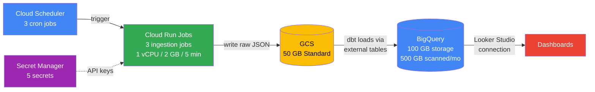
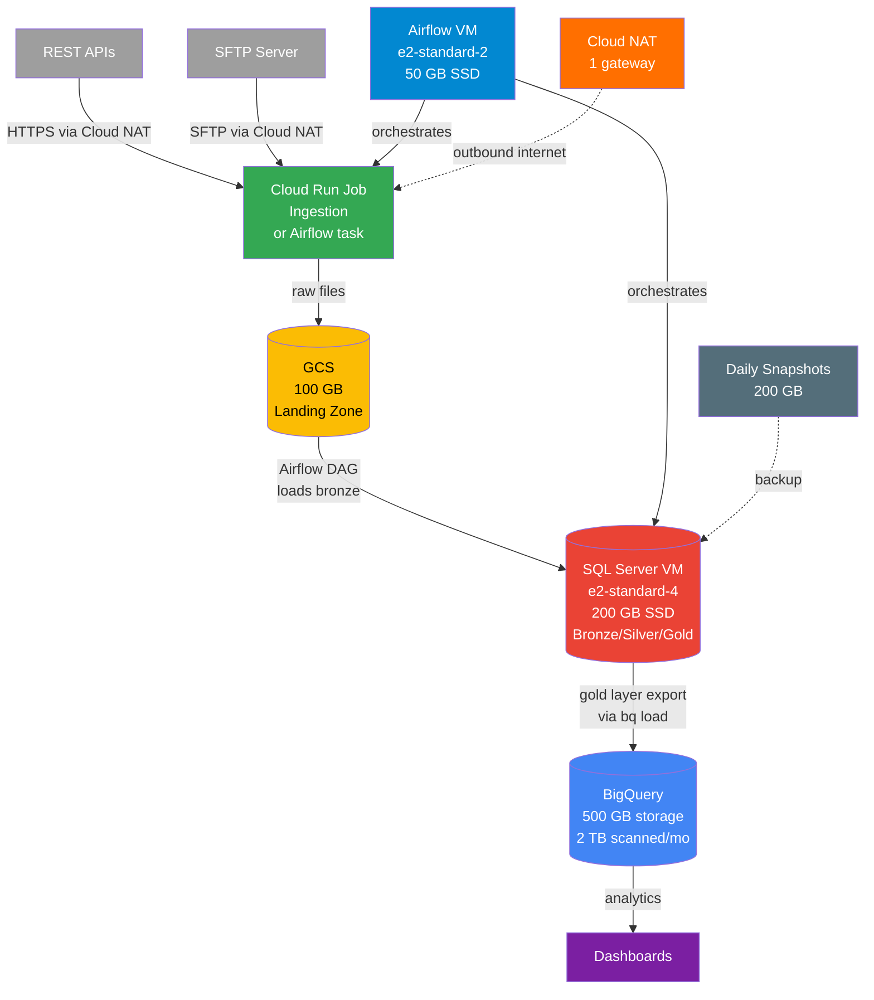
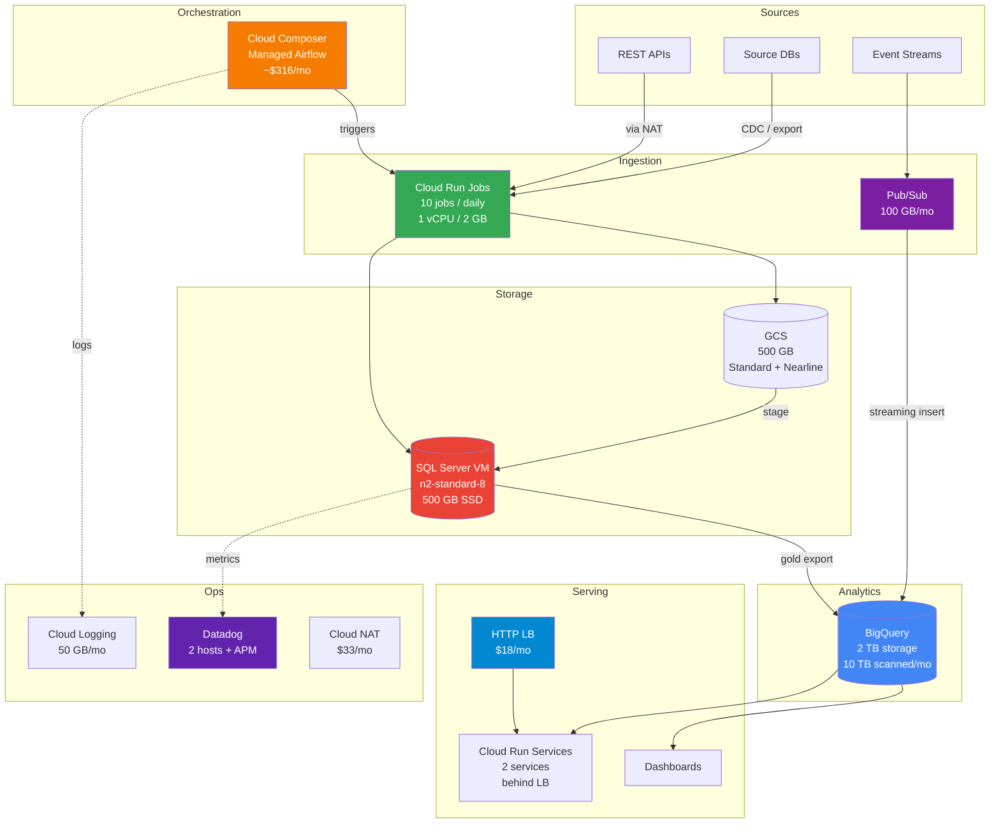

# GCP Total Cost of Ownership — Data Engineering Pipelines

> [!quote]
> "Cost awareness is a lost art. We need to regain that art."
> — **Werner Vogels**

This reference provides concrete, line-item TCO calculations for four archetypal data engineering pipeline architectures on GCP. All prices use **GCP list pricing as of early 2026** in the `us-central1` region unless noted. Committed use discounts (CUDs) and sustained use discounts (SUDs) are called out where applicable.

> [!warning] Prices Change
>
> GCP pricing evolves. Always cross-check line items against the [GCP Pricing Calculator](https://cloud.google.com/products/calculator) before committing to a budget. The figures here are accurate reference points, not contractual quotes.

---

## How to Calculate TCO for a Data Pipeline

### Cost Categories

1. **Compute** — Compute Engine VMs, Cloud Run (Jobs + Services), Dataflow workers, Cloud Composer worker nodes
2. **Storage** — Cloud Storage (GCS), BigQuery storage, VM persistent disks, disk snapshots
3. **Networking** — Egress to internet, cross-region traffic, Cloud NAT, load balancers, static IPs
4. **Data Processing** — BigQuery query costs (on-demand), Pub/Sub message throughput, Dataflow shuffle, Datastream replication
5. **Operations** — Cloud Logging ingestion beyond free tier, Cloud Monitoring, Secret Manager, Cloud Scheduler
6. **Licensing** — SQL Server Windows license (if not using BYOL or Linux), third-party tools (Datadog, dbt Cloud, Monte Carlo)
7. **Human Cost** — Engineering hours for maintenance, incident response, and on-call. Not calculated here, but typically $5,000–$25,000/month equivalent for a 1–3 engineer team. Always factor into total platform cost.

### The TCO Formula

```
Monthly TCO = Compute + Storage + Networking + Processing + Operations + Licensing
```

For budgeting purposes, add a **15–20% buffer** for unexpected egress, log spikes, and one-off query costs.

### Pricing Building Blocks (us-central1, early 2026)

| Resource | Unit | Price |
|---|---|---|
| Compute Engine e2-standard-2 | per hour | $0.0670 |
| Compute Engine e2-standard-4 | per hour | $0.1341 |
| Compute Engine e2-standard-8 | per hour | $0.2681 |
| Compute Engine n2-standard-8 | per hour | $0.3880 |
| Persistent Disk SSD | per GB/month | $0.170 |
| Persistent Disk Standard (HDD) | per GB/month | $0.040 |
| Disk Snapshot | per GB/month | $0.026 |
| GCS Standard storage | per GB/month | $0.020 |
| GCS Nearline storage | per GB/month | $0.010 |
| GCS Coldline storage | per GB/month | $0.004 |
| BigQuery on-demand queries | per TB scanned | $6.25 |
| BigQuery active storage | per GB/month | $0.020 |
| BigQuery long-term storage | per GB/month | $0.010 |
| Cloud Run CPU (1 vCPU) | per vCPU-second | $0.000024 |
| Cloud Run Memory | per GB-second | $0.0000025 |
| Cloud Logging ingestion | per GB (after 50 GB free) | $0.50 |
| Cloud NAT | per gateway/hour | $0.044 |
| Cloud NAT data processing | per GB | $0.045 |
| Static IP (in use) | per IP/hour | $0.000 (free while attached) |
| Static IP (unused/reserved) | per IP/hour | $0.010 |
| Secret Manager secrets | per secret/month | $0.06 |
| Secret Manager access | per 10k ops | $0.03 |
| Cloud Scheduler | per job/month (after 3 free) | $0.10 |
| Pub/Sub | per GB | $0.040 |
| Cloud Composer small | per environment/month | ~$300 |

---

## Reference Architecture 1: Small Batch Pipeline (~$100–150/month)

### Scenario

A small team (1–2 engineers) running a **daily batch pipeline** that ingests from 2–3 REST APIs, stores raw data in GCS, transforms with dbt in BigQuery, and serves dashboards directly from BigQuery. No VMs. Fully serverless.

**Design principles:** Minimize fixed costs. Pay only when jobs run. Use BigQuery on-demand for low query volume.

### Infrastructure

- **Cloud Scheduler**: 3 cron jobs triggering daily runs
- **Cloud Run Jobs**: 3 ingestion jobs, each runs 5 minutes, 1 vCPU, 2 GB RAM
- **GCS**: 50 GB Standard storage (raw + staging files)
- **BigQuery**: 500 GB scanned/month (dbt transformations + dashboard queries), 100 GB active storage
- **Cloud Logging**: ~10 GB/month (within free tier)
- **Secret Manager**: 5 secrets (API keys, credentials)

### Detailed Cost Breakdown

**Cloud Scheduler**
- 3 jobs/month. First 3 jobs are free.
- Cost: **$0.00/month**

> [!info] Cloud Scheduler Free Tier
>
> The first 3 jobs per month per billing account are always free. A small pipeline rarely exceeds this.

**Cloud Run Jobs — 3 jobs × 5 min × 30 days**

Each job run:
- Duration: 5 min = 300 seconds
- vCPU: 1
- Memory: 2 GB

vCPU cost per run: 300 s × 1 vCPU × $0.000024 = $0.0072
Memory cost per run: 300 s × 2 GB × $0.0000025 = $0.0015
Cost per run: $0.0087

Monthly runs: 3 jobs × 30 days = 90 runs
Monthly vCPU cost: 90 × 300 × $0.000024 = **$0.648**
Monthly memory cost: 90 × 300 × 2 × $0.0000025 = **$0.135**
Total Cloud Run: **$0.783/month** → round to **~$0.80/month**

> [!info] Cloud Run Free Tier
>
> Cloud Run includes 180,000 vCPU-seconds and 360,000 GB-seconds free per month per billing account. This architecture uses ~27,000 vCPU-seconds and ~54,000 GB-seconds, which is **entirely within the free tier**. Cost = $0.00 in practice for a new account. Shown at full price here for accuracy when free tier is exhausted.

**GCS Standard Storage — 50 GB**
- 50 GB × $0.020 = **$1.00/month**

**BigQuery Queries — 500 GB scanned**
- 500 GB = 0.5 TB
- 0.5 × $6.25 = **$3.13/month**

> [!tip] BigQuery Free Tier
>
> The first 1 TB of queries per month per billing account is free. This architecture's 500 GB is within the free tier → **$0.00 in practice**. Shown at full on-demand price here for budgeting once free tier is consumed or shared across projects.

**BigQuery Storage — 100 GB active**
- 100 GB × $0.020 = **$2.00/month**

**Cloud Logging — 10 GB**
- Free tier: 50 GB/month. 10 GB < 50 GB.
- Cost: **$0.00/month**

**Secret Manager — 5 secrets**
- 5 × $0.06 = $0.30/month
- Access operations: ~1,000 accesses/month (negligible, < $0.01)
- Cost: **$0.30/month**

### Summary Table

| Component | Specification | Monthly Cost |
|---|---|---|
| Cloud Scheduler | 3 jobs (free tier) | $0.00 |
| Cloud Run Jobs | 3 jobs × 5 min × 30 days, 1 vCPU / 2 GB | $0.80 |
| GCS Standard | 50 GB | $1.00 |
| BigQuery queries | 500 GB scanned (on-demand) | $3.13 |
| BigQuery storage | 100 GB active | $2.00 |
| Cloud Logging | 10 GB (within 50 GB free tier) | $0.00 |
| Secret Manager | 5 secrets | $0.30 |
| **Total** | | **~$7.23/month** |

> [!success] Real-World Cost
> With free tiers applied (Cloud Run, BigQuery 1 TB free, Logging 50 GB free), the actual monthly cost for a new GCP billing account is often **$2–$5/month** — essentially just BigQuery storage and Secret Manager. The $7.23 is the steady-state cost once all free tiers are fully consumed.

### Architecture Diagram



### Cost Optimization Tips — Small Tier

1. **Use BigQuery free tier deliberately.** If you have multiple GCP projects, the 1 TB/month free tier is per billing account, not per project. Consolidate query-heavy workloads to stay under 1 TB total.
2. **Set BigQuery cost controls.** Create a `maximum bytes billed` per query to avoid accidental full-table scans: `SET @@query_options.maximum_bytes_billed = 10000000000` (10 GB limit).
3. **Partition your BigQuery tables** by ingestion date or a date column. A dashboard querying "last 7 days" on a partitioned table scans 7 days of data instead of all history — the single biggest lever for reducing query costs.
4. **Use GCS lifecycle rules.** Set raw/staging files to transition to Nearline after 30 days and Coldline after 90 days. Nearline saves 50%, Coldline saves 80% vs Standard.
5. **Cloud Run minimum instances = 0.** For batch jobs that run on a schedule, you never need minimum instances. Keep it at zero to pay nothing between runs.
6. **Combine Secret Manager accesses.** Batch your secret reads at startup rather than fetching on every API call. At 10K ops = $0.03, it's negligible, but good practice.

---

## Reference Architecture 2: Medium Pipeline with SQL Server (~$200–400/month)

### Scenario

A mid-size pipeline for a team of 2–4 engineers:
- Ingests from REST APIs and SFTP files
- Stores and transforms in **SQL Server on Compute Engine** (medallion architecture: bronze/silver/gold layers)
- Orchestrates with **self-hosted Airflow on a second Compute Engine VM**
- Exports gold layer to **BigQuery** for analytics and dashboards
- Monitors with GCP Cloud Monitoring + Cloud Logging

**Design principles:** Accept some fixed VM costs for full SQL Server control. Keep orchestration self-hosted to avoid Composer's $300+/month floor.

### Infrastructure

- **SQL Server VM**: e2-standard-4 (4 vCPU, 16 GB RAM), 200 GB SSD persistent disk, SQL Server 2022 on Linux (BYOL-style, no Windows license)
- **Airflow VM**: e2-standard-2 (2 vCPU, 8 GB RAM), 50 GB SSD persistent disk
- **GCS**: 100 GB Standard landing zone
- **BigQuery**: 2 TB scanned/month + 500 GB active storage
- **Cloud NAT**: 1 NAT gateway for VMs to reach external APIs
- **Disk Snapshots**: 200 GB snapshot storage (2 daily snapshots, 7-day retention = ~14 snapshot increments, but GCP deduplicates; estimate 200 GB total snapshot footprint)
- **Cloud Logging**: 30 GB/month ingested
- **Static IPs**: 2 reserved and attached (e.g., for SSH access management)

### Detailed Cost Breakdown

**SQL Server VM — e2-standard-4 (730 hours/month)**
- Hourly rate: $0.1341/hr
- 730 hours × $0.1341 = **$97.89/month**
- With sustained use discount (SUD, ~20% for full month): $97.89 × 0.80 = **$78.31/month**

> [!info] Sustained Use Discounts
>
> GCP automatically applies SUDs to N1, N2, and E2 instances that run for >25% of the month. A VM running 100% of the month gets ~20% off. No commitment required. CUDs (1-year or 3-year commitments) can save up to 37–57%.

**SQL Server VM Disk — 200 GB SSD**
- 200 GB × $0.170 = **$34.00/month**

**Airflow VM — e2-standard-2 (730 hours/month)**
- Hourly rate: $0.0670/hr
- 730 hours × $0.0670 = **$48.91/month**
- With SUD (~20%): $48.91 × 0.80 = **$39.13/month**

**Airflow VM Disk — 50 GB SSD**
- 50 GB × $0.170 = **$8.50/month**

**GCS Standard Storage — 100 GB**
- 100 GB × $0.020 = **$2.00/month**

**BigQuery Queries — 2 TB scanned**
- 2 TB × $6.25 = **$12.50/month**

**BigQuery Storage — 500 GB active**
- 500 GB × $0.020 = **$10.00/month**

**Cloud NAT Gateway**
- Gateway uptime: 730 hours × $0.044 = **$32.12/month**
- Data processing: estimated 10 GB/month × $0.045 = **$0.45/month**
- Total NAT: **$32.57/month**

> [!warning] Cloud NAT is Expensive
>
> Cloud NAT costs ~$32/month just to exist, before processing charges. Evaluate whether your VMs actually need outbound internet access. If only one VM needs external API access, consider a Cloud Run Job for ingestion instead (no NAT needed — Cloud Run has built-in internet access via Google's infrastructure).

**Disk Snapshots — 200 GB total footprint**
- 200 GB × $0.026 = **$5.20/month**

**Cloud Logging — 30 GB ingested**
- Free tier: 50 GB/month
- 30 GB < 50 GB → **$0.00/month**

**Static IPs — 2 in use, attached**
- While attached to running VMs: $0.00/hour per IP
- Cost: **$0.00/month** (only charged when reserved but unattached)

**Secret Manager — 10 secrets**
- 10 × $0.06 = **$0.60/month**

**Cloud Scheduler — 5 jobs**
- First 3 free; 2 additional × $0.10 = **$0.20/month**

### Summary Table

| Component | Specification | Unit Price | Qty | Monthly Cost |
|---|---|---|---|---|
| SQL Server VM (e2-standard-4) | 4 vCPU, 16 GB, 730 hr, w/ SUD | $0.107/hr | 730 hr | $78.31 |
| SQL Server VM Disk | 200 GB SSD | $0.170/GB | 200 GB | $34.00 |
| Airflow VM (e2-standard-2) | 2 vCPU, 8 GB, 730 hr, w/ SUD | $0.0536/hr | 730 hr | $39.13 |
| Airflow VM Disk | 50 GB SSD | $0.170/GB | 50 GB | $8.50 |
| GCS Standard | 100 GB landing zone | $0.020/GB | 100 GB | $2.00 |
| BigQuery queries | 2 TB scanned (on-demand) | $6.25/TB | 2 TB | $12.50 |
| BigQuery storage | 500 GB active | $0.020/GB | 500 GB | $10.00 |
| Cloud NAT gateway | 730 hr uptime | $0.044/hr | 730 hr | $32.12 |
| Cloud NAT data processing | ~10 GB/month | $0.045/GB | 10 GB | $0.45 |
| Disk snapshots | 200 GB total | $0.026/GB | 200 GB | $5.20 |
| Cloud Logging | 30 GB (free tier covers all) | $0.50/GB | 0 GB | $0.00 |
| Static IPs | 2 (attached, in use) | $0/hr attached | — | $0.00 |
| Secret Manager | 10 secrets | $0.06/secret | 10 | $0.60 |
| Cloud Scheduler | 5 jobs (3 free + 2 paid) | $0.10/job | 2 | $0.20 |
| **Total** | | | | **$222.01/month** |

**Practical range: $200–$250/month** depending on BigQuery query patterns and NAT data volume.

### Architecture Diagram



### Paused vs Running Cost Comparison

A common pattern: stop VMs on nights and weekends (e.g., run only 10 hours/day, 5 days/week = ~217 hours/month vs 730 hours/month).

**Running 24/7 (baseline): ~$222/month**

#### VMs stopped nights + weekends — ~30% runtime cost reduction
| Component | Cost |
|---|---|
| SQL Server VM (217 hr × $0.1341 × 0.80 SUD) | ~$23.28 |
| SQL Server VM Disk (always charged) | $34.00 |
| Airflow VM (217 hr × $0.0670 × 0.80 SUD) | ~$11.64 |
| Airflow VM Disk (always charged) | $8.50 |
| GCS + BQ + Logging + Secrets + Scheduler | ~$25.30 |
| Cloud NAT (disable when VMs are stopped) | $0.00 |
| Snapshots | $5.20 |
| **Total paused (partial hours)** | **~$108/month** |

> [!tip] Stop VMs, Disks Keep Billing
>
> Stopping a VM eliminates compute charges but **persistent disk charges continue at full rate**. A 200 GB SSD disk costs $34/month whether the VM is running or not. Size disks carefully — you can always resize up, but downsizing requires data migration.

#### Everything destroyed — only Terraform state + GCS backup remains
- GCS for Terraform state + SQL backup files: ~100 GB → $2.00
- BigQuery storage (if kept): 500 GB → $10.00
- Secret Manager: $0.60
- **Total destroyed: ~$12.60/month**

This is the "dev environment off" state — keep the data, destroy the compute.

### Cost Optimization Tips — Medium Tier

1. **Schedule VM start/stop with Cloud Scheduler + Cloud Functions.** If your pipeline only needs to run during business hours, stopping VMs from 7 PM to 7 AM saves ~58% on compute. The disk still costs money, but compute is the larger line item here.
2. **Evaluate self-hosted Airflow sizing.** An e2-standard-2 is generous for Airflow with <10 active DAGs. An e2-small (2 vCPU, 2 GB) at $0.0168/hr ($12.26/month) may suffice for simple orchestration.
3. **Audit Cloud NAT necessity.** If you move ingestion to Cloud Run Jobs, those jobs have native internet egress without NAT. Eliminating NAT saves $32/month.
4. **BigQuery table partitioning and clustering.** Partition gold-layer export tables by date. Dashboards querying recent data scan a fraction of total storage. At 2 TB scanned/month × $6.25, reducing scans by 50% saves $6.25/month.
5. **Convert active BigQuery storage to long-term.** Tables not modified for 90+ consecutive days automatically drop from $0.020/GB to $0.010/GB. Archiving old silver/gold data doubles your storage efficiency.
6. **Use HDD persistent disks for Airflow.** Airflow logs and metadata don't benefit from SSD IOPS. Switch the Airflow VM to a 50 GB HDD disk ($0.040/GB = $2.00/month vs $8.50 SSD) — save $6.50/month.
7. **Set snapshot retention policies.** Without a retention policy, snapshots accumulate indefinitely. Use `gcloud compute resource-policies create snapshot-schedule` with `--max-retention-days=7` to automatically prune old snapshots.

---

## Reference Architecture 3: Production Platform (~$800–1,500/month)

### Scenario

A production-grade platform for a team of 3–6 engineers with multiple data sources, SLAs, and stakeholder-facing dashboards:
- Multiple data sources: REST APIs, databases, event streams
- **SQL Server on Compute Engine** (primary operational database)
- **Cloud Composer** (managed Airflow) for reliable, observable orchestration
- **BigQuery** as the analytics warehouse
- **Pub/Sub** for event-driven/streaming pipeline segments
- **Cloud Run Services** (API endpoints serving data to applications)
- **Cloud Run Jobs** (10 batch ingestion jobs)
- **Datadog** for full-stack monitoring and APM
- **Full Terraform** infrastructure with state in GCS

**Design principles:** Prioritize reliability and observability. Accept higher fixed costs for managed services. Use Cloud Composer over self-hosted Airflow to eliminate operational overhead.

### Infrastructure

- **SQL Server VM**: n2-standard-8 (8 vCPU, 32 GB), 500 GB SSD persistent disk
- **Cloud Composer**: smallest environment (Composer 2, Airflow 2.x)
- **BigQuery**: 10 TB scanned/month + 2 TB active storage
- **Pub/Sub**: 100 GB messages/month
- **Cloud Run Services**: 2 services, moderate traffic (~1M requests/month each)
- **Cloud Run Jobs**: 10 batch jobs, 5 min each, 1 vCPU / 2 GB, run daily
- **GCS**: 500 GB across Standard and Nearline
- **Datadog**: 2 infrastructure hosts + APM (1 APM host)
- **Cloud NAT**: 1 gateway
- **Load Balancer**: 1 HTTP(S) load balancer (for Cloud Run services behind custom domain)
- **Terraform state**: GCS bucket (~1 GB, negligible)

### Detailed Cost Breakdown

**SQL Server VM — n2-standard-8 (730 hours)**
- n2-standard-8 hourly: $0.3880/hr
- 730 hr × $0.3880 = $283.24/month
- With SUD (~20%): $283.24 × 0.80 = **$226.59/month**

**SQL Server VM Disk — 500 GB SSD**
- 500 GB × $0.170 = **$85.00/month**

**Cloud Composer — Smallest Environment (Composer 2)**
- Cloud Composer 2 small environment: ~$0.40/hr for the scheduler + web server + database infrastructure
- 730 hr × $0.40 = **$292.00/month**
- Worker nodes: 1 worker node on GKE (e2-medium equivalent, ~0.5 vCPU, 2 GB); ~$0.034/hr × 730 = ~$24.82
- Composer 2 charges for GKE node pool. Smallest config ≈ 1 node, e2-medium: $0.0335/hr × 730 = **$24.46/month**
- Total Composer: **~$316/month**

> [!warning] Cloud Composer Minimum Cost
>
> Cloud Composer 2's smallest configuration (1 scheduler, 1 web server, 1 worker, shared database) runs approximately $300–$350/month with no DAGs running. This is the floor. Every additional worker node adds ~$25–$50/month. If you have fewer than ~15 DAGs and a small team, self-hosted Airflow on an e2-standard-2 saves $250+/month.

**BigQuery Queries — 10 TB scanned**
- 10 TB × $6.25 = **$62.50/month**

**BigQuery Storage — 2 TB active**
- 2,000 GB × $0.020 = **$40.00/month**

**Pub/Sub — 100 GB messages/month**
- 100 GB × $0.040 = **$4.00/month**

**Cloud Run Services — 2 services, 1M requests/month each**
- Requests: 2M total × ($0.40 per million) = **$0.80/month** (first 2M free, so ~$0.00)
- Compute: ~50 ms avg duration, 1 vCPU, 512 MB per request
  - vCPU-seconds: 2M requests × 0.05 s = 100,000 vCPU-seconds → 100,000 × $0.000024 = **$2.40/month**
  - GB-seconds: 2M × 0.05 × 0.5 GB = 50,000 GB-seconds → 50,000 × $0.0000025 = **$0.13/month**
- Total Cloud Run Services: **~$2.53/month** (plus min-instances if set)

> [!tip] Cloud Run Min Instances
>
> If you configure `min-instances: 1` on a Cloud Run service for low-latency cold start, that instance runs continuously. At 1 vCPU / 512 MB: 730 hr × 3600 s × $0.000024 = $63.07/month per service. For 2 services with min-instances=1: **~$126/month additional**. Only set min-instances if your SLA requires <100 ms cold start.

**Cloud Run Jobs — 10 jobs × 5 min × 30 days**
- vCPU-seconds: 10 × 300 s × 1 vCPU × 30 = 90,000 vCPU-seconds → 90,000 × $0.000024 = **$2.16/month**
- GB-seconds: 10 × 300 × 2 × 30 = 180,000 GB-seconds → 180,000 × $0.0000025 = **$0.45/month**
- Total Cloud Run Jobs: **$2.61/month**

**GCS — 500 GB (mixed tiers)**
- 200 GB Standard (hot data): 200 × $0.020 = $4.00
- 200 GB Nearline (warm, 30+ days old): 200 × $0.010 = $2.00
- 100 GB Coldline (archive, 90+ days old): 100 × $0.004 = $0.40
- Total GCS: **$6.40/month**

**Cloud NAT**
- Gateway: 730 hr × $0.044 = **$32.12/month**
- Data: 20 GB × $0.045 = **$0.90/month**
- Total NAT: **$33.02/month**

**HTTP(S) Load Balancer**
- Forwarding rule: 1 × $0.025/hr × 730 = **$18.25/month**
- Data processed: 10 GB × $0.008/GB = **$0.08/month**
- Total LB: **$18.33/month**

**Datadog — 2 infrastructure hosts + 1 APM host**
- Infrastructure Pro: $23/host/month (annual) × 2 = $46.00
- APM: $40/host/month (annual) × 1 = $40.00
- Total Datadog: **$86.00/month** (annual contract; month-to-month is ~$31/host → ~$93/month)

> [!warning] Datadog Pricing Escalates Fast
>
> Datadog charges per host, per log GB, per APM span, per custom metric, and per synthetics test. The $86/month base assumes 2 infrastructure hosts and 1 APM host on annual Pro plan. Log ingestion ($0.10/GB after free tier), custom metrics ($0.008/metric), and real-user monitoring can double or triple this. Always review your Datadog bill monthly.

**Cloud Logging — 50 GB ingested**
- Free tier: 50 GB/month → exactly at the boundary
- Cost: **$0.00/month** (borderline; 51 GB would be $0.50 overage)

**Secret Manager — 20 secrets**
- 20 × $0.06 = **$1.20/month**

**Disk Snapshots — 500 GB footprint**
- 500 GB × $0.026 = **$13.00/month**

**Cloud Scheduler — 15 jobs**
- 3 free + 12 × $0.10 = **$1.20/month**

### Summary Table

| Component | Specification | Monthly Cost |
|---|---|---|
| SQL Server VM (n2-standard-8) | 8 vCPU, 32 GB, 730 hr, w/ SUD | $226.59 |
| SQL Server VM Disk | 500 GB SSD | $85.00 |
| Cloud Composer | Smallest env, 1 worker node | $316.00 |
| BigQuery queries | 10 TB scanned (on-demand) | $62.50 |
| BigQuery storage | 2 TB active | $40.00 |
| Pub/Sub | 100 GB messages | $4.00 |
| Cloud Run Services | 2 services, 1M req/month each | $2.53 |
| Cloud Run Jobs | 10 jobs × 5 min × 30 days | $2.61 |
| GCS | 500 GB (mixed tiers) | $6.40 |
| Cloud NAT | 1 gateway + 20 GB data | $33.02 |
| HTTP(S) Load Balancer | 1 rule + 10 GB processed | $18.33 |
| Datadog | 2 infra hosts + 1 APM host | $86.00 |
| Cloud Logging | 50 GB (at free tier ceiling) | $0.00 |
| Secret Manager | 20 secrets | $1.20 |
| Disk snapshots | 500 GB footprint | $13.00 |
| Cloud Scheduler | 15 jobs (3 free + 12 paid) | $1.20 |
| **Total** | | **~$898/month** |

**Practical range: $850–$1,100/month** depending on Cloud Run min-instances, Datadog log volume, and BigQuery query patterns.

### Architecture Diagram



### Cost Optimization: What to Cut First

Priority-ordered list (highest impact first):

1. **Cloud Composer → self-hosted Airflow on e2-standard-2** — saves ~$275/month. Highest single impact. Only viable if your team can accept operational ownership of Airflow.
2. **BigQuery on-demand → flat-rate slots** — at 10 TB/month ($62.50), on-demand is still cheaper than the cheapest slot commitment (~$1,700/month for 100 slots). Stay on-demand until scanning consistently exceeds ~270 TB/month.
3. **n2-standard-8 → 1-year CUD** — saves 37% ($226.59 → ~$143). If SQL Server VM will run 24/7 for 12+ months, commit. Saves ~$83/month.
4. **Datadog → GCP-native monitoring** — Cloud Monitoring + Cloud Logging covers most needs. Eliminating Datadog saves $86/month. Only keep Datadog if APM, synthetic monitoring, or multi-cloud visibility is required.
5. **Cloud NAT removal** — if ingestion moves fully to Cloud Run Jobs and the SQL Server VM only receives connections (not initiates them), NAT may be eliminable. Saves $33/month.
6. **Cloud Run min-instances audit** — if min-instances > 0 on either service, evaluate whether cold start latency matters. Removing min-instances can save $60–$130/month.
7. **BigQuery long-term storage conversion** — ensure historical tables (>90 days unmodified) have been moved to long-term pricing ($0.010 vs $0.020/GB). At 2 TB with 50% being historical, saves ~$10/month.
8. **Snapshot retention policy** — set 7-day retention on daily snapshots. Without this, snapshot storage grows indefinitely. At $0.026/GB, uncontrolled snapshots can silently add $50–$200/month over a year.

---

## Reference Architecture 4: Enterprise Scale (~$3,000–10,000/month)

### Scenario

Multi-team, multi-pipeline platform supporting dozens of data products:
- **BigQuery Enterprise Edition** with reserved slots (capacity commitments)
- Multiple SQL Server VMs with Always On Availability Group (AG)
- Large **Cloud Composer** environment (multiple worker nodes)
- **Dataflow** streaming pipelines
- **Dataplex** for data governance and cataloging
- **Multiple environments**: dev, staging, prod (separate GCP projects)
- Full Datadog with logs, APM, and synthetics

### Infrastructure Overview

| Component | Dev | Staging | Prod |
|---|---|---|---|
| SQL Server (primary) | e2-standard-4 | e2-standard-8 | n2-standard-16 |
| SQL Server (replica/AG) | — | — | n2-standard-16 |
| Cloud Composer | — | Small | Large |
| BigQuery slots | On-demand | On-demand | 200 reserved slots |
| Dataflow | — | Occasional | Streaming + batch |
| Dataplex | — | — | Yes |

### Detailed Cost Breakdown

**SQL Server VMs (3 VMs total)**

Dev: e2-standard-4, 730 hr × $0.1341 × 0.80 SUD = **$78.31/month**
Staging: e2-standard-8, 730 hr × $0.2681 × 0.80 SUD = **$156.73/month**
Prod primary: n2-standard-16, $0.7760/hr × 730 × 0.80 SUD = **$453.17/month**
Prod replica: n2-standard-16, same = **$453.17/month**

Total VM compute: **$1,141.38/month**

**VM Disks**
- Dev: 200 GB SSD = $34.00
- Staging: 300 GB SSD = $51.00
- Prod primary: 1 TB SSD = $170.00
- Prod replica: 1 TB SSD = $170.00

Total disks: **$425.00/month**

**Cloud Composer — 2 environments**

Staging (small, same as Arch 3): **$316/month**
Prod (large — 3 worker nodes, higher-spec scheduler):
- Composer infrastructure: ~$0.70/hr × 730 = $511.00
- Worker nodes: 3 × e2-standard-4 × 730 hr × $0.1341 = 3 × $97.89 = $293.67; with SUD: $234.94
- Total prod Composer: **~$746/month**

Total Composer: **$1,062/month**

> [!warning] Cloud Composer Cost
>
> Cloud Composer Large Environment.
> A large Cloud Composer 2 environment with 3+ workers easily reaches $700–$1,000/month. At this scale, evaluate whether GCP Workflows + Cloud Run is a viable DAG-light alternative for simple dependency chains.

**BigQuery — Enterprise Edition, 200 Reserved Slots (Prod)**

Reserved slots pricing:
- Standard Edition: $0.04/slot/hr
- 200 slots × $0.04 × 730 hr = **$5,840/month** (standard on-demand reservation)

Alternatively, **committed use slots** at 1-year commitment:
- 200 slots × $0.04 × 730 × ~0.70 (est. discount) = **~$4,088/month**

> [!info] BigQuery Pricing Models
>
> BigQuery Editions vs On-Demand.
> On-demand pricing ($6.25/TB) is cheaper than slot reservations until approximately 270 TB/month of queries (at the Standard Edition rate). A team scanning 50–100 TB/month should stay on on-demand. Reservations make sense for >200 TB/month of predictable workloads, or when you need query performance guarantees (slots = guaranteed compute).

For this architecture, using **on-demand for dev/staging** and **100 reserved slots for prod** as a realistic scenario:
- Prod slots (100): 100 × $0.04 × 730 = **$2,920/month**
- Dev on-demand: 5 TB × $6.25 = $31.25
- Staging on-demand: 10 TB × $6.25 = $62.50
- Prod on-demand overflow: 5 TB × $6.25 = $31.25

Total BigQuery queries: **$3,045/month** (slots + overflow)

**BigQuery Storage — all environments**
- Prod: 10 TB active + 20 TB long-term = (10,000 × $0.020) + (20,000 × $0.010) = $200 + $200 = $400
- Staging: 2 TB active = $40
- Dev: 500 GB = $10
- Total storage: **$450/month**

**Dataflow — Streaming + Batch**

Streaming pipeline (24/7, 2 n1-standard-4 workers):
- n1-standard-4: $0.1900/hr; 2 workers × 730 hr = $277.40; with no SUD on Dataflow (SUD doesn't apply) → **$277.40/month**
- Dataflow shuffle: 50 GB/month × $0.011 = $0.55

Batch pipeline (4 hours/day, 5 workers, n1-standard-4):
- 4 hr/day × 30 days × 5 workers × $0.1900 = **$114.00/month**

Total Dataflow: **$391.95/month**

**Dataplex**
- Data catalog (metadata): $0.10/GB/month for metadata; ~100 GB catalog = $10.00
- Data quality scans: ~50 scans/month × $1.00/scan = $50.00 (estimate; varies by table size)
- Total Dataplex: **~$60/month**

**Pub/Sub — 500 GB/month**
- 500 GB × $0.040 = **$20.00/month**

**GCS — 2 TB across all environments**
- 1 TB Standard: $20.00
- 500 GB Nearline: $5.00
- 500 GB Coldline: $2.00
- Total GCS: **$27.00/month**

**Datadog — Full Stack (5 hosts + APM + Logs)**
- 5 infrastructure hosts × $23/host (annual) = $115.00
- APM: 2 hosts × $40 = $80.00
- Log ingestion: 200 GB × $0.10/GB (after free tier) = $20.00
- Synthetics: ~$50/month (estimated)
- Total Datadog: **$265/month**

**Cloud NAT — 2 gateways (prod + staging)**
- 2 × $32.12 = **$64.24/month**

**Load Balancers — 3 (dev, staging, prod)**
- 3 × $18.33 = **$54.99/month**

**Cloud Logging — 200 GB across all environments**
- 200 GB - 50 GB free = 150 GB billable
- 150 × $0.50 = **$75.00/month**

**Snapshots — 2 TB total**
- 2,000 GB × $0.026 = **$52.00/month**

**Miscellaneous (Secret Manager, Scheduler, Cloud Armor, etc.)**
- Estimated: **$50/month**

### Enterprise Summary Table

| Component | Monthly Cost |
|---|---|
| SQL Server VMs (4 VMs, all envs) | $1,141.38 |
| VM Persistent Disks | $425.00 |
| Cloud Composer (staging + prod) | $1,062.00 |
| BigQuery queries (slots + on-demand) | $3,045.00 |
| BigQuery storage (all envs) | $450.00 |
| Dataflow (streaming + batch) | $391.95 |
| Dataplex | $60.00 |
| Pub/Sub | $20.00 |
| GCS | $27.00 |
| Datadog (5 hosts + APM + logs) | $265.00 |
| Cloud NAT (2 gateways) | $64.24 |
| Load Balancers (3) | $54.99 |
| Cloud Logging (150 GB billable) | $75.00 |
| Disk Snapshots | $52.00 |
| Miscellaneous | $50.00 |
| **Total** | **~$7,183/month** |

**Practical range: $5,000–$10,000/month** depending on BigQuery slot commitment level, Dataflow worker count, and Datadog feature usage.

### Cost Optimization: Enterprise Scale

1. **BigQuery slot rightsizing.** Run 90 days of on-demand cost tracking before committing to slots. Use INFORMATION_SCHEMA.JOBS to measure actual TB scanned per team. Commit only to slots that are utilized >70% of the time.
2. **Dev environment auto-shutdown.** Implement a scheduled shutdown of all dev VMs outside business hours. At $78–$156/month, this saves $40–$100/month on dev alone. Use org policy to enforce this.
3. **Dataflow autoscaling.** Set `--maxNumWorkers` conservatively. Dataflow's autoscaler can over-provision. Monitor actual worker utilization and tune `--workerMachineType` down if CPU utilization is low.
4. **Dataplex data quality scan frequency.** Reduce scan frequency from daily to weekly for stable, slow-changing tables. Each scan has a per-execution cost.
5. **Cloud Logging sink to GCS.** Export verbose debug logs to GCS (at $0.020/GB storage) instead of keeping them in Cloud Logging ($0.50/GB ingestion). Keep only ERROR and CRITICAL in Cloud Logging for alerting.
6. **Consolidate Datadog hosts.** Run the Datadog agent on fewer, larger VMs rather than many small ones. Every host crossing the billing threshold costs $23+/month.

---

## Cost Comparison: GCP vs AWS vs Azure

For the **Medium Pipeline (Architecture 2)** as the comparison baseline:

### VM: 4 vCPU, 16 GB RAM

| Cloud | Instance | On-Demand/hr | Monthly (730 hr) | With Discount |
|---|---|---|---|---|
| GCP | e2-standard-4 | $0.1341 | $97.89 | $78.31 (SUD 20%) |
| AWS | m5.xlarge | $0.192 | $140.16 | $88.30 (1-yr RI, ~37% off) |
| Azure | D4s_v3 | $0.192 | $140.16 | $91.70 (1-yr RI, ~35% off) |

GCP's E2 family is notably cheaper on list price vs AWS m5/Azure Dv3 for general-purpose workloads.

### Object Storage: 100 GB

| Cloud | Service | Monthly |
|---|---|---|
| GCP | Cloud Storage Standard | $2.00 |
| AWS | S3 Standard | $2.30 |
| Azure | Blob Storage (LRS) | $1.84 |

Broadly equivalent. Azure Blob is slightly cheaper; AWS S3 adds API costs ($0.004/10K PUT, $0.0004/10K GET) that can matter at scale.

### Serverless Analytics: 500 GB queried

| Cloud | Service | Monthly |
|---|---|---|
| GCP | BigQuery on-demand | $3.13 (500 GB × $6.25/TB) |
| AWS | Athena | $2.50 (500 GB × $5.00/TB) |
| Azure | Synapse Serverless | $2.50 (500 GB × $5.00/TB) |

AWS Athena and Azure Synapse have a lower per-TB price. BigQuery's advantage is the managed columnar storage and integrated ML/BI features.

### Managed Workflow Orchestration

| Cloud | Service | Monthly |
|---|---|---|
| GCP | Cloud Composer (small) | ~$316 |
| AWS | MWAA (small) | ~$275 |
| Azure | Managed Airflow (via ADF) | ~$250–$350 |

All managed Airflow services carry a ~$250–$350/month minimum. Self-hosting on a VM ($39–$78/month) is the only way to break below this floor on any cloud.

### Full Medium Pipeline Comparison

| Component | GCP | AWS Equivalent | Azure Equivalent |
|---|---|---|---|
| VM (4 vCPU, 16 GB, SUD/RI) | e2-standard-4: $78.31 | m5.xlarge RI: $88.30 | D4s_v3 RI: $91.70 |
| VM disk (200 GB SSD) | PD-SSD: $34.00 | EBS gp3: $16.00 | Premium SSD: $26.95 |
| Self-hosted Airflow VM | e2-standard-2: $39.13 | t3.large RI: $29.20 | D2s_v3 RI: $31.90 |
| Object storage (100 GB) | GCS: $2.00 | S3: $2.30 | Blob: $1.84 |
| Serverless analytics (2 TB) | BigQuery: $12.50 | Athena: $10.00 | Synapse: $10.00 |
| Analytics storage (500 GB) | BigQuery: $10.00 | S3 + Glue catalog: $11.90 | Synapse storage: $11.25 |
| NAT gateway | Cloud NAT: $32.12 | NAT GW: $32.40 | NAT GW: $32.85 |
| Disk snapshots (200 GB) | $5.20 | EBS snapshots: $10.00 | Disk snapshots: $7.68 |
| **Total** | **~$213** | **~$200** | **~$214** |

**Key insight:** For this architecture profile, total costs are within ~5% across clouds at list price. The real differentiators are:
- **GCP**: Cheaper VMs on list price, SUD requires no commitment, BigQuery's native analytics advantage
- **AWS**: Cheaper EBS snapshots, Athena slightly cheaper, largest ecosystem
- **Azure**: Strong for SQL Server workloads (Azure Hybrid Benefit — BYOL SQL Server license cuts costs significantly if you own SQL Server licenses)

> [!tip] Azure Hybrid Benefit
>
> Azure Hybrid Benefit for SQL Server.
> If your organization already holds SQL Server Enterprise or Standard licenses with Software Assurance, Azure Hybrid Benefit allows you to bring them to Azure at no additional license charge. This is not available on GCP — on GCP, SQL Server on Linux is free-to-license ONLY if you use open-source SQL (SQL Server on Linux uses the SQL Server license baked into the GCP marketplace image price, or you BYOL). Factor license costs in when comparing SQL Server workloads cross-cloud.

---

## Cost Planning Template

Use this blank template to estimate your own architecture before building it.

```markdown
## My Pipeline TCO Estimate

**Region:** us-central1
**Date:** YYYY-MM-DD
**Scenario:** [Brief description]

| Component | Service | Spec | Unit Price | Qty / Month | Monthly Cost |
|---|---|---|---|---|---|
| Compute | Compute Engine | [machine type] | $X.XX/hr | [N] hr | $X.XX |
| Compute | Cloud Run Jobs | [vCPU] vCPU / [GB] GB / [min] min | $0.000024/vCPU-s | [N] runs | $X.XX |
| Compute | Cloud Run Services | [vCPU] vCPU / [GB] GB | per request | [N] req | $X.XX |
| Storage | Persistent Disk SSD | [N] GB | $0.170/GB | [N] GB | $X.XX |
| Storage | Persistent Disk HDD | [N] GB | $0.040/GB | [N] GB | $X.XX |
| Storage | GCS Standard | [N] GB | $0.020/GB | [N] GB | $X.XX |
| Storage | GCS Nearline | [N] GB | $0.010/GB | [N] GB | $X.XX |
| Storage | Disk Snapshots | [N] GB | $0.026/GB | [N] GB | $X.XX |
| Analytics | BigQuery queries | [N] TB scanned | $6.25/TB | [N] TB | $X.XX |
| Analytics | BigQuery storage | [N] GB | $0.020/GB | [N] GB | $X.XX |
| Networking | Cloud NAT gateway | [N] gateways | $0.044/hr | [N] hr | $X.XX |
| Networking | Cloud NAT data | [N] GB | $0.045/GB | [N] GB | $X.XX |
| Networking | Load Balancer | [N] rules | $0.025/hr | [N] hr | $X.XX |
| Messaging | Pub/Sub | [N] GB | $0.040/GB | [N] GB | $X.XX |
| Operations | Cloud Logging | [N] GB (after 50 GB free) | $0.50/GB | [N] GB | $X.XX |
| Operations | Secret Manager | [N] secrets | $0.06/secret | [N] | $X.XX |
| Operations | Cloud Scheduler | [N] jobs (after 3 free) | $0.10/job | [N] | $X.XX |
| Operations | Cloud Composer | [size] environment | ~$316–$1,000/mo | 1 | $X.XX |
| Licensing | Datadog | [N] hosts | $23/host/mo | [N] | $X.XX |
| **Subtotal** | | | | | **$X.XX** |
| **Buffer (15%)** | | | | | **$X.XX** |
| **Total TCO** | | | | | **$X.XX** |
```

#### Setup instructions — Terraform apply, gcloud, environment variables
1. Fill in each row for every service you plan to use.
2. Leave unused rows blank or delete them.
3. For Compute Engine, multiply hourly rate × expected hours/month × SUD factor (0.80 for 24/7 E2/N2 usage).
4. For BigQuery, estimate TB scanned by running `INFORMATION_SCHEMA.JOBS` on a sample query set.
5. Add the 15% buffer row — surprises always happen.

---

### GCP Hidden Costs Checklist

Before signing off on a budget, audit each item:

- [ ] **Cloud NAT gateway (~$32/month each)** — Do your VMs actually need outbound internet access? If only Cloud Run Jobs need to hit external APIs, NAT is unnecessary. Cloud Run has built-in internet egress. Evaluate replacing VM-based ingestion with Cloud Run.

- [ ] **Unused static IPs ($7.20/month each)** — A reserved static IP that is not attached to a running resource costs $0.010/hr = $7.20/month. List all reserved IPs with `gcloud compute addresses list --filter="status=RESERVED"` and release any not in use.

- [ ] **Unattached persistent disks** — When a VM is deleted and the disk is not, the disk continues billing at full rate. Run `gcloud compute disks list --filter="users:( )"` monthly to find orphaned disks.

- [ ] **Cloud Logging beyond 50 GB free tier** — The first 50 GB per billing account per month is free. Beyond that: $0.50/GB. Verbose application logs from a busy Airflow or SQL Server instance can push you past 50 GB quickly. Audit log volume with Cloud Logging's usage metrics before going to production.

- [ ] **BigQuery long-term storage accumulation** — Every table or partition not modified for 90 consecutive days automatically drops to $0.010/GB. But tables that ARE touched (even minor schema changes or insertions) reset the 90-day clock to $0.020/GB. Monitor your active-vs-long-term split with `INFORMATION_SCHEMA.TABLE_STORAGE`.

- [ ] **Egress charges (GCS to internet)** — Data transfer from GCS to the internet costs $0.08–$0.12/GB depending on destination. Transferring 100 GB of processed data to an external partner each month adds $8–$12/month. This is easy to miss. Use `gcloud logging read` or Billing export to find egress charges.

- [ ] **SQL Server Windows licensing vs Linux** — SQL Server on Windows on GCP carries a per-core Windows Server license in addition to the SQL Server license. SQL Server on Linux eliminates the Windows Server license. At e2-standard-4 (4 vCPU), Windows Server adds ~$0.064/hr = ~$46.72/month. Over a year: $560. Switch to Linux unless Windows-specific features are required.

- [ ] **Datadog per-host pricing growth** — Datadog counts every host that reports a metric in a given hour as a billable host. When autoscaling kicks in (e.g., Dataflow workers), those ephemeral instances are billed as Datadog hosts for the hours they run. At $23/host/month, a 10-worker Dataflow job running 4 hours/day adds ~10 × (4×30/730) × $23 ≈ $37.80/month of unexpected Datadog charges.

- [ ] **Cloud Composer minimum environment cost (~$300–$350/month)** — Composer 2's smallest configuration runs ~$300/month with no workloads. Budget this from day one. If you're running fewer than 10 DAGs, a self-hosted Airflow on an e2-standard-2 ($39/month with SUD) is a $260/month saving with the tradeoff of operational ownership.

- [ ] **Snapshot accumulation (set retention policies)** — Without explicit lifecycle rules, snapshots accumulate indefinitely. A daily snapshot of a 500 GB disk generates 500 GB per day × $0.026/GB. After 30 days with no retention policy: 15 TB of snapshots = $390/month. GCP uses incremental snapshots (deduplication helps), but growth is real. Always set `--max-retention-days` on snapshot schedules.

- [ ] **BigQuery slot over-commitment** — If you purchase reserved BigQuery slots and then reduce query workloads, you continue paying for the committed slots. 100 flat-rate slots = $4,400/month at list price regardless of utilization. Monitor slot utilization with `INFORMATION_SCHEMA.JOBS_BY_PROJECT` before committing.

- [ ] **Cross-region egress** — Transferring data between GCP regions (e.g., `us-central1` to `us-east1`) costs $0.01/GB. Transferring data between continents costs $0.04–$0.12/GB. Architectures that span multiple regions incur hidden egress costs on every data movement.

- [ ] **Cloud Armor (DDoS protection)** — If you attach Cloud Armor to a load balancer, it adds a policy charge ($5/policy/month) plus $0.75/million requests evaluated. For high-traffic APIs, this adds up.

- [ ] **Pub/Sub topic retention** — Pub/Sub charges $0.27/GB/month for message retention (when messages are retained beyond 7 days via `message_retention_duration`). Default retention (7 days) has no additional cost, but extended retention for replay purposes incurs storage charges.

---

## Quick Reference: GCP Pricing Cheat Sheet (Early 2026)

### Compute Engine (us-central1, per hour)

| Machine | vCPU | RAM | On-Demand | SUD (~20%) | 1-yr CUD (~37%) |
|---|---|---|---|---|---|
| e2-micro | 0.25 | 1 GB | $0.0084 | $0.0067 | $0.0053 |
| e2-small | 0.5 | 2 GB | $0.0168 | $0.0134 | $0.0106 |
| e2-medium | 1 | 4 GB | $0.0335 | $0.0268 | $0.0211 |
| e2-standard-2 | 2 | 8 GB | $0.0670 | $0.0536 | $0.0422 |
| e2-standard-4 | 4 | 16 GB | $0.1341 | $0.1073 | $0.0845 |
| e2-standard-8 | 8 | 32 GB | $0.2681 | $0.2145 | $0.1689 |
| n2-standard-4 | 4 | 16 GB | $0.1940 | $0.1552 | $0.1221 |
| n2-standard-8 | 8 | 32 GB | $0.3880 | $0.3104 | $0.2444 |
| n2-standard-16 | 16 | 64 GB | $0.7760 | $0.6208 | $0.4889 |

### Storage Pricing

| Service | Tier | Price/GB/month |
|---|---|---|
| GCS | Standard | $0.020 |
| GCS | Nearline | $0.010 |
| GCS | Coldline | $0.004 |
| GCS | Archive | $0.0012 |
| Persistent Disk | SSD (pd-ssd) | $0.170 |
| Persistent Disk | Balanced (pd-balanced) | $0.100 |
| Persistent Disk | Standard HDD | $0.040 |
| Disk Snapshot | — | $0.026 |
| BigQuery | Active storage | $0.020 |
| BigQuery | Long-term storage | $0.010 |

### Key Free Tiers (per billing account/month)

| Service | Free Tier |
|---|---|
| Cloud Run | 2M requests, 180K vCPU-seconds, 360K GB-seconds |
| BigQuery queries | 1 TB scanned |
| BigQuery storage | 10 GB |
| Cloud Logging | 50 GB ingested |
| Cloud Monitoring | 150 MB metrics ingested |
| Cloud Scheduler | 3 jobs |
| Pub/Sub | 10 GB |
| Secret Manager | 6 secrets, 10K operations |
| GCS | 5 GB (Standard), 1 GB egress to NA |

---

### TCO Summary: Architecture Comparison

| Scenario | Monthly Cost | Fixed Cost % | Variable Cost % | Best For |
|---|---|---|---|---|
| Arch 1: Small Batch (serverless) | $7–$50 | ~10% | ~90% | PoC, small teams, low frequency |
| Arch 2: Medium + SQL Server + self-hosted Airflow | $200–$250 | ~70% | ~30% | Mid-size teams, full SQL Server control |
| Arch 3: Production + Composer + Datadog | $850–$1,100 | ~75% | ~25% | Production with SLAs, managed ops |
| Arch 4: Enterprise multi-env + slots | $5,000–$10,000 | ~65% | ~35% | Multi-team platforms, compliance workloads |

**The jump from Arch 2 to Arch 3 (~$650/month)** is almost entirely Cloud Composer ($316/month) and Datadog ($86/month) plus a larger SQL Server VM. The technical capability difference is managed Airflow reliability and full-stack observability — worth it when downtime has real business impact, not worth it for experimental or internal pipelines.

**The jump from Arch 3 to Arch 4 (~$6,000+/month)** is dominated by BigQuery reserved slots and multi-environment duplication. Only justified when query volume exceeds ~200 TB/month or when strict environment isolation is required for compliance.
