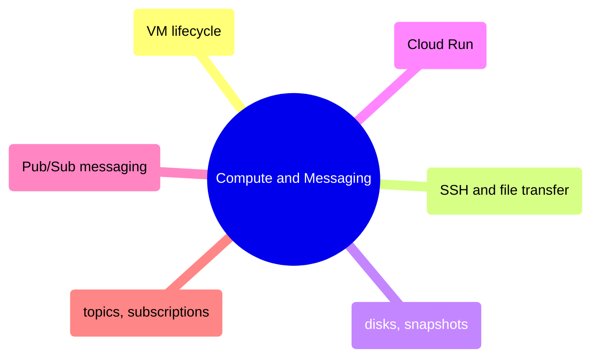

# Compute and Messaging

GCP compute lifecycle from VM operations and SSH access through disk management, Cloud Run containerized workloads, and Pub/Sub messaging patterns.

> [!abstract]- [[01-vm-lifecycle]]
>
> - [[vm-lifecycle#VM Start, Stop, and Reset Operations|Start, stop, and reset]]
> - [[vm-lifecycle#Resizing a VM by Changing Machine Type|Resizing machine type]]
> - [[vm-lifecycle#Right-Sizing VMs with Cloud Monitoring Data|Right-sizing with metrics]]
> - [[vm-lifecycle#Scheduled Start|Scheduled start and stop]]
> - [[vm-lifecycle#Compute Engine Machine Type Selection Guide|Machine type selection]]

> [!abstract]- [[02-vm-ssh-and-file-transfer]]
>
> - [[vm-ssh-and-file-transfer#SSH into a Compute Engine VM via IAP|SSH via IAP]]
> - [[vm-ssh-and-file-transfer#Running Remote Commands Non-Interactively on a VM|Remote commands]]
> - [[vm-ssh-and-file-transfer#Copying Files To and From VMs with gcloud compute scp|File transfer with scp]]
> - [[vm-ssh-and-file-transfer#Handling Permission Errors on SCP|Permission errors]]

> [!abstract]- [[03-disks-and-snapshots]]
>
> - [[disks-and-snapshots#Creating Disk Snapshots Before Risky Changes|Creating snapshots]]
> - [[disks-and-snapshots#Restoring a Disk from a Snapshot|Restoring from snapshot]]
> - [[disks-and-snapshots#Resizing a Persistent Disk|Resizing disks]]
> - [[disks-and-snapshots#Serial Console — When SSH Fails|Serial console]]

> [!abstract]- [[03-cloud-run-jobs-vs-services]]
>
> - [[cloud-run-jobs-vs-services#Cloud Run Jobs vs Services Comparison|Jobs vs Services comparison]]
> - [[cloud-run-jobs-vs-services#Listing and Executing Cloud Run Jobs|Executing jobs]]
> - [[cloud-run-jobs-vs-services#Updating Cloud Run Job Configuration|Updating job configuration]]
> - [[cloud-run-jobs-vs-services#Cloud Run Cold Start Mitigation|Cold start mitigation]]
> - [[cloud-run-jobs-vs-services#Cloud Run Environment Variables and Secrets|Environment variables and secrets]]

> [!abstract]- [[02-pubsub-messaging]]
>
> - [[pubsub-messaging#Publishing Messages|Publishing messages]]
> - [[pubsub-messaging#Consuming Messages|Consuming messages]]
> - [[pubsub-messaging#Monitoring the Pub|Subscription backlog monitoring]]
> - [[pubsub-messaging#Pub|Ordering keys and exactly-once]]
> - [[pubsub-messaging#Pub|At-least-once idempotency]]

> [!abstract]- [[01-pubsub-topics-and-subscriptions]]
>
> - [[01-pubsub-topics-and-subscriptions|Why Pub/Sub for pipelines]]
> - [[01-pubsub-topics-and-subscriptions|Creating topics and subscriptions]]
> - [[01-pubsub-topics-and-subscriptions|Pull vs push comparison]]
> - [[01-pubsub-topics-and-subscriptions|Dead letter topics]]
> - [[pubsub-topics-and-subscriptions#Pub|Pull vs Push comparison]]
