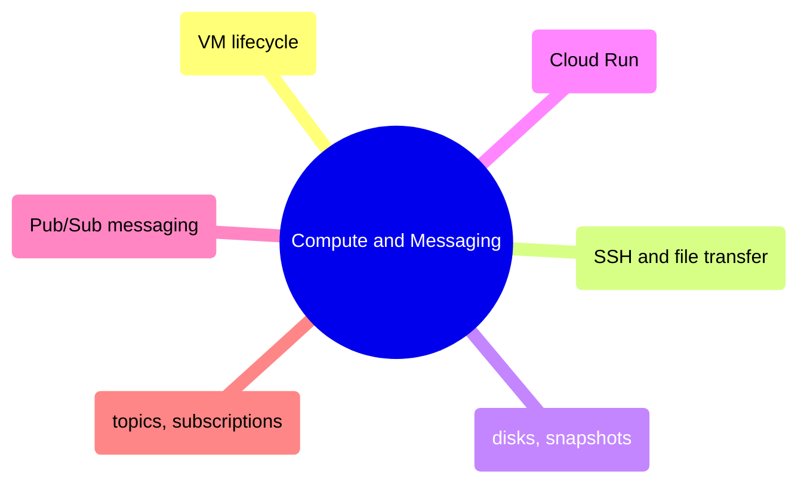

# Compute and Messaging

GCP compute lifecycle from VM operations and SSH access through disk management, Cloud Run containerized workloads, and Pub/Sub messaging patterns.

> [!abstract]- [[01-vm-lifecycle]]

> [!abstract]- [[02-vm-ssh-and-file-transfer]]

> [!abstract]- [[03-disks-and-snapshots]]

> [!abstract]- [[04-sql-server-on-compute-engine]]

> [!abstract]- [[05-airflow-on-compute-engine]]

> [!abstract]- [[01-stoxx-index-pipeline]]

> [!abstract]- [[02-stoxx-index-pipeline-source-files]]

> [!abstract]- [[03-cloud-run-jobs-vs-services]]

> [!abstract]- [[02-pubsub-messaging]]

> [!abstract]- [[01-pubsub-topics-and-subscriptions]]
>
> - [[01-pubsub-topics-and-subscriptions|Why Pub/Sub for pipelines]]
> - [[01-pubsub-topics-and-subscriptions|Creating topics and subscriptions]]
> - [[01-pubsub-topics-and-subscriptions|Pull vs push comparison]]
> - [[01-pubsub-topics-and-subscriptions|Dead letter topics]]
