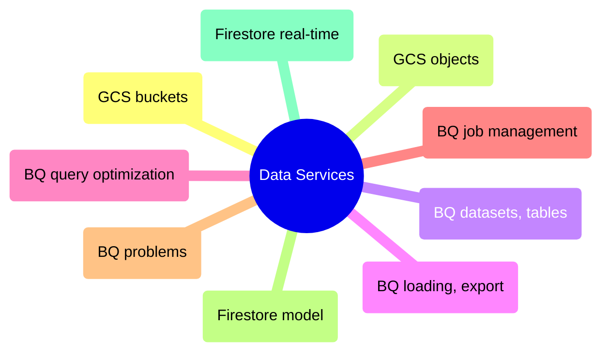

# Data Services

GCP data platform from Cloud Storage buckets and object operations through BigQuery dataset management, query optimization, and Firestore real-time NoSQL pipelines.

> [!abstract]- [[01-gcs-buckets-and-lifecycle]]

> [!abstract]- [[02-gcs-object-operations]]

> [!abstract]- [[01-dataset-and-table-management]]

> [!abstract]- [[02-data-loading-and-export]]

> [!abstract]- [[03-querying-and-cost-optimization]]

> [!abstract]- [[04-job-management]]

> [!abstract]- [[05-bigquery-problems]]

> [!abstract]- [[01-firestore-data-model-and-operations]]

> [!abstract]- [[02-real-time-nosql-pipelines]]
