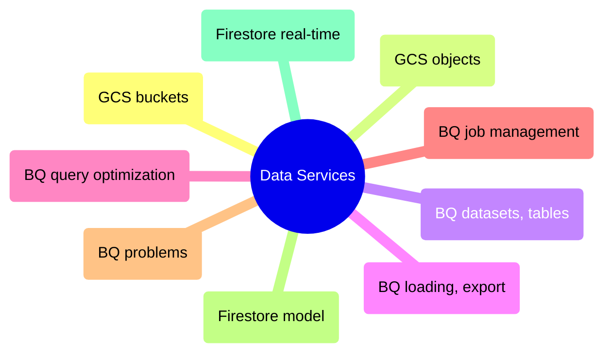

# Data Services

GCP data platform from Cloud Storage buckets and object operations through BigQuery dataset management, query optimization, and Firestore real-time NoSQL pipelines.

> [!abstract]- [[01-gcs-buckets-and-lifecycle]]
>
> - [[gcs-buckets-and-lifecycle#Creating GCS Buckets with gcloud storage|Creating buckets]]
> - [[gcs-buckets-and-lifecycle#GCS Storage Classes and Cost Trade-offs|Storage classes and costs]]
> - [[gcs-buckets-and-lifecycle#GCS Lifecycle Rules for Auto-Tiering|Lifecycle auto-tiering]]
> - [[gcs-buckets-and-lifecycle#GCS Object Versioning|Object versioning]]
> - [[gcs-buckets-and-lifecycle#GCS Bucket Location and Data Residency|Location and data residency]]

> [!abstract]- [[02-gcs-object-operations]]
>
> - [[gcs-object-operations#Copying Files with gcloud storage cp|Copying files]]
> - [[gcs-object-operations#Incremental Sync with gcloud storage rsync|Incremental sync with rsync]]
> - [[gcs-object-operations#Moving and Deleting GCS Objects|Moving and deleting]]
> - [[gcs-object-operations#GCS Transfer Optimization and Parallel Uploads|Parallel uploads]]
> - [[gcs-object-operations#Common GCS Pipeline Patterns|Pipeline patterns]]

> [!abstract]- [[01-dataset-and-table-management]]
>
> - [[dataset-and-table-management#Inspecting BigQuery Schema and Metadata|Schema and metadata]]
> - [[dataset-and-table-management#Creating BigQuery Datasets|Creating datasets]]
> - [[dataset-and-table-management#Creating Tables|Creating tables]]
> - [[dataset-and-table-management#Deleting BigQuery Tables and Datasets|Deleting tables and datasets]]
> - [[dataset-and-table-management#BigQuery Column Types Reference|Column types reference]]

> [!abstract]- [[02-data-loading-and-export]]
>
> - [[data-loading-and-export#Loading Data from GCS|Loading data from GCS]]
> - [[data-loading-and-export#Exporting BigQuery Data to GCS|Exporting to GCS]]
> - [[data-loading-and-export#BigQuery Time Travel — Querying Historical Data|Time travel queries]]
> - [[data-loading-and-export#Restoring a BigQuery Table from Time Travel|Restoring from time travel]]
> - [[data-loading-and-export#BigQuery Data Format Comparison|Format comparison]]

> [!abstract]- [[03-querying-and-cost-optimization]]
>
> - [[querying-and-cost-optimization#Running BigQuery Queries with bq query|Running queries]]
> - [[querying-and-cost-optimization#BigQuery Dry Run — Estimate Cost Before Executing|Dry run cost estimation]]
> - [[querying-and-cost-optimization#BigQuery Parameterized Queries for Caching and Injection Prevention|Parameterized queries]]
> - [[querying-and-cost-optimization#Cost Optimization — The 80|Cost optimization rules]]
> - [[querying-and-cost-optimization#BigQuery Cost Estimation Quick Reference|Cost estimation reference]]

> [!abstract]- [[04-job-management]]
>
> - [[job-management#Listing Recent BigQuery Jobs|Listing jobs]]
> - [[job-management#Inspecting BigQuery Job Details|Inspecting job details]]
> - [[job-management#Canceling a Running BigQuery Query|Canceling queries]]
> - [[job-management#BigQuery Job States Reference|Job states reference]]
> - [[job-management#Cost Recovery by Querying BigQuery Job History with SQL|Cost recovery via job history]]

> [!abstract]- [[05-bigquery-problems]]
>
> - [[bigquery-problems#Critical — Cost Explosion|Critical: cost and data loss]]
> - [[bigquery-problems#High — Data Quality|High: data quality and performance]]
> - [[bigquery-problems#Moderate — Operational Pain|Moderate: operational pain]]
> - [[bigquery-problems#Low — Annoyances|Low: annoyances and tech debt]]

> [!abstract]- [[01-firestore-data-model-and-operations]]
>
> - [[firestore-data-model-and-operations#What Is Firestore|What is Firestore]]
> - [[firestore-data-model-and-operations#Data Model|Data model]]
> - [[firestore-data-model-and-operations#CRUD Operations (Python SDK)|CRUD operations]]
> - [[firestore-data-model-and-operations#Querying|Querying]]
> - [[firestore-data-model-and-operations#Data Engineering Patterns with Firestore|Data engineering patterns]]

> [!abstract]- [[02-real-time-nosql-pipelines]]
>
> - [[real-time-nosql-pipelines#When to Use Real-Time NoSQL Pipelines|When to use real-time]]
> - [[real-time-nosql-pipelines#Architecture Patterns|Architecture patterns]]
> - [[real-time-nosql-pipelines#Implementation: Complete Pipeline State Store|Pipeline state store]]
> - [[real-time-nosql-pipelines#Monitoring and Observability|Monitoring and observability]]
> - [[real-time-nosql-pipelines#Cost Optimization|Cost optimization]]
