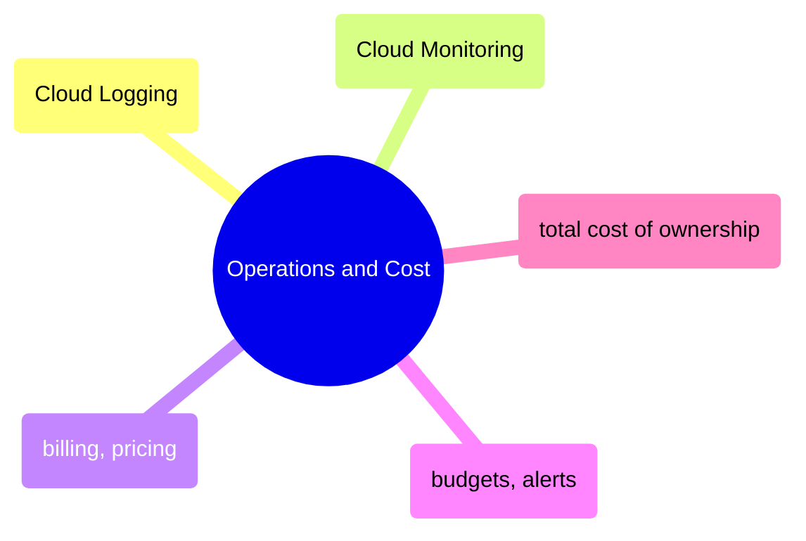

# Operations and Cost

GCP operational tooling from Cloud Logging and Monitoring through billing fundamentals, budget alerts, and total cost of ownership analysis for data pipelines.

> [!abstract]- [[01-cloud-logging]]

> [!abstract]- [[02-cloud-monitoring-metrics]]

> [!abstract]- [[01-gcp-billing-and-pricing]]

> [!abstract]- [[02-gcp-cost-monitoring-and-budgets]]

> [!abstract]- [[03-gcp-total-cost-of-ownership]]
