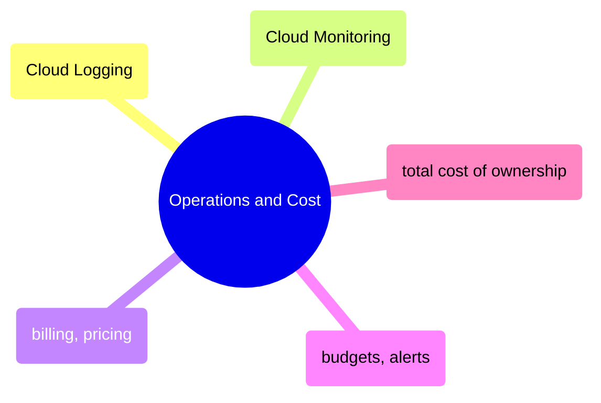

# Operations and Cost

GCP operational tooling from Cloud Logging and Monitoring through billing fundamentals, budget alerts, and total cost of ownership analysis for data pipelines.

> [!abstract]- [[01-cloud-logging]]
>
> - [[cloud-logging#Filtering Cloud Logs by Severity|Filtering by severity]]
> - [[cloud-logging#Combining Log Filters for Incident Response|Incident response filters]]
> - [[cloud-logging#Tailing Cloud Logs in Real-Time|Real-time tailing]]
> - [[cloud-logging#Cloud Logging Filter Language Reference|Filter language reference]]
> - [[cloud-logging#Common Cloud Logging Resource Types for Data Engineering|Resource types for data engineering]]

> [!abstract]- [[02-cloud-monitoring-metrics]]
>
> - [[cloud-monitoring-metrics#Reading Time-Series Metric Data|Reading time-series data]]
> - [[cloud-monitoring-metrics#Key Cloud Monitoring Metrics for Data Engineers|Key metrics for data engineers]]
> - [[cloud-monitoring-metrics#Metrics vs Logs — When to Use Each|Metrics vs logs]]
> - [[cloud-monitoring-metrics#Cloud Monitoring Alerting Policies|Alerting policies]]

> [!abstract]- [[01-gcp-billing-and-pricing]]
>
> - [[gcp-billing-and-pricing#GCP Billing Fundamentals|Billing fundamentals]]
> - [[gcp-billing-and-pricing#Pricing for Every GCP Data Engineering Service|Per-service pricing]]
> - [[gcp-billing-and-pricing#Cost Governance Patterns|Cost governance patterns]]
> - [[gcp-billing-and-pricing#FinOps Checklist|FinOps checklist]]
> - [[gcp-billing-and-pricing#GCP Free Tiers Quick Reference|Free tiers reference]]

> [!abstract]- [[02-gcp-cost-monitoring-and-budgets]]
>
> - [[gcp-cost-monitoring-and-budgets#Setting Up Billing Export to BigQuery|Billing export setup]]
> - [[gcp-cost-monitoring-and-budgets#Budget Alerts|Budget alerts]]
> - [[gcp-cost-monitoring-and-budgets#Cost Anomaly Detection|Anomaly detection]]
> - [[gcp-cost-monitoring-and-budgets#Cost Optimization Strategies|Optimization strategies]]
> - [[gcp-cost-monitoring-and-budgets#Cost Dashboard in BigQuery|Cost dashboard]]

> [!abstract]- [[03-gcp-total-cost-of-ownership]]
>
> - [[gcp-total-cost-of-ownership#How to Calculate TCO for a Data Pipeline|TCO calculation method]]
> - [[gcp-total-cost-of-ownership#Reference Architecture 1: Small Batch Pipeline (~$100–150|Small batch pipeline]]
> - [[gcp-total-cost-of-ownership#Reference Architecture 2: Medium Pipeline with SQL Server (~$200–400|Medium pipeline with SQL Server]]
> - [[gcp-total-cost-of-ownership#Reference Architecture 3: Production Platform (~$800–1,500|Production platform]]
> - [[gcp-total-cost-of-ownership#Cost Comparison: GCP vs AWS vs Azure|Multi-cloud cost comparison]]
