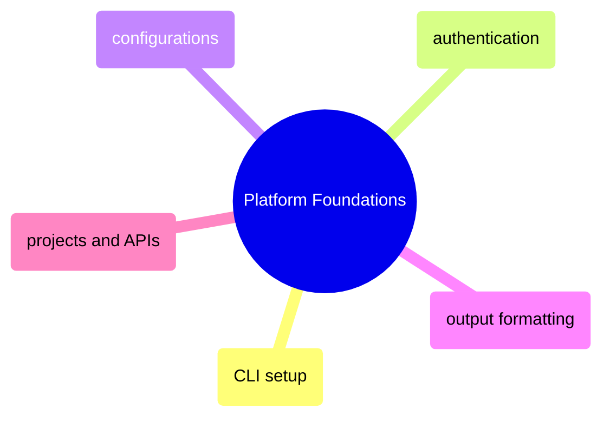

# Platform Foundations

GCP platform essentials from gcloud CLI structure and authentication through named configurations, output formatting, and project/API management.

> [!abstract]- [[00-gcloud-cli-setup]]
>
> - [Installation methods](https://alp78.github.io/elysium/06-GCP/01-Core/00-gcloud-cli-setup#installation)
> - [Initialization and gcloud init](https://alp78.github.io/elysium/06-GCP/01-Core/00-gcloud-cli-setup#initialization)
> - [Component management](https://alp78.github.io/elysium/06-GCP/01-Core/00-gcloud-cli-setup#component-management)
> - [Version and diagnostics](https://alp78.github.io/elysium/06-GCP/01-Core/00-gcloud-cli-setup#version-and-diagnostics)
> - [Shell completion](https://alp78.github.io/elysium/06-GCP/01-Core/00-gcloud-cli-setup#shell-completion)

> [!abstract]- [[02-gcloud-authentication]]
>
> - [Authentication commands](https://alp78.github.io/elysium/06-GCP/Core/gcloud-authentication#authentication-commands)
> - [ADC credential search order](https://alp78.github.io/elysium/06-GCP/Core/gcloud-authentication#the-adc-credential-search-order)
> - [Gotchas and edge cases](https://alp78.github.io/elysium/06-GCP/Core/gcloud-authentication#gcp-authentication-gotchas-and-edge-cases)

> [!abstract]- [[03-gcloud-configurations]]

> [!abstract]- [[04-gcloud-output-formatting]]

> [!abstract]- [[01-gcp-projects-and-apis]]
