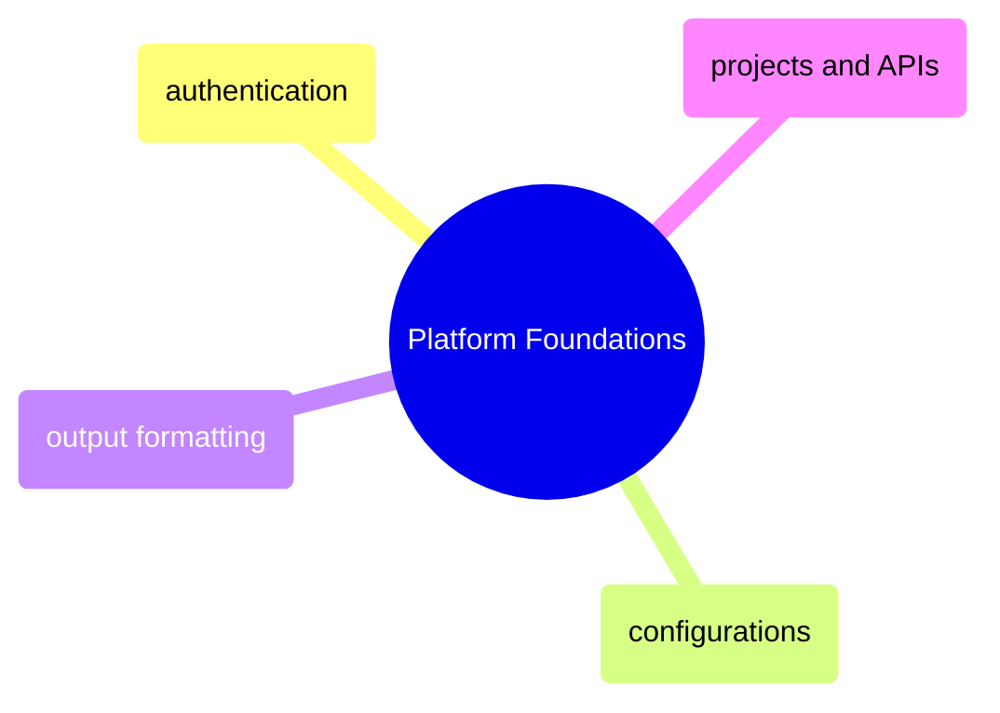

# Platform Foundations

GCP platform essentials from gcloud CLI structure and authentication through named configurations, output formatting, and project/API management.

> [!abstract]- [[gcloud-authentication]]
>
> - [Authentication commands](https://alp78.github.io/elysium/06-GCP/Core/gcloud-authentication#authentication-commands)
> - [ADC credential search order](https://alp78.github.io/elysium/06-GCP/Core/gcloud-authentication#the-adc-credential-search-order)
> - [Gotchas and edge cases](https://alp78.github.io/elysium/06-GCP/Core/gcloud-authentication#gcp-authentication-gotchas-and-edge-cases)

> [!abstract]- [[gcloud-configurations]]
>
> - [[gcloud-configurations#Creating and Switching Configurations|Creating and switching configs]]
> - [[gcloud-configurations#Protecting Production with Visual Cues in Terminal|Production visual cues]]
> - [[gcloud-configurations#Why Named Configurations Matter for Multi-Project Safety|Multi-project safety]]

> [!abstract]- [[gcloud-output-formatting]]
>
> - [[gcloud-output-formatting#Output Format Options|Format options]]
> - [[gcloud-output-formatting#Server-Side Filtering with|Server-side filtering]]
> - [[gcloud-output-formatting#Service Account Impersonation with gcloud|Service account impersonation]]
> - [[gcloud-output-formatting#Common gcloud Format Transformation Functions|Transformation functions]]

> [!abstract]- [[gcp-projects-and-apis]]
>
> - [[gcp-projects-and-apis#Listing and Describing GCP Projects|Listing projects]]
> - [[gcp-projects-and-apis#Listing and Enabling GCP APIs|Enabling APIs]]
> - [[gcp-projects-and-apis#Common GCP APIs for Data Engineering|Common APIs for data engineering]]
