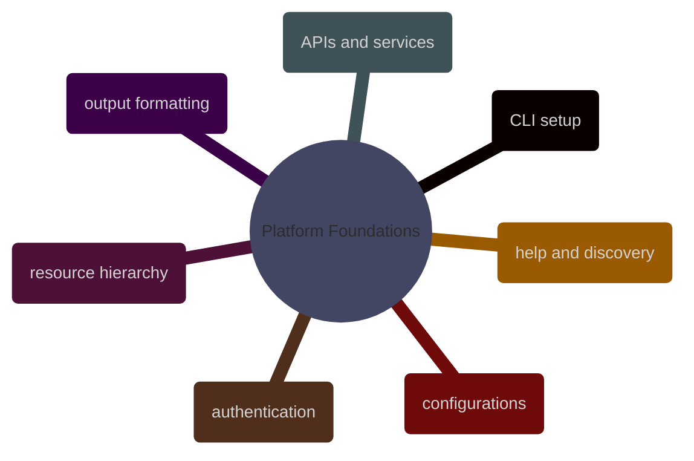

# Platform Foundations

GCP platform essentials from gcloud CLI structure through resource hierarchy, API and service management, authentication, named configurations, output formatting, and CLI self-discovery.

> [!abstract]- [[00-gcloud-cli-setup]]
>
> - [Installation methods](https://alp78.github.io/elysium/06-GCP/01-Core/00-gcloud-cli-setup#installation)
> - [Initialization and gcloud init](https://alp78.github.io/elysium/06-GCP/01-Core/00-gcloud-cli-setup#initialization)
> - [Component management](https://alp78.github.io/elysium/06-GCP/01-Core/00-gcloud-cli-setup#component-management)
> - [Version and diagnostics](https://alp78.github.io/elysium/06-GCP/01-Core/00-gcloud-cli-setup#version-and-diagnostics)
> - [Shell completion](https://alp78.github.io/elysium/06-GCP/01-Core/00-gcloud-cli-setup#shell-completion)

> [!abstract]- [[01-gcp-resource-hierarchy]]
>
> - [Hierarchy model](https://alp78.github.io/elysium/06-GCP/01-Core/01-gcp-resource-hierarchy#resource-hierarchy-model)
> - [Bootstrap access](https://alp78.github.io/elysium/06-GCP/01-Core/01-gcp-resource-hierarchy#bootstrap-access)
> - [Project metadata, labels, and liens](https://alp78.github.io/elysium/06-GCP/01-Core/01-gcp-resource-hierarchy#projects)

> [!abstract]- [[02-gcp-apis-and-services]]
>
> - [Listing APIs](https://alp78.github.io/elysium/06-GCP/01-Core/02-gcp-apis-and-services#listing-apis)
> - [Enable and disable workflows](https://alp78.github.io/elysium/06-GCP/01-Core/02-gcp-apis-and-services#enabling-apis)
> - [Operations and common DE APIs](https://alp78.github.io/elysium/06-GCP/01-Core/02-gcp-apis-and-services#operations)

> [!abstract]- [[03-gcloud-authentication]]
>
> - [Authentication commands](https://alp78.github.io/elysium/06-GCP/01-Core/03-gcloud-authentication)
> - [ADC credential search order](https://alp78.github.io/elysium/06-GCP/01-Core/03-gcloud-authentication)
> - [Gotchas and edge cases](https://alp78.github.io/elysium/06-GCP/01-Core/03-gcloud-authentication)

> [!abstract]- [[04-gcloud-configurations]]

> [!abstract]- [[05-gcloud-output-formatting]]

> [!abstract]- [[06-gcloud-help-and-discovery]]
>
> - [Getting help from the command tree](https://alp78.github.io/elysium/06-GCP/01-Core/06-gcloud-help-and-discovery)
> - [Topic references and release tracks](https://alp78.github.io/elysium/06-GCP/01-Core/06-gcloud-help-and-discovery)
> - [Diagnostics, interactive mode, and discovery patterns](https://alp78.github.io/elysium/06-GCP/01-Core/06-gcloud-help-and-discovery)
