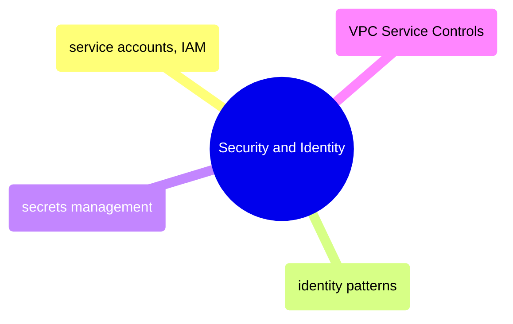

# Security and Identity

GCP security from service accounts and IAM role bindings through identity patterns, secrets management, and VPC Service Controls for data exfiltration prevention.

> [!abstract]- [[01-service-accounts-and-iam]]
>
> - [[service-accounts-and-iam#GCP Service Accounts — Machine Identities|Service accounts]]
> - [[service-accounts-and-iam#IAM Bindings — Granting Roles to Service Accounts|IAM role bindings]]
> - [[service-accounts-and-iam#Testing IAM Permissions|Testing permissions]]
> - [[service-accounts-and-iam#Minimum IAM Permission Set for a Data Pipeline|Minimum pipeline permissions]]
> - [[service-accounts-and-iam#Custom IAM Roles for Tighter Control|Custom roles]]

> [!abstract]- [[02-gcp-identity-and-connection-patterns]]
>
> - [[gcp-identity-and-connection-patterns#The GCP Identity Model|Identity model]]
> - [[gcp-identity-and-connection-patterns#Authentication Methods — Complete Framework|Authentication methods]]
> - [[gcp-identity-and-connection-patterns#Connection Patterns by Scenario|Connection patterns by scenario]]
> - [[gcp-identity-and-connection-patterns#The Certificate and TLS Landscape|Certificates and TLS]]
> - [[gcp-identity-and-connection-patterns#Anti-Patterns|Anti-patterns]]

> [!abstract]- [[03-secrets-management]]
>
> - [[secrets-management#GCP Secret Manager|GCP Secret Manager]]
> - [[secrets-management#Airflow Integration|Airflow integration]]
> - [[secrets-management#GitHub Actions|GitHub Actions]]
> - [[secrets-management#Secret Rotation Procedure|Secret rotation]]
> - [[secrets-management#Secret Management Anti-Patterns|Anti-patterns]]

> [!abstract]- [[04-vpc-service-controls]]
>
> - [[vpc-service-controls#The Data Exfiltration Threat Model|Data exfiltration threat model]]
> - [[vpc-service-controls#Setting Up a VPC-SC Perimeter|Setting up a perimeter]]
> - [[vpc-service-controls#What VPC-SC Blocks vs Allows|What VPC-SC blocks vs allows]]
> - [[vpc-service-controls#Debugging VPC-SC Denial Errors|Debugging denial errors]]
> - [[vpc-service-controls#VPC-SC Ingress and Egress Policies|Ingress and egress policies]]
