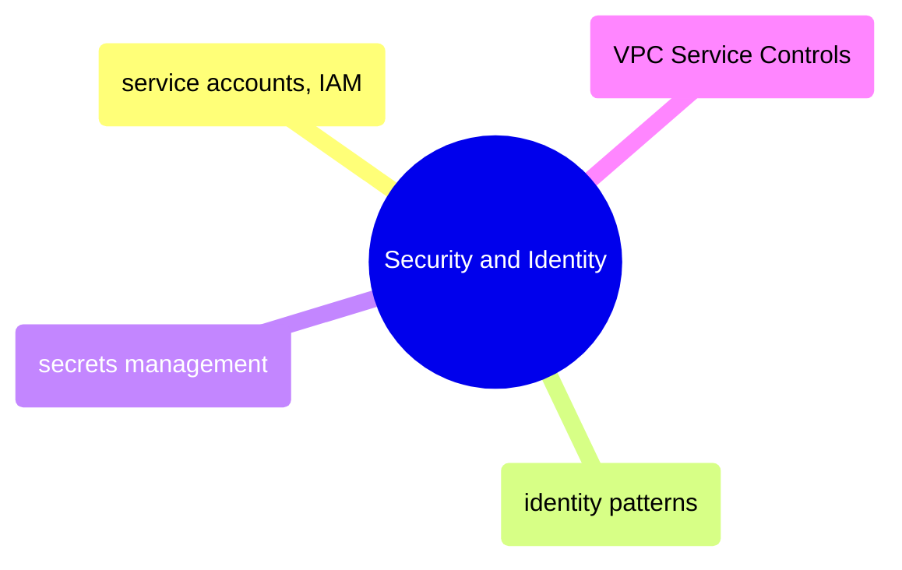

# Security and Identity

GCP security from service accounts and IAM role bindings through identity patterns, secrets management, and VPC Service Controls for data exfiltration prevention.

> [!abstract]- [[01-service-accounts-and-iam]]

> [!abstract]- [[02-gcp-identity-and-connection-patterns]]

> [!abstract]- [[03-secrets-management]]

> [!abstract]- [[04-vpc-service-controls]]
