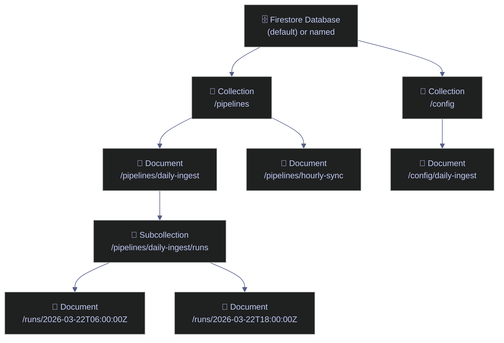
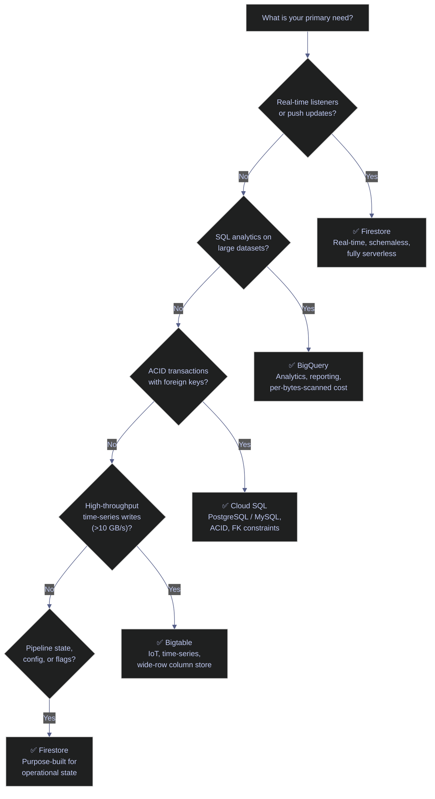

# Firestore — Data Model and Operations

> [!quote]
> "In a document database, you model your data around the questions you need to answer, not the relationships between entities."
>
> — **Rick Houlihan**, AWS NoSQL design lead

## Why Firestore for Data Engineering

Firestore's unbeatable value comes down to one thing no other GCP service does: **real-time push to clients with zero infrastructure.**

| Need                                       | Firestore                                                             | Alternative                       | Why Firestore Wins                         |
| ------------------------------------------ | --------------------------------------------------------------------- | --------------------------------- | ------------------------------------------ |
| Dashboard sees data the instant it changes | `on_snapshot()` — Firestore pushes to all connected clients in <100ms | Pub/Sub + custom WebSocket server | No server to build/deploy/scale. Zero ops. |
| Mobile/web app reads latest scores         | Direct client SDK (no backend needed)                                 | REST API → Cloud Run → BigQuery   | No backend, no cold starts, no query costs |
| Config change takes effect immediately     | Listener fires on update                                              | Redeploy, or poll a database      | No deploy cycle, no polling interval       |
| Offline-first mobile app                   | Built-in offline cache + sync                                         | Build your own sync layer         | Months of engineering vs. one line of code |

## What Is Firestore

Cloud Firestore is a fully managed, serverless, document-oriented NoSQL database hosted on GCP. It scales automatically from zero to planetary scale, requires no infrastructure provisioning, and supports real-time data synchronization to connected clients. Firestore is the recommended database for applications that need low-latency reads and writes, flexible schema evolution, and hierarchical data organization.

Firestore is distinct from traditional relational databases: there is no fixed schema, no SQL, and no joins across collections. Instead, data is organized into **documents** grouped into **collections**, with optional **subcollections** nested under documents.

> [!info] Prerequisites
>
> Enable `firestore.googleapis.com` before creating any database:
> ```bash
> gcloud services enable firestore.googleapis.com
> ```
> Required role to create and manage databases: `roles/datastore.owner` or `roles/firebase.admin`.

> [!tip] When to Use Firestore
>
> Firestore excels at pipeline state tracking, config stores, feature flags, audit logs, and any use case where you need real-time change propagation without managing infrastructure. For advanced Firestore query patterns, see [05-DB-Queries/Firestore](https://alp78.github.io/elysium/05-DB-Queries/Firestore/firestore-queries). For analytics workloads, pair it with [BigQuery](https://alp78.github.io/elysium/06-GCP/BigQuery/querying-and-cost-optimization).

---

### Native Mode vs Datastore Mode

Firestore has two operating modes. The mode is chosen at database creation time and cannot be changed afterward.

| Dimension | Native Mode | Datastore Mode |
|---|---|---|
| Data model | Documents, collections, subcollections | Entities, kinds, namespaces |
| Real-time listeners | ✅ `on_snapshot` | ❌ |
| Offline support (mobile/web) | ✅ | ❌ |
| Transactions | ✅ cross-document | ✅ cross-entity |
| Strong consistency | ✅ all queries | ✅ |
| Multi-region | ✅ | ✅ |
| Python client library | `google-cloud-firestore` | `google-cloud-datastore` |
| Console UI | Firestore console | Datastore console |
| Best for | New projects, real-time, mobile/web backends | Legacy Datastore migrations |
| Collection group queries | ✅ | ❌ |
| Server-side aggregation | ✅ `count`, `sum`, `avg` | ❌ |

> [!warning] Mode is permanent
>
> Once a Firestore database is created in Native mode or Datastore mode, it cannot be switched. Plan the mode choice before any data is written. For all new data engineering projects, prefer Native mode.

> [!success] Default to Native Mode
>
> Choose Native mode for all new projects. It is strictly a superset of Datastore mode: it adds real-time listeners, offline support, collection group queries, and server-side aggregations. There is no runtime cost difference. Decide before writing any data — you cannot change it later.

---

### Firestore vs BigQuery vs Cloud SQL — Positioning

| Dimension | Firestore | BigQuery | Cloud SQL |
|---|---|---|---|
| Primary workload | OLTP — real-time reads/writes | OLAP — analytical queries | OLTP — relational transactions |
| Latency | <10 ms | Seconds to minutes | <10 ms |
| Schema | Flexible (schemaless) | Fixed (typed columns) | Fixed (DDL schema) |
| Real-time updates | ✅ listeners | ❌ | ❌ |
| Joins | ❌ | ✅ SQL | ✅ SQL |
| Indexing | Auto per-field + composite | Partitioning + clustering | B-tree indexes |
| Max record size | 1 MB per document | No row limit per se | Row size depends on engine |
| Scaling model | Fully auto | Fully auto | Manual instance sizing |
| Cost driver | Per read/write/delete | Per bytes scanned | Per instance-hour |
| Best DE use case | Pipeline state, config, flags | Analytics, reporting | Transactional data with FK constraints |

See [dataset-and-table-management](https://alp78.github.io/elysium/06-GCP/BigQuery/dataset-and-table-management) for BigQuery table design patterns and [querying-and-cost-optimization](https://alp78.github.io/elysium/06-GCP/BigQuery/querying-and-cost-optimization) for BigQuery cost controls.

---

### Free Tier and Pricing

Firestore pricing is operation-based, not instance-based. There is no cost when the database is idle.

#### Free tier (per day, per project)
- 50,000 document reads
- 20,000 document writes
- 20,000 document deletes
- 1 GiB stored data
- 10 GiB network egress per month

#### Paid pricing (beyond free tier, us-central1 approximate)
- Reads: $0.06 per 100,000 documents
- Writes: $0.18 per 100,000 documents
- Deletes: $0.02 per 100,000 documents
- Storage: $0.18 per GiB per month

> [!warning] Reads Charged Per Document
>
> Reads are per document returned, not per query.
> A query that returns 10,000 documents costs 10,000 read operations regardless of how many fields are projected. Design queries to be selective. Use `limit()` and filters aggressively.

> [!success] Limit and Filter Aggressively
>
> Always add `.limit()` to queries and use equality filters to narrow the result set before ordering. For dashboard-style reads, maintain a denormalized summary document per pipeline that is updated on each state transition — one document read instead of a collection scan.

---

## Data Model

Firestore organizes data as documents inside collections, with optional subcollections nested under documents. Understanding this hierarchy is a prerequisite for writing SDK code, queries, and indexes.

### Documents, Collections, and Subcollections

Firestore organizes data hierarchically. Each level in the tree is distinct — a collection holds only documents, a document holds only fields and optional subcollections.



```text
/pipelines                          ← collection
    /daily-ingest                   ← document
        name: "daily-ingest"
        status: "running"
        /runs                       ← subcollection
            /2026-03-22T06:00:00Z   ← document
                rows_read: 120000
                rows_written: 119850
```

- **Collection**: a container for documents. Collections cannot hold raw data — only documents.
- **Document**: a JSON-like object with named fields. Lives inside a collection.
- **Subcollection**: a collection nested under a document. Subcollections do not appear when the parent document is fetched — they must be queried explicitly.

A document path looks like: `projects/{project}/databases/{db}/documents/pipelines/daily-ingest`

In Python the path is addressed as:
```python
db.collection("pipelines").document("daily-ingest")
db.collection("pipelines").document("daily-ingest").collection("runs").document("2026-03-22T06:00:00Z")
```

---

### Document Structure — Fields, Types, Maps, Arrays

A Firestore document is a set of key-value pairs. Values can be any supported type, including nested maps and arrays.

```json
{
  "pipeline_name": "daily-ingest",
  "status": "complete",
  "rows_processed": 119850,
  "started_at": "2026-03-22T06:00:00Z",
  "completed_at": "2026-03-22T06:47:12Z",
  "config": {
    "source_bucket": "my-source-bucket",
    "destination_dataset": "analytics",
    "batch_size": 5000
  },
  "error_codes": [],
  "tags": ["production", "critical"],
  "is_active": true
}
```

#### Supported field types

| Type | Python representation | Notes |
|---|---|---|
| String | `str` | UTF-8, max 1,048,487 bytes |
| Integer | `int` | 64-bit signed |
| Float | `float` | IEEE 754 double |
| Boolean | `bool` | `True` / `False` |
| Timestamp | `datetime` (with tzinfo) | Server timestamps available |
| Bytes | `bytes` | Max 1,048,487 bytes |
| Reference | `DocumentReference` | Points to another doc |
| GeoPoint | `firestore.GeoPoint(lat, lon)` | Latitude/longitude pair |
| Array | `list` | Cannot contain another array |
| Map | `dict` | Nested key-value pairs |
| Null | `None` | Explicit null field |

> [!warning] Arrays cannot contain arrays
>
> Firestore arrays cannot nest other arrays directly. Use a list of maps instead when you need complex array elements.

> [!success] Use a List of Maps for Complex Elements
>
> Replace a nested array with a list of maps: `[{"key": "a", "value": 1}, {"key": "b", "value": 2}]`. Each map element can hold multiple fields and is fully queryable with `array_contains`.

---

### Document IDs: Auto-Generated vs Custom

**Auto-generated IDs** are random, collision-resistant alphanumeric strings produced by calling `.document()` with no argument:

```python
doc_ref = db.collection("events").document()  # e.g., "Xk2mN9pQr7..."
print(doc_ref.id)
```

**Custom IDs** are provided explicitly:

```python
doc_ref = db.collection("pipelines").document("daily-ingest")
```

> [!warning] Avoid Timestamp Document IDs
>
> Avoid timestamps as document IDs.
> Using timestamps or monotonically increasing integers as IDs creates a "hot spot" — all writes go to the same tablet shard. Firestore throttles hot spots. Use auto-generated IDs or hash-prefixed IDs for high-throughput write scenarios.

> [!success] Use Auto-Generated or Hash-Prefixed IDs
>
> Call `.document()` with no argument to get a random collision-resistant ID. For sequential data that must be queried by time, store the timestamp as a field and sort by it — keep the document ID random to avoid hot spots.

---

### Document Size Limit and Collection Naming

- **Maximum document size**: 1 MiB (1,048,576 bytes). This includes field names, values, and all nested data.
- **Collection names**: must not start with `__`. Valid characters are letters, digits, hyphens, and underscores.
- **Document ID**: max 1,500 bytes. Cannot contain forward slashes.
- **Field names**: any valid UTF-8 string, but names containing special characters require backtick escaping in queries.

---

### Subcollection Patterns: When to Nest vs Flatten

#### Nest into a subcollection when
- The child data belongs to a single parent and is accessed via the parent.
- There are many child records per parent (e.g., pipeline run history under a pipeline document).
- You want to delete the parent without automatically removing children (subcollections are not deleted with parent documents — must be deleted manually).

#### Flatten to a top-level collection when
- You need to query across all instances of the child type regardless of parent.
- The data can be re-associated via a stored reference or ID field.

#### Pattern comparison

```text
# Nested — query runs for a specific pipeline
/pipelines/{pipeline_id}/runs/{run_id}

# Flat — query all failed runs across all pipelines
/pipeline_runs/{run_id}   with field pipeline_id: "daily-ingest"
```

Collection group queries (covered in the Querying section) allow querying nested subcollections across all parent documents, partially bridging the gap.

---

### Data Modeling for Data Engineering

| Use Case | Recommended Structure |
|---|---|
| Pipeline run metadata | `/pipelines/{id}/runs/{run_id}` — subcollection per pipeline |
| Pipeline config | `/config/{pipeline_id}` — single document per pipeline, read at startup |
| Feature flags | `/feature_flags/{flag_name}` — simple key-value documents |
| Audit log | `/audit_log/{event_id}` — flat collection, auto-ID, immutable documents |
| Dead-letter queue | `/dlq/{message_id}` — flat collection, process and delete on retry |
| Pipeline registry | `/pipelines/{id}` — one document per registered pipeline |

---

## CRUD Operations (Python SDK)

The `google-cloud-firestore` Python client provides synchronous and asynchronous APIs for all document operations. Install it once per environment, then initialize a `Client` instance that persists for the lifetime of the process.

### Installation and Client Initialization

Install the client library and initialize a `firestore.Client` instance. The client uses Application Default Credentials (ADC) by default — set `GOOGLE_APPLICATION_CREDENTIALS` to a service account key file, or run `gcloud auth application-default login` for local development.

```bash
pip install google-cloud-firestore
```

```python
from google.cloud import firestore

# Uses GOOGLE_APPLICATION_CREDENTIALS env var or ADC
db = firestore.Client(project="my-gcp-project")

# Explicitly specify database (default is "(default)")
db = firestore.Client(project="my-gcp-project", database="my-named-db")
```

See [gcloud-authentication](https://alp78.github.io/elysium/06-GCP/Core/gcloud-authentication) for setting up Application Default Credentials (ADC) and [service-accounts-and-iam](https://alp78.github.io/elysium/06-GCP/Security/service-accounts-and-iam) for service account key management.

---

### Create / Set a Document

`set()` creates the document if it does not exist, or fully replaces it if it does.

```python
pipeline_ref = db.collection("pipelines").document("daily-ingest")

pipeline_ref.set({
    "name": "daily-ingest",
    "status": "idle",
    "created_at": firestore.SERVER_TIMESTAMP,
    "config": {
        "source_bucket": "raw-data-bucket",
        "batch_size": 5000,
    },
    "tags": ["production"],
})
```

**Merge instead of replace** — only update provided fields, leave others intact:

```python
pipeline_ref.set({"status": "running"}, merge=True)
```

#### Add a document with auto-generated ID

```python
doc_ref = db.collection("events").add({
    "event_type": "pipeline_started",
    "pipeline_id": "daily-ingest",
    "timestamp": firestore.SERVER_TIMESTAMP,
})
```

---

### Read a Document

```python
doc = pipeline_ref.get()

if doc.exists:
    data = doc.to_dict()
    print(data["status"])
else:
    print("Document not found")
```

#### Read multiple documents by reference

```python
refs = [
    db.collection("pipelines").document("daily-ingest"),
    db.collection("pipelines").document("hourly-sync"),
]
docs = db.get_all(refs)
for doc in docs:
    print(doc.id, doc.to_dict())
```

---

### Update a Document

`update()` merges changes into an existing document. Raises `NotFound` if the document does not exist.

```python
pipeline_ref.update({
    "status": "running",
    "started_at": firestore.SERVER_TIMESTAMP,
    "rows_processed": 0,
})
```

**Nested field update** using dot-notation — does not overwrite sibling fields:

```python
pipeline_ref.update({
    "config.batch_size": 10000,
    "config.retry_count": 3,
})
```

#### Atomic field transforms

```python
# Increment a counter atomically
pipeline_ref.update({"rows_processed": firestore.Increment(5000)})

# Add elements to an array without duplicates
pipeline_ref.update({"tags": firestore.ArrayUnion(["validated"])})

# Remove elements from an array
pipeline_ref.update({"tags": firestore.ArrayRemove(["draft"])})
```

---

### Delete a Document or Field

```python
# Delete entire document
pipeline_ref.delete()

# Delete a specific field, leave document intact
pipeline_ref.update({"error_message": firestore.DELETE_FIELD})
```

---

### Batch Writes

A batch groups up to 500 operations (set, update, delete) into a single atomic commit. Either all succeed or all fail. No reads are allowed in a batch.

```python
batch = db.batch()

run_ref = db.collection("pipelines").document("daily-ingest").collection("runs").document()
batch.set(run_ref, {
    "status": "running",
    "started_at": firestore.SERVER_TIMESTAMP,
})

pipeline_ref = db.collection("pipelines").document("daily-ingest")
batch.update(pipeline_ref, {
    "status": "running",
    "last_run_id": run_ref.id,
})

audit_ref = db.collection("audit_log").document()
batch.set(audit_ref, {
    "event": "run_started",
    "pipeline_id": "daily-ingest",
    "run_id": run_ref.id,
    "timestamp": firestore.SERVER_TIMESTAMP,
})

batch.commit()
```

> [!tip] Batch Writes Not Transactions
>
> Batch writes are not transactions.
> Batch writes are atomic but do not read existing data. Use a transaction when you need to read a value and conditionally write based on it.

---

### Transactions

Use transactions when a write depends on the current value of a document — for example, incrementing a counter or enforcing a state machine transition. Firestore retries the transaction automatically if a concurrent write modifies any read document before the commit.

Transactions allow read-then-write atomicity across multiple documents. If a concurrent write modifies a document between the transaction's read and write, Firestore retries automatically (up to 5 times by default).

```python
@firestore.transactional
def increment_run_count(transaction, pipeline_ref):
    snapshot = pipeline_ref.get(transaction=transaction)
    current_count = snapshot.get("total_runs") or 0

    transaction.update(pipeline_ref, {
        "total_runs": current_count + 1,
        "last_updated": firestore.SERVER_TIMESTAMP,
    })

pipeline_ref = db.collection("pipelines").document("daily-ingest")
transaction = db.transaction()
increment_run_count(transaction, pipeline_ref)
```

---

## Querying

Firestore queries are scoped to a single collection or collection group and run entirely server-side. All filters are applied before results are returned — Firestore never does a full table scan on the client side.

### Simple Queries

Filter a collection using `.where()` and chain `.order_by()` and `.limit()` for sorting and result-set control. Call `.stream()` to iterate over matching documents without loading all of them into memory at once.

```python
# All pipelines with status "running"
query = db.collection("pipelines").where("status", "==", "running")
docs = query.stream()
for doc in docs:
    print(doc.id, doc.to_dict())

# With ordering and limit
query = (
    db.collection("pipelines")
    .where("status", "==", "complete")
    .order_by("completed_at", direction=firestore.Query.DESCENDING)
    .limit(10)
)
```

**Supported filter operators:** `==`, `!=`, `<`, `<=`, `>`, `>=`, `in`, `not-in`, `array_contains`, `array_contains_any`

```python
# Field value in a list
db.collection("pipelines").where("status", "in", ["running", "pending"])

# Array contains a value
db.collection("pipelines").where("tags", "array_contains", "production")
```

---

### Compound Queries

Multiple `where()` clauses are ANDed together:

```python
query = (
    db.collection("pipeline_runs")
    .where("pipeline_id", "==", "daily-ingest")
    .where("status", "==", "failed")
    .where("started_at", ">=", datetime(2026, 3, 1, tzinfo=timezone.utc))
)
```

> [!warning] Single-Field Inequality Only
>
> Inequality filters on a single field only.
> Firestore only allows inequality filters (`<`, `<=`, `>`, `>=`, `!=`) on **one field per query**. Filtering on two different fields with inequalities requires a composite index and is not supported as a standard query — restructure your data model or use equality for one field.

> [!success] Use Equality for One Field, Inequality for the Other
>
> Convert one of the range conditions into an equality filter by bucketing the value (e.g., status `== "failed"` instead of `!= "success"`), or split into two queries and merge results in Python. Alternatively, denormalize a combined field (e.g., `pipeline_status_date`) to enable a single inequality query.

> [!warning] No Cross-Field OR Queries
>
> No native OR across different fields.
> Firestore does not support `field_a == x OR field_b == y`. Use `in` for OR conditions on the same field. For cross-field OR, run two queries and merge results in Python.

> [!success] Merge Two Queries in Python
>
> Run both queries independently, collect results into a dict keyed by document ID to deduplicate, then merge: `{doc.id: doc.to_dict() for q in [query_a, query_b] for doc in q.stream()}`. For same-field OR, use the `in` operator: `.where("status", "in", ["failed", "error"])`.

---

### Collection Group Queries

Query across all subcollections with the same name, regardless of parent:

```python
# Query all "runs" subcollections across all pipelines
runs_query = (
    db.collection_group("runs")
    .where("status", "==", "failed")
    .order_by("started_at", direction=firestore.Query.DESCENDING)
    .limit(50)
)
for doc in runs_query.stream():
    print(doc.reference.path, doc.to_dict())
```

> [!tip] Composite Index Required
>
> Collection group queries require a composite index.
> Before running a collection group query with filters or ordering, create a collection group index via the Firestore console or `gcloud`. The console will provide the exact command when a query fails due to a missing index.

---

### Composite Indexes

Firestore auto-creates single-field indexes for every field. Queries with multiple `where()` or `order_by()` on different fields require a manually created composite index.

#### gcloud | Create a composite index

Create the index from the command line, or copy the exact command from the error message Firestore returns when a query fails due to a missing index.

```bash
gcloud firestore indexes composite create \
  --collection-group=pipeline_runs \
  --field-config=field-path=pipeline_id,order=ASCENDING \
  --field-config=field-path=status,order=ASCENDING \
  --field-config=field-path=started_at,order=DESCENDING
```

```text
Create request issued for: [...]
Waiting for operation [...] to complete...done.
Created index [...].
```

#### gcloud | List composite indexes

```bash
gcloud firestore indexes composite list
```

```text
INDEX_ID    COLLECTION_GROUP  QUERY_SCOPE  STATE  FIELDS
abc123...   pipeline_runs     COLLECTION   READY  pipeline_id ASC, status ASC, started_at DESC
```

---

### Pagination

Use `start_after()` with the last document from the previous page:

```python
def get_page(page_size=25, cursor_doc=None):
    query = (
        db.collection("pipeline_runs")
        .where("status", "==", "complete")
        .order_by("completed_at", direction=firestore.Query.DESCENDING)
        .limit(page_size)
    )
    if cursor_doc:
        query = query.start_after(cursor_doc)

    docs = list(query.stream())
    last_doc = docs[-1] if docs else None
    return docs, last_doc

page1, cursor = get_page()
page2, cursor = get_page(cursor_doc=cursor)
```

---

### Server-Side Aggregation Queries

Avoid fetching all documents just to count them:

```python
from google.cloud.firestore_v1.base_query import AggregationQuery

# Count documents matching a filter
count_query = (
    db.collection("pipeline_runs")
    .where("status", "==", "failed")
    .count()
)
result = count_query.get()
failed_count = result[0][0].value

# Sum a numeric field
sum_query = (
    db.collection("pipeline_runs")
    .where("pipeline_id", "==", "daily-ingest")
    .sum("rows_processed")
)
result = sum_query.get()
total_rows = result[0][0].value

# Average
avg_query = (
    db.collection("pipeline_runs")
    .where("pipeline_id", "==", "daily-ingest")
    .where("status", "==", "complete")
    .avg("duration_seconds")
)
result = avg_query.get()
avg_duration = result[0][0].value
```

> [!tip] Aggregations Bill as One Read
>
> Aggregations are billed as a single read.
> A `count()`, `sum()`, or `avg()` aggregation query is billed as one read operation, regardless of the number of documents it scans. This makes aggregations significantly cheaper than fetching all documents.

---

## Real-Time Listeners

Firestore pushes document and query changes to connected clients in real time using `on_snapshot()`. Listeners operate on individual documents or filtered collection queries and fire immediately with the current snapshot, then once per change thereafter.

### Document Listener

Register a callback with `.on_snapshot()` on a `DocumentReference`. The callback fires immediately with the current state, then once each time the document is modified. The returned `unsubscribe` callable stops the listener.

```python
def on_pipeline_change(doc_snapshot, changes, read_time):
    for doc in doc_snapshot:
        print(f"Pipeline {doc.id} updated: {doc.to_dict()}")

pipeline_ref = db.collection("pipelines").document("daily-ingest")
unsubscribe = pipeline_ref.on_snapshot(on_pipeline_change)

# Stop listening
unsubscribe()
```

### Collection Watcher

Attach `.on_snapshot()` to a query to watch all documents matching its filters. The `changes` list provides typed events (`ADDED`, `MODIFIED`, `REMOVED`) so the callback can react to specific change types rather than processing the full snapshot.

```python
def on_collection_change(col_snapshot, changes, read_time):
    for change in changes:
        if change.type.name == "ADDED":
            print(f"New document: {change.document.id}")
        elif change.type.name == "MODIFIED":
            print(f"Modified: {change.document.id}")
        elif change.type.name == "REMOVED":
            print(f"Removed: {change.document.id}")

query = db.collection("pipeline_runs").where("status", "==", "failed")
unsubscribe = query.on_snapshot(on_collection_change)
```

---

### Real-Time Listener Use Cases for Data Engineering

**Pipeline status dashboard**
Write pipeline run state (start, progress, completion) to Firestore documents. A frontend or monitoring tool subscribes with `on_snapshot()` and reflects status changes without polling.

```python
# Pipeline writes its own status
run_ref = db.collection("pipeline_runs").document(run_id)
run_ref.set({"status": "running", "progress_pct": 0, "started_at": firestore.SERVER_TIMESTAMP})

# Mid-run progress update
run_ref.update({"progress_pct": 45, "rows_processed": firestore.Increment(50000)})

# Completion
run_ref.update({"status": "complete", "progress_pct": 100, "completed_at": firestore.SERVER_TIMESTAMP})
```

**Config-driven pipelines**
Store runtime configuration in a Firestore document. A pipeline listener detects changes and updates its behavior without restarting.

```python
config_ref = db.collection("config").document("daily-ingest")

def apply_config(doc_snapshot, changes, read_time):
    for doc in doc_snapshot:
        cfg = doc.to_dict()
        update_pipeline_settings(
            batch_size=cfg.get("batch_size", 5000),
            enabled=cfg.get("enabled", True),
        )

unsubscribe = config_ref.on_snapshot(apply_config)
```

**Feature flags**
Toggle pipeline behavior without redeployment. Store flags as boolean fields in a document.

```python
flags_ref = db.collection("feature_flags").document("pipeline-v2")
flags = flags_ref.get().to_dict()

if flags.get("use_new_dedup_logic", False):
    run_new_dedup()
else:
    run_legacy_dedup()
```

**Event-driven triggers via Cloud Functions**
A Firestore trigger fires a [Cloud Function](https://alp78.github.io/elysium/06-GCP/Serverless/cloud-run-jobs-vs-services) whenever a document is created or updated. Useful for fan-out patterns: a pipeline writes a "job request" document; a Cloud Function picks it up and triggers downstream processing.

A Cloud Function triggered by Firestore document creation can be deployed via Firebase Functions or Cloud Functions 2nd gen using a `functions_framework` handler.

```python
@functions_framework.cloud_event
def on_job_request(cloud_event):
    data = cloud_event.data
    document_path = data["value"]["name"]
    fields = data["value"]["fields"]
    # trigger downstream pipeline...
```

---

## gcloud CLI Operations

The `gcloud firestore` command group manages databases, indexes, and data exports. Requires `firestore.googleapis.com` to be enabled on the project (`gcloud services enable firestore.googleapis.com`).

### Database Management

Create and inspect Firestore databases. A project can have multiple named databases alongside the `(default)` database — useful for environment isolation (dev/staging/prod) or per-tenant separation. Required role: `roles/datastore.owner` or `roles/firebase.admin`.

#### gcloud firestore databases create — create the default database

Creates a Firestore database in Native mode in the specified region. Must be run before any SDK access. The `--location` flag is required and cannot be changed after creation.

```bash
gcloud firestore databases create --location=us-central1
```

```text
Create request issued for: [(default)]
Waiting for operation [projects/my-gcp-project/operations/...] to complete...done.
Created database [(default)].
```

#### gcloud firestore databases create — create a named database

Creates a named non-default database. Multiple named databases can coexist in one project. Use `--type=firestore-native` to explicitly enforce Native mode (the default).

```bash
gcloud firestore databases create \
  --database=pipeline-state \
  --location=us-central1 \
  --type=firestore-native
```

```text
Create request issued for: [pipeline-state]
Waiting for operation [projects/my-gcp-project/operations/...] to complete...done.
Created database [pipeline-state].
```

#### gcloud firestore databases list — list all databases

Lists all Firestore databases in the current project, including the `(default)` database.

```bash
gcloud firestore databases list
```

```text
NAME             LOCATION_ID   TYPE               DELETE_PROTECTION_STATE
(default)        us-central1   FIRESTORE_NATIVE   DELETION_PROTECTION_DISABLED
pipeline-state   us-central1   FIRESTORE_NATIVE   DELETION_PROTECTION_DISABLED
```

#### gcloud firestore databases describe — inspect a database

Returns full configuration for a named database including PITR status, concurrency mode, and version retention period.

```bash
gcloud firestore databases describe --database=pipeline-state
```

```text
concurrencyMode: PESSIMISTIC
createTime: '2026-01-15T10:23:45Z'
locationId: us-central1
name: projects/my-gcp-project/databases/pipeline-state
type: FIRESTORE_NATIVE
versionRetentionPeriod: 3600s
```

#### gcloud firestore databases update — enable Point-in-Time Recovery

Enables PITR on an existing database. PITR allows restoring the database to any point within the last 7 days.

```bash
gcloud firestore databases update \
  --database=pipeline-state \
  --enable-pitr
```

```text
Updated database [pipeline-state].
```

| Flag | Syntax | Description |
|---|---|---|
| `--location` | `--location=us-central1` | Region for the new database. Cannot be changed after creation. |
| `--database` | `--database=NAME` | Name of the database. Omit for the `(default)` database. |
| `--type` | `--type=firestore-native` | Database type: `firestore-native` (default) or `datastore-mode`. |
| `--enable-pitr` | `--enable-pitr` | Enables Point-in-Time Recovery (7-day restore window). |
| `--delete-protection` | `--delete-protection` | Prevents accidental database deletion. |

---

### Index Management

Firestore auto-indexes every field in every document. Composite indexes — covering multiple fields — must be created manually before compound queries or collection group queries can run. The Firestore console provides the exact `gcloud` command when a query fails due to a missing index.

#### gcloud firestore indexes composite create — create a composite index

Creates an index on a collection for compound queries combining `where()` on one field with `order_by()` on another.

```bash
gcloud firestore indexes composite create \
  --collection-group=pipeline_runs \
  --field-config=field-path=pipeline_id,order=ASCENDING \
  --field-config=field-path=started_at,order=DESCENDING
```

```text
Create request issued for: [projects/my-gcp-project/databases/(default)/collectionGroups/pipeline_runs/indexes/...]
Waiting for operation [...] to complete...done.
Created index [...].
```

#### gcloud firestore indexes composite create — create a collection group index

Creates a composite index scoped to all subcollections with the same name, enabling `db.collection_group()` queries across parent documents.

```bash
gcloud firestore indexes composite create \
  --collection-group=runs \
  --query-scope=COLLECTION_GROUP \
  --field-config=field-path=status,order=ASCENDING \
  --field-config=field-path=started_at,order=DESCENDING
```

```text
Create request issued for: [...]
Waiting for operation [...] to complete...done.
Created index [...].
```

#### gcloud firestore indexes composite list — list all composite indexes

Lists all manually created composite indexes with their IDs, collection groups, scopes, and current states.

```bash
gcloud firestore indexes composite list
```

```text
INDEX_ID    COLLECTION_GROUP  QUERY_SCOPE       STATE  FIELDS
abc123...   pipeline_runs     COLLECTION        READY  pipeline_id ASC, started_at DESC
xyz789...   runs              COLLECTION_GROUP  READY  status ASC, started_at DESC
```

#### gcloud firestore indexes composite delete — delete a composite index

Deletes a composite index by ID. Retrieve the ID from `gcloud firestore indexes composite list`.

```bash
gcloud firestore indexes composite delete INDEX_ID
```

```text
Deleted index [INDEX_ID].
```

| Flag | Syntax | Description |
|---|---|---|
| `--collection-group` | `--collection-group=NAME` | Collection name the index applies to. |
| `--query-scope` | `--query-scope=COLLECTION_GROUP` | Scope: `COLLECTION` (default) or `COLLECTION_GROUP` for subcollection queries. |
| `--field-config` | `--field-config=field-path=F,order=ASC` | Field and sort order. Repeat for each field. |
| `--database` | `--database=NAME` | Target database. Omit for `(default)`. |

---

### Backup and Restore

Exports write a full or partial snapshot of the database to a GCS bucket. Imports restore from a prior export. The Firestore service account must have `storage.objects.create` on the destination bucket. See [gcs-buckets-and-lifecycle](https://alp78.github.io/elysium/06-GCP/Storage/gcs-buckets-and-lifecycle) for bucket setup and [gcs-object-operations](https://alp78.github.io/elysium/06-GCP/Storage/gcs-object-operations) for managing backup files.

#### gcloud firestore export — export entire database

Exports all collections to a GCS path. The operation runs asynchronously as a managed long-running operation.

```bash
gcloud firestore export gs://my-backup-bucket/firestore/2026-03-22
```

```text
Waiting for operation [projects/my-gcp-project/operations/...] to complete...done.
metadata:
  outputUriPrefix: gs://my-backup-bucket/firestore/2026-03-22
  operationState: SUCCESSFUL
```

#### gcloud firestore export — export specific collections

Exports only the listed collection IDs. Useful for partial backups of operational collections without including large historical data.

```bash
gcloud firestore export gs://my-backup-bucket/firestore/partial \
  --collection-ids=pipelines,pipeline_runs,config
```

```text
Waiting for operation [...] to complete...done.
metadata:
  outputUriPrefix: gs://my-backup-bucket/firestore/partial
  operationState: SUCCESSFUL
```

#### gcloud firestore import — restore from a full export

Imports all collections from a prior export. Import does not delete existing documents — it upserts into the target database.

```bash
gcloud firestore import gs://my-backup-bucket/firestore/2026-03-22
```

```text
Waiting for operation [...] to complete...done.
metadata:
  operationState: SUCCESSFUL
```

#### gcloud firestore import — restore specific collections

Imports only the listed collection IDs from a prior export. Use this to restore a single operational collection without overwriting others.

```bash
gcloud firestore import gs://my-backup-bucket/firestore/2026-03-22 \
  --collection-ids=config
```

```text
Waiting for operation [...] to complete...done.
metadata:
  operationState: SUCCESSFUL
```

| Flag | Syntax | Description |
|---|---|---|
| `--collection-ids` | `--collection-ids=A,B` | Comma-separated collection IDs to export/import. Omit for all collections. |
| `--database` | `--database=NAME` | Source or target database. Omit for `(default)`. |
| `--async` | `--async` | Return immediately without waiting for the operation to complete. |

> [!tip] Schedule Exports
>
> Schedule exports with Cloud Scheduler.
> Automate Firestore backups by triggering `gcloud firestore export` from a [Cloud Run Job](https://alp78.github.io/elysium/06-GCP/Serverless/cloud-run-jobs-vs-services) on a schedule, or use the Firestore managed export via the console. Store exports in a lifecycle-managed GCS bucket to control retention costs.

---

## Firestore Security Rules

Security rules apply to **client-side SDK access** (web and mobile apps). When accessing Firestore from a **server-side Python SDK using a service account**, security rules are bypassed — the service account's IAM role governs access instead.

### Server-Side IAM Access

For server-side pipelines using the `google-cloud-firestore` Python client, access is controlled exclusively by IAM roles bound to the service account. Security rules have no effect.

#### Required IAM roles for server-side access

| Role | Access level |
|---|---|
| `roles/datastore.user` | Read and write documents |
| `roles/datastore.viewer` | Read-only |
| `roles/datastore.owner` | Full control including index management |
| `roles/datastore.importExportAdmin` | Export/import only |

Grant a service account Firestore read/write access at the project level:

```bash
gcloud projects add-iam-policy-binding my-gcp-project \
  --member="serviceAccount:pipeline-sa@my-gcp-project.iam.gserviceaccount.com" \
  --role="roles/datastore.user"
```

See [service-accounts-and-iam](https://alp78.github.io/elysium/06-GCP/Security/service-accounts-and-iam) for service account creation and key management.

### Client-Side Security Rules

Security rules govern which documents a web or mobile client can read or write. They are evaluated by the Firestore service before any client SDK request is fulfilled, and are expressed in a rules DSL. The following example is shown for reference only — for data engineering pipelines, use IAM roles (see above).

#### Basic rules for a web app exposing Firestore (for reference)

```text
rules_version = '2';
service cloud.firestore {
  match /databases/{database}/documents {

    // Public read, authenticated write
    match /feature_flags/{document=**} {
      allow read: if true;
      allow write: if request.auth != null;
    }

    // Authenticated users can only read their own data
    match /users/{userId}/{document=**} {
      allow read, write: if request.auth.uid == userId;
    }

    // Deny everything else
    match /{document=**} {
      allow read, write: if false;
    }
  }
}
```

> [!warning] Rules Skip Server-Side Access
>
> Security rules do not apply to Admin SDK or service accounts.
> Rules only affect client-side Firebase/Firestore SDKs. All server-side Python (`google-cloud-firestore`) access is governed purely by IAM. Never assume rules protect server-side pipeline data access.

> [!success] Use IAM Roles for Server-Side Access Control
>
> Grant `roles/datastore.user` for read/write and `roles/datastore.viewer` for read-only to the pipeline's service account. Apply IAM at the project level for broad access, or use per-database IAM conditions for fine-grained control. See [service-accounts-and-iam](https://alp78.github.io/elysium/06-GCP/Security/service-accounts-and-iam) for binding commands.

---

## Terraform Provisioning

The examples below show the core Terraform resources for provisioning Firestore infrastructure. For a complete IaC reference including module patterns and state management, see [07-Terraform/GCP](https://alp78.github.io/elysium/07-Terraform/GCP/terraform-gcp-resources).

### Firestore Database

Provision a Native mode Firestore database with PITR enabled. The `name` field sets the database ID — use `"(default)"` for the default database.

```hcl
resource "google_firestore_database" "pipeline_state" {
  project     = var.project_id
  name        = "pipeline-state"
  location_id = "us-central1"
  type        = "FIRESTORE_NATIVE"

  # Enable point-in-time recovery (PITR)
  point_in_time_recovery_enablement = "POINT_IN_TIME_RECOVERY_ENABLED"

  # Deletion protection
  deletion_policy = "DELETE"
}
```

### Terraform Firestore — Composite Index

Version-control composite indexes as code. This eliminates the manual `gcloud firestore indexes composite create` step that breaks deployments in new environments.

```hcl
resource "google_firestore_index" "runs_by_status_and_time" {
  project    = var.project_id
  database   = google_firestore_database.pipeline_state.name
  collection = "pipeline_runs"

  fields {
    field_path = "pipeline_id"
    order      = "ASCENDING"
  }

  fields {
    field_path = "status"
    order      = "ASCENDING"
  }

  fields {
    field_path = "started_at"
    order      = "DESCENDING"
  }
}
```

### Terraform Firestore — Seed a Config Document

Seed an initial configuration document at apply time. Useful for bootstrapping pipeline config in new environments. Field values must use Firestore's typed value syntax (`integerValue`, `stringValue`, `booleanValue`).

```hcl
resource "google_firestore_document" "pipeline_config" {
  project     = var.project_id
  database    = google_firestore_database.pipeline_state.name
  collection  = "config"
  document_id = "daily-ingest"

  fields = jsonencode({
    batch_size    = { integerValue = "5000" }
    enabled       = { booleanValue = true }
    source_bucket = { stringValue = "raw-data-bucket" }
    retry_count   = { integerValue = "3" }
  })
}
```

> [!tip] Terraform Manages Index State
>
> Terraform manages index state.
> Use `google_firestore_index` resources to version-control indexes alongside your pipeline code. Avoids the manual index creation step that often breaks deployments in new environments.

---

## Data Engineering Patterns with Firestore

These patterns apply Firestore's document model to common data engineering problems: pipeline state tracking, runtime configuration, audit logging, and real-time data ingestion. All patterns below use the `google-cloud-firestore` Python SDK against a Native mode database.

### Pipeline State Store

Track every pipeline run's metadata, status, and statistics. Query for recent failures, calculate SLAs, and surface run history to dashboards.

```python
import uuid
from datetime import datetime, timezone
from google.cloud import firestore

db = firestore.Client()

def record_pipeline_start(pipeline_id: str) -> str:
    run_id = str(uuid.uuid4())
    run_ref = (
        db.collection("pipelines")
        .document(pipeline_id)
        .collection("runs")
        .document(run_id)
    )
    run_ref.set({
        "run_id": run_id,
        "pipeline_id": pipeline_id,
        "status": "running",
        "started_at": firestore.SERVER_TIMESTAMP,
        "rows_read": 0,
        "rows_written": 0,
        "errors": [],
    })
    # Update parent pipeline document
    db.collection("pipelines").document(pipeline_id).set(
        {"status": "running", "last_run_id": run_id, "last_run_started": firestore.SERVER_TIMESTAMP},
        merge=True,
    )
    return run_id


def record_pipeline_complete(pipeline_id: str, run_id: str, rows_read: int, rows_written: int):
    run_ref = (
        db.collection("pipelines")
        .document(pipeline_id)
        .collection("runs")
        .document(run_id)
    )
    run_ref.update({
        "status": "complete",
        "completed_at": firestore.SERVER_TIMESTAMP,
        "rows_read": rows_read,
        "rows_written": rows_written,
    })
    db.collection("pipelines").document(pipeline_id).update({
        "status": "idle",
        "last_run_status": "complete",
    })


def record_pipeline_failure(pipeline_id: str, run_id: str, error: Exception):
    run_ref = (
        db.collection("pipelines")
        .document(pipeline_id)
        .collection("runs")
        .document(run_id)
    )
    run_ref.update({
        "status": "failed",
        "failed_at": firestore.SERVER_TIMESTAMP,
        "error_message": str(error),
        "error_type": type(error).__name__,
    })
    db.collection("pipelines").document(pipeline_id).update({
        "status": "idle",
        "last_run_status": "failed",
    })


# Query recent failures across all pipelines
def get_recent_failures(limit: int = 20):
    return list(
        db.collection_group("runs")
        .where("status", "==", "failed")
        .order_by("failed_at", direction=firestore.Query.DESCENDING)
        .limit(limit)
        .stream()
    )
```

---

### Config-Driven Pipelines

Store pipeline configuration in Firestore and read it at runtime. Update configuration without touching code or redeploying.

#### Config document structure (`/config/daily-ingest`)

```json
{
  "enabled": true,
  "batch_size": 5000,
  "source_bucket": "raw-data-bucket",
  "destination_dataset": "analytics_prod",
  "retry_count": 3,
  "alert_on_failure": true,
  "max_rows_per_run": 1000000
}
```

#### Python — read config at pipeline start

```python
def load_pipeline_config(pipeline_id: str) -> dict:
    doc = db.collection("config").document(pipeline_id).get()
    if not doc.exists:
        raise ValueError(f"No config found for pipeline: {pipeline_id}")
    cfg = doc.to_dict()
    if not cfg.get("enabled", True):
        raise SystemExit(f"Pipeline {pipeline_id} is disabled via config")
    return cfg


def run_pipeline(pipeline_id: str):
    cfg = load_pipeline_config(pipeline_id)
    run_id = record_pipeline_start(pipeline_id)
    try:
        process_data(
            source=cfg["source_bucket"],
            destination=cfg["destination_dataset"],
            batch_size=cfg["batch_size"],
            max_rows=cfg.get("max_rows_per_run", 500000),
        )
        record_pipeline_complete(pipeline_id, run_id, rows_read=..., rows_written=...)
    except Exception as e:
        record_pipeline_failure(pipeline_id, run_id, e)
        raise
```

---

### Event Sourcing / Audit Log

Write an immutable event document for every significant pipeline action. This creates a queryable audit trail for debugging and compliance.

```python
def write_audit_event(event_type: str, pipeline_id: str, run_id: str = None, metadata: dict = None):
    event = {
        "event_type": event_type,
        "pipeline_id": pipeline_id,
        "run_id": run_id,
        "timestamp": firestore.SERVER_TIMESTAMP,
        **(metadata or {}),
    }
    # Flat collection with auto-ID for high-throughput writes
    db.collection("audit_log").add(event)


# Usage throughout the pipeline
write_audit_event("pipeline_started", "daily-ingest", run_id)
write_audit_event("schema_validated", "daily-ingest", run_id, {"schema_version": "v3"})
write_audit_event("rows_loaded", "daily-ingest", run_id, {"rows": 119850, "destination": "analytics_prod.raw_events"})
write_audit_event("pipeline_completed", "daily-ingest", run_id)
```

#### Query audit history for a pipeline run

```python
def get_run_events(pipeline_id: str, run_id: str):
    return list(
        db.collection("audit_log")
        .where("pipeline_id", "==", pipeline_id)
        .where("run_id", "==", run_id)
        .order_by("timestamp")
        .stream()
    )
```

---

### Real-Time Data Ingestion

Write streaming or micro-batch data to Firestore for applications that need low-latency access to fresh records. Combine with [BigQuery](https://alp78.github.io/elysium/06-GCP/BigQuery/querying-and-cost-optimization) for historical analytics via periodic export.

#### Write micro-batches to Firestore

```python
def write_events_batch(events: list[dict]):
    # Use batched writes — up to 500 per commit
    for i in range(0, len(events), 500):
        batch = db.batch()
        for event in events[i:i+500]:
            doc_ref = db.collection("live_events").document()
            batch.set(doc_ref, {
                **event,
                "ingested_at": firestore.SERVER_TIMESTAMP,
            })
        batch.commit()
```

#### Export hot data to BigQuery for analytics
Run a [Cloud Run Job](https://alp78.github.io/elysium/06-GCP/Serverless/cloud-run-jobs-vs-services) on a schedule that queries recent Firestore documents and streams them to BigQuery via the BigQuery Storage Write API. See [data-loading-and-export](https://alp78.github.io/elysium/06-GCP/BigQuery/data-loading-and-export) for BigQuery ingestion patterns.

```python
from google.cloud import bigquery

def export_recent_events_to_bigquery(hours_back: int = 1):
    cutoff = datetime.now(tz=timezone.utc) - timedelta(hours=hours_back)
    events = (
        db.collection("live_events")
        .where("ingested_at", ">=", cutoff)
        .stream()
    )
    rows = [doc.to_dict() for doc in events]

    bq = bigquery.Client()
    table_ref = bq.dataset("analytics_prod").table("raw_events")
    errors = bq.insert_rows_json(table_ref, rows)
    if errors:
        raise RuntimeError(f"BigQuery insert errors: {errors}")
```

---

## Performance and Limits

Firestore scales automatically but enforces hard limits that affect high-throughput pipeline design. The two most impactful issues at scale are hot spots (sequential document IDs saturating a single shard) and index explosion (large maps multiplying write costs).

### Throughput Limits

| Limit | Value | Notes |
|---|---|---|
| Writes per second (database) | 10,000 | Soft limit; can be increased via quota request |
| Reads per second (database) | 1,000,000 | Effectively unlimited at most scales |
| Documents per batch write | 500 | Hard limit |
| Transaction size | 500 operations | Hard limit |
| Document size | 1 MiB | Hard limit |
| Field name length | 1,500 bytes | Hard limit |
| Nested depth (maps/arrays) | 20 levels | Hard limit |
| Collections per database | Unlimited | |
| Subcollection depth | 100 levels | Hard limit |

---

### Hot Spot Avoidance

Firestore splits data across shards based on document ID lexicographic order. If many writes target adjacent document IDs (e.g., timestamps like `2026-03-22T00:00:01`, `2026-03-22T00:00:02`, ...), all writes hit the same shard and Firestore throttles.

#### Avoid

Using timestamps or monotonically increasing integers as document IDs concentrates writes on a single shard.

```python
doc_ref = db.collection("events").document(datetime.utcnow().isoformat())
```

#### Prefer

Use auto-generated IDs for maximum shard distribution, or hash-prefix sequential IDs to disperse writes across multiple shards while preserving sortability.

```python
doc_ref = db.collection("events").document()
```

```python
import hashlib
ts = datetime.utcnow().isoformat()
prefix = hashlib.md5(ts.encode()).hexdigest()[:4]
doc_ref = db.collection("events").document(f"{prefix}_{ts}")
```

---

### Index Explosion

Firestore auto-indexes every field in every document. If a document contains a large map with many keys, Firestore creates one index entry per field per value combination, which can multiply write costs.

#### Example of index explosion
A document with a `metadata` map containing 50 dynamic keys creates 50 index entries on write, charged as additional write operations.

#### Mitigation

Exempt the high-cardinality map field from auto-indexing using a single-field index exemption.

```bash
gcloud firestore indexes fields update metadata \
  --collection-group=pipeline_runs \
  --index-config=no-index
```

Or restructure to store dynamic keys as an array of `{key, value}` objects rather than a flat map.

> [!warning] Large Maps Inflate Costs
>
> Large maps can silently inflate costs.
> Monitor write costs if you store variable-key maps (e.g., arbitrary metadata dicts). A document with 100 map keys costs 100+ index write units per document write.

> [!success] Exempt High-Cardinality Maps From Indexing
>
> Use a single-field index exemption to disable auto-indexing on the dynamic map field: `gcloud firestore indexes fields update metadata --collection-group=pipeline_runs --index-config=no-index`. Alternatively, serialize the map to a JSON string field — one indexed string instead of N index entries.

---

### Vector Search (GA 2024)

Firestore Native mode supports vector similarity search via `find_nearest()` on a vector-typed field. This enables semantic search, recommendation, and embedding lookup directly on Firestore data without an external vector store.

> [!info] Native Vector Search
>
> Firestore added GA vector search support in 2024. A `VECTOR` field stores dense float embeddings. The `find_nearest()` query returns the K-nearest neighbors using cosine or dot-product distance. Requires a vector index created via the Firestore console or `gcloud`. Useful for config documents that store embeddings alongside metadata, or for feature stores where embeddings need to be co-located with operational data.

---

### Pricing Gotchas

- **Reads are per document, not per query**: fetching a collection of 10,000 documents costs 10,000 reads even if you only look at one field per document. Use `select()` projections where supported.
- **Listeners count as reads**: the initial snapshot delivery for `on_snapshot()` counts as reads for every document sent. Subsequent updates are charged per changed document.
- **Deletes are not free**: deleting documents costs $0.02 per 100,000 — relevant for high-volume cleanup jobs.
- **Index writes cost extra**: each indexed field adds to the write cost. See index explosion above.
- **Network egress**: data leaving GCP (to other clouds or the internet) is billed. Same-region access is free.

---

## Firestore vs Alternatives — Decision Matrix

| Feature | Firestore | BigQuery | Cloud SQL | Bigtable |
|---|---|---|---|---|
| Primary use case | Real-time state, config, flags | Analytics and reporting | Relational OLTP | Time-series at scale |
| Typical latency | <10 ms | Seconds to minutes | <10 ms | <10 ms |
| Schema model | Flexible (schemaless) | Fixed (typed columns) | Fixed (DDL schema) | Column families |
| Real-time listeners | ✅ `on_snapshot` | ❌ | ❌ | ❌ |
| SQL support | ❌ | ✅ Standard SQL | ✅ PostgreSQL/MySQL | ❌ |
| Joins | ❌ | ✅ | ✅ | ❌ |
| Transactions | ✅ cross-document | ❌ DML is not ACID cross-row | ✅ ACID | Row-level only |
| Auto-scaling | Fully serverless | Fully serverless | Manual instance sizing | Manual node scaling |
| Cost model | Per read/write/delete | Per bytes scanned | Per instance-hour | Per node-hour |
| Free tier | ✅ generous | ✅ 1 TB scan/month | ❌ | ❌ |
| Max record size | 1 MiB | No practical limit | Row-level limits | 10 MB per row |
| Best for DE | Pipeline state, config | Analytics queries | Structured transactional data | IoT, time-series, wide rows |
| Companion service | BigQuery (analytics) | Firestore (hot path) | — | BigQuery (export) |

### Decision Guidance

Use the following rules to select the right storage service. When multiple criteria apply, the first matching rule wins.



#### Firestore vs Alternatives — decision guidance
- Need real-time updates or listeners → **Firestore**
- Need SQL analytics on large datasets → **BigQuery** (see [querying-and-cost-optimization](https://alp78.github.io/elysium/06-GCP/BigQuery/querying-and-cost-optimization))
- Need ACID transactions with foreign keys → **Cloud SQL**
- Need >10 GB/s write throughput on time-series → **Bigtable**
- Need pipeline state, config, feature flags → **Firestore** (purpose-built for this)

---

## Quick Reference

One-liners and minimal command references for copy-paste use in pipeline code or terminal sessions.

### Common Python Patterns

Frequently used one-liners for the Python SDK. All examples assume `db = firestore.Client(project="my-project")`.

```python
from google.cloud import firestore
from datetime import datetime, timezone

db = firestore.Client(project="my-project")

# Reference shortcuts
col = lambda name: db.collection(name)
doc = lambda col_name, doc_id: db.collection(col_name).document(doc_id)

# Write with server timestamp
doc("pipelines", "my-pipeline").set({
    "status": "running",
    "started_at": firestore.SERVER_TIMESTAMP,
})

# Atomic increment
doc("pipelines", "my-pipeline").update({
    "rows_processed": firestore.Increment(1000),
})

# Delete a field
doc("pipelines", "my-pipeline").update({
    "temp_field": firestore.DELETE_FIELD,
})

# Stream all docs in a collection
for d in col("pipelines").stream():
    print(d.id, d.to_dict())

# Count without fetching documents
count = col("pipelines").where("status", "==", "failed").count().get()[0][0].value
```

### gcloud Cheat Sheet

Minimal `gcloud` commands for daily Firestore operations. For full flag references and output examples, see [gcloud CLI Operations](#gcloud-cli-operations) above.

```bash
# Create database
gcloud firestore databases create --location=us-central1

# Export to GCS
gcloud firestore export gs://BUCKET/PATH

# Import from GCS
gcloud firestore import gs://BUCKET/PATH

# List indexes
gcloud firestore indexes composite list

# Create composite index
gcloud firestore indexes composite create \
  --collection-group=COLLECTION \
  --field-config=field-path=FIELD1,order=ASCENDING \
  --field-config=field-path=FIELD2,order=DESCENDING
```
