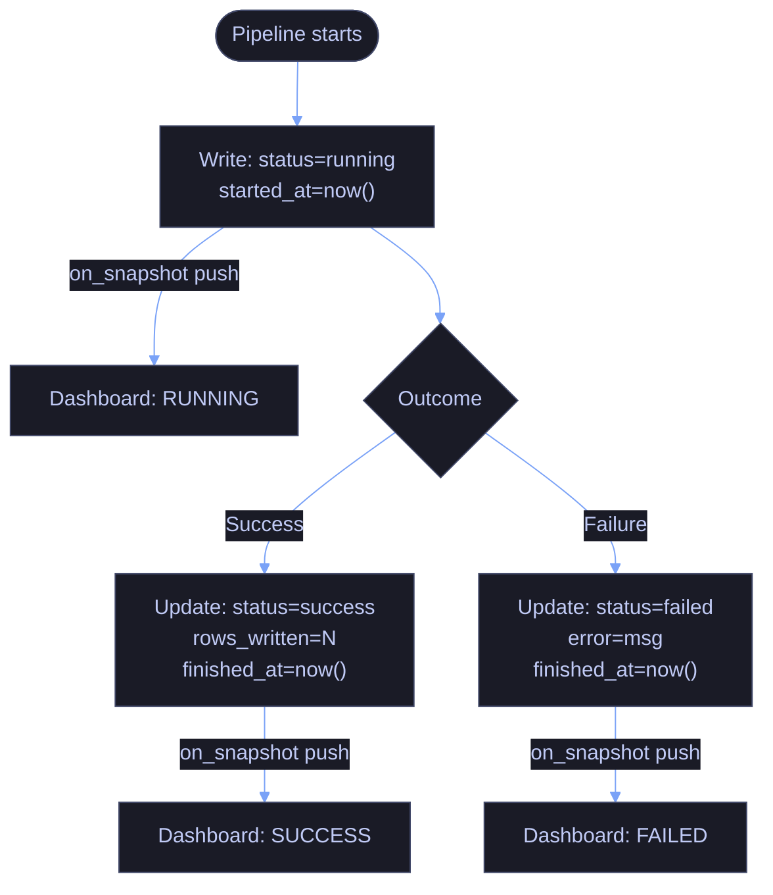
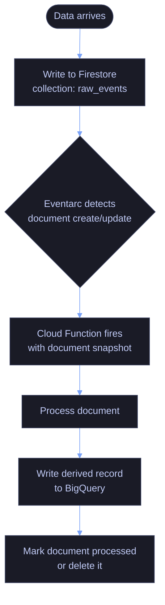
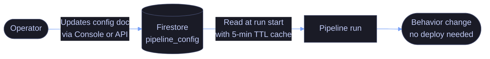
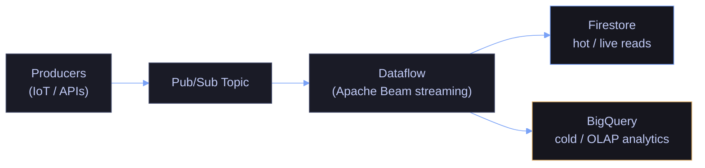

# Real-Time NoSQL Pipelines on GCP

> [!quote]
> "There are only two hard problems in distributed systems: 2. Exactly-once delivery 1. Guaranteed order of messages 2. Exactly-once delivery"
>
> — **Mathias Verraes**, conference talk (widely cited)

Firestore is a serverless, fully managed document database that occupies a specific niche in the GCP data stack: low-latency reads and writes, flexible schema, and native real-time listeners that push changes to clients without polling. This note covers how to use Firestore as the connective tissue of data pipelines — tracking state, reacting to events, driving configuration, and acting as a hot-tier store alongside BigQuery and Pub/Sub.

> [!tip] Scope
>
> This is not a Firestore CRUD tutorial. The focus is on **pipeline architecture patterns**: when Firestore earns its place, how to integrate it with other GCP services, and the full Python code required to do so production-ready.

> [!todo] Prerequisites
>
> - **APIs:** Enable `firestore.googleapis.com` and `eventarc.googleapis.com` (for trigger-based patterns)
> - **IAM:** `roles/datastore.user` for read/write; `roles/datastore.owner` for admin; `roles/datastore.importExportAdmin` for export operations
> - **Firestore mode:** This note assumes **Native mode**. Datastore mode is a separate compatibility layer with different API behaviour and CMEK support. The mode cannot be changed after database creation — verify before applying these patterns.
> - **SDK:** `google-cloud-firestore>=2.11` for Python; `apache-beam[gcp]` for the Dataflow patterns

---

## When to Use Real-Time NoSQL Pipelines

Choosing the right data service requires matching workload characteristics to service strengths. This section defines the latency tiers, identifies the scenarios where Firestore earns its place, and lists the cases where another GCP service is a better choice.

### Batch vs. Near-Real-Time vs. Real-Time

Understanding the latency expectations of each paradigm prevents overengineering and helps justify infrastructure choices to stakeholders.

| Paradigm | Typical Latency | Trigger Mechanism | Canonical GCP Stack |
|---|---|---|---|
| Batch | Minutes to hours | Scheduled (Cloud Scheduler, Airflow) | Cloud Storage → BigQuery |
| Near-real-time | 30 seconds to 5 minutes | Micro-batch, polling | Pub/Sub → Dataflow (fixed windows) |
| Real-time (streaming) | Sub-second to seconds | Event-driven, push | Pub/Sub → Dataflow (streaming) |
| Operational reads | < 10 ms | Client pull / server push | Firestore (direct read or listener) |

Most pipeline metadata use cases (dashboards, alerting, config) need **operational read latency**, not streaming throughput. This is where Firestore fits naturally.

> [!warning] Latency vs. Throughput
>
> Real-time latency does not mean high throughput. Firestore is optimized for low-latency access to individual documents and small query sets, not for scanning millions of rows per second. If you need both, use Firestore for hot operational data and BigQuery for the analytical layer.

> [!success] Use the Dual-Tier Pattern
>
> Write operational state to Firestore (hot path, <10ms reads) and stream aggregated or historical data to BigQuery (cold path, analytics). Dataflow or a Cloud Function bridges the two tiers, writing the same event to both destinations in parallel. See Pattern 4 in this note for the full architecture.

---

### Use Cases Where Firestore Fits

**Pipeline orchestration state — dashboards showing live pipeline progress**
When an Airflow DAG or Cloud Run job executes, it writes structured state documents to Firestore. A web dashboard subscribes via `on_snapshot()` or REST, showing current status without polling. This avoids the N+1 query problem against a relational metadata store.

**Feature stores for ML serving — low-latency feature lookup**
Precomputed features written asynchronously during batch jobs are read synchronously at inference time. Firestore delivers sub-10ms p99 on document reads with the right data model (one document per entity key). Related: [querying-and-cost-optimization](https://alp78.github.io/elysium/06-GCP/BigQuery/querying-and-cost-optimization) for BigQuery feature materialization patterns.

**Configuration management — change config, immediate effect**
A Firestore document holds operational parameters: quality thresholds, email recipients, feature flags, schedule overrides. Operators update the document; the next pipeline run reads the new values without a code deploy or restart.

**Operational metadata — alert states, SLA tracking, run history**
Alert deduplication state (has this alert already fired?), SLA countdown timers, and run history records are small documents with high write frequency and low read fan-out. Firestore's document model and strong consistency within a document make it suitable.

**IoT data ingestion — high write throughput, flexible schema**
Firestore handles ~1 write/second per document and up to 10,000 writes/second at the collection level (with appropriate sharding). Device telemetry with variable payloads maps well to the flexible document schema.

**Real-time serving layer**
Gold scores computed in BigQuery are written to Firestore (`stocks` collection) so dashboards can read them instantly with sub-10ms latency, instead of querying BigQuery every time (which costs money and takes seconds)

For Firestore querying patterns, composite index design, and cost-optimized query structures, see [Firestore Python queries](https://alp78.github.io/elysium/05-DB-Queries/Firestore/firestore-python) and [Firestore C# queries](https://alp78.github.io/elysium/05-DB-Queries/Firestore/firestore-csharp). For IaC provisioning of Firestore databases, indexes, and IAM bindings, see [Terraform data services](https://alp78.github.io/elysium/07-Terraform/Block-Library/tf-data-services).

---

### Use Cases Where Firestore Does NOT Fit

| Requirement | Problem with Firestore | Use Instead |
|---|---|---|
| Heavy analytics (aggregations, full scans) | No columnar storage, expensive per-read pricing for large result sets | [BigQuery](https://alp78.github.io/elysium/06-GCP/BigQuery/querying-and-cost-optimization) |
| High-throughput time-series (millions of writes/sec) | Per-document write limit (1/sec), collection-level limits | Bigtable |
| Complex joins and multi-table transactions | No joins; transactions limited to 500 documents | Cloud SQL / AlloyDB |
| Message queuing, fan-out, backpressure | No queue semantics, no dead-letter native support | [Pub/Sub](https://alp78.github.io/elysium/06-GCP/Serverless/pubsub-messaging) |
| Large blob storage | Documents capped at 1 MB | [Cloud Storage](https://alp78.github.io/elysium/06-GCP/Storage/gcs-buckets-and-lifecycle) |
| Relational integrity with foreign keys | No enforced referential integrity | Cloud SQL |

> [!danger] The Expensive Anti-Pattern
>
> Using Firestore as an analytics database — running `collection.stream()` over tens of thousands of documents to compute aggregations — generates enormous read costs with no performance advantage over a SQL query. Materialize aggregations into dedicated summary documents or export to BigQuery instead.

> [!success] Materialize Aggregations or Export to BigQuery
>
> For counts and sums, use Firestore's server-side `count()` / `sum()` aggregation queries — billed as a single read. For complex analytics, schedule a daily `gcloud firestore export` to GCS and load into BigQuery with `bq load --source_format=DATASTORE_BACKUP`. Never stream the full collection to Python just to aggregate.

---

## Architecture Patterns

Five canonical patterns for using Firestore in data pipelines, ordered by complexity. Each covers the data flow, implementation hooks, and trade-offs.

### Pattern 1: Firestore as Pipeline State Store

The pipeline writes a document at the start of execution and updates it on completion or failure. Dashboard subscribers receive server-push updates via `on_snapshot()` within milliseconds of each state change — no polling endpoint, no separate metadata database.



This pattern requires no polling endpoint, no separate metadata database, and no webhook infrastructure. The dashboard receives server-push updates within milliseconds of the state change.

#### Document path convention

Subcollections per pipeline name allow independent queries per pipeline without scanning all runs across the root collection.

```text
pipelines/{pipeline_name}/runs/{run_id}
```

#### Query recent failures

Returns the ten most recent failed runs for a given pipeline, ordered newest-first. Requires a composite index on `(status ASC, started_at DESC)`.

```python
db.collection("pipelines").document(pipeline_name).collection("runs") \
    .where("status", "==", "failed") \
    .order_by("started_at", direction=firestore.Query.DESCENDING) \
    .limit(10) \
    .stream()
```

> [!info] Index Requirements
> Ordering by a field while filtering on another requires a composite index in Firestore. Create it via `gcloud firestore indexes composite create` or the console. Firestore will surface an error with the index creation URL on the first failing query.

---

### Pattern 2: Event-Driven Processing with Firestore Triggers

Firestore document writes trigger Eventarc events, which invoke a Cloud Function. The function is only called when data exists to process, eliminating polling and idle compute. Requires `eventarc.googleapis.com` to be enabled.



This pattern eliminates polling entirely. The Cloud Function is only invoked when data exists to process. Related: [cloud-run-jobs-vs-services](https://alp78.github.io/elysium/06-GCP/Serverless/cloud-run-jobs-vs-services) for when a long-running service is preferable to a function.

#### Eventarc trigger configuration

Routes Firestore `document.created` events matching `raw_events/{event_id}` to the `event-processor` Cloud Run service. The service account must have `roles/eventarc.eventReceiver` and `roles/run.invoker`.

```bash
gcloud eventarc triggers create process-raw-events \
  --location=us-central1 \
  --destination-run-service=event-processor \
  --destination-run-region=us-central1 \
  --event-filters="type=google.cloud.firestore.document.v1.created" \
  --event-filters="database=(default)" \
  --event-filters-path-pattern="document=raw_events/{event_id}" \
  --service-account=pipeline-sa@PROJECT_ID.iam.gserviceaccount.com
```

```text
Created trigger [process-raw-events] in location [us-central1].
```

#### Retry and dead-letter pattern

Firestore triggers via Eventarc do not natively support dead-letter queues. Implement retry logic by adding a `retry_count` field to the document and updating it on each failed attempt. After `max_retries`, write the document to a `dead_letter` collection for manual review.

```python
MAX_RETRIES = 3

def process_event(event_data: dict, doc_ref) -> None:
    retry_count = event_data.get("retry_count", 0)
    try:
        _do_processing(event_data)
        doc_ref.update({"status": "processed", "processed_at": firestore.SERVER_TIMESTAMP})
    except Exception as exc:
        if retry_count >= MAX_RETRIES:
            # Move to dead letter
            db.collection("dead_letter").add({**event_data, "error": str(exc)})
            doc_ref.delete()
        else:
            doc_ref.update({"retry_count": retry_count + 1, "last_error": str(exc)})
        raise
```

---

### Pattern 3: Config-Driven Pipeline Behavior

Operational parameters live in a Firestore document rather than environment variables or code. Operators update the document; pipelines read the new values on their next run — no code deploy or pipeline restart required.



#### Config document structure

A canonical config document contains quality thresholds, notification recipients, feature flags, and schedule overrides. The `updated_by` and `updated_at` fields provide an operator audit trail without requiring Data Access audit logging.

```json
{
  "quality_threshold": 0.95,
  "max_null_rate": 0.02,
  "notification_emails": ["oncall@example.com"],
  "feature_flags": {
    "enable_dedup": true,
    "enable_schema_validation": false
  },
  "schedule_override": null,
  "updated_by": "operator@example.com",
  "updated_at": "2026-03-22T10:00:00Z"
}
```

#### Firestore security rules for config docs

Restricts reads to authenticated users with a company email domain, and writes to a defined list of authorized editors stored in the document itself. These rules apply to client-SDK access only; server-side SDK access using a service account bypasses them.

```text
rules_version = '2';
service cloud.firestore {
  match /databases/{database}/documents {
    match /pipeline_config/{configId} {
      allow read: if request.auth.token.email.matches('.*@example\\.com');
      allow write: if request.auth.token.email in resource.data.allowed_editors;
    }
  }
}
```

> [!tip] Cache Config With TTL
>
> Fetch config once at pipeline startup and cache it in memory. For long-running jobs, implement a TTL-based refresh (e.g., re-fetch every 5 minutes). This avoids a Firestore read on every loop iteration while still picking up config changes.

---

### Pattern 4: Firestore + Pub/Sub + Dataflow Streaming

Use this architecture when inbound throughput exceeds Firestore's direct write capacity, you need both real-time operational reads and historical analytics, and you want durable message buffering with backpressure handling. Pub/Sub acts as the ingestion buffer; Dataflow fans out to both stores in parallel.



**When NOT to use this pattern:** if you only need analytics (skip Firestore, write directly to BigQuery via Dataflow), or if you only need real-time reads with no analytics (skip Dataflow and BigQuery, write directly to Firestore from producers). Related: [pubsub-topics-and-subscriptions](https://alp78.github.io/elysium/06-GCP/Serverless/pubsub-topics-and-subscriptions) for topic and subscription configuration. See [streaming-architecture](https://alp78.github.io/elysium/14-Data-Architecture/Architectures/streaming-architecture) for windowing strategies and late data handling in Dataflow.

---

### Pattern 5: Change Data Capture from Firestore

Two approaches to propagating Firestore changes to downstream systems:

#### Scheduled export (low complexity, higher latency)

Exports specified collection groups to GCS in Firestore's native export format, then loads them into BigQuery. Typically run as a daily Cloud Scheduler job. Requires `roles/datastore.importExportAdmin` and write access to the target GCS bucket.

```bash
gcloud firestore export gs://BUCKET/exports/$(date +%Y-%m-%d) \
  --collection-ids=pipeline_runs,alert_states
```

```text
Exporting [gs://BUCKET/exports/2026-04-05]...done.
```

Load the exported backup into BigQuery using the `DATASTORE_BACKUP` source format. The path pattern targets the specific collection kind within the export directory.

```bash
bq load \
  --source_format=DATASTORE_BACKUP \
  --replace \
  analytics_dataset.pipeline_runs \
  gs://BUCKET/exports/2026-04-05/all_namespaces/kind_pipeline_runs/*
```

```text
Waiting on bqjob_r12345abcde_00000...  (3s) Current status: DONE
```

#### Real-time CDC via Python listener

Registers an `on_snapshot()` listener on the collection. On each change event, it classifies `ADDED` and `MODIFIED` documents, serializes them, and streams rows to BigQuery via the insert API. The listener process must stay alive — run it as a Cloud Run service with `min-instances=1`.

```python
def on_change(collection_snapshot, changes, read_time):
    rows = []
    for change in changes:
        if change.type.name in ("ADDED", "MODIFIED"):
            doc = change.document.to_dict()
            doc["_doc_id"] = change.document.id
            doc["_change_type"] = change.type.name
            doc["_read_time"] = read_time.isoformat()
            rows.append(doc)
    if rows:
        errors = bq_client.insert_rows_json(TABLE_REF, rows)
        if errors:
            logging.error("BigQuery insert errors: %s", errors)

col_ref = db.collection("pipeline_runs")
unsubscribe = col_ref.on_snapshot(on_change)
```

#### Comparison — scheduled export vs. real-time CDC

| Dimension | Scheduled Export | Real-Time CDC Listener |
|---|---|---|
| Latency | Hours (daily) to minutes (frequent) | Seconds |
| Complexity | Low — two CLI commands | Medium — persistent process required |
| Cost | GCS storage + BQ load job | Firestore read ops per change |
| Data loss risk | Low (export is atomic) | Medium (listener process must stay alive) |
| Replay capability | Easy (re-load from export) | Hard (need change log) |
| Best for | Audit, snapshot analytics | Operational dashboards, downstream triggers |

> [!warning] Listener Process Availability
>
> The real-time CDC listener is a long-running process. Run it on [Cloud Run (service)](https://alp78.github.io/elysium/06-GCP/Serverless/cloud-run-jobs-vs-services) with a health check, not as a one-shot job. Ensure it reconnects on transient Firestore errors.

> [!success] Deploy as a Cloud Run Service With Reconnect Logic
>
> Wrap the `on_snapshot()` call in a retry loop with exponential backoff. Set `min-instances=1` on the Cloud Run service to prevent cold starts that would miss changes. Add a `/healthz` endpoint that returns 200 only when the listener is active, and configure a Cloud Monitoring uptime check against it.

---

## Implementation: Complete Pipeline State Store

A self-contained Python module with an optional Airflow operator. Configure entirely via environment variables; no project-specific dependencies required. The Airflow operator is conditionally imported and silently skipped if Airflow is not installed.

### Python | FirestoreStateManager

The `FirestoreStateManager` class provides lifecycle methods (`start_run`, `complete_run`, `fail_run`, `skip_run`) and a `track_run()` context manager for automatic state tracking with no boilerplate at the call site.

```python
# pipeline_state.py
from __future__ import annotations

import logging
import os
import uuid
from contextlib import contextmanager
from datetime import datetime, timezone
from typing import Generator, Iterator, Optional

from google.cloud import firestore
from google.cloud.firestore_v1.base_query import FieldFilter

log = logging.getLogger(__name__)

_COLLECTION_ROOT = os.environ.get("FIRESTORE_STATE_COLLECTION", "pipelines")
_PROJECT_ID = os.environ.get("GCP_PROJECT_ID")


class FirestoreStateManager:
    """
    Manage pipeline execution state in Firestore.

    Document path: pipelines/{pipeline_name}/runs/{run_id}

    Each run document contains:
        status       : "running" | "success" | "failed" | "skipped"
        run_id       : str (UUID4)
        pipeline     : str
        started_at   : datetime (UTC)
        finished_at  : datetime (UTC) | None
        rows_written : int | None
        rows_read    : int | None
        error        : str | None
        metadata     : dict (arbitrary key-value pairs)
    """

    def __init__(self, pipeline_name: str, project: Optional[str] = None) -> None:
        self.pipeline_name = pipeline_name
        self._db = firestore.Client(project=project or _PROJECT_ID)
        self._runs_ref = (
            self._db.collection(_COLLECTION_ROOT)
            .document(pipeline_name)
            .collection("runs")
        )

    # ------------------------------------------------------------------
    # State write methods
    # ------------------------------------------------------------------

    def start_run(self, metadata: Optional[dict] = None) -> str:
        """
        Create a new run document with status=running.
        Returns the run_id (use this for subsequent updates).
        """
        run_id = str(uuid.uuid4())
        doc = {
            "run_id": run_id,
            "pipeline": self.pipeline_name,
            "status": "running",
            "started_at": firestore.SERVER_TIMESTAMP,
            "finished_at": None,
            "rows_written": None,
            "rows_read": None,
            "error": None,
            "metadata": metadata or {},
        }
        self._runs_ref.document(run_id).set(doc)
        log.info("Started run %s for pipeline %s", run_id, self.pipeline_name)
        return run_id

    def complete_run(
        self,
        run_id: str,
        rows_written: Optional[int] = None,
        rows_read: Optional[int] = None,
        metadata: Optional[dict] = None,
    ) -> None:
        """Mark a run as successfully completed."""
        update = {
            "status": "success",
            "finished_at": firestore.SERVER_TIMESTAMP,
            "rows_written": rows_written,
            "rows_read": rows_read,
        }
        if metadata:
            update["metadata"] = firestore.ArrayUnion([metadata])
        self._runs_ref.document(run_id).update(update)
        log.info(
            "Completed run %s for pipeline %s (rows_written=%s)",
            run_id,
            self.pipeline_name,
            rows_written,
        )

    def fail_run(self, run_id: str, error: str, metadata: Optional[dict] = None) -> None:
        """Mark a run as failed with an error message."""
        update = {
            "status": "failed",
            "finished_at": firestore.SERVER_TIMESTAMP,
            "error": error[:5000],  # Firestore string field limit is 1 MB; truncate defensively
        }
        if metadata:
            update["metadata"] = metadata
        self._runs_ref.document(run_id).update(update)
        log.error("Failed run %s for pipeline %s: %s", run_id, self.pipeline_name, error)

    def skip_run(self, run_id: str, reason: str) -> None:
        """Mark a run as skipped (e.g., no new data to process)."""
        self._runs_ref.document(run_id).update(
            {
                "status": "skipped",
                "finished_at": firestore.SERVER_TIMESTAMP,
                "error": reason,
            }
        )

    # ------------------------------------------------------------------
    # Query methods
    # ------------------------------------------------------------------

    def get_recent_runs(self, limit: int = 20) -> list[dict]:
        """Return the most recent runs (any status) for this pipeline."""
        docs = (
            self._runs_ref
            .order_by("started_at", direction=firestore.Query.DESCENDING)
            .limit(limit)
            .stream()
        )
        return [d.to_dict() for d in docs]

    def get_failures(self, limit: int = 10) -> list[dict]:
        """Return the most recent failed runs for this pipeline."""
        docs = (
            self._runs_ref
            .where(filter=FieldFilter("status", "==", "failed"))
            .order_by("started_at", direction=firestore.Query.DESCENDING)
            .limit(limit)
            .stream()
        )
        return [d.to_dict() for d in docs]

    def get_run(self, run_id: str) -> Optional[dict]:
        """Fetch a single run document by ID."""
        doc = self._runs_ref.document(run_id).get()
        return doc.to_dict() if doc.exists else None

    def get_last_success(self) -> Optional[dict]:
        """Return the most recent successful run, or None."""
        docs = (
            self._runs_ref
            .where(filter=FieldFilter("status", "==", "success"))
            .order_by("started_at", direction=firestore.Query.DESCENDING)
            .limit(1)
            .stream()
        )
        results = list(docs)
        return results[0].to_dict() if results else None

    def is_running(self) -> bool:
        """Return True if there is currently a run with status=running."""
        docs = (
            self._runs_ref
            .where(filter=FieldFilter("status", "==", "running"))
            .limit(1)
            .stream()
        )
        return len(list(docs)) > 0

    # ------------------------------------------------------------------
    # Context manager — automatic state tracking
    # ------------------------------------------------------------------

    @contextmanager
    def track_run(
        self,
        metadata: Optional[dict] = None,
    ) -> Generator[dict, None, None]:
        """
        Context manager that writes start/success/fail automatically.

        Usage:
            state_mgr = FirestoreStateManager("my_pipeline")
            with state_mgr.track_run(metadata={"env": "prod"}) as ctx:
                rows = do_work()
                ctx["rows_written"] = rows
        """
        run_id = self.start_run(metadata=metadata)
        ctx: dict = {"run_id": run_id, "rows_written": None, "rows_read": None}
        try:
            yield ctx
            self.complete_run(
                run_id,
                rows_written=ctx.get("rows_written"),
                rows_read=ctx.get("rows_read"),
            )
        except Exception as exc:
            self.fail_run(run_id, error=str(exc))
            raise


# ------------------------------------------------------------------
# Airflow integration — custom operator
# ------------------------------------------------------------------

try:
    from airflow.models import BaseOperator
    class FirestoreStateOperator(BaseOperator):
        """
        Airflow operator that wraps an arbitrary callable with
        Firestore state tracking.

        Example DAG usage:
            FirestoreStateOperator(
                task_id="run_pipeline",
                pipeline_name="my_pipeline",
                callable=my_pipeline_function,
                op_kwargs={"date": "{{ ds }}"},
            )
        """

        def __init__(
            self,
            pipeline_name: str,
            callable,
            op_kwargs: Optional[dict] = None,
            metadata: Optional[dict] = None,
            **kwargs,
        ) -> None:
            super().__init__(**kwargs)
            self.pipeline_name = pipeline_name
            self.callable = callable
            self.op_kwargs = op_kwargs or {}
            self.metadata = metadata or {}

        def execute(self, context):
            state_mgr = FirestoreStateManager(self.pipeline_name)
            airflow_meta = {
                "dag_id": context["dag"].dag_id,
                "run_id": context["run_id"],
                "execution_date": context["execution_date"].isoformat(),
            }
            with state_mgr.track_run(metadata={**self.metadata, **airflow_meta}) as ctx:
                result = self.callable(**self.op_kwargs)
                if isinstance(result, dict):
                    ctx.update(result)
            return ctx.get("run_id")

except ImportError:
    pass  # Airflow not installed; operator not available
```

For Airflow DAG patterns and custom operator composition, see [airflow-dag-patterns](https://alp78.github.io/elysium/12-Orchestration/Airflow/airflow-dag-patterns).

---

## Implementation: Firestore-Triggered Cloud Function

A second-generation Cloud Function triggered by Eventarc on Firestore document create or update events. Extracts fields from the Firestore proto payload, converts them to Python native types, and streams a row to BigQuery.

### Python | Cloud Function handler

```python
# main.py — Cloud Function triggered by Firestore document create/update
# Processes the incoming document and writes a derived record to BigQuery.

import json
import logging
import os
from typing import Any

import functions_framework
from cloudevents.http import CloudEvent
from google.cloud import bigquery
from google.events.cloud.firestore_v1.types import DocumentEventData

log = logging.getLogger(__name__)

_BQ_PROJECT = os.environ["BQ_PROJECT"]
_BQ_DATASET = os.environ["BQ_DATASET"]
_BQ_TABLE = os.environ["BQ_TABLE"]

bq_client = bigquery.Client(project=_BQ_PROJECT)
TABLE_REF = f"{_BQ_PROJECT}.{_BQ_DATASET}.{_BQ_TABLE}"


@functions_framework.cloud_event
def process_firestore_event(cloud_event: CloudEvent) -> None:
    """
    Fires on Firestore document create or update.
    Extracts fields, transforms them, and streams a row to BigQuery.
    """
    try:
        firestore_payload = DocumentEventData()
        firestore_payload._pb.MergeFromString(cloud_event.data)

        doc_name: str = firestore_payload.value.name
        doc_id = doc_name.split("/")[-1]

        # Convert Firestore proto fields to a plain dict
        fields = _proto_fields_to_dict(firestore_payload.value.fields)
        fields["_doc_id"] = doc_id
        fields["_event_type"] = cloud_event["type"].split(".")[-1]  # created / updated
        fields["_event_time"] = cloud_event["time"].isoformat()

        _write_to_bigquery(fields)
        log.info("Processed document %s → BigQuery", doc_id)

    except Exception as exc:
        log.exception("Failed to process Firestore event: %s", exc)
        # Re-raise so Eventarc retries (up to configured retry window)
        raise


def _proto_fields_to_dict(fields) -> dict:
    """Recursively convert Firestore proto fields to Python types."""
    result = {}
    for key, value in fields.items():
        vtype = value.WhichOneof("value_type")
        if vtype == "string_value":
            result[key] = value.string_value
        elif vtype == "integer_value":
            result[key] = value.integer_value
        elif vtype == "double_value":
            result[key] = value.double_value
        elif vtype == "boolean_value":
            result[key] = value.boolean_value
        elif vtype == "timestamp_value":
            result[key] = value.timestamp_value.ToDatetime().isoformat()
        elif vtype == "null_value":
            result[key] = None
        elif vtype == "map_value":
            result[key] = json.dumps(_proto_fields_to_dict(value.map_value.fields))
        elif vtype == "array_value":
            result[key] = json.dumps([str(v) for v in value.array_value.values])
        else:
            result[key] = str(value)
    return result


def _write_to_bigquery(row: dict) -> None:
    errors = bq_client.insert_rows_json(TABLE_REF, [row])
    if errors:
        raise RuntimeError(f"BigQuery streaming insert errors: {errors}")
```

#### Firestore Cloud Function — deploy command

Deploys the function as a second-generation Cloud Function with Eventarc trigger. Requires `cloudfunctions.googleapis.com`, `eventarc.googleapis.com`, and `run.googleapis.com` enabled. The service account needs `roles/eventarc.eventReceiver` and `roles/bigquery.dataEditor`.

```bash
gcloud functions deploy process-firestore-event \
  --gen2 \
  --runtime=python312 \
  --region=us-central1 \
  --source=. \
  --entry-point=process_firestore_event \
  --trigger-event-filters="type=google.cloud.firestore.document.v1.created" \
  --trigger-event-filters="database=(default)" \
  --trigger-event-filters-path-pattern="document=raw_events/{event_id}" \
  --trigger-location=us-central1 \
  --service-account=pipeline-sa@PROJECT_ID.iam.gserviceaccount.com \
  --set-env-vars="BQ_PROJECT=PROJECT_ID,BQ_DATASET=events,BQ_TABLE=raw_events_processed" \
  --max-instances=10 \
  --memory=512MB \
  --timeout=120s
```

> [!info] Gen2 Functions Use Eventarc Internally
> Second-generation Cloud Functions use Eventarc as the trigger mechanism. The `--trigger-event-filters-path-pattern` argument accepts Firestore document path patterns with `{wildcard}` segments.

---

## Implementation: Apache Beam Pipeline (Pub/Sub → Firestore + BigQuery)

Apache Beam streaming pipeline that reads from Pub/Sub and writes to Firestore (hot path) and BigQuery (cold path) in parallel.

### Python | Streaming pipeline

```python
# streaming_pipeline.py
import argparse
import json
import logging
from typing import Any

import apache_beam as beam
from apache_beam.options.pipeline_options import PipelineOptions, StandardOptions
from google.cloud import firestore as fs


class WriteToFirestore(beam.DoFn):
    """Write each element as a Firestore document."""

    def __init__(self, project: str, collection: str) -> None:
        self._project = project
        self._collection = collection
        self._db = None

    def setup(self):
        self._db = fs.Client(project=self._project)

    def process(self, element: dict):
        doc_id = element.get("id") or element.get("device_id") or "unknown"
        self._db.collection(self._collection).document(str(doc_id)).set(
            element, merge=True
        )
        yield element  # pass through for downstream steps if needed

    def teardown(self):
        if self._db:
            self._db.close()


def parse_message(message: bytes) -> dict:
    try:
        return json.loads(message)
    except json.JSONDecodeError:
        logging.warning("Invalid JSON message: %s", message[:200])
        return {}


def run(argv=None):
    parser = argparse.ArgumentParser()
    parser.add_argument("--input_topic", required=True)
    parser.add_argument("--bq_table", required=True)  # project:dataset.table
    parser.add_argument("--firestore_project", required=True)
    parser.add_argument("--firestore_collection", required=True)
    known_args, pipeline_args = parser.parse_known_args(argv)

    options = PipelineOptions(pipeline_args)
    options.view_as(StandardOptions).streaming = True

    with beam.Pipeline(options=options) as p:
        messages = (
            p
            | "ReadFromPubSub" >> beam.io.ReadFromPubSub(topic=known_args.input_topic)
            | "ParseJSON" >> beam.Map(parse_message)
            | "FilterEmpty" >> beam.Filter(lambda x: bool(x))
        )

        # Branch 1: write to Firestore (hot path, real-time reads)
        (
            messages
            | "WriteToFirestore"
            >> beam.ParDo(
                WriteToFirestore(
                    project=known_args.firestore_project,
                    collection=known_args.firestore_collection,
                )
            )
        )

        # Branch 2: window and write to BigQuery (cold path, analytics)
        (
            messages
            | "WindowIntoFixed"
            >> beam.WindowInto(beam.transforms.window.FixedWindows(60))  # 1-minute windows
            | "WriteToBigQuery"
            >> beam.io.WriteToBigQuery(
                known_args.bq_table,
                write_disposition=beam.io.BigQueryDisposition.WRITE_APPEND,
                create_disposition=beam.io.BigQueryDisposition.CREATE_NEVER,
            )
        )


if __name__ == "__main__":
    logging.basicConfig(level=logging.INFO)
    run()
```

#### Firestore + BigQuery Beam Pipeline — run on Dataflow

Submits the pipeline to Dataflow in streaming mode. The job runs continuously; cancel it with `gcloud dataflow jobs cancel JOB_ID` when done. The `--temp_location` bucket must exist and the Dataflow service account must have write access to it.

```bash
python streaming_pipeline.py \
  --runner=DataflowRunner \
  --project=PROJECT_ID \
  --region=us-central1 \
  --temp_location=gs://BUCKET/temp \
  --input_topic=projects/PROJECT_ID/topics/iot-events \
  --bq_table=PROJECT_ID:analytics.iot_events \
  --firestore_project=PROJECT_ID \
  --firestore_collection=device_state \
  --streaming
```

```text
INFO:apache_beam.runners.dataflow.dataflow_runner:Job [your-job-id] is running...
INFO:apache_beam.runners.dataflow.dataflow_runner:To access the Dataflow monitoring console, please navigate to https://console.cloud.google.com/dataflow/jobs/us-central1/your-job-id
```

> [!tip] Late Data Handling
>
> Add `--allow_late_data` or configure `beam.WindowInto` with `allowed_lateness` to handle messages that arrive after the window closes. For IoT use cases, a 30-second allowed lateness typically covers network delays without significantly increasing state size. See [streaming-architecture](https://alp78.github.io/elysium/14-Data-Architecture/Architectures/streaming-architecture) for watermark and trigger strategies.

---

## Monitoring and Observability

Firestore exposes operational metrics through Cloud Monitoring and optionally through Data Access audit logs. The sections below cover what to monitor, how to set alerts, and how to correlate Firestore activity with pipeline logs.

### Firestore Metrics in Cloud Monitoring

The following metrics are available under the `firestore.googleapis.com` namespace in [Cloud Monitoring](https://alp78.github.io/elysium/06-GCP/Logging/cloud-monitoring-metrics):

| Metric | Description | Alert Threshold |
|---|---|---|
| `document/read_count` | Total reads per second | Varies by use case |
| `document/write_count` | Total writes per second | Approach 10K/sec at collection level |
| `document/delete_count` | Total deletes per second | Monitor for runaway deletes |
| `api/request_latencies` | p50/p95/p99 read/write latency | p99 > 500ms warrants investigation |

#### Create an alert for elevated write rates

Creates an alerting policy that fires when the Firestore write rate exceeds 5,000 writes/second sustained over 60 seconds. Replace `CHANNEL_ID` with a notification channel ID from `gcloud beta monitoring channels list`.

```bash
gcloud monitoring policies create \
  --notification-channels=CHANNEL_ID \
  --display-name="Firestore High Write Rate" \
  --condition-display-name="Write count > 5000/sec" \
  --condition-filter='resource.type="firestore_instance" AND metric.type="firestore.googleapis.com/document/write_count"' \
  --condition-threshold-value=5000 \
  --condition-threshold-comparison=COMPARISON_GT \
  --condition-threshold-duration=60s
```

```text
Created alert policy [projects/PROJECT_ID/alertPolicies/POLICY_ID].
```

### Logging Firestore Operations

Firestore does not log individual document reads/writes to [Cloud Logging](https://alp78.github.io/elysium/06-GCP/Logging/cloud-logging) by default. Enable Data Access audit logs to capture them. Export the current IAM policy, add `auditLogConfigs` for `firestore.googleapis.com`, then re-apply it.

```bash
gcloud projects get-iam-policy PROJECT_ID --format=json > policy.json
```

Edit `policy.json` to add the following entry under `auditConfigs`:

```json
{
  "service": "firestore.googleapis.com",
  "auditLogConfigs": [
    {"logType": "DATA_READ"},
    {"logType": "DATA_WRITE"}
  ]
}
```

```bash
gcloud projects set-iam-policy PROJECT_ID policy.json
```

```text
Updated IAM policy for project [PROJECT_ID].
```

> [!warning] Audit Log Volume and Cost
>
> DATA_READ logs for Firestore can generate millions of log entries per day at scale. Filter aggressively with log-based metrics rather than exporting all audit logs to BigQuery.

> [!success] Use Log-Based Metrics and Targeted Sinks
>
> Create a log-based metric for `DATA_WRITE` audit events only, and set up a Cloud Monitoring alert on that metric. If you need audit data in BigQuery, create a log sink with a filter like `protoPayload.serviceName="firestore.googleapis.com" AND protoPayload.methodName:"Write"` — writes only, not reads — to keep volume manageable.

### Structured Logging From Pipeline Code

A `LoggerAdapter` subclass that injects pipeline and run context into every log message. Compatible with Cloud Logging's structured JSON format for log-based metrics and correlation.

```python
import logging
import json

class FirestoreOperationLogger(logging.LoggerAdapter):
    """Adds pipeline context to every Firestore operation log."""

    def process(self, msg, kwargs):
        extra = {
            "pipeline": self.extra.get("pipeline"),
            "run_id": self.extra.get("run_id"),
        }
        return f"{json.dumps(extra)} {msg}", kwargs
```

---

## Cost Optimization

Firestore bills per document operation and stored data volume, not by query complexity or compute time. Understanding the pricing model and applying the patterns below can reduce costs by an order of magnitude at scale.

### Firestore Pricing Summary

| Operation | Free Tier (per day) | Paid Rate |
|---|---|---|
| Document reads | 50,000 | $0.06 per 100,000 |
| Document writes | 20,000 | $0.18 per 100,000 |
| Document deletes | 20,000 | $0.02 per 100,000 |
| Stored data | 1 GiB | $0.18 per GiB/month |
| Network egress | 10 GiB/month | Standard GCP egress rates |

> [!tip] Generous Free Tier
>
> Free Tier Is Generous for State Tracking.
> A pipeline that runs hourly, writing 3 state updates per run (start / complete / fail) uses 72 writes per day — well within the 20,000 free writes. Firestore is effectively free for pure pipeline state tracking at this scale.

### Minimize Read Costs

Firestore charges per document read regardless of how many fields are accessed. Three strategies eliminate unnecessary reads: in-memory caching with TTL, batch reads with a single round-trip, and denormalization to avoid query fan-out.

#### Cache reads in memory with TTL

Stores the config document in a module-level dict with a timestamp. On cache hit within the TTL window, returns the cached value without a Firestore read. Resets on process restart — appropriate for config that changes infrequently.

```python
import time
from functools import lru_cache

_CONFIG_CACHE: dict = {}
_CONFIG_TTL = 300  # 5 minutes

def get_pipeline_config(pipeline_name: str, db) -> dict:
    cache_key = pipeline_name
    cached = _CONFIG_CACHE.get(cache_key)
    if cached and time.time() - cached["fetched_at"] < _CONFIG_TTL:
        return cached["data"]
    doc = db.collection("pipeline_config").document(pipeline_name).get()
    data = doc.to_dict() or {}
    _CONFIG_CACHE[cache_key] = {"data": data, "fetched_at": time.time()}
    return data
```

#### Batch reads with `get_all()`

Fetches multiple documents in a single RPC call. Each document still counts as one read operation for billing, but network round-trips are reduced to one.

```python
doc_refs = [db.collection("pipeline_config").document(name) for name in pipeline_names]
docs = db.get_all(doc_refs)
configs = {doc.id: doc.to_dict() for doc in docs if doc.exists}
```

#### Denormalize to avoid collection scans

Rather than querying a subcollection to find the current status, maintain a summary document at `pipelines/{pipeline_name}` that is updated on each state transition. Dashboard reads hit one document, not a query.

### Minimize Write Costs

Two main strategies: batch writes to reduce network round-trips, and debouncing high-frequency counters to reduce the total operation count.

#### Batch writes — up to 500 operations per batch

Groups up to 500 set/update/delete operations into a single committed transaction. One network round-trip; each operation still counts as a separate write for billing purposes.

```python
batch = db.batch()
for run in completed_runs:
    ref = db.collection("pipeline_archive").document(run["run_id"])
    batch.set(ref, run)
batch.commit()  # One network round-trip, counts as N write operations
```

#### Debounce frequent updates

For metrics that update every second (e.g., rows processed counter), debounce writes to every 10 seconds. Use an in-memory accumulator and flush on a timer or at completion.

### TTL Policies — Auto-Delete Old Documents

Firestore TTL policies automatically delete documents after a specified field's timestamp passes. No Cloud Function or scheduled job required.

```bash
gcloud firestore fields ttls update expires_at \
  --collection-group=runs \
  --enable-ttl
```

```text
Updated field [expires_at].
```

#### Set the expiry field when writing

```python
from datetime import timedelta

doc["expires_at"] = datetime.now(timezone.utc) + timedelta(days=90)
db.collection("pipelines").document(name).collection("runs").document(run_id).set(doc)
```

> [!info] TTL Deletion Latency
> TTL deletions are not instant. Documents may persist for up to 24 hours beyond their `expires_at` timestamp. Do not use TTL for security-sensitive deletion — use explicit deletes for those.

### Cost Comparison: Firestore vs. Alternatives

| Scenario | Firestore | BigQuery Streaming | Pub/Sub |
|---|---|---|---|
| 1M state writes/day | $1.80 | $0.01 (streaming inserts) | ~$0.04 |
| 1M reads/day | $0.60 | N/A (query cost) | N/A |
| Real-time push to clients | Native (`on_snapshot`) | Not supported | Requires Dataflow |
| Ad-hoc query | Supported (indexed only) | Full SQL | Not supported |
| Best for | Operational reads/writes | Analytics | Message delivery |

For pure analytics with no real-time read requirement, [BigQuery streaming inserts](https://alp78.github.io/elysium/06-GCP/BigQuery/data-loading-and-export) are cheaper than Firestore writes. Use Firestore only when the real-time listener or low-latency lookup justifies the cost.

---

## Security

Access control for Firestore pipelines spans three layers: service account identity, IAM role bindings, and optionally VPC Service Controls for network-level perimeters. All production access should be server-to-server using dedicated service accounts.

### Service Account Authentication

All server-to-server Firestore access should use dedicated service accounts — never user credentials or default compute service accounts in production. See [service-accounts-and-iam](https://alp78.github.io/elysium/06-GCP/Security/service-accounts-and-iam) for service account creation and key management.

```bash
gcloud iam service-accounts create pipeline-state-writer \
  --display-name="Pipeline State Writer" \
  --description="Writes pipeline execution state to Firestore"
```

```text
Created service account [pipeline-state-writer].
```

Grant the Firestore user role (`roles/datastore.user`), which allows reading and writing documents but excludes administrative operations.

```bash
gcloud projects add-iam-policy-binding PROJECT_ID \
  --member="serviceAccount:pipeline-state-writer@PROJECT_ID.iam.gserviceaccount.com" \
  --role="roles/datastore.user"
```

```text
Updated IAM policy for project [PROJECT_ID].
```

#### Activate credentials in application code

Explicit key file loading is shown for local development only. Do not use this pattern in production.

> [!danger] Never load SA key files in production
>
> A service account key file is a long-lived credential. If stored on disk, bundled in a container image, or committed to source control, it becomes a persistent exfiltration risk that survives the service it authenticates.

> [!success] Use Application Default Credentials or Workload Identity instead
>
> On Cloud Run, GKE, or any GCP compute resource, omit credentials entirely — the client library picks up ADC from the metadata server automatically. For cross-cloud or on-premises use cases, configure Workload Identity Federation. See [service-accounts-and-iam](https://alp78.github.io/elysium/06-GCP/Security/service-accounts-and-iam).

```python
from google.oauth2 import service_account
from google.cloud import firestore

credentials = service_account.Credentials.from_service_account_file(
    "/path/to/sa-key.json",
    scopes=["https://www.googleapis.com/auth/datastore"],
)
db = firestore.Client(project="PROJECT_ID", credentials=credentials)
```

On Cloud Run or GKE with Workload Identity, omit the explicit credentials — the client library picks them up from the metadata server automatically.

### IAM Roles

| Role | Access Level | Use Case |
|---|---|---|
| `roles/datastore.owner` | Full control including admin | Terraform / infra provisioning only |
| `roles/datastore.user` | Read + write documents | Pipeline workers, Cloud Functions |
| `roles/datastore.viewer` | Read-only | Dashboard services, monitoring |
| `roles/datastore.importExportAdmin` | Run export/import jobs | Export-to-BigQuery pipelines |

> [!tip] Principle of Least Privilege
>
> Dashboard services that only display state should receive `roles/datastore.viewer`. Pipeline workers that write state should receive `roles/datastore.user`. Never assign `roles/datastore.owner` to runtime service accounts.

### VPC Service Controls

Firestore can be included in a VPC Service Control perimeter to prevent data exfiltration. See [vpc-service-controls](https://alp78.github.io/elysium/06-GCP/Security/vpc-service-controls) for perimeter configuration. When Firestore is inside a VPC-SC perimeter, access from outside the perimeter (including developer workstations) requires an access policy with appropriate access levels.

```bash
gcloud access-context-manager perimeters update PERIMETER_NAME \
  --add-restricted-services=firestore.googleapis.com
```

```text
Updated servicePerimeter [PERIMETER_NAME].
```

> [!warning] VPC-SC and Cloud Functions
>
> If Firestore is in a VPC-SC perimeter and a Cloud Function writes to it, the function's service account must be inside the perimeter's access policy. Misconfiguration results in `PERMISSION_DENIED` errors that can be difficult to distinguish from IAM errors.

> [!success] Add the Function's SA to the VPC-SC Ingress Policy
>
> Create an ingress rule in the VPC-SC perimeter that allows `FROM serviceAccount:FUNCTION_SA_EMAIL` to access `firestore.googleapis.com`. Verify by checking Cloud Audit Logs for `"VPC Service Controls"` denials — they appear under `protoPayload.status.code=7` in Cloud Logging.

### Data Encryption

Firestore encrypts all data at rest automatically using AES-256 and in transit using TLS 1.2+. No configuration is required. For Customer-Managed Encryption Keys (CMEK), Firestore in Datastore mode supports CMEK; Firestore in Native mode CMEK support is region-dependent — verify in the GCP documentation for your region before committing to a CMEK requirement.

---

## Operational Runbook

Step-by-step diagnostic guides for common Firestore operational issues in pipeline contexts.

### Diagnosing Slow Writes

1. Check `firestore.googleapis.com/api/request_latencies` in [Cloud Monitoring](https://alp78.github.io/elysium/06-GCP/Logging/cloud-monitoring-metrics) — filter by method `BatchWrite` or `Commit`.
2. Verify you are not hitting the per-document write limit (1 write/second per document). If so, shard hot documents by appending a random suffix to the document ID and aggregating reads.
3. Check if composite indexes are being built — writes are throttled during index backfill.

### Diagnosing Missing Documents

1. Verify the write succeeded — check for exceptions in application logs via [Cloud Logging](https://alp78.github.io/elysium/06-GCP/Logging/cloud-logging).
2. Check TTL policy — document may have been deleted by TTL.
3. Verify the document path — Firestore is case-sensitive and path-exact.
4. Check security rules if using client-side SDKs.

### Recovering From a Bad State Write

If a pipeline crashes mid-run, its document may be stuck at `status=running`. Use the snippet below from the Python REPL or a one-off recovery script to force it to a terminal state.

```python
db = firestore.Client(project="PROJECT_ID")
db.collection("pipelines") \
  .document("my_pipeline") \
  .collection("runs") \
  .document("RUN_ID") \
  .update({
      "status": "failed",
      "error": "Manually marked failed during incident recovery",
      "finished_at": firestore.SERVER_TIMESTAMP,
  })
```

---

## Quick-Reference Cheatsheet

Common Firestore client library operations for Python. All examples use the synchronous client (`google.cloud.firestore`). For async usage, import `google.cloud.firestore_async` instead.

### Python | Common operations

```python
from google.cloud import firestore

db = firestore.Client()

# Write (set)
db.collection("col").document("doc_id").set({"field": "value"})

# Write (merge — don't overwrite existing fields)
db.collection("col").document("doc_id").set({"field": "value"}, merge=True)

# Update specific fields
db.collection("col").document("doc_id").update({"field": "new_value"})

# Server timestamp
db.collection("col").document("doc_id").update({"updated_at": firestore.SERVER_TIMESTAMP})

# Read single document
doc = db.collection("col").document("doc_id").get()
data = doc.to_dict() if doc.exists else None

# Query with filter and ordering
docs = (
    db.collection("col")
    .where("status", "==", "failed")
    .order_by("started_at", direction=firestore.Query.DESCENDING)
    .limit(10)
    .stream()
)
results = [d.to_dict() for d in docs]

# Batch write (up to 500 ops)
batch = db.batch()
batch.set(db.collection("col").document("a"), {"x": 1})
batch.update(db.collection("col").document("b"), {"x": 2})
batch.delete(db.collection("col").document("c"))
batch.commit()

# Real-time listener
def callback(col_snapshot, changes, read_time):
    for change in changes:
        print(change.type.name, change.document.to_dict())

unsubscribe = db.collection("col").on_snapshot(callback)
# Call unsubscribe() to stop listening

# Atomic increment
db.collection("col").document("doc_id").update(
    {"counter": firestore.Increment(1)}
)

# Delete a field
db.collection("col").document("doc_id").update(
    {"obsolete_field": firestore.DELETE_FIELD}
)

# Transaction (read-modify-write atomically)
@db.transaction()
def update_in_transaction(transaction, doc_ref):
    snapshot = doc_ref.get(transaction=transaction)
    current = snapshot.to_dict()
    transaction.update(doc_ref, {"count": current["count"] + 1})

update_in_transaction(db.collection("col").document("doc_id"))
```
