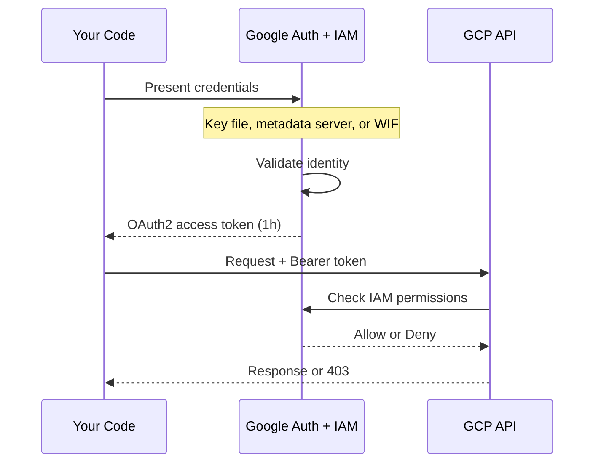
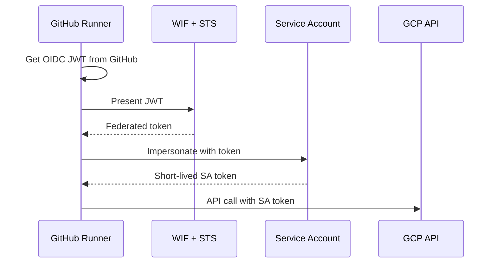

# GCP Identity and Connection Patterns

This page is the **conceptual framework** for GCP security. It explains the identity model, credential types, authentication methods, and connection patterns across the entire stack — then links to the specific heading where each implementation lives. Start here to understand the WHY and WHEN; follow the links for the HOW.

---

## The GCP Identity Model

### Human vs Machine Identity — who is calling the API

> [!info] Two Types of Identity
>
> Every GCP API call is made by an identity. GCP recognizes two kinds: human users (interactive) and service accounts (machine). Choosing the wrong one for your context creates security gaps or operational friction.

| Identity Type | Format | Created By | Used For |
|---------------|--------|------------|----------|
| **User account** | `user@gmail.com`, `user@corp.com` | Google Workspace or Cloud Identity | Interactive gcloud CLI, console, local development |
| **Service account** | `sa-name@project.iam.gserviceaccount.com` | `gcloud iam service-accounts create` | Pipelines, VMs, Cloud Run, CI/CD — anything automated |

- **User accounts** are for humans sitting at a keyboard. They authenticate via browser-based OAuth2 flows
- **Service accounts** are for machines. They authenticate via key files, metadata server tokens, or Workload Identity Federation
- **Rule:** production workloads always use service accounts, never user accounts. One SA per workload, not one SA for everything

For SA creation and IAM binding commands, see [[service-accounts-and-iam#GCP Service Accounts — Machine Identities]]. For the Terraform pattern of one SA per workload, see [[terraform-iam-and-secrets#Design Principle: One Service Account Per Workload]].

### Credential Types — Short-Lived vs Long-Lived

> [!info]- Credential Comparison Table
>
> Each credential type has a different lifetime, risk profile, and use case. Short-lived credentials are always preferred — they limit the blast radius of a leak.

| Credential | Lifetime | Revocable | Risk if Leaked | Use Case |
|------------|----------|-----------|----------------|----------|
| OAuth2 access token | 1 hour | Auto-expires | Low — usable for 1 hour max | Standard API calls (Python, C#, gcloud) |
| OAuth2 refresh token | Until revoked | Yes (`gcloud auth revoke`) | Medium — can mint new access tokens | Local dev (`gcloud auth login`) |
| SA key file (JSON) | **Never expires** | Must delete the key | **Critical** — full SA access until deleted | Last resort for local dev; never in production |
| Metadata server token | 1 hour, auto-refreshed | N/A (VM-scoped) | Low — never leaves the VM | VMs, Cloud Run — the production standard |
| WIF federated token | Minutes | Auto-expires | Very low — scoped to one CI run | GitHub Actions, cross-cloud, external IdPs |
| OIDC ID token | 1 hour | Auto-expires | Low — audience-scoped | Service-to-service auth (Cloud Run invoker) |

> [!danger] SA Key Files Are Permanent Liabilities
>
> A leaked SA key file grants full access to that service account's permissions **forever** — until someone notices and deletes the key. There is no expiry. Key files are the #1 cause of GCP security incidents. Use metadata server tokens (on VMs/Cloud Run) or WIF (in CI/CD) instead.

### The OAuth2 Token Flow — What Actually Happens

When Python code calls BigQuery, this is the full sequence of events behind the scenes:

- **Step 1-3:** Authentication — "who are you?" The credential source proves identity to Google STS
- **Step 4-5:** Token issuance — STS issues a short-lived OAuth2 access token
- **Step 6-8:** Authorization — IAM evaluates whether this identity has the requested permission on the target resource
- **Step 9:** Network controls — VPC-SC may block even authorized requests if the data would cross a perimeter boundary

### Authentication vs Authorization vs Network Controls

> [!tip] Three Layers of Security
>
> GCP security is not one thing — it's three orthogonal layers. A request must pass all three to succeed.

| Layer | Question | Mechanism | Vault Reference |
|-------|----------|-----------|-----------------|
| **Authentication** | Who are you? | OAuth2 tokens, key files, WIF | [[gcloud-authentication#How GCP Authentication Works]] |
| **Authorization** | What can you do? | IAM roles and bindings | [[service-accounts-and-iam#IAM Bindings — Granting Roles to Service Accounts]] |
| **Network control** | Where can data flow? | VPC-SC perimeters, firewalls | [[vpc-service-controls#The Data Exfiltration Threat Model]] |

A service account with `roles/bigquery.dataViewer` (authorized) can still be blocked by VPC-SC if it tries to copy data out of a protected perimeter. IAM says "yes"; VPC-SC says "no". Both must agree.

### Application Default Credentials — The Search Order

ADC is the mechanism that answers "which credential should my code use?" without hardcoding anything. The client libraries (Python `google-auth`, C# `GoogleCredential`) search these locations in order:

| Priority | Source | Set By | Typical Environment |
|----------|--------|--------|---------------------|
| 1 | `GOOGLE_APPLICATION_CREDENTIALS` env var | Developer or deployment script | Local dev with key file |
| 2 | ADC user credentials | `gcloud auth application-default login` | Local dev without key file |
| 3 | GCE metadata server | Automatic on Compute Engine | VMs, Cloud Run (production) |
| 4 | GKE Workload Identity | Kubernetes SA annotation | GKE pods |

> [!warning] ADC Finds the Wrong Credential
>
> If `GOOGLE_APPLICATION_CREDENTIALS` points to a stale key file from an old project, ADC uses that key even when you're on a VM with a perfectly good metadata server token. ADC stops at the first match — it does not pick the "best" one. Unset the env var on VMs: `unset GOOGLE_APPLICATION_CREDENTIALS`.

For the gcloud reference, see [[gcloud-authentication#The ADC Credential Search Order]]. For the Python ADC lookup implementation, see [[21_py_security_operations#google.auth.default — Application Default Credentials (ADC) lookup chain]]. For C#, see [[21_cs_security_operations#Application Default Credentials (ADC) lookup chain]].

---

## Authentication Methods — Complete Framework

### Metadata Server (GCE VMs, Cloud Run) — the production standard

> [!info] How the Metadata Server Works
>
> Every GCE VM and Cloud Run instance has access to a local metadata server at `169.254.169.254`. The VM's attached service account is the identity. Code calls the metadata server, gets a short-lived token, and uses it — no credentials to manage, rotate, or leak.

- **No credentials on disk:** the token is fetched over a local HTTP call to `169.254.169.254` — it never leaves the VM
- **Auto-refreshed:** the client libraries automatically refresh the token before it expires (every ~55 minutes)
- **Scopes:** must be set at VM creation time. Cannot expand scopes without stopping the VM

> [!warning] VM Scopes Are Set at Creation
>
> If the VM was created with `--scopes=compute-ro`, the metadata server token only works for Compute Engine read operations — even if the attached SA has broader IAM roles. Use `--scopes=cloud-platform` (all APIs) unless you have a specific reason to restrict.

- Python implementation: [[21_py_security_operations#VM instance identity — metadata server credentials]]
- SA attachment to VM: [[service-accounts-and-iam#ADC and the GCE Metadata Server]]

### Workload Identity Federation (WIF) — keyless external identity

> [!info] WIF Trust Chain
>
> WIF lets external identity providers (GitHub Actions, AWS, Azure AD) authenticate to GCP without a service account key file. The external provider issues a token, Google STS exchanges it for a short-lived GCP access token.

- **No key file ever exists.** The GitHub runner gets a JWT from GitHub's OIDC provider, exchanges it at Google STS, and gets a short-lived token. The token lives for minutes and is scoped to one CI run
- **When to use:** CI/CD (GitHub Actions), cross-cloud workloads, any external identity system
- **WIF vs key file:** key files are permanent liabilities; WIF tokens live for minutes. Always prefer WIF

- Pool and provider creation: [[20_py_security_setup#Workload Identity Federation]]
- GitHub Actions usage: [[secrets-management#GitHub Actions — Workload Identity Federation (Keyless)]]
- Python OIDC flow: [[21_py_security_operations#Workload Identity Federation — GitHub Actions OIDC flow]]

### Service Account Impersonation — temporary privilege escalation

> [!info] Impersonation Model
>
> Identity A temporarily assumes identity B's permissions. No key file is created — A gets a short-lived token that acts as B. Requires `roles/iam.serviceAccountTokenCreator` on the target SA.

- **Use case:** developer testing "what can the pipeline SA do?" without holding its key file
- **Use case:** least-privilege delegation — a CI SA impersonates a deploy SA only during the deployment step
- **Audit trail:** every impersonation is logged in Cloud Audit Logs with both the caller and the impersonated identity — full accountability chain

- Python implementation: [[21_py_security_operations#Service account impersonation — keyless authentication]]
- C# implementation: [[21_cs_security_operations#Service account impersonation — keyless authentication]]
- Short-lived token generation: [[21_py_security_operations#google-cloud-iam-credentials — generate short-lived OAuth2 access tokens]]

### Service Account Key Files — last resort only

> [!danger] Key Files Never Expire
>
> A downloaded JSON key file grants full access to the service account's permissions with no expiration. If it leaks to a git repo, a log file, or a shared drive, the attacker has permanent access until someone manually deletes the key.

- **When justified:** local development against GCP APIs where `gcloud auth application-default login` isn't sufficient (rare — e.g., testing impersonation flows)
- **The rule:** if you can use metadata server or WIF, you must. Key files are the absolute last resort

- Key creation: [[service-accounts-and-iam#Service Account Key Files — Local Development Only]]
- Key rotation procedure: [[secrets-management#Service Account Keys]]
- Python key file auth: [[21_py_security_operations#google-auth Credentials.from_service_account_file — key file authentication]]
- C# key file auth: [[21_cs_security_operations#GoogleCredential.FromFile — service account key file authentication]]

### Application Default Credentials — interactive local dev

> [!info] The Two-Login Confusion
>
> `gcloud auth login` and `gcloud auth application-default login` are two different commands that set two different credential stores. Confusing them is the most common GCP authentication mistake.

| Command | What It Sets | Who Uses It |
|---------|-------------|-------------|
| `gcloud auth login` | Credentials for the **gcloud CLI tool itself** | gcloud commands, gsutil, bq |
| `gcloud auth application-default login` | Credentials for **your application code** (Python, C#, Go) | Client libraries via ADC |

> [!warning] The Common Mistake
>
> Running `gcloud auth login` and then wondering why `bigquery.Client()` in Python gets "permission denied." Python doesn't use gcloud's CLI credentials — it uses ADC. You need `gcloud auth application-default login` separately.

- `gcloud auth login`: [[gcloud-authentication#gcloud auth login — interactive authentication for human users]]
- `gcloud auth application-default login`: [[gcloud-authentication#gcloud auth application-default login — ADC for application code]]

---

## Connection Patterns by Scenario

Every source→destination pair in the stack, with the complete trust chain, required IAM roles, network path, and links to implementation.

### Workstation → SQL Server (private VM, no public IP)

> [!info] Three-Layer Auth Pattern
>
> This is a two-layer authentication: GCP identity (IAP) authenticates you to the tunnel, then SQL Server identity (sa/password) authenticates you to the database. The IAP tunnel encrypts transport — no public IP exposure.

**Trust chain:** `gcloud credentials → IAP proxy (OAuth2) → IAP tunnel (HTTPS/443) → GCP internal network → VM port 1433 → SQL Server auth (login/password)`

| Requirement | Value |
|-------------|-------|
| IAM role | `roles/iap.tunnelResourceAccessor` on the VM |
| Firewall | Allow `35.235.240.0/20` on TCP 22 and 1433 |
| SQL Server auth | Login + password (from Secret Manager) |
| TLS note | SQL Server self-signed cert → `TrustServerCertificate=yes` (acceptable because IAP encrypts transport) |

- Open tunnel: [[iap-tunneling#gcloud compute start-iap-tunnel — port forwarding through IAP]]
- How IAP works: [[iap-tunneling#How IAP tunneling works — the full network path from workstation to VM]]
- Connect via sqlcmd: [[connecting-to-gcp-resources#gcloud start-iap-tunnel + sqlcmd — SQL Server via IAP (Linux)]]
- Connect via Python: [[connecting-to-gcp-resources#pymssql — SQL Server through IAP tunnel (Python)]]
- Connect via SSMS: [[connecting-to-gcp-resources#Invoke-Sqlcmd / SSMS — SQL Server through IAP tunnel (PowerShell)]]

> [!warning] Common Mistake
>
> Forgetting the IAP firewall rule. The tunnel command hangs silently if the VM's firewall doesn't allow traffic from Google's IAP IP range `35.235.240.0/20`.

### Airflow VM → SQL Server VM (same VPC)

**Trust chain:** `Airflow VM → direct TCP over VPC private network → VM port 1433 → SQL Server auth (login/password)`

| Requirement | Value |
|-------------|-------|
| IAM role | None (VPC-internal, no IAP) |
| Network | Same VPC, private IPs are directly routable |
| Credential source | SA_PASSWORD from Secret Manager → Airflow Connection |

- Secret Manager in Airflow: [[secrets-management#Airflow Connections Backed by Secret Manager]]

> [!warning] Common Mistake
>
> Using an IAP tunnel between VMs in the same VPC. IAP adds latency and complexity when the VMs can already communicate directly over private IPs. Only use IAP when crossing a network boundary (e.g., workstation → cloud).

### Python/C# → BigQuery (serverless API)

**Trust chain:** `ADC or metadata server → OAuth2 access token → BigQuery API over HTTPS (port 443)`

| Requirement | Value |
|-------------|-------|
| IAM role | `roles/bigquery.dataViewer` (read) or `roles/bigquery.dataEditor` (write) |
| Network | Public Google API — no tunnel, no port, no firewall |
| VPC-SC | May restrict which projects can query (if configured) |

- Python: [[connecting-to-gcp-resources#google-cloud-bigquery Client — BigQuery queries (Python)]]
- Python lab (with SA auth): [[21_py_security_operations#google-cloud-bigquery Client — query with service account credentials]]
- C# lab: [[21_cs_security_operations#BigQueryClient — query with service account credentials]]
- VPC-SC restrictions: [[vpc-service-controls]]

> [!warning] Common Mistake
>
> Granting `roles/bigquery.admin` when the pipeline only reads data. Use `roles/bigquery.dataViewer` for read-only access. See [[service-accounts-and-iam#Minimum IAM Permission Set for a Data Pipeline]] for the minimum role set.

### Python/C# → Firestore (serverless API)

**Trust chain:** `ADC or metadata server → OAuth2 access token → Firestore API over HTTPS`

| Requirement | Value |
|-------------|-------|
| IAM role | `roles/datastore.user` (read/write documents) |
| Network | Public Google API — no tunnel |

- Python lab: [[21_py_security_operations#google-cloud-firestore Client — read documents with SA credentials]]
- C# lab: [[21_cs_security_operations#FirestoreDb — read and write documents with SA credentials]]
- Firestore IAM vs security rules: [[firestore-data-model-and-operations]]

### Python/C# → Cloud Storage (serverless API)

**Trust chain:** `ADC or metadata server → OAuth2 access token → GCS API over HTTPS`

| Requirement | Value |
|-------------|-------|
| IAM role | `roles/storage.objectViewer` (read) or `roles/storage.objectAdmin` (full) |
| Per-bucket IAM | Grant on specific buckets, not project-wide |
| KMS-encrypted objects | CMEK or CSEK — transparent to readers with KMS access |

- Minimum roles: [[service-accounts-and-iam#Minimum IAM Permission Set for a Data Pipeline]]
- KMS encryption: [[21_py_security_operations#google-cloud-kms encrypt — symmetric encryption of plaintext]]

### Python/C# → Secret Manager (serverless API)

**Trust chain:** `ADC or metadata server → OAuth2 access token → Secret Manager API`

| Requirement | Value |
|-------------|-------|
| IAM role | `roles/secretmanager.secretAccessor` (read secret values) |
| Per-secret IAM | Bind accessor role on individual secrets, not project-wide |

- IAM bindings: [[secrets-management#IAM for Secrets]]
- Python code: [[secrets-management#Access from Python]]
- Python lab: [[21_py_security_operations#google-cloud-secret-manager access_secret_version — read secrets]]

### Cloud Run → SQL Server (cross-service, same VPC)

**Trust chain:** `Cloud Run's attached SA → VPC connector → private IP → SQL Server port 1433 → SQL auth (login/password)`

| Requirement | Value |
|-------------|-------|
| IAM role | None for network (VPC connector handles routing) |
| Network | Serverless VPC Access connector (or Direct VPC Egress) |
| Credential source | SA password from Secret Manager, fetched at container startup |

- Cloud Run configuration: [[cloud-run-jobs-vs-services]]

> [!warning] Common Mistake
>
> Forgetting the VPC connector. Cloud Run is serverless — it does not live in your VPC by default. Without a connector, Cloud Run cannot reach private IPs. Configure a Serverless VPC Access connector or enable Direct VPC Egress.

### GitHub Actions → GCP (external, WIF)

**Trust chain:** `GitHub OIDC token → WIF pool/provider → STS token exchange → short-lived GCP access token → GCP APIs`

| Requirement | Value |
|-------------|-------|
| IAM role | `roles/iam.workloadIdentityUser` on the target SA |
| WIF pool/provider | Configured for the GitHub repo |
| Key file | **None** — this is the entire point of WIF |

- WIF pool setup: [[20_py_security_setup#Workload Identity Federation]]
- GitHub Actions workflow: [[secrets-management#GitHub Actions — Workload Identity Federation (Keyless)]]
- Python OIDC flow: [[21_py_security_operations#Workload Identity Federation — GitHub Actions OIDC flow]]

### GitHub Actions → SQL Server (WIF + IAP)

**Trust chain:** `GitHub OIDC → WIF → GCP token → gcloud IAP tunnel → SQL Server auth (login/password)`

This is the most complex pattern in the stack — three layers of auth: GitHub → GCP → SQL Server.

| Layer | Authentication |
|-------|---------------|
| GitHub → GCP | WIF (OIDC token exchange) |
| GCP → VM | IAP tunnel (`gcloud compute start-iap-tunnel`) |
| Client → SQL Server | SQL Server login/password |

| Requirement | Value |
|-------------|-------|
| IAM roles | `roles/iam.workloadIdentityUser` + `roles/iap.tunnelResourceAccessor` |
| Firewall | Allow `35.235.240.0/20` on 1433 |

> [!warning] Common Mistake
>
> Forgetting that the IAP tunnel command needs time to establish before `sqlcmd` connects. Add a `sleep 5` after starting the tunnel in the workflow. See [[sql-server-loading-patterns#Schema Migration CI/CD with GitHub Actions]] for a working workflow example.

### Connection Quick Reference Matrix

> [!info]- All Connection Patterns at a Glance
>
> For protocol details and tunnel commands, see [[connecting-to-gcp-resources#Connection quick reference matrix — protocol and tunnel requirements by service]].

| Source → Destination | Auth Method | Network Path | Tunnel Needed |
|---------------------|-------------|-------------|---------------|
| Workstation → SQL Server | IAP + SQL auth | IAP tunnel → port 1433 | Yes (IAP) |
| Airflow → SQL Server | SQL auth | VPC private IP → port 1433 | No |
| Python → BigQuery | ADC/metadata | HTTPS → public API | No |
| Python → Firestore | ADC/metadata | HTTPS → public API | No |
| Python → GCS | ADC/metadata | HTTPS → public API | No |
| Python → Secret Manager | ADC/metadata | HTTPS → public API | No |
| Cloud Run → SQL Server | SQL auth | VPC connector → port 1433 | No (VPC connector) |
| GitHub Actions → GCP APIs | WIF | HTTPS → public API | No |
| GitHub Actions → SQL Server | WIF + IAP + SQL auth | IAP tunnel → port 1433 | Yes (IAP) |

---

## The Certificate and TLS Landscape

### Certificate Overview — who manages what

> [!info] Certificate Inventory
>
> Most certificates in GCP are Google-managed — you never see or rotate them. The exception is SQL Server on Linux, which generates a self-signed cert.

| Connection | Certificate | Who Manages | Validation |
|------------|-------------|-------------|------------|
| gcloud → IAP | Google-managed TLS | Google (automatic) | gcloud SDK handles it |
| IAP → VM SSH | Host key (ed25519) | Auto-generated on VM | gcloud trusts via metadata API |
| Python → BigQuery API | Google-managed TLS | Google (automatic) | Python `certifi` CA bundle |
| Python → SQL Server | SQL Server self-signed cert | SQL Server on Linux | `TrustServerCertificate=yes` |
| GitHub → GCP STS | Google-managed TLS | Google (automatic) | GitHub runner CA bundle |
| SQL Server TDE (at rest) | GCP KMS-managed DEK | KMS wraps the key | [[tde-encryption]] |
| GCS objects (at rest) | Google-managed or CMEK | Google or KMS | Transparent to readers |

### TrustServerCertificate=yes — why SQL Server connections use it

> [!warning] Self-Signed Certificate on Linux
>
> SQL Server on Linux generates a self-signed TLS certificate at startup. No CA chain exists — it is not signed by a trusted authority. `TrustServerCertificate=yes` tells the client to accept any certificate without validation.

- **Why this is acceptable:** the IAP tunnel already encrypts the transport end-to-end (workstation → Google edge → VM). The self-signed cert encrypts SQL Server's TDS protocol layer, but the outer layer is already protected by IAP
- **When this is NOT acceptable:** public-facing SQL Server with no tunnel — use a CA-signed certificate from Let's Encrypt or an internal CA
- SQL Server TLS setup: [[sql-server-authentication#TLS Encryption — network path client → IAP tunnel → VM → SQL Server]]
- Certificate generation: [[sql-server-authentication#openssl req -x509 — generate TLS certificate for SQL Server]]

### KMS and Envelope Encryption — the two-tier model

> [!info] Envelope Encryption
>
> Data is encrypted with a Data Encryption Key (DEK). The DEK is encrypted with a Key Encryption Key (KEK) stored in Cloud KMS. Only the encrypted DEK is stored alongside the ciphertext. To decrypt: call KMS to unwrap the DEK, then use the DEK to decrypt the data.

- **Why two tiers:** the DEK encrypts locally (fast, no network call per row). KMS only wraps/unwraps the DEK (one API call per encrypt/decrypt operation). This keeps KMS costs low even for high-volume encryption
- Encryption key hierarchy: [[tde-encryption#Encryption Key Hierarchy]]
- Python envelope encryption: [[21_py_security_operations#cryptography AESGCM + google-cloud-kms — envelope encryption]]
- C# envelope encryption: [[21_cs_security_operations#AesGcm + KeyManagementServiceClient — envelope encryption]]
- SQL Server TDE (at-rest encryption using KMS): [[tde-encryption]]

---

## Anti-Patterns

### Security mistakes that cause incidents

> [!danger] Every anti-pattern below has caused a production incident. Each one looked reasonable at the time.

### Single SA for everything — no blast radius containment

One service account shared by the pipeline, dashboard, CI/CD, and monitoring. When the SA key leaks, the attacker has access to everything — all data, all services, all environments.

**The fix:** one SA per workload. The pipeline SA reads/writes data. The dashboard SA reads gold only. The CI SA deploys but doesn't read data. See [[service-accounts-and-iam#Minimum IAM Permission Set for a Data Pipeline]].

### SA key files in production — permanent liability

A JSON key file on a VM, in a Docker image, or in an environment variable. If the VM is compromised, the attacker has permanent access even after the VM is rebuilt.

**The fix:** use the metadata server on VMs/Cloud Run. Use WIF in CI/CD. Key files should only exist on developer workstations, and even then, prefer `gcloud auth application-default login`.

### roles/editor or roles/owner on service accounts — over-permissioned

`roles/editor` grants write access to almost every GCP service. A pipeline that only writes to BigQuery and GCS does not need editor access to Compute Engine, Pub/Sub, Cloud Functions, and 200 other services.

**The fix:** grant the minimum specific roles. See [[service-accounts-and-iam#Minimum IAM Permission Set for a Data Pipeline]] for the exact role list.

### Hardcoding credentials in code or env vars — leaked in logs and git

`SA_PASSWORD = "MyPassword123"` in a Python file, or `export SA_PASSWORD=...` in a Dockerfile. Both end up in git history, Docker image layers, or Cloud Logging output.

**The fix:** store credentials in Secret Manager. Fetch at runtime. See [[secrets-management]].

### Skipping VPC-SC because "IAM is enough" — data exfiltration risk

IAM controls WHO can access data. VPC-SC controls WHERE data can flow. Without VPC-SC, a compromised SA can copy BigQuery data to an attacker-controlled project — IAM permits it because the SA has read access.

**The fix:** deploy VPC-SC perimeters around sensitive data. See [[vpc-service-controls]].

### Never rotating SA keys — permanent risk accumulation

A key file downloaded 18 months ago, shared with three people, two of whom have left the company. The key still works.

**The fix:** 90-day rotation calendar. Disable old key versions before deleting. See [[secrets-management#Service Account Keys]].

### Using the Compute Engine default SA — over-permissioned by default

The default SA (`PROJECT_NUMBER-compute@developer.gserviceaccount.com`) has `roles/editor` — write access to nearly everything. VMs created without specifying a custom SA inherit this default.

**The fix:** always attach a custom SA with minimum roles when creating VMs. Never use the default SA for production workloads.

### TrustServerCertificate=yes on public-facing SQL Server — no TLS validation

Acceptable behind an IAP tunnel (transport is already encrypted). Dangerous on a public-facing SQL Server — a man-in-the-middle can intercept the connection.

**The fix:** use a CA-signed certificate. See [[sql-server-authentication#openssl req -x509 — generate TLS certificate for SQL Server]].

### Running gcloud auth login expecting Python SDK to work — wrong credential store

`gcloud auth login` sets credentials for the gcloud CLI only. Python/C# client libraries use ADC, which requires a separate `gcloud auth application-default login`.

**The fix:** run both commands, or use a key file with `GOOGLE_APPLICATION_CREDENTIALS`. See [[gcloud-authentication#gcloud auth application-default login — ADC for application code]].
