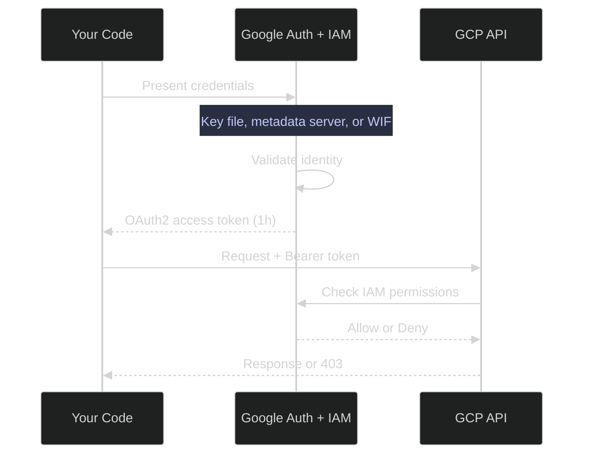
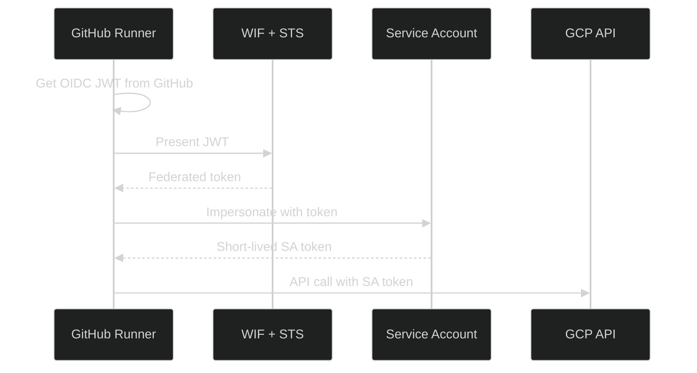

# GCP Identity and Connection Patterns

> [!quote]
> "If you think technology can solve your security problems, then you don't understand the problems and you don't understand the technology."
>
> — **Bruce Schneier**, *Secrets and Lies* (2000)

This page is the **conceptual framework** for GCP security. It explains the identity model, credential types, authentication methods, and connection patterns across the entire stack — then links to the specific heading where each implementation lives. Start here to understand the WHY and WHEN; follow the links for the HOW.

---

## The GCP Identity Model

### Human vs Machine Identity — who is calling the API

Every GCP API call is authenticated by an identity — either a human user or a service account. The table below defines each type and its appropriate use context.

> [!info] Two Types of Identity
>
> Every GCP API call is made by an identity. GCP recognizes two kinds: human users (interactive) and service accounts (machine). Choosing the wrong one for your context creates security gaps or operational friction.

| Identity Type | Format | Created By | Used For |
|---------------|--------|------------|----------|
| **User account** | `user@gmail.com`, `user@corp.com` | Google Workspace or Cloud Identity | Interactive gcloud CLI, console, local development |
| **Service account** | `sa-name@project.iam.gserviceaccount.com` | `gcloud iam service-accounts create` | Pipelines, VMs, Cloud Run, CI/CD — anything automated |

- **User accounts** are for humans sitting at a keyboard. They authenticate via browser-based OAuth2 flows
- **Service accounts** are for machines. They authenticate via key files, metadata server tokens, or Workload Identity Federation
- **Rule:** production workloads always use service accounts, never user accounts. One SA per workload, not one SA for everything

For SA creation and IAM binding commands, see [service-accounts-and-iam > GCP Service Accounts — Machine Identities](https://alp78.github.io/elysium/06-GCP/Security/service-accounts-and-iam#gcp-service-accounts--machine-identities). For the Terraform pattern of one SA per workload, see [terraform-iam-and-secrets > Design Principle: One Service Account Per Workload](https://alp78.github.io/elysium/07-Terraform/GCP-Resources/terraform-iam-and-secrets#design-principle-one-service-account-per-workload).

### Credential Types — Short-Lived vs Long-Lived

GCP credentials fall into three classes by lifetime: short-lived tokens that expire automatically, refresh tokens that last until revoked, and key files that never expire. The lifetime determines the blast radius of a credential leak.

> [!tip] Short-Lived Credentials — Auto-Expire
>
> **Metadata Server Token** — 1 hour, auto-refreshed
> The production standard. Available on every GCE VM and Cloud Run instance.
> Token never leaves the VM, never touches disk, never needs rotation.
> Use case: all production workloads.
>
> **WIF Federated Token** — Minutes
> Exchanged from an external OIDC provider (GitHub Actions, AWS, Azure AD).
> Scoped to a single CI run. No key file ever exists.
> Use case: GitHub Actions, cross-cloud authentication.
>
> **OIDC ID Token** — 1 hour
> Audience-scoped identity token for service-to-service authentication.
> Proves "I am this service account" to a specific target service.
> Use case: Cloud Run invoker, authenticated Cloud Functions.
>
> **OAuth2 Access Token** — 1 hour
> The standard bearer token for all GCP API calls.
> Issued by any of the methods above. Auto-expires after 1 hour.
> Use case: every Python/C#/gcloud API call uses one of these under the hood.

> [!warning] Long-Lived Credentials — Must Revoke
>
> **OAuth2 Refresh Token** — Until revoked
> Created by `gcloud auth login` and `gcloud auth application-default login`.
> Can mint new access tokens indefinitely until explicitly revoked with
> `gcloud auth revoke`. Medium risk — a leaked refresh token lets an attacker
> generate fresh access tokens.
> Use case: local development only.

> [!success] Revoke Refresh Tokens When No Longer Needed
>
> Run `gcloud auth revoke` when leaving a project or rotating credentials. For CI environments, prefer WIF over refresh tokens entirely — WIF tokens expire in minutes with no revocation step required.

> [!danger] Permanent Credentials — Never Expire
>
> **SA Key File (JSON)** — Never expires
> A downloaded JSON file containing the service account's private key.
> Grants full access to everything the SA is authorized to do — **forever** —
> until someone manually deletes the key in the GCP console. There is no
> expiry. There is no auto-revocation. This is the #1 cause of GCP security
> incidents. The key must be deleted with
> `gcloud iam service-accounts keys delete KEY_ID`.
> Use case: **last resort** for local development when ADC login is insufficient.
> Never in production. Never committed to git. Rotate every 90 days if you
> must use one.

> [!success] Use Metadata Server or WIF Instead
>
> On GCE VMs and Cloud Run: the metadata server provides a short-lived, auto-refreshing token with nothing on disk. In CI/CD: WIF exchanges an OIDC token for a GCP token that expires in minutes. For local dev: `gcloud auth application-default login` creates a refresh token (long-lived but revocable) with no key file.

> [!danger] Key File Leak Response
>
> If you suspect a key file was leaked (committed to git, found in a Docker
> image layer, visible in logs): immediately delete the key in IAM, then
> rotate every secret the SA had access to. Attackers actively scan public
> repos for GCP key patterns. See
> [service-accounts-and-iam > Service Account Key Files — Local Development Only](https://alp78.github.io/elysium/06-GCP/Security/service-accounts-and-iam#service-account-key-files--local-development-only)
> for the deletion and rotation procedure.

> [!success] Immediate Containment Steps
>
> 1. `gcloud iam service-accounts keys delete KEY_ID --iam-account=SA_EMAIL` — deletes the key immediately. 2. Rotate every secret the SA had access to in Secret Manager. 3. Review Cloud Audit Logs for API calls made with that key ID since the suspected leak date. 4. Use `git filter-branch` or BFG Repo Cleaner to purge the key from git history and force-push — assume it was already copied before removal.

### The OAuth2 Token Flow — What Actually Happens

When Python code calls BigQuery, this is the full sequence of events behind the scenes:

- **Step 1-3:** Authentication — "who are you?" The credential source proves identity to Google STS
- **Step 4-5:** Token issuance — STS issues a short-lived OAuth2 access token
- **Step 6-8:** Authorization — IAM evaluates whether this identity has the requested permission on the target resource
- **Step 9:** Network controls — VPC-SC may block even authorized requests if the data would cross a perimeter boundary

### Authentication vs Authorization vs Network Controls

A GCP request must pass three independent layers to succeed. Failing any one of them blocks the request, regardless of what the other two allow.

> [!tip] Three Layers of Security
>
> GCP security is not one thing — it's three orthogonal layers. A request must pass all three to succeed.

| Layer | Question | Mechanism | Vault Reference |
|-------|----------|-----------|-----------------|
| **Authentication** | Who are you? | OAuth2 tokens, key files, WIF | [gcloud-authentication > How GCP Authentication Works](https://alp78.github.io/elysium/06-GCP/Core/gcloud-authentication#how-gcp-authentication-works) |
| **Authorization** | What can you do? | IAM roles and bindings | [service-accounts-and-iam > IAM Bindings — Granting Roles to Service Accounts](https://alp78.github.io/elysium/06-GCP/Security/service-accounts-and-iam#iam-bindings--granting-roles-to-service-accounts) |
| **Network control** | Where can data flow? | VPC-SC perimeters, firewalls | [vpc-service-controls > The Data Exfiltration Threat Model](https://alp78.github.io/elysium/06-GCP/Security/vpc-service-controls#the-data-exfiltration-threat-model) |

A service account with `roles/bigquery.dataViewer` (authorized) can still be blocked by VPC-SC if it tries to copy data out of a protected perimeter. IAM says "yes"; VPC-SC says "no". Both must agree.

### Application Default Credentials — The Search Order

ADC is the mechanism that answers "which credential should my code use?" without hardcoding anything. The client libraries (Python `google-auth`, C# `GoogleCredential`) search these locations in order:

| Priority | Source | Set By | Typical Environment |
|----------|--------|--------|---------------------|
| 1 | `GOOGLE_APPLICATION_CREDENTIALS` env var | Developer or deployment script | Local dev with key file |
| 2 | ADC user credentials | `gcloud auth application-default login` | Local dev without key file |
| 3 | GCE metadata server | Automatic on Compute Engine | VMs, Cloud Run (production) |
| 4 | GKE Workload Identity | Kubernetes SA annotation | GKE pods |

> [!warning] ADC Finds the Wrong Credential
>
> If `GOOGLE_APPLICATION_CREDENTIALS` points to a stale key file from an old project, ADC uses that key even when you're on a VM with a perfectly good metadata server token. ADC stops at the first match — it does not pick the "best" one. Unset the env var on VMs: `unset GOOGLE_APPLICATION_CREDENTIALS`.

> [!success] Unset GOOGLE_APPLICATION_CREDENTIALS on VMs
>
> Add `unset GOOGLE_APPLICATION_CREDENTIALS` to the VM's startup script or Cloud Run container entrypoint. On Cloud Run, simply do not set the variable — the metadata server is always available and ADC will use it at priority 3. Verify which credential is active with `gcloud auth application-default print-access-token` and check the source.

For the gcloud reference, see [gcloud-authentication > The ADC Credential Search Order](https://alp78.github.io/elysium/06-GCP/Core/gcloud-authentication#the-adc-credential-search-order). For the Python ADC lookup implementation, see [21_py_security_operations > google.auth.default — Application Default Credentials (ADC) lookup chain](https://alp78.github.io/elysium/02-Programming-Languages/Python/21_py_security_operations#googleauthdefault--application-default-credentials-adc-lookup-chain). For C#, see [21_cs_security_operations > Application Default Credentials (ADC) lookup chain](https://alp78.github.io/elysium/02-Programming-Languages/CSharp/21_cs_security_operations#application-default-credentials-adc-lookup-chain).

---

## Authentication Methods — Complete Framework

### Metadata Server (GCE VMs, Cloud Run) — the production standard

The metadata server is the recommended authentication mechanism for any workload running on GCE or Cloud Run. No credentials touch disk and tokens are auto-refreshed by the client library.

> [!abstract] How the Metadata Server Works
>
> Every GCE VM and Cloud Run instance has access to a local metadata server at `169.254.169.254`. The VM's attached service account is the identity. Code calls the metadata server, gets a short-lived token, and uses it — no credentials to manage, rotate, or leak.

- **No credentials on disk:** the token is fetched over a local HTTP call to `169.254.169.254` — it never leaves the VM
- **Auto-refreshed:** the client libraries automatically refresh the token before it expires (every ~55 minutes)
- **Scopes:** must be set at VM creation time. Cannot expand scopes without stopping the VM

> [!warning] VM Scopes Are Set at Creation
>
> If the VM was created with `--scopes=compute-ro`, the metadata server token only works for Compute Engine read operations — even if the attached SA has broader IAM roles. Use `--scopes=cloud-platform` (all APIs) unless you have a specific reason to restrict.

> [!success] Use --scopes=cloud-platform When Creating VMs
>
> Always pass `--scopes=cloud-platform` with `gcloud compute instances create`. If the VM was already created with restricted scopes, stop it, modify the scopes (`gcloud compute instances set-scopes`), and restart. Scopes cannot be changed on a running VM.

- Python implementation: [21_py_security_operations > VM instance identity — metadata server credentials](https://alp78.github.io/elysium/02-Programming-Languages/Python/21_py_security_operations#vm-instance-identity--metadata-server-credentials)
- SA attachment to VM: [service-accounts-and-iam > ADC and the GCE Metadata Server](https://alp78.github.io/elysium/06-GCP/Security/service-accounts-and-iam#adc-and-the-gce-metadata-server)

### Workload Identity Federation (WIF) — keyless external identity

WIF allows external systems (GitHub Actions, AWS, Azure AD) to authenticate to GCP without a service account key file. The external identity provider issues a token; Google STS exchanges it for a short-lived GCP access token.

> [!info] WIF Trust Chain
>
> WIF lets external identity providers (GitHub Actions, AWS, Azure AD) authenticate to GCP without a service account key file. The external provider issues a token, Google STS exchanges it for a short-lived GCP access token.

- **No key file ever exists.** The GitHub runner gets a JWT from GitHub's OIDC provider, exchanges it at Google STS, and gets a short-lived token. The token lives for minutes and is scoped to one CI run
- **When to use:** CI/CD (GitHub Actions), cross-cloud workloads, any external identity system
- **WIF vs key file:** key files are permanent liabilities; WIF tokens live for minutes. Always prefer WIF

- Pool and provider creation: [20_py_security_setup > Workload Identity Federation](https://alp78.github.io/elysium/02-Programming-Languages/Python/20_py_security_setup#workload-identity-federation)
- GitHub Actions usage: [secrets-management > GitHub Actions — Workload Identity Federation (Keyless)](https://alp78.github.io/elysium/06-GCP/Security/secrets-management#github-actions--workload-identity-federation-keyless)
- Python OIDC flow: [21_py_security_operations > Workload Identity Federation — GitHub Actions OIDC flow](https://alp78.github.io/elysium/02-Programming-Languages/Python/21_py_security_operations#workload-identity-federation--github-actions-oidc-flow)

### Service Account Impersonation — temporary privilege escalation

Impersonation lets identity A temporarily act as identity B without holding B's key file. It is the standard pattern for developer testing and least-privilege delegation in CI/CD pipelines.

> [!info] Impersonation Model
>
> Identity A temporarily assumes identity B's permissions. No key file is created — A gets a short-lived token that acts as B. Requires `roles/iam.serviceAccountTokenCreator` on the target SA.

- **Use case:** developer testing "what can the pipeline SA do?" without holding its key file
- **Use case:** least-privilege delegation — a CI SA impersonates a deploy SA only during the deployment step
- **Audit trail:** every impersonation is logged in Cloud Audit Logs with both the caller and the impersonated identity — full accountability chain

- Python implementation: [21_py_security_operations > Service account impersonation — keyless authentication](https://alp78.github.io/elysium/02-Programming-Languages/Python/21_py_security_operations#service-account-impersonation--keyless-authentication)
- C# implementation: [21_cs_security_operations > Service account impersonation — keyless authentication](https://alp78.github.io/elysium/02-Programming-Languages/CSharp/21_cs_security_operations#service-account-impersonation--keyless-authentication)
- Short-lived token generation: [21_py_security_operations > google-cloud-iam-credentials — generate short-lived OAuth2 access tokens](https://alp78.github.io/elysium/02-Programming-Languages/Python/21_py_security_operations#google-cloud-iam-credentials--generate-short-lived-oauth2-access-tokens)

### Service Account Key Files — last resort only

A downloaded JSON key file authenticates as the service account with no expiration. This section explains when (rarely) a key file is justified and what controls must be in place when one exists.

> [!danger] Service Account Key Files
>
> Downloading a service account key is the single most common GCP
> security violation. The key never expires (unless you set rotation),
> cannot be audited for usage (you see the SA's actions, not who used
> the key), and if committed to Git or leaked, grants permanent access
> until manually revoked. Use Workload Identity Federation for external
> workloads, attached service accounts for GCP workloads, and
> `gcloud auth application-default login` for local development.
> The key that doesn't exist can't be leaked.

> [!success] Choose the Right Keyless Method
>
> GCP workload (VM/Cloud Run): use the attached service account — metadata server handles tokens automatically. External workload (GitHub Actions, AWS): use WIF. Local development: use `gcloud auth application-default login`. In all three cases, zero key files exist and nothing needs rotation.

> [!danger] Key Files Never Expire
>
> A downloaded JSON key file grants full access to the service account's permissions with no expiration. If it leaks to a git repo, a log file, or a shared drive, the attacker has permanent access until someone manually deletes the key.

> [!success] Enforce 90-Day Rotation and Audit Existing Keys
>
> Run `gcloud iam service-accounts keys list --iam-account=SA_EMAIL` to see all active keys and their creation dates. Delete any key older than 90 days. Add an Org Policy (`iam.managed.restrictServiceAccountKeyCreation`) to prevent new key downloads in production projects.

- **When justified:** local development against GCP APIs where `gcloud auth application-default login` isn't sufficient (rare — e.g., testing impersonation flows)
- **The rule:** if you can use metadata server or WIF, you must. Key files are the absolute last resort

- Key creation: [service-accounts-and-iam > Service Account Key Files — Local Development Only](https://alp78.github.io/elysium/06-GCP/Security/service-accounts-and-iam#service-account-key-files--local-development-only)
- Key rotation procedure: [secrets-management > Service Account Keys](https://alp78.github.io/elysium/06-GCP/Security/secrets-management#service-account-keys)
- Python key file auth: [21_py_security_operations > google-auth Credentials.from_service_account_file — key file authentication](https://alp78.github.io/elysium/02-Programming-Languages/Python/21_py_security_operations#google-auth-credentialsfromserviceaccountfile--key-file-authentication)
- C# key file auth: [21_cs_security_operations > GoogleCredential.FromFile — service account key file authentication](https://alp78.github.io/elysium/02-Programming-Languages/CSharp/21_cs_security_operations#googlecredentialfromfile--service-account-key-file-authentication)

### Application Default Credentials — interactive local dev

On a developer workstation, two separate credential commands must be run: one for the gcloud CLI and one for application code. Confusing them is the most common local development authentication mistake.

> [!info] The Two-Login Confusion
>
> `gcloud auth login` and `gcloud auth application-default login` are two different commands that set two different credential stores. Confusing them is the most common GCP authentication mistake.

| Command | What It Sets | Who Uses It |
|---------|-------------|-------------|
| `gcloud auth login` | Credentials for the **gcloud CLI tool itself** | gcloud commands, gsutil, bq |
| `gcloud auth application-default login` | Credentials for **your application code** (Python, C#, Go) | Client libraries via ADC |

> [!warning] The Common Mistake
>
> Running `gcloud auth login` and then wondering why `bigquery.Client()` in Python gets "permission denied." Python doesn't use gcloud's CLI credentials — it uses ADC. You need `gcloud auth application-default login` separately.

> [!success] Run Both Commands for Local Development
>
> `gcloud auth login` — for gcloud CLI tools. `gcloud auth application-default login` — for Python, C#, and Go client libraries. Both must be run once per workstation per project. Verify ADC is set correctly with `gcloud auth application-default print-access-token`.

- `gcloud auth login`: [gcloud-authentication > gcloud auth login — interactive authentication for human users](https://alp78.github.io/elysium/06-GCP/Core/gcloud-authentication#gcloud-auth-login--interactive-authentication-for-human-users)
- `gcloud auth application-default login`: [gcloud-authentication > gcloud auth application-default login — ADC for application code](https://alp78.github.io/elysium/06-GCP/Core/gcloud-authentication#gcloud-auth-application-default-login--adc-for-application-code)

---

## Connection Patterns by Scenario

Every source→destination pair in the stack, with the complete trust chain, required IAM roles, network path, and links to implementation.

### Workstation → SQL Server (private VM, no public IP)

The standard pattern for a developer connecting to a SQL Server VM that has no public IP. IAP authenticates the tunnel; SQL Server authenticates the database session.

> [!info] Three-Layer Auth Pattern
>
> This is a two-layer authentication: GCP identity (IAP) authenticates you to the tunnel, then SQL Server identity (sa/password) authenticates you to the database. The IAP tunnel encrypts transport — no public IP exposure.

**Trust chain:** `gcloud credentials → IAP proxy (OAuth2) → IAP tunnel (HTTPS/443) → GCP internal network → VM port 1433 → SQL Server auth (login/password)`

| Requirement | Value |
|-------------|-------|
| IAM role | `roles/iap.tunnelResourceAccessor` on the VM |
| Firewall | Allow `35.235.240.0/20` on TCP 22 and 1433 |
| SQL Server auth | Login + password (from Secret Manager) |
| TLS note | SQL Server self-signed cert → `TrustServerCertificate=yes` (acceptable because IAP encrypts transport) |

- Open tunnel: [iap-tunneling > gcloud compute start-iap-tunnel — port forwarding through IAP](https://alp78.github.io/elysium/01-Shell/Networking/iap-tunneling#gcloud-compute-start-iap-tunnel--port-forwarding-through-iap)
- How IAP works: [iap-tunneling > How IAP tunneling works — the full network path from workstation to VM](https://alp78.github.io/elysium/01-Shell/Networking/iap-tunneling#how-iap-tunneling-works--the-full-network-path-from-workstation-to-vm)
- Connect via sqlcmd: [connecting-to-gcp-resources > gcloud start-iap-tunnel + sqlcmd — SQL Server via IAP (Linux)](https://alp78.github.io/elysium/01-Shell/Networking/connecting-to-gcp-resources#gcloud-start-iap-tunnel--sqlcmd--sql-server-via-iap-linux)
- Connect via Python: [connecting-to-gcp-resources > pymssql — SQL Server through IAP tunnel (Python)](https://alp78.github.io/elysium/01-Shell/Networking/connecting-to-gcp-resources#pymssql--sql-server-through-iap-tunnel-python)
- Connect via SSMS: [connecting-to-gcp-resources > Invoke-Sqlcmd / SSMS — SQL Server through IAP tunnel (PowerShell)](https://alp78.github.io/elysium/01-Shell/Networking/connecting-to-gcp-resources#invoke-sqlcmd--ssms--sql-server-through-iap-tunnel-powershell)

> [!warning] Common Mistake
>
> Forgetting the IAP firewall rule. The tunnel command hangs silently if the VM's firewall doesn't allow traffic from Google's IAP IP range `35.235.240.0/20`.

> [!success] Add the IAP Firewall Rule Before Opening Tunnels
>
> `gcloud compute firewall-rules create allow-iap --allow=tcp:1433,tcp:22 --source-ranges=35.235.240.0/20`. Verify the rule is active with `gcloud compute firewall-rules list --filter="name=allow-iap"`. If the tunnel hangs with no error, a missing or mismatched firewall rule is the first thing to check.

### Airflow VM → SQL Server VM (same VPC)

**Trust chain:** `Airflow VM → direct TCP over VPC private network → VM port 1433 → SQL Server auth (login/password)`

| Requirement | Value |
|-------------|-------|
| IAM role | None (VPC-internal, no IAP) |
| Network | Same VPC, private IPs are directly routable |
| Credential source | SA_PASSWORD from Secret Manager → Airflow Connection |

- Secret Manager in Airflow: [secrets-management > Airflow Connections Backed by Secret Manager](https://alp78.github.io/elysium/06-GCP/Security/secrets-management#airflow-connections-backed-by-secret-manager)

> [!warning] Common Mistake
>
> Using an IAP tunnel between VMs in the same VPC. IAP adds latency and complexity when the VMs can already communicate directly over private IPs. Only use IAP when crossing a network boundary (e.g., workstation → cloud).

> [!success] Connect Directly Over Private IPs Within the VPC
>
> VMs in the same VPC can reach each other via private IP without any tunnel. Use the target VM's internal IP or its internal DNS name. Reserve the IAP tunnel pattern for workstation-to-cloud connections only.

### Python/C# → BigQuery (serverless API)

**Trust chain:** `ADC or metadata server → OAuth2 access token → BigQuery API over HTTPS (port 443)`

| Requirement | Value |
|-------------|-------|
| IAM role | `roles/bigquery.dataViewer` (read) or `roles/bigquery.dataEditor` (write) |
| Network | Public Google API — no tunnel, no port, no firewall |
| VPC-SC | May restrict which projects can query (if configured) |

- Python: [connecting-to-gcp-resources > google-cloud-bigquery Client — BigQuery queries (Python)](https://alp78.github.io/elysium/01-Shell/Networking/connecting-to-gcp-resources#google-cloud-bigquery-client--bigquery-queries-python)
- Python lab (with SA auth): [21_py_security_operations > google-cloud-bigquery Client — query with service account credentials](https://alp78.github.io/elysium/02-Programming-Languages/Python/21_py_security_operations#google-cloud-bigquery-client--query-with-service-account-credentials)
- C# lab: [21_cs_security_operations > BigQueryClient — query with service account credentials](https://alp78.github.io/elysium/02-Programming-Languages/CSharp/21_cs_security_operations#bigqueryclient--query-with-service-account-credentials)
- VPC-SC restrictions: [vpc-service-controls](https://alp78.github.io/elysium/06-GCP/Security/vpc-service-controls)

> [!warning] Common Mistake
>
> Granting `roles/bigquery.admin` when the pipeline only reads data. Use `roles/bigquery.dataViewer` for read-only access. See [service-accounts-and-iam > Minimum IAM Permission Set for a Data Pipeline](https://alp78.github.io/elysium/06-GCP/Security/service-accounts-and-iam#minimum-iam-permission-set-for-a-data-pipeline) for the minimum role set.

> [!success] Grant roles/bigquery.dataViewer + roles/bigquery.jobUser for Read-Only Pipelines
>
> `roles/bigquery.dataViewer` grants SELECT on tables; `roles/bigquery.jobUser` grants the ability to run query jobs. Together these are the minimum for a read-only pipeline. Apply both at the dataset level, not the project level, to limit the scope to only the datasets the pipeline needs.

### Python/C# → Firestore (serverless API)

**Trust chain:** `ADC or metadata server → OAuth2 access token → Firestore API over HTTPS`

| Requirement | Value |
|-------------|-------|
| IAM role | `roles/datastore.user` (read/write documents) |
| Network | Public Google API — no tunnel |

- Python lab: [21_py_security_operations > google-cloud-firestore Client — read documents with SA credentials](https://alp78.github.io/elysium/02-Programming-Languages/Python/21_py_security_operations#google-cloud-firestore-client--read-documents-with-sa-credentials)
- C# lab: [21_cs_security_operations > FirestoreDb — read and write documents with SA credentials](https://alp78.github.io/elysium/02-Programming-Languages/CSharp/21_cs_security_operations#firestoredb--read-and-write-documents-with-sa-credentials)
- Firestore IAM vs security rules: [firestore-data-model-and-operations](https://alp78.github.io/elysium/06-GCP/Firestore/firestore-data-model-and-operations)

### Python/C# → Cloud Storage (serverless API)

**Trust chain:** `ADC or metadata server → OAuth2 access token → GCS API over HTTPS`

| Requirement | Value |
|-------------|-------|
| IAM role | `roles/storage.objectViewer` (read) or `roles/storage.objectAdmin` (full) |
| Per-bucket IAM | Grant on specific buckets, not project-wide |
| KMS-encrypted objects | CMEK or CSEK — transparent to readers with KMS access |

- Minimum roles: [service-accounts-and-iam > Minimum IAM Permission Set for a Data Pipeline](https://alp78.github.io/elysium/06-GCP/Security/service-accounts-and-iam#minimum-iam-permission-set-for-a-data-pipeline)
- KMS encryption: [21_py_security_operations > google-cloud-kms encrypt — symmetric encryption of plaintext](https://alp78.github.io/elysium/02-Programming-Languages/Python/21_py_security_operations#google-cloud-kms-encrypt--symmetric-encryption-of-plaintext)

### Python/C# → Secret Manager (serverless API)

**Trust chain:** `ADC or metadata server → OAuth2 access token → Secret Manager API`

| Requirement | Value |
|-------------|-------|
| IAM role | `roles/secretmanager.secretAccessor` (read secret values) |
| Per-secret IAM | Bind accessor role on individual secrets, not project-wide |

- IAM bindings: [secrets-management > IAM for Secrets](https://alp78.github.io/elysium/06-GCP/Security/secrets-management#iam-for-secrets)
- Python code: [secrets-management > Access from Python](https://alp78.github.io/elysium/06-GCP/Security/secrets-management#access-from-python)
- Python lab: [21_py_security_operations > google-cloud-secret-manager access_secret_version — read secrets](https://alp78.github.io/elysium/02-Programming-Languages/Python/21_py_security_operations#google-cloud-secret-manager-accesssecretversion--read-secrets)

### Cloud Run → SQL Server (cross-service, same VPC)

**Trust chain:** `Cloud Run's attached SA → VPC connector → private IP → SQL Server port 1433 → SQL auth (login/password)`

| Requirement | Value |
|-------------|-------|
| IAM role | None for network (VPC connector handles routing) |
| Network | Serverless VPC Access connector (or Direct VPC Egress) |
| Credential source | SA password from Secret Manager, fetched at container startup |

- Cloud Run configuration: [cloud-run-jobs-vs-services](https://alp78.github.io/elysium/06-GCP/Serverless/cloud-run-jobs-vs-services)

> [!warning] Common Mistake
>
> Forgetting the VPC connector. Cloud Run is serverless — it does not live in your VPC by default. Without a connector, Cloud Run cannot reach private IPs. Configure a Serverless VPC Access connector or enable Direct VPC Egress.

> [!success] Configure a Serverless VPC Access Connector
>
> Create a connector: `gcloud compute networks vpc-access connectors create CONNECTOR_NAME --region=REGION --network=VPC_NAME --range=10.8.0.0/28`. Deploy Cloud Run with `--vpc-connector=CONNECTOR_NAME`. Alternatively, enable Direct VPC Egress on the Cloud Run service to route traffic directly into the VPC without a connector resource.

### Cloud Run → BigQuery / GCS / Secret Manager (serverless-to-serverless)

The most common Cloud Run data pipeline pattern. All three targets are public Google APIs — no VPC connector needed. The attached service account identity flows through ADC automatically.

**Trust chain:** `Cloud Run's attached SA → metadata server → OAuth2 access token → GCP API over HTTPS (port 443)`

| Requirement | BigQuery | Cloud Storage | Secret Manager |
|-------------|----------|---------------|----------------|
| IAM role (read) | `roles/bigquery.dataViewer` + `roles/bigquery.jobUser` | `roles/storage.objectViewer` | `roles/secretmanager.secretAccessor` |
| IAM role (write) | `roles/bigquery.dataEditor` + `roles/bigquery.jobUser` | `roles/storage.objectAdmin` | `roles/secretmanager.secretVersionAdder` |
| Network | Public API — no connector | Public API — no connector | Public API — no connector |
| VPC-SC | May restrict if configured | May restrict if configured | May restrict if configured |

> [!tip] No VPC Connector Needed for Serverless GCP APIs
>
> VPC connectors are only required when Cloud Run needs to reach **private** resources (VMs, Cloud SQL with private IP). BigQuery, GCS, and Secret Manager are public Google APIs reachable over HTTPS from any Cloud Run instance without a connector — and without a public IP on the container itself.

> [!warning] Common Mistake
>
> Attaching a VPC connector and routing all traffic through it (`--vpc-egress=all-traffic`) when the workload only calls public GCP APIs. This adds latency, consumes connector capacity, and routes unnecessary traffic through the VPC. Use `--vpc-egress=private-ranges-only` if a connector is needed for private resources but GCP API calls should stay on the public path.

> [!success] Use --vpc-egress=private-ranges-only When a Connector Is Present
>
> If Cloud Run needs both a private SQL Server and a public BigQuery API, attach the VPC connector but set `--vpc-egress=private-ranges-only`. This routes only RFC 1918 traffic through the connector; GCP API calls continue over the direct public path.

- Cloud Run IAM setup: [service-accounts-and-iam > Minimum IAM Permission Set for a Data Pipeline](https://alp78.github.io/elysium/06-GCP/Security/service-accounts-and-iam#minimum-iam-permission-set-for-a-data-pipeline)
- Cloud Run service configuration: [cloud-run-jobs-vs-services](https://alp78.github.io/elysium/06-GCP/Serverless/cloud-run-jobs-vs-services)
- BigQuery connection pattern: [Python/C# → BigQuery](#pythonc--bigquery-serverless-api) (above)

---

### GitHub Actions → GCP (external, WIF)

**Trust chain:** `GitHub OIDC token → WIF pool/provider → STS token exchange → short-lived GCP access token → GCP APIs`

| Requirement | Value |
|-------------|-------|
| IAM role | `roles/iam.workloadIdentityUser` on the target SA |
| WIF pool/provider | Configured for the GitHub repo |
| Key file | **None** — this is the entire point of WIF |

- WIF pool setup: [20_py_security_setup > Workload Identity Federation](https://alp78.github.io/elysium/02-Programming-Languages/Python/20_py_security_setup#workload-identity-federation)
- GitHub Actions workflow: [secrets-management > GitHub Actions — Workload Identity Federation (Keyless)](https://alp78.github.io/elysium/06-GCP/Security/secrets-management#github-actions--workload-identity-federation-keyless)
- Python OIDC flow: [21_py_security_operations > Workload Identity Federation — GitHub Actions OIDC flow](https://alp78.github.io/elysium/02-Programming-Languages/Python/21_py_security_operations#workload-identity-federation--github-actions-oidc-flow)

### GitHub Actions → SQL Server (WIF + IAP)

**Trust chain:** `GitHub OIDC → WIF → GCP token → gcloud IAP tunnel → SQL Server auth (login/password)`

This is the most complex pattern in the stack — three layers of auth: GitHub → GCP → SQL Server.

| Layer | Authentication |
|-------|---------------|
| GitHub → GCP | WIF (OIDC token exchange) |
| GCP → VM | IAP tunnel (`gcloud compute start-iap-tunnel`) |
| Client → SQL Server | SQL Server login/password |

| Requirement | Value |
|-------------|-------|
| IAM roles | `roles/iam.workloadIdentityUser` + `roles/iap.tunnelResourceAccessor` |
| Firewall | Allow `35.235.240.0/20` on 1433 |

> [!warning] Common Mistake
>
> Forgetting that the IAP tunnel command needs time to establish before `sqlcmd` connects. Add a `sleep 5` after starting the tunnel in the workflow. See [sql-server-loading-patterns > Schema Migration CI/CD with GitHub Actions](https://alp78.github.io/elysium/04-SQL-Server/Patterns/sql-server-loading-patterns#schema-migration-cicd-with-github-actions) for a working workflow example.

> [!success] Start the Tunnel in the Background, Then Sleep
>
> In GitHub Actions: `gcloud compute start-iap-tunnel VM_NAME 1433 --local-host-port=localhost:1433 --zone=ZONE &` then `sleep 5` before running `sqlcmd`. The `&` runs the tunnel as a background process; the sleep gives it time to establish the WebSocket connection before the SQL client attempts to connect.

### Connection Quick Reference Matrix

A consolidated view of all patterns above, for quick lookup during incident response or infrastructure review.

> [!info]- All Connection Patterns at a Glance
>
> For protocol details and tunnel commands, see [connecting-to-gcp-resources > Connection quick reference matrix — protocol and tunnel requirements by service](https://alp78.github.io/elysium/01-Shell/Networking/connecting-to-gcp-resources#connection-quick-reference-matrix--protocol-and-tunnel-requirements-by-service).

| Source → Destination | Auth Method | Network Path | Tunnel Needed |
|---------------------|-------------|-------------|---------------|
| Workstation → SQL Server | IAP + SQL auth | IAP tunnel → port 1433 | Yes (IAP) |
| Airflow → SQL Server | SQL auth | VPC private IP → port 1433 | No |
| Python → BigQuery | ADC/metadata | HTTPS → public API | No |
| Python → Firestore | ADC/metadata | HTTPS → public API | No |
| Python → GCS | ADC/metadata | HTTPS → public API | No |
| Python → Secret Manager | ADC/metadata | HTTPS → public API | No |
| Cloud Run → SQL Server | SQL auth | VPC connector → port 1433 | No (VPC connector) |
| Cloud Run → BigQuery/GCS/Secret Manager | ADC/metadata | HTTPS → public API | No |
| GitHub Actions → GCP APIs | WIF | HTTPS → public API | No |
| GitHub Actions → SQL Server | WIF + IAP + SQL auth | IAP tunnel → port 1433 | Yes (IAP) |

---

## The Certificate and TLS Landscape

### Certificate Overview — who manages what

Across the full GCP stack, most TLS certificates are Google-managed and invisible to application code. The one exception is SQL Server on Linux, which generates a self-signed certificate.

> [!info] Certificate Inventory
>
> Most certificates in GCP are Google-managed — you never see or rotate them. The exception is SQL Server on Linux, which generates a self-signed cert.

| Connection | Certificate | Who Manages | Validation |
|------------|-------------|-------------|------------|
| gcloud → IAP | Google-managed TLS | Google (automatic) | gcloud SDK handles it |
| IAP → VM SSH | Host key (ed25519) | Auto-generated on VM | gcloud trusts via metadata API |
| Python → BigQuery API | Google-managed TLS | Google (automatic) | Python `certifi` CA bundle |
| Python → SQL Server | SQL Server self-signed cert | SQL Server on Linux | `TrustServerCertificate=yes` |
| GitHub → GCP STS | Google-managed TLS | Google (automatic) | GitHub runner CA bundle |
| SQL Server TDE (at rest) | GCP KMS-managed DEK | KMS wraps the key | [tde-encryption](https://alp78.github.io/elysium/04-SQL-Server/Security/tde-encryption) |
| GCS objects (at rest) | Google-managed or CMEK | Google or KMS | Transparent to readers |

### TrustServerCertificate=yes — why SQL Server connections use it

SQL Server on Linux generates a self-signed certificate at startup. Because no CA chain exists, client drivers require `TrustServerCertificate=yes` to connect. This section explains when that is acceptable and when it is not.

> [!warning] Self-Signed Certificate on Linux
>
> SQL Server on Linux generates a self-signed TLS certificate at startup. No CA chain exists — it is not signed by a trusted authority. `TrustServerCertificate=yes` tells the client to accept any certificate without validation.

> [!success] Accept Self-Signed Only Behind an IAP Tunnel
>
> `TrustServerCertificate=yes` is acceptable when every connection passes through an IAP tunnel — the tunnel provides end-to-end TLS encryption between the workstation and the Google edge, so the SQL Server's own certificate is a secondary layer. For any public-facing SQL Server without a tunnel, replace the self-signed cert with one signed by a trusted CA.

- **Why this is acceptable:** the IAP tunnel already encrypts the transport end-to-end (workstation → Google edge → VM). The self-signed cert encrypts SQL Server's TDS protocol layer, but the outer layer is already protected by IAP
- **When this is NOT acceptable:** public-facing SQL Server with no tunnel — use a CA-signed certificate from Let's Encrypt or an internal CA
- SQL Server TLS setup: [sql-server-authentication > TLS Encryption — network path client → IAP tunnel → VM → SQL Server](https://alp78.github.io/elysium/04-SQL-Server/Security/sql-server-authentication#tls-encryption--network-path-client--iap-tunnel--vm--sql-server)
- Certificate generation: [sql-server-authentication > openssl req -x509 — generate TLS certificate for SQL Server](https://alp78.github.io/elysium/04-SQL-Server/Security/sql-server-authentication#openssl-req--x509--generate-tls-certificate-for-sql-server)

### KMS and Envelope Encryption — the two-tier model

Cloud KMS uses envelope encryption: data is encrypted with a local Data Encryption Key (DEK), and the DEK itself is wrapped by a Key Encryption Key (KEK) stored in KMS. This keeps KMS API call volume low while protecting the key material.

> [!info] Envelope Encryption
>
> Data is encrypted with a Data Encryption Key (DEK). The DEK is encrypted with a Key Encryption Key (KEK) stored in Cloud KMS. Only the encrypted DEK is stored alongside the ciphertext. To decrypt: call KMS to unwrap the DEK, then use the DEK to decrypt the data.

- **Why two tiers:** the DEK encrypts locally (fast, no network call per row). KMS only wraps/unwraps the DEK (one API call per encrypt/decrypt operation). This keeps KMS costs low even for high-volume encryption
- Encryption key hierarchy: [tde-encryption > Encryption Key Hierarchy](https://alp78.github.io/elysium/04-SQL-Server/Security/tde-encryption#encryption-key-hierarchy)
- Python envelope encryption: [21_py_security_operations > cryptography AESGCM + google-cloud-kms — envelope encryption](https://alp78.github.io/elysium/02-Programming-Languages/Python/21_py_security_operations#cryptography-aesgcm--google-cloud-kms--envelope-encryption)
- C# envelope encryption: [21_cs_security_operations > AesGcm + KeyManagementServiceClient — envelope encryption](https://alp78.github.io/elysium/02-Programming-Languages/CSharp/21_cs_security_operations#aesgcm--keymanagementserviceclient--envelope-encryption)
- SQL Server TDE (at-rest encryption using KMS): [tde-encryption](https://alp78.github.io/elysium/04-SQL-Server/Security/tde-encryption)

---

## Anti-Patterns

> [!abstract] Security Mistakes That Cause Incidents
>
> Every anti-pattern below has caused a production incident. Each one
> looked reasonable at the time.

---

### Single SA for everything — no blast radius containment

Using one service account for all workloads eliminates containment boundaries. A single credential compromise exposes the entire stack.

> [!danger] One SA shared across all workloads
>
> One service account used by the pipeline, dashboard, CI/CD, and monitoring.
> When the SA key leaks, the attacker has access to **everything** — all data,
> all services, all environments. There is no containment boundary.

> [!success] One SA per workload
>
> The pipeline SA reads/writes data. The dashboard SA reads gold tables only.
> The CI SA deploys but doesn't read data. A compromised SA affects only its
> own workload. See [service-accounts-and-iam > Minimum IAM Permission Set for a Data Pipeline](https://alp78.github.io/elysium/06-GCP/Security/service-accounts-and-iam#minimum-iam-permission-set-for-a-data-pipeline).

---

### SA key files in production — permanent liability

A key file on a production system persists through VM rebuilds and image redeployments. It grants access forever until manually deleted — even after the original workload is decommissioned.

> [!danger] Key file on a VM, in a Docker image, or in an env var
>
> A JSON key file on a production VM. If the VM is compromised, the attacker
> has **permanent** access — even after the VM is rebuilt, reimaged, and
> redeployed. The key never expires and works from anywhere.

> [!success] Use metadata server or WIF
>
> On VMs and Cloud Run: the metadata server provides auto-refreshing tokens
> with zero files on disk. In CI/CD: WIF exchanges an external OIDC token
> for a short-lived GCP token. Key files should only exist on developer
> workstations, and even then, prefer `gcloud auth application-default login`.

---

### roles/editor or roles/owner on service accounts — over-permissioned

`roles/editor` grants write access to approximately 200 GCP services. A data pipeline SA needs access to two or three — not two hundred.

> [!danger] Granting roles/editor to a pipeline SA
>
> `roles/editor` grants write access to ~200 GCP services. A pipeline that
> writes to BigQuery and GCS does not need access to Compute Engine, Pub/Sub,
> Cloud Functions, IAM, or billing. A compromised editor SA can create VMs,
> open firewall ports, and exfiltrate data.

> [!success] Grant minimum specific roles
>
> `roles/bigquery.dataEditor` + `roles/bigquery.jobUser` +
> `roles/storage.objectAdmin` (on specific buckets) +
> `roles/secretmanager.secretAccessor`. Nothing more. See
> [service-accounts-and-iam > Minimum IAM Permission Set for a Data Pipeline](https://alp78.github.io/elysium/06-GCP/Security/service-accounts-and-iam#minimum-iam-permission-set-for-a-data-pipeline)
> for the exact role list.

---

### Hardcoding credentials in code or env vars — leaked in logs and git

Credentials embedded in source code, Dockerfiles, or environment variables are routinely exposed through git history, image layer inspection, and process crash dumps.

> [!danger] SA_PASSWORD in source code or Dockerfile
>
> Credentials in Python files end up in git history — permanently, even after
> deletion. Credentials in Dockerfiles end up in image layers — extractable
> by anyone with pull access. Credentials in env vars end up in Cloud Logging
> output when a process dumps its environment on crash.

> [!success] Store in Secret Manager, fetch at runtime
>
> Credentials live in GCP Secret Manager with per-secret IAM bindings.
> Application code fetches them at startup — nothing on disk, nothing in git,
> nothing in logs. See [secrets-management > Access from Python](https://alp78.github.io/elysium/06-GCP/Security/secrets-management#access-from-python) for the
> Python pattern and [secrets-management > Airflow Connections Backed by Secret Manager](https://alp78.github.io/elysium/06-GCP/Security/secrets-management#airflow-connections-backed-by-secret-manager)
> for Airflow integration.

---

### Skipping VPC-SC because "IAM is enough" — data exfiltration risk

IAM controls who can read data. Without VPC-SC, an authorized identity can copy that data out of the project entirely — to an attacker-controlled destination.

> [!danger] No VPC Service Controls on sensitive data
>
> IAM controls WHO can access data. Without VPC-SC, a compromised SA with
> `roles/bigquery.dataViewer` can copy your entire dataset to an
> attacker-controlled GCP project. IAM says "yes, you can read." Nothing
> says "no, you can't copy it out."

> [!success] Deploy VPC-SC perimeters around sensitive data
>
> VPC-SC restricts WHERE data can flow — even IAM-authorized requests are
> blocked if they cross the perimeter boundary. Data stays inside the
> project. See [vpc-service-controls](https://alp78.github.io/elysium/06-GCP/Security/vpc-service-controls) for perimeter setup and the
> ingress/egress policy patterns.

---

### Never rotating SA keys — permanent risk accumulation

Key files accumulate exposure over time. Each day a key exists without rotation is another day it may have been copied, shared, or forgotten somewhere outside your control.

> [!warning] Key file downloaded 18 months ago, shared with 3 people
>
> Two of those people have left the company. The key still works. Nobody
> remembers who has a copy. The key grants the same access it did on day one
> — there is no degradation, no expiry warning, no audit trail of who used
> it from where.

> [!success] 90-day rotation calendar
>
> Create new key → update Secret Manager version → update all consumers →
> verify → disable old key → wait 24 hours → delete old key. Automate this
> with a Cloud Scheduler job or a quarterly calendar reminder. See
> [secrets-management > Service Account Keys](https://alp78.github.io/elysium/06-GCP/Security/secrets-management#service-account-keys) for the full rotation procedure.

---

### Using the Compute Engine default SA — over-permissioned by default

GCP attaches the project's Compute Engine default service account to every VM that doesn't specify one. That default SA has `roles/editor` — write access to almost everything in the project.

> [!warning] VM created without specifying a custom SA
>
> The default SA (`PROJECT_NUMBER-compute@developer.gserviceaccount.com`)
> has `roles/editor` — write access to nearly everything in the project.
> Every VM created without a custom SA inherits this over-permissioned
> identity silently.

> [!success] Always attach a custom SA
>
> Specify `--service-account=` when creating VMs with `gcloud compute
> instances create`. In Terraform, set `service_account { email = ... }` on
> every `google_compute_instance`. Never leave the default SA in place for
> production workloads.

---

### TrustServerCertificate=yes on public-facing SQL Server — no TLS validation

`TrustServerCertificate=yes` is a safe choice behind an IAP tunnel but a security hole on any public-facing endpoint where a man-in-the-middle can present an arbitrary certificate.

> [!warning] Skipping certificate validation on a public endpoint
>
> `TrustServerCertificate=yes` accepts any certificate — including one
> presented by a man-in-the-middle attacker. Behind an IAP tunnel this is
> acceptable (the tunnel encrypts transport). On a public-facing SQL Server
> with no tunnel, it is a security hole.

> [!success] Use a CA-signed certificate for public endpoints
>
> Generate a TLS certificate from Let's Encrypt or an internal CA. Configure
> SQL Server to use it. Remove `TrustServerCertificate=yes` from connection
> strings. See [sql-server-authentication > openssl req -x509 — generate TLS certificate for SQL Server](https://alp78.github.io/elysium/04-SQL-Server/Security/sql-server-authentication#openssl-req--x509--generate-tls-certificate-for-sql-server)
> for the certificate generation procedure.

---

### Running gcloud auth login expecting Python SDK to work — wrong credential store

`gcloud auth login` and `gcloud auth application-default login` write to completely separate credential stores. Client libraries never read from the gcloud CLI store.

> [!danger] "Permission denied" after gcloud auth login
>
> `gcloud auth login` sets credentials for the gcloud CLI tool **only**.
> Python, C#, and Go client libraries use Application Default Credentials
> (ADC), which is a completely separate credential store. Running one does
> not set the other.

> [!success] Run both commands for local development
>
> `gcloud auth login` for CLI tools + `gcloud auth application-default login`
> for your application code. Or set `GOOGLE_APPLICATION_CREDENTIALS` to a
> key file. See [gcloud-authentication > gcloud auth application-default login — ADC for application code](https://alp78.github.io/elysium/06-GCP/Core/gcloud-authentication#gcloud-auth-application-default-login--adc-for-application-code)
> for the distinction.
