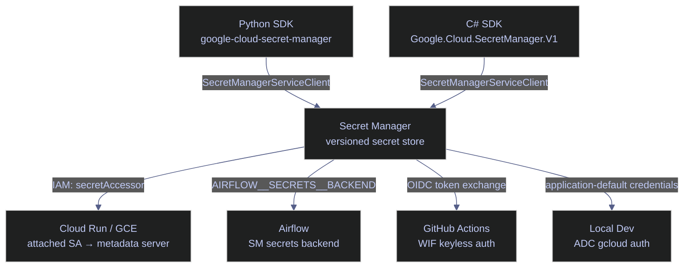
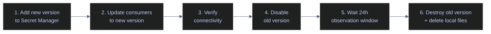

# Secrets Management

> [!quote]
> "Treat your secrets like your toothbrush: never share them and replace them regularly."
>
> — **Armon Dadgar**, co-founder of HashiCorp

> [!abstract] When You Need This
> Every data pipeline needs credentials: database passwords, API keys, service account keys, vendor tokens. This note covers how to store, access, rotate, and audit secrets across the entire stack.

## GCP Secret Manager

Secret Manager is GCP's fully managed service for storing, versioning, auditing, and rotating secrets at runtime. It replaces environment variables and key files as the authoritative source of credentials for all pipeline components. Every access operation is logged to Cloud Audit Logs automatically.



> [!info] **Pricing**
> Secret Manager charges $0.06 per active secret version per month (versions in `ENABLED` state) and $0.03 per 10,000 access operations. Destroyed versions are not billed. For pipelines with frequent access, cache the secret value in memory at startup rather than fetching on every request.

### Create and Version a Secret

A secret is a named container that holds one or more immutable versions. The secret itself carries no data — all values are stored as versions. Creating the container first allows IAM policies to be applied before any sensitive data is written.

#### gcloud | Create a secret

Creates a named secret container with automatic global replication. Labels enable cost attribution and filtering in Cloud Asset Inventory.

```bash
gcloud secrets create db-password \
  --replication-policy="automatic" \
  --labels="team=data-platform,env=prod"
```

```text
Created secret [db-password].
```

#### gcloud | Add a secret version

Adds the actual secret value as a new immutable version. To rotate, add a new version rather than modifying an existing one. The `--data-file=-` flag reads from stdin, keeping the secret value out of shell history.

```bash
echo -n "MyS3cur3P@ssw0rd" | gcloud secrets versions add db-password --data-file=-
```

```text
Created version [1] of the secret [db-password].
```

#### gcloud | Access the latest version

Returns the raw secret payload. The `latest` alias always resolves to the current `ENABLED` version. Pin to a specific version number (e.g., `1`) for deterministic behavior across deployments.

```bash
gcloud secrets versions access latest --secret=db-password
```

```text
MyS3cur3P@ssw0rd
```

#### gcloud | List versions

Lists all versions and their state. A secret can have multiple simultaneous versions in `ENABLED`, `DISABLED`, or `DESTROYED` state. Rotation workflows disable the old version before destroying it to preserve a recovery window.

```bash
gcloud secrets versions list db-password
```

```text
NAME  STATE    CREATED              DESTROYED
1     enabled  2026-04-01T10:00:00Z -
```

| Flag | Syntax | Description |
|---|---|---|
| `--replication-policy` | `--replication-policy=automatic` | `automatic`: Google manages cross-region replication. `user-managed`: specify regions with `--locations`. |
| `--locations` | `--locations=us-central1,europe-west1` | Replica regions (only with `--replication-policy=user-managed`) |
| `--labels` | `--labels=team=data-platform,env=prod` | Key-value labels for cost tracking and filtering |
| `--expire-time` | `--expire-time=2026-12-31T00:00:00Z` | RFC 3339 timestamp after which the secret is automatically destroyed |
| `--ttl` | `--ttl=8760h` | Time-to-live duration; alternative to `--expire-time` |
| `--topics` | `--topics=projects/PROJECT/topics/TOPIC` | Pub/Sub topic to notify on version events (add, enable, disable, destroy) |

### IAM for Secrets

Grant `roles/secretmanager.secretAccessor` at the **secret level**, not the project level. Project-level bindings allow a service account to access every secret in the project — per-secret bindings enforce least privilege and make blast radius explicit.

#### gcloud | Grant secret access to a service account

```bash
gcloud secrets add-iam-policy-binding db-password \
  --member="serviceAccount:sa-pipeline@PROJECT_ID.iam.gserviceaccount.com" \
  --role="roles/secretmanager.secretAccessor"
```

```text
Updated IAM policy for secret [db-password].
bindings:
- members:
  - serviceAccount:sa-pipeline@PROJECT_ID.iam.gserviceaccount.com
  role: roles/secretmanager.secretAccessor
etag: BwYXXXXXXXX
version: 1
```

> [!tip] Bind at the secret level, not the project level
> `gcloud projects add-iam-policy-binding` with `roles/secretmanager.secretAccessor` grants the SA access to every secret in the project. Always use `gcloud secrets add-iam-policy-binding` to restrict each service account to only the secrets it needs.

| Flag | Syntax | Description |
|---|---|---|
| `--member` | `--member=serviceAccount:SA@PROJECT.iam.gserviceaccount.com` | Principal to grant. Formats: `serviceAccount:`, `user:`, `group:`, `domain:` |
| `--role` | `--role=roles/secretmanager.secretAccessor` | IAM role. Key roles: `secretAccessor` (read versions), `secretVersionManager` (add/disable/destroy versions), `admin` (full control) |
| `--condition` | `--condition=expression=resource.name=="..."` | Attribute-based condition for fine-grained access (e.g., restrict to a single secret version) |

### Terraform Provisioning

The Terraform blocks below are part of the broader [terraform-iam-and-secrets](https://alp78.github.io/elysium/07-Terraform/GCP-Resources/terraform-iam-and-secrets) module that provisions both IAM bindings and Secret Manager resources together.

```hcl
resource "google_secret_manager_secret" "db_password" {
  secret_id = "db-password"
  replication { auto {} }
  labels = { team = "data-platform", env = var.environment }
}

resource "google_secret_manager_secret_version" "db_password_v1" {
  secret      = google_secret_manager_secret.db_password.id
  secret_data = var.db_password  # Passed via TF_VAR, never hardcoded
}

resource "google_secret_manager_secret_iam_member" "pipeline_access" {
  secret_id = google_secret_manager_secret.db_password.secret_id
  role      = "roles/secretmanager.secretAccessor"
  member    = "serviceAccount:${google_service_account.pipeline.email}"
}
```

### Access from Python

The Python client library usage here is covered in more depth in [20_py_security_setup](https://alp78.github.io/elysium/02-Programming-Languages/Python/20_py_security_setup), which includes error handling and caching patterns.

```python
from google.cloud import secretmanager

def get_secret(secret_id: str, project_id: str, version: str = "latest") -> str:
    client = secretmanager.SecretManagerServiceClient()
    name = f"projects/{project_id}/secrets/{secret_id}/versions/{version}"
    response = client.access_secret_version(request={"name": name})
    return response.payload.data.decode("UTF-8")

# Usage
db_password = get_secret("db-password", "data-platform-prod")
```

### Access from C#

The `Google.Cloud.SecretManager.V1` NuGet package provides the .NET client. Authentication uses Application Default Credentials automatically — no explicit credential file is needed when running on GCP (Cloud Run, GCE) or when ADC is configured locally with `gcloud auth application-default login`. For security operations patterns including token caching and dependency injection, see [21_cs_security_operations](https://alp78.github.io/elysium/02-Programming-Languages/CSharp/21_cs_security_operations).

```csharp
using Google.Cloud.SecretManager.V1;

public static string GetSecret(string projectId, string secretId, string version = "latest")
{
    SecretManagerServiceClient client = SecretManagerServiceClient.Create();
    AccessSecretVersionRequest request = new AccessSecretVersionRequest
    {
        Name = $"projects/{projectId}/secrets/{secretId}/versions/{version}"
    };
    AccessSecretVersionResponse result = client.AccessSecretVersion(request);
    return result.Payload.Data.ToStringUtf8();
}

// Usage
string dbPassword = GetSecret("data-platform-prod", "db-password");
```

> [!tip] Create the client once — it is thread-safe
> `SecretManagerServiceClient.Create()` is thread-safe and reuse-safe. Instantiate it as a singleton (e.g., via DI registration) and fetch secrets once at application startup. Re-fetching on every request adds 50–100 ms latency per call and increases API operation costs.

## Airflow Integration

Airflow natively supports Secret Manager as a secrets backend, allowing connections and variables to be resolved from Secret Manager at runtime rather than stored in the Airflow metadata database. This removes secrets from Airflow's internal storage entirely — the metadata DB holds only a reference key, never the value.

### Airflow Connections Backed by Secret Manager

Airflow can resolve connections and variables directly from Secret Manager — no secrets stored in the metadata database or environment variables.

> [!info] Configuration
> Set these environment variables in `airflow.cfg` or `docker-compose.yml`:
> - `AIRFLOW__SECRETS__BACKEND` = `airflow.providers.google.cloud.secrets.secret_manager.CloudSecretManagerBackend`
> - `AIRFLOW__SECRETS__BACKEND_KWARGS` = `{"project_id": "data-platform-prod", "connections_prefix": "airflow-conn", "variables_prefix": "airflow-var"}`

Then create secrets in Secret Manager with the matching prefix:
- `airflow-conn-sql-server` → connection URI
- `airflow-var-calc-date` → variable value

Airflow automatically resolves these when you reference `Variable.get("calc-date")` or `BaseHook.get_connection("sql-server")` — no code changes needed.

## GitHub Actions

CI/CD pipelines that deploy to GCP must authenticate without storing long-lived credentials. Workload Identity Federation (WIF) eliminates service account JSON keys by exchanging GitHub's OIDC token for a short-lived GCP access token scoped to a specific service account.

### GitHub Actions — Workload Identity Federation (Keyless)

No service account key file is required. The `google-github-actions/auth@v2` action exchanges GitHub's OIDC token for a short-lived GCP access token. The WIF provider and pool must be pre-configured — see [github-actions-data-engineering](https://alp78.github.io/elysium/10-GitHub-Actions/github-actions-data-engineering) for the full setup procedure.

```yaml
- uses: google-github-actions/auth@v2
  with:
    workload_identity_provider: projects/123/locations/global/workloadIdentityPools/github/providers/github
    service_account: sa-ci@PROJECT_ID.iam.gserviceaccount.com
```

### GitHub Actions — Repository Secrets

Store the WIF provider resource name and service account email as GitHub repository secrets. These are resource identifiers that parameterize the WIF authentication step, not sensitive credentials themselves.

Store in GitHub Settings > Secrets and variables > Actions:
- `WIF_PROVIDER` — Workload Identity provider resource name
- `SA_EMAIL` — Service account email

> [!danger] Never store GCP service account JSON keys as GitHub Secrets
> A leaked JSON key grants persistent, hard-to-revoke GCP access outside the IAM audit trail. GitHub Secrets are encrypted at rest, but the key itself has no expiry and no automatic rotation.

> [!success] Use Workload Identity Federation instead
> WIF tokens are short-lived (1 hour maximum), scoped to a specific service account, and every OIDC exchange is logged in Cloud Audit Logs. Rotate the WIF provider configuration without touching any secret material.

### Local Development Secret Patterns

For local development, secrets often surface as [environment-variables](https://alp78.github.io/elysium/01-Shell/Scripting/environment-variables) in the shell. Application Default Credentials (ADC) allow local code to authenticate using the developer's GCP identity without downloading a service account key file.

#### gcloud | Authenticate with Application Default Credentials

Stores a revocable OAuth2 refresh token in `~/.config/gcloud/application_default_credentials.json`. All GCP client libraries (Python, C#, Go) consume this automatically when no explicit credentials are provided. This is the standard local development approach — no JSON key file is downloaded or stored.

```bash
gcloud auth application-default login
```

```text
Credentials saved to file: [~/.config/gcloud/application_default_credentials.json]
These credentials will be used by any library that requests Application Default Credentials (ADC).
```

#### gcloud | ADC with specific OAuth scopes

Restrict ADC to a specific API scope during testing. Useful when validating that a pipeline component only needs a narrow permission set before deploying to production.

```bash
gcloud auth application-default login --scopes=https://www.googleapis.com/auth/bigquery
```

#### bash | Configure project environment with direnv

`direnv` automatically loads an `.envrc` file when entering the project directory. Combining it with Secret Manager keeps secret values out of dotfiles and version control — `.envrc` holds only shell variable assignments that call `gcloud secrets versions access` at shell load time. Add `.envrc` to `.gitignore`.

```bash
export PROJECT_ID=data-platform-dev
export SQL_CONN_STRING="Server=localhost;Database=analytics_db;User=sa;Password=$(gcloud secrets versions access latest --secret=db-password-dev)"
```

## Secret Rotation Procedure

Rotation is a versioning operation — add a new version, migrate consumers, then disable and destroy the old version. Secret Manager versions are immutable by design; never attempt to update a version in place. The general pattern applies to all secret types: service account keys, database passwords, API tokens, and TLS certificates.



### Service Account Keys

Use this procedure only when key-based authentication cannot be avoided. Prefer Workload Identity Federation, attached service accounts, or ADC for all new workloads.

> [!danger] SA key files are high-risk credentials
> A downloaded JSON key grants persistent GCP access with no expiry. If the key file is committed to source control, copied to a shared drive, or left on a developer laptop, it creates an unaudited access path that survives team member changes and cannot be detected through normal IAM audit trails.

> [!success] Prefer keyless authentication
> GitHub Actions: use WIF with `google-github-actions/auth@v2`. Cloud Run and GCE: attach a dedicated SA at deploy/create time — the metadata server issues short-lived tokens automatically. Local dev: use `gcloud auth application-default login` — a revocable refresh token, no JSON file stored.

> [!todo] Service Account Key Rotation
> 1. Create a new key and immediately upload to Secret Manager as a new version
> 2. Update all consumers (Airflow connections, Cloud Run env vars, CI/CD config) to reference the new version
> 3. Verify all consumers authenticate successfully
> 4. Disable the old key in IAM
> 5. Wait 24 hours — monitor Cloud Audit Logs for authentication failures
> 6. Delete the old key from IAM
> 7. Destroy the old Secret Manager version and delete any local key files

#### gcloud | Create a new SA key

Creates a new JSON key file for the service account. Upload to Secret Manager immediately — minimize the time the file exists on disk.

```bash
gcloud iam service-accounts keys create new-key.json \
  --iam-account=SA_EMAIL
```

```text
created key [KEY_ID] of type [json] as [new-key.json] for [SA_EMAIL]
```

#### gcloud | Disable an SA key

Disabling is reversible. Use it as the first step before destruction to preserve a recovery window.

```bash
gcloud iam service-accounts keys disable OLD_KEY_ID \
  --iam-account=SA_EMAIL
```

#### gcloud | Delete an SA key

Permanent and irreversible. Confirm the new key is working before executing.

```bash
gcloud iam service-accounts keys delete OLD_KEY_ID \
  --iam-account=SA_EMAIL
```

```text
You are about to delete key [OLD_KEY_ID] for service account [SA_EMAIL].
Do you want to continue (Y/n)? Y
deleted key [OLD_KEY_ID]
```

### Database Passwords

Database password rotation requires coordinating Secret Manager, the database engine, and all dependent services. A brief downtime window is typically required at step 3 when the database password is updated.

> [!todo] Database Password Rotation
> 1. Generate a new password (minimum 20 characters, mixed case, numbers, symbols)
> 2. Add the new password to Secret Manager as a new version
> 3. Update the database engine: `ALTER LOGIN sa WITH PASSWORD = 'new_password'`
> 4. Restart all dependent services (Cloud Run jobs, Airflow connections) to pick up the new Secret Manager version
> 5. Verify connectivity from each consumer
> 6. Disable the old Secret Manager version

### Secret Management Anti-Patterns

Common misconfigurations that introduce credential exposure risk, ordered by severity.

| Anti-Pattern | Risk | Better Approach |
|-------------|------|----------------|
| Secrets in source code | Exposed in Git history forever | Secret Manager + IAM |
| Secrets in plain env vars | Visible in process listing, logs | Secret Manager + runtime fetch |
| Shared service account keys | No accountability, hard to rotate | Per-service SAs with WIF |
| Never rotating secrets | Increased exposure window | Quarterly rotation schedule |
| Wide secret access | Any SA can read any secret | Per-secret IAM bindings |
| Key files on developer laptops | Lost/stolen laptops expose secrets | ADC + gcloud auth |

## Related

- [gcp-identity-and-connection-patterns](https://alp78.github.io/elysium/06-GCP/Security/gcp-identity-and-connection-patterns) — Identity model and connection patterns that determine how secrets are consumed
- [service-accounts-and-iam](https://alp78.github.io/elysium/06-GCP/Security/service-accounts-and-iam) — IAM roles and service account design
- [tf-iam-secrets-serverless](https://alp78.github.io/elysium/07-Terraform/Block-Library/tf-iam-secrets-serverless) — Terraform blocks for secrets and IAM
- [github-actions-data-engineering](https://alp78.github.io/elysium/10-GitHub-Actions/github-actions-data-engineering) — Workload Identity Federation setup
- [airflow-deployment](https://alp78.github.io/elysium/12-Orchestration/Airflow/airflow-deployment) — Airflow configuration and connections
- [golden-rules-of-data-engineering](https://alp78.github.io/elysium/14-Data-Architecture/Decision-Frameworks/golden-rules-of-data-engineering) — Rule 9: Automate Everything
- [environment-management-strategy](https://alp78.github.io/elysium/14-Data-Architecture/Pipeline-Patterns/environment-management-strategy) — How secrets differ between dev, staging, and prod
