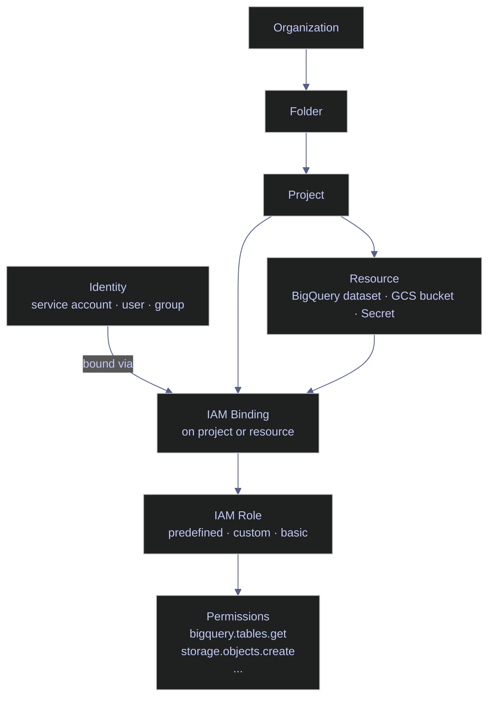
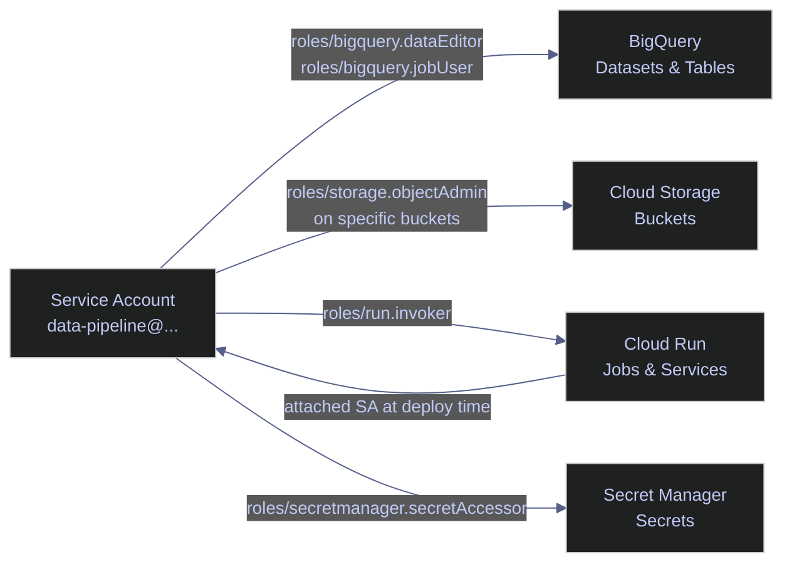

# Service Accounts and IAM — Securing the Pipeline

> [!quote]
> "The principle of least privilege requires that every module must be able to access only the information and resources that are necessary for its legitimate purpose."
>
> — **Jerome Saltzer**, MIT, formulator of the principle of least privilege

Every GCP resource is protected by Identity and Access Management (IAM). A pipeline's service account needs precisely the right permissions — too few and the pipeline fails, too many and a compromised credential becomes a security disaster. Least privilege is not a nice-to-have; it is the single most important security practice in cloud engineering.

IAM has three role types:

- **Basic roles** (`roles/viewer`, `roles/editor`, `roles/owner`): coarse-grained project-wide access — never assign to service accounts
- **Predefined roles**: service-specific, curated permission sets (e.g., `roles/bigquery.dataEditor`) — use these by default
- **Custom roles**: user-defined permission sets for fine-grained control when no predefined role fits exactly

> [!danger] Never Grant `roles/editor` or `roles/owner` to a Service Account
> These roles grant access to all project resources — compute, storage, IAM, billing, and more. A compromised service account with `roles/editor` can read all GCS buckets, modify any BigQuery table, and create new resources across the project. Most tutorials use these roles for convenience — this is wrong.
>
> [!success] Grant the minimum predefined role for each service. Where possible, scope bindings to the resource level (specific dataset, specific bucket) rather than the project.

> [!info] Prerequisites
> - APIs enabled by default in most projects: `iam.googleapis.com`, `cloudresourcemanager.googleapis.com`
> - For `gcloud asset analyze-iam-policy`: enable `cloudasset.googleapis.com`
> - IAM role to manage service accounts: `roles/iam.serviceAccountAdmin`
> - IAM role to manage project-level bindings: `roles/resourcemanager.projectIamAdmin`
> - Quota: 100 service accounts per project (default); increase via the IAM quotas page

> [!todo] Initial Service Account Setup
> 1. Create the service account: `gcloud iam service-accounts create`
> 2. Grant minimum IAM roles: `gcloud projects add-iam-policy-binding` (one invocation per role)
> 3. Attach the service account at deploy time (Cloud Run, GCE) — no key file needed in production
> 4. For local development only: `gcloud auth application-default login` for ADC credentials; download a key file only as a last resort



## Service Accounts

Service accounts are non-human identities for applications and pipelines. Every Cloud Run job, GCE VM, and automated script should use a dedicated service account — never a human account or the default compute service account.

### gcloud | Service account management

The service account email follows the pattern `<name>@<project>.iam.gserviceaccount.com`. The name must be 6–30 characters: lowercase letters, digits, and hyphens only.

#### gcloud | List service accounts

Lists all service accounts in the active project with their display name and disabled status.

```bash
gcloud iam service-accounts list
```

```text
EMAIL                                                           DISPLAY_NAME              DISABLED
data-pipeline@data-platform-prod.iam.gserviceaccount.com       Data Pipeline SA          False
```

#### gcloud | Create a service account

```bash
gcloud iam service-accounts create data-pipeline \
  --display-name="Data Pipeline Service Account" \
  --description="Runs ETL jobs on Cloud Run, reads/writes GCS and BigQuery"
```

```text
Created service account [data-pipeline].
```

#### gcloud | Describe a service account

Returns full metadata including the `uniqueId` (a stable numeric ID that survives display name renames) and `oauth2ClientId`.

```bash
gcloud iam service-accounts describe \
  data-pipeline@data-platform-prod.iam.gserviceaccount.com
```

```text
displayName: Data Pipeline Service Account
email: data-pipeline@data-platform-prod.iam.gserviceaccount.com
name: projects/data-platform-prod/serviceAccounts/data-pipeline@data-platform-prod.iam.gserviceaccount.com
projectId: data-platform-prod
uniqueId: '112233445566778899'
```

#### gcloud | Disable a service account

Disables the service account without deleting it — all authentication attempts are rejected while disabled. Use during incident response or key rotation.

```bash
gcloud iam service-accounts disable \
  data-pipeline@data-platform-prod.iam.gserviceaccount.com
```

#### gcloud | Enable a service account

Re-enables a previously disabled service account.

```bash
gcloud iam service-accounts enable \
  data-pipeline@data-platform-prod.iam.gserviceaccount.com
```

| Flag | Syntax | Description |
|---|---|---|
| `--display-name` | `--display-name="Pipeline SA"` | Human-readable name shown in Console and `list` output |
| `--description` | `--description="..."` | Free-text description of the account's purpose |
| `--filter` | `--filter="displayName:pipeline"` | Filter `list` output by display name or email substring |
| `--format` | `--format=json` | Output format: `table`, `json`, `yaml`, `value(email)` |
| `--project` | `--project=data-platform-prod` | GCP project ID; defaults to active `gcloud` configuration |

## Service Account Keys

Service account key files are long-lived credentials — they do not expire and cannot be revoked automatically. Any bearer of the JSON file can authenticate as the service account. Use them only for local development when Workload Identity Federation is not available.

> [!danger] Key Files Are Permanent Credentials
> A `key.json` file grants the same access as the service account itself with no expiry. A single leak in a git commit — even one later purged from history — can result in permanent unauthorized access until the key is manually deleted.
>
> [!success] Use the Metadata Server in Production
> On Cloud Run and GCE VMs, attach the pipeline service account at deploy time — no key file is ever created. The metadata server issues short-lived, auto-refreshing tokens automatically. For local development, `gcloud auth application-default login` provides ADC credentials without downloading a JSON key. For CI/CD pipelines, use Workload Identity Federation (see below). Delete any existing key with `gcloud iam service-accounts keys delete KEY_ID --iam-account=SA_EMAIL` once you have migrated to keyless auth.

### gcloud | Key management

Key IDs are 40-character hex strings. The `keys list` output distinguishes `USER_MANAGED` keys (manually created) from `SYSTEM_MANAGED` keys (used internally by GCP services).

#### gcloud | Create a key file

Generates a JSON key file on disk. Requires `roles/iam.serviceAccountKeyAdmin`.

```bash
gcloud iam service-accounts keys create key.json \
  --iam-account=data-pipeline@data-platform-prod.iam.gserviceaccount.com
```

```text
created key [a1b2c3d4e5f6789abcdef0123456789abcdef01] of type [json] as [key.json] for [data-pipeline@data-platform-prod.iam.gserviceaccount.com]
```

#### gcloud | List keys

Lists all active keys for a service account, including system-managed keys. Rotate `USER_MANAGED` keys every 90 days.

```bash
gcloud iam service-accounts keys list \
  --iam-account=data-pipeline@data-platform-prod.iam.gserviceaccount.com
```

```text
KEY_ID                                    CREATED_AT            EXPIRES_AT            KEY_TYPE
a1b2c3d4e5f6789abcdef0123456789abcdef01  2026-01-15T10:00:00Z  9999-12-31T23:59:59Z  USER_MANAGED
```

#### gcloud | Delete a key

Immediately revokes the key. The service account retains all other keys and IAM bindings.

```bash
gcloud iam service-accounts keys delete KEY_ID \
  --iam-account=data-pipeline@data-platform-prod.iam.gserviceaccount.com
```

| Flag | Syntax | Description |
|---|---|---|
| `--iam-account` | `--iam-account=SA_EMAIL` | Service account email (required for all key operations) |
| `--key-file-type` | `--key-file-type=json` | Key format: `json` (default) or `p12` |
| `--filter` | `--filter="keyType=USER_MANAGED"` | Filter `list` output by `USER_MANAGED` or `SYSTEM_MANAGED` |
| `--quiet` | `--quiet` | Skip deletion confirmation prompt |

## IAM Bindings

IAM bindings attach an identity (service account, user, or group) to a role on a resource. A binding on the project applies to all resources in that project; a binding scoped to a specific resource (dataset, bucket) is preferred for least-privilege.

For declarative, version-controlled IAM bindings, [terraform-iam-and-secrets](https://alp78.github.io/elysium/07-Terraform/GCP-Resources/terraform-iam-and-secrets) provides the Terraform equivalent of these `gcloud` commands.

### gcloud | Project-level IAM bindings

> [!info] IAM Binding Parameters
> - `--member` identifies **who** receives the role: `serviceAccount:`, `user:`, or `group:` prefix followed by the email
> - `--role` identifies **what** they can do: a predefined or custom IAM role ID

#### gcloud | Grant a role

Adds a single role binding and returns the updated IAM policy for the project.

```bash
gcloud projects add-iam-policy-binding data-platform-prod \
  --member="serviceAccount:data-pipeline@data-platform-prod.iam.gserviceaccount.com" \
  --role="roles/bigquery.dataEditor"
```

```text
Updated IAM policy for project [data-platform-prod].
bindings:
- members:
  - serviceAccount:data-pipeline@data-platform-prod.iam.gserviceaccount.com
  role: roles/bigquery.dataEditor
etag: BwX3abc...
version: 1
```

#### gcloud | View project IAM policy

Returns the full IAM policy for the project. Use `--format=json` for programmatic consumption.

```bash
gcloud projects get-iam-policy data-platform-prod --format=yaml
```

```text
bindings:
- members:
  - serviceAccount:data-pipeline@data-platform-prod.iam.gserviceaccount.com
  role: roles/bigquery.dataEditor
- members:
  - serviceAccount:data-pipeline@data-platform-prod.iam.gserviceaccount.com
  role: roles/bigquery.jobUser
etag: BwX3abc...
version: 1
```

#### gcloud | Remove a role

Removes a single role binding without affecting other bindings on the project.

```bash
gcloud projects remove-iam-policy-binding data-platform-prod \
  --member="serviceAccount:data-pipeline@data-platform-prod.iam.gserviceaccount.com" \
  --role="roles/bigquery.dataEditor"
```

```text
Updated IAM policy for project [data-platform-prod].
```

| Flag | Syntax | Description |
|---|---|---|
| `--member` | `--member="serviceAccount:SA_EMAIL"` | Identity receiving the role: `serviceAccount:`, `user:`, `group:`, `allUsers` |
| `--role` | `--role="roles/bigquery.dataEditor"` | Predefined or custom IAM role to grant or remove |
| `--condition` | `--condition=expression=...` | CEL expression for conditional bindings (time-based, resource-based) |
| `--format` | `--format=json` | Output format for the returned IAM policy: `yaml`, `json`, `table` |

## Testing IAM Permissions

### gcloud | Permission analysis and impersonation

#### gcloud | Analyze IAM policy

Checks what permissions an identity has on a specific resource. Requires `cloudasset.googleapis.com` and `roles/cloudasset.viewer` on the organization.

```bash
gcloud asset analyze-iam-policy \
  --organization=ORG_ID \
  --identity="serviceAccount:data-pipeline@data-platform-prod.iam.gserviceaccount.com" \
  --full-resource-name="//bigquery.googleapis.com/projects/data-platform-prod/datasets/project_data"
```

```text
analysisResults:
- attachedResourceFullName: //bigquery.googleapis.com/projects/data-platform-prod/datasets/project_data
  iamBinding:
    role: roles/bigquery.dataEditor
    members:
    - serviceAccount:data-pipeline@data-platform-prod.iam.gserviceaccount.com
  accessControlLists:
  - resources:
    - fullResourceName: //bigquery.googleapis.com/projects/data-platform-prod/datasets/project_data
```

#### gcloud | Test as service account with impersonation

Runs any `gcloud` command as the target service account without downloading a key. Requires `roles/iam.serviceAccountTokenCreator` on the service account. See [gcloud-output-formatting](https://alp78.github.io/elysium/06-GCP/Core/gcloud-output-formatting) for additional output flag patterns.

```bash
gcloud storage ls \
  --impersonate-service-account=data-pipeline@data-platform-prod.iam.gserviceaccount.com
```

```text
gs://data-platform-prod-raw/
gs://data-platform-prod-processed/
```

| Flag | Syntax | Description |
|---|---|---|
| `--organization` | `--organization=ORG_ID` | Scope analysis to the organization (required for `analyze-iam-policy`) |
| `--identity` | `--identity="serviceAccount:EMAIL"` | Identity to analyze: `serviceAccount:`, `user:`, or `group:` |
| `--full-resource-name` | `--full-resource-name="//bigquery..."` | Full GCP resource name in `//service/projects/.../path` format |
| `--impersonate-service-account` | `--impersonate-service-account=SA_EMAIL` | Run any `gcloud` command as the target service account |

## Minimum Role Set for Data Pipelines

> [!tip] Least Privilege Reference
>
> Minimum permission set for a data pipeline service account:
> - BigQuery: `roles/bigquery.dataEditor` + `roles/bigquery.jobUser`
> - GCS: `roles/storage.objectAdmin` (on specific buckets only, not project-wide)
> - Cloud Run: `roles/run.invoker` (to trigger jobs)
> - Secret Manager: `roles/secretmanager.secretAccessor` (to read credentials)
> - SQL Server: no IAM role needed — authentication is at the database level (see [sql-server-authentication](https://alp78.github.io/elysium/04-SQL-Server/01-Server-Operations/sql-server-authentication) for the parallel least-privilege patterns)



## Custom IAM Roles

Custom roles allow you to grant exactly the permissions needed and no more — finer-grained than any predefined role. Roles can be scoped to a project or an organization.

### gcloud | Custom role management

#### gcloud | Create a custom role

Permissions are comma-separated IAM permission strings (e.g., `bigquery.tables.get`). The role ID must be unique within the project and cannot be changed after creation.

```bash
gcloud iam roles create pipelineRole \
  --project=data-platform-prod \
  --title="Data Pipeline Role" \
  --description="Minimum permissions for the ETL pipeline" \
  --permissions="bigquery.tables.get,bigquery.tables.getData,bigquery.tables.updateData,bigquery.jobs.create,storage.objects.get,storage.objects.create"
```

```text
Created role [pipelineRole].
description: Minimum permissions for the ETL pipeline
etag: BwX3abc...
includedPermissions:
- bigquery.jobs.create
- bigquery.tables.get
- bigquery.tables.getData
- bigquery.tables.updateData
- storage.objects.create
- storage.objects.get
name: projects/data-platform-prod/roles/pipelineRole
stage: ALPHA
title: Data Pipeline Role
```

| Flag | Syntax | Description |
|---|---|---|
| `--project` | `--project=PROJECT_ID` | Scope role to a project (omit for org-level, use `--organization` instead) |
| `--title` | `--title="Role Name"` | Human-readable role name shown in Console |
| `--description` | `--description="..."` | Free-text description of the role's purpose |
| `--permissions` | `--permissions="perm1,perm2"` | Comma-separated IAM permission strings |
| `--stage` | `--stage=GA` | Role launch stage: `ALPHA` (default), `BETA`, `GA` |
| `--file` | `--file=role.yaml` | YAML/JSON file defining the role (alternative to `--permissions`) |

## Workload Identity Federation

Workload Identity Federation (WIF) lets external workloads — GitHub Actions, AWS Lambda, Azure pipelines, on-premises systems — authenticate to GCP without service account key files. The external workload presents its native credential (e.g., a GitHub OIDC token) to Google's Security Token Service (STS), which exchanges it for a short-lived GCP access token scoped to the attached service account.

> [!success] Prefer WIF Over Key Files for CI/CD
> GitHub Actions, GitLab CI, and most modern CI/CD platforms issue OIDC tokens natively. Configure WIF once per pipeline and eliminate all long-lived key files from CI/CD environments. Short-lived tokens issued by STS expire within the job — there is nothing to rotate or accidentally leak to a log.

### gcloud | WIF pool and provider setup

A **Workload Identity Pool** is a container for external identity providers. A **provider** within the pool defines the trust relationship with a specific OIDC or SAML issuer. The `attribute-condition` restricts which external tokens are accepted — always set this to prevent unauthorized use of the pool.

#### gcloud | Create an identity pool

```bash
gcloud iam workload-identity-pools create github-pool \
  --location=global \
  --display-name="GitHub Actions Pool" \
  --description="Allows GitHub Actions to authenticate to GCP"
```

```text
Created workload identity pool [github-pool].
```

#### gcloud | Create an OIDC provider

Maps GitHub OIDC claims to Google attributes. `attribute.repository` restricts access to a specific repository.

```bash
gcloud iam workload-identity-pools providers create-oidc github-provider \
  --workload-identity-pool=github-pool \
  --location=global \
  --issuer-uri="https://token.actions.githubusercontent.com" \
  --attribute-mapping="google.subject=assertion.sub,attribute.repository=assertion.repository" \
  --attribute-condition="assertion.repository=='myorg/myrepo'"
```

```text
Created workload identity pool provider [github-provider].
```

#### gcloud | Bind the provider to a service account

Grants the external workload permission to impersonate the service account. The `PROJECT_NUMBER` (not project ID) is required in the principal set URI.

```bash
gcloud iam service-accounts add-iam-policy-binding \
  data-pipeline@data-platform-prod.iam.gserviceaccount.com \
  --role=roles/iam.workloadIdentityUser \
  --member="principalSet://iam.googleapis.com/projects/PROJECT_NUMBER/locations/global/workloadIdentityPools/github-pool/attribute.repository/myorg/myrepo"
```

```text
Updated IAM policy for service account [data-pipeline@data-platform-prod.iam.gserviceaccount.com].
```

| Flag | Syntax | Description |
|---|---|---|
| `--location` | `--location=global` | Must be `global` for all WIF pool and provider operations |
| `--issuer-uri` | `--issuer-uri="https://..."` | OIDC token issuer URL (GitHub: `https://token.actions.githubusercontent.com`) |
| `--attribute-mapping` | `--attribute-mapping="google.subject=assertion.sub"` | Maps OIDC claims to Google attributes using CEL expressions |
| `--attribute-condition` | `--attribute-condition="assertion.repository=='org/repo'"` | CEL expression restricting which tokens are accepted — always set this |

## ADC and the Metadata Server

On GCE VMs and Cloud Run, credentials are provided automatically by the GCP metadata server — no key files needed. The metadata server issues short-lived, auto-refreshing tokens scoped to the service account attached to the VM or Cloud Run job at deploy time.

See [gcloud-authentication](https://alp78.github.io/elysium/06-GCP/Core/gcloud-authentication) for the full ADC credential search order, including how to activate a service account via `gcloud auth activate-service-account` for non-GCP environments.

## Related

- [gcp-identity-and-connection-patterns](https://alp78.github.io/elysium/06-GCP/Security/gcp-identity-and-connection-patterns) — Complete identity model, credential types, connection patterns by scenario
- [gcloud-authentication](https://alp78.github.io/elysium/06-GCP/Core/gcloud-authentication) — ADC credential search order; when key files vs metadata server applies
- [vpc-service-controls](https://alp78.github.io/elysium/06-GCP/Security/vpc-service-controls) — VPC-SC restricts what IAM-permitted identities can do with data
- [cloud-run-jobs-vs-services](https://alp78.github.io/elysium/06-GCP/Serverless/cloud-run-jobs-vs-services) — Attach the pipeline service account to Cloud Run jobs
- [gcs-buckets-and-lifecycle](https://alp78.github.io/elysium/06-GCP/Storage/gcs-buckets-and-lifecycle) — Grant `roles/storage.objectAdmin` on specific buckets only
- [dataset-and-table-management](https://alp78.github.io/elysium/06-GCP/BigQuery/dataset-and-table-management) — BigQuery roles required for table access
- [gcp-projects-and-apis](https://alp78.github.io/elysium/06-GCP/Core/gcp-projects-and-apis) — IAM policies are project-scoped
- [terraform-iam-and-secrets](https://alp78.github.io/elysium/07-Terraform/GCP-Resources/terraform-iam-and-secrets) — Declarative IAM bindings and secret access in Terraform

## References

- [IAM roles for BigQuery](https://cloud.google.com/bigquery/docs/access-control)
- [Service accounts overview](https://cloud.google.com/iam/docs/service-account-overview)
- [Workload Identity Federation](https://cloud.google.com/iam/docs/workload-identity-federation)
- [Organization Policy: disable SA key creation](https://cloud.google.com/resource-manager/docs/organization-policy/restricting-service-accounts)

