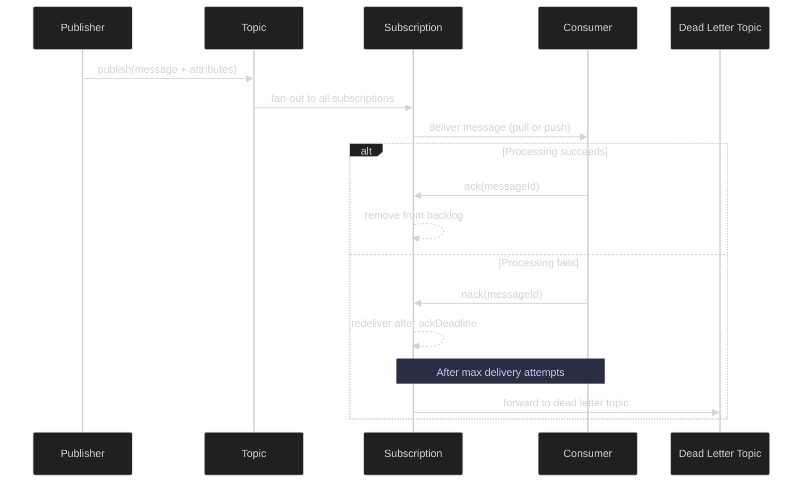
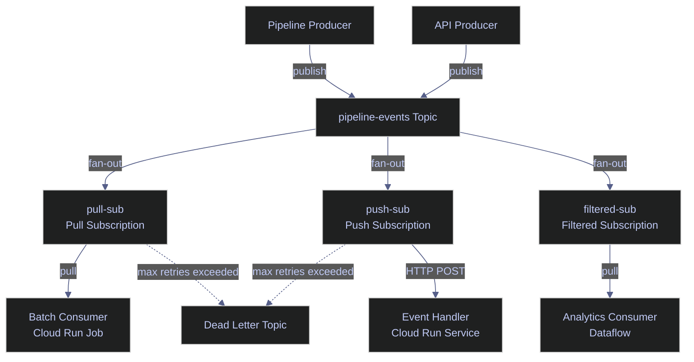

# Pub/Sub Publishing and Consuming Messages

> [!quote]
> "The basic problem of communication is that of reproducing at one point either exactly or approximately a message selected at another point."
>
> — **Claude Shannon**, *A Mathematical Theory of Communication* (1948)

Publishing to a Pub/Sub topic is a single `gcloud pubsub topics publish` command. Consuming is a `gcloud pubsub subscriptions pull`. In practice, production systems use client libraries (Python `google-cloud-pubsub` — see [24_py_streaming_realtime](https://alp78.github.io/elysium/02-Programming-Languages/Python/24_py_streaming_realtime), or C# — see [24_cs_streaming_realtime](https://alp78.github.io/elysium/02-Programming-Languages/CSharp/24_cs_streaming_realtime)) for both operations, but the CLI commands are essential for testing, debugging, and verifying message flow. The most important operational concept is that Pub/Sub delivers messages **at least once**, which means consumers must be idempotent.

> [!todo] Prerequisites
>
> 1. Enable the Pub/Sub API: `gcloud services enable pubsub.googleapis.com`
> 2. Ensure the publishing identity has `roles/pubsub.publisher` on the target topic
> 3. Ensure the consuming identity has `roles/pubsub.subscriber` on the target subscription
> 4. Create a topic and subscription first — see [pubsub-topics-and-subscriptions](https://alp78.github.io/elysium/06-GCP/Serverless/pubsub-topics-and-subscriptions)

> [!info] Pricing Model
>
> Pub/Sub charges per message operation (publish + pull/push delivery), with a 1 KB minimum per operation. Retained messages beyond the default 7-day retention window incur storage fees at the GCS Nearline rate. Seek operations on retained messages are billed separately. For high-throughput pipelines, the per-message cost is negligible — the storage cost of large backlogs is where budgets drift.



## Publishing Messages

Publishing sends a message (up to 10 MB) to a topic. Each message consists of a body (the data payload, base64-encoded internally) and optional attributes (string key-value metadata). All subscriptions attached to the topic receive a copy of every published message — this is the fan-out pattern that decouples producers from consumers.

### gcloud | Publish messages

The `gcloud pubsub topics publish` command publishes a single message to a topic. The message body is passed via `--message` and optional key-value metadata via `--attribute`. For batch publishing or high-throughput scenarios, use the Python or C# client libraries which support batching, compression, and flow control.

#### gcloud | Publish a basic message

Publish a JSON-encoded message to a topic. The message body is stored as a base64-encoded string internally — Pub/Sub treats it as an opaque byte sequence.

```bash
gcloud pubsub topics publish pipeline-events \
  --message='{"event":"pipeline_complete","index":"market_index","status":"success"}'
```

```text
messageIds:
- '12345678901234567'
```

#### gcloud | Publish with message attributes

Attributes are key-value string pairs attached as metadata separate from the message body. Consumers can filter on attributes without parsing the body, and subscriptions can be configured with server-side attribute filters to receive only matching messages.

```bash
gcloud pubsub topics publish pipeline-events \
  --message='Pipeline stage complete' \
  --attribute=stage=gold,index=market_index,run_id=20260309_1700
```

```text
messageIds:
- '12345678901234568'
```

> [!tip] Use Attributes for Filtering
>
> Pub/Sub supports server-side attribute filtering — subscriptions can be configured to only deliver messages matching specific attribute conditions. This means you can have one topic for all pipeline events but multiple subscriptions, each receiving only the events relevant to that consumer, without any client-side filtering.

| Flag | Syntax | Description |
|---|---|---|
| `--message` | `--message='...'` | Message body (string). Required unless `--message-file` is used |
| `--attribute` | `--attribute=key1=val1,key2=val2` | Comma-separated key-value attribute pairs |
| `--ordering-key` | `--ordering-key=my-key` | Ordering key for ordered delivery within the same key |
| `--message-file` | `--message-file=path/to/file` | Read message body from a file instead of inline |

## Consuming Messages

Consuming reads messages from a subscription. Pub/Sub supports two delivery modes: **pull** (the consumer requests messages) and **push** (Pub/Sub sends messages to an HTTPS endpoint). The `gcloud` CLI uses pull mode, which is also the default for most data pipeline consumers.

> [!question] Push vs Pull Subscriptions
>
> **Pull** — the consumer controls the pace. Best for batch pipelines, variable-rate processing, and consumers that need backpressure control. The consumer calls `pull()` or uses streaming pull to receive messages on demand.
>
> **Push** — Pub/Sub sends each message as an HTTP POST to a configured endpoint. Best for event-driven architectures where a Cloud Run service or Cloud Function processes messages as they arrive. The endpoint must return `2xx` to acknowledge; any other response triggers redelivery.
>
> For data engineering workloads, pull subscriptions are the default choice. Use push when the consumer is a stateless HTTP service (e.g., a Cloud Run service that transforms and forwards events).

### gcloud | Pull messages

The `gcloud pubsub subscriptions pull` command fetches messages from a pull subscription. With `--auto-ack`, messages are acknowledged immediately upon delivery — useful for testing but dangerous in production because failed processing cannot trigger redelivery.

#### gcloud | Pull messages with auto-ack

Pull up to N messages and acknowledge them immediately. Without `--auto-ack`, messages remain in the backlog after delivery, allowing you to peek without consuming.

```bash
gcloud pubsub subscriptions pull pipeline-sub --limit=10 --auto-ack
```

```text
┌──────────────────────────────────────────┬──────────────────┬──────────────────┬────────────────┐
│ DATA                                     │ MESSAGE_ID       │ ORDERING_KEY     │ ATTRIBUTES     │
├──────────────────────────────────────────┼──────────────────┼──────────────────┼────────────────┤
│ {"event":"pipeline_complete",...}         │ 12345678901234567│                  │ stage=gold     │
└──────────────────────────────────────────┴──────────────────┴──────────────────┴────────────────┘
```

> [!warning] Auto-Ack Is for Testing Only
>
> In production consumer code, never auto-acknowledge. Acknowledge only after successfully processing the message. If you auto-ack and your processing fails, the message is lost — no retry, no dead letter.

> [!success] Ack Only After Successful Processing
>
> In production consumer code (Python `google-cloud-pubsub` or C# `Google.Cloud.PubSub.V1`), call `ack()` only inside the success path of your message handler. Wrap the processing block in a try/except: on failure, either let the message timeout and be redelivered, or nack it explicitly. Pair with a dead letter topic so unprocessable messages don't block the queue indefinitely.

| Flag | Syntax | Description |
|---|---|---|
| `--auto-ack` | `--auto-ack` | Acknowledge messages immediately on delivery |
| `--limit` | `--limit=N` | Maximum number of messages to pull (default: 1) |
| `--wait` | `--wait` | Block until at least one message is available |
| `--format` | `--format=json` | Output format: `json`, `table`, `yaml`, `value` |

### Monitoring the Subscription Backlog

The subscription backlog is the count of messages delivered to a subscription but not yet acknowledged. A growing backlog means the consumer is slower than the producer — this is the primary indicator of pipeline lag.

#### gcloud | Describe subscription backlog

Query the number of undelivered messages for a subscription. This is a point-in-time snapshot; for continuous monitoring, use the Cloud Monitoring metric `pubsub.googleapis.com/subscription/num_undelivered_messages`.

```bash
gcloud pubsub subscriptions describe pipeline-sub \
  --format="value(numUndeliveredMessages)"
```

```text
1247
```

A non-zero value is normal during active processing. A *growing* value over successive checks indicates the consumer cannot keep up — scale out consumers or investigate processing bottlenecks. The same metric is available in [Cloud Monitoring](https://alp78.github.io/elysium/06-GCP/Logging/cloud-monitoring-metrics) for alerting and dashboarding.

> [!warning] Retained Messages Incur Storage Fees
>
> Messages retained beyond the default 7-day retention period (configurable up to 31 days) consume storage billed at the GCS Nearline rate. A large backlog combined with extended retention can accumulate significant storage costs silently.

> [!success] Set Retention and Alerts Proactively
>
> Set `--message-retention-duration` on the subscription to the minimum your replay requirements allow. Create a Cloud Monitoring alert on `num_undelivered_messages` exceeding a threshold to catch backlog growth before storage costs escalate.

### Ordering Keys and Exactly-Once Delivery

By default, Pub/Sub guarantees **at-least-once** delivery with **no ordering**. Messages may arrive out of order and may be delivered more than once. Two opt-in features change this behavior: ordering keys (for ordered delivery within a key) and exactly-once delivery (for deduplication at the subscription level).

> [!warning] At-Least-Once Means Duplicates Are Expected
>
> By default, Pub/Sub does **not** guarantee message ordering and **may deliver messages more than once**. For data pipelines, this means:
>
> 1. **Your consumers must be idempotent.** If a message is delivered twice, processing it twice must produce the same result as processing it once. Use MERGE (upsert) instead of INSERT.
> 2. **If you need ordering**, use ordering keys: `--ordering-key=market_index` ensures all messages with the same key arrive in order, but limits throughput to a single publisher thread per key.
> 3. **Exactly-once delivery** is available but requires enabling it on the subscription (`--enable-exactly-once-delivery`) and adds latency due to deduplication overhead.

> [!success] Design for Idempotency by Default
>
> Write all Pub/Sub consumers to be idempotent regardless of delivery mode. Use the Pub/Sub-provided `messageId` as part of your idempotency key, write to a staging table first, then MERGE into the production table. This pattern is safe under at-least-once, exactly-once, and replayed messages alike — no delivery guarantee changes require consumer code changes.

### Idempotency Patterns for At-Least-Once Delivery

Because Pub/Sub can redeliver messages, any pipeline stage consuming from a subscription must be idempotent — processing the same message twice must produce the same result. The standard pattern:

- Use **MERGE/UPSERT** instead of INSERT when writing to BigQuery or SQL Server
- Include a **unique message ID** (Pub/Sub provides one in `messageId`) in your idempotency key
- Write to a **staging table first**, then merge to production — the merge is idempotent even if repeated

### Message Format Best Practices

Structure messages as JSON with a consistent schema. Keep messages small (under 10 KB) — the hard limit is 10 MB, but large messages increase publish latency and per-operation cost. For large payloads, store the data in GCS and publish a pointer (GCS URI) in the message body.

```json
{
  "event": "pipeline_stage_complete",
  "stage": "gold",
  "index": "market_index",
  "run_id": "20260322_1700",
  "timestamp": "2026-03-22T17:00:00Z",
  "rows_processed": 5432
}
```

> [!info] Schema Validation on Topics
>
> Pub/Sub supports schema validation (GA) using Avro or Protocol Buffer schemas. When a schema is bound to a topic, messages that do not conform are rejected at publish time. This prevents malformed events from entering the pipeline. Create a schema with `gcloud pubsub schemas create` and bind it when creating the topic with `--schema=my-schema`.

For the broader architectural context of how Pub/Sub fits into event-driven pipelines, see [streaming-architecture](https://alp78.github.io/elysium/14-Data-Architecture/Architectures/streaming-architecture).



## Related

- [pubsub-topics-and-subscriptions](https://alp78.github.io/elysium/06-GCP/Serverless/pubsub-topics-and-subscriptions) — Creating topics, subscriptions, and dead letter queues
- [cloud-run-jobs-vs-services](https://alp78.github.io/elysium/06-GCP/Serverless/cloud-run-jobs-vs-services) — Cloud Run Services often serve as push subscription endpoints
- [cloud-monitoring-metrics](https://alp78.github.io/elysium/06-GCP/Logging/cloud-monitoring-metrics) — Monitor `pubsub.googleapis.com/subscription/num_undelivered_messages`
- [querying-and-cost-optimization](https://alp78.github.io/elysium/06-GCP/BigQuery/querying-and-cost-optimization) — Using MERGE (upsert) to maintain idempotency when writing to BigQuery
- [gcp-scheduling](https://alp78.github.io/elysium/12-Orchestration/Scheduling/gcp-scheduling) — Cloud Scheduler can publish to Pub/Sub topics on a cron schedule
- [Terraform Pub/Sub](https://alp78.github.io/elysium/07-Terraform) — Provision topics, subscriptions, and schemas as infrastructure-as-code

## References

- [Publishing messages](https://cloud.google.com/pubsub/docs/publisher)
- [Subscribing to messages](https://cloud.google.com/pubsub/docs/subscriber)
- [Message ordering](https://cloud.google.com/pubsub/docs/ordering)
- [Exactly-once delivery](https://cloud.google.com/pubsub/docs/exactly-once-delivery)
