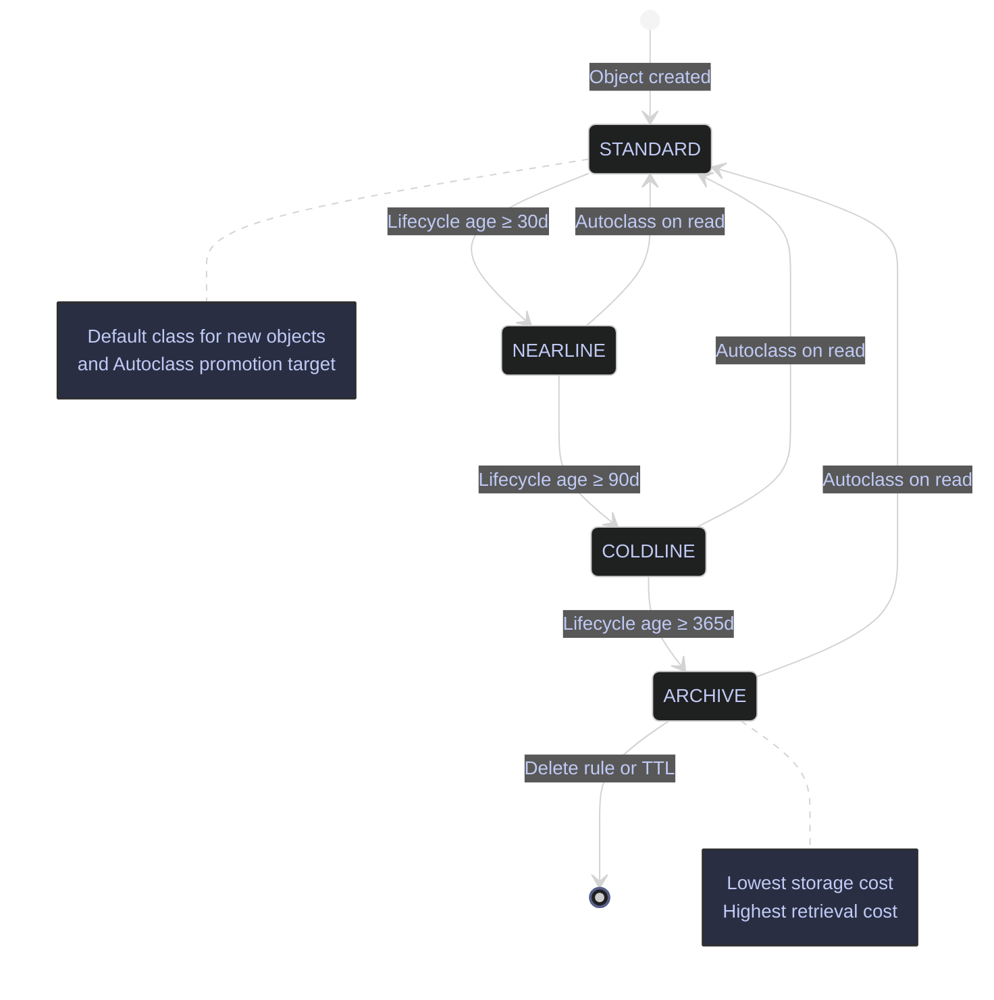

# GCS Buckets and Lifecycle — Storage Classes and Cost Management

> [!quote]
> "Storage is the most underrated enabler in cloud computing — it's only boring until it's gone."
>
> — **Adrian Cockcroft**, VP Cloud Architecture at AWS

Cloud Storage pricing is not uniform — there are four storage classes with different monthly storage costs and retrieval costs. The pattern is: lower storage cost = higher retrieval cost. Lifecycle rules automate the transition of objects through these classes as data ages, and automatic deletion at the end of the retention period. Aligning lifecycle deletion ages with your [backup retention policy](https://alp78.github.io/elysium/04-SQL-Server/01-Server-Operations/backup-types-and-strategy) ensures you never delete data that hasn't been backed up elsewhere. Configuring lifecycle rules on pipeline buckets is a one-time setup that permanently reduces storage costs without any ongoing maintenance.

> [!todo] Prerequisites
>
> 1. Enable the Cloud Storage API: `gcloud services enable storage.googleapis.com` (usually enabled by default on new projects)
> 2. IAM role: `roles/storage.admin` for bucket creation and lifecycle configuration; `roles/storage.objectAdmin` for object-level operations
> 3. Billing must be enabled on the project — GCS has no permanent free tier beyond the 5 GB Always Free allocation

## Bucket Creation

Creating a bucket defines its location, default storage class, and access control model. These properties are set at creation time — location cannot be changed after creation, and uniform bucket-level access cannot be reverted for 90 days once enabled.

### gcloud | Create a bucket

The `gcloud storage buckets create` command provisions a new GCS bucket. The `--location` flag accepts multi-region codes (`EU`, `US`, `ASIA`), dual-region codes (`EUR4`, `NAM4`), or single-region codes (`europe-west1`). The `--default-storage-class` flag sets the class applied to new objects unless overridden at upload time. The `--uniform-bucket-level-access` flag disables per-object ACLs and enforces IAM-only access control — this is simpler to manage, audit, and secure, and is the recommended setting for all new buckets.

```bash
gcloud storage buckets create gs://data-pipeline-pipeline-data \
  --location=EU \
  --default-storage-class=STANDARD \
  --uniform-bucket-level-access
```

```text
Creating gs://data-pipeline-pipeline-data/...
```

> [!danger] Publicly Accessible Buckets
>
> Never grant `allUsers` or `allAuthenticatedUsers` access to a bucket containing pipeline or business data. Public buckets are one of the most common sources of cloud data breaches. GCS does not warn you at bucket creation — the misconfiguration is silent.

> [!success] Enforce Organization Policy
>
> Use the Organization Policy constraint `constraints/storage.uniformBucketLevelAccess` to require uniform access on all new buckets, and `constraints/storage.publicAccessPrevention` to block public access project-wide. For individual buckets, always pass `--uniform-bucket-level-access` and verify with `gcloud storage buckets describe`.

> [!tip] Uniform Bucket-Level Access
>
> Once enabled, uniform bucket-level access cannot be disabled for 90 days. This is intentional — it prevents accidental reintroduction of per-object ACLs. Plan the migration from ACL-based access before enabling.

| Flag | Syntax | Description |
|---|---|---|
| `--location` | `--location=EU` | Physical storage location — multi-region (`EU`, `US`, `ASIA`), dual-region (`EUR4`, `NAM4`), or single region (`europe-west1`). Cannot be changed after creation |
| `--default-storage-class` | `--default-storage-class=STANDARD` | Default class for new objects: `STANDARD`, `NEARLINE`, `COLDLINE`, or `ARCHIVE` |
| `--uniform-bucket-level-access` | `--uniform-bucket-level-access` | Disable per-object ACLs, enforce IAM-only access control (recommended) |
| `--public-access-prevention` | `--public-access-prevention=enforced` | Block all public access to the bucket regardless of IAM or ACL settings |
| `--enable-autoclass` | `--enable-autoclass` | Enable Autoclass to automatically transition objects between storage classes based on access patterns |
| `--soft-delete-duration` | `--soft-delete-duration=7d` | Soft delete retention period (7d–90d). Set to `0` to disable |
| `--labels` | `--labels=team=data,env=prod` | Key-value labels for cost tracking and resource organization |

## Storage Classes and Cost Trade-offs

GCS offers four storage classes with an inverse cost relationship: lower storage cost means higher retrieval cost. Match the class to your access pattern — a single class change on a multi-TB bucket can save thousands per month. Choosing the right storage class is one of the most impactful [finops-cost-optimization](https://alp78.github.io/elysium/04-SQL-Server/01-Server-Operations/finops-cost-optimization) levers available in GCP.

| Class | Storage cost | Min duration | Retrieval cost | Availability (regional / multi-region) | Best for |
|---|---|---|---|---|---|
| STANDARD | $0.020/GB/mo | None | None | 99.9% / 99.95% | Active pipeline data |
| NEARLINE | $0.010/GB/mo | 30 days | $0.01/GB | 99.0% / 99.0% | Monthly reports, staging |
| COLDLINE | $0.004/GB/mo | 90 days | $0.02/GB | 99.0% / 99.0% | Quarterly backups |
| ARCHIVE | $0.0022/GB/mo | 365 days | $0.05/GB | 99.0% / 99.0% | Legal hold, long-term |

> [!info] Pricing Beyond Storage
>
> Storage class cost is only part of the total bill. GCS also charges for **operations** (Class A: create/list at ~$0.05/10K ops for Standard; Class B: read/get at ~$0.004/10K ops) and **network egress** ($0.12/GB for internet egress, free within the same region). For pipelines that write many small files, operation costs can exceed storage costs. Dual-region and multi-region pricing is higher — for example, Standard dual-region (NAM4/EUR4) is $0.044/GB/mo vs $0.020 for single-region.

> [!warning] Minimum Duration Charges
>
> Deleting or overwriting an object before its minimum storage duration expires still incurs the full duration charge. A NEARLINE object deleted at day 10 is billed for the remaining 20 days. COLDLINE has a 90-day minimum, ARCHIVE has 365 days. Only transition objects when you are confident they will not be deleted before the minimum duration expires.

> [!success] Align Lifecycle Ages to Access Patterns
>
> Set lifecycle transition ages to exceed the minimum storage durations: NEARLINE at 30+ days, COLDLINE at 90+ days, ARCHIVE at 365+ days. For pipeline staging buckets, a reliable pattern is: STANDARD for 30 days (active pipeline window) → NEARLINE at day 30 → COLDLINE at day 90 → delete at day 365. This guarantees no early-deletion charges while reducing storage costs progressively.

> [!warning] Frequent Access on Cold Storage
>
> Objects in NEARLINE, COLDLINE, or ARCHIVE that are accessed frequently incur retrieval fees on every read. A COLDLINE object read daily costs $0.02/GB × 30 = $0.60/GB/month in retrieval alone — far exceeding the $0.020/GB/month STANDARD storage cost.

> [!success] Use Autoclass for Unpredictable Access
>
> If access patterns are unpredictable or mixed, enable [Autoclass](#autoclass) instead of manually assigning storage classes. Autoclass transitions objects automatically based on actual access with no retrieval fees or early-deletion charges.

> [!tip] Small-File Antipattern
>
> Writing many small files (under a few hundred MB each) to GCS raises Class A operation costs disproportionately. Batch small records into larger files before upload — for example, aggregate JSON lines into hourly or daily Parquet files in your pipeline's staging step.

## Lifecycle Rules

Lifecycle rules automate object transitions between storage classes and automatic deletion based on object age, creation date, storage class, or version status. Rules are defined in a JSON file and applied to the bucket. Once configured, GCS evaluates rules daily and executes matching actions automatically — no ongoing maintenance required.

### Lifecycle Rule Configuration

A lifecycle rule consists of a **condition** (when to act) and an **action** (what to do). Multiple rules can be combined. The JSON structure uses an array of rule objects, each with exactly one action and one or more conditions that must all be true.

#### Define a lifecycle policy file

The following policy transitions objects through progressively cheaper storage classes and deletes them after one year. This is the standard pattern for pipeline staging buckets.

```json
{
  "rule": [
    {
      "action": {"type": "SetStorageClass", "storageClass": "NEARLINE"},
      "condition": {"age": 30}
    },
    {
      "action": {"type": "SetStorageClass", "storageClass": "COLDLINE"},
      "condition": {"age": 90}
    },
    {
      "action": {"type": "Delete"},
      "condition": {"age": 365}
    }
  ]
}
```

#### gcloud | Apply lifecycle rules to a bucket

The `--lifecycle-file` flag accepts a local JSON file path. Applying a new lifecycle file replaces all existing rules on the bucket.

```bash
gcloud storage buckets update gs://data-pipeline-pipeline-data \
  --lifecycle-file=lifecycle.json
```

```text
Updating gs://data-pipeline-pipeline-data/...
  Completed 1
```

#### gcloud | View current lifecycle rules

Inspect the lifecycle configuration currently applied to a bucket.

```bash
gcloud storage buckets describe gs://data-pipeline-pipeline-data \
  --format="json(lifecycle)"
```

> [!tip] Lifecycle Rules Are "Set and Forget"
>
> Rules are evaluated once per day. There is no guarantee of exact timing — an object at age 30 may be transitioned anytime during day 30 or 31. For pipeline staging buckets, a common pattern is: STANDARD for 30 days (active window) → NEARLINE for 60 days (occasional re-processing) → COLDLINE for 275 days (compliance retention) → deleted at 365 days.

> [!info] Lifecycle `age=0` Behavior Change
>
> Starting October 31, 2025, the `age=0` condition is satisfied at midnight UTC *after* the object's creation time — not immediately at creation. This change reduces unintended deletions of newly created objects by lifecycle rules with `age: 0` conditions.

| Flag | Syntax | Description |
|---|---|---|
| `--lifecycle-file` | `--lifecycle-file=lifecycle.json` | Path to a JSON file defining lifecycle rules. Replaces all existing rules |
| `--clear-lifecycle` | `--clear-lifecycle` | Remove all lifecycle rules from the bucket |
| `--format` | `--format="json(lifecycle)"` | Output format filter — use to inspect current lifecycle configuration |

### Autoclass

Autoclass is a bucket-level feature that automatically transitions objects between storage classes based on actual access patterns, removing the need to define manual lifecycle rules for tiering. All objects start in STANDARD. Objects 128 KiB or larger that are not accessed for 30 days transition to NEARLINE, then to COLDLINE at 90 days. With the optional Archive terminal class enabled, objects transition to ARCHIVE at 365 days. Any read access moves the object back to STANDARD immediately.

Autoclass charges a management fee of $0.0025 per 1,000 objects per month. In exchange, there are no retrieval fees, no early-deletion fees, and no class transition charges — the management fee replaces all of these. Objects smaller than 128 KiB remain permanently in STANDARD.

#### gcloud | Enable Autoclass on an existing bucket

```bash
gcloud storage buckets update gs://data-pipeline-pipeline-data \
  --enable-autoclass \
  --autoclass-terminal-storage-class=ARCHIVE
```

```text
Updating gs://data-pipeline-pipeline-data/...
  Completed 1
```

> [!question] Autoclass vs Manual Lifecycle Rules
>
> **Use Autoclass** when access patterns are unpredictable or mixed — Autoclass optimizes per-object based on actual reads, with no retrieval fee risk. **Use manual lifecycle rules** when access patterns are well-known and uniform (e.g., pipeline staging data that is never re-read after 7 days) — lifecycle rules give deterministic, auditable transitions and cost zero management fee.

> [!info] Autoclass Limitations
>
> Autoclass is incompatible with Sensitive Data Protection scanning. It cannot be combined with manual `SetStorageClass` lifecycle rules on the same bucket (deletion rules are allowed). Autoclass is available on regional, dual-region, and multi-region buckets.

### Object Lifecycle Diagram

The following diagram shows the standard object lifecycle through storage classes, with both manual lifecycle rule transitions and Autoclass behavior.



## Object Versioning and Recovery

Object versioning and soft delete are two complementary mechanisms for protecting against accidental data loss. Versioning retains previous versions of overwritten objects indefinitely (until explicitly deleted or cleaned by lifecycle rules). Soft delete retains deleted objects for a configurable window. Both incur storage costs for retained copies — pair with lifecycle rules to cap retention and prevent unbounded growth.

### gcloud | Enable object versioning

When versioning is enabled, every overwrite creates a new version of the object instead of replacing it. The previous version becomes "noncurrent" and remains accessible. This protects against accidental overwrites and enables point-in-time recovery.

```bash
gcloud storage buckets update gs://data-pipeline-pipeline-data --versioning
```

```text
Updating gs://data-pipeline-pipeline-data/...
  Completed 1
```

#### List all versions of an object

The `-a` flag includes noncurrent (archived) versions in the listing, showing generation numbers for each version.

```bash
gcloud storage ls -a gs://data-pipeline-pipeline-data/file.csv
```

> [!info] Versioning with Lifecycle Rules
>
> Noncurrent versions are stored at full object cost — not as diffs. For buckets with frequent overwrites, versioning costs can grow rapidly. Add a lifecycle rule with `"isLive": false` to delete noncurrent versions after N days, retaining a recovery window without unbounded storage growth. Example condition: `{"age": 7, "isLive": false}` deletes noncurrent versions older than 7 days.

> [!tip] Terraform Provisioning
>
> For reproducible bucket provisioning with versioning and lifecycle rules baked in, use [Terraform storage blocks](https://alp78.github.io/elysium/07-Terraform/Block-Library/tf-compute-and-storage) instead of manual `gcloud` commands.

### Soft Delete

Soft delete is a bucket-level feature that retains deleted objects for a configurable retention period (7–90 days), allowing recovery without versioning. Soft delete has been **enabled by default on all new buckets since March 2024** with a 7-day retention period.

Soft-deleted objects are billed at the same storage rate as live objects for the full retention period. For buckets holding short-lived or temporary data (ETL staging, intermediate pipeline files), this default can add significant unexpected cost.

#### gcloud | Configure soft delete retention

```bash
gcloud storage buckets update gs://data-pipeline-pipeline-data \
  --soft-delete-duration=7d
```

#### gcloud | Disable soft delete

```bash
gcloud storage buckets update gs://data-pipeline-pipeline-data \
  --soft-delete-duration=0
```

> [!warning] Soft Delete Default-On Billing
>
> Soft delete is enabled by default with 7-day retention. For a bucket where 100 TB of objects are deleted per month, the 7-day soft delete retention adds approximately $460/month at Standard regional rates. This cost is invisible unless you check the billing breakdown by SKU.

> [!success] Disable on Staging and ETL Buckets
>
> For buckets that hold ephemeral pipeline data (staging files, intermediate transforms, temp exports), set `--soft-delete-duration=0` at bucket creation. Use the [Soft Delete Recommender](https://cloud.google.com/storage/docs/soft-delete#recommender) in the Cloud Console to identify buckets where soft delete costs exceed recovery value. For critical data buckets, keep the default or increase to 30–90 days.

## Retention Policies and Bucket Lock

Retention policies enforce a minimum retention period on all objects in a bucket — objects cannot be deleted or overwritten until the retention period expires. Bucket Lock makes this policy permanent and irreversible, providing WORM (Write Once, Read Many) compliance for regulatory requirements including SEC Rule 17a-4(f), FINRA, and CFTC.

### Bucket-Level Retention Policy

A retention policy sets a minimum age (in seconds) for all objects. While active, no object in the bucket can be deleted before the retention period elapses from its creation time.

#### gcloud | Set a retention policy

```bash
gcloud storage buckets update gs://data-pipeline-pipeline-data \
  --retention-period=2592000s
```

The value is in seconds — `2592000s` equals 30 days. To remove the policy (only possible if the bucket is not locked):

```bash
gcloud storage buckets update gs://data-pipeline-pipeline-data \
  --clear-retention-period
```

### Bucket Lock (Irreversible WORM)

Locking a retention policy is a **permanent, irreversible** operation. Once locked, the retention period can only be increased, never decreased or removed. The bucket itself cannot be deleted until every object has exceeded its retention period.

#### gcloud | Lock a retention policy

```bash
gcloud storage buckets update gs://data-pipeline-pipeline-data --lock-retention-period
```

> [!danger] Bucket Lock Is Irreversible
>
> There is no way to unlock a locked retention policy, shorten the retention period, or delete the bucket before all objects have aged past their retention. Test retention policies thoroughly on a non-production bucket before locking.

> [!success] Test Before Locking
>
> Apply the retention policy without locking first and verify that pipeline operations (overwrites, deletions, lifecycle transitions) work correctly with the retention constraint. Only lock when you have confirmed the retention period meets compliance requirements and does not interfere with normal operations.

### Per-Object Retention Lock

Per-object retention sets a `retain-until` timestamp on individual objects, independent of any bucket-level policy. This allows different retention periods for different objects within the same bucket. When both bucket-level and per-object retention apply, the longer of the two governs.

> [!info] Retention Lock and Autoclass
>
> Per-object retention locks are compatible with Autoclass — the lock survives storage class transitions. Objects under retention lock can still be transitioned between classes, only deletion is blocked.

## Bucket Location and Data Residency

The `--location` flag at bucket creation determines where data is physically stored. This choice is permanent — location cannot be changed after bucket creation. It affects latency, availability, cost, and regulatory compliance.

| Location type | Example | Replication | Cost | Use case |
|---|---|---|---|---|
| **Single region** | `europe-west1` | Single datacenter | Lowest | Low-latency access within one region |
| **Dual-region** | `EUR4` (Finland + Netherlands) | Two specific regions | Medium | Disaster recovery with controlled geography |
| **Multi-region** | `EU` | Multiple regions within continent | Highest | Maximum availability, geo-redundant |

For data residency compliance (GDPR, financial regulations), use a specific single region or the `EU` multi-region. Multi-region `EU` guarantees data stays within EU boundaries but does not let you choose which specific regions are used.

> [!tip] Co-Locate with Compute
>
> Place buckets in the same region as the services that read from them — Cloud Run Jobs, BigQuery datasets, and Dataflow pipelines. Cross-region reads incur egress charges ($0.01–$0.08/GB depending on source and destination) and add latency. For BigQuery, the dataset region and bucket region must match for `LOAD DATA` operations.

## Quotas and Limits

Key GCS limits relevant to data engineering pipelines:

| Limit | Value |
|---|---|
| Max object size | 5 TiB |
| Max composite object components | 32 |
| Lifecycle prefix/suffix conditions per bucket | 1,000 |
| Bucket count per project | Soft quota (requestable increase) |
| Max `gsutil`/`gcloud storage` parallel threads | 96 (default: based on CPU count) |
| Bandwidth throttling response | `429 rateLimitExceeded` (retryable with exponential backoff) |

## Related

- [gcs-object-operations](https://alp78.github.io/elysium/06-GCP/Storage/gcs-object-operations) — Uploading, syncing, moving, and deleting objects within these buckets
- [data-loading-and-export](https://alp78.github.io/elysium/06-GCP/BigQuery/data-loading-and-export) — Loading bucket contents into BigQuery; exporting BigQuery to buckets
- [service-accounts-and-iam](https://alp78.github.io/elysium/06-GCP/Security/service-accounts-and-iam) — `roles/storage.objectAdmin` on specific buckets (not the project)
- [gcp-projects-and-apis](https://alp78.github.io/elysium/06-GCP/Core/gcp-projects-and-apis) — `storage.googleapis.com` is usually enabled by default
- [tf-compute-and-storage](https://alp78.github.io/elysium/07-Terraform/Block-Library/tf-compute-and-storage) — Terraform provisioning of GCS buckets with lifecycle rules, versioning, and retention
- [finops-cost-optimization](https://alp78.github.io/elysium/04-SQL-Server/01-Server-Operations/finops-cost-optimization) — FinOps cost optimization strategies including storage class selection

## References

- [Storage classes](https://cloud.google.com/storage/docs/storage-classes)
- [Lifecycle configuration](https://cloud.google.com/storage/docs/lifecycle)
- [Object versioning](https://cloud.google.com/storage/docs/object-versioning)
- [Autoclass](https://cloud.google.com/storage/docs/autoclass)
- [Soft delete](https://cloud.google.com/storage/docs/soft-delete)
- [Bucket Lock and retention policies](https://cloud.google.com/storage/docs/bucket-lock)
- [Object Retention Lock](https://cloud.google.com/storage/docs/object-lock)
- [Pricing](https://cloud.google.com/storage/pricing)
- [Quotas and limits](https://cloud.google.com/storage/quotas)

