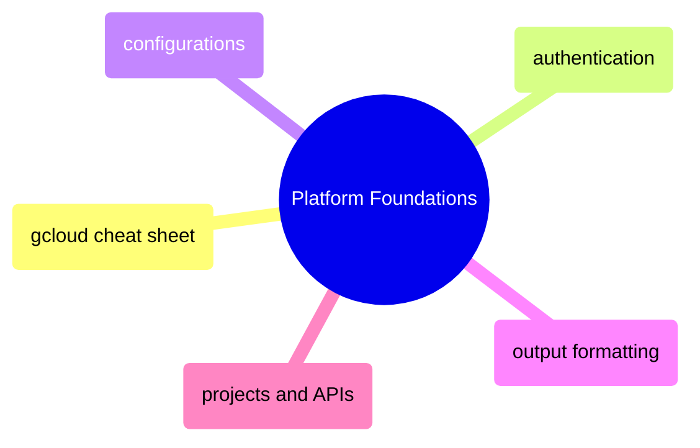
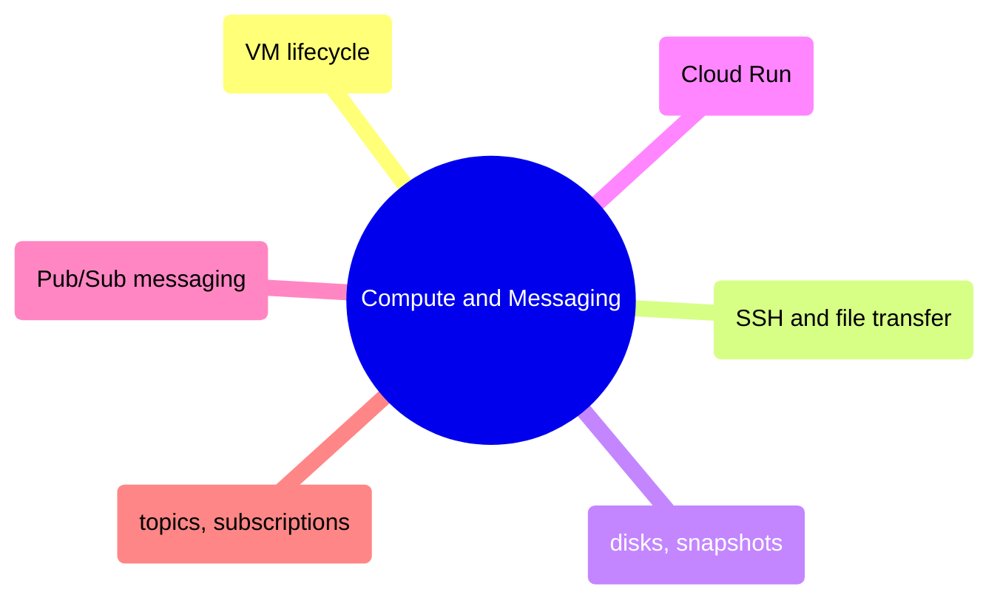
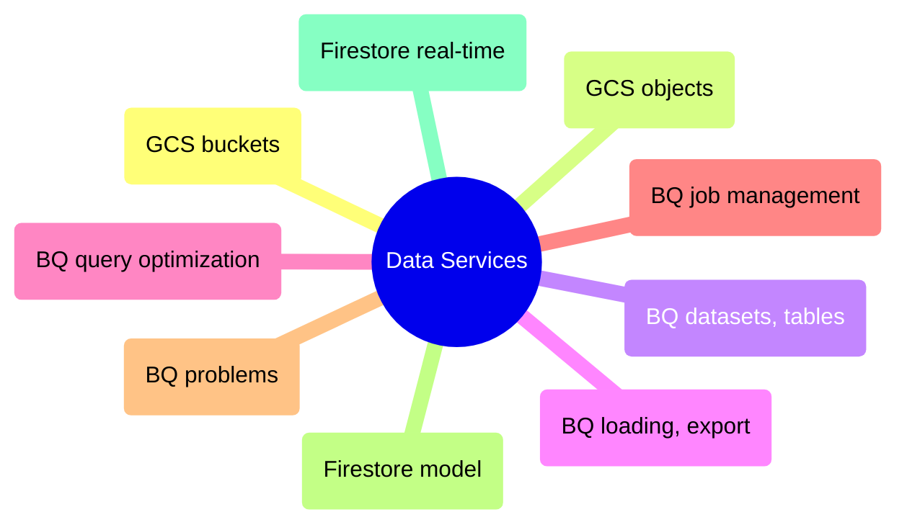
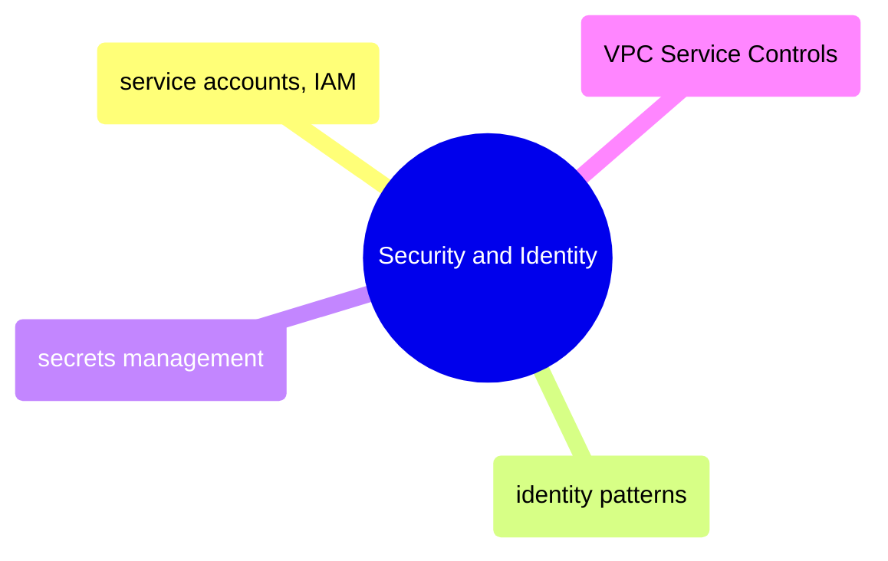
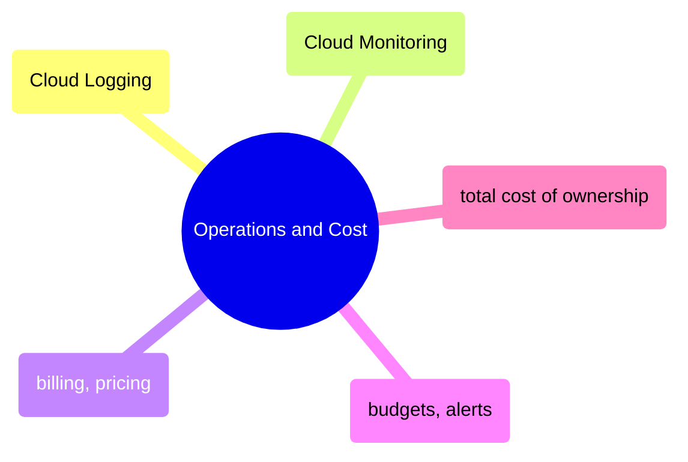

# MOC: GCP

Google Cloud Platform from authentication to cost optimization — 29 pages
covering platform setup, compute, data services, security, and operations.
Expand any section below to browse page contents.

> [!example]- Platform Foundations
>
> > [!abstract]- [[gcloud-cheat-sheet]]
> >
> > - [[gcloud-cheat-sheet#gcloud Command Structure and Anatomy|Command structure]]
> > - [[gcloud-cheat-sheet#gcloud Global Flags Reference|Global flags]]
> > - [[gcloud-cheat-sheet#BigQuery (bq CLI)|BigQuery bq CLI]]
> > - [[gcloud-cheat-sheet#Cloud Storage (gcloud storage)|Cloud Storage]]
> > - [[gcloud-cheat-sheet#Quick Reference: Useful gcloud One-Liners|Useful one-liners]]
>
> > [!abstract]- [gcloud-authentication](/06-GCP/Core/gcloud-authentication)
> >
> > - [Authentication commands](/06-GCP/Core/gcloud-authentication#authentication-commands)
> > - [ADC credential search order](/06-GCP/Core/gcloud-authentication#the-adc-credential-search-order)
> > - [Gotchas and edge cases](/06-GCP/Core/gcloud-authentication#gcp-authentication-gotchas-and-edge-cases)
>
> > [!abstract]- [[gcloud-configurations]]
> >
> > - [[gcloud-configurations#Creating and Switching Configurations|Creating and switching configs]]
> > - [[gcloud-configurations#Protecting Production with Visual Cues in Terminal|Production visual cues]]
> > - [[gcloud-configurations#Why Named Configurations Matter for Multi-Project Safety|Multi-project safety]]
>
> > [!abstract]- [[gcloud-output-formatting]]
> >
> > - [[gcloud-output-formatting#Output Format Options|Format options]]
> > - [[gcloud-output-formatting#Server-Side Filtering with|Server-side filtering]]
> > - [[gcloud-output-formatting#Service Account Impersonation with gcloud|Service account impersonation]]
> > - [[gcloud-output-formatting#Common gcloud Format Transformation Functions|Transformation functions]]
>
> > [!abstract]- [[gcp-projects-and-apis]]
> >
> > - [[gcp-projects-and-apis#Listing and Describing GCP Projects|Listing projects]]
> > - [[gcp-projects-and-apis#Listing and Enabling GCP APIs|Enabling APIs]]
> > - [[gcp-projects-and-apis#Common GCP APIs for Data Engineering|Common APIs for data engineering]]

> [!example]- Compute and Messaging
>
> > [!abstract]- [[vm-lifecycle]]
> >
> > - [[vm-lifecycle#VM Start, Stop, and Reset Operations|Start, stop, and reset]]
> > - [[vm-lifecycle#Resizing a VM by Changing Machine Type|Resizing machine type]]
> > - [[vm-lifecycle#Right-Sizing VMs with Cloud Monitoring Data|Right-sizing with metrics]]
> > - [[vm-lifecycle#Scheduled Start|Scheduled start and stop]]
> > - [[vm-lifecycle#Compute Engine Machine Type Selection Guide|Machine type selection]]
>
> > [!abstract]- [[vm-ssh-and-file-transfer]]
> >
> > - [[vm-ssh-and-file-transfer#SSH into a Compute Engine VM via IAP|SSH via IAP]]
> > - [[vm-ssh-and-file-transfer#Running Remote Commands Non-Interactively on a VM|Remote commands]]
> > - [[vm-ssh-and-file-transfer#Copying Files To and From VMs with gcloud compute scp|File transfer with scp]]
> > - [[vm-ssh-and-file-transfer#Handling Permission Errors on SCP|Permission errors]]
>
> > [!abstract]- [[disks-and-snapshots]]
> >
> > - [[disks-and-snapshots#Creating Disk Snapshots Before Risky Changes|Creating snapshots]]
> > - [[disks-and-snapshots#Restoring a Disk from a Snapshot|Restoring from snapshot]]
> > - [[disks-and-snapshots#Resizing a Persistent Disk|Resizing disks]]
> > - [[disks-and-snapshots#Serial Console — When SSH Fails|Serial console]]
>
> > [!abstract]- [[cloud-run-jobs-vs-services]]
> >
> > - [[cloud-run-jobs-vs-services#Cloud Run Jobs vs Services Comparison|Jobs vs Services comparison]]
> > - [[cloud-run-jobs-vs-services#Listing and Executing Cloud Run Jobs|Executing jobs]]
> > - [[cloud-run-jobs-vs-services#Updating Cloud Run Job Configuration|Updating job configuration]]
> > - [[cloud-run-jobs-vs-services#Cloud Run Cold Start Mitigation|Cold start mitigation]]
> > - [[cloud-run-jobs-vs-services#Cloud Run Environment Variables and Secrets|Environment variables and secrets]]
>
> > [!abstract]- [[pubsub-messaging]]
> >
> > - [[pubsub-messaging#Publishing Messages|Publishing messages]]
> > - [[pubsub-messaging#Consuming Messages|Consuming messages]]
> > - [[pubsub-messaging#Monitoring the Pub|Subscription backlog monitoring]]
> > - [[pubsub-messaging#Pub|Ordering keys and exactly-once]]
> > - [[pubsub-messaging#Pub|At-least-once idempotency]]
>
> > [!abstract]- [[pubsub-topics-and-subscriptions]]
> >
> > - [[pubsub-topics-and-subscriptions|Why Pub/Sub for pipelines]]
> > - [[pubsub-topics-and-subscriptions|Creating topics and subscriptions]]
> > - [[pubsub-topics-and-subscriptions|Pull vs push comparison]]
> > - [[pubsub-topics-and-subscriptions|Dead letter topics]]
> > - [[pubsub-topics-and-subscriptions#Pub|Pull vs Push comparison]]

> [!example]- Data Services
>
> > [!abstract]- [[gcs-buckets-and-lifecycle]]
> >
> > - [[gcs-buckets-and-lifecycle#Creating GCS Buckets with gcloud storage|Creating buckets]]
> > - [[gcs-buckets-and-lifecycle#GCS Storage Classes and Cost Trade-offs|Storage classes and costs]]
> > - [[gcs-buckets-and-lifecycle#GCS Lifecycle Rules for Auto-Tiering|Lifecycle auto-tiering]]
> > - [[gcs-buckets-and-lifecycle#GCS Object Versioning|Object versioning]]
> > - [[gcs-buckets-and-lifecycle#GCS Bucket Location and Data Residency|Location and data residency]]
>
> > [!abstract]- [[gcs-object-operations]]
> >
> > - [[gcs-object-operations#Copying Files with gcloud storage cp|Copying files]]
> > - [[gcs-object-operations#Incremental Sync with gcloud storage rsync|Incremental sync with rsync]]
> > - [[gcs-object-operations#Moving and Deleting GCS Objects|Moving and deleting]]
> > - [[gcs-object-operations#GCS Transfer Optimization and Parallel Uploads|Parallel uploads]]
> > - [[gcs-object-operations#Common GCS Pipeline Patterns|Pipeline patterns]]
>
> > [!abstract]- [[dataset-and-table-management]]
> >
> > - [[dataset-and-table-management#Inspecting BigQuery Schema and Metadata|Schema and metadata]]
> > - [[dataset-and-table-management#Creating BigQuery Datasets|Creating datasets]]
> > - [[dataset-and-table-management#Creating Tables|Creating tables]]
> > - [[dataset-and-table-management#Deleting BigQuery Tables and Datasets|Deleting tables and datasets]]
> > - [[dataset-and-table-management#BigQuery Column Types Reference|Column types reference]]
>
> > [!abstract]- [[data-loading-and-export]]
> >
> > - [[data-loading-and-export#Loading Data from GCS|Loading data from GCS]]
> > - [[data-loading-and-export#Exporting BigQuery Data to GCS|Exporting to GCS]]
> > - [[data-loading-and-export#BigQuery Time Travel — Querying Historical Data|Time travel queries]]
> > - [[data-loading-and-export#Restoring a BigQuery Table from Time Travel|Restoring from time travel]]
> > - [[data-loading-and-export#BigQuery Data Format Comparison|Format comparison]]
>
> > [!abstract]- [[querying-and-cost-optimization]]
> >
> > - [[querying-and-cost-optimization#Running BigQuery Queries with bq query|Running queries]]
> > - [[querying-and-cost-optimization#BigQuery Dry Run — Estimate Cost Before Executing|Dry run cost estimation]]
> > - [[querying-and-cost-optimization#BigQuery Parameterized Queries for Caching and Injection Prevention|Parameterized queries]]
> > - [[querying-and-cost-optimization#Cost Optimization — The 80|Cost optimization rules]]
> > - [[querying-and-cost-optimization#BigQuery Cost Estimation Quick Reference|Cost estimation reference]]
>
> > [!abstract]- [[job-management]]
> >
> > - [[job-management#Listing Recent BigQuery Jobs|Listing jobs]]
> > - [[job-management#Inspecting BigQuery Job Details|Inspecting job details]]
> > - [[job-management#Canceling a Running BigQuery Query|Canceling queries]]
> > - [[job-management#BigQuery Job States Reference|Job states reference]]
> > - [[job-management#Cost Recovery by Querying BigQuery Job History with SQL|Cost recovery via job history]]
>
> > [!abstract]- [[bigquery-problems]]
> >
> > - [[bigquery-problems#Critical — Cost Explosion|Critical: cost and data loss]]
> > - [[bigquery-problems#High — Data Quality|High: data quality and performance]]
> > - [[bigquery-problems#Moderate — Operational Pain|Moderate: operational pain]]
> > - [[bigquery-problems#Low — Annoyances|Low: annoyances and tech debt]]
>
> > [!abstract]- [[firestore-data-model-and-operations]]
> >
> > - [[firestore-data-model-and-operations#What Is Firestore|What is Firestore]]
> > - [[firestore-data-model-and-operations#Data Model|Data model]]
> > - [[firestore-data-model-and-operations#CRUD Operations (Python SDK)|CRUD operations]]
> > - [[firestore-data-model-and-operations#Querying|Querying]]
> > - [[firestore-data-model-and-operations#Data Engineering Patterns with Firestore|Data engineering patterns]]
>
> > [!abstract]- [[real-time-nosql-pipelines]]
> >
> > - [[real-time-nosql-pipelines#When to Use Real-Time NoSQL Pipelines|When to use real-time]]
> > - [[real-time-nosql-pipelines#Architecture Patterns|Architecture patterns]]
> > - [[real-time-nosql-pipelines#Implementation: Complete Pipeline State Store|Pipeline state store]]
> > - [[real-time-nosql-pipelines#Monitoring and Observability|Monitoring and observability]]
> > - [[real-time-nosql-pipelines#Cost Optimization|Cost optimization]]

> [!example]- Security and Identity
>
> > [!abstract]- [[service-accounts-and-iam]]
> >
> > - [[service-accounts-and-iam#GCP Service Accounts — Machine Identities|Service accounts]]
> > - [[service-accounts-and-iam#IAM Bindings — Granting Roles to Service Accounts|IAM role bindings]]
> > - [[service-accounts-and-iam#Testing IAM Permissions|Testing permissions]]
> > - [[service-accounts-and-iam#Minimum IAM Permission Set for a Data Pipeline|Minimum pipeline permissions]]
> > - [[service-accounts-and-iam#Custom IAM Roles for Tighter Control|Custom roles]]
>
> > [!abstract]- [[gcp-identity-and-connection-patterns]]
> >
> > - [[gcp-identity-and-connection-patterns#The GCP Identity Model|Identity model]]
> > - [[gcp-identity-and-connection-patterns#Authentication Methods — Complete Framework|Authentication methods]]
> > - [[gcp-identity-and-connection-patterns#Connection Patterns by Scenario|Connection patterns by scenario]]
> > - [[gcp-identity-and-connection-patterns#The Certificate and TLS Landscape|Certificates and TLS]]
> > - [[gcp-identity-and-connection-patterns#Anti-Patterns|Anti-patterns]]
>
> > [!abstract]- [[secrets-management]]
> >
> > - [[secrets-management#GCP Secret Manager|GCP Secret Manager]]
> > - [[secrets-management#Airflow Integration|Airflow integration]]
> > - [[secrets-management#GitHub Actions|GitHub Actions]]
> > - [[secrets-management#Secret Rotation Procedure|Secret rotation]]
> > - [[secrets-management#Secret Management Anti-Patterns|Anti-patterns]]
>
> > [!abstract]- [[vpc-service-controls]]
> >
> > - [[vpc-service-controls#The Data Exfiltration Threat Model|Data exfiltration threat model]]
> > - [[vpc-service-controls#Setting Up a VPC-SC Perimeter|Setting up a perimeter]]
> > - [[vpc-service-controls#What VPC-SC Blocks vs Allows|What VPC-SC blocks vs allows]]
> > - [[vpc-service-controls#Debugging VPC-SC Denial Errors|Debugging denial errors]]
> > - [[vpc-service-controls#VPC-SC Ingress and Egress Policies|Ingress and egress policies]]

> [!example]- Operations and Cost
>
> > [!abstract]- [[cloud-logging]]
> >
> > - [[cloud-logging#Filtering Cloud Logs by Severity|Filtering by severity]]
> > - [[cloud-logging#Combining Log Filters for Incident Response|Incident response filters]]
> > - [[cloud-logging#Tailing Cloud Logs in Real-Time|Real-time tailing]]
> > - [[cloud-logging#Cloud Logging Filter Language Reference|Filter language reference]]
> > - [[cloud-logging#Common Cloud Logging Resource Types for Data Engineering|Resource types for data engineering]]
>
> > [!abstract]- [[cloud-monitoring-metrics]]
> >
> > - [[cloud-monitoring-metrics#Reading Time-Series Metric Data|Reading time-series data]]
> > - [[cloud-monitoring-metrics#Key Cloud Monitoring Metrics for Data Engineers|Key metrics for data engineers]]
> > - [[cloud-monitoring-metrics#Metrics vs Logs — When to Use Each|Metrics vs logs]]
> > - [[cloud-monitoring-metrics#Cloud Monitoring Alerting Policies|Alerting policies]]
>
> > [!abstract]- [[gcp-billing-and-pricing]]
> >
> > - [[gcp-billing-and-pricing#GCP Billing Fundamentals|Billing fundamentals]]
> > - [[gcp-billing-and-pricing#Pricing for Every GCP Data Engineering Service|Per-service pricing]]
> > - [[gcp-billing-and-pricing#Cost Governance Patterns|Cost governance patterns]]
> > - [[gcp-billing-and-pricing#FinOps Checklist|FinOps checklist]]
> > - [[gcp-billing-and-pricing#GCP Free Tiers Quick Reference|Free tiers reference]]
>
> > [!abstract]- [[gcp-cost-monitoring-and-budgets]]
> >
> > - [[gcp-cost-monitoring-and-budgets#Setting Up Billing Export to BigQuery|Billing export setup]]
> > - [[gcp-cost-monitoring-and-budgets#Budget Alerts|Budget alerts]]
> > - [[gcp-cost-monitoring-and-budgets#Cost Anomaly Detection|Anomaly detection]]
> > - [[gcp-cost-monitoring-and-budgets#Cost Optimization Strategies|Optimization strategies]]
> > - [[gcp-cost-monitoring-and-budgets#Cost Dashboard in BigQuery|Cost dashboard]]
>
> > [!abstract]- [[gcp-total-cost-of-ownership]]
> >
> > - [[gcp-total-cost-of-ownership#How to Calculate TCO for a Data Pipeline|TCO calculation method]]
> > - [[gcp-total-cost-of-ownership#Reference Architecture 1: Small Batch Pipeline (~$100–150|Small batch pipeline]]
> > - [[gcp-total-cost-of-ownership#Reference Architecture 2: Medium Pipeline with SQL Server (~$200–400|Medium pipeline with SQL Server]]
> > - [[gcp-total-cost-of-ownership#Reference Architecture 3: Production Platform (~$800–1,500|Production platform]]
> > - [[gcp-total-cost-of-ownership#Cost Comparison: GCP vs AWS vs Azure|Multi-cloud cost comparison]]

## Cross-References

- [Terraform](/07-Terraform/moc-terraform) — Infrastructure-as-code for provisioning GCP resources
- [Programming Languages](/02-Programming-Languages/moc-programming-languages) — Python and C# GCP integration notebooks (topics 17-24)
- [Shell](/01-Shell/moc-shell) — IAP tunneling and gcloud CLI from the shell perspective
- [Observability](/13-Observability/moc-observability) — GCP-native monitoring in the observability context
