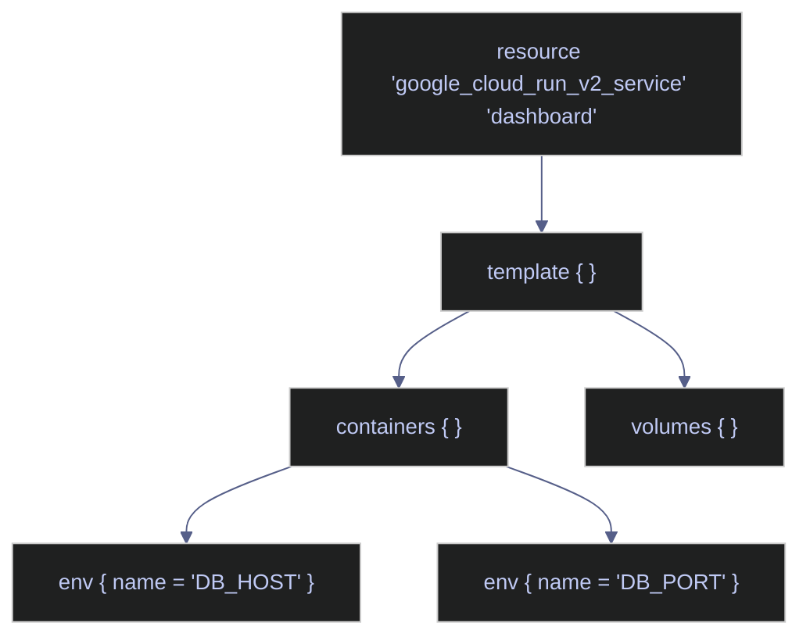

# HCL Syntax Basics

> [!quote] Alan Perlis on language design
>
> "A language that doesn't affect the way you think about programming is not worth knowing."
>
> — **Alan Perlis**, *Epigrams on Programming* (1982)

> [!abstract]- Summary
>
> HCL Syntax Basics is the language primer for the Terraform chapter: it defines how `.tf` files describe infrastructure declaratively, how Terraform interprets blocks, expressions, and meta-arguments, and where the sharp edges are when that syntax starts driving real GCP resources.
>
> **Core language model**
> - covers declarative HCL structure, blocks versus arguments, nested block composition, file naming, and the difference between Terraform-internal names and real GCP resource names
>
> **Types, expressions, and functions**
> - covers the HCL type system, literals, references, operators, conditionals, `for` expressions, splats, heredocs, and the built-in function families you validate in `terraform console`
>
> **Resource shaping primitives**
> - covers meta-arguments such as `count`, `for_each`, `depends_on`, and `lifecycle`, plus validation, `terraform_data`, and dynamic blocks for repeated nested configuration
>
> **File layout and authoring workflow**
> - covers practical file organization, common Terraform file roles, secret handling around `*.tfvars`, lockfile usage, and formatting expectations for day-to-day authoring
>
> **Operations and safety**
> - Warnings: duplicate map keys silently overwrite earlier entries, `bcrypt()` hashes change every plan, `count` index shifting recreates resources, overusing `depends_on` fights Terraform's graph, `prevent_destroy` does not protect removed blocks, deep dynamic nesting reduces readability, and secret-bearing `*.tfvars` files must never be committed
> - Recommendations: prefer `for_each` over `count` for stable identities, test expressions in `terraform console`, flatten complex inputs into locals before dynamic blocks, keep secrets outside version control, and commit `.terraform.lock.hcl`

> [!note]- Glossary
>
> **HCL**
> - HashiCorp Configuration Language, the declarative syntax Terraform uses to describe desired infrastructure state in `.tf` files.
> - It matters because everything else in the note depends on understanding HCL as a configuration language rather than as an imperative scripting language.
>
> > [!warning] Declarative does not mean sequential
> >
> > HCL describes intent, not execution order. Terraform builds its own dependency graph from the configuration instead of running blocks top to bottom like a script.
>
> ---
>
> **Block**
> - A structured container with a type, optional labels, and a body, such as `resource`, `variable`, `provider`, or nested configuration blocks.
> - It matters because block structure is the backbone of Terraform configuration and determines how resources, providers, and nested settings are modeled.
>
> > [!info] Blocks can nest deeply
> >
> > A top-level resource block can contain nested blocks such as `template`, `containers`, `env`, or `lifecycle`. Reading Terraform fluently means recognizing those nesting boundaries quickly.
>
> ---
>
> **Argument**
> - A key-value assignment inside a block that sets one specific property.
> - It matters because Terraform behavior comes from the combination of block shape and argument values inside each block.
>
> > [!warning] Arguments are not blocks
> >
> > `name = "..."` and `lifecycle { ... }` look equally indented in code, but they are different language constructs with different semantics. Mixing them conceptually makes provider schemas harder to read.
>
> ---
>
> **Label**
> - An identifier attached to a block after its type, commonly used to specify resource type and local name.
> - It matters because labels are how Terraform distinguishes one block instance from another and builds internal addresses such as `google_compute_network.main`.
>
> > [!info] Labels help form addresses
> >
> > In a resource block, one label usually identifies the provider resource type and another identifies the local Terraform name. Those labels never become arbitrary decoration; they drive references.
>
> ---
>
> **Terraform-internal name**
> - The local identifier Terraform uses inside configuration to reference a resource instance.
> - It matters because it is separate from the cloud-provider `name` argument, and confusing the two leads to bad references or bad naming expectations.
>
> > [!warning] Internal and cloud names differ
> >
> > `google_compute_firewall.allow_sql` is a Terraform address, while `allow-sql-from-airflow` might be the actual GCP resource name. Changing one does not automatically imply the same change in the other.
>
> ---
>
> **HCL type system**
> - The set of primitive and collection types HCL supports, including strings, numbers, booleans, lists, maps, sets, objects, and tuples.
> - It matters because variable declarations, expressions, and function behavior all depend on Terraform knowing the exact value shape.
>
> > [!warning] Type shape affects plan-time behavior
> >
> > A `set(string)` behaves differently from a `list(string)` because order and uniqueness semantics change. Seemingly small type choices can change resource identity, diffs, and iteration behavior.
>
> ---
>
> **Expression**
> - Any HCL fragment that evaluates to a value, including literals, references, operators, function calls, conditionals, and comprehensions.
> - It matters because Terraform configurations are largely composed by wiring expressions into arguments rather than by writing procedural code.
>
> > [!info] Expressions are where logic lives
> >
> > Terraform keeps control flow narrow, so most configuration intelligence is expressed through value construction. That is why expression fluency matters more than memorizing lots of commands.
>
> ---
>
> **`for` expression**
> - An HCL construct that transforms one collection into another by iterating over its elements.
> - It matters because the note uses `for` expressions to reshape inputs into the exact collections that resources, locals, and outputs need.
>
> > [!warning] Key stability matters
> >
> > When a `for` expression produces keys that later feed `for_each`, those keys need to stay stable across plans. Unstable keys can cause Terraform to replace resources unnecessarily.
>
> ---
>
> **Splat expression**
> - A shorthand expression for projecting one attribute from every element in a collection of similar objects.
> - It matters because splats are a compact way to extract lists of IDs, names, or other repeated attributes without manual indexing.
>
> > [!info] Readability still matters
> >
> > Splat syntax is terse, but explicit `for` expressions are sometimes easier to read when the transformation is doing more than a simple projection.
>
> ---
>
> **Meta-argument**
> - A Terraform language feature attached to resource-like blocks that changes how Terraform manages those blocks rather than changing a provider-side API field.
> - It matters because `count`, `for_each`, `depends_on`, and `lifecycle` directly affect graph shape, addressing, and destroy behavior.
>
> > [!warning] Meta-arguments reshape state
> >
> > Switching from `count` to `for_each`, changing keys, or misusing `depends_on` is not just syntactic churn. It can change resource addresses and trigger replacements.
>
> ---
>
> **`count`**
> - A meta-argument that creates zero or more copies of a block by numeric index.
> - It matters because it is the simplest repetition tool, but it also creates fragile index-based addressing.
>
> > [!warning] Index shifts are destructive
> >
> > If the underlying list order changes, Terraform can destroy and recreate resources because instance identity is tied to numeric position. That is why `count` is risky for heterogeneous or re-orderable collections.
>
> ---
>
> **`for_each`**
> - A meta-argument that creates instances from a map or set and keys them by stable identifiers rather than by integer position.
> - It matters because it is usually the safer repetition primitive for real infrastructure where identity should survive ordering changes.
>
> > [!info] Stable keys preserve identity
> >
> > When instance identity is based on meaningful keys such as names or IDs, Terraform can update the right object without cascading replacements caused by list reordering.
>
> ---
>
> **`lifecycle`**
> - A nested block that changes how Terraform handles create, update, replace, or destroy operations for a resource.
> - It matters because settings such as `prevent_destroy` influence safety boundaries during plan and apply.
>
> > [!warning] Protection has limits
> >
> > `prevent_destroy` only protects a resource while the block still exists in configuration. If the block is removed entirely, Terraform no longer sees that lifecycle rule.
>
> ---
>
> **Dynamic block**
> - An HCL construct that generates repeated nested blocks from a collection at plan time.
> - It matters because some provider schemas require many repeated sub-blocks, and dynamic blocks keep those definitions data-driven.
>
> > [!warning] Nested generation gets unreadable fast
> >
> > Dynamic blocks are powerful, but deep nesting makes configurations harder to review and reason about. When the structure gets complex, flattening inputs into locals is usually clearer.
>
> ---
>
> **`terraform console`**
> - An interactive REPL for evaluating HCL expressions, function calls, and references outside a full plan or apply.
> - It matters because it is the safest way to test expression logic, collection transforms, and function output before those values start driving resources.
>
> > [!info] Best place to debug expressions
> >
> > Console evaluation is fast and low-risk. It is often the quickest way to verify map shapes, list transforms, or validation expressions before they become plan-time errors.
>
> ---
>
> **`.terraform.lock.hcl`**
> - Terraform's dependency lockfile, pinning the exact provider selections used by the configuration.
> - It matters because reproducible provider versions are part of safe team and CI/CD workflows, especially when provider schemas evolve.
>
> > [!warning] Do not treat it as disposable
> >
> > Ignoring the lockfile means each machine can resolve slightly different provider builds. That weakens reproducibility and can introduce drift between local runs and CI.
>
> ---
>
> **`*.tfvars`**
> - Variable-value files used to supply input variables outside the main configuration.
> - It matters because they are convenient for environment-specific values but dangerous when they contain secrets.
>
> > [!danger] Secrets do not belong in git
> >
> > A `.tfvars` file with passwords, API keys, or service-account material is plaintext configuration. If it is committed, the exposure is immediate and difficult to unwind fully.

## Blocks and Arguments

HCL has two structural elements:

- **Block** — a container with a type, optional labels, and a body in braces. Example: `resource "google_compute_network" "main" { ... }`. This is a `resource` block with type `google_compute_network` and Terraform-internal name `main`.
- **Argument** — a key-value pair inside a block. Example: `name = "data-pipeline-vpc"`. Sets one property of the resource.

Blocks can be nested. For example, a `resource` block may contain a `template` block, which contains a `containers` block, which contains `env` blocks.



## File Naming and Organization

Terraform merges **all** `.tf` files in a directory into a single configuration. File names have **no impact** on behavior — you could rename `network.tf` to `dodo.tf` and everything would still work. Files are split purely for human readability and organization.

A typical file layout for a GCP project:

| File | Resources | Purpose |
|------|-----------|---------|
| `main.tf` | `terraform`, `provider` | Provider version, GCS backend |
| `variables.tf` | 6 variables | Inputs: project, region, zone, passwords, labels |
| `network.tf` | VPC, subnet, router, NAT, 5 firewall rules | Network isolation and traffic control |
| `compute.tf` | 2 GCE instances | SQL Server VM + Airflow VM |
| `iam.tf` | 3 service accounts, 8 IAM bindings, 4 conditional Datadog bindings | Identity and access management |
| `secrets.tf` | 2 secrets, 2 secret versions | Database password + Datadog API key |
| `registry.tf` | 1 Artifact Registry repository | Docker image storage with cleanup |
| `run.tf` | 1 Cloud Run service, 2 Cloud Run jobs, 1 IAM binding, locals | Dashboard + pipeline + setup |
| `ci.tf` | 1 service account, 4 IAM bindings | GitHub Actions deployment permissions |
| `outputs.tf` | 6 outputs | URLs and IPs for provisioned resources |

## Terraform Name vs GCP Name

Every resource has two names. The first label after the resource type (`"allow_sql"`) is the Terraform-internal name — used only inside `.tf` files to reference this resource (e.g., `google_compute_firewall.allow_sql.id`). The `name` argument (`"allow-sql-from-airflow"`) is the actual name in GCP — what appears in the Console, `gcloud` commands, and API calls. They don't have to match.

### Naming Example

*Declare a firewall resource with Terraform-internal name `allow_sql` and GCP name `allow-sql-from-airflow`.*

```hcl
resource "google_compute_firewall" "allow_sql" {
  name = "allow-sql-from-airflow"
}
```

| Name | Where it lives | Used for |
|------|---------------|----------|
| `"allow_sql"` | Terraform only | Referencing this resource in other `.tf` files (e.g., `google_compute_firewall.allow_sql.id`) |
| `"allow-sql-from-airflow"` | GCP | What appears in the Console, `gcloud` commands, and API calls |

## Block Types

The `variable` and `output` blocks below are covered in depth in [variables-and-outputs](https://alp78.github.io/elysium/07-Terraform/Fundamentals/variables-and-outputs), which extends HCL syntax with parameterization, type constraints, and validation rules.

The most common block types in Terraform:

| Block Type | Purpose | Example |
|------------|---------|---------|
| `terraform` | Top-level configuration — version constraints, backend | `terraform { required_version = ">= 1.5" }` |
| `provider` | Configures a cloud provider | `provider "google" { project = var.project_id }` |
| `resource` | Declares an infrastructure object | `resource "google_compute_network" "main" { ... }` |
| `variable` | Declares an input parameter | `variable "project_id" { type = string }` |
| `output` | Exposes a value after apply | `output "url" { value = resource.uri }` |
| `locals` | Defines computed values | `locals { sql_ip = resource.network_interface[0].network_ip }` |
| `data` | Reads existing infrastructure (not created by this config) | `data "google_project" "current" {}` |

## Declarative vs Imperative

Terraform is declarative: you describe the desired end state, and Terraform computes the steps to reach it. This is fundamentally different from imperative tools like bash scripts or Ansible playbooks, which describe the sequence of actions to perform.

**Declarative (Terraform):** "There should be a VM named data-pipeline-sql with these properties."
**Imperative (bash):** "Run `gcloud compute instances create data-pipeline-sql ...` with these flags."

The declarative approach means Terraform can determine whether a resource already exists, needs updating, or needs to be recreated — and it can handle all three cases automatically. See [plan-apply-destroy](https://alp78.github.io/elysium/07-Terraform/Fundamentals/plan-apply-destroy) for the workflow that turns declarative config into real infrastructure.

## HCL Type System

Every value in HCL has a type. Terraform uses types to validate variable inputs, enforce constraints, and determine how values can be combined in expressions. Understanding the type system is essential for writing correct `variable` blocks and `for` expressions. See [variables-and-outputs](https://alp78.github.io/elysium/07-Terraform/Fundamentals/variables-and-outputs) for type constraints in practice.

### Primitive Types

| Type | Description | Example |
|---|---|---|
| `string` | UTF-8 text | `"us-central1"` |
| `number` | Integer or float (64-bit) | `3`, `3.14` |
| `bool` | Boolean | `true`, `false` |

Terraform automatically converts between primitives when unambiguous: `"42"` becomes `42` in a numeric context, and `true` becomes `"true"` in a string context.

### Collection Types

| Type | Description | Example |
|---|---|---|
| `list(type)` | Ordered sequence, all elements same type | `["a", "b", "c"]` |
| `set(type)` | Unordered unique elements, all same type | `toset(["a", "b"])` |
| `map(type)` | Key-value pairs, all values same type | `{ dev = "us-central1", prod = "us-east1" }` |

Lists are indexed by position (`element(list, 0)`). Maps are indexed by key (`map["dev"]`). Sets have no index — iterate with `for_each`.

> [!warning] Duplicate map keys silently discard earlier values
>
> `{ a = 1, a = 2 }` evaluates to `{ a = 2 }` with no error. This can cause hard-to-debug issues when merging maps with `merge()`.

> [!success] Use `keys()` and `length()` to verify map integrity after merges in `terraform console`.

### Structural Types

| Type | Description | Example |
|---|---|---|
| `object({...})` | Fixed set of named attributes, each with its own type | `object({ name = string, count = number })` |
| `tuple([...])` | Fixed-length sequence, each element with its own type | `tuple([string, number, bool])` |

Objects and tuples are used in `variable` type constraints when a collection needs mixed types. Objects support `optional()` attributes (Terraform 1.3+): `object({ name = string, tags = optional(map(string), {}) })`.

### Special Types

| Type | Description |
|---|---|
| `any` | Accepts any type — Terraform infers the actual type at runtime |
| `null` | Absence of a value — used to conditionally omit arguments |

`any` is useful for generic module inputs but loses type safety. Prefer explicit types where possible.

## Expression Syntax

HCL expressions go anywhere a value is expected — argument values, `locals` definitions, `output` blocks, and conditional logic. Expressions are evaluated at `terraform plan` time.

### String Interpolation

Embed expressions inside strings with `${}`:

*Concatenate variable values into a resource name using `${}` interpolation.*

```hcl
name = "${var.project_id}-${var.environment}-vpc"
```

For directive-based templates (loops and conditionals inside strings), use `%{}`:

*Use `%{if}` directives to conditionally insert text within a string template.*

```hcl
description = "%{if var.environment == "prod"}Production%{else}Non-production%{endif} VPC"
```

### Conditional Expressions

The ternary operator selects between two values based on a boolean condition:

*Select machine type based on the environment variable.*

```hcl
machine_type = var.environment == "prod" ? "n2-standard-4" : "e2-medium"
```

Combine with `null` to conditionally omit an argument entirely — Terraform treats `null` as "use the provider default":

*Return `null` to let the provider use its default value when the toggle is off.*

```hcl
min_tls_version = var.enforce_tls ? "TLS_1_2" : null
```

### For Expressions

Transform collections by iterating over their elements. Produces a new list or map.

*Transform every bucket name to uppercase using a `for` expression.*

```hcl
upper_names = [for name in var.bucket_names : upper(name)]
```

Filter with an `if` clause:

*Filter the instances list to include only production environment entries.*

```hcl
prod_instances = [for inst in var.instances : inst if inst.environment == "prod"]
```

Produce a map by separating key and value with `=>`:

*Build a name-to-zone lookup map from a list of instance objects.*

```hcl
instance_map = { for inst in var.instances : inst.name => inst.zone }
```

### Splat Expressions

Shorthand for extracting a single attribute from every element in a list:

*Extract the `instance_id` attribute from every element of the `workers` resource list.*

```hcl
instance_ids = google_compute_instance.workers[*].instance_id
```

Equivalent to `[for inst in google_compute_instance.workers : inst.instance_id]`, but more concise. Works only on lists, not maps — use a `for` expression for maps.

## HCL Functions Reference

All functions are available in any HCL expression context — inside `resource`, `variable`, `locals`, `output`, and `data` blocks.

> [!tip] Interactive testing with `terraform console`
>
> Run `terraform console` in any initialized Terraform directory to test expressions against live state and variables. Useful for debugging interpolation, type conversions, and complex `for` expressions before committing them to config files.

### String Functions

Manipulate, search, and format string values. Commonly used for constructing resource names, parsing labels, and formatting output values.

| Function | Signature | Example | Result |
|----------|-----------|---------|--------|
| `format` | `format(spec, args…)` | `format("%-10s %d", "id", 42)` | `"id         42"` |
| `join` | `join(sep, list)` | `join(", ", ["a","b","c"])` | `"a, b, c"` |
| `split` | `split(sep, str)` | `split(",", "a,b,c")` | `["a","b","c"]` |
| `replace` | `replace(str, search, replace)` | `replace("hello world", "world", "HCL")` | `"hello HCL"` |
| `trimspace` | `trimspace(str)` | `trimspace("  hi  ")` | `"hi"` |
| `lower` | `lower(str)` | `lower("Hello")` | `"hello"` |
| `upper` | `upper(str)` | `upper("hello")` | `"HELLO"` |
| `regex` | `regex(pattern, str)` | `regex("[0-9]+", "abc123")` | `"123"` |
| `regexall` | `regexall(pattern, str)` | `regexall("[0-9]+", "a1b22")` | `["1","22"]` |
| `substr` | `substr(str, offset, length)` | `substr("hello", 1, 3)` | `"ell"` |
| `startswith` | `startswith(str, prefix)` | `startswith("terraform", "terra")` | `true` |
| `endswith` | `endswith(str, suffix)` | `endswith("main.tf", ".tf")` | `true` |
| `title` | `title(str)` | `title("hello world")` | `"Hello World"` |
| `indent` | `indent(spaces, str)` | `indent(2, "a\nb")` | `"a\n  b"` |
| `chomp` | `chomp(str)` | `chomp("hello\n")` | `"hello"` |
| `trimprefix` | `trimprefix(str, prefix)` | `trimprefix("hello", "hel")` | `"lo"` |
| `trimsuffix` | `trimsuffix(str, suffix)` | `trimsuffix("hello", "lo")` | `"hel"` |

### Collection Functions

Work with lists, maps, sets, and tuples. Essential for `for_each` iteration, variable transformation, and merging configuration maps across modules.

| Function | Signature | Example | Result |
|----------|-----------|---------|--------|
| `length` | `length(collection)` | `length(["a","b","c"])` | `3` |
| `lookup` | `lookup(map, key, default)` | `lookup({a=1}, "b", 0)` | `0` |
| `merge` | `merge(maps…)` | `merge({a=1},{b=2})` | `{a=1,b=2}` |
| `keys` | `keys(map)` | `keys({a=1,b=2})` | `["a","b"]` |
| `values` | `values(map)` | `values({a=1,b=2})` | `[1,2]` |
| `flatten` | `flatten(list)` | `flatten([[1,2],[3]])` | `[1,2,3]` |
| `distinct` | `distinct(list)` | `distinct(["a","b","a"])` | `["a","b"]` |
| `concat` | `concat(lists…)` | `concat(["a"],["b","c"])` | `["a","b","c"]` |
| `element` | `element(list, index)` | `element(["a","b","c"], 1)` | `"b"` |
| `contains` | `contains(list, value)` | `contains(["a","b"], "a")` | `true` |
| `zipmap` | `zipmap(keys, values)` | `zipmap(["a","b"],[1,2])` | `{a=1,b=2}` |
| `toset` | `toset(list)` | `toset(["a","b","a"])` | `{"a","b"}` |
| `tolist` | `tolist(set)` | `tolist(toset(["b","a"]))` | `["a","b"]` |
| `tomap` | `tomap(object)` | `tomap({a="x",b="y"})` | `{a="x",b="y"}` |
| `index` | `index(list, value)` | `index(["a","b","c"],"b")` | `1` |
| `slice` | `slice(list, start, end)` | `slice(["a","b","c"],1,3)` | `["b","c"]` |
| `reverse` | `reverse(list)` | `reverse([1,2,3])` | `[3,2,1]` |
| `sort` | `sort(list)` | `sort(["c","a","b"])` | `["a","b","c"]` |
| `chunklist` | `chunklist(list, size)` | `chunklist([1,2,3,4],2)` | `[[1,2],[3,4]]` |
| `transpose` | `transpose(map_of_lists)` | `transpose({a=["x","y"]})` | `{x=["a"],y=["a"]}` |
| `matchkeys` | `matchkeys(vals, keys, search)` | see docs | filtered list |
| `one` | `one(list)` | `one(["a"])` | `"a"` |
| `range` | `range(start, limit, step)` | `range(0, 4, 1)` | `[0,1,2,3]` |
| `alltrue` | `alltrue(list)` | `alltrue([true,true])` | `true` |
| `anytrue` | `anytrue(list)` | `anytrue([false,true])` | `true` |

### Numeric Functions

Arithmetic, rounding, and base conversion. Used for calculating resource counts, CIDR math inputs, and parsing non-decimal strings.

| Function | Signature | Example | Result |
|----------|-----------|---------|--------|
| `min` | `min(numbers…)` | `min(3,1,2)` | `1` |
| `max` | `max(numbers…)` | `max(3,1,2)` | `3` |
| `ceil` | `ceil(number)` | `ceil(1.2)` | `2` |
| `floor` | `floor(number)` | `floor(1.9)` | `1` |
| `abs` | `abs(number)` | `abs(-5)` | `5` |
| `signum` | `signum(number)` | `signum(-3)` | `-1` |
| `log` | `log(number, base)` | `log(8, 2)` | `3` |
| `pow` | `pow(base, exp)` | `pow(2, 10)` | `1024` |
| `parseint` | `parseint(str, base)` | `parseint("ff", 16)` | `255` |

### Date/Time Functions

Generate and compare timestamps. Commonly used for setting expiration dates on resources, computing rotation schedules, and tagging resources with creation time.

| Function | Signature | Example | Result |
|----------|-----------|---------|--------|
| `timestamp` | `timestamp()` | `timestamp()` | `"2026-03-23T00:00:00Z"` |
| `formatdate` | `formatdate(spec, timestamp)` | `formatdate("YYYY-MM-DD", timestamp())` | `"2026-03-23"` |
| `timeadd` | `timeadd(timestamp, duration)` | `timeadd(timestamp(), "24h")` | tomorrow's timestamp |
| `timecmp` | `timecmp(ts_a, ts_b)` | `timecmp("2026-01-01T00:00:00Z","2025-01-01T00:00:00Z")` | `1` |

### Filesystem Functions

Read files, render templates, and check paths at plan time. `templatefile` is the primary way to inject variables into startup scripts, Cloud Init configs, and SQL migration files.

| Function | Signature | Example | Result |
|----------|-----------|---------|--------|
| `file` | `file(path)` | `file("${path.module}/script.sh")` | file contents as string |
| `filebase64` | `filebase64(path)` | `filebase64("cert.pem")` | base64-encoded file |
| `templatefile` | `templatefile(path, vars)` | `templatefile("startup.sh.tpl", {project=var.project})` | rendered template string |
| `fileset` | `fileset(base, pattern)` | `fileset("${path.module}/sql", "*.sql")` | set of matching filenames |
| `fileexists` | `fileexists(path)` | `fileexists("optional.tf")` | bool |
| `pathexpand` | `pathexpand("~/.kube/config")` | — | expanded path string |

### Encoding Functions

Serialize and deserialize between HCL objects and JSON, YAML, CSV, and base64 formats. `jsonencode` and `yamldecode` are the workhorses for passing structured data to GCP metadata fields and reading external config files.

| Function | Signature | Example | Result |
|----------|-----------|---------|--------|
| `jsonencode` | `jsonencode(value)` | `jsonencode({a=1})` | `"{\"a\":1}"` |
| `jsondecode` | `jsondecode(str)` | `jsondecode("{\"a\":1}")` | object `{a=1}` |
| `yamlencode` | `yamlencode(value)` | `yamlencode({a=1,b="x"})` | YAML string |
| `yamldecode` | `yamldecode(str)` | `yamldecode(file("config.yaml"))` | HCL object |
| `base64encode` | `base64encode(str)` | `base64encode("hello")` | `"aGVsbG8="` |
| `base64decode` | `base64decode(str)` | `base64decode("aGVsbG8=")` | `"hello"` |
| `base64gzip` | `base64gzip(str)` | `base64gzip(file("big.txt"))` | gzip+base64 |
| `csvdecode` | `csvdecode(str)` | `csvdecode(file("data.csv"))` | list of maps |
| `textencodebase64` | `textencodebase64(str, enc)` | `textencodebase64("hi","UTF-16LE")` | base64 of re-encoded string |
| `urlencode` | `urlencode(str)` | `urlencode("hello world")` | `"hello+world"` |

### IP / CIDR Functions

Calculate subnet ranges, host addresses, and netmasks from CIDR notation. Used heavily in `network.tf` to carve a VPC CIDR into subnets without manual math.

| Function | Signature | Example | Result |
|----------|-----------|---------|--------|
| `cidrsubnet` | `cidrsubnet(prefix, newbits, netnum)` | `cidrsubnet("10.0.0.0/16", 8, 1)` | `"10.0.1.0/24"` |
| `cidrhost` | `cidrhost(prefix, hostnum)` | `cidrhost("10.0.1.0/24", 5)` | `"10.0.1.5"` |
| `cidrnetmask` | `cidrnetmask(prefix)` | `cidrnetmask("10.0.0.0/16")` | `"255.255.0.0"` |
| `cidrsubnets` | `cidrsubnets(prefix, newbits…)` | `cidrsubnets("10.0.0.0/8",8,8,8)` | list of 3 subnets |
| `cidrcontains` | `cidrcontains(cidr, ip)` | `cidrcontains("10.0.0.0/8","10.1.2.3")` | `true` |

### Crypto / Hash Functions

Generate hashes, UUIDs, and checksums. `filesha256` is commonly used to trigger redeployment when a source artifact (ZIP, JAR) changes. `uuid` generates a new value on every plan — use it only in `random_id` alternatives, not in resource arguments.

| Function | Signature | Example | Result |
|----------|-----------|---------|--------|
| `sha256` | `sha256(str)` | `sha256("hello")` | hex SHA-256 digest |
| `sha512` | `sha512(str)` | `sha512("hello")` | hex SHA-512 digest |
| `sha1` | `sha1(str)` | `sha1("hello")` | hex SHA-1 digest |
| `md5` | `md5(str)` | `md5("hello")` | hex MD5 digest |
| `uuid` | `uuid()` | `uuid()` | random UUID v4 string |
| `uuidv5` | `uuidv5(namespace, name)` | `uuidv5("dns","example.com")` | deterministic UUID v5 |
| `bcrypt` | `bcrypt(str, cost?)` | `bcrypt("pass",10)` | bcrypt hash |
| `filesha256` | `filesha256(path)` | `filesha256("lambda.zip")` | SHA-256 of file |
| `filemd5` | `filemd5(path)` | `filemd5("object.bin")` | MD5 of file |

> [!warning] `bcrypt` produces a different hash on every `terraform plan`
>
> Because `bcrypt` includes a random salt, Terraform sees the output as changed on every run, causing perpetual diffs. The hash also ends up stored in plaintext in the state file.

> [!success] Use a `random_password` resource with the `bcrypt` function only in a `local-exec` provisioner, or hash outside Terraform and pass the value as a variable.

### Type Conversion and Safety Functions

Convert between HCL types and handle nullable or error-prone expressions safely. `try` and `can` are especially useful when working with optional object attributes or data sources that may not exist.

| Function | Signature | Example | Result |
|----------|-----------|---------|--------|
| `try` | `try(exprs…)` | `try(var.opt.field, "default")` | first non-erroring expression |
| `can` | `can(expr)` | `can(tonumber(var.x))` | `true` if expr succeeds |
| `nonsensitive` | `nonsensitive(value)` | `nonsensitive(var.password)` | strips sensitive marking |
| `sensitive` | `sensitive(value)` | `sensitive(local.token)` | marks value as sensitive |
| `tostring` | `tostring(value)` | `tostring(42)` | `"42"` |
| `tonumber` | `tonumber(value)` | `tonumber("3.14")` | `3.14` |
| `tobool` | `tobool(value)` | `tobool("true")` | `true` |
| `type` | `type(value)` | (console only) | prints type of value |

## Meta-Arguments

Meta-arguments are built into the HCL language itself and available on every `resource` and `data` block regardless of provider. They instruct Terraform how to process a block — how many instances to create, what order to follow, or how to handle lifecycle events. Because meta-arguments affect plan computation, many of their values must be known at plan time and cannot depend on attributes that are computed during apply.

### count

The `count` meta-argument creates multiple instances of a resource from a single block. Each instance is identified by its numeric index (`count.index`), starting at `0`.

*Create four identical compute instances, each tagged with its index number.*

```hcl
resource "google_compute_instance" "worker" {
  count        = 4
  name         = "worker-${count.index}"
  machine_type = "e2-medium"
  zone         = var.zone
}
```

Use `count` with a conditional to toggle a resource on or off:

*Create the firewall rule only when `admin_ip` is provided.*

```hcl
resource "google_compute_firewall" "allow_admin" {
  count   = var.admin_ip != "" ? 1 : 0
  name    = "allow-admin-access"
  network = google_compute_network.main.id
  # ...
}
```

> [!warning] Index shifting destroys and recreates resources
>
> Resources created with `count` are keyed by numeric index. If you remove an item from the middle of a list that drives `count`, all subsequent indexes shift — Terraform sees them as different resources and will destroy and recreate them. For stable identity, use `for_each` with a map or set instead.

> [!success] Use `count` only for conditional creation or identical copies
>
> Reserve `count` for two patterns: toggling a resource on/off (`count = var.enabled ? 1 : 0`) and creating N identical copies. For resources that differ by key (environments, regions, team names), `for_each` is safer because keys are stable regardless of ordering.

### for_each

The `for_each` meta-argument creates one instance per element of a map or set. Each instance is keyed by the map key (or set element), not by a numeric index — keys remain stable when elements are added or removed.

*Create one subnet per entry in the `subnets` map, keyed by subnet name.*

```hcl
resource "google_compute_subnetwork" "regional" {
  for_each      = var.subnets
  name          = each.key
  ip_cidr_range = each.value.cidr
  region        = each.value.region
  network       = google_compute_network.main.id
}
```

Inside the block, `each.key` is the current map key and `each.value` is the corresponding value. For sets, both `each.key` and `each.value` are the element itself.

> [!tip] Convert a list to a set for `for_each`
>
> `for_each` requires a map or set, not a list. Convert with `toset()`: `for_each = toset(var.zone_list)`. If you need both index and value, build a map first using a `for` expression: `{ for idx, z in var.zone_list : z => idx }`.

### depends_on

The `depends_on` meta-argument declares an explicit ordering dependency between resources when Terraform cannot infer one from attribute references. Terraform completes all actions on the dependency (including any read actions) before processing the dependent resource.

*Ensure the IAM binding is fully applied before creating the Cloud Run service.*

```hcl
resource "google_cloud_run_v2_service" "dashboard" {
  depends_on = [google_project_iam_member.run_invoker]
  name       = "dashboard"
  location   = var.region
  # ...
}
```

> [!warning] Prefer implicit dependencies over `depends_on`
>
> Whenever possible, express dependencies through attribute references (e.g., `network = google_compute_network.main.id`). Terraform automatically infers the ordering. Reserve `depends_on` for cases where a dependency exists due to side effects not captured in attributes — for example, an IAM binding that must propagate before a service can start.

### lifecycle

The `lifecycle` block is a nested meta-argument that controls how Terraform manages resource changes. It accepts several arguments that override default plan behavior.

| Argument | Purpose | Example |
|---|---|---|
| `create_before_destroy` | Create the replacement before destroying the original — reduces downtime for stateless resources | `create_before_destroy = true` |
| `prevent_destroy` | Reject any plan that would destroy the resource — safety net for stateful resources like databases | `prevent_destroy = true` |
| `ignore_changes` | Exclude specific attributes from drift detection — useful when an external process manages those attributes | `ignore_changes = [labels, metadata]` |
| `replace_triggered_by` | Force replacement when a referenced resource changes — signals implicit dependencies that Terraform cannot detect | `replace_triggered_by = [google_compute_disk.boot.id]` |
| `precondition` | Validate inputs before creating or updating the resource (Terraform 1.2+) | See example below |
| `postcondition` | Validate resource attributes after creation (Terraform 1.2+) | See example below |

*Prevent accidental destruction of the SQL Server VM and ignore externally managed labels.*

```hcl
resource "google_compute_instance" "sql" {
  name         = "data-pipeline-sql"
  machine_type = "n2-standard-4"
  zone         = var.zone

  lifecycle {
    prevent_destroy = true
    ignore_changes  = [labels, metadata["startup-script"]]
  }
}
```

> [!warning] `prevent_destroy` does not protect against block removal
>
> If you remove the entire `resource` block from the configuration, Terraform no longer sees the `prevent_destroy` argument and will plan a destroy. The protection only works while the resource block exists in the configuration.

> [!success] Combine `prevent_destroy` with `deletion_protection`
>
> For GCP resources that support it (Cloud SQL, BigQuery, Compute Engine), set both `prevent_destroy = true` in the lifecycle block and `deletion_protection = true` in the resource arguments. The lifecycle argument catches Terraform-initiated destroys; the GCP argument catches API-level deletes from any source.

#### Preconditions and postconditions (Terraform 1.2+)

Preconditions validate assumptions before Terraform creates or updates a resource. Postconditions validate the result after the resource is created. Both use the `condition` + `error_message` pattern and live inside the `lifecycle` block.

*Validate that the selected region is in Europe before creating the resource.*

```hcl
resource "google_compute_network" "main" {
  name = "data-pipeline-vpc"

  lifecycle {
    precondition {
      condition     = startswith(var.region, "europe-")
      error_message = "This project must deploy to a European region for data residency compliance."
    }
  }
}
```

> [!info]- Cross-variable validation (Terraform 1.9+)
>
> Before Terraform 1.9, `validation` blocks in `variable` declarations could only reference the variable being validated. From Terraform 1.9+, validation conditions can reference other variables, data sources, and local values — reducing the need to use `precondition` blocks as a workaround for cross-variable constraints.

### replace_triggered_by (Terraform 1.2+)

The `replace_triggered_by` lifecycle argument forces Terraform to replace a resource whenever one or more referenced managed resources change. This is useful when a resource depends on another resource's identity in a way that requires full replacement rather than in-place update.

*Replace the Cloud Run service whenever the Docker image digest changes.*

```hcl
resource "terraform_data" "image_tag" {
  input = var.image_digest
}

resource "google_cloud_run_v2_service" "dashboard" {
  name     = "dashboard"
  location = var.region

  lifecycle {
    replace_triggered_by = [terraform_data.image_tag]
  }
  # ...
}
```

> [!tip] Use `terraform_data` as a change signal
>
> The `terraform_data` resource (replacement for the deprecated `null_resource`) stores an arbitrary value in state. When that value changes, any resource with `replace_triggered_by` pointing to it will be replaced. This pattern decouples the trigger from the resource's own arguments.

## Dynamic Blocks

Dynamic blocks generate repeated nested blocks programmatically, acting like a `for` expression that produces block structures instead of values. They are supported inside `resource`, `data`, `provider`, and `provisioner` blocks.

A dynamic block has four components:

| Component | Required | Purpose |
|---|---|---|
| **label** | Yes | The type of nested block to generate (e.g., `ingress`, `env`, `setting`) |
| **`for_each`** | Yes | The collection to iterate over — must be a map or set |
| **`content`** | Yes | The body of each generated block — references the iterator to access current element values |
| **`iterator`** | No | Custom name for the iteration variable. Defaults to the block label if omitted |

*Dynamically generate one `env` block per entry in the `env_vars` map.*

```hcl
resource "google_cloud_run_v2_service" "dashboard" {
  name     = "dashboard"
  location = var.region

  template {
    containers {
      image = "${local.registry}/dashboard:latest"

      dynamic "env" {
        for_each = var.env_vars
        content {
          name  = env.key
          value = env.value
        }
      }
    }
  }
}
```

Inside the `content` block, `env.key` and `env.value` refer to the current map entry (where `env` is the default iterator name matching the block label). To use a custom iterator name, set `iterator = custom_name` and reference `custom_name.key` / `custom_name.value`.

### Nested Dynamic Blocks

Some resource types require multiple levels of nested blocks. You can nest `dynamic` blocks inside the `content` of other `dynamic` blocks to generate these structures.

*Generate `origin_group` blocks, each containing a dynamic set of `origin` entries.*

```hcl
dynamic "origin_group" {
  for_each = var.origin_groups
  content {
    name = origin_group.value.name

    dynamic "origin" {
      for_each = origin_group.value.origins
      content {
        hostname = origin.value.hostname
        weight   = origin.value.weight
      }
    }
  }
}
```

> [!warning] Deep nesting reduces readability
>
> Dynamic blocks beyond two levels of nesting become difficult to read and maintain. If you find yourself nesting three or more levels, consider restructuring the data or extracting the inner logic into a local variable.

> [!success] Flatten complex structures into locals first
>
> Use `flatten()` and `for` expressions in a `locals` block to pre-compute the nested structure as a flat map, then iterate over it with a single `dynamic` block. This moves complexity out of the resource block and into a testable expression.

> [!info]- Dynamic block limitations
>
> - Dynamic blocks can only generate arguments that belong to the enclosing resource type — they cannot generate meta-arguments like `lifecycle` or `depends_on`.
> - The `for_each` value must be known at plan time. If it depends on a computed attribute (e.g., an IP address assigned during apply), Terraform will error with "value depends on resource attributes that cannot be determined until apply."
> - Overusing dynamic blocks where a static block would suffice adds unnecessary indirection. Use them only when the number of nested blocks genuinely varies.

## File Organization Reference

Standard file layout for a Terraform project targeting GCP. File names are a convention — Terraform merges all `.tf` files in a directory regardless of name — but consistent naming helps teams navigate projects quickly.

| File | Purpose |
|------|---------|
| `main.tf` | Provider config, backend block |
| `variables.tf` | Input variable declarations |
| `outputs.tf` | Output value declarations |
| `locals.tf` | Local value definitions |
| `versions.tf` | `terraform {}` block with required_version and required_providers |
| `network.tf` | VPC, subnets, firewall rules, Cloud NAT |
| `compute.tf` | Compute Engine VMs, instance templates, managed groups |
| `iam.tf` | Service accounts, IAM bindings and members |
| `run.tf` | Cloud Run V2 services and jobs |
| `storage.tf` | GCS buckets, lifecycle rules |
| `data.tf` | `data {}` blocks — lookups for existing resources |
| `import.tf` | `import {}` blocks (TF 1.5+) |
| `*.tfvars` | Variable value files (do not commit secrets) |
| `*.tfvars.json` | JSON format variable value files |
| `override.tf` | Local overrides (do not commit — add to `.gitignore`) |
| `.terraform.lock.hcl` | Provider lock file — always commit to version control |
| `.terraform/` | Local cache — add to `.gitignore` |

> [!danger] Never commit `*.tfvars` files containing secrets (database passwords, API keys, service account keys)
>
> These files are often the source of credential leaks in version control. Even private repos are not safe — credentials in git history persist after deletion.

> [!success] Store secrets outside version control
>
> Use environment variables (`TF_VAR_*`), a secrets manager (GCP Secret Manager, HashiCorp Vault), or an encrypted backend. Add `*.tfvars` to `.gitignore` and use `*.tfvars.example` files with placeholder values.

> [!info] Always commit `.terraform.lock.hcl`
>
> This file pins the exact provider versions and hashes used by your project. Without it, `terraform init` may download a different provider version on another machine, causing inconsistent behavior. Treat it like a `package-lock.json`.

> [!tip] Run `terraform fmt` before every commit
>
> `terraform fmt` rewrites `.tf` files to the canonical HCL style (2-space indent, aligned `=` signs, sorted arguments). Enforcing it in CI prevents style drift across team members.

## Related

- [providers-and-backend](https://alp78.github.io/elysium/07-Terraform/Fundamentals/providers-and-backend) — Configuring where Terraform connects and stores state
- [variables-and-outputs](https://alp78.github.io/elysium/07-Terraform/Fundamentals/variables-and-outputs) — Parameterizing HCL with variables, locals, and outputs
- [plan-apply-destroy](https://alp78.github.io/elysium/07-Terraform/Fundamentals/plan-apply-destroy) — The workflow that turns HCL into real infrastructure
- [state-management](https://alp78.github.io/elysium/07-Terraform/Fundamentals/state-management) — How Terraform tracks what it has created

## References

- [HCL Native Syntax Specification](https://github.com/hashicorp/hcl/blob/main/hclsyntax/spec.md)
- [Terraform Configuration Language](https://developer.hashicorp.com/terraform/language)
- [Meta-Arguments](https://developer.hashicorp.com/terraform/language/meta-arguments) — count, for_each, depends_on, provider, lifecycle
- [lifecycle Meta-Argument Reference](https://developer.hashicorp.com/terraform/language/meta-arguments/lifecycle) — create_before_destroy, prevent_destroy, ignore_changes, replace_triggered_by, precondition, postcondition
- [Dynamic Blocks](https://developer.hashicorp.com/terraform/language/expressions/dynamic-blocks) — for_each, content, iterator, nested dynamic blocks
- [Terraform 1.9 — Expanded Input Validation](https://www.infoq.com/news/2024/08/terraform-19/) — cross-variable references in validation blocks
- [Terraform 1.10 — Ephemeral Values](https://www.hashicorp.com/en/blog/terraform-1-10-improves-handling-secrets-in-state-with-ephemeral-values) — ephemeral resources, variables, and outputs
- ChromaDB: *Terraform in Depth* (meta-arguments, lifecycle, preconditions/postconditions)
- ChromaDB: *Terraform Up & Running* (inline blocks vs separate resources)
