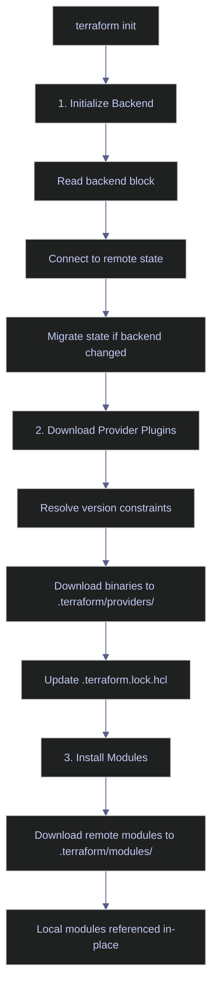
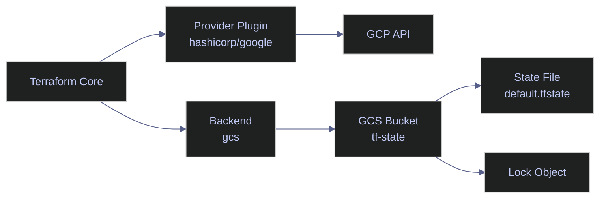

# Providers and Backend

> [!quote]+
>
> "We were seventh to market... no one was a clear winner. It was a warring market."
>
> — **Mitchell Hashimoto**, HashiConf talk

> [!abstract]- Summary
>
> Terraform Providers and Backend is the bootstrap note for every Terraform working directory: it explains how the `terraform` block declares CLI and provider requirements, how the backend determines where state lives, and how `terraform init` turns those declarations into a usable execution environment for GCP.
>
> **Terraform and provider requirements**
> - covers the `terraform` block, `required_version`, `required_providers`, version-constraint strategy, and why provider pinning plus the lockfile are part of reproducible infrastructure
>
> **Remote backend design**
> - covers the `backend "gcs"` block, GCS bucket and prefix choices, bootstrap requirements, migration workflow, and environment-separation strategies for state paths and buckets
>
> **Provider configuration and authentication**
> - covers `google` and `google-beta` provider setup, region and project variables, aliasing, module provider wiring, and secure authentication patterns that avoid hardcoded credentials
>
> **Initialization workflow**
> - covers what `terraform init` actually does, when it needs to be re-run, and how complete backend-plus-provider configuration fits together in one working example
>
> **Operations and safety**
> - Warnings: backend buckets must exist before initialization, state loss or corruption is catastrophic, backend migrations need backups, hardcoded provider credentials are unsafe, and aliased providers must stay version-aligned
> - Recommendations: bootstrap the state bucket first, use versioned remote state in GCS, authenticate with keyless patterns or workload identity, pass aliases explicitly into modules, and re-run `terraform init` whenever backend, providers, or modules change

> [!note]- Glossary
>
> **`terraform` block**
> - The top-level configuration block that defines Terraform's own requirements, including CLI version, provider sources, and backend settings.
> - It matters because Terraform cannot initialize a working directory correctly until it knows what version constraints, providers, and backend rules apply.
>
> > [!info] Terraform configures itself first
> >
> > The `terraform` block is not a provider resource and not a cloud object. It tells Terraform how to prepare its own execution environment before any infrastructure planning begins.
>
> ---
>
> **`required_version`**
> - A Terraform CLI version constraint that prevents the configuration from running under incompatible Terraform binaries.
> - It matters because teams and CI runners need a shared version floor or range to avoid drift caused by different language and CLI behavior.
>
> > [!warning] Unpinned CLI versions drift silently
> >
> > Without a version constraint, engineers can run different Terraform binaries against the same codebase. That weakens reproducibility and makes troubleshooting harder.
>
> ---
>
> **`required_providers`**
> - The block that maps local provider names to registry sources and version constraints.
> - It matters because provider plugin resolution is what lets Terraform understand resource types such as GCP networks, IAM bindings, or Cloud Run services.
>
> > [!warning] Provider source and version both matter
> >
> > The local name alone is not enough. Terraform needs to know exactly which registry source to trust and which version range is acceptable.
>
> ---
>
> **Version constraint**
> - A rule such as `>= 1.5`, `~> 6.0`, or an explicit range that limits which CLI or provider versions Terraform may use.
> - It matters because backend behavior, provider schemas, and language features all change over time, and safe upgrades depend on constrained version selection.
>
> > [!info] Pessimistic constraints are common for a reason
> >
> > `~>` allows minor and patch updates while blocking major-version jumps that often contain breaking changes. That makes it a practical default for production provider pinning.
>
> ---
>
> **Backend**
> - The storage mechanism Terraform uses for its state file and related coordination behavior.
> - It matters because where state lives determines collaboration safety, recovery options, and whether a local laptop failure can orphan infrastructure knowledge.
>
> > [!warning] Local state is a solo-operator compromise
> >
> > A local `terraform.tfstate` file may be acceptable for a personal lab, but it is a weak pattern for teams or CI/CD. Shared infrastructure needs shared, durable state storage.
>
> ---
>
> **GCS backend**
> - Terraform's Google Cloud Storage backend, used to keep remote state in a bucket and namespace it with a prefix.
> - It matters because the note assumes GCP-focused Terraform workflows where state durability, versioning, and centralized access are handled in GCS.
>
> > [!warning] The bucket is not self-bootstrapping
> >
> > Terraform cannot use a GCS backend until that bucket already exists. Backend infrastructure must be created separately before the configuration can migrate state into it.
>
> ---
>
> **State migration**
> - The process of moving Terraform state from one backend configuration to another, such as from local state to a GCS bucket or between backend paths.
> - It matters because backend changes are operationally sensitive and require deliberate migration rather than casual editing.
>
> > [!warning] Back up before migrating
> >
> > A backend move changes where Terraform believes the source of truth lives. If the migration is mishandled and no backup exists, recovery becomes much harder.
>
> ---
>
> **Provider**
> - A Terraform plugin that translates generic Terraform configuration into API calls for a specific platform or service.
> - It matters because providers are what make Terraform capable of managing GCP resources at all.
>
> > [!info] Providers are separate binaries
> >
> > Terraform downloads providers during `terraform init`; they are not built into the core CLI. That is why source addresses and version pinning affect reproducibility directly.
>
> ---
>
> **Provider alias**
> - An alternate named instance of the same provider, used when different regions, projects, or scopes must coexist in one configuration.
> - It matters because multi-region or multi-project Terraform often needs more than one configured instance of the Google provider.
>
> > [!warning] Modules do not infer aliases automatically
> >
> > If a child module needs an aliased provider, that mapping should be passed explicitly. Assuming the module will discover the right alias by itself is a common source of configuration mistakes.
>
> ---
>
> **`terraform init`**
> - The CLI command that initializes the backend, downloads provider plugins, and installs modules for a working directory.
> - It matters because none of the subsequent Terraform workflow commands operate correctly until initialization has prepared the local execution context.
>
> > [!warning] Init is not a one-time ritual
> >
> > Changing providers, backend settings, or modules often requires another `terraform init`. Treating initialization as something you only do after cloning the repo leads to confusing failures later.
>
> ---
>
> **Provider lockfile / `.terraform.lock.hcl`**
> - Terraform's lockfile containing the exact provider versions and checksums selected during initialization.
> - It matters because stable provider resolution across engineers and CI runners depends on committing the lockfile.
>
> > [!warning] Lockfiles are part of reproducibility
> >
> > If the lockfile is ignored, each environment may resolve a slightly different provider build within the same version range. That weakens repeatability and can change plan output unexpectedly.
>
> ---
>
> **Keyless authentication**
> - A pattern where Terraform authenticates through workload identity, service-account impersonation, or environment-provided credentials instead of embedding static JSON keys.
> - It matters because provider configuration is one of the easiest places to leak credentials if authentication is handled lazily.
>
> > [!danger] Hardcoded credentials spread fast
> >
> > A JSON key or access token committed into a provider block or variable file is an immediate secret leak. Keyless auth avoids that long-lived credential footprint.

## The terraform Block

The top-level configuration block that defines Terraform's own requirements. This is not a resource — it tells Terraform about itself: which CLI version is required, which provider plugins to download, and where to store state.

### Version Constraints

The `required_version` argument prevents running the configuration with an incompatible Terraform CLI binary. Terraform exits with an error if the installed binary does not satisfy this constraint.

*Require Terraform CLI version 1.5 or higher.*

```hcl
terraform {
  required_version = ">= 1.5"
}
```

| Argument | Required | Description |
|---|---|---|
| `required_version` | No | Minimum Terraform CLI version. Uses the same constraint syntax as provider versions (see tip below). Without it, any Terraform version is accepted — risky in teams where different engineers may have different CLI versions installed. |

### Required Providers

The `required_providers` block declares which provider plugins Terraform must download before it can manage resources. Each entry maps a local name to a registry source and version constraint.

*Declare the Google provider with a pessimistic version constraint allowing any 6.x release.*

```hcl
terraform {
  required_providers {
    google = {
      source  = "hashicorp/google"
      version = "~> 6.0"
    }
  }
}
```

| Argument | Required | Description |
|---|---|---|
| `source` | Yes | Registry address of the provider. `hashicorp/google` is shorthand for `registry.terraform.io/hashicorp/google`. Terraform downloads this plugin binary automatically on `terraform init`. |
| `version` | No | Version constraint string. Without it, Terraform installs the latest available version — dangerous in CI/CD where reproducibility matters. |

> [!tip] Version constraint operators
>
> - `= 6.0.0` — exact version only
> - `>= 1.5` — any version 1.5 or higher
> - `~> 6.0` — pessimistic: allows 6.x, blocks 7.0
> - `>= 5.0, < 7.0` — range constraint
>
> The `~>` (pessimistic) operator is the most common in production. It permits minor and patch updates (bug fixes, new resources) while blocking major version bumps that may contain breaking changes to existing resource schemas.

## Backend Configuration

The backend block tells Terraform where to store its state file — the JSON document that maps every resource in the `.tf` files to its real cloud counterpart. Without a backend block, Terraform stores state locally in `terraform.tfstate`, which only works for single-operator setups.

### The backend "gcs" Block

The GCS backend stores state in a Google Cloud Storage bucket and supports native state locking without a separate locking service (unlike S3, which historically required a DynamoDB table for locking).

*Configure GCS as the remote state backend with a path prefix for namespace isolation.*

```hcl
terraform {
  backend "gcs" {
    bucket = "data-pipeline-tf-state"
    prefix = "terraform/state"
  }
}
```

| Argument | Required | Description |
|---|---|---|
| `bucket` | Yes | GCS bucket name. Must exist before `terraform init` — Terraform does not create it. |
| `prefix` | No | Path prefix inside the bucket. The state file is stored at `<prefix>/default.tfstate`. Using a prefix allows multiple Terraform configurations to share one bucket without colliding. |

> [!warning] Backend bucket must pre-exist
>
> The `backend` block is **exclusively** for storing the `.tfstate` file. The GCS bucket must be created manually (or by a separate Terraform configuration) before running `terraform init`. This creates a chicken-and-egg problem: you cannot use Terraform to create the bucket that stores Terraform's own state.

> [!success] Bootstrap the state bucket first
>
> Create the state bucket with a one-time `gcloud` command before running `terraform init`:
>
> ```bash
> gcloud storage buckets create gs://<project>-terraform-state \
>   --location=<region> \
>   --uniform-bucket-level-access
> gcloud storage buckets update gs://<project>-terraform-state \
>   --versioning
> ```
>
> Enable versioning so corrupted state files can be recovered from a previous object version. Restrict bucket IAM to the CI/CD service account and admins only.

> [!danger] State file loss or corruption
>
> The state file is Terraform's only record of what it manages. If the state file is lost, Terraform loses track of all resources — it will attempt to recreate everything on the next `apply`, causing duplicate resources or failures. If the state file is corrupted mid-operation (e.g., by a concurrent `apply` without locking), resources may be orphaned or incorrectly tracked.

> [!success] Prevent state file loss
>
> Always use a remote backend with locking (GCS provides both natively). Enable object versioning on the state bucket for point-in-time recovery. Never manually edit the state file — use `terraform state` subcommands instead.

### Why Remote State?

If the state file is local, only one machine can run `terraform apply`. With a GCS backend, the state is centralized and accessible to all team members and CI/CD pipelines.

**State locking** is the critical benefit. When any write operation begins (`plan`, `apply`, `destroy`, `state mv`), Terraform creates a lock object in the GCS bucket alongside the state file. The lock is automatically removed when the operation completes. A concurrent `apply` against the same state will fail with a lock error, preventing conflicting modifications. Use `terraform force-unlock <LOCK_ID>` only to release a stuck lock after confirming no other operation is running.

> [!question] Single bucket with prefixes vs separate buckets per environment
>
> **Single bucket** with different `prefix` values (e.g., `dev/`, `staging/`, `prod/`) is simpler to manage and requires fewer IAM bindings. **Separate buckets** per environment provide stronger isolation — a misconfigured prefix cannot accidentally overwrite production state. For most teams, a single bucket with prefixes is sufficient when combined with object versioning and strict IAM.

### Partial Backend Configuration

The `backend` block does not support variable references or expressions — all values must be literals. For CI/CD pipelines where the bucket name or prefix varies per environment, use partial backend configuration.

Declare an empty backend block in the `.tf` file:

*Declare a GCS backend with no inline arguments — values will be supplied at init time.*

```hcl
terraform {
  backend "gcs" {}
}
```

Then pass values at init time via CLI flags:

*Supply backend bucket and prefix via `-backend-config` flags.*

```bash
terraform init \
  -backend-config="bucket=tf-state-prod" \
  -backend-config="prefix=env/prod"
```

Or use a dedicated backend config file (recommended naming convention: `*.gcs.tfbackend`):

*Load backend configuration from an external file.*

```bash
terraform init -backend-config=prod.gcs.tfbackend
```

The `.gcs.tfbackend` file uses HCL key-value syntax:

*Contents of `prod.gcs.tfbackend` — a partial backend configuration file.*

```hcl
bucket = "tf-state-prod"
prefix = "env/prod"
```

> [!tip] CI/CD backend pattern
>
> Store non-secret backend config in a `.gcs.tfbackend` file committed to the repo. Inject credentials via the `GOOGLE_CREDENTIALS` environment variable at pipeline runtime. Never pass secrets as CLI flags — shell history logs command arguments. Values passed via `-backend-config` are cached in `.terraform/terraform.tfstate`, which must not be committed to version control.

### Backend Migration

When you change the `backend` block (new bucket, new prefix, new backend type), running `terraform init` detects the mismatch and requires one of two flags:

- **`-migrate-state`** — reads existing state from the old backend, copies it to the new backend, and prompts for confirmation
- **`-reconfigure`** — reinitializes the backend without migrating state; old state is left in place but ignored going forward

> [!warning] Back up state before migration
>
> If the migration fails mid-copy, both the old and new backends may have incomplete state. Manual state recovery from a corrupted file is difficult and error-prone.

> [!success] Safe migration workflow
>
> 1. Download a local backup: `terraform state pull > backup.tfstate`
> 2. Change the `backend` block in the `.tf` file
> 3. Run `terraform init -migrate-state`
> 4. Confirm the migration when prompted
> 5. Verify with `terraform plan` — it should show no changes

## Provider Configuration

The `provider` block configures a cloud platform plugin with default values applied to all resources. Provider blocks can only appear in the root module — child modules inherit the provider from their caller.

### The provider "google" Block

The Google provider sets default project and region for all `google_*` resources. Individual resources can override these values.

*Set default project and region for all Google resources.*

```hcl
provider "google" {
  project = var.project_id
  region  = var.region
}
```

| Argument | Required | Description |
|---|---|---|
| `project` | No | Default GCP project ID for all resources. If omitted, must be set per resource or via `GOOGLE_PROJECT` env var. |
| `region` | No | Default region for regional resources. If omitted, must be set per resource or via `GOOGLE_REGION` env var. |

> [!info] Assumed variables
>
> The provider block above references `var.project_id` and `var.region`. These must be declared in a `variables.tf` file or passed via `-var` flags or `.tfvars` files. See [variables-and-outputs](https://alp78.github.io/elysium/07-Terraform/Fundamentals/variables-and-outputs) for variable declaration patterns.

### Authentication

The Google provider checks multiple credential sources in priority order, using the first one that succeeds:

1. **`credentials` argument** in the provider block — path to or JSON contents of a service account key file (not recommended)
2. **`GOOGLE_CREDENTIALS`** or **`GOOGLE_APPLICATION_CREDENTIALS`** env var — path to a key file or a credential configuration file
3. **Application Default Credentials (ADC)** — set via `gcloud auth application-default login`, recommended for local development
4. **Attached service account** — when running on a GCP VM, GKE node, or Cloud Run; the metadata server provides tokens with no key file needed
5. **Workload Identity Federation** — keyless authentication for external CI/CD platforms (GitHub Actions, GitLab CI); a credential configuration file points to the external IdP token without containing a private key
6. **Service account impersonation** — any primary identity with `roles/iam.serviceAccountTokenCreator` can impersonate a service account via the `impersonate_service_account` provider argument

> [!danger] Hardcoded credentials in provider blocks
>
> Never set the `credentials` argument directly in the provider block or in committed `.tfvars` files. Service account key files are long-lived secrets — if leaked, they grant full access to the associated service account's permissions until manually revoked.

> [!success] Use keyless authentication
>
> For **local development**, use ADC: `gcloud auth application-default login`. For **CI/CD pipelines**, use Workload Identity Federation — it generates short-lived tokens with no persistent secret to manage or rotate. For **GCP-hosted workloads**, use the attached service account (default on Compute Engine, GKE, Cloud Run).

### The google-beta Provider

The `google-beta` provider routes all API requests to GCP beta endpoints. Resources and arguments not yet Generally Available (GA) are only accessible through this provider. Declare both providers side by side when a configuration uses a mix of GA and beta resources.

*Declare both GA and beta Google providers with matching version constraints.*

```hcl
terraform {
  required_providers {
    google = {
      source  = "hashicorp/google"
      version = "~> 6.0"
    }
    google-beta = {
      source  = "hashicorp/google-beta"
      version = "~> 6.0"
    }
  }
}

provider "google" {
  project = var.project_id
  region  = var.region
}

provider "google-beta" {
  project = var.project_id
  region  = var.region
}
```

Annotate individual resources with `provider = google-beta` only where a beta-only field or resource is needed. Resources without an explicit `provider` argument default to `google`.

> [!warning] Pin both providers to the same version
>
> Using different versions of `google` and `google-beta` in the same configuration can cause schema conflicts and unexpected behavior during `plan` and `apply`.

> [!success] Match versions exactly
>
> Always use identical version constraints for both providers (e.g., `~> 6.0` for both). When upgrading, update both provider constraints simultaneously.

### Provider Aliases

When a configuration needs to manage resources across multiple GCP projects or regions, use provider aliases. The first provider block without an `alias` argument is the default; all others require an explicit alias.

*Define the default provider for Europe and an aliased provider for US analytics.*

```hcl
provider "google" {
  project = "data-platform-prod"
  region  = "europe-west1"
}

provider "google" {
  alias   = "us_analytics"
  project = "analytics-prod"
  region  = "us-central1"
}
```

Resources reference a non-default provider via the `provider` argument:

*Create a BigQuery dataset in the US analytics project using the aliased provider.*

```hcl
resource "google_bigquery_dataset" "us_dataset" {
  provider   = google.us_analytics
  dataset_id = "analytics_raw"
  location   = "US"
}
```

> [!info] Passing aliases to modules
>
> Child modules do not inherit aliased providers automatically. Pass them explicitly via the `providers` map in the `module` block:
> ```hcl
> module "us_network" {
>   source    = "./modules/network"
>   providers = { google = google.us_analytics }
> }
> ```
> Inside the child module, declare expected aliases with `configuration_aliases` in the `required_providers` block.

## terraform init

The `terraform init` command performs three sequential tasks that prepare a working directory for Terraform operations.



The `.terraform.lock.hcl` file records the exact provider versions and hashes installed. Commit this file to version control to ensure reproducible installs across machines and CI/CD runs. The `.terraform/` directory itself should not be committed — it contains cached binaries and may hold sensitive backend configuration.

> [!tip] When to re-run `terraform init`
>
> Re-run `init` after changing: `required_providers` versions, module sources or versions, or the `backend` block. Use `terraform init -upgrade` to force reinstallation of all providers and modules to the latest versions matching constraints.

### terraform init | flags

| Flag | Syntax | Description |
|---|---|---|
| `-backend-config` | `terraform init -backend-config="key=value"` | Supply backend configuration values at init time. Can be specified multiple times or pointed at a file (`-backend-config=file.tfbackend`). |
| `-upgrade` | `terraform init -upgrade` | Reinstall all providers and modules to the latest version allowed by constraints, ignoring the lock file. |
| `-reconfigure` | `terraform init -reconfigure` | Reinitialize the backend without migrating existing state. Old state is left in place but ignored. |
| `-migrate-state` | `terraform init -migrate-state` | Copy state from the old backend to a newly configured backend. Prompts for confirmation. |
| `-chdir` | `terraform -chdir=infra init` | Run init against a Terraform configuration in a different directory. |
| `-json` | `terraform init -json` | Emit machine-readable JSON output (Terraform 1.9+). |
| `-lockfile=readonly` | `terraform init -lockfile=readonly` | Error if the lock file needs updating instead of modifying it. Useful in CI to enforce lock file consistency. |
| `-get=false` | `terraform init -get=false` | Skip downloading modules. Use when only reinitializing the backend. |

## Complete Configuration Example

A typical `main.tf` combining all three blocks — the terraform block with version constraints and backend, plus the provider with project defaults.

*Complete `main.tf` with version constraint, Google provider, and GCS backend.*

```hcl
terraform {
  required_version = ">= 1.5"

  required_providers {
    google = {
      source  = "hashicorp/google"
      version = "~> 6.0"
    }
  }

  backend "gcs" {
    bucket = "data-pipeline-tf-state"
    prefix = "terraform/state"
  }
}

provider "google" {
  project = var.project_id
  region  = var.region
}
```

> [!info] Assumed variables
>
> This configuration references `var.project_id` and `var.region`. Define these in a separate `variables.tf` file:
> ```hcl
> variable "project_id" {
>   description = "GCP project ID"
>   type        = string
> }
>
> variable "region" {
>   description = "GCP region"
>   type        = string
>   default     = "europe-west1"
> }
> ```



## Related

- [hcl-syntax-basics](https://alp78.github.io/elysium/07-Terraform/Fundamentals/hcl-syntax-basics) — The language these blocks are written in
- [state-management](https://alp78.github.io/elysium/07-Terraform/Fundamentals/state-management) — Deep dive on the state file the backend stores
- [variables-and-outputs](https://alp78.github.io/elysium/07-Terraform/Fundamentals/variables-and-outputs) — The variables referenced by `var.project_id` and `var.region`
- [plan-apply-destroy](https://alp78.github.io/elysium/07-Terraform/Fundamentals/plan-apply-destroy) — The workflow that uses the provider and backend
- [gcs-buckets-and-lifecycle](https://alp78.github.io/elysium/06-GCP/Storage/gcs-buckets-and-lifecycle) — GCS bucket configuration and lifecycle policies for the state bucket
- [service-accounts-and-iam](https://alp78.github.io/elysium/06-GCP/Security/service-accounts-and-iam) — Service account permissions required by the Terraform provider
- [gcloud-authentication](https://alp78.github.io/elysium/06-GCP/Core/gcloud-authentication) — Application Default Credentials (ADC) used by the provider
- [github-actions-ci-cd](https://alp78.github.io/elysium/10-CICD/GitHub-Actions/github-actions-ci-cd) — CI/CD pipelines with partial backend configuration

## Terraform Providers and Backend References

- [Terraform GCS Backend Documentation](https://developer.hashicorp.com/terraform/language/settings/backends/gcs)
- [Google Provider Documentation](https://registry.terraform.io/providers/hashicorp/google/latest/docs)
- [Google Provider Authentication Guide](https://registry.terraform.io/providers/hashicorp/google/latest/docs/guides/provider_reference)
- [Google Provider Versions Guide](https://registry.terraform.io/providers/hashicorp/google/latest/docs/guides/provider_versions)
- [terraform init Command Reference](https://developer.hashicorp.com/terraform/cli/commands/init)
