# Terraform Variables and Outputs

> [!quote]
> "A good name is the best documentation."
>
> — **Dave Thomas & Andy Hunt**, *The Pragmatic Programmer* (1999)

Terraform's input variables and output values are the primary mechanism for making infrastructure configurations reusable and parameterized. Variables let callers supply values at runtime; outputs surface resource attributes after apply. Locals bridge the two — derived values computed from variables and resource attributes that reduce repetition across the configuration.

```mermaid
%%{init: {'theme': 'dark', 'themeVariables': {
  'primaryColor': '#292e42',
  'primaryTextColor': '#c0caf5',
  'primaryBorderColor': '#565f89',
  'lineColor': '#565f89',
  'secondaryColor': '#1a1b26',
  'tertiaryColor': '#24283b',
  'noteTextColor': '#c0caf5',
  'noteBkgColor': '#292e42',
  'textColor': '#c0caf5',
  'fontSize': '14px'
}}}%%
flowchart LR
    A["terraform.tfvars\n-var flags\nTF_VAR_*"] --> B["variables.tf\nInput Variables"]
    B --> C["Resource Blocks\nvar.project_id\nvar.region"]
    B --> D["locals { }\nDerived Values"]
    D --> C
    C --> E["State File\n.tfstate"]
    E --> F["outputs.tf\nOutput Values"]
    F --> G["terraform output\nCI/CD scripts"]

    style A fill:#292e42,stroke:#565f89,color:#c0caf5
    style B fill:#292e42,stroke:#565f89,color:#c0caf5
    style C fill:#292e42,stroke:#565f89,color:#c0caf5
    style D fill:#24283b,stroke:#565f89,color:#c0caf5
    style E fill:#1a1b26,stroke:#565f89,color:#c0caf5
    style F fill:#292e42,stroke:#565f89,color:#c0caf5
    style G fill:#24283b,stroke:#565f89,color:#c0caf5
```



## Input Variables — variables.tf

Variables are Terraform's parameters — they make configurations reusable by externalizing values that change between environments, projects, or teams. Variable values are supplied at runtime via `terraform.tfvars` files (gitignored), command-line flags (`-var`), or environment variables (`TF_VAR_*`).

### Variable Declaration

Every input variable is declared in a `variable` block with a name, a type constraint, an optional default, and an optional description. A variable without a `default` is required — Terraform will prompt for it or fail if not provided.

#### Minimal variable block

The simplest declaration specifies only the type. Without a default, callers must provide a value.

```hcl
variable "project_id" {
  description = "GCP project ID"
  type        = string
}
```

#### Variable with default and sensitive flag

Variables with a `default` are optional. The `sensitive` flag redacts the value from all CLI output (plan, apply, state show) but the value still exists in the state file.

```hcl
variable "db_password" {
  description = "SQL Server SA password"
  type        = string
  sensitive   = true
}
```

```hcl
variable "region" {
  description = "GCP region for all regional resources"
  type        = string
  default     = "europe-west1"
}
```

#### Variable with a complex type

Map and object types allow structured input. The `default` provides fallback values when the caller doesn't override.

```hcl
variable "labels" {
  description = "Resource labels for cost tracking"
  type        = map(string)
  default     = { project = "data-pipeline", managed-by = "terraform" }
}
```

### Variable Declaration Reference

A complete variables.tf for a data pipeline project illustrates how required, optional, sensitive, and conditional variables work together.

| Variable | Type | Default | Sensitive | Purpose |
|----------|------|---------|-----------|---------|
| `project_id` | `string` | *(none — required)* | No | GCP project ID. No default forces the user to explicitly provide it, preventing accidental deployment to the wrong project |
| `region` | `string` | `europe-west1` | No | GCP region for all regional resources (Cloud Run, Artifact Registry, subnet) |
| `zone` | `string` | `europe-west1-b` | No | GCP zone for zonal resources (VMs). A zone is a physical datacenter within a region |
| `db_password` | `string` | *(none — required)* | **Yes** | SQL Server SA password. Marked `sensitive = true` so Terraform never prints it in logs or plan output |
| `admin_ip` | `string` | `""` (empty) | No | When set, a firewall rule allows this IP to access the Airflow UI on port 8080. When empty, only IAP tunnel access is permitted |
| `dd_api_key` | `string` | `""` (empty) | **Yes** | When empty, all Datadog-related resources are skipped via `count = var.dd_api_key != "" ? 1 : 0` |
| `labels` | `map(string)` | `{project="data-pipeline", managed-by="terraform"}` | No | Key-value labels applied to resources for cost tracking |

### Variable Arguments

Each `variable` block accepts the following arguments that control how the variable behaves during plan and apply.

#### type

Terraform enforces type constraints at plan time — passing a number where a string is expected fails immediately. The type system includes both primitive and complex types.

| Category | Type | Example Value | Use Case |
|----------|------|---------------|----------|
| Primitive | `string` | `"europe-west1"` | Names, IDs, regions, single text values |
| Primitive | `number` | `3600` | Timeouts, counts, numeric thresholds |
| Primitive | `bool` | `true` | Feature flags, enable/disable toggles |
| Collection | `list(type)` | `["a", "b", "c"]` | Ordered sequences — CIDR ranges, zone lists |
| Collection | `set(type)` | `toset(["a", "b"])` | Unique unordered values — deduplicated tags |
| Collection | `map(type)` | `{ env = "prod" }` | Key-value pairs — labels, environment configs |
| Structural | `object({...})` | `{ name = "x", port = 80 }` | Typed structures with named attributes |
| Structural | `tuple([...])` | `["x", 80, true]` | Fixed-length sequences with per-element types |
| Special | `any` | *(varies)* | Accepts any type — use sparingly, only in generic modules |

#### sensitive

When `sensitive = true`, Terraform redacts the value from all CLI output — plan diffs, apply logs, and `terraform output`. The value still exists **unencrypted** in the state file, which is why the state backend itself must be secured with access controls.

> [!danger] Sensitive Values in State File
> Marking a variable as `sensitive` only redacts it from CLI output. The plaintext value is still written to the `.tfstate` file. If the state file is stored locally or in an unencrypted GCS bucket without access controls, credentials are exposed.

> [!success] Secure the State Backend
> Always use a remote backend with encryption and restricted access. For GCS: enable default encryption, restrict bucket IAM to the Terraform service account, and enable object versioning for recovery. See [terraform-state-management](https://alp78.github.io/elysium/07-Terraform/Fundamentals/terraform-state-management) for backend security configuration.

#### default

If a variable has no `default`, Terraform prompts for it interactively or fails if not provided via `tfvars`, `-var`, or `TF_VAR_*`. Variables with defaults are optional — the default is used when no other value is supplied.

#### nullable

By default, Terraform allows `null` to be passed to any variable, even if it has a default — the `null` overrides the default. Setting `nullable = false` (Terraform 1.1+) rejects `null` values, ensuring the default is always used when the caller doesn't provide a value.

```hcl
variable "region" {
  description = "GCP region"
  type        = string
  default     = "europe-west1"
  nullable    = false
}
```

> [!info] Terraform 1.1+ Required
> The `nullable` argument was introduced in Terraform 1.1. Earlier versions always allow `null` to override defaults.

### Validation Rules

Validation blocks define custom constraints that Terraform checks at plan time before any resources are created. Each `validation` block contains a `condition` expression (must evaluate to `true`) and an `error_message` shown when the condition fails.

#### Validate a region format

```hcl
variable "region" {
  description = "GCP region"
  type        = string
  default     = "europe-west1"

  validation {
    condition     = can(regex("^[a-z]+-[a-z]+[0-9]$", var.region))
    error_message = "Region must be a valid GCP region format (e.g., europe-west1, us-central1)."
  }
}
```

#### Validate a string is not empty

```hcl
variable "project_id" {
  description = "GCP project ID"
  type        = string

  validation {
    condition     = length(var.project_id) > 0
    error_message = "Project ID must not be empty."
  }
}
```

> [!tip] Use Validation for Guardrails
> Validation blocks catch misconfigurations before Terraform makes any API calls. Use them for variables that must match specific patterns (region format, CIDR notation), stay within numeric bounds (instance count limits), or satisfy naming conventions. Use `can()` with `regex()` for pattern matching.

### Setting Variable Values

Terraform accepts variable values from multiple sources. Each method suits a different context — local development, CI pipelines, or module composition.

#### terraform.tfvars — recommended for local development

The default variable values file. Terraform automatically loads any file named `terraform.tfvars` or `*.auto.tfvars` in the working directory.

```hcl
project_id  = "data-platform-prod"
db_password = "YourSecurePassword"
admin_ip    = "203.0.113.42"
dd_api_key  = "your-datadog-key"
```

#### Command-line overrides with -var and -var-file

Use `-var` for individual overrides and `-var-file` to load a specific file. Both override values from `terraform.tfvars`.

```bash
terraform apply -var="project_id=data-platform-prod" -var="db_password=secret"
```

```bash
terraform apply -var-file="prod.tfvars"
```

#### TF_VAR_ environment variables — set variables from shell

Prefix any variable name with `TF_VAR_` to set it via the shell environment. This is the primary method for CI/CD pipelines where `terraform.tfvars` should not exist.

```bash
export TF_VAR_project_id="data-platform-prod"
export TF_VAR_db_password="secret"
terraform apply
```

> [!warning] Gitignore terraform.tfvars
> Always add `terraform.tfvars` to `.gitignore`. It contains passwords and API keys. If it is ever committed, rotate all credentials immediately.

> [!success] Use Environment Variables or Secret Manager for CI/CD
> In CI/CD pipelines, pass sensitive variable values via environment variables (`TF_VAR_db_password`, `TF_VAR_dd_api_key`) or retrieve them from [Secret Manager](https://alp78.github.io/elysium/06-GCP/Security/secrets-management) at pipeline start. Never store `terraform.tfvars` in the repository or in CI/CD artifact storage.

### Variable Precedence Order

When the same variable is set via multiple sources, Terraform resolves the value using a strict precedence order. Later sources override earlier ones.

| Priority | Source | Example |
|----------|--------|---------|
| 1 (lowest) | `default` in variable block | `default = "europe-west1"` |
| 2 | Environment variable | `TF_VAR_region=us-central1` |
| 3 | `terraform.tfvars` / `*.auto.tfvars` | `region = "us-east1"` in file |
| 4 | `-var-file` flag | `terraform apply -var-file="prod.tfvars"` |
| 5 (highest) | `-var` flag | `terraform apply -var="region=asia-east1"` |

> [!info] Precedence Applies Per-Variable
> Each variable is resolved independently. You can set `project_id` in `terraform.tfvars` while overriding `region` with `-var` — only the overridden variable is affected.

### Locals — Computed Values

`locals` are derived values that cannot be overridden from outside the configuration. They are evaluated once after dependencies are resolved and are ideal for transforming resource attributes into reusable expressions, computing derived strings, and reducing repetition across resource blocks.

#### Derive values from resource attributes

```hcl
locals {
  registry = "${var.region}-docker.pkg.dev/${var.project_id}/${google_artifact_registry_repository.data-pipeline.repository_id}"
  sql_ip   = google_compute_instance.sql.network_interface[0].network_ip
  sql_user = "sa"
}
```

#### Conditional logic in locals

Locals can use conditional expressions to compute values based on variable state — useful for feature-flagging resources or selecting environment-specific configurations.

```hcl
locals {
  is_prod     = var.env == "prod"
  db_tier     = local.is_prod ? "db-custom-4-16384" : "db-f1-micro"
  alert_email = local.is_prod ? "oncall@company.com" : "dev@company.com"
}
```

> [!tip] Test Expressions with terraform console
> Run `terraform console` to interactively evaluate variable expressions, locals, and function calls against the current state. This is invaluable for debugging complex interpolations before committing them to configuration files.

### locals vs variables Comparison

| | `locals` | `variables` (tfvars) |
|--|---------|---------------------|
| **Set by** | Computed from other resources | Static user input |
| **Overridable** | No — evaluated once internally | Yes — via `terraform.tfvars`, `-var`, or `TF_VAR_*` |
| **Use case** | Derived values like `sql_ip = google_compute_instance.sql.network_interface[0].network_ip` | Configuration inputs like `project_id`, `db_password` |
| **When evaluated** | During `apply`, after dependencies are resolved | Before `apply`, as input parameters |

---

## Output Values — outputs.tf

Outputs surface computed resource attributes at the end of `terraform apply` and make them queryable at any time with `terraform output`. They are **optional** — they don't affect resource creation. Outputs also serve as the interface when a module is called by another module: the parent module accesses child outputs via `module.<name>.<output_name>`.

```text
Apply complete! Resources: 2 added, 0 changed, 0 destroyed.

Outputs:

dashboard_url = "https://data-pipeline-dashboard-xxxxx-ew.a.run.app"
sql_vm_ip     = "10.0.0.2"
```

### Output Declaration

Every output block requires a `value` expression. The optional `description` argument documents the output's purpose and appears in `terraform output` and generated documentation. The optional `sensitive` flag redacts the value from CLI output.

#### Standard output

```hcl
output "dashboard_url" {
  description = "Public URL of the Cloud Run dashboard service"
  value       = google_cloud_run_v2_service.dashboard.uri
}
```

#### Sensitive output

Outputs that expose credentials, connection strings, or keys should be marked `sensitive = true`. Terraform redacts the value from `terraform output` but it remains accessible via `terraform output -json` and in the state file.

```hcl
output "db_connection_string" {
  description = "SQL Server connection string with embedded credentials"
  value       = "Server=${local.sql_ip};User Id=${local.sql_user};Password=${var.db_password}"
  sensitive   = true
}
```

### Output Reference

A complete outputs.tf for a data pipeline project. The `airflow_ip` path `network_interface[0].access_config[0].nat_ip` navigates: first network interface → first access config → the NAT (public) IP assigned by GCP.

| Output | Example Value | Purpose |
|--------|---------------|---------|
| `dashboard_url` | `https://data-pipeline-dashboard-gm73yy25cq-ew.a.run.app` | Public URL of the dashboard |
| `sql_vm_ip` | `10.0.0.2` | SQL Server's private IP — used in connection strings |
| `registry` | `europe-west1-docker.pkg.dev/data-pipeline-.../data-pipeline` | Full registry path for `docker push` |
| `airflow_ip` | `35.233.102.234` | Airflow VM's public IP (ephemeral — changes on restart) |
| `pipeline_job` | `data-pipeline-pipeline` | Job name for `gcloud run jobs execute` |
| `setup_job` | `data-pipeline-setup` | Job name for initial setup execution |

### Querying Outputs

Outputs can be retrieved at any time without re-running `terraform apply`. This is essential for scripting CI/CD workflows that need the Cloud Run URL or VM IP without modifying infrastructure.

#### View all outputs

```bash
terraform -chdir=infra output
```

#### View a specific output value

```bash
terraform -chdir=infra output dashboard_url
```

#### Output as JSON for scripting

The `-json` flag returns outputs as a JSON object — useful for piping into `jq` or consuming in CI scripts.

```bash
terraform -chdir=infra output -json
```

> [!tip] Chain Outputs into Shell Commands
> Use `terraform output -raw` to get an unquoted value suitable for direct use in shell commands: `gcloud run jobs execute $(terraform -chdir=infra output -raw pipeline_job)`

## Related

**Terraform Fundamentals:**
- [hcl-syntax-basics](https://alp78.github.io/elysium/07-Terraform/Fundamentals/hcl-syntax-basics) — HCL type system, expressions, and syntax
- [terraform-providers-and-backend](https://alp78.github.io/elysium/07-Terraform/Fundamentals/terraform-providers-and-backend) — backend and provider configuration that consumes these variables
- [terraform-plan-apply-destroy](https://alp78.github.io/elysium/07-Terraform/Fundamentals/terraform-plan-apply-destroy) — the workflow that resolves and applies variable values
- [terraform-state-management](https://alp78.github.io/elysium/07-Terraform/Fundamentals/terraform-state-management) — state backend security for sensitive variable values

**Patterns:**
- [terraform-conditional-resources](https://alp78.github.io/elysium/07-Terraform/Patterns/terraform-conditional-resources) — using variables with `count` and `for_each` to conditionally create resources
- [terraform-module-composition](https://alp78.github.io/elysium/07-Terraform/Patterns/terraform-module-composition) — how variables and outputs form the module interface

**GCP:**
- [terraform-iam-and-secrets](https://alp78.github.io/elysium/07-Terraform/GCP-Resources/terraform-iam-and-secrets) — how `db_password` flows into Secret Manager via Terraform
- [secrets-management](https://alp78.github.io/elysium/06-GCP/Security/secrets-management) — GCP Secret Manager for managing sensitive values outside of Terraform state

## References

- [Terraform Input Variables](https://developer.hashicorp.com/terraform/language/values/variables)
- [Terraform Output Values](https://developer.hashicorp.com/terraform/language/values/outputs)
- [Terraform Local Values](https://developer.hashicorp.com/terraform/language/values/locals)
- [Terraform Variable Validation](https://developer.hashicorp.com/terraform/language/values/variables#custom-validation-rules)
